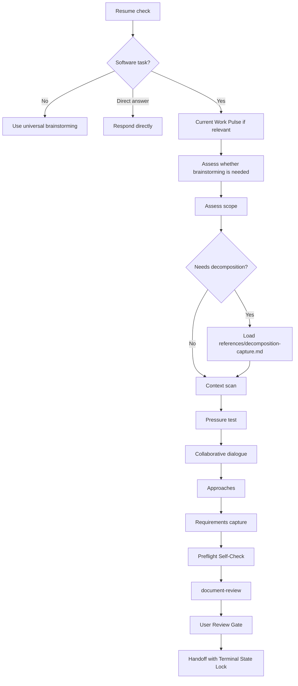

# Brainstorm a Feature or Improvement

**Note: The current year is 2026.** Use this when dating requirements documents.

Brainstorming helps answer **WHAT** to build through collaborative dialogue. It precedes `/spec:plan`, which answers **HOW** to build it.

The durable output of this workflow is a **requirements document**. In other workflows this might be called a lightweight PRD or feature brief. In compound engineering, keep the workflow name `brainstorm`, but make the written artifact strong enough that planning does not need to invent product behavior, scope boundaries, or success criteria.

This skill does not implement code. It explores, clarifies, and documents decisions for later planning or execution.

**IMPORTANT: All file references in generated documents must use repo-relative paths (e.g., `src/models/user.rb`), never absolute paths. Absolute paths break portability across machines, worktrees, and teammates.**

<HARD-GATE>
Do not jump to `/spec:work`, implementation skills, or environment-changing workflows until requirements are aligned and the terminal handoff rules explicitly allow that path. "Simple" work still requires alignment; the artifact may be brief, but the alignment step is not optional.
</HARD-GATE>

## Core Principles

1. **Assess scope first** - Match the amount of ceremony to the size and ambiguity of the work.
2. **Be a thinking partner** - Suggest alternatives, challenge assumptions, and explore what-ifs instead of only extracting requirements.
3. **Resolve product decisions here** - User-facing behavior, scope boundaries, and success criteria belong in this workflow. Detailed implementation belongs in planning.
4. **Keep implementation out of the requirements doc by default** - Do not include libraries, schemas, endpoints, file layouts, or code-level design unless the brainstorm itself is inherently about a technical or architectural change.
5. **Right-size the artifact** - Simple work gets a compact requirements document or brief alignment. Larger work gets a fuller document. Do not add ceremony that does not help planning.
6. **Apply YAGNI to carrying cost, not coding effort** - Prefer the simplest approach that delivers meaningful value. Avoid speculative complexity and hypothetical future-proofing, but low-cost polish or delight is worth including when its ongoing cost is small and easy to maintain.

## Interaction Rules

1. **Ask one question at a time** - Do not batch several unrelated questions into one message.
2. **Prefer single-select multiple choice** - Use single-select when choosing one direction, one priority, or one next step.
3. **Use multi-select rarely and intentionally** - Use it only for compatible sets such as goals, constraints, non-goals, or success criteria that can all coexist. If prioritization matters, follow up by asking which selected item is primary.
4. **Use the platform's question tool when available** - When asking the user a question, prefer the platform's blocking question tool if one exists (`AskUserQuestion` in Claude Code, `request_user_input` in Codex, `ask_user` in Gemini). Otherwise, present numbered options in chat and wait for the user's reply before proceeding.

## Output Guidance

- **Keep outputs concise** - Prefer short sections, brief bullets, and only enough detail to support the next decision.
- **Use repo-relative paths** - When referencing files, use paths relative to the repo root (e.g., `src/models/user.rb`), never absolute paths. Absolute paths make documents non-portable across machines and teammates.

## Anti-Pattern: "This Is Too Simple To Need Alignment"

Do not skip alignment just because a request looks small. A tiny change can still hide scope confusion, user-behavior ambiguity, or a better framing. The brainstorm can be short, but the alignment step still happens.

## Feature Description

<feature_description> #$ARGUMENTS </feature_description>

**If the feature description above is empty, ask the user:** "What would you like to explore? Please describe the feature, problem, or improvement you're thinking about."

Do not proceed until you have a feature description from the user.

## Execution Flow

## Process Flow



### Phase 0: Resume, Assess, and Route

#### 0.1 Resume Existing Work When Appropriate

If the user references an existing brainstorm topic or document, or there is an obvious recent matching `*-requirements.md` file in `docs/brainstorms/`:
- Read the document
- Confirm with the user before resuming: "Found an existing requirements doc for [topic]. Should I continue from this, or start fresh?"
- If resuming, summarize the current state briefly, continue from its existing decisions and outstanding questions, and update the existing document instead of creating a duplicate

#### 0.1a Current Work Pulse

Before continuing, decide whether a lightweight Current Work Pulse is useful. Trigger it only when at least one of these is true:
- The user says "continue the previous brainstorm" or similar
- Phase 0.1 resumed an existing requirements document
- The current topic is obviously related to recent commits
- The working tree has obviously related dirty changes

If triggered:
- Review only a lightweight pulse: recent 5-10 commit summaries plus affected paths, and `git status --short` only when useful
- Summarize:
  - what changed recently
  - what might affect this brainstorm
  - what still needs explicit confirmation in the requirements
- Treat the pulse as situational context, not as an implicit product decision
- Do **not** turn this into a code review or file-by-file audit
- If the brainstorm is being resumed or clearly re-anchored, give a short alignment anchor before moving on:
  - `Restated Understanding`
  - `Current Core Goal`
  - `Scope / Non-goals`
- For lightweight work, 1-2 sentences can cover the same ground. Do not force a rigid template on every turn.

If not triggered, skip it silently.

#### 0.1b Classify Task Domain

Before proceeding to Phase 0.2, classify whether this is a software task. The key question is: **does the task involve building, modifying, or architecting software?** -- not whether the task *mentions* software topics.

**Software** (continue to Phase 0.2) -- the task references code, repositories, APIs, databases, or asks to build/modify/debug/deploy software.

**Non-software brainstorming** (route to universal brainstorming) -- BOTH conditions must be true:
- None of the software signals above are present
- The task describes something the user wants to explore, decide, or think through in a non-software domain

**Neither** (respond directly, skip all brainstorming phases) -- the input is a quick-help request, error message, factual question, or single-step task that doesn't need a brainstorm.

**If non-software brainstorming is detected:** Read `references/universal-brainstorming.md` and use those facilitation principles to brainstorm with the user naturally. Do not follow the software brainstorming phases below.

#### 0.2 Assess Whether Brainstorming Is Needed

**Clear requirements indicators:**
- Specific acceptance criteria provided
- Referenced existing patterns to follow
- Described exact expected behavior
- Constrained, well-defined scope

**If requirements are already clear:**
Keep the interaction brief. Confirm understanding and present concise next-step options rather than forcing a long brainstorm. Only write a short requirements document when a durable handoff to planning or later review would be valuable. Skip Phase 1.1 and 1.2 entirely — go straight to Phase 1.3 or Phase 3.

#### 0.3 Assess Scope

Use the feature description plus a light repo scan to classify the work:
- **Lightweight** - small, well-bounded, low ambiguity
- **Standard** - normal feature or bounded refactor with some decisions to make
- **Deep** - cross-cutting, strategic, or highly ambiguous

If the scope is unclear, ask one targeted question to disambiguate and then proceed.

#### 0.3a Scope Decomposition

Before spending several rounds refining details, check whether the request should be decomposed into multiple sub-project brainstorms first.

Use a conservative trigger:
- The request appears to contain 3 or more distinct functional areas or subsystems
- And at least one of these is also true:
  - the description is long or broad enough that planning would have to invent product structure
  - it uses platform / ecosystem / suite language
  - it spans 3 or more user roles or operating surfaces

If decomposition is warranted:
- Ask whether to decompose now or continue as one brainstorm
- If the user chooses decomposition:
  - Read `references/decomposition-capture.md`
  - Write `docs/brainstorms/YYYY-MM-DD-<epic>-decomposition.md`
  - Ask which sub-project to start with
  - Continue this workflow for the first selected sub-project
- If the user chooses to keep it together:
  - Record a Key Decision that the user accepted higher planning complexity by keeping multiple subsystems in one brainstorm

If the user explicitly says "skip future gates" for this run, you may treat this decomposition decision as pre-approved for the current invocation only. Never persist that preference across sessions. Never use it to bypass the Terminal State Lock escape hatch later.

### Phase 1: Understand the Idea

#### 1.1 Existing and Supplemental Context Scan

Scan the repo before substantive brainstorming. Match depth to scope:

**Lightweight** — Search for the topic, check if something similar already exists, and move on.

**Standard and Deep** — Two passes:

*Constraint Check* — Check project instruction files (`AGENTS.md`, and `CLAUDE.md` only if retained as compatibility context) for workflow, product, or scope constraints that affect the brainstorm. If these add nothing, move on.

*Topic Scan* — Search for relevant terms. Read the most relevant existing artifact if one exists (brainstorm, plan, spec, skill, feature doc). Skim adjacent examples covering similar behavior.

If nothing obvious appears after a short scan, say so and continue. Two rules govern technical depth during the scan:

1. **Verify before claiming** — When the brainstorm touches checkable infrastructure (database tables, routes, config files, dependencies, model definitions), read the relevant source files to confirm what actually exists. Any claim that something is absent — a missing table, an endpoint that doesn't exist, a dependency not in the manifest, a config option with no current support — must be verified against the codebase first; if not verified, label it as an unverified assumption. This applies to every brainstorm regardless of topic.

2. **Defer design decisions to planning** — Implementation details like schemas, migration strategies, endpoint structure, or deployment topology belong in planning, not here — unless the brainstorm is itself about a technical or architectural decision, in which case those details are the subject of the brainstorm and should be explored.

**Supplemental context** (opt-in / source-driven) — external readers never auto-dispatch from topic alone. Route by condition:

Use bare agent names inside Task calls.

- **Explicit local path or repo doc path**
- Task spec-first:research:local-doc-reader(Read the explicit local document path(s) relevant to this brainstorm. Return a research digest, not raw excerpts. {brainstorm topic summary})

- **Institutional knowledge intent** (`docs/solutions/`, prior learnings, "have we solved this before?")
- Task spec-first:research:learnings-researcher({brainstorm topic summary})

- **Explicit GitHub URL**
- Task spec-first:research:github-context-reader(Read the provided GitHub URL and return a research digest. {brainstorm topic summary})

- **Explicit documentation URL**
- Task spec-first:research:docs-context-reader(Read the provided documentation URL and return a research digest. {brainstorm topic summary})

- **Explicit generic http/https URL**
- Task spec-first:research:web-context-reader(Read the provided web URL and return a research digest. {brainstorm topic summary})

- **No explicit source + user asked for skill/tool discovery**: Only use `find-skills` when the current environment clearly exposes it. Never assume it is repo-bundled. If it is unavailable, say so and continue the brainstorm without blocking.

Additional routing rules:
- `local-doc-reader` handles explicit file reads. It does **not** replace `learnings-researcher` for `docs/solutions/` topic search.
- If the user gives an explicit `docs/solutions/...` file path, `local-doc-reader` may read that file directly, but do not also trigger `learnings-researcher` unless the user asks for broader prior-art search.
- When no explicit supplemental source was provided, do not automatically search GitHub, the web, or docs sites. You may note that those source types can be incorporated if the user provides them.

All supplemental readers must return a **research digest** with this contract:

```markdown
## Research Digest
- **Source Type:** `<local-doc|github-url|docs-url|web-url|learnings>`
- **Source Ref:** `<path, URL, or search scope>`
- **Status:** `success | no-result | tool-unavailable | permission-denied | source-unparseable | executor-unavailable`
- **Research Value:** `<high|moderate|low|none>`

### Summary
[Concise synthesis, never raw dumps]

### Constraints
- [Relevant constraint]

### Open Questions
- [Question still unresolved]

### Evidence
- [Quoted path, URL, page, section, or thread reference]
```

Failure handling rules:
- **`no-result`** -- no relevant context was found for the requested source
- **`tool-unavailable`** -- the required API, MCP, CLI, or host integration is not available
- **`permission-denied`** -- the source exists but cannot be accessed with current credentials or permissions
- **`source-unparseable`** -- the source exists but could not be parsed into usable content
- **`executor-unavailable`** -- the required page/document executor is not installed or cannot run in this environment

When a supplemental reader returns any non-`success` status:
- Surface the status to the user visibly
- Do not silently ignore the failure
- Continue the brainstorm unless the user explicitly says the external context is mandatory
- If the status is `executor-unavailable`, tell the user that the current environment does not support page reading for this source type; do not retry repeatedly unless the user changes the source or environment; for document-type sources (web pages, docs URLs), suggest using a local file path or pasting the content manually instead

If Phase 0.1a produced a Current Work Pulse, incorporate it here as lightweight context only. Recent commits or dirty changes can inform what to confirm, but they do not automatically settle product behavior.

When the conversation has drifted, resumed, or is about to move from exploration into requirements capture, briefly restate the current understanding and core goal before continuing. Keep it short and only surface the boundary that matters now.

#### 1.2 Product Pressure Test

Before generating approaches, challenge the request to catch misframing. Match depth to scope:

**Lightweight:**
- Is this solving the real user problem?
- Are we duplicating something that already covers this?
- Is there a clearly better framing with near-zero extra cost?

**Standard:**
- Is this the right problem, or a proxy for a more important one?
- What user or business outcome actually matters here?
- What happens if we do nothing?
- Is there a nearby framing that creates more user value without more carrying cost? If so, what complexity does it add?
- Given the current project state, user goal, and constraints, what is the single highest-leverage move right now: the request as framed, a reframing, one adjacent addition, a simplification, or doing nothing?
- Favor moves that compound value, reduce future carrying cost, or make the product meaningfully more useful or compelling
- Use the result to sharpen the conversation, not to bulldoze the user's intent

**Deep** — Standard questions plus:
- What durable capability should this create in 6-12 months?
- Does this move the product toward that, or is it only a local patch?

#### 1.3 Collaborative Dialogue

Follow the Interaction Rules above. Use the platform's blocking question tool when available.

**Guidelines:**
- Ask what the user is already thinking before offering your own ideas. This surfaces hidden context and prevents fixation on AI-generated framings.
- Start broad (problem, users, value) then narrow (constraints, exclusions, edge cases)
- Clarify the problem frame, validate assumptions, and ask about success criteria
- Make requirements concrete enough that planning will not need to invent behavior
- Surface dependencies or prerequisites only when they materially affect scope
- Resolve product decisions here; leave technical implementation choices for planning
- Bring ideas, alternatives, and challenges instead of only interviewing

**Exit condition:** Continue until the idea is clear OR the user explicitly wants to proceed.

### Phase 2: Explore Approaches

If multiple plausible directions remain, propose **2-3 concrete approaches** based on research and conversation. Otherwise state the recommended direction directly.

Use at least one non-obvious angle — inversion (what if we did the opposite?), constraint removal (what if X weren't a limitation?), or analogy from how another domain solves this. The first approaches that come to mind are usually variations on the same axis.

Present approaches first, then evaluate. Let the user see all options before hearing which one is recommended — leading with a recommendation before the user has seen alternatives anchors the conversation prematurely.

When useful, include one deliberately higher-upside alternative:
- Identify what adjacent addition or reframing would most increase usefulness, compounding value, or durability without disproportionate carrying cost. Present it as a challenger option alongside the baseline, not as the default. Omit it when the work is already obviously over-scoped or the baseline request is clearly the right move.

For each approach, provide:
- Brief description (2-3 sentences)
- Pros and cons
- Key risks or unknowns
- When it's best suited

After presenting all approaches, state your recommendation and explain why. Prefer simpler solutions when added complexity creates real carrying cost, but do not reject low-cost, high-value polish just because it is not strictly necessary.

If one approach is clearly best and alternatives are not meaningful, skip the menu and state the recommendation directly.

If relevant, call out whether the choice is:
- Reuse an existing pattern
- Extend an existing capability
- Build something net new

### Phase 3: Capture the Requirements

Write or update a requirements document only when the conversation produced durable decisions worth preserving. Read `references/requirements-capture.md` for the document template, formatting rules, visual aid guidance, and completeness checks.

For **Standard** and **Deep** work, use the section-by-section confirmation flow from `references/requirements-capture.md` instead of drafting the full document in one shot. Confirm each section in chat first, then write the requirements document once all sections are aligned.

If this brainstorm is operating inside an epic decomposition path, read `references/decomposition-capture.md` before writing the sub-project requirements document so the frontmatter and epic linkage stay consistent.

For **Lightweight** brainstorms, keep the document compact. Skip document creation when the user only needs brief alignment and no durable decisions need to be preserved.

When a document will hand off to planning, make sure the requirements capture leaves behind a clear `Verification-as-Done` direction through concrete success criteria. Do not add a separate done section here; make the success criteria sharp enough that planning can convert them into `Verification` without inventing behavior.

#### 3.4 Preflight Self-Check

When a requirements document was created or updated, run a low-cost deterministic preflight before document-review.

Check these four things:
- Placeholder scan — `TODO`, `TBD`, incomplete sections, or obvious placeholders
- Contradiction scan — requirements, success criteria, scope boundaries, and key decisions disagreeing with each other
- Scope sanity — the document has expanded into multiple independent subsystems and should decompose first
- Ambiguity scan — wording loose enough that planning could produce two materially different implementations

If an issue can be fixed inline without changing intent, fix it before review.

If the issue needs user intent, return to the relevant section and confirm it before proceeding.

If the brainstorm is Lightweight and no requirements doc was written, this step is a no-op.

### Phase 3.5: Document Review

When a requirements document was created or updated, run the `document-review` skill on it before presenting handoff options. Pass the document path as the argument.

If document-review returns findings that were auto-applied, note them briefly when presenting handoff options. If residual P0/P1 findings were surfaced, mention them so the user can decide whether to address them before proceeding.

When document-review returns "Review complete", proceed to Phase 4.

#### 3.6 User Review Gate

When a requirements document exists, add a separate user review gate after document-review and before any handoff.

Ask the user to open the document and confirm that it reflects their real intent before continuing.

Rules:
- If the user requests changes, return to Phase 3, update the relevant section, then re-run Phase 3.4 and Phase 3.5 as needed
- If the user explicitly says to skip this gate, record that decision in the requirements doc as a Key Decision for this run
- If the user explicitly says "skip future gates" for this run, you may also treat this gate as pre-approved for the current invocation only
- Never persist skip-gate preferences across sessions
- Never let skip-gate preferences bypass the Terminal State Lock escape hatch
- If no requirements document exists, this gate can be skipped automatically

### Phase 4: Handoff and Terminal State Lock

Before offering or executing any next step, read `references/handoff.md` and enforce its Terminal State Lock.

This workflow intentionally diverges from the single-exit superpowers model. The allowed exits are:
- planning
- eligible direct-to-work
- additional document review
- continuing the brainstorm
- lightweight sharing such as Proof

Unlisted next steps are denied unless the handoff rules explicitly allow them via the escape hatch.

Present next-step options and execute the user's selection. Read `references/handoff.md` for the option logic, dispatch instructions, and closing summary format.
