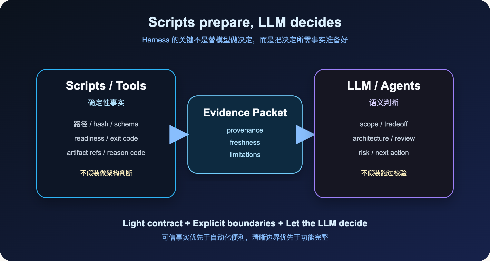
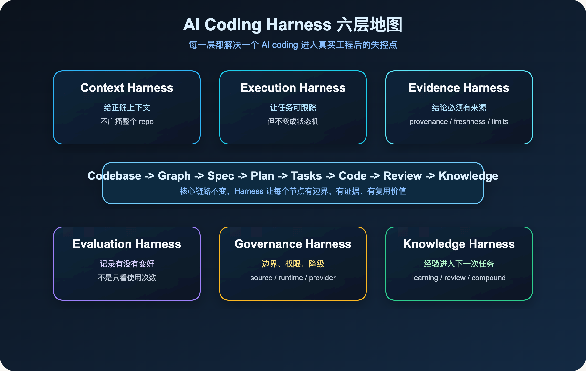

**把不稳定的 AI 推理，放进可重复、可观察、可约束、可验证的工程闭环。**

> **导读**
> 这一篇只回答一个问题：`spec-first` 到底是什么？
> 我的最新答案是：它不是 prompt pack，也不是 agent collection，而是一层面向真实软件工程的 **AI Coding Harness**。

上一篇我写的是：

> **AI Coding 不是 Prompt 问题，而是 Workflow 问题。**

这句话仍然成立。

但如果继续往工程落地看，`Workflow` 还不够准确。

Workflow 说明了“有一条流程”。而真实工程里更难的事情，是让 AI 的每一次判断都发生在更稳定的条件下：上下文可信、边界清楚、执行可追踪、结论有证据、失败能降级、经验能沉淀。

这就是我现在更愿意用 **Harness** 描述 `spec-first` 的原因。

先用一张图定位这个变化：


---

## 01 从 Prompt 到 Harness

如果把 AI coding 的问题理解成“模型还不够聪明”，我们自然会走向两个方向：找更强模型，写更长 prompt。

这两件事当然有价值，但它们只能解决一部分问题。

一个模型再强，如果它不知道当前代码库的真实结构，它还是会猜。

一个 prompt 再长，如果里面混着过期文档、生成产物、未验证的 provider 结果，它还是会被污染。

一个 agent 再能执行，如果计划没有边界、review 没有证据、失败没有记录，它还是会把任务做成一段不可复盘的临时对话。

所以，真实工程里的关键问题不是继续追问：

> 怎么让模型更会写代码？

而是追问：

> 怎么让模型的每一次判断，都在可治理的工程环境里发生？

这就是 Harness。

**Prompt 让模型知道你想要什么。Harness 让模型在可验证的工程条件下完成它。**

---

## 02 Harness 到底承载什么

我对 Harness 的理解很简单：

> Harness 不是再套一层流程，也不是写一堆更复杂的 prompt。它是在 AI 和真实工程之间放一层承载结构，让模型可以在更稳定的工程条件下工作。

这层结构至少要负责六件事：

- 给 AI 正确上下文，而不是无限上下文
- 让任务目标和边界显式化
- 让执行过程可追踪
- 让结论有证据来源
- 让失败有降级路径
- 让经验能沉淀到下一次任务里

注意这里的重点不是“替模型思考”。

`spec-first` 不想把所有判断写死，也不想让脚本模拟架构师。它想做的是把模型放到更好的工程输入、执行边界和验证环境里。

换句话说：

> Harness 的目标不是替模型思考，而是让模型在更好的工程条件下思考。

---

## 03 为什么不是 Prompt Collection

Prompt 很重要。

但 prompt 很容易变成瞬时输入。

今天你在一个会话里写了一段很好的约束：

```text
你要先看代码结构，再给计划，再改文件，最后跑测试。
```

这当然有用。

但下一次呢？下一个会话呢？另一个 teammate 的机器上呢？Claude Code 和 Codex 同时使用时呢？

如果这些约束只存在于聊天窗口里，它们很难成为工程系统的一部分。

`spec-first` 想做的事情，是把关键约束变成项目内可复用的结构：需求进入 requirements brief，计划进入 plan，任务进入 task pack，review 形成结构化 findings，debug 留下 hypothesis ledger，经验沉淀进 `docs/solutions/`，host runtime 从 source 生成，而不是手工维护副本。

这不是 prompt 技巧。

这是工程承载层。

所以我现在更愿意这样定义 `spec-first`：

> **spec-first = AI Coding Harness for spec-driven software engineering**

它不是要替代模型，也不是要替工程师做所有决定。

它只是把 AI coding 从一次性对话，放进一个更可治理的工程闭环。

---

## 04 为什么不是复杂状态机

另一种误解是：既然要治理 AI，是不是应该把所有步骤都写死？

例如：

```text
第一步必须读 A
第二步必须读 B
第三步必须输出 C
第四步必须调用 D
```

我不这么看。

真实软件工程里，很多关键判断都是语义判断。

比如这次改动到底算 bug fix，还是行为变更？一个 review finding 是否真的成立？Graph 结果只是 pointer，还是已经足够影响计划？一个旧 learning 现在还适用吗？当前任务应该继续做，还是回到 brainstorm 澄清 scope？

这些问题不适合交给脚本硬编码。

真正需要被写死的，不是判断本身，而是判断前后的边界。



### ▍脚本负责确定性事实

脚本擅长做这些事情：

- 文件发现
- 路径解析
- git 状态读取
- schema 校验
- hash 计算
- readiness 检查
- runtime asset 同步
- reason code 输出
- artifact path 输出

这些事实应该可复验、可追踪、可失败。

脚本不应该假装自己是架构师。

### ▍LLM 负责语义判断

LLM 和 agent 擅长做的是另一类事情：需求理解、架构取舍、计划拆分、review 判断、风险解释、fallback 决策和下一步建议。

所以 `spec-first` 里有一个非常重要的原则：

> **Scripts prepare, LLM decides.**

脚本准备事实，LLM 做判断。

这不是一句口号。它决定了整个系统的边界。

如果反过来，让脚本模拟架构判断，系统会变成脆弱的规则引擎。

如果让 LLM 假装自己跑过确定性校验，系统会变成不可验证的幻觉。

Harness 的价值，是把这两边接起来：事实来自可复验的工具和脚本，判断来自 LLM，中间用 evidence、artifact、reason code、limitations 连接。

这一层的关键不是“自动化越多越好”，而是边界必须显式。

---

## 05 spec-first 的六层 Harness

如果把 `spec-first` 拆开看，它大致有六层。

这六层不是六个功能菜单，而是六个工程问题：输入是否可信，执行是否可追踪，结论是否有证据，结果是否真的变好，边界是否可治理，经验是否能沉淀。



### ▍1. Context Harness：给模型正确上下文

AI coding 最常见的问题之一，是模型拿到的上下文不稳定。

很多人会自然想到一个解法：那就多给点上下文。

但真正重要的不是更多上下文，而是正确上下文。

在 `spec-first` 里，Context Harness 关心的是：哪些项目指令已经被宿主加载过，哪些源码、测试、diff 和 plan 是当前任务必须读的，哪些 provider facts 只是 advisory，哪些 graph evidence 已经 stale，哪些 generated runtime mirror 默认不该当 source-of-truth。

这一层解决的是：

> 给模型正确上下文，而不是无限上下文。

下一篇我会专门写这个主题：**正确上下文不是无限上下文。**

### ▍2. Execution Harness：让执行不漂移

很多 AI coding 的失败，不是第一步就错了，而是执行中慢慢漂移。

一开始任务说的是“修复登录错误提示”。做着做着，模型可能开始重构认证模块、改 UI 组件、顺手调整样式，最后变成另一个任务。

Execution Harness 的作用，是让任务在 plan、task、work、review 之间能传递 scope、task identity、repo scope 和 handoff evidence。

它不是状态机。

它不规定每个任务必须走同样路线。

但它要求关键边界留下来：要做什么，不做什么，影响哪些文件，怎么验证，失败怎么处理，完成后交给谁消费。

这一层解决的是：

> 任务可以交给 AI 执行，但 scope 和 handoff 不能丢。

### ▍3. Evidence Harness：结论必须带来源

这是 AI coding 走向工程化时最重要的一层。

很多时候，AI 的回答听起来很合理。但你继续追问“这个结论从哪里来”，就会发现它只是“看起来像”。

Evidence Harness 要求结论必须带来源。

在 `spec-first` 里，证据不是一个模糊词。它会区分 `confirmed`、`session-local`、`advisory` 和 `stale`。

因为 GitNexus、ast-grep、MCP provider、session history 都很有价值，但它们不能自动变成真相。

Provider evidence 可以提供线索。最终 finding、root cause、scope change 仍然要由 source、test、log、schema、contract 或用户确认来支撑。

这一层解决的是：

> AI 的结论必须能回答：证据从哪里来？

### ▍4. Evaluation Harness：记录是否真的变好

很多 AI 工具会告诉你用了多少次、节省了多少时间、自动生成了多少代码。

这些指标有用，但不够。

`spec-first` 更关心的是：review 质量有没有提高，debug 命中率有没有提高，graph evidence 是否真的帮助减少误判，workflow 产物是否被下游消费，新增规则是否减少了重复失败。

Evaluation Harness 不只是统计使用量。

它应该回答：

> 这套 AI coding workflow 有没有真的让工程质量变好？

这件事很难。

但如果不开始记录，AI coding 就很容易停留在“感觉有效”。

### ▍5. Governance Harness：守住 source 和 runtime 边界

这层保护的是系统长期可用。

比如 source-of-truth 和 generated runtime 的边界，Claude Code 和 Codex 双宿主的 runtime 生成边界，provider readiness 的 freshness 和 degraded mode，mutation capability 的 preview-first，raw provider output 不进入 durable docs，secret 和 credential 不进入持久产物。

这些东西在 demo 里不显眼，但在真实项目里非常重要。

一个例子：如果 `.agents/skills/` 里的 runtime 副本过期了，最容易的修法是直接改它。

但这就是错的。

正确做法是回到 `skills/`、`agents/`、`templates/` 这些 source-of-truth，修源头，再通过 `spec-first init` 或生成链刷新 runtime。

否则系统会开始漂移：source 说一套，runtime 跑一套，review 看另一套，下次 init 又覆盖回来。

Governance Harness 不是为了让流程变重。

它是为了让系统不因为一次“临时修一下”而失去可信边界。

### ▍6. Knowledge Harness：让经验进入下一次任务

AI coding 最大的浪费之一，是每次任务都从零开始。

同一个坑，今天踩一次。下周换个会话，再踩一次。再过一周换个模型，又踩一次。

如果一次 bugfix、一次 review failure、一次 release 踩坑，最后只留在聊天记录里，它就没有进入工程系统。

Knowledge Harness 要做的是：把已验证的经验沉淀下来，让它可以被后续 workflow 发现，允许它被刷新、合并、替换或废弃，同时不要求每次 workflow 都全量读取知识库。

所以 `docs/solutions/` 对我来说不是文档堆。

它是团队和 AI 共同积累出来的工程记忆。

这一层解决的是：

> 每次任务都让下一次任务更容易一点。

---

## 06 Harness 不是让人退出流程

很多人讲 AI agent，会自然走向一个方向：人越少介入越好。

我不完全认同。

在真实工程里，人不应该退出。人的角色应该变化。

以前，人的主要价值是亲手写每一行代码。现在，人的价值越来越多地体现在：定义目标，明确边界，判断 tradeoff，审查证据，接受或拒绝风险，把经验沉淀成下一次输入。

Harness 不是为了把人赶走。

Harness 是为了让人不用盯着每一行生成过程，而是可以站在更高层审查：目标对不对，输入够不够，计划稳不稳，证据可信不可信，结果能不能交付，经验有没有留下来。

写代码只是其中一环。

决定该写什么、为什么这样写、怎么证明写对了、下次怎么少踩坑，才是更大的系统问题。

---

## 07 spec-first 想成为哪一层

回到 `spec-first`。

它不是模型，不是 IDE，不是一个 agent 平台，也不是一个“万能自动开发系统”。

我现在更愿意把它放在这个位置：

```text
Codebase
  -> Graph
  -> Spec
  -> Plan
  -> Tasks
  -> Code
  -> Review
  -> Knowledge
```

`spec-first` 做的是这条链路上的 Harness。

在 Codebase 和 Graph 之间，它帮助 AI 拿到更可靠的代码事实。

在 Spec 和 Plan 之间，它把模糊意图变成可审查的工程输入。

在 Work 和 Review 之间，它让实现、验证和风险都有记录。

在 Review 和 Knowledge 之间，它把一次经验沉淀成下一次优势。

这也是为什么它要同时关心 CLI、skills、agents、contracts、generated runtime、changelog、`docs/solutions/`、graph readiness 和 review evidence。

这些东西单独看都不性感。

但合在一起，它们回答的是同一个问题：

> 怎样让 AI coding 从一次性对话，变成可治理、可验证、可复用、可沉淀的工程闭环？

这就是 AI Coding Harness。

---

## 08 一个简单自测

最后，给一个很简单的自测。

如果你现在的 AI coding 过程里，已经能稳定回答下面这些问题，那你可能暂时不需要 `spec-first` 这种 Harness：

- 当前任务的目标离开聊天窗口后，还能被别人读懂吗？
- AI 做计划时，是否知道哪些代码事实可信？
- 实现过程中，scope 是否会被显式约束？
- Review 结论是否能说明证据来源和残余风险？
- 工具或 provider 不可用时，workflow 是否会显式降级？
- 这次解决的问题，是否会成为下次任务的输入优势？

如果这些问题里，有一半以上答案是不确定的，那么问题大概率不是 prompt 不够好。

问题是：

> **你还缺一层 AI Coding Harness。**

这也是 `spec-first` 接下来想持续做下去的事情。

下一篇，我想写：

> **为什么你不敢把任务真正交给 AI**

你不是不想委派。

你只是不知道该如何相信它。

而 Harness 要解决的，正是这个信任问题。

---

## 本篇小结

如果只用一句话总结：

> **AI Coding Harness 的价值，不是让模型替你做所有决定，而是让模型的每一次决定都发生在更好的工程条件里。**

这也是我理解的 `spec-first`：

不是 prompt pack。

不是 agent collection。

不是复杂状态机。

而是一层让 AI coding 可治理、可验证、可复用、可沉淀的工程 Harness。

更具体地说，它想守住三件事：

- **输入可信**：模型看到的上下文、证据和边界尽量可靠
- **过程可查**：计划、执行、验证、review 不只留在聊天窗口
- **经验可复用**：这次解决过的问题，能降低下一次的成本

如果 Prompt 解决的是“怎么让模型听懂我”。

那 Harness 解决的是：

> **怎么让模型的判断进入真正的工程闭环。**
