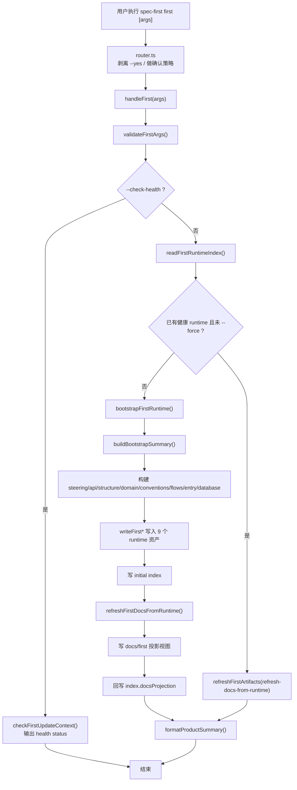
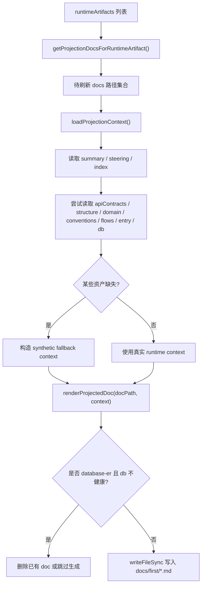
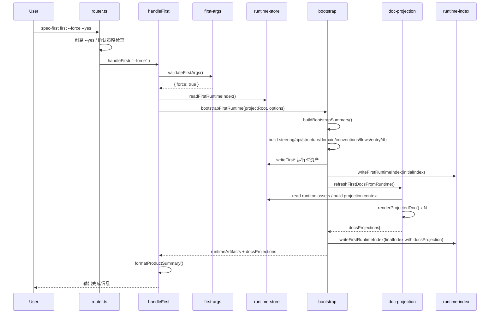

# First 生成阶段深度分析

日期：2026-03-19

范围：
- `src/cli/router.ts`
- `src/cli/index.ts`
- `src/cli/commands/first.ts`
- `src/core/skill-runtime/first-args.ts`
- `src/core/skill-runtime/first-bootstrap.ts`
- `src/core/skill-runtime/first-context.ts`
- `src/core/skill-runtime/first-runtime-store.ts`
- `src/core/skill-runtime/first-doc-projection.ts`
- `src/core/skill-runtime/first-artifact-mapping.ts`
- `src/core/skill-runtime/first-change-detector.ts`
- `tests/integration/first-cli-real-flow.test.ts`

## 1. 结论

当前 `first` 的生成阶段确实偏复杂，而且复杂度不是单点，而是四层叠加：

1. 命令入口分层
2. runtime truth 资产生成分层
3. projection 文档投影分层
4. refresh / index / health / git 变更感知分层

如果只看用户入口，生成阶段像一个命令：

```bash
spec-first first
```

如果看内部实现，生成阶段实际是一条多段流水线：

- router 确认层
- `first.ts` 分支决策层
- bootstrap 资产构造层
- runtime store 写入层
- projection 渲染层
- runtime index 回填层
- health / refresh / changed-files 感知层

一句话判断：

- 生成阶段的真实实现已经不是“生成文档”，而是“生成一个受索引、健康状态、增量刷新和投影视图约束的 runtime 子系统”

## 2. 生成阶段的边界

这里定义的“生成阶段”包括：

### 2.1 入口

- 用户执行 `spec-first first`
- CLI router 处理确认和参数转发
- `handleFirst()` 选择分支

### 2.2 生成目标

正式真源：

- `.spec-first/runtime/first/summary.json`
- `.spec-first/runtime/first/steering.json`
- `.spec-first/runtime/first/conventions.json`
- `.spec-first/runtime/first/critical-flows.json`
- `.spec-first/runtime/first/entry-guide.json`
- `.spec-first/runtime/first/api-contracts.json`
- `.spec-first/runtime/first/structure-overview.json`
- `.spec-first/runtime/first/domain-model.json`
- `.spec-first/runtime/first/database-schema.json`
- `.spec-first/runtime/first/index.json`

正式投影视图：

- `docs/first/*.md`

### 2.3 不纳入本次重点

虽然这些模块会影响生成阶段，但它们更偏维护治理：

- `first-governance.ts`
- `first-incremental-update.ts`

本文只在生成阶段和它们的交界处提到，不把它们当主体。

## 3. 生成阶段总流程图



## 4. 控制流拆解

## 4.1 Router 层

文件：

- [router.ts](/Users/kuang/xiaobu/spec-first/src/cli/router.ts)

router 做了两件事：

1. 从参数里统一剥离 `--yes`
2. 根据 `registerCommand(... requiresConfirmation ...)` 判断是否需要确认

对 `first` 来说：

- `--yes` 不是业务参数
- `--yes` 是 router 级确认参数
- `first` 自己并不知道 `--yes`

这会导致一个认知分层：

- 用户看到的是 `spec-first first --yes`
- `first.ts` 真正接收到的只有剥离后的参数

这是生成阶段的第一层隐式复杂度。

## 4.2 first 参数层

文件：

- [first-args.ts](/Users/kuang/xiaobu/spec-first/src/core/skill-runtime/first-args.ts)

`first` 自己识别的参数是：

- `--force`
- `--check-health`
- `--type=<platform>`
- `--update=...` 和 `--since=...` 目前协议里已有，但主流程未充分启用

这里有一个重要现象：

- 文档/使用层经常提 `--yes`
- 生成实现层真正关心的是 `--force`

所以 today 的生成阶段参数协议被切成了两层：

- router 协议
- first 业务协议

## 4.3 handleFirst 分支层

文件：

- [first.ts](/Users/kuang/xiaobu/spec-first/src/cli/commands/first.ts)

`handleFirst()` 的分支只有三类，但每类后面都很重：

### 分支 A: `--help`

最简单。

### 分支 B: `--check-health`

调用：

- `checkFirstUpdateContext(projectRoot)`
- `formatHealthStatus(context)`

这条分支不生成资产，但它依赖完整的 runtime/index/projection 健康判断体系。

### 分支 C: 正常生成/刷新

逻辑：

1. `readFirstRuntimeIndex(projectRoot)`
2. 判断 `hasHealthyRuntime`
3. 若已有健康 runtime 且没 `--force`，只做 `refresh-docs-from-runtime`
4. 否则执行 `bootstrapFirstRuntime()`

这里的关键点是：

- “生成阶段”的主入口里，实际上混入了“刷新 docs from runtime”的轻量路径
- 所以 today 的 `first` 不是纯生成器，而是“生成 + 轻刷新”的统一入口

## 5. 数据流拆解

## 5.1 输入数据来源

生成阶段的数据不是来自一个 schema，而是来自散落式探测：

- `package.json`
- `bin` / `name`
- `engines.node`
- `dependencies` / `devDependencies`
- `tsconfig.json`
- `pnpm-lock.yaml` / `pnpm-workspace.yaml`
- `src/` 顶层目录
- 常见入口文件
- `specs/`
- `.spec-first/`
- Prisma schema 文件
- git commit

这意味着生成阶段的输入不是“受约束的配置输入”，而是“代码库 heuristics 推断输入”。

这是复杂度的重要来源，因为：

- 推断规则天然分散
- 每加一种项目形态，规则会继续膨胀

## 5.2 输出数据模型

生成阶段产出 3 层结果：

1. 运行时资产对象
2. 投影视图 markdown
3. runtime index 元数据

也就是：

```text
项目事实
  -> runtime asset objects
  -> runtime json files
  -> docs projection markdown
  -> index metadata
```

这不是“一次写文件”，而是多种输出同时维护。

## 6. bootstrap 详细流程

文件：

- [first-bootstrap.ts](/Users/kuang/xiaobu/spec-first/src/core/skill-runtime/first-bootstrap.ts)

bootstrap 是生成阶段最核心的实现。

## 6.1 buildBootstrapSummary

`buildBootstrapSummary()` 负责生成总摘要，它是后续几乎所有资产的根输入。

它内部会依次调用：

- `readPackageJson()`
- `resolvePlatformType()`
- `detectModules()`
- `detectEntryPoints()`
- `detectApiSurface()`
- `detectCapabilities()`
- `detectDataModels()`
- `detectTechStack()`
- `detectRisks()`
- `detectEvidence()`
- `detectOverview()`

也就是说，生成阶段首先构造的是一个“项目摘要中间态”。

这个中间态再被用于派生其他资产。

### 复杂度来源

这里的复杂度不是算法复杂，而是“规则拼装复杂”：

- 每个 detect 函数都依赖不同文件约定
- 大量默认值和 fallback
- 高度基于约定而不是明确声明

## 6.2 从 summary 派生其他 runtime 资产

bootstrap 接着通过 summary 派生：

- `buildBootstrapSteering(summary)`
- `buildBootstrapApiContracts(summary)`
- `buildBootstrapStructureOverview(summary)`
- `buildBootstrapDomainModel(summary)`
- `buildBootstrapDatabaseSchema(projectRoot)`
- `buildFirstConventions(summary)`
- `buildFirstCriticalFlows(summary)`
- `buildFirstEntryGuide(summary)`

这里出现了第二层复杂度：

- 有些资产在 `first-bootstrap.ts` 内构建
- 有些资产委托给 `first-conventions.ts` / `first-critical-flows.ts` / `first-entry-guide.ts`

所以资产生成逻辑是分散的，不在一个统一 builder registry 里。

## 6.3 runtime 资产写入顺序

当前写入顺序是：

1. `writeFirstRuntimeSummary`
2. `writeFirstApiContracts`
3. `writeFirstStructureOverview`
4. `writeFirstDomainModel`
5. `writeFirstSteering`
6. `writeFirstConventions`
7. `writeFirstCriticalFlows`
8. `writeFirstEntryGuide`
9. 条件写 `writeFirstDatabaseSchema`

然后：

10. 写 `initialIndex`
11. 调 `refreshFirstDocsFromRuntime()`
12. 再写一次 index，把 `docsProjection` 补上

这一点非常关键：

- index 写了两次
- 先有 runtime index
- 后有 projection index

所以 index 不是一次性写完的，而是一个“两阶段提交”的近似模式。

## 6.4 bootstrap 写入流程线图

```text
bootstrapFirstRuntime()
  -> buildBootstrapSummary()
    -> detect package / techStack / modules / entryPoints / apiSurface / risks / evidence
  -> buildBootstrapSteering(summary)
  -> buildBootstrapApiContracts(summary)
  -> buildBootstrapStructureOverview(summary)
  -> buildBootstrapDomainModel(summary)
  -> buildBootstrapDatabaseSchema(projectRoot)
  -> buildFirstConventions(summary)
  -> buildFirstCriticalFlows(summary)
  -> buildFirstEntryGuide(summary)
  -> write runtime json assets
  -> build initialIndex
  -> writeFirstRuntimeIndex(initialIndex)
  -> refreshFirstDocsFromRuntime()
  -> write docs/first/*.md
  -> rebuild docsProjection entries
  -> writeFirstRuntimeIndex(finalIndex)
```

## 7. projection 详细流程

文件：

- [first-doc-projection.ts](/Users/kuang/xiaobu/spec-first/src/core/skill-runtime/first-doc-projection.ts)

projection 不是简单的模板替换，而是完整的第二套派生系统。

## 7.1 loadProjectionContext

projection 首先加载：

- index
- summary
- steering

然后再尝试加载可选资产：

- apiContracts
- structureOverview
- domainModel
- databaseSchema
- conventions
- criticalFlows
- entryGuide

如果缺失，会构造 synthetic fallback：

- `buildSyntheticApiContracts`
- `buildSyntheticStructureOverview`
- `buildSyntheticDomainModel`
- `buildSyntheticConventions`
- `buildSyntheticCriticalFlows`
- `buildSyntheticEntryGuide`

这说明 projection 层本身还有一套“兜底推断逻辑”。

所以 today 的生成阶段不是：

- runtime 生成一次
- projection 纯展示

而是：

- runtime 生成一套
- projection 还自带一套 fallback 推断

这就是第三层复杂度。

## 7.2 projection docs 选择逻辑

`refreshFirstDocsFromRuntime(projectRoot, runtimeArtifacts)` 的步骤：

1. 根据 `runtimeArtifacts`
2. 通过 `getProjectionDocsForRuntimeArtifact()`
3. 收集需要刷新的 docs 路径
4. 对每个 doc 调 `renderProjectedDoc()`
5. 条件型 doc 例如 `database-er.md` 会按 `databaseSchema.status` 决定生成还是删除

这意味着 docs 刷新并不是“全量固定生成”，而是：

- 由 runtime 资产影响范围驱动
- 再叠加条件型产物规则

## 7.3 每份 projection 文档都是代码生成器

`renderProjectedDoc()` 按文件名派发到多个具体 renderer：

- `renderOverviewDoc`
- `renderSummaryDoc`
- `renderApiDocsDoc`
- `renderCodebaseOverviewDoc`
- `renderDomainModelDoc`
- `renderArchitectureDoc`
- `renderCallGraphDoc`
- `renderExternalDepsDoc`
- `renderDevelopmentGuidelinesDoc`
- `renderDatabaseErDoc`
- `renderSteeringDoc`
- `renderConventionsDoc`
- `renderCriticalFlowsDoc`
- `renderEntryGuideDoc`

这不是一个模板系统，而是 14 个文档生成函数。

因此生成阶段的复杂度实际上有两个平行生成器：

1. runtime asset generator
2. docs projection generator

## 7.4 projection 详细流程图



## 8. refreshFirstArtifacts 让生成阶段进一步变复杂

文件：

- [first-context.ts](/Users/kuang/xiaobu/spec-first/src/core/skill-runtime/first-context.ts)

`refreshFirstArtifacts()` 本来应该是“已有 truth 后的刷新逻辑”，但 today 它已经直接影响生成阶段心智。

## 8.1 它做了什么

1. 读 index
2. 取当前 commit
3. 取 working tree changed files
4. 若需要，再取从 `sourceCommit` 到 `HEAD` 的 committed changes
5. merge changed files
6. 决定是否可以 skip
7. 若是 `refresh-docs-from-runtime`，只刷 docs
8. 否则算 `rebuildArtifacts`
9. 如果需要 rebuild，直接重新调用 `bootstrapFirstRuntime()`

最关键的一点：

- refresh 并不做真正的细粒度 runtime 重建
- 它大多数情况下还是回到 bootstrap 全量重建

这会带来一种“名义上有 refresh，实质上常常重走 bootstrap”的复杂感。

## 8.2 生成阶段被 git 状态污染

生成阶段现在不仅依赖代码本身，还依赖：

- `git status --porcelain`
- `git diff --name-only sourceCommit..HEAD`
- working tree 是否干净
- runtime index 的 `sourceCommit`

这使生成阶段从“纯函数生成”变成“和仓库状态耦合的生成”。

## 8.3 syncRuntimeIndex 的复杂性

`syncRuntimeIndex()` 会：

- 重建某些 runtime 资产的 hash/status
- 重建 docsProjection 的 hash/status
- 重新计算 `status=current|stale`
- 重新计算 `staleReason`

这意味着 index 不是简单元数据，而是 runtime 系统的健康中枢。

因此生成阶段每次写资产，不只是写文件，还要维护 health graph。

## 9. 生成阶段的详细时序图



## 10. 生成阶段为什么显得“过于复杂”

## 10.1 单次命令跨了三种模型

一次 `spec-first first` 同时跨越：

- 推断模型
- 写入模型
- 投影模型

如果它只是“推断 -> 写 JSON”，复杂度不会这么高。

## 10.2 index 是第二系统

除了真实资产外，还有一个独立的 index 系统负责：

- hash
- healthy
- status
- staleReason
- sourceCommit
- docsProjection registry

这相当于每次生成都要同时维护“数据”和“数据的元数据”。

## 10.3 projection 不是展示层，而是次级生成层

projection 层带 synthetic fallback，这说明它并不是纯消费层，而是部分参与事实生成。

这会削弱“runtime truth 唯一真源”的直觉纯度。

## 10.4 refresh 和 bootstrap 边界不够干净

当前 `refreshFirstArtifacts()` 在很多情况下回退到 `bootstrapFirstRuntime()`。

因此外部看到：

- 有 bootstrap
- 有 refresh
- 有 rebuildArtifacts

但内部常常还是全量重建。

命名与真实行为存在心智落差。

## 10.5 生成阶段和仓库状态强耦合

git 变更分析让生成阶段不再是“给定代码目录就能稳定产出相同结果”的纯过程，而是会受到：

- dirty worktree
- sourceCommit 差异
- docs drift

影响。

## 11. 生成阶段的优点

### 11.1 真源优先

先写 runtime truth，再写 projection，这个方向是对的。

### 11.2 资产粒度清晰

把 summary、steering、api、domain、structure 等分开，利于后续消费。

### 11.3 projection 和条件产物设计完整

`database-er.md` 的条件型生成是合理的。

### 11.4 index 让系统可治理

虽然复杂，但它确实让 health、drift、projection registry 都有了机器判断基础。

## 12. 生成阶段的主要问题

### 12.1 概念层数过多

today 的生成阶段同时包含：

- 参数确认
- heuristics 推断
- runtime asset 生成
- projection 生成
- index 维护
- git 变更感知

层数太多。

### 12.2 bootstrap 成了事实上的总控函数

`bootstrapFirstRuntime()` 同时负责：

- 推断
- 写 runtime
- 写 index
- 调 projection
- 再写 index

过于中心化。

### 12.3 projection 层职责偏重

projection 既要消费 runtime，又要自己补 synthetic context，职责偏大。

### 12.4 refresh 的抽象不够诚实

当前 refresh 的很多分支最终还是 bootstrap。抽象层次和真实行为不完全一致。

## 13. 最准确的判断

如果只评价生成阶段：

- 它不是“脚本太多”这么简单
- 它是“一个命令后面叠了 runtime 生成器、projection 生成器、index 系统和 git 感知系统”

所以它确实偏复杂，而且复杂度是结构性的。

## 14. 后续分析建议

如果继续往下拆，最有价值的下一步是：

1. 把生成阶段拆成 `探测层 / 资产构造层 / 持久化层 / projection 层 / 索引层`
2. 逐个判断哪些层应该保留，哪些层应该合并或下沉
3. 画出“当前生成阶段”与“简化后生成阶段”的对照图

