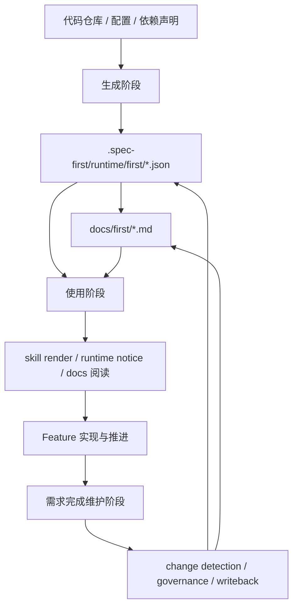
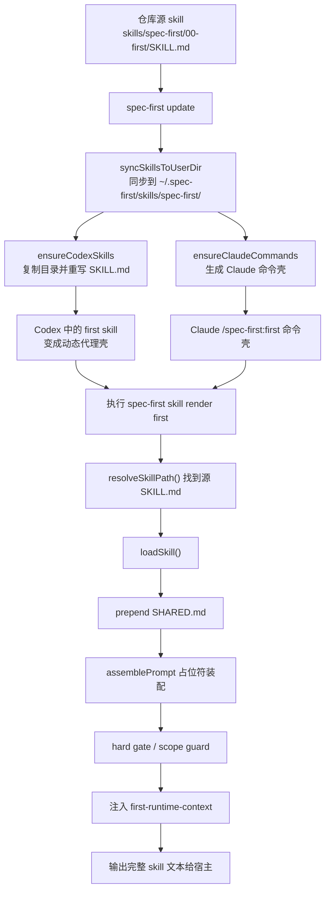
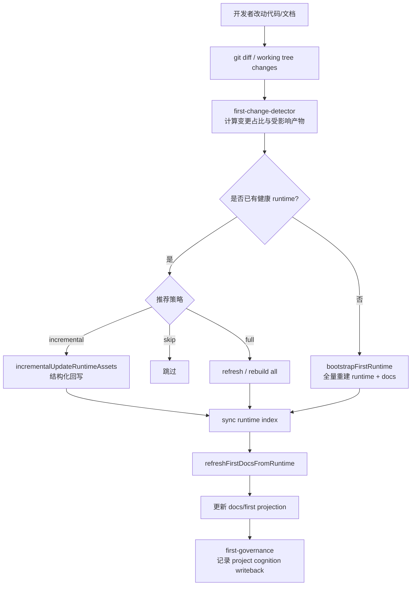

# First Skill 当前状态深度分析

日期：2026-03-19

范围：
- `skills/spec-first/00-first/`
- `src/shared/skill-commands.ts`
- `src/cli/commands/skill.ts`
- `src/core/skill-runtime/dispatcher.ts`
- `src/cli/commands/first.ts`
- `src/core/skill-runtime/first-*.ts`
- `tests/unit/*first*`
- `tests/integration/*first*`

## 1. 结论摘要

当前 `first` 最准确的理解方式，不是“一个 skill”，而是一个分成三阶段的项目认知子系统：

1. `生成阶段`
2. `使用阶段`
3. `需求完成维护阶段`

这三个阶段共同组成 today 的 `first`：

- 生成阶段：构建 `.spec-first/runtime/first/` 真源和 `docs/first/` 投影视图
- 使用阶段：把已有认知资产动态注入给 skill、CLI 和人类阅读
- 需求完成维护阶段：在 feature 完成后做变更分析、增量回写、全量刷新和治理收口

这比“静态 skill + CLI 命令”的理解更接近真实实现。

一句话判断：

- 对最终用户：主路径仍然可以理解为 `spec-first first`
- 对维护者：它已经演化成“生成 + 消费 + 治理”三阶段系统

## 2. 三阶段总览

### 2.1 三阶段定义

#### 生成阶段

目标：

- 首次建立或重建项目级认知真源

输出：

- `.spec-first/runtime/first/*.json`
- `.spec-first/runtime/first/index.json`
- `docs/first/*.md`

#### 使用阶段

目标：

- 把已有认知资产提供给 skill、CLI 和人消费

输出：

- 渲染后的 skill 文本
- `first-runtime-context`
- `docs/first` 阅读视图

#### 需求完成维护阶段

目标：

- 在 feature 完成后，持续更新项目级认知资产，避免过时

输出：

- updated runtime assets
- updated projection docs
- governance writeback
- project cognition update log

### 2.2 三阶段总流程图

## 3. 关键文件地图

### 3.1 Skill 源与参考文档

- 源 skill: [skills/spec-first/00-first/SKILL.md](/Users/kuang/xiaobu/spec-first/skills/spec-first/00-first/SKILL.md)
- 共享约束: [skills/spec-first/SHARED.md](/Users/kuang/xiaobu/spec-first/skills/spec-first/SHARED.md)
- 参考文档目录: [skills/spec-first/00-first](/Users/kuang/xiaobu/spec-first/skills/spec-first/00-first)

当前体量：

- `SKILL.md`: 105 行
- references: 17 个 `.md` 文件，合计约 1152 行

### 3.2 Skill 动态渲染与分发

- 命令壳/宿主注册: [src/shared/skill-commands.ts](/Users/kuang/xiaobu/spec-first/src/shared/skill-commands.ts)
- skill render 命令: [src/cli/commands/skill.ts](/Users/kuang/xiaobu/spec-first/src/cli/commands/skill.ts)
- skill 加载/拼装/notice 注入: [src/core/skill-runtime/dispatcher.ts](/Users/kuang/xiaobu/spec-first/src/core/skill-runtime/dispatcher.ts)
- prompt 占位符装配: [src/core/skill-runtime/prompt-assembler.ts](/Users/kuang/xiaobu/spec-first/src/core/skill-runtime/prompt-assembler.ts)

### 3.3 first CLI 与 runtime 生成

- CLI 入口: [src/cli/commands/first.ts](/Users/kuang/xiaobu/spec-first/src/cli/commands/first.ts)
- 参数协议: [src/core/skill-runtime/first-args.ts](/Users/kuang/xiaobu/spec-first/src/core/skill-runtime/first-args.ts)
- 首次生成: [src/core/skill-runtime/first-bootstrap.ts](/Users/kuang/xiaobu/spec-first/src/core/skill-runtime/first-bootstrap.ts)
- refresh 主逻辑: [src/core/skill-runtime/first-context.ts](/Users/kuang/xiaobu/spec-first/src/core/skill-runtime/first-context.ts)
- 运行时索引与读写: [src/core/skill-runtime/first-runtime-store.ts](/Users/kuang/xiaobu/spec-first/src/core/skill-runtime/first-runtime-store.ts)
- projection 渲染: [src/core/skill-runtime/first-doc-projection.ts](/Users/kuang/xiaobu/spec-first/src/core/skill-runtime/first-doc-projection.ts)
- 变更检测: [src/core/skill-runtime/first-change-detector.ts](/Users/kuang/xiaobu/spec-first/src/core/skill-runtime/first-change-detector.ts)
- 资产映射: [src/core/skill-runtime/first-artifact-mapping.ts](/Users/kuang/xiaobu/spec-first/src/core/skill-runtime/first-artifact-mapping.ts)
- 增量更新: [src/core/skill-runtime/first-incremental-update.ts](/Users/kuang/xiaobu/spec-first/src/core/skill-runtime/first-incremental-update.ts)
- wrap_up / done 治理回写: [src/core/skill-runtime/first-governance.ts](/Users/kuang/xiaobu/spec-first/src/core/skill-runtime/first-governance.ts)

当前 `first-*` 代码模块规模：

- 19 个 `first-*.ts`
- 合计约 5101 行

### 3.4 测试治理

- 文档一致性: [tests/unit/first-skill-docs.test.ts](/Users/kuang/xiaobu/spec-first/tests/unit/first-skill-docs.test.ts)
- 动态渲染: [tests/integration/skill-render.test.ts](/Users/kuang/xiaobu/spec-first/tests/integration/skill-render.test.ts)
- runtime notice: [tests/unit/dispatcher-first-runtime.test.ts](/Users/kuang/xiaobu/spec-first/tests/unit/dispatcher-first-runtime.test.ts)
- 命令包装与宿主同步: [tests/unit/skill-commands.test.ts](/Users/kuang/xiaobu/spec-first/tests/unit/skill-commands.test.ts)
- CLI 真流程: [tests/integration/first-cli-real-flow.test.ts](/Users/kuang/xiaobu/spec-first/tests/integration/first-cli-real-flow.test.ts)
- governance E2E: [tests/integration/first-governance-e2e.test.ts](/Users/kuang/xiaobu/spec-first/tests/integration/first-governance-e2e.test.ts)

## 4. 按三阶段理解当前系统

### 4.1 生成阶段

生成阶段的职责是“把项目事实转成正式认知真源”。

关键入口：

- [src/cli/commands/first.ts](/Users/kuang/xiaobu/spec-first/src/cli/commands/first.ts)
- [src/core/skill-runtime/first-bootstrap.ts](/Users/kuang/xiaobu/spec-first/src/core/skill-runtime/first-bootstrap.ts)
- [src/core/skill-runtime/first-context.ts](/Users/kuang/xiaobu/spec-first/src/core/skill-runtime/first-context.ts)
- [src/core/skill-runtime/first-doc-projection.ts](/Users/kuang/xiaobu/spec-first/src/core/skill-runtime/first-doc-projection.ts)
- [src/core/skill-runtime/first-runtime-store.ts](/Users/kuang/xiaobu/spec-first/src/core/skill-runtime/first-runtime-store.ts)

生成阶段回答的问题是：

- 项目是什么
- 入口点是什么
- 技术栈是什么
- 有哪些模块、接口、关键流、领域对象
- 应该生成哪些 runtime 资产和哪些 docs projection

生成阶段是 `first` 最自然的语义起点。

### 4.2 使用阶段

使用阶段的职责是“让其他 skill 和人真正消费这些认知资产”。

关键入口：

- [src/shared/skill-commands.ts](/Users/kuang/xiaobu/spec-first/src/shared/skill-commands.ts)
- [src/cli/commands/skill.ts](/Users/kuang/xiaobu/spec-first/src/cli/commands/skill.ts)
- [src/core/skill-runtime/dispatcher.ts](/Users/kuang/xiaobu/spec-first/src/core/skill-runtime/dispatcher.ts)
- [src/core/skill-runtime/prompt-assembler.ts](/Users/kuang/xiaobu/spec-first/src/core/skill-runtime/prompt-assembler.ts)

使用阶段回答的问题是：

- 宿主里看到的 `first` skill 从哪里来
- 为什么要先走 `spec-first skill render first`
- runtime truth 如何变成 skill prompt 的前置上下文
- `docs/first` 在消费链里是什么角色

### 4.3 需求完成维护阶段

维护阶段的职责是“在需求完成后保持项目级认知系统持续正确”。

关键入口：

- [src/core/skill-runtime/first-change-detector.ts](/Users/kuang/xiaobu/spec-first/src/core/skill-runtime/first-change-detector.ts)
- [src/core/skill-runtime/first-artifact-mapping.ts](/Users/kuang/xiaobu/spec-first/src/core/skill-runtime/first-artifact-mapping.ts)
- [src/core/skill-runtime/first-incremental-update.ts](/Users/kuang/xiaobu/spec-first/src/core/skill-runtime/first-incremental-update.ts)
- [src/core/skill-runtime/first-governance.ts](/Users/kuang/xiaobu/spec-first/src/core/skill-runtime/first-governance.ts)

维护阶段回答的问题是：

- 代码变了以后哪些认知资产会过时
- 是只刷 docs、增量更新 runtime，还是全量重建
- wrap_up / done 时是否必须更新项目级认知
- 谁来记录和治理这些更新

## 5. 当前 first 的“文档生成逻辑”

这里的“文档生成”其实有两层含义：

1. `Skill 文档如何生成并被宿主消费`
2. `docs/first/*.md 如何从 runtime truth 投影生成`

这两层都存在，而且相互影响。

## 6. 使用阶段：Skill 文档生成与消费链路

### 6.1 仓库中的源 skill 是静态正文

仓库内真正维护的是：

- [skills/spec-first/00-first/SKILL.md](/Users/kuang/xiaobu/spec-first/skills/spec-first/00-first/SKILL.md)

它的特点：

- frontmatter 简洁
- 正文强调默认入口是 `spec-first first`
- 明确 runtime truth / projection contract
- references 采用“默认 / 增强 / 低频专项”三级读取规则

这一层本身不复杂。

### 6.2 安装到宿主后，skill 会被改写为动态代理壳

当执行 `spec-first update` 时，`ensureSkillCommands()` 会做两件事：

1. 先把仓库/包里的 skills 同步到用户级固定目录 `~/.spec-first/skills/spec-first/`
2. 再为不同宿主生成入口

对 Codex 来说，关键不是复制原始 `SKILL.md`，而是用 `renderCodexWrapper()` 重写：

- 保留 frontmatter
- 重写正文为“此入口为动态代理”
- 强制先执行 `spec-first skill render first`

也就是说：

- 仓库源 skill：静态正文
- 宿主安装后的 skill：动态代理壳

这是第一个重要复杂度来源。

### 6.3 Claude / Codex 的入口形态不同，但都指向 render

入口形态：

- Claude：生成命令文件，正文要求运行 `spec-first skill render <skill>`
- Codex：复制目录，但 `SKILL.md` 被包装成动态代理壳

所以无论宿主是什么，实际都绕到同一件事：

`spec-first skill render first`

### 6.4 skill render 的实际行为

命令入口在：

- [src/cli/commands/skill.ts](/Users/kuang/xiaobu/spec-first/src/cli/commands/skill.ts)

流程：

1. 解析 `render <skill-name> [--feature] [--input]`
2. 通过 `resolveSkillPath()` 找到 skill 文件
3. 调用 `loadSkill()`
4. 输出拼装后的完整 skill 文本

### 6.5 loadSkill 实际做了什么

`loadSkill()` 的行为不是“读取一个 markdown 文件”，而是多步装配：

1. 读取 skill 正文
2. 若属于 `skills/spec-first/*`，自动 prepend `SHARED.md`
3. 自动补 `Next Steps` policy
4. 若给定 `projectRoot`，进行 placeholder 装配
5. 进行 KV-cache 稳定性检查
6. 运行 hard gate / scope guard
7. 对特定 skill 注入 runtime notice

其中 `first` 的特殊逻辑是：

- `buildFirstRuntimeNotice(projectRoot)`

这个 notice 会把下面内容塞到 skill 正文前面：

- resume recommendation
- health status
- change analysis
- product summary

因此，最终渲染出来的 `first` skill 文本，实际上是：

1. `first-runtime-context`
2. `SHARED.md`
3. `00-first/SKILL.md`

这就是为什么 `spec-first skill render first` 输出看上去远比源 `SKILL.md` 重。

### 6.6 Skill 文档生成与使用流程图

## 7. 生成阶段：first 命令执行链路

### 7.1 CLI 入口

入口：

- [src/cli/index.ts](/Users/kuang/xiaobu/spec-first/src/cli/index.ts)
- [src/cli/router.ts](/Users/kuang/xiaobu/spec-first/src/cli/router.ts)
- [src/cli/commands/first.ts](/Users/kuang/xiaobu/spec-first/src/cli/commands/first.ts)

`first` 在 router 层有统一确认逻辑：

- router 全局消费 `--yes`
- `first` 自身只解析 `--force` / `--check-health` / `--type=...`

所以：

- `spec-first first --yes` 用于绕过 router 交互确认
- `spec-first first --force` 用于 first 自己的重建语义

这两层不在同一模块中，是一个隐性复杂点。

### 7.2 first 的命令分支

`handleFirst()` 的分支很清楚：

1. `--help`
2. `--check-health`
3. 读取 runtime index，判断是否已有健康 runtime
4. 若健康且未 `--force`，走 `refreshFirstArtifacts(..., 'refresh-docs-from-runtime')`
5. 否则走 `bootstrapFirstRuntime()`
6. 最后输出 `formatProductSummary()`

也就是说，外部看是一个命令，内部是“健康检测 + 刷新策略决策 + 生成/投影”的组合入口。

## 8. 生成阶段：runtime truth 与 projection 模型

### 8.1 正式真源

正式真源目录：

- `.spec-first/runtime/first/`

正式 runtime 资产共 9 个：

- `summary.json`
- `steering.json`
- `conventions.json`
- `critical-flows.json`
- `entry-guide.json`
- `api-contracts.json`
- `structure-overview.json`
- `domain-model.json`
- `database-schema.json`

正式真索引：

- `.spec-first/runtime/first/index.json`

### 8.2 projection 层

projection 文档目录：

- `docs/first/`

从 [`first-artifact-mapping.ts`](/Users/kuang/xiaobu/spec-first/src/core/skill-runtime/first-artifact-mapping.ts) 可以看出当前投影体系：

- 基础投影视图 9 个
- 正式专题投影视图 4 个
- 条件型投影视图 1 个

其中条件型视图只有：

- `docs/first/database-er.md`

只有当 `databaseSchema.status === healthy` 才允许生成。

### 8.3 一条硬边界

系统当前有一条明确的设计边界：

- `.spec-first/runtime/first/*.json` 才是真源
- `docs/first/*.md` 只是 projection
- 不允许反向把 projection 当真源回灌

这是 today 版本 `first` 最核心的 contract。

## 9. 生成阶段与维护阶段的交界：bootstrap / refresh / health / incremental

### 9.1 bootstrap

`bootstrapFirstRuntime()` 做的是“从代码和项目结构推断第一版真源”。

它会：

- 读 `package.json`
- 识别技术栈、入口点、模块、能力、风险
- 构造 summary / conventions / critical-flows / entry-guide 等资产
- 写入 runtime store
- 调用 projection 渲染

这一层是“冷启动生成”。

### 9.2 refresh

`refreshFirstArtifacts()` 做的是在已有 runtime 条件下刷新。

它支持的模式定义在：

- [src/core/skill-runtime/first-context.ts](/Users/kuang/xiaobu/spec-first/src/core/skill-runtime/first-context.ts)

模式有：

- `refresh-runtime-only`
- `refresh-docs-from-runtime`
- `refresh-all`

但对最终 `first` 命令来说，当前主要暴露的是两条：

- 仅从健康 runtime 刷 docs
- bootstrap / 全量重建

### 9.3 health

`checkFirstUpdateContext()` 会检查：

- runtime 资产是否存在
- projection 是否存在
- index 中是否有对应记录
- 条件资产是否允许缺失
- 资产 hash / commit / manual modification 等问题

`spec-first skill render first` 输出中的 health 提示，来源就是这里。

### 9.4 change analysis

`analyzeChanges()` 使用 git 做变更分析：

- 看变更文件占比
- 计算影响产物
- 给出 `skip / incremental / full` 推荐

阈值是：

- 30% 变更占比以上，建议 full

### 9.5 incremental update

`first-incremental-update.ts` 更像“结构化回写器”，它不是通用全文重建，而是针对结构变更把增量信息写回 runtime 资产，比如：

- 新模块 -> `structure-overview.json`
- 新接口 -> `api-contracts.json`
- 新流程 -> `critical-flows.json`

它主要服务于治理链路，而不是普通用户第一次运行 `first` 的主路径。

## 10. 需求完成维护阶段：first 的治理链路

### 10.1 为什么 first 不只是生成工具

当前设计里，`first` 还承担“项目级认知资产的长期治理”角色。

体现为：

- wrap_up / done 时可能回写项目认知
- 基于变更文件推断是否必须更新 project cognition
- 记录 project cognition 更新日志

关键文件：

- [src/core/skill-runtime/first-governance.ts](/Users/kuang/xiaobu/spec-first/src/core/skill-runtime/first-governance.ts)

### 10.2 governance 决策

它会区分：

- `must_update`
- `should_update`
- `must_not_update`

依据包括：

- 是否改了 `first-*` canonical source
- 是否改了 `docs/first/*`
- 是否改了 first 相关测试和消费路径

这意味着 today 的 `first` 已经不是“项目首轮认知”那么简单，而是被提升成一个长期维护的 canonical cognition subsystem。

### 10.3 治理链路流程图

## 11. 测试如何约束这三阶段链路

当前测试不是只测“命令能不能跑”，而是在同时约束四类问题：

### 11.1 使用阶段：skill 文档治理

- `first-skill-docs.test.ts`

约束点包括：

- description 必须是 trigger 风格
- `SKILL.md` 必须强调 `spec-first first --yes`
- references 文件必须存在
- 不允许某些旧格式和旧文案回流

### 11.2 使用阶段：宿主包装治理

- `skill-commands.test.ts`

约束点包括：

- Codex skill 必须被重写为动态代理壳
- frontmatter 必须保留
- 旧 alias 和坏 symlink 要能修复

### 11.3 使用阶段：运行时拼装治理

- `prompt-assembler.test.ts`
- `dispatcher-first-runtime.test.ts`
- `skill-render.test.ts`

约束点包括：

- `SHARED.md` 自动 prepend
- placeholder 装配正确
- first runtime notice 由 runtime truth 而不是 docs 泄漏构造
- `spec-first skill render <skill>` 必须能输出运行态上下文

### 11.4 生成阶段与维护阶段：first 生成/治理本身

- `first-command.test.ts`
- `first-context.test.ts`
- `first-doc-projection.test.ts`
- `first-governance.test.ts`
- `first-cli-real-flow.test.ts`
- `first-governance-e2e.test.ts`

这意味着 today 的 `first` 已经被测试体系固化为一整套平台能力，而不是一个轻量技能。

## 12. 为什么三阶段叠加后会让人感觉“过于依赖脚本、过于复杂”

原因不是单一的，而是四个结构性因素叠加。

### 12.1 一个概念，承担了三阶段职责

`first` 同时承担：

- 首轮项目认知
- runtime 真源生成
- 运行态消费注入
- 项目级认知治理与回写

职责过多，导致心智模型扩张。

### 12.2 源 skill 和宿主 skill 不是同一个东西

维护者看到的是静态源文件。

用户真正执行的是：

- 被包装过的动态代理壳
- 再经 `skill render` 生成的上下文版 skill

这会造成理解落差。

### 12.3 生成、使用、维护三阶段深度耦合

`first` 不只是“写 markdown”，而是：

- 运行时 index
- docs projection
- git health
- change analysis
- governance writeback

一旦耦合，任何局部改动都会牵动多层。

### 12.4 测试在稳定系统，也在放大重构成本

当前测试覆盖面很广，优点是稳，缺点是：

- 任何简化都需要同时改 skill、wrapper、dispatcher、runtime、tests

所以复杂度不只是代码量，也是变更摩擦。

## 13. 当前系统的优点

### 13.1 真源边界清晰

runtime truth 和 docs projection 的边界定义得很明确，这是当前设计最扎实的部分。

### 13.2 使用阶段收口统一

无论 Claude 还是 Codex，最终都统一收口到 `spec-first skill render`，工程上是统一的。

### 13.3 维护阶段具备治理能力

相比单纯生成 markdown，当前系统具备：

- 健康检查
- 增量更新
- 条件型产物
- 长期治理回写

这些都不是“多写几份文档”能替代的。

## 14. 当前系统的主要问题

### 14.1 `first` 的定位已经漂移

名称上它像“项目初始认知”。

实现上它更像：

- `project cognition runtime subsystem`

命名与实际职责不再一致。

### 14.2 使用路径简单，三阶段维护路径过深

用户只看到：

- `spec-first first`

维护者实际面对的是：

- skill 源
- shared
- wrapper
- render
- runtime notice
- bootstrap
- refresh
- docs projection
- governance
- tests

深度明显偏高。

### 14.3 使用阶段动态渲染输出过重

`spec-first skill render first` 现在会输出：

- health 提示
- change analysis
- product summary
- shared constraints
- skill 正文

这会造成“skill 本体”和“运行时状态报告”混在一起。

### 14.4 生成阶段命令协议不直观

虽然实现上合理：

- `--yes` 属于 router 级确认
- `--force` 属于业务语义

但对外观感上，命令协议并不直观。

## 15. 当前状态的准确判断

如果问题是：

“当前 first skill 是否过于依赖脚本、过于复杂？”

更准确的回答是：

- `first` 的源 skill 文档本身不算复杂
- `first` 的宿主包装与动态渲染逻辑明显偏重
- `first` 的 runtime 生成与治理系统已经形成一个独立子系统，复杂度较高
- 复杂度主要不是“脚本太多”，而是“单一概念承载了太多职责”

## 16. 建议的重构方向

这里只给方向，不展开方案细节。

### 16.1 显式按三阶段拆层

建议分层：

- `first-generate` 或保留 `first` 只负责生成阶段
- `first-use` 不一定暴露成命令，但在架构上应独立
- `first-governance` / `first-maintain` 负责需求完成后的治理回写

### 16.2 缩小使用阶段 render 输出

`skill render first` 建议只注入最小必需 notice：

- 是否已有 runtime
- 建议执行命令

不要默认混入整段 health / change analysis / product summary。

### 16.3 让“源 skill”和“宿主 skill”语义更一致

现在源 skill 是正文，宿主 skill 是代理壳。建议至少让两者在说明上明确区分：

- source-of-truth skill
- host wrapper skill

### 16.4 把需求完成维护从 `first` 主心智模型中剥离

如果治理目标是长期维护项目级认知资产，那么这已经超出了“first”这个名字的天然边界。

## 17. 最终判断

当前 `first` 的问题不是“写得乱”，而是“已经从一个 skill 演变成一个三阶段平台子系统”，但命名、入口和心智模型还保持在“一个 skill”的包装里。

所以今天的真实状态是：

- 用户入口简单
- 系统内部不简单
- 文档源头简单
- 宿主消费与运行时拼装复杂
- 生成逻辑和治理逻辑已经深度耦合

如果继续迭代，不主动拆层，复杂度还会继续上升。
