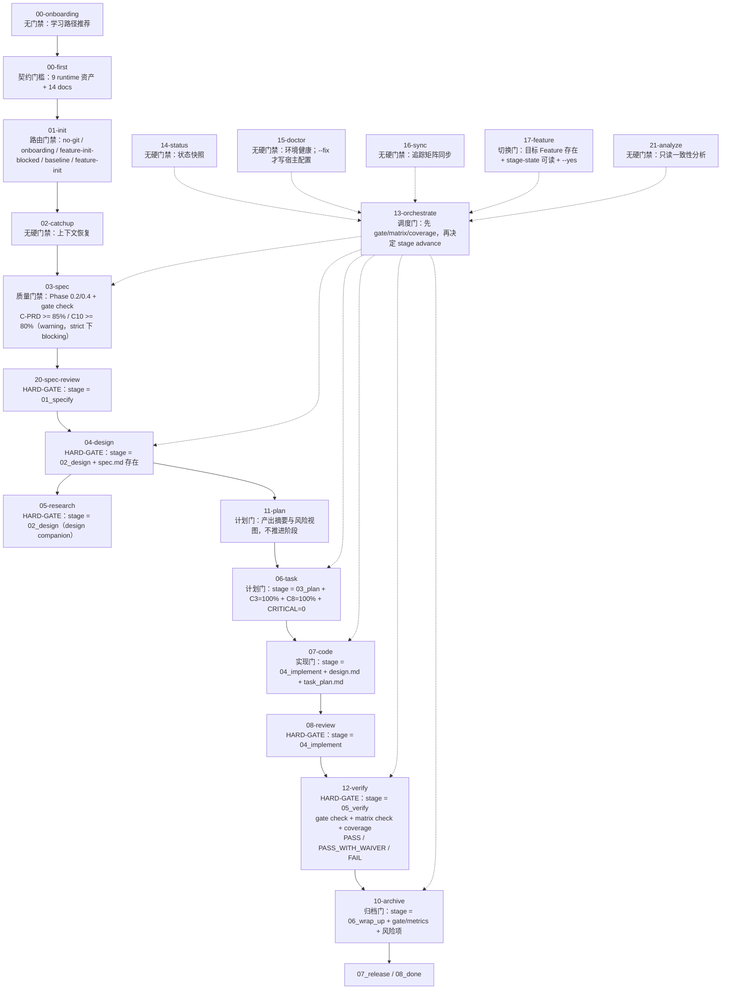

# Spec-First 全链路 Skill Gate 审查

> 审查时间：2026-03-19
> 审查范围：`skills/spec-first/*`、当前运行时门禁与阶段流转、`findings.md` / `task_plan.md` 的角色边界
> 审查结论：系统已收敛为"阶段门禁 + 质量门禁 + 记录节点 + 辅助节点"四层结构；`TDD 预检` 已从 `07-code` 与 batch-executor 主链移除，`findings.md` 退回记录层，不再作为 `code` 进入门禁。

---

## 1. 审查结论

### 1.1 主链硬门禁

| 节点 | 阻断条件 |
|------|---------|
| `01-init` | no-git / `00-first` 未完成 / brownfield baseline 未建立 |
| `03-spec` | `spec.md` / `traceability-matrix.md` 缺失；`gate check` 失败；`C-PRD >= 85%` / `C10 >= 80%` 在 strict profile 下升级为 blocking |
| `04-design` | `stage ≠ 02_design` 或 `spec.md` 不存在 |
| `05-research` | `stage ≠ 02_design` |
| `06-task` | `stage ≠ 03_plan` 或 `C3 < 100%` 或 `C8 < 100%` 或存在 CRITICAL findings |
| `07-code` | `stage ≠ 04_implement` 或 `design.md` / `task_plan.md` 缺失 |
| `08-review` | `stage ≠ 04_implement` |
| `12-verify` | `stage ≠ 05_verify` 或 gate/matrix/coverage 未达标 |
| `10-archive` | `stage ≠ 06_wrap_up` 或 gate/metrics/风险项未满足 |
| `13-orchestrate` | gate 证据不足时阻断 `stage advance` |
| `20-spec-review` | `stage ≠ 01_specify` |

### 1.2 不是门禁的节点

以下节点属于恢复、观察、诊断、索引，不阻断流程：

- `02-catchup`：上下文恢复
- `11-plan`：计划摘要与风险视图（不推进阶段）
- `14-status`：状态快照
- `15-doctor`：环境诊断（`--fix` 才写宿主配置）
- `16-sync`：追踪矩阵同步
- `21-analyze`：只读一致性分析

`17-feature` 是切换控制节点，切换失败时阻断，但不是业务门禁。

### 1.3 已确认的边界

- `findings.md` 只做记录，不作为 `code` 进入门禁
- `task_plan.md.status` 只表示任务进度，不表示审批状态
- `code` 不再要求 `in_progress TASK`，只要求 `design.md` 与 `task_plan.md` 存在
- `TDD 预检` 已从 `07-code` / batch-executor 主链删除
- `docs/first/*` 是阅读产物，不再作为真源
- `03-spec` 的 `C-PRD >= 85%` 与 `C10 >= 80%` 默认为 warning，strict profile 下升级为 blocking
- `04-design` 的 `C2` / `C11` 属于后置验收指标，不是进入硬门
- `gate-history.jsonl` 由 gate-evaluator / advance 路径落盘，是实际门禁历史

### 1.4 已知问题（待修复）

| 问题 | 影响 | 修复方向 |
|------|------|---------|
| Waiver 机制未被 gate-evaluator 识别 | TDD-WAIVER 形同虚设，C4 仍报 0% blocking | gate-evaluator 读取 findings.md 中的 waiver 记录 |
| ESLint 错误跨 feature 污染 | 宿主项目遗留错误阻断无关 feature 的 gate | 修复 `batch-executor/plan-generator.ts` 中的 `_projectRoot` 前缀问题 |
| `compat-check` npm script 缺失 | gate 调用不存在的脚本导致 FAIL | 补充脚本或从 gate 条件中移除该检查项 |

---

## 2. 全链路流程图

### 2.1 主流程

### 2.2 读图说明

- **主链**：负责阶段推进，实线连接
- **辅助节点**：负责恢复、诊断、同步、分析，虚线连接 orchestrate
- **调度节点** `13-orchestrate`：不产业务交付物，但决定何时允许执行 `stage advance`
- `00-first`：只做项目认知资产基线校验，不承担 CLI 生成职责

---

## 3. 各节点 Gate 清单

| 节点 | 角色 | Gate 类型 | 主要门槛 | 阻断 | 备注 |
|------|------|----------|----------|------|------|
| `00-onboarding` | 上手引导 | 无 | 学习路径选择 | 否 | 只做引导 |
| `00-first` | 项目认知基线 | 契约门槛 | 9 runtime 资产、14 docs | 是（缺产物时） | `docs-index.json` 仅辅助索引 |
| `01-init` | 初始化入口 | 路由门禁 | no-git / onboarding / feature-init-blocked / baseline / feature-init | 是 | `00-first` 不健康且带 `--feat` 时阻断 |
| `02-catchup` | 上下文恢复 | 无 | 读取 current / stage-state / task_plan / findings | 否 | — |
| `03-spec` | 需求规格 | 质量门禁 | `spec.md` / `traceability-matrix.md`、gate check；`C-PRD >= 85%` / `C10 >= 80%` 默认 warning | 部分 | strict profile 下 warning 升级为 blocking |
| `20-spec-review` | 规格审查 | 阶段绑定质量门 | `stage = 01_specify`、歧义/缺口/严重度 | 是 | — |
| `04-design` | 技术设计 | HARD-GATE | `stage = 02_design`、`spec.md` 存在；`C2/C11` 是后置验收 | 是 | — |
| `05-research` | 技术调研 | 阶段绑定伴生门 | `stage = 02_design` | 是 | design companion skill |
| `11-plan` | 执行计划 | 计划门 | 任务摘要、风险评估 | 否 | 不推进阶段 |
| `06-task` | 任务拆解 | 任务覆盖门 | `stage = 03_plan`、`C3=100%`、`C8=100%`、CRITICAL=0 | 是 | — |
| `07-code` | 代码实现 | 实现前置门 | `stage = 04_implement`、`design.md`、`task_plan.md` | 是 | TDD 预检已移除；`findings.md` 仅记录 |
| `08-review` | 代码审查 | 阶段绑定质量门 | `stage = 04_implement`、MUST/SHOULD/OUT_OF_SCOPE 分流 | 是 | 重点是问题分流，不是前置阻断 |
| `12-verify` | 阶段验收 | 阶段门禁 | `stage = 05_verify`、gate check、matrix check、coverage | 是 | 阶段推进的主验收门 |
| `13-orchestrate` | 调度编排 | 调度门禁 | 先验收证据再允许 `stage advance`；高风险变更需 worktree 确认 | 是（推进控制） | — |
| `10-archive` | 归档 | 组合门槛 | `stage = 06_wrap_up`、gate/metrics/风险项 | 是 | 通过后进入 `07_release` |
| `14-status` | 状态快照 | 无 | 只读展示 | 否 | — |
| `15-doctor` | 环境诊断 | 无 | Node / Git / hooks / runtime/docs 健康 | 否 | `--fix` 才写宿主配置 |
| `16-sync` | 矩阵同步 | 无 | traceability 回填、orphan 检查 | 否 | — |
| `17-feature` | Feature 切换 | 状态切换门 | 目标 Feature 存在、stage-state 可读、`--yes` 确认 | 是（切换失败） | 作用于 `.spec-first/current` 指针 |
| `21-analyze` | 一致性分析 | 风险分析门 | spec/design/task/matrix 一致性、严重度分级 | 否 | 产出 CRITICAL/HIGH/MEDIUM/LOW 报告 |

---

## 4. 记录边界

### 4.1 不再是门禁的内容

- `findings.md` 不再作为 `code` 进入门禁
- `TDD 预检` 已移除
- `task_plan.md.status` 不表示审批
- `docs/first/*` 不作为真源

### 4.2 记录用途保留

| 文件 | 用途 |
|------|------|
| `stage-state.json` | 阶段状态主记录 |
| `gate-history.jsonl` | 门禁决策历史主记录 |
| `findings.md` | 计划、执行、审查、验证、恢复证据（人类可读） |
| `task_plan.md` | 任务进度与依赖 |
| `traceability-matrix.md` | FR / DS / TASK / TC 追踪关系 |

### 4.3 节点级落盘清单

| 节点 | 主要数据 | 落点 |
|------|---------|------|
| `00-first` | runtime 资产健康、docs 可用性 | `.spec-first/runtime/first/*.json`、`docs/first/*` |
| `01-init` | Feature 创建状态 | `specs/{id}/stage-state.json`、`findings.md`、`traceability-matrix.md` |
| `02-catchup` | 恢复摘要、缺口、阻塞标记 | `specs/{id}/findings.md` |
| `03-spec` | PRD / spec 质量扫描、gate check | `spec.md`、`traceability-matrix.md`、`findings.md` |
| `20-spec-review` | 规格审查发现、歧义、缺口 | `checklists/spec-review.md`、`findings.md` |
| `04-design` | 设计决策、接口约束、回滚策略 | `design.md`、`traceability-matrix.md`、`findings.md` |
| `05-research` | 调研证据、方案对比、未验证假设 | `findings.md` |
| `11-plan` | 计划摘要、风险、下一步 | `findings.md` |
| `06-task` | 任务拆解、依赖、覆盖关系 | `task_plan.md`、`traceability-matrix.md`、`findings.md` |
| `07-code` | 执行 checkpoint、批处理结果 | `batch-checkpoint.json`、`batch-report.md`、`findings.md` |
| `08-review` | 审查结论、MUST/SHOULD/OUT_OF_SCOPE | `findings.md` |
| `12-verify` | PASS/PASS_WITH_WAIVER/FAIL、验证报告 | `findings.md`、`reports/verification.md` |
| `13-orchestrate` | gate 判定、stage advance 决策 | `gate-history.jsonl`、`findings.md` |
| `10-archive` | 归档结果、复盘、覆盖率摘要 | `retro.md`、`gate-history.jsonl`、`findings.md` |
| `14-status` | 状态快照（只读） | 不强制写盘 |
| `15-doctor` | 环境健康检查 | 只在 `--fix` 时写宿主配置 |
| `16-sync` | traceability 同步、orphan 检查 | `traceability-matrix.md`、`findings.md` |
| `17-feature` | Feature 指针切换 | `.spec-first/current`、`stage-state.json` |
| `21-analyze` | 一致性分析、严重度分级 | `reports/analysis-report.md` |

---

## 5. 建议的排障顺序

1. `00-first` → 确认项目认知基线
2. `01-init` → 确认 Feature 初始化条件
3. `03-spec` → `20-spec-review` → 确认需求质量
4. `04-design` → `05-research` → 确认设计有证据支撑
5. `11-plan` → `06-task` → 确认任务可执行
6. `07-code` → `08-review` → 确认实现与审查边界
7. `12-verify` → `10-archive` → 确认是否可推进与归档
8. `13-orchestrate` → 贯穿阶段推进与恢复
9. `14-status` / `15-doctor` / `16-sync` / `17-feature` / `21-analyze` → 辅助观察与修复

---

## 6. 结论

当前 gate 体系已从"证据门禁混杂"收敛为四层：

- **主链硬门禁**：负责阶段能否继续
- **质量门禁**：负责产物是否足够可靠
- **记录节点**：负责审计、恢复、回放
- **辅助节点**：负责诊断、切换、同步、分析

整体不算过严。当前实际阻断来自三个配置问题（waiver 未被识别、ESLint 跨 feature 污染、compat-check 脚本缺失），修复这三项即可解除当前 gate FAIL 状态，无需调整门禁策略本身。
