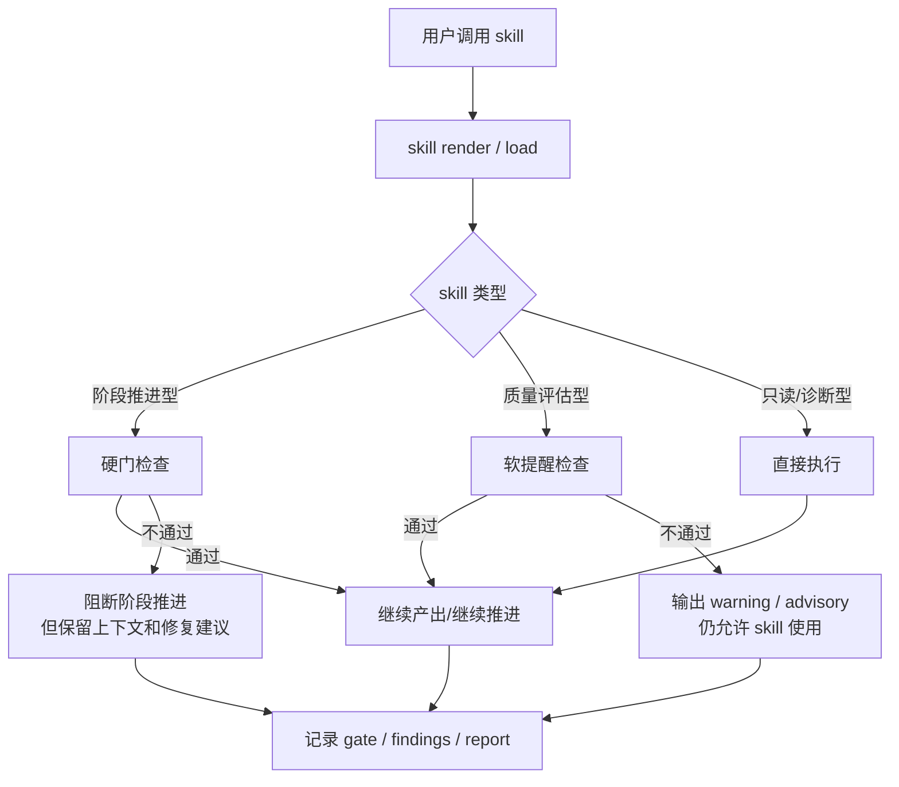

# Spec-First Skill 可用性分层与软门禁方案

> 目标：在保留 SDD 阶段治理的前提下，提高 skill 的“随时可用性”。  
> 方案选择：**方案 A**，即保留阶段推进类硬门禁，同时把 `review / verify / spec-review` 降为软提醒型 skill，不再因为前置不满足而阻断 skill 调用本身。

## 1. 问题定义

当前 Spec-First 的门禁体系是为“流程可靠性”设计的，但它在部分 skill 上表现得过于严格，容易让研发人员产生两个困扰：

1. 不是每个 skill 都能在任意时刻调用。
2. 某些质量类 skill（尤其是 review / verify）会把“可执行性”和“阶段推进性”混成一件事。

这会降低 AI 辅助研发的通用性：

- 只读、诊断、分析型 skill 本应随时可用。
- 质量评估型 skill 应该可随时运行，但结果只影响阶段推进，不应阻断 skill 本身的使用。
- 真正需要硬门禁的，应该是“阶段推进”而不是“skill 调用”。

## 2. 设计原则

### 2.1 两层门禁

1. **硬门禁**：只用于阶段推进和不可逆动作。
2. **软提醒**：只用于质量提示、风险提示、建议补齐，不阻断 skill 调用。

### 2.2 职责分离

- `skill` 负责产出建议、分析、校验和交付。
- `gate` 负责判断是否允许推进阶段。
- `record` 负责沉淀证据，不承担门禁本身。

### 2.3 通用性优先

- 只读 / 诊断 / 分析 skill 应尽量随时可用。
- review / verify / spec-review 作为质量 skill，应能随时运行，但必要时只给出 warning / advisory。
- 阶段推进类动作仍然保持硬门。

## 3. 推荐分层

### 3.1 保留硬门的节点

这些节点依然是阶段推进器，必须保持硬门：

- `01-init`
- `03-spec`
- `04-design`
- `06-task`
- `07-code`
- `10-archive`
- `13-orchestrate`

### 3.2 改成软提醒的节点

这些节点应该允许随时调用；若前置不完整，则输出 warning / risk / suggestion，而不是直接阻断 skill 调用：

- `08-review`
- `12-verify`
- `20-spec-review`

### 3.3 保持完全可用的节点

这些节点主要用于恢复、诊断、同步、分析、状态查看，应保持低门槛和高可用性：

- `00-onboarding`
- `02-catchup`
- `11-plan`
- `14-status`
- `15-doctor`
- `16-sync`
- `17-feature`
- `21-analyze`

> 注：`05-research` 是 stage-bounded 伴生节点（HARD-GATE：`stage = 02_design`），不属于随时可用节点，归入 Section 3.1 的阶段推进型硬门节点。

## 4. 全链路流程线图

## 5. 门禁行为定义

### 5.1 硬门禁

硬门禁只用于这类场景：

- 阶段不匹配。
- 前置交付物缺失。
- 不可逆推进动作需要证据。

硬门禁的结果应继续保持：

- `BLOCKED`
- `PASS`

### 5.2 软提醒

软提醒适用于质量类 skill 的“可用性”场景：

- skill 可以运行。
- 但如果阶段材料不完整，输出 `WARN` 或 `ADVISORY`。
- 结果里应明确告诉用户：
  - 当前前置缺什么
  - 这次运行适合作什么
  - 是否建议补齐后再做阶段推进

软提醒不应：

- 阻断 skill render。
- 伪装成阶段失败。
- 把风险提示写成不可执行失败。

## 6. gate 数据落点

为了不让“可用性”与“推进性”再次混淆，建议继续沿用现有记录边界：

- `stage-state.json`：阶段状态主记录。
- `gate-history.jsonl`：门禁判定历史。
- `findings.md`：过程证据、风险、审查结论。
- `task_plan.md`：任务进度，不记录审批。
- `traceability-matrix.md`：追踪关系，不记录门禁结论。

对于软提醒节点，建议额外约定：

- 每次运行都要在输出中说明“当前只是 advisory，不代表阶段通过”。
- 若产生需要回看的风险结论，优先写入 `findings.md`。

## 7. 实现建议

如果后续要把这套方案落到代码里，建议按以下顺序改：

1. 把 `review / verify / spec-review` 从“必须满足阶段前置才可用”改成“可用但带风险提示”。
2. 让阶段推进逻辑继续保留硬门，不受影响。
3. 为软提醒 skill 增加统一的 warning 输出格式。
4. 保留 `findings.md` 作为证据沉淀，但不再把它当作进入门禁。

## 8. 结论

这套方案的核心不是“取消门禁”，而是：

- **把门禁放回该放的位置**
- **把 skill 调用从阶段推进里解耦出来**
- **让 review / verify / spec-review 可以随时使用**
- **让阶段推进仍然有可靠的硬门**

这样可以同时保住：

- SDD 的纪律性
- AI 辅助研发的通用性
- 研发人员的使用效率

