# spec-first 调用链分析

## 模块依赖矩阵

| 模块 | 依赖模块 | 依赖类型 |
|------|----------|----------|
| `src/cli/index.ts` | `router`, `commands/*` (19个) | 直接导入 |
| `src/cli/router.ts` | `shared/types`, `skill-runtime/confirm-policy` | 直接导入 |
| `src/cli/commands/stage.ts` | `process-engine/advance`, `process-engine/feature`, `tool-integration/hook-installer` | 直接导入 |
| `src/cli/commands/id.ts` | `trace-engine/id-generator`, `trace-engine/id-validator`, `trace-engine/id-search` | 直接导入 |
| `src/cli/commands/rfc.ts` | `change-mgr/rfc` | 直接导入 |
| `src/cli/commands/gate.ts` | `gate-engine/gate-evaluator`, `gate-engine/golive` | 直接导入 |
| `src/cli/commands/ai.ts` | `ai-orchestrator/context-pack`, `ai-orchestrator/catchup`, `ai-orchestrator/ai-stats`, `skill-runtime/dispatcher` | 直接导入 |
| `src/cli/commands/metrics.ts` | `trace-engine/coverage`, `metrics-engine/health-score`, `metrics-engine/bottleneck` | 直接导入 |
| `src/cli/commands/init.ts` | `process-engine/init`, `tool-integration/hook-installer`, `tool-integration/ai-runtime-hook` | 直接导入 |
| `src/cli/commands/matrix.ts` | `trace-engine/matrix` | 直接导入 |
| `src/cli/commands/feature.ts` | `process-engine/feature` | 直接导入 |
| `src/core/process-engine/advance.ts` | `shared/types`, `shared/fs-utils`, `shared/validators`, `shared/logger`, `shared/config-schema`, `gate-engine/gate-evaluator`, `tool-integration/context-sync` | 混合导入 |
| `src/core/process-engine/feature.ts` | `shared/types`, `shared/fs-utils` | 直接导入 |
| `src/core/process-engine/init.ts` | `shared/types`, `shared/fs-utils`, `shared/validators`, `shared/config-schema`, `template/renderer` | 混合导入 |
| `src/core/gate-engine/gate-evaluator.ts` | `shared/types`, `shared/fs-utils`, `shared/validators`, `trace-engine/coverage`, `trace-engine/matrix`, `trace-engine/exception-validator`, `change-mgr/rfc`, `gate-engine/sca`, `gate-engine/command-gate` | 混合导入 |
| `src/core/skill-runtime/dispatcher.ts` | `shared/fs-utils`, `shared/config-schema`, `skill-runtime/*` (6个), `process-engine/extensions` | 混合导入 |
| `src/core/trace-engine/coverage.ts` | `shared/types`, `trace-engine/matrix`, `trace-engine/exception-validator`, `change-mgr/rfc` | 直接导入 |
| `src/core/trace-engine/matrix.ts` | `shared/types`, `shared/fs-utils`, `trace-engine/id-validator` | 直接导入 |
| `src/core/change-mgr/rfc.ts` | `shared/types`, `shared/fs-utils`, `shared/validators`, `change-mgr/rfc-machine` | 直接导入 |
| `src/core/ai-orchestrator/context-pack.ts` | `shared/types`, `shared/fs-utils`, `shared/config-schema`, `ai-orchestrator/context-slicing` | 直接导入 |

## 模块依赖图

```mermaid
graph TB
    subgraph CLI层
        CLI_INDEX[cli/index.ts]
        CLI_ROUTER[cli/router.ts]
        CMD_STAGE[commands/stage.ts]
        CMD_ID[commands/id.ts]
        CMD_RFC[commands/rfc.ts]
        CMD_GATE[commands/gate.ts]
        CMD_AI[commands/ai.ts]
        CMD_METRICS[commands/metrics.ts]
        CMD_INIT[commands/init.ts]
        CMD_MATRIX[commands/matrix.ts]
        CMD_FEATURE[commands/feature.ts]
        CMD_DEFECT[commands/defect.ts]
        CMD_COMMIT[commands/commit.ts]
        CMD_DOCTOR[commands/doctor.ts]
        CMD_ANALYZE[commands/analyze.ts]
    end

    subgraph 核心层
        subgraph ProcessEngine
            PE_ADVANCE[process-engine/advance.ts]
            PE_FEATURE[process-engine/feature.ts]
            PE_INIT[process-engine/init.ts]
            PE_MACHINE[process-engine/stage-machine.ts]
            PE_EXTENSIONS[process-engine/extensions.ts]
        end

        subgraph GateEngine
            GE_EVALUATOR[gate-engine/gate-evaluator.ts]
            GE_GOLIVE[gate-engine/golive.ts]
            GE_SCA[gate-engine/sca.ts]
            GE_COMMAND[gate-engine/command-gate.ts]
        end

        subgraph TraceEngine
            TE_COVERAGE[trace-engine/coverage.ts]
            TE_MATRIX[trace-engine/matrix.ts]
            TE_ID_GEN[trace-engine/id-generator.ts]
            TE_ID_VAL[trace-engine/id-validator.ts]
            TE_ID_SEARCH[trace-engine/id-search.ts]
            TE_EXCEPTION[trace-engine/exception-validator.ts]
        end

        subgraph ChangeMgr
            CM_RFC[change-mgr/rfc.ts]
            CM_DEFECT[change-mgr/defect.ts]
            CM_RFC_MACHINE[change-mgr/rfc-machine.ts]
        end

        subgraph SkillRuntime
            SK_DISPATCH[skill-runtime/dispatcher.ts]
            SK_ASSEMBLER[skill-runtime/prompt-assembler.ts]
            SK_HARDGATE[skill-runtime/hard-gate.ts]
            SK_CONFIRM[skill-runtime/confirm-policy.ts]
        end

        subgraph AIOrchestrator
            AI_PACK[ai-orchestrator/context-pack.ts]
            AI_CATCHUP[ai-orchestrator/catchup.ts]
            AI_STATS[ai-orchestrator/ai-stats.ts]
            AI_SLICING[ai-orchestrator/context-slicing.ts]
        end

        subgraph MetricsEngine
            ME_HEALTH[metrics-engine/health-score.ts]
            ME_BOTTLENECK[metrics-engine/bottleneck.ts]
        end

        subgraph ToolIntegration
            TI_HOOK[tool-integration/hook-installer.ts]
            TI_AI_HOOK[tool-integration/ai-runtime-hook.ts]
            TI_CONTEXT_SYNC[tool-integration/context-sync.ts]
        end

        subgraph Template
            TM_RENDERER[template/renderer.ts]
        end
    end

    subgraph 共享层
        SHARED_TYPES[shared/types.ts]
        SHARED_FS[shared/fs-utils.ts]
        SHARED_VALIDATORS[shared/validators.ts]
        SHARED_CONFIG[shared/config-schema.ts]
        SHARED_LOGGER[shared/logger.ts]
    end

    %% CLI入口依赖
    CLI_INDEX --> CLI_ROUTER
    CLI_ROUTER --> SHARED_TYPES
    CLI_ROUTER --> SK_CONFIRM

    %% 命令处理器依赖
    CMD_STAGE --> PE_ADVANCE
    CMD_STAGE --> PE_FEATURE
    CMD_STAGE --> TI_HOOK
    CMD_ID --> TE_ID_GEN
    CMD_ID --> TE_ID_VAL
    CMD_ID --> TE_ID_SEARCH
    CMD_RFC --> CM_RFC
    CMD_GATE --> GE_EVALUATOR
    CMD_GATE --> GE_GOLIVE
    CMD_AI --> AI_PACK
    CMD_AI --> AI_CATCHUP
    CMD_AI --> AI_STATS
    CMD_AI --> SK_DISPATCH
    CMD_METRICS --> TE_COVERAGE
    CMD_METRICS --> ME_HEALTH
    CMD_METRICS --> ME_BOTTLENECK
    CMD_INIT --> PE_INIT
    CMD_INIT --> TI_HOOK
    CMD_INIT --> TI_AI_HOOK
    CMD_MATRIX --> TE_MATRIX
    CMD_FEATURE --> PE_FEATURE

    %% 核心模块依赖
    PE_ADVANCE --> GE_EVALUATOR
    PE_ADVANCE --> TI_CONTEXT_SYNC
    PE_ADVANCE --> SHARED_TYPES
    PE_ADVANCE --> SHARED_FS
    PE_ADVANCE --> SHARED_CONFIG

    GE_EVALUATOR --> TE_COVERAGE
    GE_EVALUATOR --> TE_MATRIX
    GE_EVALUATOR --> TE_EXCEPTION
    GE_EVALUATOR --> CM_RFC
    GE_EVALUATOR --> GE_SCA

    TE_COVERAGE --> TE_MATRIX
    TE_COVERAGE --> TE_EXCEPTION
    TE_COVERAGE --> CM_RFC

    TE_MATRIX --> TE_ID_VAL

    CM_RFC --> SHARED_TYPES
    CM_RFC --> SHARED_FS

    SK_DISPATCH --> SK_ASSEMBLER
    SK_DISPATCH --> SK_HARDGATE
    SK_DISPATCH --> PE_EXTENSIONS

    AI_PACK --> AI_SLICING
    AI_PACK --> SHARED_CONFIG

    %% 共享层（所有核心模块都依赖）
    PE_FEATURE --> SHARED_TYPES
    PE_FEATURE --> SHARED_FS
    PE_INIT --> SHARED_TYPES
    PE_INIT --> SHARED_FS
    PE_INIT --> SHARED_CONFIG
    PE_INIT --> TM_RENDERER
```



## 关键调用路径

### CLI 入口 → 核心模块

#### 1. `spec-first stage advance <featureId>`

```
cli/index.ts:47
  → dispatch(process.argv.slice(2))
    → router.ts:69 entry.handler(args.slice(1))
      → commands/stage.ts:101 handleAdvance(rest)
        → process-engine/advance.ts:89 advance(featureId, projectRoot, options)
          → gate-engine/gate-evaluator.ts:293 evaluateGate(featureId, projectRoot)
            → trace-engine/coverage.ts:17 getCoverage(featureId, projectRoot)
              → trace-engine/matrix.ts:34 parseMatrix(featureId, projectRoot)
            → trace-engine/exception-validator.ts validateExceptions()
            → change-mgr/rfc.ts:163 loadRfcStatuses()
          → tool-integration/context-sync.ts syncAgentContextFromDesign()
```

- 证据: `cli/commands/stage.ts:111` — `const result = advance(featureId, process.cwd(), { force });` — [LSP引用]
- 证据: `core/process-engine/advance.ts:115` — `const gate = evaluateGate(featureId, projectRoot);` — [LSP引用]

#### 2. `spec-first id next <type> <abbr> --feature <id>`

```
cli/index.ts:47
  → dispatch(process.argv.slice(2))
    → commands/id.ts:42 handleNext(rest)
      → trace-engine/id-generator.ts nextId({ type, abbr, featureId, projectRoot })
        → trace-engine/matrix.ts:125 parseMatrixIds(matrixPath)
        → shared/fs-utils.ts ensureDir()
```

- 证据: `cli/commands/id.ts:75` — `const result = nextId({ type, abbr, featureId: feature, projectRoot: process.cwd(), tcLevel });` — [LSP引用]

#### 3. `spec-first gate check <featureId>`

```
cli/index.ts:47
  → commands/gate.ts:36 handleCheck(args)
    → gate-engine/gate-evaluator.ts:293 evaluateGate(featureId, cwd)
      → trace-engine/coverage.ts:17 getCoverage()
        → trace-engine/matrix.ts:34 parseMatrix()
        → change-mgr/rfc.ts:163 loadRfcStatuses()
      → gate-engine/sca.ts getCriticalCountFromAnalysisReport()
      → gate-engine/command-gate.ts runCommandGate()
```

- 证据: `cli/commands/gate.ts:45` — `const result = evaluateGate(featureId, cwd);` — [LSP引用]
- 证据: `core/gate-engine/gate-evaluator.ts:299` — `const rows = parseMatrix(featureId, projectRoot);` — [LSP引用]

#### 4. `spec-first ai context <featureId>`

```
cli/index.ts:47
  → commands/ai.ts:25 handleContext(args)
    → ai-orchestrator/context-pack.ts:102 buildContextPack(featureId, projectRoot, options)
      → shared/config-schema.ts loadConfig()
      → ai-orchestrator/context-slicing.ts sliceContext()
```

- 证据: `cli/commands/ai.ts:38` — `const pack = buildContextPack(featureId, process.cwd(), { fullDetail, expandPaths });` — [LSP引用]
- 证据: `core/ai-orchestrator/context-pack.ts:135` — `const sliceResult = sliceContext(rawRefs, { budgetTokens, l1Ratio, l2Ratio, l3Ratio });` — [LSP引用]

#### 5. `spec-first metrics coverage <featureId>`

```
cli/index.ts:47
  → commands/metrics.ts:40 handleCoverage(args)
    → trace-engine/coverage.ts:17 getCoverage(featureId, projectRoot)
      → trace-engine/matrix.ts:34 parseMatrix()
      → trace-engine/exception-validator.ts validateExceptions()
      → change-mgr/rfc.ts:163 loadRfcStatuses()
```

- 证据: `cli/commands/metrics.ts:52` — `const metrics = getCoverage(featureId, process.cwd());` — [LSP引用]

#### 6. `spec-first rfc create <featureId> --title <title>`

```
cli/index.ts:47
  → commands/rfc.ts:30 handleCreate(rest)
    → change-mgr/rfc.ts:68 createRfc(featureId, opts, projectRoot)
      → shared/fs-utils.ts ensureDir()
      → shared/fs-utils.ts writeJson()
```

- 证据: `cli/commands/rfc.ts:49` — `const r = createRfc(featureId, {...}, process.cwd());` — [LSP引用]
- 证据: `core/change-mgr/rfc.ts:96` — `writeJson(rfcPath(projectRoot, featureId, id), record);` — [LSP引用]

#### 7. `spec-first init --feat <abbr> --mode <N|I> --size <S|M|L> --platforms <p1,p2>`

```
cli/index.ts:47
  → commands/init.ts:157 handleInit(args)
    → process-engine/init.ts init({ feat, title, mode, size, platforms, author, featureId, projectRoot })
      → shared/config-schema.ts loadConfig()
      → template/renderer.ts renderTemplate()
      → shared/fs-utils.ts ensureDir(), writeJson()
    → tool-integration/hook-installer.ts installHooks()
    → tool-integration/ai-runtime-hook.ts registerAIHooks()
```

- 证据: `cli/commands/init.ts:176` — `result = init({ feat, title, mode, size, platforms, author: 'cli', featureId, projectRoot: cwd });` — [LSP引用]
- 证据: `cli/commands/init.ts:138` — `const aiResult = registerAIHooks(cwd);` — [LSP引用]

## 循环依赖检测

### 检测结果：无循环依赖

经过对模块导入关系的全面分析，项目未发现循环依赖。所有模块遵循严格的单向依赖原则：

1. **CLI 层 → 核心层 → 共享层**：单向依赖
2. **核心子模块间**：无互相引用

### 依赖方向验证

| 源模块 | 目标模块 | 方向 | 状态 |
|--------|----------|------|------|
| `cli/commands/*` | `core/*` | CLI → Core | 正常 |
| `core/process-engine/*` | `core/gate-engine/*` | PE → GE | 正常 |
| `core/gate-engine/*` | `core/trace-engine/*` | GE → TE | 正常 |
| `core/trace-engine/*` | `shared/*` | TE → Shared | 正常 |
| `core/change-mgr/*` | `shared/*` | CM → Shared | 正常 |
| `core/*` | `shared/*` | Core → Shared | 正常 |

## 文件级调用图

### CLI 命令与核心模块映射

| CLI 命令 | 命令处理器文件 | 调用的核心模块 |
|----------|----------------|----------------|
| `id next/validate/search/list` | `cli/commands/id.ts` | `trace-engine/id-generator`, `trace-engine/id-validator`, `trace-engine/id-search` |
| `matrix check/export/update` | `cli/commands/matrix.ts` | `trace-engine/matrix` |
| `init` | `cli/commands/init.ts` | `process-engine/init`, `tool-integration/hook-installer`, `tool-integration/ai-runtime-hook` |
| `stage current/advance/cancel` | `cli/commands/stage.ts` | `process-engine/advance`, `process-engine/feature`, `tool-integration/hook-installer` |
| `rfc create/submit/transition/list/get` | `cli/commands/rfc.ts` | `change-mgr/rfc` |
| `defect create/update/list/get` | `cli/commands/defect.ts` | `change-mgr/defect` |
| `metrics coverage/report/health` | `cli/commands/metrics.ts` | `trace-engine/coverage`, `metrics-engine/health-score`, `metrics-engine/bottleneck` |
| `gate check/history/conditions` | `cli/commands/gate.ts` | `gate-engine/gate-evaluator`, `gate-engine/golive` |
| `golive check` | `cli/commands/gate.ts` | `gate-engine/golive` |
| `ai context/catchup/stats` | `cli/commands/ai.ts` | `ai-orchestrator/context-pack`, `ai-orchestrator/catchup`, `ai-orchestrator/ai-stats`, `skill-runtime/dispatcher` |
| `commit` | `cli/commands/commit.ts` | 无核心模块依赖（Git 操作） |
| `feature list/current/switch` | `cli/commands/feature.ts` | `process-engine/feature` |
| `doctor` | `cli/commands/doctor.ts` | `tool-integration/hook-installer`, `shared/host-bootstrap`, `shared/config-schema` |
| `analyze` | `cli/commands/analyze.ts` | `gate-engine/sca` |
| `hooks install/uninstall/status` | `cli/commands/hooks.ts` | `tool-integration/hook-installer` |

### 核心模块间调用关系

#### process-engine 模块

| 文件 | 导出函数 | 被调用位置 |
|------|----------|------------|
| `advance.ts` | `advance()`, `cancel()` | `cli/commands/stage.ts:111,139` |
| `feature.ts` | `getFeatureState()`, `resolveFeatureId()`, `listFeatures()` | `cli/commands/stage.ts:38`, `cli/commands/feature.ts:99` |
| `init.ts` | `init()` | `cli/commands/init.ts:176` |
| `stage-machine.ts` | `assertTransitionAllowed()`, `isTerminal()` | `process-engine/advance.ts:103,98` |
| `extensions.ts` | `loadEnabledExtensions()` | `skill-runtime/dispatcher.ts:187`, `tool-integration/ai-runtime-hook.ts:8` |

#### gate-engine 模块

| 文件 | 导出函数 | 被调用位置 |
|------|----------|------------|
| `gate-evaluator.ts` | `evaluateGate()`, `getConditions()`, `getGateHistory()` | `process-engine/advance.ts:115`, `cli/commands/gate.ts:45,75,105` |
| `golive.ts` | `checkGoLive()` | `cli/commands/gate.ts:128` |
| `sca.ts` | `getCriticalCountFromAnalysisReport()`, `analyzeArtifacts()` | `gate-evaluator.ts:514`, `cli/commands/analyze.ts:8` |
| `command-gate.ts` | `runCommandGate()` | `gate-evaluator.ts:326` |

#### trace-engine 模块

| 文件 | 导出函数 | 被调用位置 |
|------|----------|------------|
| `coverage.ts` | `getCoverage()` | `gate-evaluator.ts:301`, `cli/commands/metrics.ts:52,103,141` |
| `matrix.ts` | `parseMatrix()`, `checkMatrix()`, `exportMatrix()`, `updateMatrixRow()` | `coverage.ts:23`, `gate-evaluator.ts:299`, `cli/commands/matrix.ts:31,60,96` |
| `id-generator.ts` | `nextId()` | `cli/commands/id.ts:75` |
| `id-validator.ts` | `validateId()` | `cli/commands/id.ts:91`, `trace-engine/matrix.ts:142` |
| `id-search.ts` | `searchId()`, `listIds()` | `cli/commands/id.ts:121,152` |
| `exception-validator.ts` | `validateExceptions()` | `coverage.ts:138`, `gate-evaluator.ts:340` |

#### change-mgr 模块

| 文件 | 导出函数 | 被调用位置 |
|------|----------|------------|
| `rfc.ts` | `createRfc()`, `submitRfc()`, `transitionRfc()`, `listRfc()`, `getRfc()`, `loadRfcStatuses()` | `cli/commands/rfc.ts:49,74,99,115,136`, `gate-evaluator.ts:300`, `coverage.ts:137` |
| `defect.ts` | `createDefect()`, `updateDefect()`, `listDefects()`, `getDefect()` | `cli/commands/defect.ts` |

#### skill-runtime 模块

| 文件 | 导出函数 | 被调用位置 |
|------|----------|------------|
| `dispatcher.ts` | `dispatchCommand()`, `loadSkill()`, `resolveSkillPath()`, `getFirstRuntimeNotice()` | `cli/commands/ai.ts:81` |
| `prompt-assembler.ts` | `assemblePrompt()`, `resolvePromptAssemblyContext()`, `validateKvCacheStability()` | `dispatcher.ts:9,244,248` |
| `hard-gate.ts` | `buildHardGateRuntimeNotice()` | `dispatcher.ts:10,262` |
| `confirm-policy.ts` | `evaluatePolicy()` | `cli/router.ts:55` |

#### ai-orchestrator 模块

| 文件 | 导出函数 | 被调用位置 |
|------|----------|------------|
| `context-pack.ts` | `buildContextPack()`, `validateControlSize()`, `buildTaskContextPack()` | `cli/commands/ai.ts:38,39` |
| `catchup.ts` | `catchup()` | `cli/commands/ai.ts:78` |
| `ai-stats.ts` | `readStats()`, `summarizeStats()` | `cli/commands/ai.ts:106,112` |
| `context-slicing.ts` | `sliceContext()` | `context-pack.ts:135` |

#### metrics-engine 模块

| 文件 | 导出函数 | 被调用位置 |
|------|----------|------------|
| `health-score.ts` | `calcHealthScore()` | `cli/commands/metrics.ts:104,142` |
| `bottleneck.ts` | `detectBottlenecks()` | `cli/commands/metrics.ts:105,143` |

#### tool-integration 模块

| 文件 | 导出函数 | 被调用位置 |
|------|----------|------------|
| `hook-installer.ts` | `installHooks()`, `uninstallHooks()`, `checkHooks()` | `cli/commands/init.ts:200`, `cli/commands/stage.ts:49`, `cli/commands/hooks.ts:8` |
| `ai-runtime-hook.ts` | `registerAIHooks()` | `cli/commands/init.ts:138`, `cli/commands/update.ts:15` |
| `context-sync.ts` | `syncAgentContextFromDesign()` | `process-engine/advance.ts:175` |

### 共享模块依赖统计

| 共享模块 | 被引用次数 | 主要使用位置 |
|----------|------------|--------------|
| `shared/types.ts` | 30+ | 所有核心模块、CLI命令 |
| `shared/fs-utils.ts` | 20+ | process-engine, change-mgr, trace-engine, gate-engine |
| `shared/config-schema.ts` | 10+ | process-engine, skill-runtime, ai-orchestrator, CLI命令 |
| `shared/validators.ts` | 8+ | process-engine, change-mgr, gate-engine |
| `shared/logger.ts` | 3+ | process-engine |

## 架构特点总结

1. **分层架构**：CLI → Core → Shared，严格单向依赖
2. **模块隔离**：核心子模块间无循环依赖
3. **共享层集中**：所有通用类型和工具函数集中在 `shared/` 目录
4. **命令模式**：每个 CLI 命令有独立的处理器文件
5. **领域驱动**：核心模块按业务领域划分（trace-engine, gate-engine, change-mgr 等）
