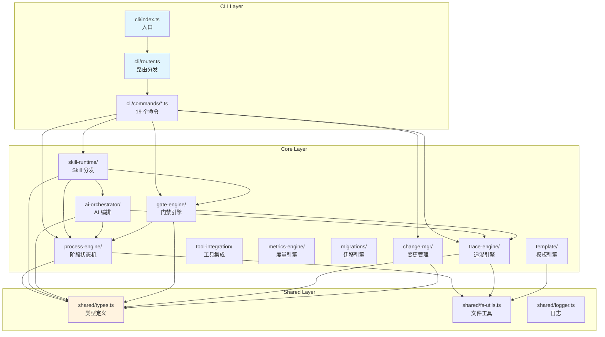
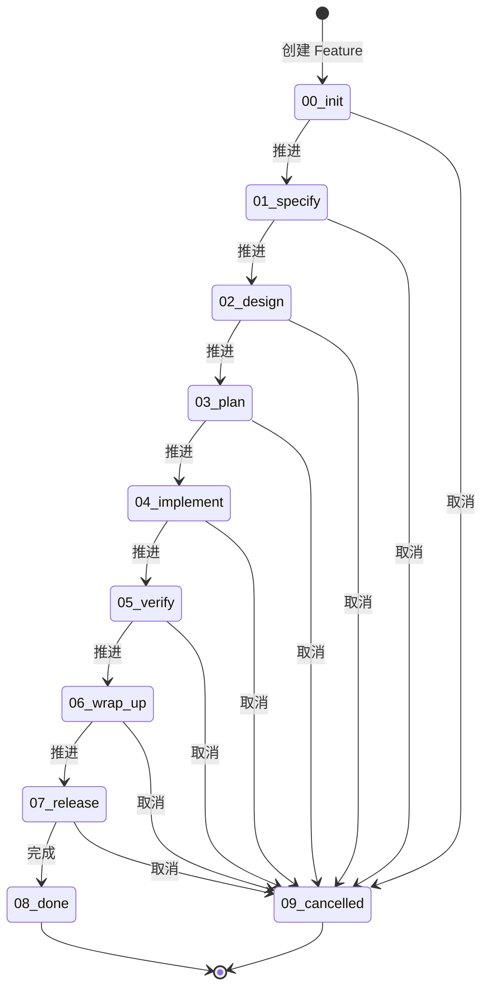
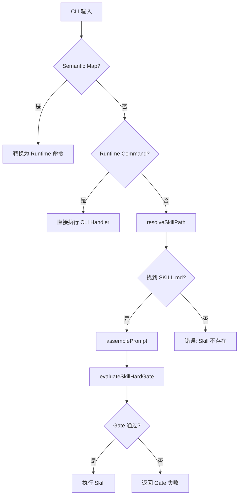

# spec-first 代码结构概览

> 本文档由 `spec-first:first` skill 自动生成，提供项目代码结构的深度视图。

## 项目基本信息

- **项目名**: spec-first
- **版本**: 0.5.45
- **描述**: Specification-driven development process engine for AI-era software development
- **语言**: TypeScript 5.4+ (ESM, strict mode)
- **运行时**: Node.js >=20.0.0
- **端类型**: backend (CLI 工具)
- **包管理器**: pnpm（存在 `pnpm-lock.yaml` 和 `.pnpm-store`）
- **Monorepo**: 否（无 turbo.json/nx.json/pnpm-workspace.yaml，存在 `packages/` 目录但仅含 vscode 扩展子项目）

## 目录结构

```
spec-first/
├── src/
│   ├── cli/                    # CLI 入口与命令路由
│   │   ├── index.ts            # 主入口，注册 19 个命令
│   │   ├── router.ts           # 命令分发器
│   │   ├── parse-utils.ts      # 参数解析工具
│   │   └── commands/           # 19 个命令处理器
│   │       ├── id.ts           # 追溯 ID 生成/校验/检索
│   │       ├── matrix.ts       # 同步追踪矩阵
│   │       ├── init.ts         # 初始化 Feature 工作区
│   │       ├── stage.ts        # 阶段流转管理
│   │       ├── rfc.ts          # RFC 变更请求管理
│   │       ├── defect.ts       # 缺陷跟踪管理
│   │       ├── metrics.ts      # 覆盖率度量
│   │       ├── doctor.ts       # 环境诊断
│   │       ├── gate.ts         # 阶段质量门禁
│   │       ├── ai.ts           # AI 会话恢复
│   │       ├── commit.ts       # 规范提交
│   │       ├── feature.ts      # Feature 管理
│   │       ├── setup.ts        # 注册 Skill 命令
│   │       ├── hooks.ts        # Git Hooks 管理
│   │       ├── viewer.ts       # Stage Viewer
│   │       ├── update.ts       # 升级后刷新
│   │       ├── uninstall.ts    # 卸载前清理
│   │       └── analyze.ts      # 跨产物一致性分析
│   │
│   ├── core/                   # 核心业务模块
│   │   ├── process-engine/     # 阶段状态机（Feature 生命周期）
│   │   │   ├── stage-machine.ts    # Stage 状态转换规则
│   │   │   ├── feature.ts          # Feature 解析与切换
│   │   │   ├── advance.ts          # 阶段推进逻辑
│   │   │   ├── init.ts             # Feature 初始化
│   │   │   ├── layer-merger.ts     # 规则层合并
│   │   │   └── extensions.ts       # 扩展支持
│   │   │
│   │   ├── skill-runtime/      # Skill 分发与执行
│   │   │   ├── dispatcher.ts       # 三层路由分发
│   │   │   ├── prompt-assembler.ts # Prompt 组装
│   │   │   ├── hard-gate.ts        # Hard Gate 校验
│   │   │   ├── first-*.ts          # First Skill 相关模块
│   │   │   ├── orchestrate-args.ts # 编排参数解析
│   │   │   ├── confirm-policy.ts   # 确认策略
│   │   │   └── phase-machine.ts    # Phase 状态机
│   │   │
│   │   ├── ai-orchestrator/    # AI 自动循环与上下文
│   │   │   ├── auto-loop.ts        # AI 自动循环
│   │   │   ├── catchup.ts          # 上下文恢复
│   │   │   ├── context-pack.ts     # Context Pack 构建
│   │   │   ├── context-slicing.ts  # 上下文切片
│   │   │   ├── completion-detector.ts # 完成检测
│   │   │   ├── retry-controller.ts # 重试控制
│   │   │   └── watchdog.ts         # 看门狗
│   │   │
│   │   ├── gate-engine/        # 阶段质量门禁
│   │   │   ├── gate-evaluator.ts   # 门禁条件评估
│   │   │   ├── golive.ts           # 上线就绪检查
│   │   │   ├── command-gate.ts     # 命令门禁
│   │   │   ├── rollback.ts         # 回滚逻辑
│   │   │   ├── security.ts         # 安全扫描
│   │   │   └── sca.ts              # SCA 分析
│   │   │
│   │   ├── trace-engine/       # 追溯 ID 与覆盖率
│   │   │   ├── id-generator.ts     # ID 生成
│   │ │   ├── id-validator.ts     # ID 校验
│   │   │   ├── id-search.ts        # ID 检索
│   │   │   ├── matrix.ts           # 追溯矩阵
│   │   │   ├── coverage.ts         # 覆盖率计算（C1-C9）
│   │   │   └── exception-validator.ts # 异常验证
│   │   │
│   │   ├── change-mgr/         # 变更管理
│   │   │   ├── rfc.ts              # RFC 记录
│   │   │   ├── rfc-machine.ts      # RFC 状态机
│   │   │   ├── defect.ts           # 缺陷记录
│   │   │   ├── defect-machine.ts   # 缺陷状态机
│   │   │   ├── impact.ts           # 影响分析
│   │   │   └── sync.ts             # 同步逻辑
│   │   │
│   │   ├── template/           # 模板渲染
│   │   │   ├── renderer.ts         # Handlebars 渲染
│   │   │   ├── artifact-checker.ts # 产物检查
│   │   │   ├── hash-registry.ts    # 哈希注册表
│   │   │   └── change-classifier.ts # 变更分类
│   │   │
│   │   ├── tool-integration/   # 工具集成
│   │   │   ├── context-sync.ts     # 上下文同步
│   │   │   ├── ai-runtime-hook.ts  # AI Runtime Hook
│   │   │   ├── session-hook.ts     # Session Hook
│   │   │   └── hook-installer.ts   # Hook 安装
│   │   │
│   │   ├── metrics-engine/     # 健康度评分
│   │   │   ├── health-score.ts     # 健康度计算
│   │   │   └── bottleneck.ts       # 瓶颈分析
│   │   │
│   │   └── migrations/         # 迁移引擎
│   │       ├── manifest-engine.ts  # Manifest 执行
│   │       ├── manifest-loader.ts  # Manifest 加载
│   │       └── version-matcher.ts  # 版本匹配
│   │
│   ├── shared/                 # 共享模块
│   │   ├── types.ts            # 核心类型定义
│   │   ├── config-schema.ts    # 配置 Schema
│   │   ├── fs-utils.ts         # 文件系统工具
│   │   ├── logger.ts           # 日志工具
│   │   ├── validators.ts       # 验证器
│   │   ├── crypto-utils.ts     # 加密工具
│   │   ├── host-bootstrap.ts   # 宿主引导
│   │   ├── host-paths.ts       # 宿主路径
│   │   └── skill-commands.ts   # Skill 命令
│   │
│   ├── config/                 # 配置模块
│   │   └── bootstrap-manifest.ts   # 引导 Manifest
│   │
│   ├── postinstall.ts          # npm postinstall 脚本
│   └── preuninstall.ts         # npm preuninstall 脚本
│
├── tests/                      # 测试目录
│   ├── unit/                   # 单元测试
│   ├── integration/            # 集成测试
│   ├── e2e/                    # 端到端测试
│   ├── benchmark/              # 性能基准测试
│   └── fixtures/               # 测试固件
│
├── skills/                     # Skill 定义
│   └── spec-first/             # 内置 Skills
│
├── templates/                  # Handlebars 模板
│
├── scripts/                    # 脚本
│   ├── stage-viewer/           # Stage Viewer 服务
│   └── codex/                  # Codex 自动启动
│
├── packages/                   # 子包（非 Monorepo）
│   └── vscode-spec-first/      # VSCode 扩展
│
└── docs/                       # 文档
```

## 模块划分

| 模块 | 路径 | 职责 | 关键文件 |
|------|------|------|----------|
| **CLI 入口** | `src/cli/` | 命令解析、路由分发、用户交互 | `index.ts`, `router.ts` |
| **Process Engine** | `src/core/process-engine/` | 阶段状态机（8 active + 2 terminal），驱动 Feature 生命周期流转 | `stage-machine.ts`, `feature.ts`, `advance.ts`, `init.ts` |
| **Skill Runtime** | `src/core/skill-runtime/` | Skill 分发、prompt 组装、hard-gate 校验、编排参数解析 | `dispatcher.ts`, `prompt-assembler.ts`, `hard-gate.ts` |
| **AI Orchestrator** | `src/core/ai-orchestrator/` | AI 自动循环（auto-loop）、上下文恢复（catchup）、context-pack | `auto-loop.ts`, `catchup.ts`, `context-pack.ts` |
| **Gate Engine** | `src/core/gate-engine/` | 阶段质量门禁评估、安全扫描、SCA、上线/回滚门禁 | `gate-evaluator.ts`, `golive.ts` |
| **Trace Engine** | `src/core/trace-engine/` | 追溯 ID 生成/校验/搜索、覆盖率矩阵（C1-C9） | `id-generator.ts`, `matrix.ts`, `coverage.ts` |
| **Change Manager** | `src/core/change-mgr/` | RFC + Defect 状态机、影响分析 | `rfc-machine.ts`, `defect-machine.ts`, `impact.ts` |
| **Template** | `src/core/template/` | Handlebars 模板渲染、产物检查 | `renderer.ts`, `artifact-checker.ts` |
| **Tool Integration** | `src/core/tool-integration/` | AI runtime hooks、context 同步 | `context-sync.ts`, `ai-runtime-hook.ts` |
| **Metrics Engine** | `src/core/metrics-engine/` | 健康度评分、瓶颈分析 | `health-score.ts`, `bottleneck.ts` |
| **Migrations** | `src/core/migrations/` | 版本迁移引擎 | `manifest-engine.ts` |
| **Shared** | `src/shared/` | 共享类型、工具函数、配置 Schema | `types.ts`, `fs-utils.ts`, `logger.ts` |

## 入口文件

### 主入口：`src/cli/index.ts`

- **位置**: `src/cli/index.ts:46-48`
- **代码**: `const code = await dispatch(process.argv.slice(2)); process.exit(code);`
- **职责**: 注册所有命令，分发 CLI 参数到对应处理器

### 命令注册（19 个命令）

- **证据**: `src/cli/index.ts:27-45`
- 命令列表：
  1. `id` - 追溯 ID 生成、校验与检索
  2. `matrix` - 同步追踪矩阵
  3. `init` - 初始化 Feature 工作区
  4. `stage` - 阶段流转管理（current/advance/cancel）
  5. `rfc` - RFC 变更请求与状态管理
  6. `defect` - 缺陷跟踪与状态管理
  7. `metrics` - 覆盖率度量与健康评分
  8. `doctor` - 环境诊断与修复
  9. `gate` - 阶段质量门禁评估
  10. `golive` - 上线就绪检查与批准
  11. `ai` - 会话恢复与上下文摘要
  12. `commit` - 规范提交并关联追溯 ID
  13. `feature` - Feature 列表、切换与查看
  14. `setup` - 注册 Claude Code + Codex Skill 命令
  15. `hooks` - Git Hooks 安装与状态管理
  16. `viewer` - Stage Viewer 可视化面板
  17. `update` - 升级后刷新 Skill/MCP/Hooks
  18. `uninstall` - 清理宿主配置（卸载前执行）
  19. `analyze` - 跨产物一致性分析

## 构建/运行命令

| 命令 | 描述 | 证据 |
|------|------|------|
| `npm run build` | tsup 打包 | `package.json:10` - `"build": "tsup"` |
| `npm run typecheck` | tsc 类型检查 | `package.json:11` - `"typecheck": "tsc --noEmit"` |
| `npm test` | vitest 运行全量测试 | `package.json:12` - `"test": "vitest run"` |
| `npm run test:watch` | vitest watch 模式 | `package.json:13` - `"test:watch": "vitest"` |
| `npm run test:coverage` | vitest 覆盖率报告 | `package.json:14` - `"test:coverage": "vitest run --coverage"` |
| `npm run lint` | eslint 检查 | `package.json:15` - `"lint": "eslint src"` |
| `npm run lint:fix` | eslint 自动修复 | `package.json:16` - `"lint:fix": "eslint src --fix"` |
| `npm run format` | prettier 格式化 | `package.json:17` - `"format": "prettier --write \"src/**/*.ts\""` |
| `npm run bench` | vitest 性能基准 | `package.json:18` - `"bench": "vitest bench"` |
| `npm run viewer:start` | Stage Viewer 服务 | `package.json:19` |

## 核心模块详解

### 1. Process Engine（阶段状态机）

**职责**: 驱动 Feature 生命周期流转，管理 8 个活跃阶段 + 2 个终止阶段

**Stage 枚举定义**（`src/shared/types.ts:6-17`）:
```typescript
export enum Stage {
  INIT = '00_init',
  SPECIFY = '01_specify',
  DESIGN = '02_design',
  PLAN = '03_plan',
  IMPLEMENT = '04_implement',
  VERIFY = '05_verify',
  WRAP_UP = '06_wrap_up',
  RELEASE = '07_release',
  DONE = '08_done',
  CANCELLED = '09_cancelled',
}
```

**状态转换规则**（`src/core/process-engine/stage-machine.ts:7-16`）:
```typescript
TRANSITIONS = new Map<Stage, ReadonlySet<Stage>>([
  [Stage.INIT,      new Set([Stage.SPECIFY, Stage.CANCELLED])],
  [Stage.SPECIFY,   new Set([Stage.DESIGN, Stage.CANCELLED])],
  [Stage.DESIGN,    new Set([Stage.PLAN, Stage.CANCELLED])],
  [Stage.PLAN,      new Set([Stage.IMPLEMENT, Stage.CANCELLED])],
  [Stage.IMPLEMENT, new Set([Stage.VERIFY, Stage.CANCELLED])],
  [Stage.VERIFY,    new Set([Stage.WRAP_UP, Stage.CANCELLED])],
  [Stage.WRAP_UP,   new Set([Stage.RELEASE, Stage.CANCELLED])],
  [Stage.RELEASE,   new Set([Stage.DONE, Stage.CANCELLED])],
])
```

**关键函数**:
- `getNextStages(stage: Stage): ReadonlySet<Stage>` - 获取下一可达阶段
- `assertTransitionAllowed(from: Stage, to: Stage)` - 断言转换合法性
- `isTerminal(stage: Stage): boolean` - 判断是否终止阶段

### 2. Skill Runtime（Skill 分发）

**职责**: 三层路由分发、Prompt 组装、Hard Gate 校验

**三层路由机制**:

1. **Semantic Map** - 复合命令映射（`src/core/skill-runtime/dispatcher.ts:34-40`）:
```typescript
SEMANTIC_MAP: Record<string, { command: string; argTemplate: string }> = {
  'rfc approve': { command: 'rfc', argTemplate: 'transition {0} approved' },
  'rfc reject': { command: 'rfc', argTemplate: 'transition {0} rejected' },
  'rfc close': { command: 'rfc', argTemplate: 'transition {0} closed' },
  'defect fix': { command: 'defect', argTemplate: 'update {0} {1} --status fixing' },
  'defect verify': { command: 'defect', argTemplate: 'update {0} {1} --status verified' },
}
```

2. **Runtime Commands** - 直接分发为 CLI 命令（`src/core/skill-runtime/dispatcher.ts:43-47`）:
```typescript
RUNTIME_COMMANDS = new Set([
  'id', 'matrix', 'stage', 'rfc', 'defect',
  'metrics', 'gate', 'golive', 'ai',
  'commit', 'feature',
])
```

3. **Skill Route** - 搜索 `skills/spec-first/NN-name/SKILL.md`（`src/core/skill-runtime/dispatcher.ts:180-210`）

**关键函数**:
- `dispatchCommand(args, projectRoot)` - 主分发函数
- `resolveSkillPath(skillName, projectRoot)` - 解析 Skill 路径
- `assemblePrompt(skillPath, context)` - 组装 Prompt
- `evaluateSkillHardGate(skillPath, projectRoot)` - 评估 Hard Gate

### 3. AI Orchestrator（AI 编排）

**职责**: AI 自动循环、上下文恢复、Context Pack 构建

**关键接口**:

`AutoLoopResult`（`src/core/ai-orchestrator/auto-loop.ts`）:
```typescript
interface AutoLoopResult {
  completedTasks: number;
  halted: boolean;
  haltReason?: string;
  iterations: number;
}
```

`CatchupResult`（`src/core/ai-orchestrator/catchup.ts`）:
```typescript
interface CatchupResult {
  featureId: string;
  currentPhase: string;
  currentTask?: string;
  completedTasks: number;
  totalTasks: number;
  summary: string;
  fiveQuestions: string[];
  // ...
}
```

`ContextPack`（`src/core/ai-orchestrator/context-pack.ts`）:
```typescript
interface ContextPack {
  version: string;
  budget: number;
  control: ControlZone;
  references: ContextRef[];
  slicing: { ... };
}
```

### 4. Gate Engine（门禁引擎）

**职责**: 阶段质量门禁评估、上线就绪检查

**关键函数**:
- `evaluateGate(featureId, stage, projectRoot)` - 评估门禁条件
- `checkGoLive(featureId, projectRoot)` - 上线就绪检查

**门禁条件**（`src/core/gate-engine/gate-evaluator.ts`）:
- `GATE_CONDITIONS` - 各阶段门禁条件定义
- 覆盖规范质量、测试覆盖、安全合规等维度

### 5. Trace Engine（追溯引擎）

**职责**: 追溯 ID 生成/校验/搜索、覆盖率矩阵

**追溯 ID 类型**（`src/shared/types.ts:26-30`）:
```typescript
export type NextIdType =
  | 'FR' | 'DS' | 'TASK' | 'TC' | 'RFC'
  | 'REQ' | 'SYS' | 'ARCH' | 'MOD'
  | 'ATP' | 'STP' | 'ITP' | 'UTP';

export type IdType = NextIdType | 'Feature';
```

**覆盖率指标**（`src/core/trace-engine/coverage.ts`）:
- C1-C9 覆盖率计算
- `getCoverage()` - 计算全部覆盖率指标

### 6. Change Manager（变更管理）

**职责**: RFC + Defect 状态机、影响分析

**RFC 状态机**（`src/core/change-mgr/rfc-machine.ts`）:
- `RFC_TRANSITIONS` - RFC 状态转换规则
- `assertRfcTransition(from, to)` - 断言 RFC 转换

**Defect 状态机**（`src/core/change-mgr/defect-machine.ts`）:
- `DEFECT_TRANSITIONS` - 缺陷状态转换规则
- `assertDefectTransition(from, to)` - 断言缺陷转换

### 7. Template（模板引擎）

**职责**: Handlebars 模板渲染、产物检查

**关键函数**:
- `renderTemplate(templateName, context)` - 渲染模板
- `ensureArtifacts(stage, featureDir)` - 确保产物存在

### 8. Metrics Engine（度量引擎）

**职责**: 健康度评分、瓶颈分析

**健康度计算**（`src/core/metrics-engine/health-score.ts`）:
```typescript
interface HealthScore {
  grade: string;    // A/B/C/D/F
  Q1: number;       // 质量分
  H1: number;       // 健康分
  E1: number;       // 效率分
  breakdown: { ... };
}
```

## CLI 命令列表

| 命令 | 描述 | 处理器 |
|------|------|--------|
| `id` | 追溯 ID 生成、校验与检索 | `handleId` |
| `matrix` | 同步追踪矩阵 | `handleMatrix` |
| `init` | 初始化 Feature 工作区 | `handleInit` |
| `stage` | 阶段流转管理（current/advance/cancel） | `handleStage` |
| `rfc` | RFC 变更请求与状态管理 | `handleRfc` |
| `defect` | 缺陷跟踪与状态管理 | `handleDefect` |
| `metrics` | 覆盖率度量与健康评分 | `handleMetrics` |
| `doctor` | 环境诊断与修复 | `handleDoctor` |
| `gate` | 阶段质量门禁评估 | `handleGate` |
| `golive` | 上线就绪检查与批准 | `handleGoLive` |
| `ai` | 会话恢复与上下文摘要 | `handleAi` |
| `commit` | 规范提交并关联追溯 ID | `handleCommit` |
| `feature` | Feature 列表、切换与查看 | `handleFeature` |
| `setup` | 注册 Claude Code + Codex Skill 命令 | `handleSetup` |
| `hooks` | Git Hooks 安装与状态管理 | `handleHooks` |
| `viewer` | Stage Viewer 可视化面板 | `handleViewer` |
| `update` | 升级后刷新 Skill/MCP/Hooks | `handleUpdate` |
| `uninstall` | 清理宿主配置（卸载前执行） | `handleUninstall` |
| `analyze` | 跨产物一致性分析 | `handleAnalyze` |

**证据**: `src/cli/index.ts:27-45`

## 依赖关系图



## 关键业务流程

### Feature 生命周期



### Skill 分发流程



## 技术约束

- **ESM only** - 全项目 `"type": "module"`，使用 `import/export`
- **Named exports only** - core 模块不使用 default export
- **文件命名**: `kebab-case.ts`
- **类型集中**: 所有共享类型定义在 `src/shared/types.ts`
- **未使用变量**: 以 `_` 前缀标记（eslint 规则 `^_`）
- **覆盖率阈值**: lines/functions/statements 75%, branches 65%

## 证据索引

| 结论 | 证据 |
|------|------|
| 入口文件为 `src/cli/index.ts` | `src/cli/index.ts:46-48` - `const code = await dispatch(process.argv.slice(2)); process.exit(code);` - [代码] |
| 19 个命令注册 | `src/cli/index.ts:27-45` - 19 个 `registerCommand` 调用 - [代码] |
| Stage 枚举定义 | `src/shared/types.ts:6-17` - Stage enum 定义 - [类型定义] |
| 阶段转换规则 | `src/core/process-engine/stage-machine.ts:7-16` - TRANSITIONS Map - [常量] |
| Runtime Commands 集合 | `src/core/skill-runtime/dispatcher.ts:43-47` - RUNTIME_COMMANDS Set - [常量] |
| Semantic Map 映射 | `src/core/skill-runtime/dispatcher.ts:34-40` - SEMANTIC_MAP 对象 - [常量] |
| 追溯 ID 类型 | `src/shared/types.ts:26-30` - NextIdType / IdType 定义 - [类型定义] |
| ExitCode 枚举 | `src/shared/types.ts:40-47` - ExitCode enum - [类型定义] |
| Node.js 最低版本 | `package.json:26-28` - `"engines": {"node": ">=20.0.0"}` - [配置] |
| ESM 模式 | `package.json:6` - `"type": "module"` - [配置] |

---

*生成时间: 2026-03-03 | 模式: deep | 命令: `/spec-first:first`*
