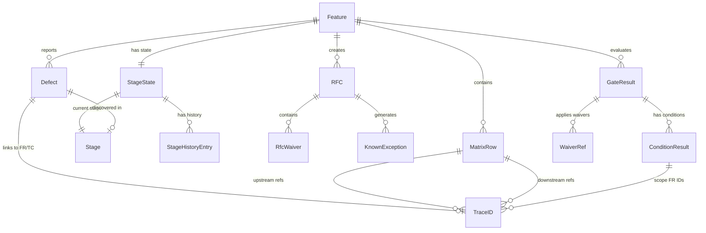
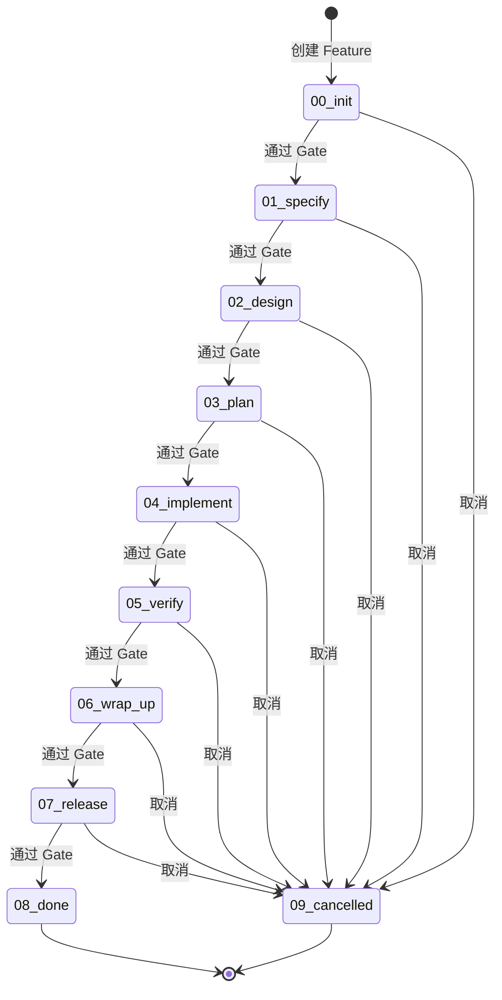
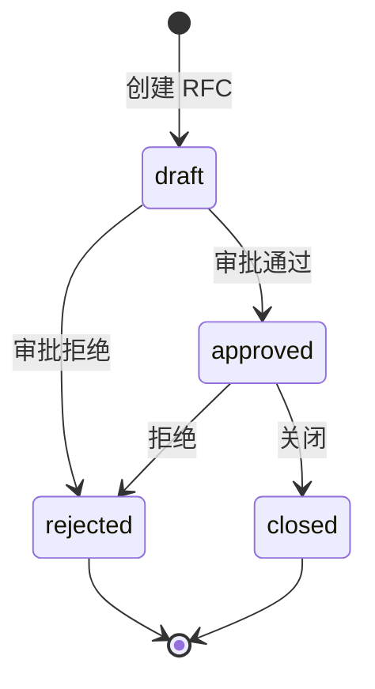
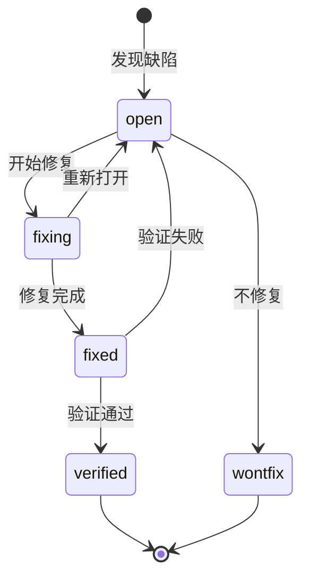
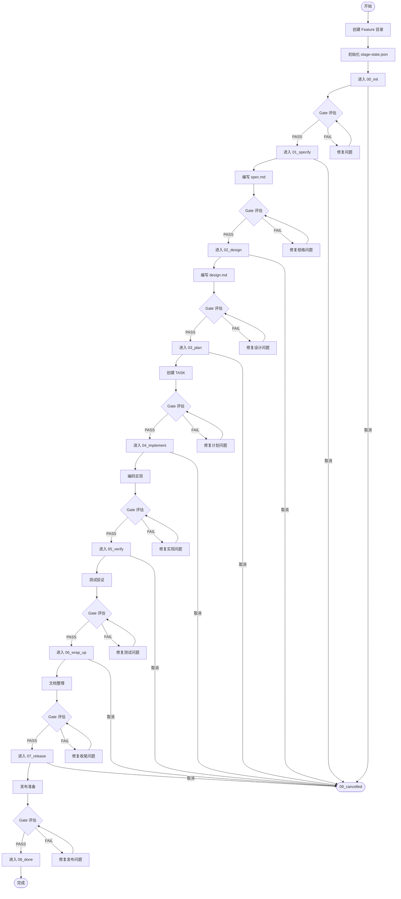
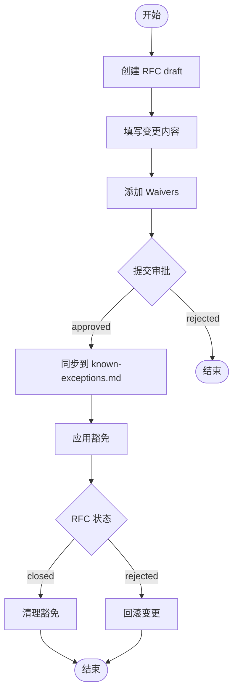
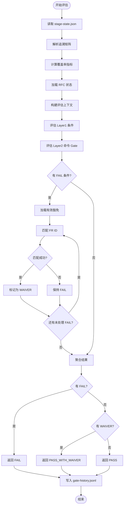

# spec-first 领域模型

> 本文档由 `spec-first:first` Agent A4 自动生成，梳理项目的核心业务概念与规则。

## 1. 核心领域概念

| 概念名称 | 说明 | 类型 | 代码位置 |
|----------|------|------|----------|
| Feature | 功能需求实体，项目的核心聚合根 | 聚合根 | `src/core/process-engine/feature.ts:L1-L113` |
| Stage | 开发阶段枚举，定义 Feature 的生命周期阶段 | 枚举 | `src/shared/types.ts:L7-L18` |
| StageState | Feature 的阶段状态持久化结构 | 值对象 | `src/shared/types.ts:L59-L75` |
| RFC | 变更请求，用于管理需求变更和豁免 | 实体 | `src/core/change-mgr/rfc.ts:L1-L231` |
| Defect | 缺陷跟踪，管理发现的问题 | 实体 | `src/core/change-mgr/defect.ts:L1-L168` |
| TraceID | 追溯标识，支持全链路追溯 | 值对象 | `src/core/trace-engine/id-validator.ts:L1-L42` |
| MatrixRow | 追溯矩阵行，记录 ID 间的关联关系 | 值对象 | `src/shared/types.ts:L163-L172` |
| GateResult | 门禁评估结果，三态输出 | 值对象 | `src/shared/types.ts:L96-L103` |
| Waiver | 豁免记录，允许临时绕过某些门禁条件 | 值对象 | `src/shared/types.ts:L89-L94` |
| CoverageMetrics | 覆盖率指标集合（C1-C9） | 值对象 | `src/shared/types.ts:L175-L185` |

## 2. 领域关系图



## 3. 状态机定义

### 3.1 Stage 状态机（8 active + 2 terminal）



| 状态 | 说明 | 允许转换 | 代码位置 |
|------|------|----------|----------|
| 00_init | 初始化阶段 | 01_specify, 09_cancelled | `src/core/process-engine/stage-machine.ts:L9` |
| 01_specify | 需求定义阶段 | 02_design, 09_cancelled | `src/core/process-engine/stage-machine.ts:L10` |
| 02_design | 设计阶段 | 03_plan, 09_cancelled | `src/core/process-engine/stage-machine.ts:L11` |
| 03_plan | 计划阶段 | 04_implement, 09_cancelled | `src/core/process-engine/stage-machine.ts:L12` |
| 04_implement | 实现阶段 | 05_verify, 09_cancelled | `src/core/process-engine/stage-machine.ts:L13` |
| 05_verify | 验证阶段 | 06_wrap_up, 09_cancelled | `src/core/process-engine/stage-machine.ts:L14` |
| 06_wrap_up | 收尾阶段 | 07_release, 09_cancelled | `src/core/process-engine/stage-machine.ts:L15` |
| 07_release | 发布阶段 | 08_done, 09_cancelled | `src/core/process-engine/stage-machine.ts:L16` |
| 08_done | 终态-完成 | 无（终态） | `src/shared/types.ts:L21-L24` |
| 09_cancelled | 终态-取消 | 无（终态） | `src/shared/types.ts:L21-L24` |

**状态机规则** (`src/core/process-engine/stage-machine.ts:L30-L38`):
```typescript
// 终态不可逆
if (TERMINAL_STAGES.has(from)) {
  throw new TransitionError(from, to, 'source stage is terminal');
}
// 只能转换到允许的目标状态
const allowed = TRANSITIONS.get(from);
if (!allowed || !allowed.has(to)) {
  throw new TransitionError(from, to, 'transition not allowed');
}
```

### 3.2 RFC 状态机（4 态）



| 状态 | 说明 | 允许转换 | 代码位置 |
|------|------|----------|----------|
| draft | 草稿状态 | approved, rejected | `src/core/change-mgr/rfc-machine.ts:L10` |
| approved | 已批准 | closed, rejected | `src/core/change-mgr/rfc-machine.ts:L11` |
| rejected | 已拒绝（终态） | 无 | `src/core/change-mgr/rfc-machine.ts:L14` |
| closed | 已关闭（终态） | 无 | `src/core/change-mgr/rfc-machine.ts:L14` |

### 3.3 Defect 状态机（5 态）



| 状态 | 说明 | 允许转换 | 代码位置 |
|------|------|----------|----------|
| open | 待处理 | fixing, wontfix | `src/core/change-mgr/defect-machine.ts:L11` |
| fixing | 修复中 | fixed, open | `src/core/change-mgr/defect-machine.ts:L12` |
| fixed | 已修复 | verified, open | `src/core/change-mgr/defect-machine.ts:L13` |
| verified | 已验证（终态） | 无 | `src/core/change-mgr/defect-machine.ts:L16` |
| wontfix | 不修复（终态） | 无 | `src/core/change-mgr/defect-machine.ts:L16` |

## 4. 业务规则

### 4.1 核心规则

| 规则 | 说明 | 约束 | 代码位置 |
|------|------|------|----------|
| Stage 单向流转 | 阶段只能向前推进，不可回退 | `TRANSITIONS` Map 定义了合法转换 | `src/core/process-engine/stage-machine.ts:L8-L17` |
| 终态不可逆 | DONE/CANCELLED 状态无法再转换 | `TERMINAL_STAGES.has(from)` 检查 | `src/core/process-engine/stage-machine.ts:L31-L33` |
| Gate 三态结果 | PASS / PASS_WITH_WAIVER / FAIL | 豁免条件可将 FAIL 转为 WAIVER | `src/core/gate-engine/gate-evaluator.ts:L366-L375` |
| Waiver 精确匹配 | 豁免必须精确匹配 FR ID | `scopeFrIds.includes(ex.frId)` | `src/core/gate-engine/gate-evaluator.ts:L344-L346` |
| ID 格式校验 | 所有 ID 必须符合预定义正则 | 14 种 ID 格式正则 | `src/core/trace-engine/id-validator.ts:L8-L23` |
| Abbr 格式约束 | 缩写必须 1-16 位大写字母+数字，首字符字母 | `/^[A-Z][A-Z0-9]{0,15}$/` | `src/core/trace-engine/id-generator.ts:L52-L58` |
| V-Model 追溯 | REQ↔ATP, SYS↔STP, ARCH↔ITP, MOD↔UTP | 双向追溯完整性校验 | `src/core/trace-engine/matrix.ts:L19-L31` |
| 缺陷逃逸率 | verify 之后发现的缺陷占比 | `POST_VERIFY_STAGES.has(discoveredIn)` | `src/core/change-mgr/defect.ts:L150-L166` |

### 4.2 Gate 条件规则

| 阶段 | 条件 ID | 描述 | 阈值 | 代码位置 |
|------|---------|------|------|----------|
| 00_init | G-INIT-01 | Feature 目录存在 | - | `src/core/gate-engine/gate-evaluator.ts:L43-L51` |
| 00_init | G-INIT-02 | Mode/Size/Platforms 已确认 | - | `src/core/gate-engine/gate-evaluator.ts:L52-L60` |
| 01_specify | G-SPEC-02 | FR/NFR ID 已分配 | count > 0 | `src/core/gate-engine/gate-evaluator.ts:L83-L89` |
| 01_specify | G-SPEC-03 | 规格质量分 (C10) | ≥ 80% | `src/core/gate-engine/gate-evaluator.ts:L90-L97` |
| 02_design | G-DESIGN-02 | API 覆盖率 (C2) | = 100% | `src/core/gate-engine/gate-evaluator.ts:L110-L124` |
| 03_plan | G-PLAN-01 | 任务覆盖率 (C3) | = 100% | `src/core/gate-engine/gate-evaluator.ts:L135-L150` |
| 03_plan | G-PLAN-03 | Analyze CRITICAL 发现 | = 0 | `src/core/gate-engine/gate-evaluator.ts:L160-L167` |
| 04_implement | G-IMPL-01 | 单元测试覆盖率 (C4) | ≥ 80% | `src/core/gate-engine/gate-evaluator.ts:L170-L185` |
| 05_verify | G-VERIFY-01 | FR 测试覆盖率 (C4) | = 100% | `src/core/gate-engine/gate-evaluator.ts:L197-L212` |
| 05_verify | G-VERIFY-02 | AC 测试覆盖率 (C5) | S:60%, M/L:90% | `src/core/gate-engine/gate-evaluator.ts:L213-L228` |
| 06_wrap_up | G-WRAP-01 | 实现覆盖率 (C6) | = 100% | `src/core/gate-engine/gate-evaluator.ts:L240-L248` |

## 5. 值对象与枚举

### 5.1 Stage 枚举

```typescript
enum Stage {
  INIT = '00_init',
  SPECIFY = '01_specify',
  DESIGN = '02_design',
  PLAN = '03_plan',
  IMPLEMENT = '04_implement',
  VERIFY = '05_verify',
  WRAP_UP = '06_wrap_up',
  RELEASE = '07_release',
  DONE = '08_done',
  CANCELLED = '09_cancelled',
}
// 位置: `src/shared/types.ts:L7-L18`
```

### 5.2 IdType 联合类型

```typescript
type NextIdType =
  | 'FR' | 'DS' | 'TASK' | 'TC' | 'RFC'
  | 'REQ' | 'SYS' | 'ARCH' | 'MOD'
  | 'ATP' | 'STP' | 'ITP' | 'UTP';
type IdType = NextIdType | 'Feature';
// 位置: `src/shared/types.ts:L27-L31`
```

### 5.3 ID 格式正则

```typescript
// 14 种 ID 格式正则定义
const ID_PATTERNS = [
  { type: 'Feature', regex: /^FSREQ-\d{8}-[A-Z][A-Z0-9]{1,15}-\d{3}$/ },
  { type: 'FR',      regex: /^FR-[A-Z][A-Z0-9]{1,15}-\d{3}$/ },
  { type: 'DS',      regex: /^DS-[A-Z][A-Z0-9]{1,15}-\d{3}$/ },
  { type: 'TASK',    regex: /^TASK-[A-Z][A-Z0-9]{1,15}-\d{3}$/ },
  { type: 'TC',      regex: /^TC-(UT|IT|E2E|ST)-[A-Z][A-Z0-9]{1,15}-\d{3}$/ },
  { type: 'RFC',     regex: /^RFC-\d{3}$/ },
  // ... 其他类型
];
// 位置: `src/core/trace-engine/id-validator.ts:L8-L23`
```

### 5.4 覆盖率指标

```typescript
interface CoverageMetrics {
  C1: number; // Design Coverage
  C2: number; // API Coverage
  C3: number; // Task Coverage
  C4: number; // Test Coverage (FR)
  C5: number; // Test Coverage (AC)
  C6: number; // Impl Coverage
  C7: number; // PR Compliance
  C8: number; // Task Compliance
  C9: number; // TC Compliance
}
// 位置: `src/shared/types.ts:L175-L185`
```

### 5.5 缺陷严重级别

```typescript
type SecuritySeverity = 'S1' | 'S2' | 'S3' | 'S4';
// 位置: `src/shared/types.ts:L136`
```

### 5.6 RFC 级别

```typescript
type RfcLevel = 'Minor' | 'Major' | 'Critical';
// 位置: `src/shared/types.ts:L107`
```

### 5.7 Mode / Size

```typescript
type Mode = 'N' | 'I';  // New / Iteration
type Size = 'S' | 'M' | 'L';  // Small / Medium / Large
// 位置: `src/shared/types.ts:L37-L38`
```

## 6. 领域服务

| 服务 | 职责 | 入口方法 | 代码位置 |
|------|------|----------|----------|
| **StageMachine** | 阶段状态机，校验转换合法性 | `assertTransitionAllowed()`, `getNextStages()`, `isTerminal()` | `src/core/process-engine/stage-machine.ts` |
| **RfcMachine** | RFC 状态机，校验 RFC 转换 | `assertRfcTransition()`, `getNextRfcStatuses()`, `isRfcTerminal()` | `src/core/change-mgr/rfc-machine.ts` |
| **DefectMachine** | 缺陷状态机，校验缺陷转换 | `assertDefectTransition()`, `getNextDefectStatuses()`, `isDefectTerminal()` | `src/core/change-mgr/defect-machine.ts` |
| **FeatureService** | Feature CRUD 操作 | `currentFeature()`, `switchFeature()`, `getFeatureState()`, `listFeatures()` | `src/core/process-engine/feature.ts` |
| **RfcService** | RFC CRUD 操作 | `createRfc()`, `getRfc()`, `transitionRfc()`, `submitRfc()`, `listRfc()` | `src/core/change-mgr/rfc.ts` |
| **DefectService** | 缺陷 CRUD 操作 | `registerDefect()`, `getDefect()`, `transitionDefect()`, `listDefects()` | `src/core/change-mgr/defect.ts` |
| **IdValidator** | ID 格式校验 | `validateId()` | `src/core/trace-engine/id-validator.ts` |
| **IdGenerator** | ID 生成与注册 | `nextId()` | `src/core/trace-engine/id-generator.ts` |
| **MatrixService** | 追溯矩阵管理 | `parseMatrix()`, `checkMatrix()`, `exportMatrix()`, `updateMatrixRow()` | `src/core/trace-engine/matrix.ts` |
| **GateEvaluator** | Gate 条件评估 | `evaluateGate()`, `getConditions()`, `getGateHistory()` | `src/core/gate-engine/gate-evaluator.ts` |

## 7. 业务流程

### 7.1 Feature 生命周期



### 7.2 RFC 处理流程



### 7.3 Gate 评估流程



## 8. 待确认项

| 项目 | 推断依据 | 需确认 |
|------|----------|--------|
| C10/C11 指标来源 | `evaluateSpecQualityScore()` 和 `evaluateConstitutionCompliance()` 实现 | 是否有标准化的指标定义文档？ |
| V-Model 映射规则 | `V_MODEL_FORWARD` 和 `V_MODEL_BACKWARD` 常量 | REQ↔ATP 等映射是否为行业标准？ |
| 缺陷逃逸阶段定义 | `POST_VERIFY_STAGES = ['06_wrap_up', '07_release', '08_done']` | 06_wrap_up 是否应计入逃逸？ |
| Size 阈值差异 | C5 阈值 S=60%, M/L=90% | 阈值来源是否有业务依据？ |
| Mode (N/I) 用途 | StageState 中定义但未见使用 | Mode 是否影响 Gate 条件？ |

---

*生成时间: 2026-03-03 | 分析模式: LSP*
