# Spec-First 系统架构文档

> 本文档描述 Spec-First 研发流程引擎的系统架构、分层设计和模块交互。

---

## 一、架构概览

### 1.1 架构定位

Spec-First 是一个 **规范驱动的全链路研发闭环工具**，采用 **分层架构** 设计：

- **CLI 层**：用户交互入口，命令路由与分发
- **核心引擎层**：业务逻辑核心，状态机与流程编排
- **工具集成层**：AI 编排、模板渲染、外部工具集成
- **基础设施层**：文件系统、配置管理、日志、类型系统

### 1.2 架构图

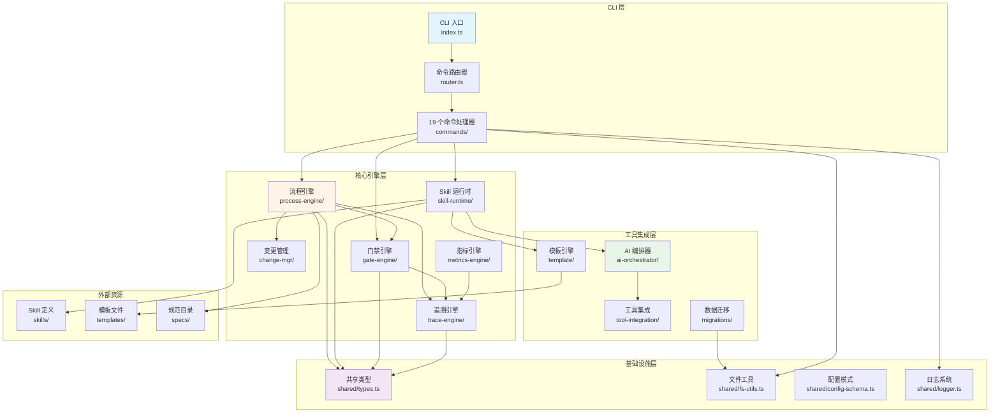

---

## 二、分层架构详解

### 2.1 CLI 层

**职责**：用户交互、命令解析、路由分发

| 组件 | 文件 | 职责 |
|------|------|------|
| CLI 入口 | `src/cli/index.ts` | 注册 19 个命令，解析 `process.argv`，调用 `dispatch()` |
| 命令路由器 | `src/cli/router.ts` | `registerCommand()` 注册表，`dispatch()` 分发逻辑 |
| 命令处理器 | `src/cli/commands/*.ts` | 19 个命令的具体实现（init, stage, rfc, defect 等） |

**关键特性**：
- **统一错误处理**：`router.ts` 中的 `try-catch` 包装
- **确认策略评估**：`evaluatePolicy()` 在命令执行前检查
- **版本/帮助信息**：`--version`、`--help` 统一处理

**依赖关系**：
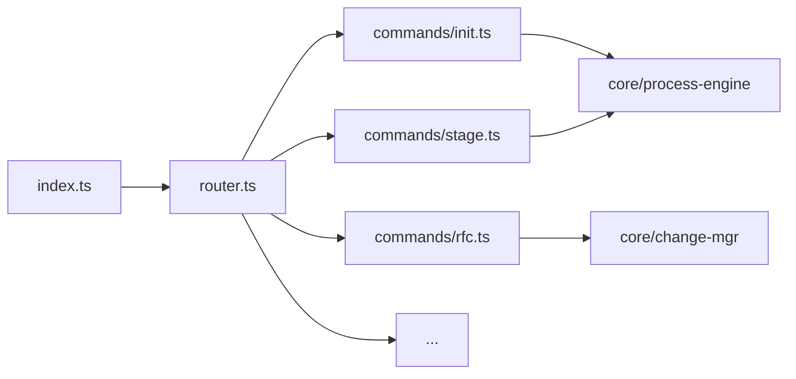

---

### 2.2 核心引擎层

**职责**：业务逻辑核心，状态机管理，流程编排

#### 2.2.1 Process Engine（流程引擎）

**核心模块**：`src/core/process-engine/`

| 文件 | 职责 |
|------|------|
| `stage-machine.ts` | Stage 状态机（8 active + 2 terminal） |
| `feature.ts` | Feature 生命周期管理（创建、加载、保存） |
| `advance.ts` | 阶段推进逻辑（Gate 检查 → 状态转换） |
| `init.ts` | Feature 初始化（目录创建、配置生成） |
| `layer-merger.ts` | 规则层级合并（Mode + Size + Platform） |
| `extensions.ts` | Stage 扩展工具 |

**关键流程**：
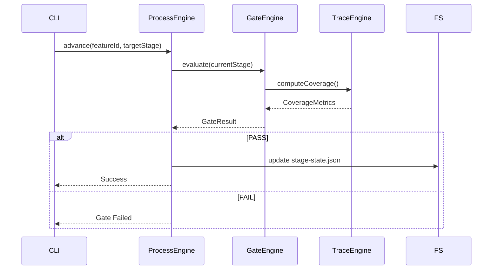

---

#### 2.2.2 Skill Runtime（Skill 运行时）

**核心模块**：`src/core/skill-runtime/`

| 文件 | 职责 |
|------|------|
| `dispatcher.ts` | Skill 三层路由分发（Semantic Map → Runtime Route → Skill Route） |
| `prompt-assembler.ts` | Prompt 组装（模板 + 上下文 + Hard Gate 通知） |
| `hard-gate.ts` | Hard Gate 校验（强制前置条件） |
| `confirm-policy.ts` | 确认策略评估（Mode N/I + Size S/M/L） |
| `first-*.ts` | First Skill 专用逻辑（变更检测、平台检测、产物映射等） |
| `orchestrate-args.ts` | 编排参数解析（--auto、--max-iter 等） |
| `phase-machine.ts` | Phase 状态机（Skill 内部阶段） |

**Skill 分发流程**：
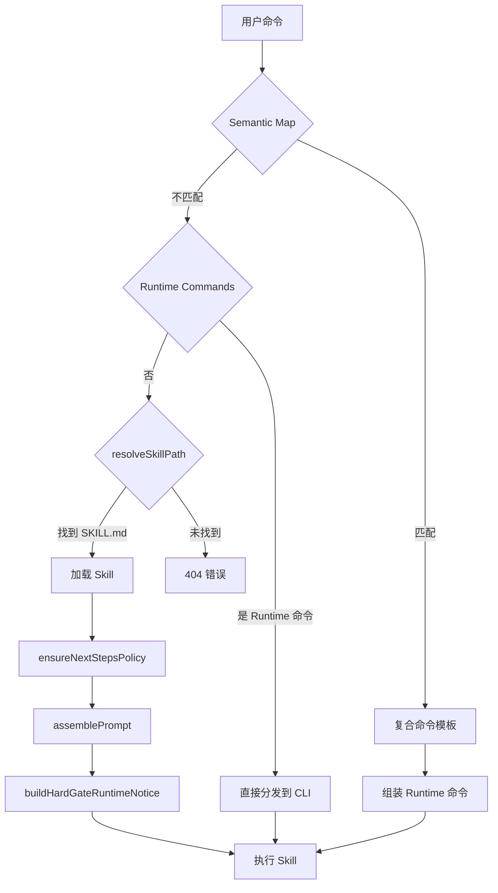

---

#### 2.2.3 Gate Engine（门禁引擎）

**核心模块**：`src/core/gate-engine/`

| 文件 | 职责 |
|------|------|
| `gate-evaluator.ts` | 门禁评估主逻辑（条件检查 → 豁免匹配 → 结果生成） |
| `security.ts` | 安全扫描（SAST、依赖漏洞） |
| `sca.ts` | 软件成分分析（License 合规） |
| `golive.ts` | 上线门禁（灰度/全量检查） |

**门禁评估逻辑**：
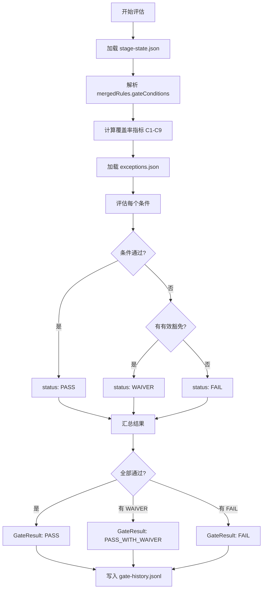

---

#### 2.2.4 Trace Engine（追溯引擎）

**核心模块**：`src/core/trace-engine/`

| 文件 | 职责 |
|------|------|
| `id-generator.ts` | 追溯 ID 生成（FR-001、DS-002、TASK-003 等） |
| `id-validator.ts` | ID 格式校验（类型、序号、Feature 前缀） |
| `matrix.ts` | 追溯矩阵解析与查询（upstream/downstream 关系） |
| `search.ts` | ID 搜索（全文检索、类型过滤） |
| `coverage.ts` | 覆盖率计算（C1-C9 指标） |
| `impact.ts` | 影响分析（BFS 遍历上游/下游） |

**追溯矩阵结构**：
```
FR-001 (需求)
  ├── DS-001 (设计) → upstream: [FR-001]
  │     ├── TASK-001 (任务) → upstream: [DS-001]
  │     │     └── TC-001 (测试) → upstream: [TASK-001]
  │     └── TASK-002 → upstream: [DS-001]
  └── DS-002 → upstream: [FR-001]
```

---

#### 2.2.5 Change Manager（变更管理）

**核心模块**：`src/core/change-mgr/`

| 文件 | 职责 |
|------|------|
| `rfc-machine.ts` | RFC 状态机（draft → approved → closed） |
| `defect-machine.ts` | Defect 状态机（open → fixing → fixed → verified） |
| `impact.ts` | 变更影响分析（追溯链遍历） |
| `waiver.ts` | 豁免管理（生成、验证、过期检查） |

**RFC 状态机**：
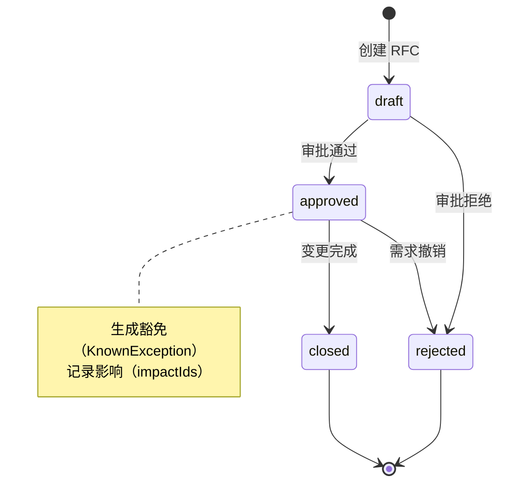

---

#### 2.2.6 Metrics Engine（指标引擎）

**核心模块**：`src/core/metrics-engine/`

| 文件 | 职责 |
|------|------|
| `health-score.ts` | 健康度评分（覆盖率 + 合规率 + 活跃度） |
| `bottleneck.ts` | 瓶颈分析（阶段耗时、阻塞点） |

---

### 2.3 工具集成层

**职责**：AI 编排、模板渲染、外部工具集成

#### 2.3.1 AI Orchestrator（AI 编排器）

**核心模块**：`src/core/ai-orchestrator/`

| 文件 | 职责 |
|------|------|
| `auto-loop.ts` | 自动循环执行（迭代任务调度） |
| `catchup.ts` | 上下文恢复（会话恢复、状态摘要） |
| `context-pack.ts` | 上下文打包（Feature 状态 + 追溯矩阵 + Gate 结果） |
| `watchdog.ts` | 超时监控（任务超时、心跳停滞） |
| `completion-detector.ts` | 完成度检测（产物检查、覆盖率验证） |
| `slop-checker.ts` | 代码质量检查（Lint、类型检查） |
| `todo-runner.ts` | 任务状态管理（pending → in_progress → done） |

**Auto-Loop 执行流程**：
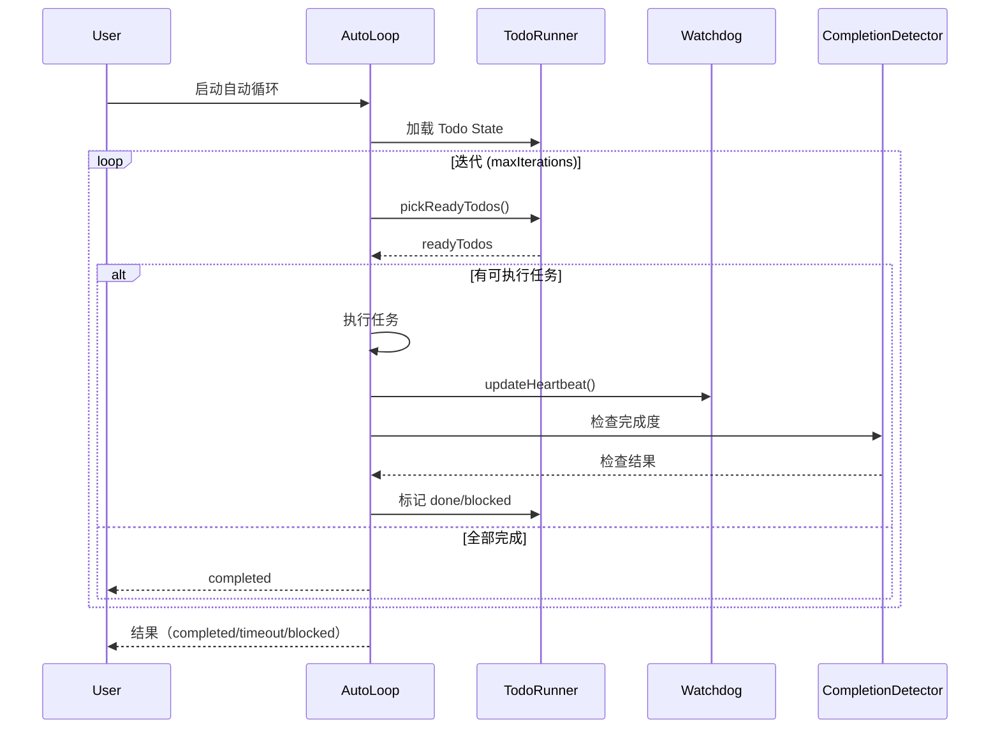

---

#### 2.3.2 Template Engine（模板引擎）

**核心模块**：`src/core/template/`

| 文件 | 职责 |
|------|------|
| `renderer.ts` | Handlebars 模板渲染（初始化、RFC、Gate 报告等） |
| `artifact-checker.ts` | 产物检查（文件存在性、格式验证） |
| `change-classifier.ts` | 变更分类（Minor/Major/Critical） |

---

#### 2.3.3 Tool Integration（工具集成）

**核心模块**：`src/core/tool-integration/`

| 文件 | 职责 |
|------|------|
| `ai-runtime-hook.ts` | AI Runtime 钩子（Pre/Post 执行） |
| `session-hook.ts` | 会话管理（开始、恢复、结束） |
| `context-sync.ts` | 上下文同步（Feature 状态同步） |
| `git-hooks.ts` | Git Hooks 管理（pre-commit、post-merge） |

---

#### 2.3.4 Migrations（数据迁移）

**核心模块**：`src/core/migrations/`

| 文件 | 职责 |
|------|------|
| `manifest-engine.ts` | 迁移清单管理（版本检测、迁移计划） |
| `version-matcher.ts` | 版本匹配（SemVer 比较） |
| `executor.ts` | 迁移执行器（原子操作、回滚） |

---

### 2.4 基础设施层

**职责**：共享类型、文件工具、配置管理、日志系统

| 文件 | 职责 |
|------|------|
| `shared/types.ts` | 全局类型定义（Stage、GateResult、RFC、Defect 等） |
| `shared/fs-utils.ts` | 文件系统工具（读写 JSON/YAML、目录管理） |
| `shared/config-schema.ts` | 配置模式（.spec-firstrc 校验） |
| `shared/logger.ts` | 日志系统（分级日志、格式化输出） |
| `shared/host-paths.ts` | 宿主路径解析（.spec-first/、specs/） |
| `shared/host-bootstrap.ts` | 宿主环境引导（Feature 发现、配置加载） |
| `shared/skill-commands.ts` | Skill 命令注册（Claude Code、Codex） |
| `shared/validators.ts` | 通用验证器（ID 格式、Stage 合法性） |

---

## 三、模块依赖关系

### 3.1 核心依赖图

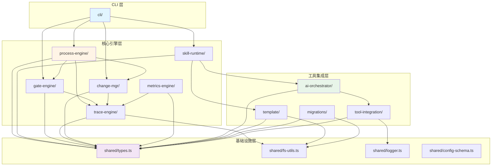

### 3.2 依赖规则

| 规则 | 描述 |
|------|------|
| **单向依赖** | CLI → Core → Shared，禁止反向依赖 |
| **核心隔离** | 核心引擎模块之间通过接口通信，避免直接耦合 |
| **共享类型** | 所有类型定义集中在 `shared/types.ts`，消除隐式字符串协议 |
| **文件工具** | 所有文件操作统一使用 `shared/fs-utils.ts`，确保一致性 |

---

## 四、数据流与交互

### 4.1 Feature 初始化流程

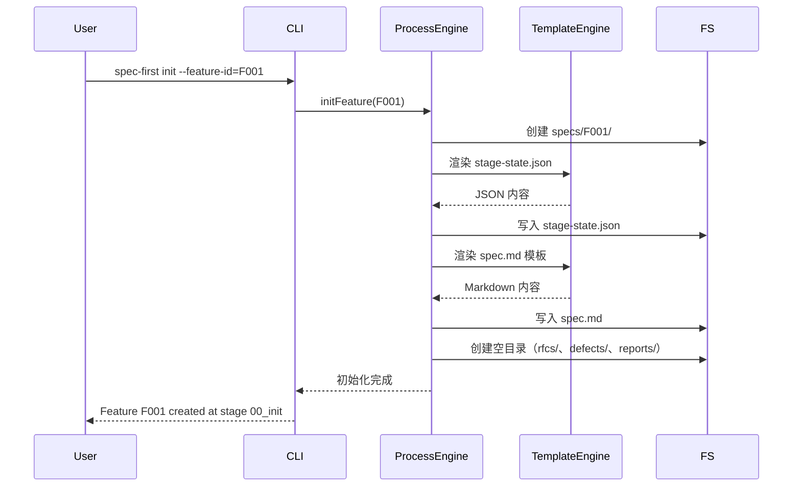

### 4.2 阶段推进流程

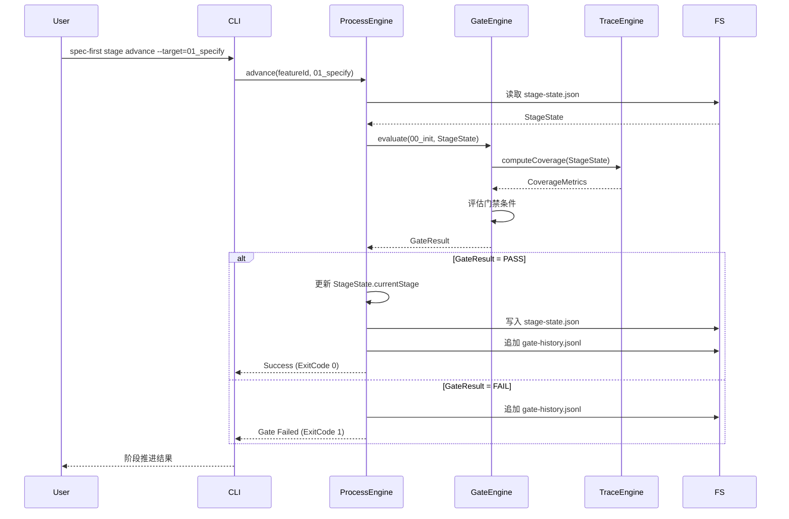

### 4.3 RFC 变更管理流程

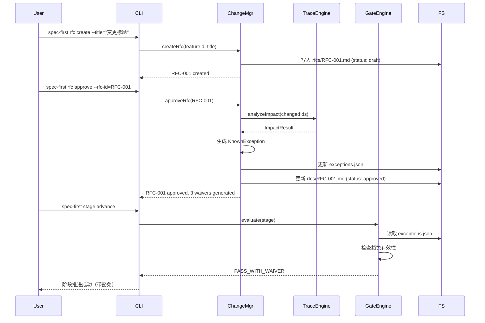

### 4.4 AI 自动循环流程

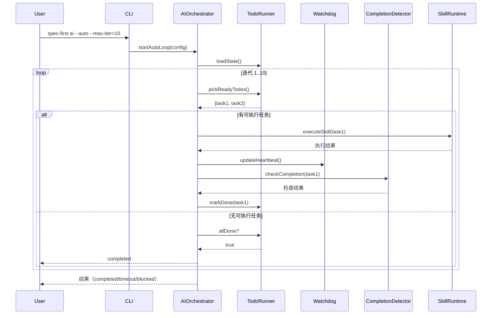

---

## 五、关键技术决策

### 5.1 状态机设计

**决策**：采用显式状态机（Stage、RFC、Defect）管理生命周期

**理由**：
- 确保状态转换的可追溯性
- 防止非法状态转换（如终态不可逆）
- 便于审计和合规检查

### 5.2 三层路由分发

**决策**：Semantic Map → Runtime Route → Skill Route

**理由**：
- **Semantic Map**：支持复合命令（如 `rfc approve` → 带 `--approve` 参数的 runtime 命令）
- **Runtime Route**：快速识别内置命令（id、matrix、stage 等）
- **Skill Route**：灵活扩展外部 Skill 定义

### 5.3 Hard Gate 机制

**决策**：Skill 执行前强制检查 Hard Gate 条件

**理由**：
- 防止在不满足前置条件时执行 Skill
- 确保产物一致性（如 `stage advance` 前必须通过 Gate）
- 提前失败，减少无效操作

### 5.4 追溯矩阵双向引用

**决策**：支持 `upstream` 和 `downstream` 双向追溯

**理由**：
- **正向追溯**：需求 → 设计 → 任务 → 测试
- **反向追溯**：测试 → 任务 → 设计 → 需求
- 影响分析时支持 BFS 遍历

### 5.5 ESM + Named Exports

**决策**：全项目采用 ESM，核心模块只使用 Named Exports

**理由**：
- **ESM**：Node.js 原生支持，更好的 Tree Shaking
- **Named Exports**：明确的导入来源，避免默认导出的隐式命名

---

## 六、扩展性设计

### 6.1 新增命令

1. 在 `src/cli/commands/` 创建新命令文件
2. 在 `src/cli/index.ts` 注册命令：`registerCommand('new-cmd', desc, handler)`
3. 实现命令处理逻辑

### 6.2 新增 Skill

1. 在 `skills/spec-first/NN-name/` 创建 `SKILL.md`
2. 定义 Skill Prompt、Next Steps、Hard Gate
3. 通过 `spec-first ai --skill=name` 调用

### 6.3 新增 Gate 条件

1. 在 `templates/gate/` 添加条件模板
2. 在 `src/core/gate-engine/gate-evaluator.ts` 实现评估逻辑
3. 更新 `mergedRules.gateConditions` 配置

### 6.4 新增追溯 ID 类型

1. 在 `src/shared/types.ts` 的 `IdType` 添加新类型
2. 在 `src/core/trace-engine/id-generator.ts` 添加生成逻辑
3. 在 `src/core/trace-engine/id-validator.ts` 添加校验逻辑

---

## 七、性能与可观测性

### 7.1 性能优化

| 优化点 | 策略 |
|--------|------|
| 文件读取 | 批量读取、缓存 StageState |
| 追溯矩阵 | 延迟解析、按需加载 |
| Gate 评估 | 并行计算覆盖率指标 |
| AI 循环 | 迭代次数限制、超时监控 |

### 7.2 可观测性

| 日志类型 | 位置 | 用途 |
|----------|------|------|
| CLI 日志 | `console.log/error` | 用户可见输出 |
| Gate 历史 | `gate-history.jsonl` | 门禁评估审计 |
| AI 审计 | `ai-audit.log` | AI 循环执行记录 |
| 性能指标 | `metrics-engine/` | 健康度评分、瓶颈分析 |

---

## 八、安全性设计

### 8.1 输入验证

| 输入源 | 验证逻辑 |
|--------|----------|
| CLI 参数 | `validators.ts`（ID 格式、Stage 合法性） |
| 配置文件 | `config-schema.ts`（JSON Schema 校验） |
| 追溯矩阵 | `id-validator.ts`（类型、序号、Feature 前缀） |

### 8.2 权限控制

| 操作 | 权限检查 |
|------|----------|
| RFC 审批 | `approvals` 字段必须包含审批人 |
| 豁免生成 | 只有 `approved` 状态的 RFC 可生成豁免 |
| Gate 豁免 | 豁免必须未过期且在 `scopeFrIds` 范围内 |

### 8.3 数据完整性

| 机制 | 描述 |
|------|------|
| 原子写入 | `idempotent-write.ts` 确保写入原子性 |
| 历史追溯 | `StageHistoryEntry` 记录每次状态转换 |
| Gate 审计 | `gate-history.jsonl` 记录每次门禁评估 |

---

## 九、部署架构

### 9.1 单机部署

```
用户机器
├── Node.js >= 20
├── npm install -g spec-first
└── 项目目录
    ├── .spec-first/
    │   └── current (symlink)
    └── specs/
        └── {featureId}/
            ├── stage-state.json
            ├── spec.md
            └── ...
```

### 9.2 CI/CD 集成

```yaml
# .github/workflows/spec-first.yml
- name: Gate Check
  run: spec-first gate --stage=current

- name: Coverage Report
  run: spec-first metrics --format=json > coverage.json

- name: Archive Artifacts
  run: spec-first archive --feature-id=current
```

---

## 十、总结

Spec-First 采用 **分层架构** 设计，核心特点：

1. **CLI 层**：统一命令入口，路由分发
2. **核心引擎层**：状态机管理，流程编排，追溯矩阵
3. **工具集成层**：AI 编排，模板渲染，外部工具集成
4. **基础设施层**：共享类型，文件工具，配置管理

**架构优势**：
- **可扩展性**：新增命令、Skill、Gate 条件简单直接
- **可维护性**：模块职责清晰，依赖关系单向
- **可追溯性**：全链路追溯矩阵，状态转换可审计
- **可观测性**：日志、审计、指标三位一体

---

**文档版本**: v1.0.0
**更新日期**: 2026-03-03
**维护者**: Spec-First Team
