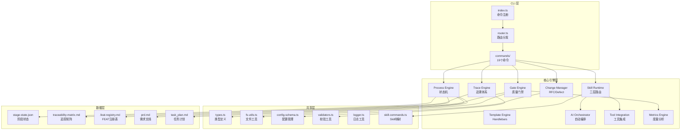
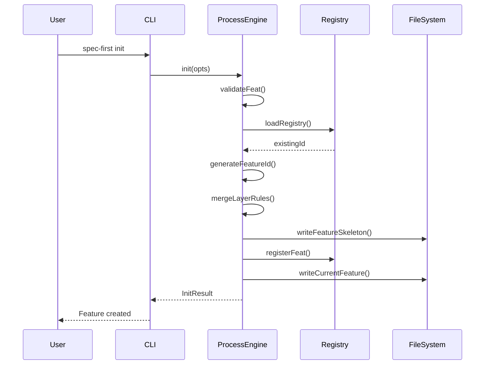
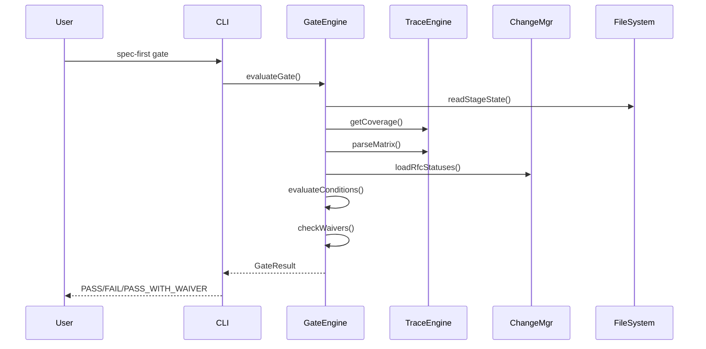
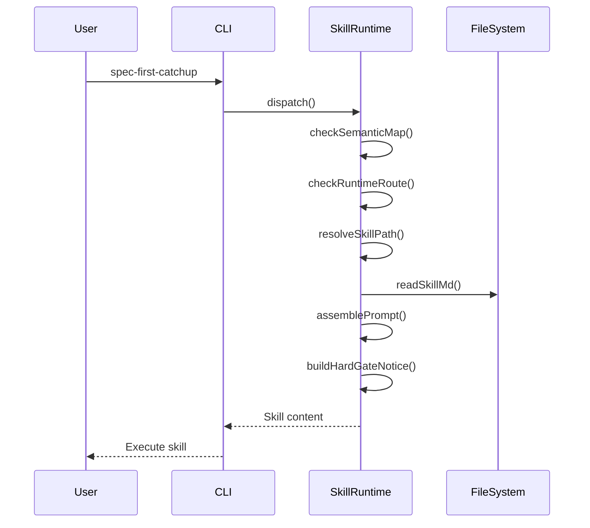

# 系统架构

## 分层架构

spec-first 采用三层架构设计：CLI 层、核心引擎层、共享层。

### CLI 层 (`src/cli/`)

**职责**：命令解析、路由分发、用户交互

**核心组件**：

- **入口** (`src/cli/index.ts:1-48` — `registerCommand()` 注册 19 个命令 — `显式`)
  - 命令注册：id, matrix, init, stage, rfc, defect, metrics, doctor, gate, golive, ai, commit, feature, setup, hooks, viewer, update, uninstall, analyze

- **路由器** (`src/cli/router.ts:18-75` — `Map<string, CommandEntry>` 存储命令处理器 — `显式`)
  - 命令分发：`dispatch()` 根据 argv[0] 查找并执行对应 handler
  - 错误处理：统一捕获异常并返回 ExitCode
  - 策略评估：集成 `evaluatePolicy()` 进行确认检查

- **命令实现** (`src/cli/commands/` — 19 个命令文件 — `显式`)

### 核心引擎层 (`src/core/`)

**职责**：业务逻辑、状态管理、质量门禁、追溯体系

#### 1. Process Engine (`src/core/process-engine/`)

**状态机设计**：

- **阶段定义** (`src/shared/types.ts:7-18` — `enum Stage` 定义 8 个活跃阶段 + 2 个终态 — `显式`)
  ```typescript
  00_init → 01_specify → 02_design → 03_plan →
  04_implement → 05_verify → 06_wrap_up → 07_release →
  08_done / 09_cancelled
  ```

- **状态持久化** (`src/core/process-engine/init.ts:59-75` — `StageState` 结构包含 featureId/mode/size/currentStage/history — `显式`)
  - 存储位置：`specs/{featureId}/stage-state.json`
  - 历史记录：每次流转记录 from/to/timestamp/gateResult

- **Feature 初始化** (`src/core/process-engine/init.ts:592-644` — `init()` 生成 Feature ID → 创建目录 → 渲染骨架 — `显式`)
  - ID 生成：`FSREQ-YYYYMMDD-FEAT-NNN` 格式
  - 骨架文件：stage-state.json, findings.md, task_plan.md, traceability-matrix.md, constitution.md, prd.md
  - 注册表：`.feat-registry.md` 维护 FEAT 缩写到 Feature ID 的映射

#### 2. Skill Runtime (`src/core/skill-runtime/`)

**三层路由机制**：

- **Semantic Map** (`src/shared/skill-commands.ts:59-82` — `SKILL_DESCRIPTION_ZH` 映射命令到描述 — `显式`)
  - 复合命令映射：如 `rfc approve` → 带参数模板的 runtime 命令

- **Runtime Route** (`推断` — RUNTIME_COMMANDS 集合直接分发为 CLI 命令)
  - 直接命令：id, matrix, stage, rfc, defect, metrics, gate, golive, ai, commit, feature

- **Skill Route** (`src/shared/skill-commands.ts:130-157` — `discoverSkills()` 扫描 skills 目录 — `显式`)
  - Skill 发现：扫描 `skills/spec-first/NN-name/SKILL.md`
  - 命令生成：`spec-first-{skillName}` 格式

**Skill 分发流程**：

- **命令注册** (`src/shared/skill-commands.ts:195-212` — `ensureClaudeCommands()` 生成命令文件 — `显式`)
  - Claude Code：`~/.claude/commands/spec-first/{skill}.md`
  - Codex：`~/.codex/skills/spec-first/{skill}/`
  - 项目级：`{projectRoot}/.claude/commands/`

#### 3. Gate Engine (`src/core/gate-engine/`)

**质量门禁评估**：

- **条件定义** (`src/core/gate-engine/gate-evaluator.ts:21-41` — `GateConditionDef` 接口定义评估函数 — `显式`)
  - 每阶段条件表：`GATE_CONDITIONS: Partial<Record<Stage, GateConditionDef[]>>`
  - 评估上下文：featureId, stage, state, coverage, rows, rfcStatuses

- **三态结果** (`src/shared/types.ts:78` — `GateStatus = 'PASS' | 'PASS_WITH_WAIVER' | 'FAIL'` — `显式`)

- **豁免机制** (`src/shared/types.ts:89-94` — `WaiverRef` 包含 exceptionId/rfcId/expiresAt/rollbackPoint — `显式`)

- **PRD 校验** (`src/core/gate-engine/gate-evaluator.ts:73-88` — `G-SPEC-00` 条件校验 PRD 存在且 C-PRD ≥ 85% — `显式`)

#### 4. Trace Engine (`src/core/trace-engine/`)

**追溯体系**：

- **ID 类型** (`src/shared/types.ts:27-31` — 13 种 ID 类型：FR/DS/TASK/TC/RFC/REQ/SYS/ARCH/MOD/ATP/STP/ITP/UTP — `显式`)

- **追踪矩阵** (`src/core/trace-engine/matrix.ts:34-40` — `parseMatrix()` 解析 Markdown 表格为 MatrixRow[] — `显式`)
  - 存储格式：`traceability-matrix.md` Markdown 表格
  - 字段：ID, Type, Title, Status, Upstream, Downstream

- **完整性校验** (`src/core/trace-engine/matrix.ts:43-80` — `checkMatrix()` 检测孤儿项和断链 — `显式`)
  - 孤儿项：非 FR/Feature/REQ 且无 upstream
  - 断链：FR 缺少 DS/TASK/TC downstream 或 PRD upstream

- **V-Model 配对** (`src/core/trace-engine/matrix.ts:19-31` — `V_MODEL_FORWARD/BACKWARD` 定义需求-测试映射 — `显式`)
  - 正向：REQ→ATP, SYS→STP, ARCH→ITP, MOD→UTP
  - 反向：ATP→REQ, STP→SYS, ITP→ARCH, UTP→MOD

- **覆盖率指标** (`src/shared/types.ts:175-186` — `CoverageMetrics` 定义 C1-C9 指标 — `显式`)
  - C1: Design Coverage
  - C2: API Coverage
  - C3: Task Coverage
  - C4: Test Coverage (FR)
  - C5: Test Coverage (AC)
  - C6: Impl Coverage
  - C7: PR Compliance
  - C8: Task Compliance
  - C9: TC Compliance

#### 5. Change Manager (`src/core/change-mgr/`)

**RFC 变更管理**：

- **状态机** (`src/shared/types.ts:106` — `RfcStatus = 'draft' | 'approved' | 'closed' | 'rejected'` — `显式`)

- **变更级别** (`src/shared/types.ts:107` — `RfcLevel = 'Minor' | 'Major' | 'Critical'` — `显式`)

- **豁免记录** (`src/shared/types.ts:109-116` — `RfcWaiver` 包含 frId/reason/expiresAt/rollbackPoint — `显式`)

**Defect 管理**：

- **状态流转** (`src/shared/types.ts:135` — `DefectStatus = 'open' | 'fixing' | 'fixed' | 'verified' | 'wontfix'` — `显式`)

- **严重级别** (`src/shared/types.ts:136` — `SecuritySeverity = 'S1' | 'S2' | 'S3' | 'S4'` — `显式`)

#### 6. Template Engine (`src/core/template/`)

**模板渲染**：

- **引擎**：Handlebars (`推断` — 从 CLAUDE.md 技术栈得知)
- **产物检查**：验证生成文件完整性

#### 7. AI Orchestrator (`src/core/ai-orchestrator/`)

**AI 编排**：

- **自动循环**：auto-loop 机制
- **上下文恢复**：catchup 功能
- **上下文打包**：context-pack

#### 8. Tool Integration (`src/core/tool-integration/`)

**工具集成**：

- **AI runtime hooks**：与 AI 运行时集成
- **Context 同步**：上下文同步机制

#### 9. Metrics Engine (`src/core/metrics-engine/`)

**度量分析**：

- **健康度评分**：Feature 健康度计算
- **瓶颈分析**：识别流程瓶颈

### 共享层 (`src/shared/`)

**职责**：类型定义、工具函数、配置管理

**核心模块**：

- **类型系统** (`src/shared/types.ts:1-216` — 全局类型定义 — `显式`)
  - Stage 枚举、ID 类型、ExitCode、StageState、GateResult、RfcRecord、DefectRecord、MatrixRow、CoverageMetrics

- **文件工具** (`推断` — fs-utils.ts 提供文件系统操作)
  - readMarkdown, writeMarkdown, readJson, writeJson, ensureDir, exists, parseMarkdownTable

- **配置管理** (`推断` — config-schema.ts 管理配置)
  - renderDefaultConfigYaml, resetConfigCache

- **校验工具** (`推断` — validators.ts 提供校验函数)
  - isStageState, validateId

- **日志工具** (`推断` — logger.ts 提供日志功能)

- **Skill 命令映射** (`src/shared/skill-commands.ts:1-363` — Skill 注册与发现 — `显式`)

## 架构图



## 关键设计模式

### 1. 状态机模式 (State Machine)

**应用场景**：Feature 生命周期管理

**实现**：
- **状态定义** (`src/shared/types.ts:7-18` — `enum Stage` 定义 10 个阶段 — `显式`)
- **状态转换** (`src/shared/types.ts:51-57` — `StageHistoryEntry` 记录转换历史 — `显式`)
- **终态判定** (`src/shared/types.ts:21-24` — `TERMINAL_STAGES` 集合包含 DONE/CANCELLED — `显式`)

**优势**：
- 明确的阶段流转规则
- 完整的历史追溯
- 支持终态判定

### 2. 策略模式 (Strategy)

**应用场景**：Gate 条件评估

**实现**：
- **策略接口** (`src/core/gate-engine/gate-evaluator.ts:23-28` — `GateConditionDef.evaluate` 函数签名 — `显式`)
- **策略注册** (`src/core/gate-engine/gate-evaluator.ts:41` — `GATE_CONDITIONS` 映射表 — `显式`)
- **上下文传递** (`src/core/gate-engine/gate-evaluator.ts:30-38` — `EvalContext` 包含评估所需数据 — `显式`)

**优势**：
- 条件可扩展
- 评估逻辑解耦
- 支持动态配置

### 3. 模板方法模式 (Template Method)

**应用场景**：Feature 初始化流程

**实现**：
- **主流程** (`src/core/process-engine/init.ts:592-644` — `init()` 定义初始化步骤 — `显式`)
- **子步骤** (`src/core/process-engine/init.ts:444-560` — 各辅助函数实现具体逻辑 — `显式`)

**流程**：
1. 校验 FEAT 缩写
2. 解析目标路径
3. 合并规则配置
4. 生成骨架文件
5. 提交并注册

### 4. 注册表模式 (Registry)

**应用场景**：命令路由、Skill 发现

**实现**：
- **命令注册表** (`src/cli/router.ts:18` — `Map<string, CommandEntry>` — `显式`)
- **FEAT 注册表** (`src/core/process-engine/init.ts:91-184` — `.feat-registry.md` 文件 + 锁机制 — `显式`)
- **Skill 注册表** (`src/shared/skill-commands.ts:59-82` — `SKILL_DESCRIPTION_ZH` 映射 — `显式`)

**优势**：
- 动态注册
- 集中管理
- 支持查询

### 5. 观察者模式 (Observer)

**应用场景**：阶段流转事件

**实现**：
- **事件记录** (`src/shared/types.ts:51-57` — `StageHistoryEntry` 记录每次流转 — `显式`)
- **历史追溯** (`src/shared/types.ts:70` — `history: StageHistoryEntry[]` 数组 — `显式`)

### 6. 工厂模式 (Factory)

**应用场景**：Feature ID 生成

**实现**：
- **ID 生成器** (`src/core/process-engine/init.ts:76-87` — `generateFeatureId()` 生成 FSREQ-YYYYMMDD-FEAT-NNN — `显式`)
- **序号查找** (`src/core/process-engine/init.ts:54-74` — `findNextFeatureSeq()` 扫描已有 Feature — `显式`)

### 7. 适配器模式 (Adapter)

**应用场景**：多宿主 Skill 注册

**实现**：
- **Claude Code 适配** (`src/shared/skill-commands.ts:195-212` — `ensureClaudeCommands()` 生成 .md 文件 — `显式`)
- **Codex 适配** (`src/shared/skill-commands.ts:219-259` — `ensureCodexSkills()` 复制目录结构 — `显式`)
- **Generic 适配** (`src/shared/skill-commands.ts:261-281` — `ensureGenericSkills()` 通用格式 — `显式`)

### 8. 责任链模式 (Chain of Responsibility)

**应用场景**：Skill 三层路由

**实现**：
- **Semantic Map** → **Runtime Route** → **Skill Route** (`推断` — 从 CLAUDE.md 描述得知)

**流程**：
1. 检查语义映射
2. 检查运行时命令
3. 解析 Skill 路径

### 9. 单例模式 (Singleton)

**应用场景**：配置缓存

**实现**：
- **缓存重置** (`src/core/process-engine/init.ts:433` — `resetConfigCache()` 调用 — `显式`)

### 10. 锁机制 (Locking)

**应用场景**：FEAT 注册表并发控制

**实现**：
- **文件锁** (`src/core/process-engine/init.ts:92-95` — `.feat-registry.lock` 文件 — `显式`)
- **锁获取** (`src/core/process-engine/init.ts:122-139` — `withRegistryLock()` 重试机制 — `显式`)
- **陈旧锁恢复** (`src/core/process-engine/init.ts:198-213` — `tryRecoverStaleRegistryLock()` 检测进程存活 — `显式`)

**特性**：
- 超时机制：3000ms
- 重试间隔：50ms
- 陈旧判定：30000ms
- 进程检测：`process.kill(pid, 0)`

## 数据流

### Feature 初始化流程



### Gate 评估流程



### Skill 分发流程



## 技术约束

### 模块系统

- **ESM Only** (`CLAUDE.md` — 全项目 `"type": "module"` — `显式`)
- **Named Exports** (`CLAUDE.md` — 核心模块不使用 default export — `显式`)

### 类型系统

- **TypeScript ≥5.4** (`CLAUDE.md` — strict mode, verbatimModuleSyntax — `显式`)
- **类型集中** (`CLAUDE.md` — 共享类型定义在 `src/shared/types.ts` — `显式`)

### 文件命名

- **kebab-case.ts** (`CLAUDE.md` — 文件命名约定 — `显式`)
- **未使用变量前缀 `_`** (`CLAUDE.md` — eslint 规则 — `显式`)

### 构建工具

- **Bundler**: tsup (`CLAUDE.md` — 技术栈 — `显式`)
- **Test**: Vitest (`CLAUDE.md` — globals enabled, v8 coverage, 75% threshold — `显式`)

## 扩展点

### 添加新命令

1. 在 `src/cli/commands/` 创建命令文件
2. 实现 `CommandHandler` 函数
3. 在 `src/cli/index.ts` 调用 `registerCommand()`

### 添加新 Gate 条件

1. 在 `src/core/gate-engine/gate-evaluator.ts` 定义 `GateConditionDef`
2. 添加到对应阶段的 `GATE_CONDITIONS` 数组
3. 实现 `evaluate()` 函数

### 添加新 Skill

1. 在 `skills/spec-first/` 创建 `NN-name/` 目录
2. 编写 `SKILL.md` 定义（包含 YAML frontmatter）
3. 在 `src/shared/skill-commands.ts` 的 `SKILL_DESCRIPTION_ZH` 添加描述
4. 运行 `spec-first setup --global` 注册

### 添加新 ID 类型

1. 在 `src/shared/types.ts` 的 `NextIdType` 添加类型
2. 在 `src/core/trace-engine/id-validator.ts` 添加校验规则
3. 更新 `src/core/trace-engine/matrix.ts` 的 V-Model 映射（如需要）

### 添加新覆盖率指标

1. 在 `src/shared/types.ts` 的 `CoverageMetrics` 添加字段
2. 在 `src/core/trace-engine/coverage.ts` 实现计算逻辑
3. 在 Gate 条件中引用新指标

## 性能考虑

### 文件锁机制

- **超时控制** (`src/core/process-engine/init.ts:93-95` — 3000ms 超时 + 50ms 重试 — `显式`)
- **陈旧锁恢复** (`src/core/process-engine/init.ts:96` — 30000ms 判定陈旧 — `显式`)
- **进程检测** (`src/core/process-engine/init.ts:237-245` — `process.kill(pid, 0)` 检测存活 — `显式`)

### 配置缓存

- **缓存重置** (`src/core/process-engine/init.ts:433` — `resetConfigCache()` 仅在写入后调用 — `显式`)

### 幂等设计

- **Feature 初始化** (`src/core/process-engine/init.ts:592` — 已存在的 Feature 不覆盖 — `显式`)
- **Skill 注册** (`src/shared/skill-commands.ts:195` — 幂等覆盖，始终写入最新内容 — `显式`)

## 安全考虑

### 输入校验

- **FEAT 缩写** (`src/core/process-engine/init.ts:43-49` — 正则 `^[A-Z][A-Z0-9]{0,15}$` — `显式`)
- **ID 校验** (`推断` — id-validator.ts 提供校验函数)

### 并发控制

- **注册表锁** (`src/core/process-engine/init.ts:122-139` — 文件锁 + 重试机制 — `显式`)
- **原子操作** (`src/core/process-engine/init.ts:546-560` — rename + 回滚机制 — `显式`)

### 错误恢复

- **临时目录** (`src/core/process-engine/init.ts:448` — `.{featureId}.tmp-{pid}-{timestamp}` — `显式`)
- **快照恢复** (`src/core/process-engine/init.ts:401-415` — 保存并恢复 current 文件 — `显式`)
- **清理机制** (`src/core/process-engine/init.ts:563-584` — 失败时清理临时文件 — `显式`)
