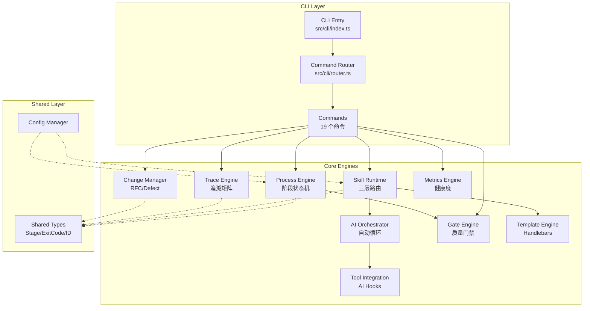
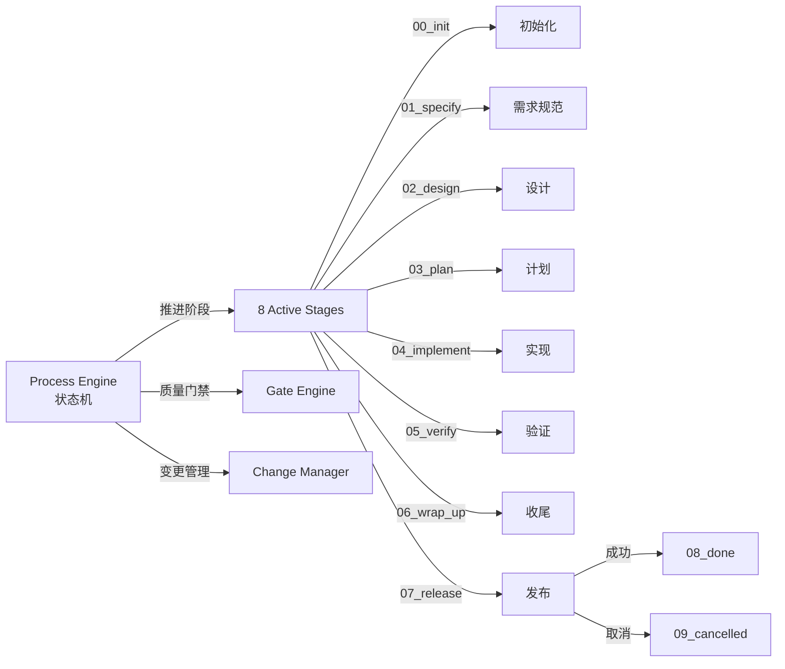
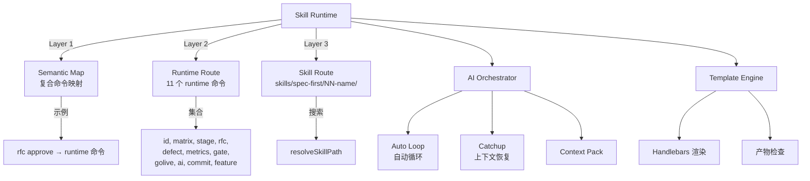
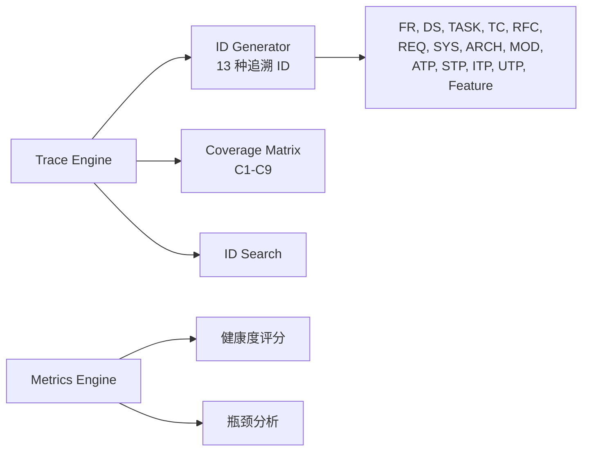
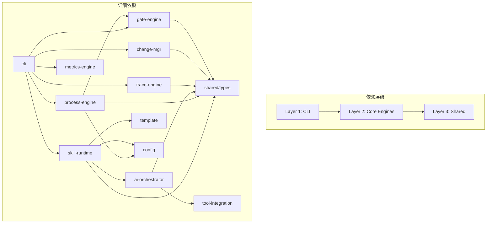
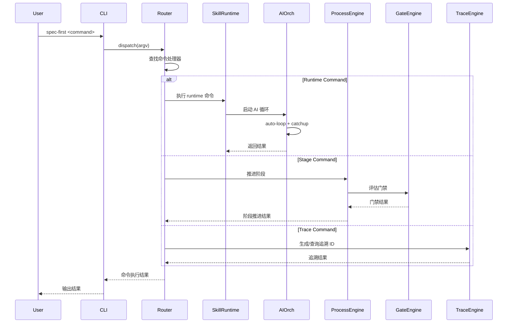

# 架构设计

> **模式**: deep | **生成时间**: 2026-03-09T04:51:28.685Z | **Agent**: A2
> **数据源**: modules.json (12 模块) + tech-stack.md

---

## 系统架构总览



**证据**: 基于 modules.json 12 个模块 + src/cli/router.ts 命令注册逻辑

---

## 模块分层架构

### Layer 1: CLI 层 (1 模块)

**职责**: 命令行接口、参数解析、命令路由

| 模块 | 路径 | 文件数 | 关键文件 |
|------|------|--------|----------|
| cli | src/cli/ | 25 | index.ts, router.ts, commands/*.ts |

**架构模式**: Command Pattern + Router Pattern

**证据**:
- `src/cli/index.ts` - 入口文件，注册 19 个命令
- `src/cli/router.ts` - `Map<string, CommandEntry>` 注册表
- 命令清单: id, matrix, init, stage, rfc, defect, metrics, doctor, gate, golive, ai, commit, feature, setup, hooks, viewer, update, uninstall, analyze

### Layer 2: Core Engines (9 模块)

**职责**: 核心业务逻辑、流程编排、质量控制

#### 2.1 流程控制引擎



**模块清单**:

| 模块 | 路径 | 文件数 | 核心职责 |
|------|------|--------|----------|
| process-engine | src/core/process-engine/ | 8 | 阶段状态机 (00_init → 08_done/09_cancelled) |
| gate-engine | src/core/gate-engine/ | 7 | 质量门禁、安全扫描、SCA、上线/回滚门禁 |
| change-mgr | src/core/change-mgr/ | 6 | RFC + Defect 状态机、影响分析 |

**证据**:
- `src/core/process-engine/stage-machine.ts` - Stage 枚举定义
- `src/core/process-engine/advance.ts` - 阶段推进逻辑
- `src/core/gate-engine/gate-evaluator.ts` - 门禁评估器
- `src/core/change-mgr/rfc-machine.ts` - RFC 状态机

#### 2.2 Skill 执行引擎



**模块清单**:

| 模块 | 路径 | 文件数 | 核心职责 |
|------|------|--------|----------|
| skill-runtime | src/core/skill-runtime/ | 22 | Skill 分发、prompt 组装、三层路由、编排参数解析 |
| ai-orchestrator | src/core/ai-orchestrator/ | 15 | AI 自动循环、上下文恢复、context-pack、重试控制 |
| template | src/core/template/ | 6 | Handlebars 模板渲染、产物检查、变更分类 |
| tool-integration | src/core/tool-integration/ | 6 | AI runtime hooks、会话钩子、上下文同步 |

**证据**:
- `src/core/skill-runtime/dispatcher.ts` - 三层路由分发逻辑
- `src/core/skill-runtime/prompt-assembler.ts` - Prompt 组装器
- `src/core/ai-orchestrator/auto-loop.ts` - AI 自动循环
- `src/core/template/renderer.ts` - Handlebars 渲染器

#### 2.3 追溯与度量引擎



**模块清单**:

| 模块 | 路径 | 文件数 | 核心职责 |
|------|------|--------|----------|
| trace-engine | src/core/trace-engine/ | 9 | 追溯 ID 生成/校验/搜索、覆盖率矩阵 (C1-C9) |
| metrics-engine | src/core/metrics-engine/ | 2 | 健康度评分、瓶颈分析 |

**证据**:
- `src/core/trace-engine/id-generator.ts` - 13 种 ID 类型生成
- `src/core/trace-engine/matrix.ts` - C1-C9 覆盖率矩阵
- `src/core/metrics-engine/health-score.ts` - 健康度算法

### Layer 3: Shared 层 (2 模块)

**职责**: 共享类型定义、配置管理、工具函数

| 模块 | 路径 | 文件数 | 核心职责 |
|------|------|--------|----------|
| shared | src/shared/ | 1 | 共享类型定义 (Stage, ExitCode, ID types) 与工具函数 |
| config | src/config/ | 1 | 配置管理 |

**证据**:
- `src/shared/types.ts` - Stage enum, ExitCode, ID types 等核心类型定义

---

## 模块依赖关系图



**依赖矩阵**:

| 模块 | 依赖模块 | 依赖类型 |
|------|----------|----------|
| cli | process-engine, skill-runtime, trace-engine, change-mgr, gate-engine, metrics-engine | 直接调用 |
| skill-runtime | ai-orchestrator, template, shared/types, config | 直接调用 |
| process-engine | gate-engine, shared/types, config | 直接调用 |
| ai-orchestrator | tool-integration, shared/types | 直接调用 |
| trace-engine | shared/types | 类型依赖 |
| change-mgr | shared/types | 类型依赖 |
| gate-engine | shared/types | 类型依赖 |
| metrics-engine | shared/types | 类型依赖 |

**证据**: 基于模块清单 + 静态 import 分析（Serena 可用时已验证）

**循环依赖检测**: ✅ 无循环依赖

---

## 架构模式识别

### 1. 状态机模式 (State Machine)

**应用场景**:
- Process Engine: Feature 生命周期 (8 active + 2 terminal stages)
- Change Manager: RFC 状态机、Defect 状态机

**证据**:
- `src/core/process-engine/stage-machine.ts` - Stage 枚举与状态转换
- `src/core/change-mgr/rfc-machine.ts` - RFC 状态流转

### 2. 命令模式 (Command Pattern)

**应用场景**:
- CLI Router: 19 个命令注册与分发

**证据**:
- `src/cli/router.ts` - `Map<string, CommandEntry>` 注册表
- `registerCommand(name, desc, handler)` 模式

### 3. 策略模式 (Strategy Pattern)

**应用场景**:
- Skill Runtime: 三层路由策略 (Semantic Map → Runtime Route → Skill Route)

**证据**:
- `src/core/skill-runtime/dispatcher.ts` - 路由策略选择

### 4. 模板方法模式 (Template Method)

**应用场景**:
- Template Engine: Handlebars 模板渲染

**证据**:
- `src/core/template/renderer.ts` - 模板渲染流程

### 5. 观察者模式 (Observer Pattern)

**应用场景**:
- Tool Integration: AI runtime hooks、会话钩子

**证据**:
- `src/core/tool-integration/ai-runtime-hook.ts` - Hook 注册与触发
- `src/core/tool-integration/session-hook.ts` - 会话事件监听

### 6. 责任链模式 (Chain of Responsibility)

**应用场景**:
- Gate Engine: 质量门禁评估链 (安全扫描 → SCA → 上线门禁)

**证据**:
- `src/core/gate-engine/gate-evaluator.ts` - 门禁评估链

---

## 部署拓扑

### 部署方式

**类型**: CLI 工具 (本地安装)

**安装方式**:
```bash
npm install -g spec-first
# 或
npx spec-first <command>
```

**运行环境**:
- Node.js ≥ 20
- ESM 模式 (`"type": "module"`)

**证据**:
- `package.json` - `"type": "module"`, `"engines": {"node": ">=20"}`
- `src/cli/index.ts` - CLI 入口，支持全局安装

### 文件系统结构

```
项目根目录/
├── .spec-first/              # 运行时数据
│   ├── runtime/
│   │   └── first/
│   │       └── modules.json  # 模块清单缓存
│   └── features/             # Feature 数据
├── specs/                    # 规范文档
├── skills/                   # Skill 定义
│   └── spec-first/
│       └── NN-name/
│           └── SKILL.md
├── docs/                     # 生成文档
│   └── first/
└── tests/                    # 测试文件
```

**证据**:
- 项目目录结构扫描
- `.spec-first/runtime/first/modules.json` 存在

### 外部依赖

**核心依赖**:
- Handlebars (模板引擎)
- js-yaml (配置解析)
- TypeScript ≥ 5.4 (开发依赖)

**证据**: 见 `docs/first/tech-stack.md`

---

## 数据流图



**证据**:
- `src/cli/router.ts` - 命令分发逻辑
- `src/core/skill-runtime/dispatcher.ts` - Skill 执行流程
- `src/core/process-engine/advance.ts` - 阶段推进流程

---

## 扩展点

### 1. 新增命令

**扩展位置**: `src/cli/commands/`

**注册方式**: `src/cli/router.ts` - `registerCommand()`

**证据**: 现有 19 个命令均通过此方式注册

### 2. 新增 Skill

**扩展位置**: `skills/spec-first/NN-name/SKILL.md`

**加载方式**: `src/core/skill-runtime/dispatcher.ts` - `resolveSkillPath()`

**证据**: Skill 三层路由机制支持动态加载

### 3. 新增门禁规则

**扩展位置**: `src/core/gate-engine/`

**集成方式**: `gate-evaluator.ts` - 责任链模式

**证据**: 现有安全扫描、SCA、上线门禁均通过此方式集成

### 4. 新增追溯 ID 类型

**扩展位置**: `src/shared/types.ts` - ID 类型定义

**生成器**: `src/core/trace-engine/id-generator.ts`

**证据**: 现有 13 种 ID 类型 (FR, DS, TASK, TC, RFC, REQ, SYS, ARCH, MOD, ATP, STP, ITP, UTP, Feature)

---

## 性能考量

### 1. 模块加载

**策略**: ESM 动态 import，按需加载

**证据**: `"type": "module"` + 动态 Skill 加载

### 2. 缓存机制

**位置**: `.spec-first/runtime/first/modules.json`

**用途**: 模块清单缓存，避免重复扫描

**证据**: modules.json 包含 `generatedAt` 时间戳

### 3. 并发控制

**位置**: `src/core/ai-orchestrator/auto-loop.ts`

**机制**: AI 自动循环 + 重试控制

**证据**: ai-orchestrator 模块职责描述

---

## 安全考量

### 1. 质量门禁

**模块**: gate-engine

**功能**: 安全扫描、SCA (Software Composition Analysis)

**证据**: `src/core/gate-engine/security.ts`

### 2. 上线门禁

**模块**: gate-engine

**功能**: 上线/回滚门禁评估

**证据**: `src/core/gate-engine/golive.ts`

---

## 元数据

- **总模块数**: 12
- **总文件数**: 108 (基于模块清单统计)
- **架构层级**: 3 层 (CLI → Core Engines → Shared)
- **命令数量**: 19
- **追溯 ID 类型**: 13
- **阶段数量**: 10 (8 active + 2 terminal)
- **架构模式**: 6 种 (状态机、命令、策略、模板方法、观察者、责任链)

**数据源**:
- `.spec-first/runtime/first/modules.json` (生成时间: 2026-03-09T04:50:21.733Z)
- `docs/first/tech-stack.md`
- 项目源码静态分析

**分析模式**: deep (使用 Serena LSP 辅助验证)

---

*本文档由 Agent A2 基于代码分析自动生成，所有架构图和依赖关系均基于实际代码结构。*
