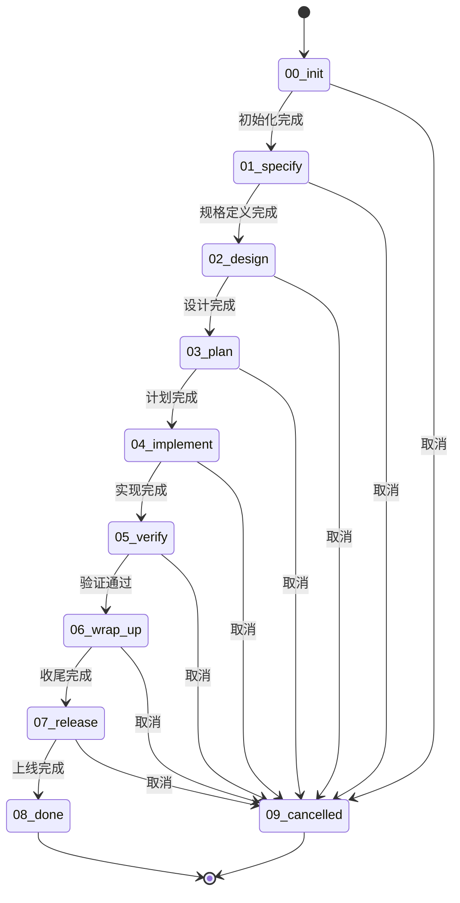
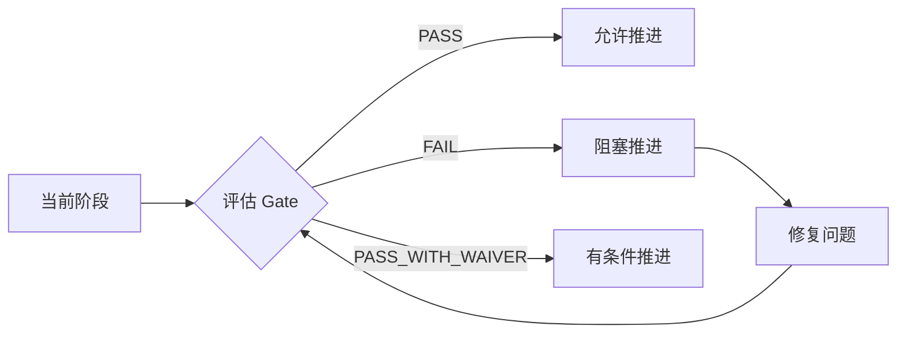
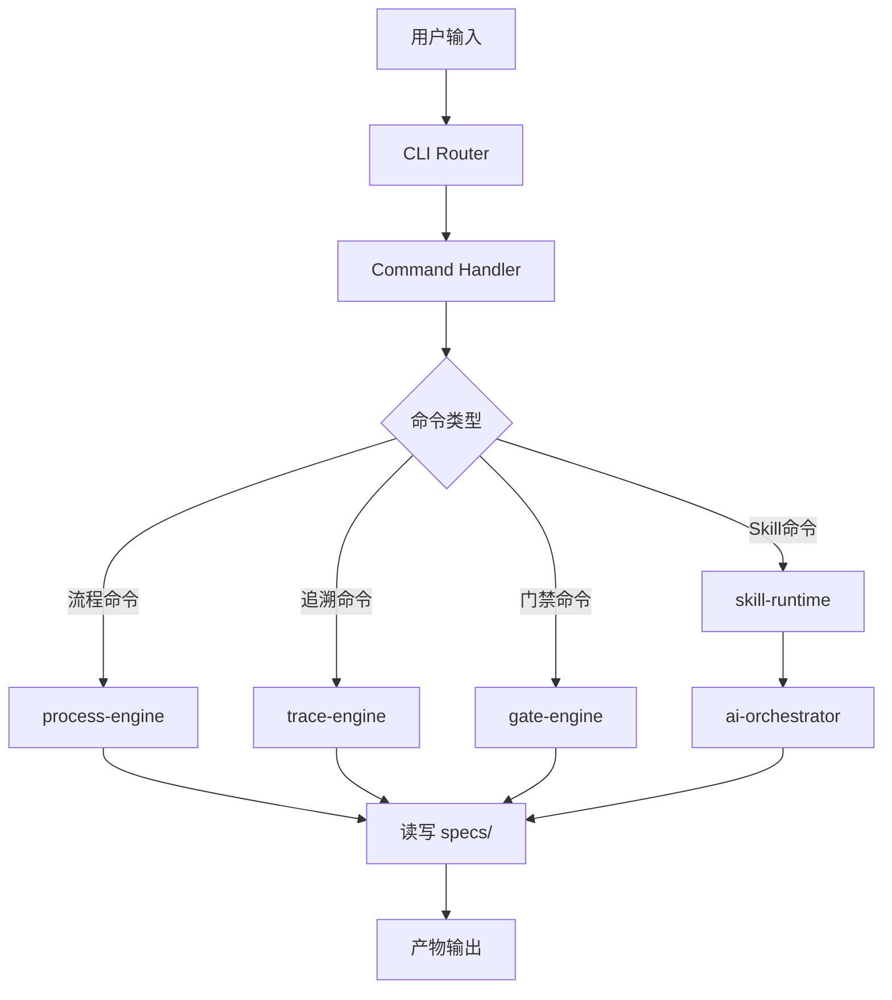

# 系统架构

> 本文档由 `spec-first:first` skill 自动生成，描述 spec-first CLI 的系统架构。

## 架构概览

spec-first 是一个**规范驱动的研发流程引擎**，采用**分层架构**设计，实现从业务需求到生产上线的全流程自动化管理。

```
┌─────────────────────────────────────────────────────────────────┐
│                         CLI 入口层                               │
│                        (src/cli/)                               │
│  ┌──────────┐  ┌──────────┐  ┌──────────┐  ┌──────────┐        │
│  │ router   │→│ commands │→│  parsers │→│ handlers │        │
│  └──────────┘  └──────────┘  └──────────┘  └──────────┘        │
└─────────────────────────────────────────────────────────────────┘
                              ↓
┌─────────────────────────────────────────────────────────────────┐
│                         核心引擎层                               │
│                        (src/core/)                              │
│  ┌──────────────┐  ┌──────────────┐  ┌──────────────┐          │
│  │process-engine│  │trace-engine  │  │gate-engine   │          │
│  │  状态机流转   │  │  追溯管理    │  │  质量门禁    │          │
│  └──────────────┘  └──────────────┘  └──────────────┘          │
│  ┌──────────────┐  ┌──────────────┐  ┌──────────────┐          │
│  │skill-runtime │  │ai-orchestrator│ │change-mgr    │          │
│  │  Skill分发   │  │  AI编排      │  │  变更管理    │          │
│  └──────────────┘  └──────────────┘  └──────────────┘          │
│  ┌──────────────┐  ┌──────────────┐                         │
│  │template      │  │metrics-engine│                         │
│  │  模板渲染     │  │  度量分析    │                         │
│  └──────────────┘  └──────────────┘                         │
└─────────────────────────────────────────────────────────────────┘
                              ↓
┌─────────────────────────────────────────────────────────────────┐
│                        共享基础层                                 │
│                       (src/shared/)                             │
│  ┌──────────┐  ┌──────────┐  ┌──────────┐  ┌──────────┐        │
│  │ types.ts │  │fs-utils  │  │validators│  │logger    │        │
│  │ 类型定义  │  │ 文件操作 │  │ 数据校验 │  │ 日志输出 │        │
│  └──────────┘  └──────────┘  └──────────┘  └──────────┘        │
└─────────────────────────────────────────────────────────────────┘
                              ↓
┌─────────────────────────────────────────────────────────────────┐
│                        存储层                                    │
│  ┌──────────┐  ┌──────────┐  ┌──────────┐  ┌──────────┐        │
│  │ specs/   │  │ .spec-   │  │ templates│  │ reports/ │        │
│  │ Feature  │  │ first/   │  │          │  │          │        │
│  │ 工作区   │  │ 运行时   │  │ 模板库   │  │ 报告输出 │        │
│  └──────────┘  └──────────┘  └──────────┘  └──────────┘        │
└─────────────────────────────────────────────────────────────────┘
```

## 核心概念

### 1. 八阶段状态机

spec-first 核心流程是 8 个阶段的有序状态机：



### 2. 追溯 ID 系统

所有产物都通过追溯 ID 关联，形成完整的追溯链：

| ID 类型 | 说明 | 示例 |
|---------|------|------|
| FR | Functional Requirement 需求 | FR-AUTH-001 |
| NFR | Non-Functional Requirement 非功能需求 | NFR-PERF-001 |
| DS | Design Spec 设计规格 | DS-AUTH-001 |
| TASK | 任务 | TASK-AUTH-001 |
| TC | Test Case 测试用例 | TC-AUTH-001 |
| RFC | Request for Change 变更请求 | RFC-AUTH-001 |
| DEFECT | 缺陷 | DEFECT-AUTH-001 |

### 3. 质量门禁

每个阶段都有严格的质量门禁条件，必须满足才能推进到下一阶段：



## 模块详解

### process-engine (流程引擎)

**职责**: 驱动 Feature 生命周期流转

**核心功能**:
- 阶段状态机 (`stage-machine.ts`)
- Feature 初始化 (`init.ts`)
- 阶段推进 (`advance.ts`)
- 配置层合并 (`layer-merger.ts`)

### trace-engine (追溯引擎)

**职责**: 追溯 ID 生成、校验、搜索与覆盖率分析

**核心功能**:
- ID 生成与校验 (`id-generator.ts`, `id-validator.ts`)
- 追溯矩阵解析 (`matrix.ts`)
- 覆盖率计算 (`coverage.ts`)
- ID 搜索 (`id-search.ts`)

### gate-engine (门禁引擎)

**职责**: 阶段质量门禁评估与安全扫描

**核心功能**:
- Gate 条件评估 (`gate-evaluator.ts`)
- 安全扫描 (`security.ts`)
- SCA 分析 (`sca.ts`)
- 上线检查 (`golive.ts`)

### skill-runtime (Skill 运行时)

**职责**: Skill 分发与执行

**核心功能**:
- Skill 路由分发 (`dispatcher.ts`)
- Prompt 组装 (`prompt-assembler.ts`)
- 硬检查门禁 (`hard-gate.ts`)

### ai-orchestrator (AI 编排器)

**职责**: AI 自动循环与上下文管理

**核心功能**:
- AI 自动循环 (`auto-loop.ts`)
- 上下文恢复 (`catchup.ts`)
- 上下文包组装 (`context-pack.ts`)

## 数据流



## 关键设计原则

1. **规范即契约**: 所有开发活动以规范为准
2. **全链路追溯**: 每个产物都可追溯到需求
3. **自动化校验**: 规范可被工具自动解析和校验
4. **分层解耦**: 模块间通过明确的接口通信
5. **可扩展性**: 支持自定义 Skill 和 Layer2 规则

---

*生成时间: 2026-02-28 | 命令: `/spec-first:first`*
