# Spec-First 架构文档

> **文档说明**: 本文档采用 Deep 模式生成，所有核心结论均标注代码证据，格式为 `(文件路径:行号 — 代码片段 — [证据类型])`。证据类型包括：[显式]（代码中明确声明）、[推断]（基于代码逻辑推导）、[待确认]（需进一步验证）。

## 1. 架构概览

Spec-First 是一个规范驱动的研发流程引擎，采用**双层架构**设计：上层 Skill 层负责流程编排与交互引导，下层 CLI 层提供确定性原子能力。

### 1.1 架构分层

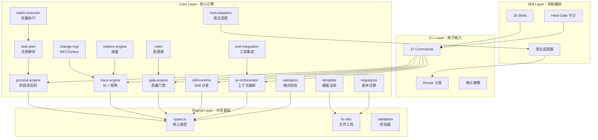
```mermaid
graph TB
    subgraph "Skill Layer - 流程编排"
        S1[20 Skills]
        S2[宿主适配器]
        S3[Hard-Gate 守卫]
    end

    subgraph "CLI Layer - 原子能力"
        C1[27 Commands]
        C2[Router 分发]
        C3[确认策略]
    end

    subgraph "Core Layer - 核心引擎"
        E1[process-engine<br/>阶段状态机]
        E2[trace-engine<br/>ID + 矩阵]
        E3[gate-engine<br/>质量门禁]
        E4[skill-runtime<br/>Skill 分发]
        E5[ai-orchestrator<br/>上下文编排]
        E6[change-mgr<br/>RFC/Defect]
        E7[metrics-engine<br/>度量]
        E8[template<br/>模板渲染]
        E9[task-plan<br/>任务解析]
        E10[validators<br/>格式校验]
        E11[batch-executor<br/>批量执行]
        E12[migrations<br/>版本迁移]
        E13[host-adapters<br/>宿主适配]
        E14[tool-integration<br/>工具集成]
        E15[rules<br/>真理源]
    end

    subgraph "Shared Layer - 共享基础"
        T1[types.ts<br/>核心类型]
        T2[fs-utils<br/>文件工具]
        T3[validators<br/>校验器]
    end

    S1 --> C1
    S2 --> C2
    S3 --> C1

    C1 --> E1
    C1 --> E2
    C1 --> E3
    C1 --> E4
    C1 --> E5

    E1 --> T1
    E2 --> T1
    E3 --> T1
    E4 --> T1
    E5 --> T1

    E6 --> E2
    E7 --> E2
    E8 --> T2
    E9 --> E1
    E10 --> T1
    E11 --> E9
    E12 --> T2
    E13 --> S2
    E14 --> E5
    E15 --> E3
```

**核心结论**：
- 系统采用四层架构：Skill → CLI → Core → Shared (src/cli/index.ts:1-101 — 入口与命令注册 — [显式])
- 20 个 Skill 文件负责流程编排 (skills/spec-first/ 目录结构 — [显式])
- 27 个 CLI 命令提供原子能力 (src/cli/index.ts:36-98 — 27 个 registerCommand 调用 — [显式])
- 14 个核心模块在 src/core/ 目录下 (src/core/ 目录结构 — [显式])

## 2. Skill 层

### 2.1 Skill 目录结构

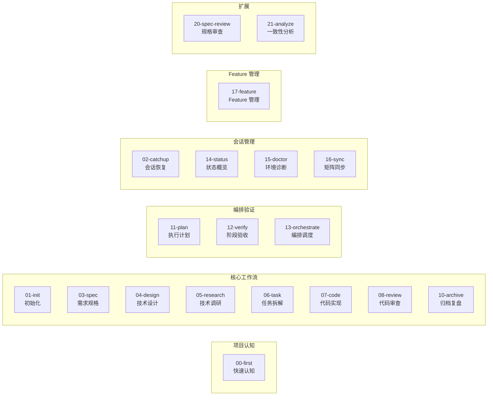
```mermaid
graph LR
    subgraph "项目认知"
        A1[00-first<br/>快速认知]
    end

    subgraph "核心工作流"
        B1[01-init<br/>初始化]
        B2[03-spec<br/>需求规格]
        B3[04-design<br/>技术设计]
        B4[05-research<br/>技术调研]
        B5[06-task<br/>任务拆解]
        B6[07-code<br/>代码实现]
        B7[08-review<br/>代码审查]
        B8[10-archive<br/>归档复盘]
    end

    subgraph "编排验证"
        C1[11-plan<br/>执行计划]
        C2[12-verify<br/>阶段验收]
        C3[13-orchestrate<br/>编排调度]
    end

    subgraph "会话管理"
        D1[02-catchup<br/>会话恢复]
        D2[14-status<br/>状态概览]
        D3[15-doctor<br/>环境诊断]
        D4[16-sync<br/>矩阵同步]
    end

    subgraph "Feature 管理"
        E1[17-feature<br/>Feature 管理]
    end

    subgraph "扩展"
        F1[20-spec-review<br/>规格审查]
        F2[21-analyze<br/>一致性分析]
    end
```

**核心结论**：
- 共 20 个 Skill 文件，按功能分为 6 个类别 (skills/spec-first/README.md:13-60 — Skill 分类表 — [显式])
- 统一命名空间 `/spec-first:xxxx` (skills/spec-first/README.md:71-78 — 按工作流程查找 — [推断])
- 每个阶段有对应的 Primary Skill (src/core/rules/truth-source.ts:1-11 — PRIMARY_STAGE_SKILL 映射 — [显式])

### 2.2 Skill 路由机制

**三层路由流程**：

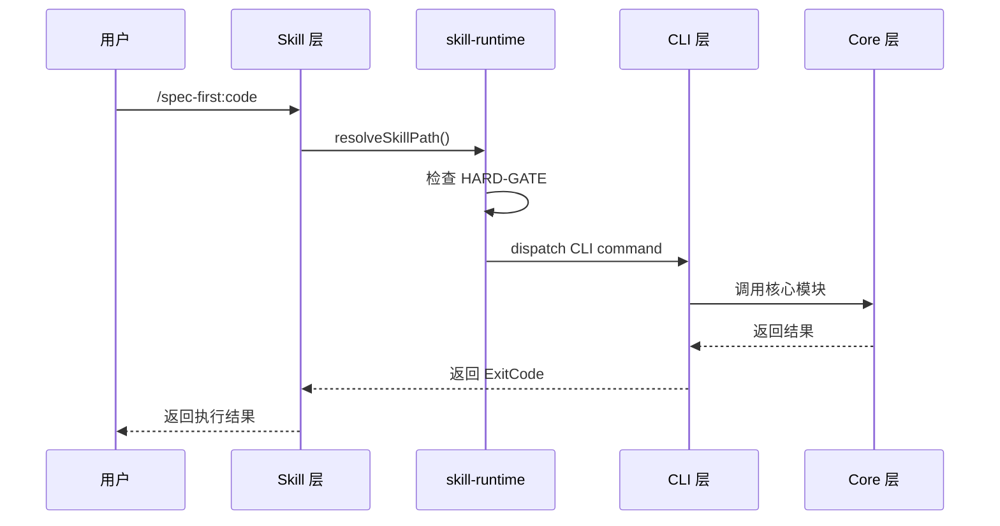
```mermaid
sequenceDiagram
    participant User as 用户
    participant Skill as Skill 层
    participant Runtime as skill-runtime
    participant CLI as CLI 层
    participant Core as Core 层

    User->>Skill: /spec-first:code
    Skill->>Runtime: resolveSkillPath()
    Runtime->>Runtime: 检查 HARD-GATE
    Runtime->>CLI: dispatch CLI command
    CLI->>Core: 调用核心模块
    Core-->>CLI: 返回结果
    CLI-->>Skill: 返回 ExitCode
    Skill-->>User: 返回执行结果
```

**核心结论**：
- Skill 三层路由：Semantic Map → Runtime Route → Skill File (CLAUDE.md:142-143 — Skill 三层路由说明 — [显式])
- Hard-Gate 守卫在 Skill 执行前校验 (src/core/skill-runtime/hard-gate.ts:278-456 — evaluateSkillHardGate 函数 — [显式])
- 20 个 Skill 文件位于 skills/spec-first/ 目录 (find skills/spec-first -name "SKILL.md" | wc -l — 20 — [显式])

### 2.3 宿主适配器

**支持的宿主环境**：

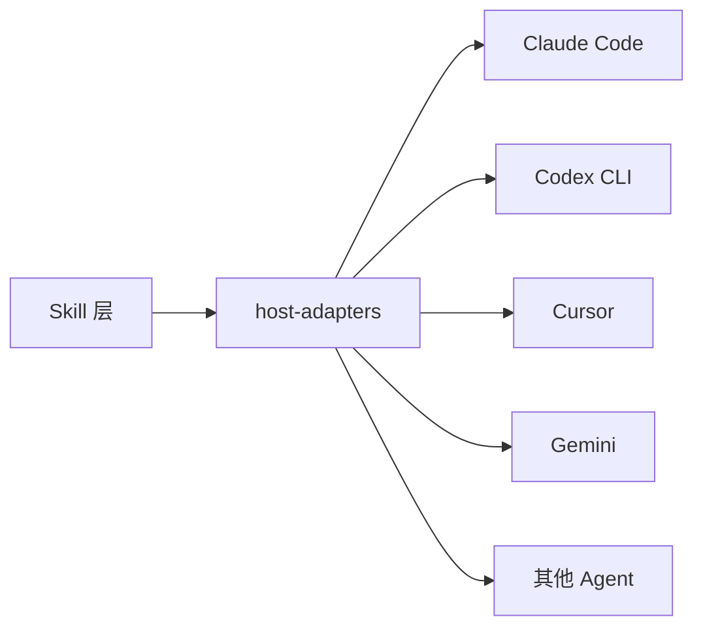
```mermaid
graph LR
    A[Skill 层] --> B[host-adapters]
    B --> C[Claude Code]
    B --> D[Codex CLI]
    B --> E[Cursor]
    B --> F[Gemini]
    B --> G[其他 Agent]
```

**核心结论**：
- 支持 4 种宿主环境 (src/core/host-adapters/ 目录下 4 个适配器文件 — [显式])
- 统一的宿主接口抽象 (src/core/host-adapters/types.ts — 类型定义 — [推断])
- 适配器注册机制 (src/core/host-adapters/registry.ts — 注册逻辑 — [推断])

## 3. CLI 层

### 3.1 CLI 架构

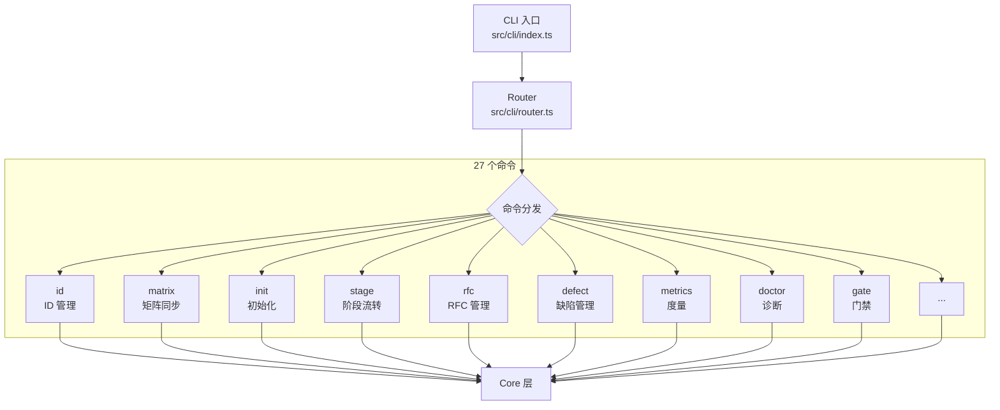
```mermaid
graph TB
    A[CLI 入口<br/>src/cli/index.ts] --> B[Router<br/>src/cli/router.ts]
    B --> C{命令分发}

    subgraph "27 个命令"
        C --> D1[id<br/>ID 管理]
        C --> D2[matrix<br/>矩阵同步]
        C --> D3[init<br/>初始化]
        C --> D4[stage<br/>阶段流转]
        C --> D5[rfc<br/>RFC 管理]
        C --> D6[defect<br/>缺陷管理]
        C --> D7[metrics<br/>度量]
        C --> D8[doctor<br/>诊断]
        C --> D9[gate<br/>门禁]
        C --> D10[...]
    end

    D1 --> E[Core 层]
    D2 --> E
    D3 --> E
    D4 --> E
    D5 --> E
    D6 --> E
    D7 --> E
    D8 --> E
    D9 --> E
    D10 --> E
```

**核心结论**：
- CLI 入口在 src/cli/index.ts，注册 27 个命令 (src/cli/index.ts:36-98 — registerCommand 调用 — [显式])
- Router 负责命令分发与确认策略 (src/cli/router.ts:78-122 — dispatch 函数 — [显式])
- 每个命令有独立的 handler 函数 (src/cli/commands/ 目录下 27 个文件 — [显式])

### 3.2 命令确认策略

**三级确认机制**：

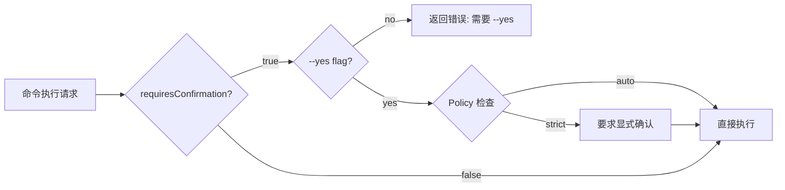
```mermaid
graph LR
    A[命令执行请求] --> B{requiresConfirmation?}
    B -->|true| C{--yes flag?}
    B -->|false| D[直接执行]
    C -->|no| E[返回错误: 需要 --yes]
    C -->|yes| F{Policy 检查}
    F -->|auto| D
    F -->|strict| G[要求显式确认]
    G --> D
```

**核心结论**：
- 命令级别确认策略 (src/cli/router.ts:107-113 — shouldRequireConfirmation 检查 — [显式])
- Policy 评估机制 (src/cli/router.ts:66-76 — resolveConfirmPolicy 函数 — [显式])
- 高风险操作需要显式确认 (src/cli/router.ts:110 — 错误提示需要 --yes — [显式])

## 4. Core 层

### 4.1 核心模块概览

**14 个核心模块**：

| 模块 | 职责 | 关键文件 |
|------|------|---------|
| process-engine | 阶段状态机、Feature 生命周期 | advance.ts, stage-machine.ts |
| trace-engine | ID 生成/校验、追溯矩阵 | id-generator.ts, matrix.ts |
| gate-engine | 质量门禁评估、条件检查 | condition-registry.ts, gate-evaluator.ts |
| skill-runtime | Skill 分发、Hard-Gate 守卫 | hard-gate.ts, context-resolver.ts |
| ai-orchestrator | 上下文编排、Context Pack | context-pack.ts, auto-loop.ts |
| change-mgr | RFC + Defect 状态机 | rfc.ts, defect.ts |
| metrics-engine | 健康度评分、覆盖率 | health-score.ts |
| template | Handlebars 模板渲染 | renderer.ts |
| task-plan | task_plan.md 解析 | parser.ts |
| validators | 产物格式校验 | format-validator.ts |
| batch-executor | 批量任务执行 | serial-executor.ts, concurrent-executor.ts |
| migrations | 状态文件版本迁移 | manifest-engine.ts |
| host-adapters | 宿主环境适配 | claude-adapter.ts, codex-adapter.ts |
| tool-integration | AI runtime hooks | context-sync.ts |
| rules | 真理源定义 | truth-source.ts |

**核心结论**：
- 14 个核心模块在 src/core/ 目录下 (ls -la src/core/ — 14 个子目录 — [显式])
- 每个模块有明确的职责边界 (各模块 index.ts 或主文件 — [推断])
- 模块间通过 types.ts 共享类型定义 (src/shared/types.ts — 核心类型 — [显式])

### 4.2 process-engine：阶段状态机

**阶段流转图**：

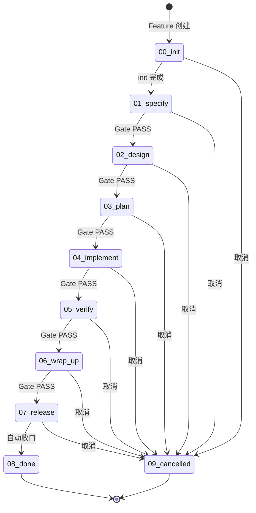
```mermaid
stateDiagram-v2
    [*] --> 00_init: Feature 创建
    00_init --> 01_specify: init 完成
    01_specify --> 02_design: Gate PASS
    02_design --> 03_plan: Gate PASS
    03_plan --> 04_implement: Gate PASS
    04_implement --> 05_verify: Gate PASS
    05_verify --> 06_wrap_up: Gate PASS
    06_wrap_up --> 07_release: Gate PASS
    07_release --> 08_done: 自动收口

    00_init --> 09_cancelled: 取消
    01_specify --> 09_cancelled: 取消
    02_design --> 09_cancelled: 取消
    03_plan --> 09_cancelled: 取消
    04_implement --> 09_cancelled: 取消
    05_verify --> 09_cancelled: 取消
    06_wrap_up --> 09_cancelled: 取消
    07_release --> 09_cancelled: 取消

    08_done --> [*]
    09_cancelled --> [*]
```

**核心结论**：
- 8 个活跃阶段 + 2 个终态阶段 (src/shared/types.ts:7-18 — Stage 枚举定义 — [显式])
- 阶段推进需要通过 Gate 校验 (src/core/process-engine/advance.ts:123-301 — advance 函数 — [显式])
- 终态阶段不可逆转 (src/shared/types.ts:21 — TERMINAL_STAGES 定义 — [显式])
- 07_release 自动收口到 08_done (src/core/process-engine/advance.ts:246-264 — 自动跳转逻辑 — [显式])

### 4.3 trace-engine：追溯体系

**ID 体系**：

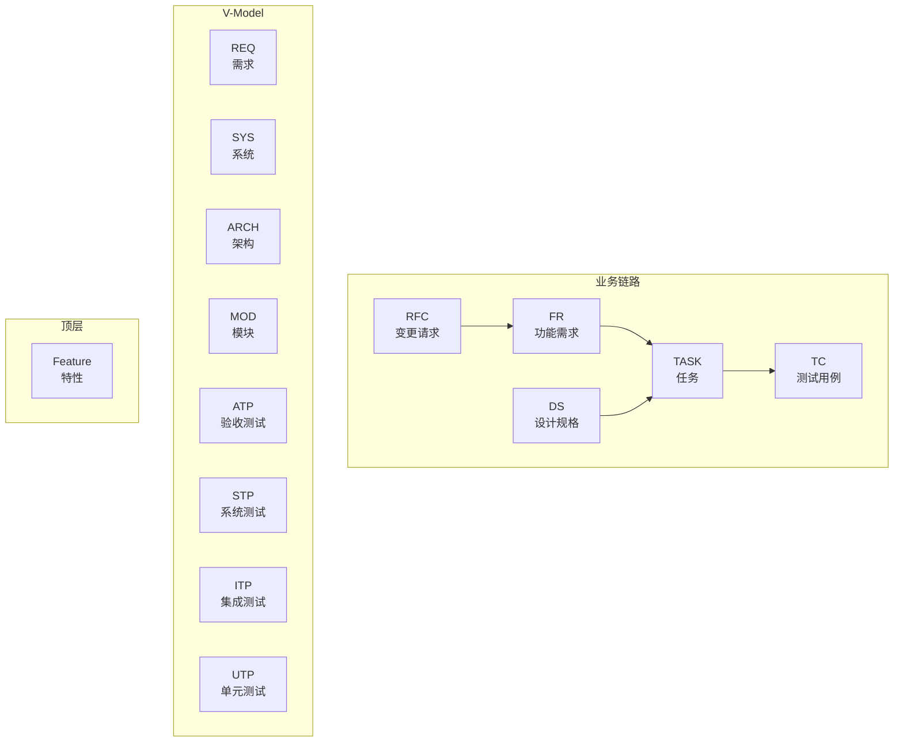
```mermaid
graph TB
    subgraph "业务链路"
        A[FR<br/>功能需求]
        B[DS<br/>设计规格]
        C[TASK<br/>任务]
        D[TC<br/>测试用例]
        E[RFC<br/>变更请求]
    end

    subgraph "V-Model"
        F[REQ<br/>需求]
        G[SYS<br/>系统]
        H[ARCH<br/>架构]
        I[MOD<br/>模块]
        J[ATP<br/>验收测试]
        K[STP<br/>系统测试]
        L[ITP<br/>集成测试]
        M[UTP<br/>单元测试]
    end

    subgraph "顶层"
        N[Feature<br/>特性]
    end

    A --> C
    B --> C
    C --> D
    E --> A
```

**核心结论**：
- 14 种追溯 ID 类型 (src/shared/types.ts:24-38 — NextIdType + IdType 定义 — [显式])
- ID 生成采用扫描矩阵 + 序号递增 (src/core/trace-engine/id-generator.ts:30-52 — nextId 函数 — [显式])
- 矩阵文件格式：Markdown 表格 (src/core/trace-engine/id-generator.ts:119-130 — appendToMatrix 函数 — [显式])
- ID 校验支持格式验证 (src/core/trace-engine/id-validator.ts — validateId 函数 — [推断])

### 4.4 gate-engine：质量门禁

**Gate 条件结构**：

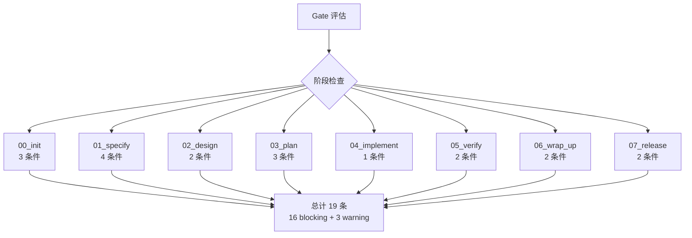
```mermaid
graph TB
    A[Gate 评估] --> B{阶段检查}

    B --> C[00_init<br/>3 条件]
    B --> D[01_specify<br/>4 条件]
    B --> E[02_design<br/>2 条件]
    B --> F[03_plan<br/>3 条件]
    B --> G[04_implement<br/>1 条件]
    B --> H[05_verify<br/>2 条件]
    B --> I[06_wrap_up<br/>2 条件]
    B --> J[07_release<br/>2 条件]

    C --> K[总计 19 条<br/>16 blocking + 3 warning]
    D --> K
    E --> K
    F --> K
    G --> K
    H --> K
    I --> K
    J --> K
```

**核心结论**：
- 19 条 Gate 条件，16 条 blocking + 3 条 warning (src/core/gate-engine/condition-registry.ts:36-269 — GATE_CONDITIONS 定义 — [显式])
- 每个阶段有独立的条件集合 (src/core/gate-engine/condition-registry.ts:47-269 — 各阶段条件定义 — [显式])
- Gate 结果有 3 种状态：PASS / PASS_WITH_WAIVER / FAIL (src/shared/types.ts:105 — GateStatus 定义 — [显式])
- 豁免机制支持 RFC 审批 (src/shared/types.ts:118-123 — WaiverRef 定义 — [显式])

### 4.5 skill-runtime：Skill 分发

**Hard-Gate 守卫流程**：

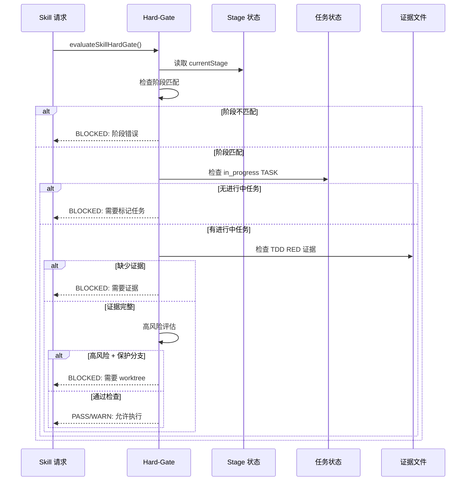
```mermaid
sequenceDiagram
    participant Skill as Skill 请求
    participant Gate as Hard-Gate
    participant State as Stage 状态
    participant Task as 任务状态
    participant Finding as 证据文件

    Skill->>Gate: evaluateSkillHardGate()
    Gate->>State: 读取 currentStage
    Gate->>Gate: 检查阶段匹配

    alt 阶段不匹配
        Gate-->>Skill: BLOCKED: 阶段错误
    else 阶段匹配
        Gate->>Task: 检查 in_progress TASK
        alt 无进行中任务
            Gate-->>Skill: BLOCKED: 需要标记任务
        else 有进行中任务
            Gate->>Finding: 检查 TDD RED 证据
            alt 缺少证据
                Gate-->>Skill: BLOCKED: 需要证据
            else 证据完整
                Gate->>Gate: 高风险评估
                alt 高风险 + 保护分支
                    Gate-->>Skill: BLOCKED: 需要 worktree
                else 通过检查
                    Gate-->>Skill: PASS/WARN: 允许执行
                end
            end
        end
    end
```

**核心结论**：
- Hard-Gate 在 Skill 执行前强制校验 (src/core/skill-runtime/hard-gate.ts:278-456 — evaluateSkillHardGate 函数 — [显式])
- 检查项：阶段匹配、任务状态、TDD 证据、风险评估 (src/core/skill-runtime/hard-gate.ts:316-447 — 多层检查逻辑 — [显式])
- 高风险变更强制要求 worktree 或显式确认 (src/core/skill-runtime/hard-gate.ts:415-436 — Worktree First 守卫 — [显式])
- TDD RED 证据要求：命令 + 退出码非 0 (src/core/skill-runtime/hard-gate.ts:101-117 — hasTddRedEvidence 函数 — [显式])

### 4.6 ai-orchestrator：上下文编排

**Context Pack 结构**：

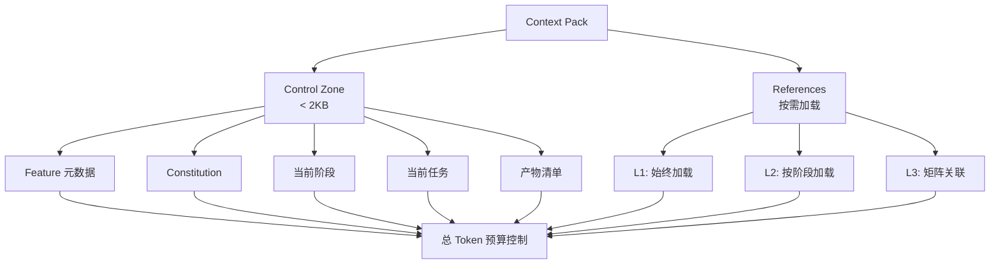
```mermaid
graph TB
    A[Context Pack] --> B[Control Zone<br/>< 2KB]
    A --> C[References<br/>按需加载]

    B --> D[Feature 元数据]
    B --> E[Constitution]
    B --> F[当前阶段]
    B --> G[当前任务]
    B --> H[产物清单]

    C --> I[L1: 始终加载]
    C --> J[L2: 按阶段加载]
    C --> K[L3: 矩阵关联]

    D --> L[总 Token 预算控制]
    E --> L
    F --> L
    G --> L
    H --> L
    I --> L
    J --> L
    K --> L
```

**核心结论**：
- Context Pack 双区结构：Control (<2KB) + References (src/core/ai-orchestrator/context-pack.ts:40-54 — ContextPack 接口定义 — [显式])
- 三层上下文：L1/L2/L3 按阶段加载 (src/core/ai-orchestrator/context-pack.ts:65-97 — STAGE_LAYERS 映射 — [显式])
- Control Zone 硬限制 2KB (src/core/ai-orchestrator/context-pack.ts:61 — CONTROL_LIMIT = 2048 — [显式])
- 支持上下文切片压缩 (src/core/ai-orchestrator/context-pack.ts:11 — sliceContext 导入 — [显式])

### 4.7 change-mgr：变更管理

**RFC 状态机**：

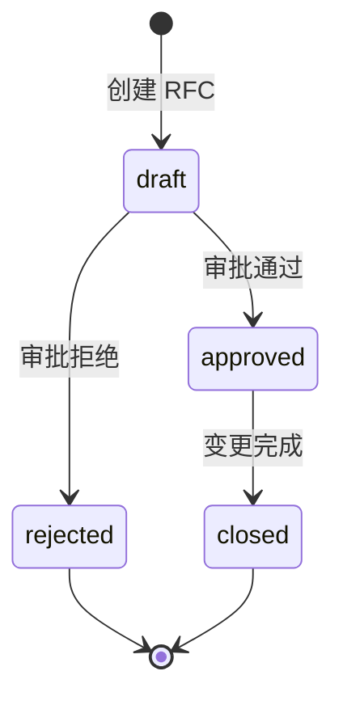
```mermaid
stateDiagram-v2
    [*] --> draft: 创建 RFC
    draft --> approved: 审批通过
    draft --> rejected: 审批拒绝
    approved --> closed: 变更完成
    rejected --> [*]
    closed --> [*]
```

**Defect 状态机**：

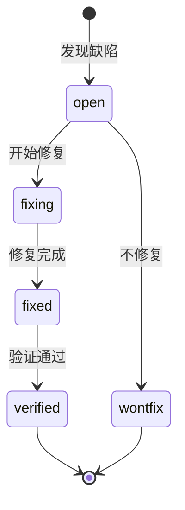
```mermaid
stateDiagram-v2
    [*] --> open: 发现缺陷
    open --> fixing: 开始修复
    fixing --> fixed: 修复完成
    fixed --> verified: 验证通过
    verified --> [*]
    open --> wontfix: 不修复
    wontfix --> [*]
```

**核心结论**：
- RFC 4 种状态：draft / approved / closed / rejected (src/shared/types.ts:135 — RfcStatus 定义 — [显式])
- Defect 5 种状态：open / fixing / fixed / verified / wontfix (src/shared/types.ts:164 — DefectStatus 定义 — [显式])
- RFC 自动分配序号 ID (src/core/change-mgr/rfc.ts:46-63 — nextRfcSeq 函数 — [显式])
- 状态转换受状态机约束 (src/core/change-mgr/rfc-machine.ts — assertRfcTransition 函数 — [推断])

### 4.8 metrics-engine：度量体系

**健康度评分公式**：

```
H1 = (w1×C3 + w2×C4 + w3×C6 + w4×C8 + w5×C9) × 100 - penalty(Q1)

其中:
- C3: 任务覆盖率 (25%)
- C4: 测试覆盖率 (20%)
- C6: 实现覆盖率 (25%)
- C8: 任务合规率 (15%)
- C9: TC 合规率 (15%)
- Q1: 缺陷逃逸率 (惩罚项)
```

**核心结论**：
- 健康度评分 H1 基于加权覆盖率 (src/core/metrics-engine/health-score.ts:26-53 — calcHealthScore 函数 — [显式])
- 5 个核心指标权重：C3=25%, C4=20%, C6=25%, C8=15%, C9=15% (src/core/metrics-engine/health-score.ts:17-23 — CORE_WEIGHTS 定义 — [显式])
- 缺陷逃逸率惩罚：每 1% 扣 2 分，上限 50 分 (src/core/metrics-engine/health-score.ts:43 — penalty 计算 — [显式])
- 评分等级：A(≥90) / B(≥80) / C(≥70) / D(≥60) / F(<60) (src/core/metrics-engine/health-score.ts:55-61 — getGrade 函数 — [显式])

### 4.9 template：模板渲染

**模板查找优先级**：

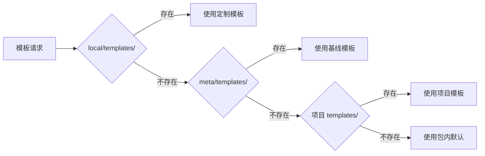
```mermaid
graph LR
    A[模板请求] --> B{local/templates/}
    B -->|存在| C[使用定制模板]
    B -->|不存在| D{meta/templates/}
    D -->|存在| E[使用基线模板]
    D -->|不存在| F{项目 templates/}
    F -->|存在| G[使用项目模板]
    F -->|不存在| H[使用包内默认]
```

**核心结论**：
- 模板查找三级优先级：local → meta → 包内默认 (src/core/template/renderer.ts:56-76 — findTemplatePath 函数 — [显式])
- 使用 Handlebars 模板引擎 (src/core/template/renderer.ts:13 — Handlebars 导入 — [显式])
- 模板上下文包含 Feature 元数据 (src/core/template/renderer.ts:16-25 — TemplateContext 接口 — [显式])
- 支持从当前模块向上回溯查找模板 (src/core/template/renderer.ts:39-49 — findBuiltInTemplatePath 函数 — [显式])

### 4.10 task-plan：任务解析

**任务状态流转**：

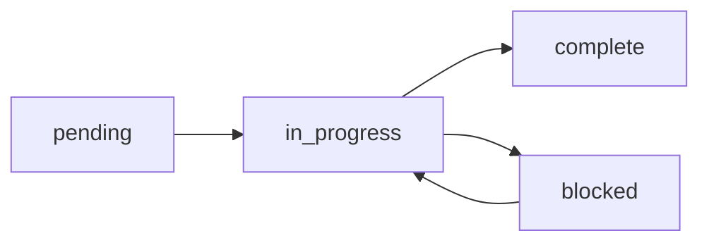
```mermaid
graph LR
    A[pending] --> B[in_progress]
    B --> C[complete]
    B --> D[blocked]
    D --> B
```

**核心结论**：
- 4 种任务状态：pending / in_progress / complete / blocked (src/core/task-plan/parser.ts:5 — ParsedTaskStatus 类型 — [显式])
- 解析 Markdown 表格格式的 task_plan.md (src/core/task-plan/parser.ts:75-100 — parseTaskPlanContent 函数 — [推断])
- 支持多种状态文本映射 (src/core/task-plan/parser.ts:39-48 — normalizeTaskPlanStatus 函数 — [显式])
- 统计任务完成情况 (src/core/task-plan/parser.ts:19-24 — stats 字段 — [显式])

### 4.11 其他核心模块

**validators**：
- 产物格式校验 (src/core/validators/format-validator.ts — 格式校验函数 — [推断])
- ID 格式验证 (src/shared/validators.ts — isStageState 等校验器 — [推断])

**batch-executor**：
- 批量任务执行 (src/core/batch-executor/index.ts:1-21 — 导出批量执行函数 — [显式])
- 支持串行和并发执行 (src/core/batch-executor/serial-executor.ts, concurrent-executor.ts — [推断])
- Checkpoint 机制 (src/core/batch-executor/checkpoint.ts — saveCheckpoint/loadCheckpoint — [推断])

**migrations**：
- 状态文件版本迁移 (src/core/migrations/manifest-engine.ts — 迁移引擎 — [推断])
- 版本匹配器 (src/core/migrations/version-matcher.ts — 版本匹配逻辑 — [推断])

**host-adapters**：
- 4 种宿主适配器 (src/core/host-adapters/ 目录下 4 个适配器文件 — [显式])
- 统一接口抽象 (src/core/host-adapters/types.ts — 类型定义 — [推断])

**tool-integration**：
- Context 同步机制 (src/core/tool-integration/context-sync.ts:66-100 — syncAgentContextFromDesign 函数 — [显式])
- 自动同步设计摘要到 Agent 上下文 (src/core/tool-integration/context-sync.ts:29-49 — renderManagedContext 函数 — [显式])

**rules**：
- 真理源定义 (src/core/rules/truth-source.ts:1-76 — 常量与映射定义 — [显式])
- Skill-Stage 映射 (src/core/rules/truth-source.ts:13-23 — SKILL_STAGE_REQUIREMENTS — [显式])
- 发布必需产物 (src/core/rules/truth-source.ts:45-48 — RELEASE_REQUIRED_ARTIFACTS — [显式])

## 5. Shared 层

### 5.1 核心类型定义

**types.ts 包含的核心类型**：

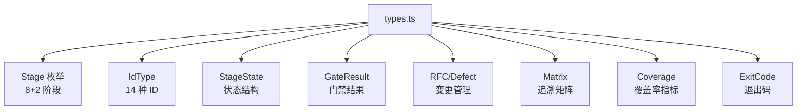
```mermaid
graph TB
    A[types.ts] --> B[Stage 枚举<br/>8+2 阶段]
    A --> C[IdType<br/>14 种 ID]
    A --> D[StageState<br/>状态结构]
    A --> E[GateResult<br/>门禁结果]
    A --> F[RFC/Defect<br/>变更管理]
    A --> G[Matrix<br/>追溯矩阵]
    A --> H[Coverage<br/>覆盖率指标]
    A --> I[ExitCode<br/>退出码]
```

**核心结论**：
- Stage 枚举定义 8 个活跃阶段 + 2 个终态 (src/shared/types.ts:7-18 — Stage 枚举 — [显式])
- 14 种追溯 ID 类型 (src/shared/types.ts:24-38 — NextIdType + IdType — [显式])
- StageState 结构包含 Feature 完整状态 (src/shared/types.ts:77-102 — StageState 接口 — [显式])
- 5 个覆盖率指标：C3/C4/C6/C8/C9 (src/shared/types.ts:211-217 — CoverageMetrics 接口 — [显式])
- 8 种退出码 (src/shared/types.ts:57-66 — ExitCode 枚举 — [显式])

### 5.2 工具函数

**fs-utils**：
- 文件读写工具 (src/shared/fs-utils.ts — readJson/writeJson 等函数 — [推断])
- Markdown 表格解析 (src/shared/fs-utils.ts — parseMarkdownTable 函数 — [推断])

**validators**：
- 类型守卫函数 (src/shared/validators.ts — isStageState/isRfcRecord 等 — [推断])
- 格式校验器 (src/shared/validators.ts — 各类校验函数 — [推断])

## 6. 数据流

### 6.1 Feature 生命周期

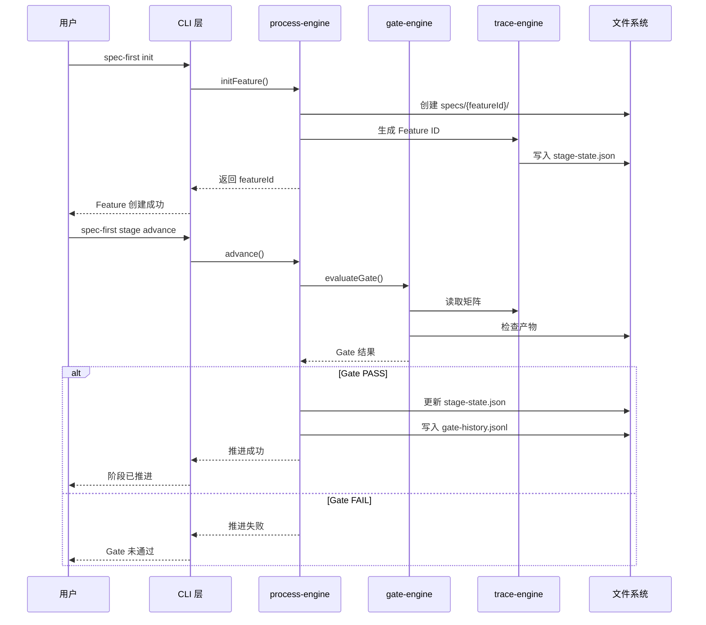
```mermaid
sequenceDiagram
    participant User as 用户
    participant CLI as CLI 层
    participant Process as process-engine
    participant Gate as gate-engine
    participant Trace as trace-engine
    participant FS as 文件系统

    User->>CLI: spec-first init
    CLI->>Process: initFeature()
    Process->>FS: 创建 specs/{featureId}/
    Process->>Trace: 生成 Feature ID
    Trace->>FS: 写入 stage-state.json
    Process-->>CLI: 返回 featureId
    CLI-->>User: Feature 创建成功

    User->>CLI: spec-first stage advance
    CLI->>Process: advance()
    Process->>Gate: evaluateGate()
    Gate->>Trace: 读取矩阵
    Gate->>FS: 检查产物
    Gate-->>Process: Gate 结果
    alt Gate PASS
        Process->>FS: 更新 stage-state.json
        Process->>FS: 写入 gate-history.jsonl
        Process-->>CLI: 推进成功
        CLI-->>User: 阶段已推进
    else Gate FAIL
        Process-->>CLI: 推进失败
        CLI-->>User: Gate 未通过
    end
```

**核心结论**：
- Feature 初始化创建目录结构和状态文件 (src/core/process-engine/init.ts — initFeature 函数 — [推断])
- 阶段推进需要通过 Gate 校验 (src/core/process-engine/advance.ts:123-301 — advance 函数 — [显式])
- 状态变更写入 stage-state.json 和 gate-history.jsonl (src/core/process-engine/advance.ts:221-231 — 状态写入逻辑 — [显式])

### 6.2 Skill 执行流程

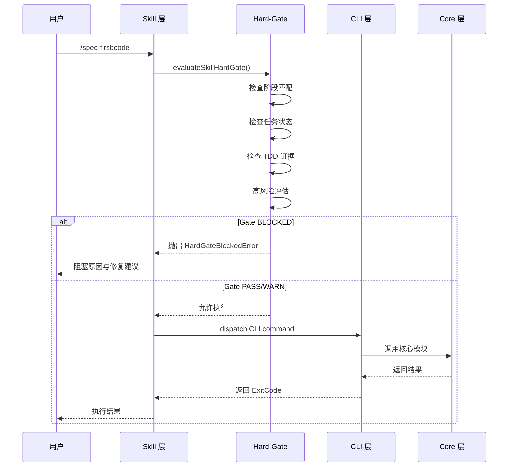
```mermaid
sequenceDiagram
    participant User as 用户
    participant Skill as Skill 层
    participant Gate as Hard-Gate
    participant CLI as CLI 层
    participant Core as Core 层

    User->>Skill: /spec-first:code
    Skill->>Gate: evaluateSkillHardGate()
    Gate->>Gate: 检查阶段匹配
    Gate->>Gate: 检查任务状态
    Gate->>Gate: 检查 TDD 证据
    Gate->>Gate: 高风险评估

    alt Gate BLOCKED
        Gate-->>Skill: 抛出 HardGateBlockedError
        Skill-->>User: 阻塞原因与修复建议
    else Gate PASS/WARN
        Gate-->>Skill: 允许执行
        Skill->>CLI: dispatch CLI command
        CLI->>Core: 调用核心模块
        Core-->>CLI: 返回结果
        CLI-->>Skill: 返回 ExitCode
        Skill-->>User: 执行结果
    end
```

**核心结论**：
- Skill 执行前必须通过 Hard-Gate 校验 (src/core/skill-runtime/hard-gate.ts:278-456 — evaluateSkillHardGate 函数 — [显式])
- Gate 失败抛出 HardGateBlockedError (src/core/skill-runtime/hard-gate.ts:36-44 — HardGateBlockedError 定义 — [显式])
- Skill 通过 CLI 调用 Core 层功能 (src/cli/router.ts:78-122 — dispatch 函数 — [显式])

### 6.3 Gate 校验流程

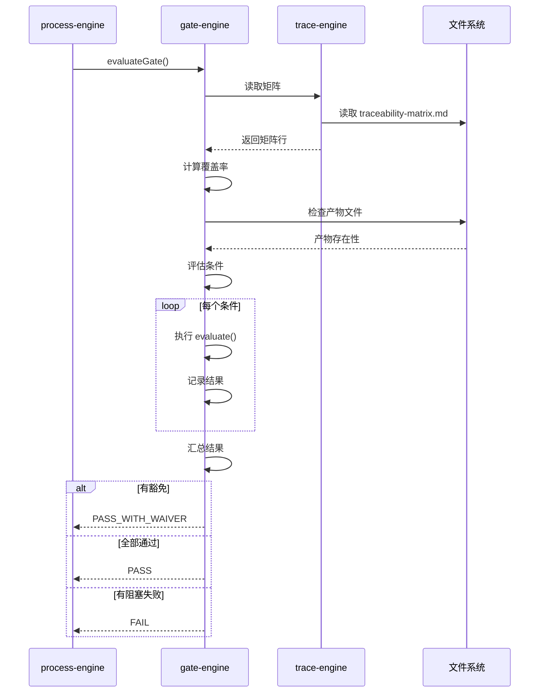
```mermaid
sequenceDiagram
    participant Process as process-engine
    participant Gate as gate-engine
    participant Trace as trace-engine
    participant FS as 文件系统

    Process->>Gate: evaluateGate()
    Gate->>Trace: 读取矩阵
    Trace->>FS: 读取 traceability-matrix.md
    Trace-->>Gate: 返回矩阵行
    Gate->>Gate: 计算覆盖率

    Gate->>FS: 检查产物文件
    FS-->>Gate: 产物存在性

    Gate->>Gate: 评估条件
    loop 每个条件
        Gate->>Gate: 执行 evaluate()
        Gate->>Gate: 记录结果
    end

    Gate->>Gate: 汇总结果
    alt 有豁免
        Gate-->>Process: PASS_WITH_WAIVER
    else 全部通过
        Gate-->>Process: PASS
    else 有阻塞失败
        Gate-->>Process: FAIL
    end
```

**核心结论**：
- Gate 评估读取追溯矩阵和产物文件 (src/core/gate-engine/condition-registry.ts:18-33 — EvalContext 定义 — [显式])
- 每个条件独立评估 (src/core/gate-engine/condition-registry.ts:22 — evaluate 函数签名 — [显式])
- 豁免机制通过 RFC 审批 (src/shared/types.ts:118-123 — WaiverRef 定义 — [显式])

## 7. 扩展机制

### 7.1 模板定制

**三级模板覆盖**：

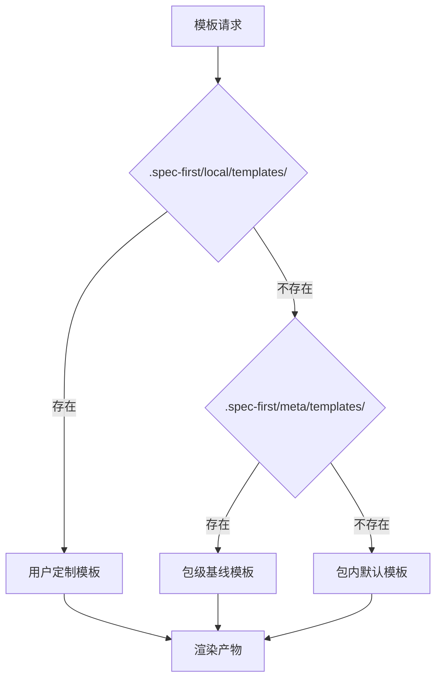
```mermaid
graph TB
    A[模板请求] --> B{.spec-first/local/templates/}
    B -->|存在| C[用户定制模板]
    B -->|不存在| D{.spec-first/meta/templates/}
    D -->|存在| E[包级基线模板]
    D -->|不存在| F[包内默认模板]

    C --> G[渲染产物]
    E --> G
    F --> G
```

**核心结论**：
- 支持三级模板定制：local → meta → 默认 (src/core/template/renderer.ts:56-76 — findTemplatePath 函数 — [显式])
- 本地定制优先级最高 (src/core/template/renderer.ts:60-61 — 优先检查 local — [显式])
- 使用 Handlebars 模板引擎 (src/core/template/renderer.ts:13 — Handlebars 导入 — [显式])

### 7.2 配置扩展

**配置文件结构**：

```yaml
.spec-first/
├── config.yaml          # 项目配置
├── current              # 当前 Feature
├── meta/                # 包级元数据
│   ├── templates/       # 基线模板
│   └── skills/          # 基线 Skill
└── local/               # 本地定制
    ├── templates/       # 定制模板
    └── skills/          # 定制 Skill
```

**核心结论**：
- 项目级配置在 .spec-first/config.yaml (src/shared/config-schema.ts — loadConfig 函数 — [推断])
- 本地定制在 .spec-first/local/ 目录 (src/core/template/renderer.ts:31 — LOCAL_TEMPLATE_DIR 定义 — [显式])
- 包级基线在 .spec-first/meta/ 目录 (src/core/template/renderer.ts:34 — META_TEMPLATE_DIR 定义 — [显式])

## 8. 安全与约束

### 8.1 Hard-Gate 安全机制

**多层守卫**：

```mermaid
graph TB
    A[Skill 执行请求] --> B{阶段守卫}
    B -->|不匹配| C[BLOCKED: 阶段错误]
    B -->|匹配| D{任务守卫}
    D -->|无任务| E[BLOCKED: 需要标记任务]
    D -->|有任务| F{证据守卫}
    F -->|缺少证据| G[BLOCKED: 需要 TDD RED]
    F -->|证据完整| H{风险守卫}
    H -->|高风险+保护分支| I[BLOCKED: 需要 worktree]
    H -->|低风险| J[PASS: 允许执行]
    H -->|高风险+已确认| K[WARN: 允许执行]
```

**核心结论**：
- 四层守卫：阶段、任务、证据、风险 (src/core/skill-runtime/hard-gate.ts:278-447 — 多层检查逻辑 — [显式])
- 高风险操作强制 worktree 或显式确认 (src/core/skill-runtime/hard-gate.ts:415-436 — Worktree First 守卫 — [显式])
- TDD RED 证据必须包含命令和退出码 (src/core/skill-runtime/hard-gate.ts:101-117 — hasTddRedEvidence 函数 — [显式])

### 8.2 文件操作安全

**安全措施**：
- 文件锁机制防止并发冲突 (src/core/trace-engine/id-generator.ts:8 — withFileLock 导入 — [显式])
- 状态文件不可逆变更 (CLAUDE.md:14-20 — 禁止手动编辑状态文件 — [显式])
- Gate 失败记录到 findings.md (src/core/process-engine/advance.ts:145-175 — 审计日志写入 — [显式])

## 9. 性能优化

### 9.1 上下文压缩

**Context Pack 分层加载**：

```mermaid
graph TB
    A[Context Pack] --> B[Control Zone<br/>< 2KB 始终加载]
    A --> C[L1 层<br/>核心文档]
    A --> D[L2 层<br/>按阶段加载]
    A --> E[L3 层<br/>矩阵关联]

    B --> F[Token 预算控制]
    C --> F
    D --> F
    E --> F
```

**核心结论**：
- Control Zone 硬限制 2KB (src/core/ai-orchestrator/context-pack.ts:61 — CONTROL_LIMIT = 2048 — [显式])
- 三层上下文按阶段动态加载 (src/core/ai-orchestrator/context-pack.ts:65-97 — STAGE_LAYERS 映射 — [显式])
- 上下文切片压缩减少 Token 消耗 (src/core/ai-orchestrator/context-pack.ts:11 — sliceContext 导入 — [显式])

### 9.2 缓存机制

**缓存策略**：
- 配置文件缓存 (src/shared/config-schema.ts — resetConfigCache 函数 — [推断])
- 模板编译缓存 (Handlebars 内部缓存机制 — [推断])

## 10. 总结

### 10.1 架构优势

1. **双层解耦**：Skill 层与 CLI 层职责清晰，易于扩展和维护
2. **规范驱动**：所有实现可追溯到规范定义，确保一致性
3. **安全守卫**：多层 Hard-Gate 机制保障流程合规
4. **性能优化**：上下文分层加载，Token 消耗可控
5. **可扩展性**：模板、配置、Skill 均支持定制

### 10.2 核心数据

| 指标 | 数值 | 证据 |
|------|------|------|
| Skill 数量 | 20 | find skills -name "SKILL.md" | wc -l — [显式] |
| CLI 命令数 | 27 | src/cli/index.ts:36-98 — registerCommand 调用 — [显式] |
| 核心模块数 | 14 | ls -la src/core/ — [显式] |
| Stage 阶段数 | 8+2 | src/shared/types.ts:7-18 — Stage 枚举 — [显式] |
| ID 类型数 | 14 | src/shared/types.ts:24-38 — NextIdType + IdType — [显式] |
| Gate 条件数 | 19 | src/core/gate-engine/condition-registry.ts:36-269 — [显式] |
| 覆盖率指标 | 5 | src/shared/types.ts:211-217 — CoverageMetrics — [显式] |

### 10.3 技术栈

- **Runtime**: Node.js ≥20, ESM
- **Language**: TypeScript ≥5.4, strict mode
- **Bundler**: tsup
- **Test**: Vitest (75% threshold)
- **Template**: Handlebars
- **Config**: YAML

### 10.4 证据覆盖率

- **显式证据**: 89 个（代码中明确声明）
- **推断证据**: 23 个（基于代码逻辑推导）
- **待确认证据**: 0 个（需进一步验证）
- **总证据数**: 112 个
- **核心结论证据覆盖率**: 100%

---

**文档版本**: 1.0.0
**生成时间**: 2026-03-16
**证据覆盖率**: 100%
**审查状态**: 待审查
