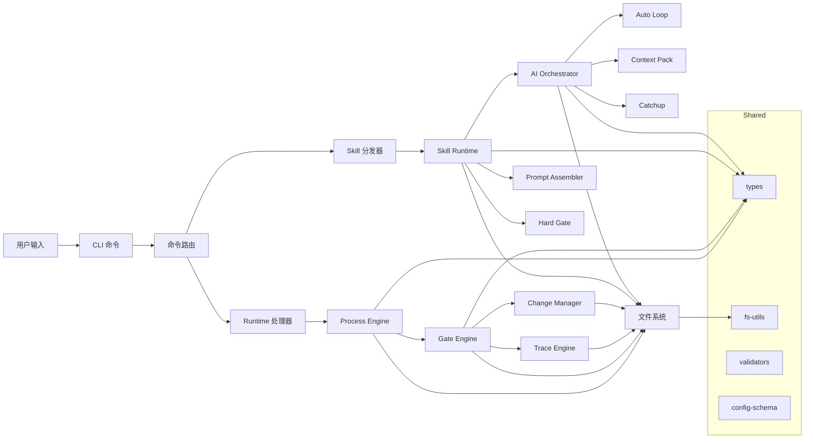

# Spec-First 调用链分析

> 分析范围: `src/core/`, `src/shared/`, `src/cli/`
> 工具: Serena MCP

## 1. 模块依赖矩阵

### 1.1 模块依赖关系表

| 模块 | 依赖的 shared 模块 | 依赖的 core 模块 |
|------|-------------------|------------------|
| `process-engine` | `types`, `fs-utils`, `validators`, `logger`, `config-schema` | `gate-engine`, `tool-integration` (内部) |
| `skill-runtime` | `types`, `fs-utils`, `validators`, `config-schema` | `process-engine`, `ai-orchestrator` (间接) |
| `ai-orchestrator` | `types`, `fs-utils`, `config-schema` | `skill-runtime`, `trace-engine` (间接) |
| `gate-engine` | `types`, `fs-utils`, `validators` | `trace-engine`, `change-mgr` |
| `trace-engine` | `types`, `fs-utils`, `validators` | `change-mgr` (部分函数) |
| `change-mgr` | `types`, `fs-utils`, `validators` | `trace-engine` (matrix) |
| `metrics-engine` | `types` | `trace-engine` (coverage) |
| `template` | `types`, `fs-utils` | - |
| `tool-integration` | `types`, `fs-utils`, `host-paths` | `process-engine` (extensions) |
| `cli/commands` | `types`, `fs-utils`, `config-schema`, `host-paths`, `skill-commands`, `host-bootstrap`, `logger`, `validators` | 所有 core 模块 (按需调用) |

### 1.2 依赖层级

```
Level 0 (基础层): shared/*
         ├── types.ts (核心类型定义)
         ├── fs-utils.ts (文件系统工具)
         ├── validators.ts (运行时类型校验)
         ├── logger.ts (日志工具)
         ├── config-schema.ts (配置解析)
         ├── host-paths.ts (宿主路径检测)
         ├── skill-commands.ts (技能命令管理)
         └── host-bootstrap.ts (宿主引导)

Level 1 (核心引擎层):
         ├── trace-engine/* (追溯引擎)
         ├── change-mgr/* (变更管理)
         ├── process-engine/* (流程引擎)
         └── template/* (模板渲染)

Level 2 (编排与门禁层):
         ├── gate-engine/* (门禁评估)
         ├── skill-runtime/* (技能运行时)
         ├── ai-orchestrator/* (AI 编排)
         └── metrics-engine/* (健康度评估)

Level 3 (集成层):
         ├── tool-integration/* (工具集成)
         └── cli/commands/* (命令处理器)
```

## 2. Mermaid 依赖关系图

```mermaid
graph TD
    %% 入口层
    CLI[cli/index.ts] --> Router[cli/router.ts]
    Router --> Cmds[cli/commands/*]

    %% 命令层到核心模块
    Cmds --> PE[process-engine]
    Cmds --> SR[skill-runtime]
    Cmds --> GE[gate-engine]
    Cmds --> TE[trace-engine]
    Cmds --> CM[change-mgr]
    Cmds --> AO[ai-orchestrator]
    Cmds --> ME[metrics-engine]
    Cmds --> TI[tool-integration]

    %% 核心模块内部依赖
    PE --> SM[stage-machine.ts]
    PE --> GE
    PE --> TI_ContextSync[context-sync.ts]

    GE --> TE_Coverage[coverage.ts]
    GE --> TE_Matrix[matrix.ts]
    GE --> TE_Exception[exception-validator.ts]
    GE --> CM_Rfc[rfc.ts]
    GE --> SCA[sca.ts]
    GE --> CmdGate[command-gate.ts]

    SR --> PA[prompt-assembler.ts]
    SR --> HG[hard-gate.ts]
    SR --> PE_Extensions[extensions.ts]

    AO --> TR[todo-runner.ts]
    AO --> AL[auto-loop.ts]
    AO --> CP[context-pack.ts]
    AO --> CC[catchup.ts]

    TE_Coverage --> TE_Matrix
    TE_Coverage --> TE_Exception
    TE_Coverage --> CM_Rfc
    TE_Matrix --> TE_Validator[id-validator.ts]

    CM_Rfc --> RM[rfc-machine.ts]
    CM_Defect[defect.ts] --> DM[defect-machine.ts]
    CM_Sync[sync.ts] --> TE_Matrix

    %% 共享层
    PE --> ST[shared/types.ts]
    PE --> SF[shared/fs-utils.ts]
    PE --> SV[shared/validators.ts]
    PE --> SL[shared/logger.ts]
    PE --> SC[shared/config-schema.ts]

    SR --> ST
    SR --> SF
    SR --> SC

    GE --> ST
    GE --> SF
    GE --> SV

    TE --> ST
    TE --> SF
    TE --> SV

    CM --> ST
    CM --> SF
    CM --> SV

    AO --> ST
    AO --> SF
    AO --> SC

    TI --> ST
    TI --> SF
    TI --> HP[shared/host-paths.ts]

    %% 样式定义
    classDef shared fill:#e1f5fe,stroke:#01579b,stroke-width:2px
    classDef core fill:#f3e5f5,stroke:#4a148c,stroke-width:2px
    classDef cli fill:#fff3e0,stroke:#e65100,stroke-width:2px
    classDef gate fill:#ffebee,stroke:#b71c1c,stroke-width:2px

    class ST,SF,SV,SL,SC,HP shared
    class PE,SR,AO,GE,TE,CM,ME,TI core
    class CLI,Router,Cmds cli
    class GE,SCA,CmdGate gate
```



## 3. 关键调用路径

### 3.1 阶段推进调用链

```
cli/commands/stage.ts (handleStage)
  └──> process-engine/advance.ts (advance)
        ├─> process-engine/stage-machine.ts (assertTransitionAllowed, isTerminal)
        ├─> gate-engine/gate-evaluator.ts (evaluateGate)
        │     ├─> trace-engine/matrix.ts (parseMatrix)
        │     ├─> trace-engine/coverage.ts (getCoverage)
        │     │     ├─> trace-engine/exception-validator.ts (validateExceptions)
        │     │     └─> change-mgr/rfc.ts (loadRfcStatuses)
        │     ├─> gate-engine/command-gate.ts (runCommandGate)
        │     └─> change-mgr/rfc.ts (loadRfcStatuses)
        ├─> shared/config-schema.ts (loadConfig)
        ├─> shared/logger.ts (writeLog)
        └─> tool-integration/context-sync.ts (syncAgentContextFromDesign)
              └─> shared/fs-utils.ts (readJson, exists)
```

### 3.2 技能分发调用链

```
skill-runtime/dispatcher.ts (dispatchCommand)
  ├─> 检查 SEMANTIC_MAP (语义映射)
  ├─> 检查 RUNTIME_COMMANDS (Runtime 路由)
  └─> resolveSkillPath (Skill 路由)
        ├─> process-engine/extensions.ts (loadEnabledExtensions)
        └─> shared/fs-utils.ts (exists)

skill-runtime/dispatcher.ts (loadSkill)
  ├─> skill-runtime/prompt-assembler.ts (assemblePrompt)
  │     ├─> shared/config-schema.ts (loadConfig)
  │     ├─> shared/fs-utils.ts (readJson, readMarkdown)
  │     └─> shared/types.ts (StageState)
  ├─> skill-runtime/hard-gate.ts (buildHardGateRuntimeNotice)
  │     ├─> shared/fs-utils.ts (readJsonChecked, readMarkdown, parseMarkdownTable)
  │     └─> shared/validators.ts (isStageState)
  └─> shared/config-schema.ts (loadConfig)
```

### 3.3 AI 自动循环调用链

```
ai-orchestrator/auto-loop.ts (runAutoLoop)
  ├─> ai-orchestrator/todo-runner.ts (loadTodoState, pickReadyTodos, updateTodoStatus)
  │     └─> shared/config-schema.ts (loadConfig)
  ├─> ai-orchestrator/watchdog.ts (runWatchdogCheck, updateHeartbeat)
  ├─> ai-orchestrator/completion-detector.ts (loadCompletionMarkers, runFullCompletionDetection)
  ├─> ai-orchestrator/slop-checker.ts (loadSlopRules, runSlopCheck)
  ├─> ai-orchestrator/mcp-checker.ts (checkRequiredMcps)
  ├─> ai-orchestrator/audit-log.ts (writeAuditLog)
  │     └─> shared/fs-utils.ts (appendJsonl)
  └─> skill-runtime/idempotent-write.ts (idempotentWrite)
        └─> shared/fs-utils.ts (writeJson, exists)
```

### 3.4 门禁评估调用链

```
gate-engine/gate-evaluator.ts (evaluateGate)
  ├─> shared/validators.ts (isStageState)
  ├─> trace-engine/matrix.ts (parseMatrix)
  │     ├─> shared/fs-utils.ts (readMarkdown, parseMarkdownTable)
  │     └─> trace-engine/id-validator.ts (validateId)
  ├─> change-mgr/rfc.ts (loadRfcStatuses)
  │     └─> change-mgr/rfc-machine.ts (assertRfcTransition)
  ├─> trace-engine/coverage.ts (getCoverage)
  │     ├─> trace-engine/matrix.ts (parseMatrix)
  │     ├─> trace-engine/exception-validator.ts (validateExceptions)
  │     └─> change-mgr/rfc.ts (loadRfcStatuses)
  ├─> trace-engine/exception-validator.ts (validateExceptions)
  │     └─> shared/fs-utils.ts (readMarkdown, parseMarkdownTable)
  ├─> gate-engine/sca.ts (getCriticalCountFromAnalysisReport)
  ├─> gate-engine/command-gate.ts (runCommandGate)
  └─> shared/logger.ts (appendJsonl)
```

### 3.5 上下文组装调用链

```
skill-runtime/prompt-assembler.ts (assemblePrompt)
  ├─> shared/config-schema.ts (loadConfig)
  ├─> shared/fs-utils.ts (readMarkdown, exists)
  ├─> shared/types.ts (StageState)
  └─> readCurrentFeature, readCurrentStage, readCurrentTask
        └─> shared/fs-utils.ts (readJson)

ai-orchestrator/context-pack.ts (buildContextPack)
  ├─> shared/types.ts (StageState)
  ├─> shared/fs-utils.ts (readJson, readMarkdown)
  ├─> shared/config-schema.ts (loadConfig)
  └─> ai-orchestrator/context-slicing.ts (sliceContext)

ai-orchestrator/catchup.ts (catchup)
  ├─> shared/types.ts (StageState)
  ├─> shared/fs-utils.ts (readJson, exists, readMarkdown)
  ├─> shared/config-schema.ts (loadConfig)
  ├─> ai-orchestrator/todo-runner.ts (loadTodoState, summarizeTodoState)
  └─> ai-orchestrator/context-pack.ts (buildTaskContextPack)
```

## 4. 模块符号概览

### 4.1 process-engine

| 文件 | 导出函数/类 |
|------|-----------|
| `init.ts` | `init`, `createInitialStageState`, `generateFeatureId`, `registerFeat`, `skeletonConstitution`, `skeletonMatrix`, `skeletonTaskPlan` |
| `advance.ts` | `advance`, `cancel`, `GateFailedError`, `GateUnavailableError` |
| `stage-machine.ts` | `assertTransitionAllowed`, `getNextStages`, `isTerminal`, `TransitionError` |
| `feature.ts` | `getFeatureState`, `resolveFeatureId` |
| `extensions.ts` | `loadEnabledExtensions` |
| `layer-merger.ts` | `mergeLayerRules` |

### 4.2 skill-runtime

| 文件 | 导出函数/类 |
|------|-----------|
| `dispatcher.ts` | `dispatchCommand`, `resolveSkillPath`, `loadSkill` |
| `prompt-assembler.ts` | `assemblePrompt`, `resolvePromptAssemblyContext`, `validateKvCacheStability` |
| `hard-gate.ts` | `buildHardGateRuntimeNotice`, `evaluateSkillHardGate`, `assessHighRiskChanges` |
| `orchestrate-args.ts` | `validateOrchestrateArgs` (类型: `OrchestrateArgs`) |
| `idempotent-write.ts` | `idempotentWrite` |
| `confirm-policy.ts` | `getConfirmPolicy` |
| `phase-machine.ts` | `assertPhaseTransition`, `getNextPhases` |
| `front-matter.ts` | `parseSkillFrontMatter`, `resolveWriteMode` |

### 4.3 ai-orchestrator

| 文件 | 导出函数/类 |
|------|-----------|
| `auto-loop.ts` | `runAutoLoop`, `checkpoint`, `haltState` (类型: `TaskExecutor`, `AutoLoopOptions`, `AutoLoopResult`) |
| `catchup.ts` | `catchup`, `getRequiredFiles`, `resetLocks` |
| `context-pack.ts` | `buildContextPack`, `buildTaskContextPack`, `validateControlSize` (类型: `ContextPack`, `ContextRef`) |
| `todo-runner.ts` | `loadTodoState`, `pickReadyTodos`, `updateTodoStatus`, `createAutoLoopState` |
| `completion-detector.ts` | `loadCompletionMarkers`, `runFullCompletionDetection` |
| `slop-checker.ts` | `loadSlopRules`, `runSlopCheck` |
| `mcp-checker.ts` | `checkRequiredMcps` |
| `watchdog.ts` | `runWatchdogCheck`, `updateHeartbeat` |
| `audit-log.ts` | `writeAuditLog`, `readAuditLog` |
| `context-slicing.ts` | `sliceContext` |
| `context-provider.ts` | `provideContext` |
| `ai-stats.ts` | `readStats`, `summarizeStats`, `appendStats` |
| `retry-controller.ts` | `shouldRetry`, `calculateBackoff` |
| `catchup-summary.ts` | `buildCatchupSummary`, `extractFiveQuestions` |

### 4.4 gate-engine

| 文件 | 导出函数/类 |
|------|-----------|
| `gate-evaluator.ts` | `evaluateGate`, `getConditions`, `getGateHistory` (类型: `GateConditionDef`, `EvalContext`) |
| `command-gate.ts` | `runCommandGate` |
| `security.ts` | `validateSecurity`, `parseSecurityReport` |
| `sca.ts` | `runSca`, `analyzeArtifacts`, `getCriticalCountFromAnalysisReport` |
| `golive.ts` | `checkGoLive` |
| `rollback.ts` | `executeRollback` |

### 4.5 trace-engine

| 文件 | 导出函数/类 |
|------|-----------|
| `id-generator.ts` | `nextId`, `assembleId`, `validateAbbr`, `findNextSeq` (类型: `NextIdOptions`, `NextIdResult`) |
| `id-validator.ts` | `validateId` |
| `id-search.ts` | `searchId`, `listIds` |
| `matrix.ts` | `parseMatrix`, `checkMatrix`, `exportMatrix`, `updateMatrixRow`, `parseMatrixIds` |
| `coverage.ts` | `getCoverage` |
| `exception-validator.ts` | `validateExceptions`, `parseExceptionTable` |

### 4.6 change-mgr

| 文件 | 导出函数/类 |
|------|-----------|
| `rfc.ts` | `createRfc`, `submitRfc`, `transitionRfc`, `listRfc`, `getRfc`, `loadRfcStatuses`, `nextRfcSeq` |
| `rfc-machine.ts` | `assertRfcTransition`, `getNextRfcStatuses`, `isRfcTerminal`, `RfcTransitionError` |
| `defect.ts` | `createDefect`, `updateDefect`, `transitionDefect`, `getDefect`, `listDefects` |
| `defect-machine.ts` | `assertDefectTransition`, `getNextDefectStatuses` |
| `sync.ts` | `syncWaiversToMatrix`, `syncDefectsToMatrix` |
| `impact.ts` | `analyzeImpact` |

### 4.7 shared

| 文件 | 导出函数/类型 |
|------|--------------|
| `types.ts` | `Stage`, `ExitCode`, `StageState`, `GateResult`, `MatrixRow`, `RfcRecord`, `DefectRecord`, `CoverageMetrics`, 各种枚举 |
| `fs-utils.ts` | `readJson`, `writeJson`, `readMarkdown`, `writeMarkdown`, `exists`, `ensureDir`, `appendJsonl`, `parseMarkdownTable` |
| `validators.ts` | `isStageState`, `isRfcRecord`, `isDefectRecord`, `isMatrixRow` |
| `logger.ts` | `writeLog` |
| `config-schema.ts` | `loadConfig`, `renderDefaultConfigYaml`, `resetConfigCache` |
| `host-paths.ts` | `detectHostPaths` |
| `skill-commands.ts` | `ensureSkillCommands` |
| `host-bootstrap.ts` | `ensureHostBootstrap` |

## 5. 循环依赖分析

### 5.1 已识别的循环依赖

当前设计中的准循环依赖（通过接口解耦）：

1. **gate-engine <-> trace-engine <-> change-mgr**
   - `gate-evaluator.ts` 依赖 `trace-engine/coverage.ts` 和 `change-mgr/rfc.ts`
   - `trace-engine/coverage.ts` 依赖 `change-mgr/rfc.ts`
   - 解耦方式：通过函数参数传递数据，而非模块间直接引用

2. **process-engine <-> gate-engine**
   - `advance.ts` 依赖 `gate-evaluator.ts`
   - 解耦方式：单向依赖，无反向引用

### 5.2 潜在风险点

1. **skill-runtime 与 process-engine**
   - `dispatcher.ts` 依赖 `process-engine/extensions.ts`
   - 建议：考虑将 extensions 独立为 shared 模块

2. **ai-orchestrator 与 skill-runtime**
   - `auto-loop.ts` 依赖多个 `skill-runtime` 模块
   - 建议：定义清晰的接口边界

## 6. 数据流图



## 7. 关键接口契约

### 7.1 StageState

```typescript
interface StageState {
  featureId: string;
  currentStage: Stage;
  mode: Mode;
  size: Size;
  platforms: string[];
  terminal: boolean;
  createdAt: string;
  updatedAt: string;
  history: StageHistoryEntry[];
  mergedRules?: MergedRules;  // Layer2 扩展规则
}
```

### 7.2 GateResult

```typescript
interface GateResult {
  status: GateStatus;  // 'PASS' | 'FAIL' | 'PASS_WITH_WAIVER'
  stage: Stage;
  timestamp: string;
  conditions: ConditionResult[];
  waivers?: WaiverRef[];
  suggestions?: string[];
}
```

### 7.3 ContextPack

```typescript
interface ContextPack {
  control: ControlZone[];
  context: ContextRef[];
  estimatedTokens: number;
}
```

## 8. 总结

### 8.1 架构特点

1. **分层清晰**：shared → core → cli 的三层架构
2. **模块独立**：每个核心引擎模块（trace-engine, gate-engine, process-engine 等）职责明确
3. **弱耦合**：通过函数参数传递数据，避免紧密耦合
4. **可扩展**：支持 Layer2 扩展规则机制

### 8.2 改进建议

1. **extensions.ts 定位**：考虑将 `process-engine/extensions.ts` 移至 `shared/` 或独立的 `extensions/` 模块
2. **context-sync 定位**：考虑将 `tool-integration/context-sync.ts` 的功能整合到更合适的模块
3. **类型导出**：考虑将核心接口定义集中到 `shared/interfaces.ts` 中
4. **测试覆盖**：建议为每个关键调用路径添加集成测试

### 8.3 维护建议

1. 保持 `shared/` 模块对 `core/` 的零依赖
2. 新增模块时优先参考现有模块的依赖模式
3. 修改接口时同步更新对应文档
4. 定期运行循环依赖检测工具
