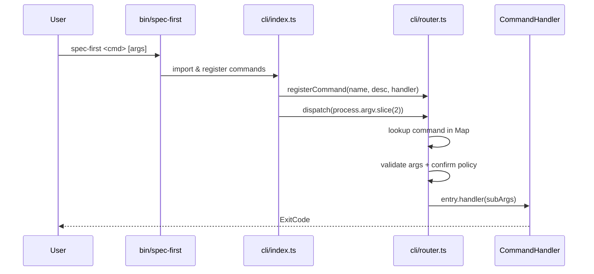
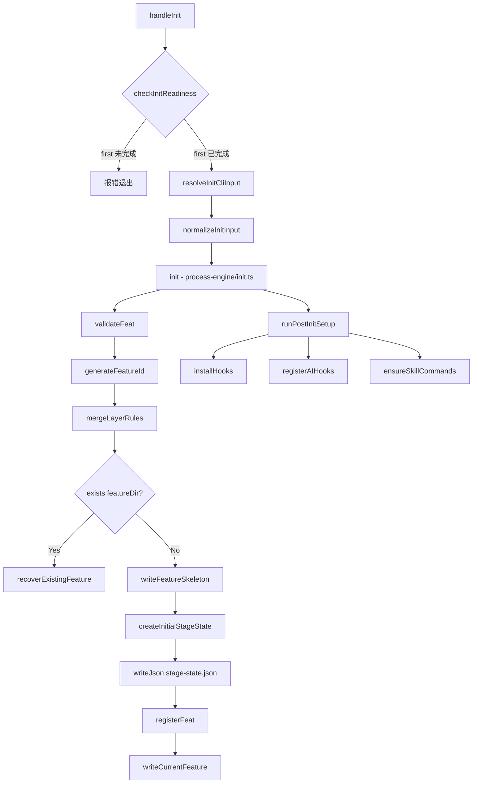
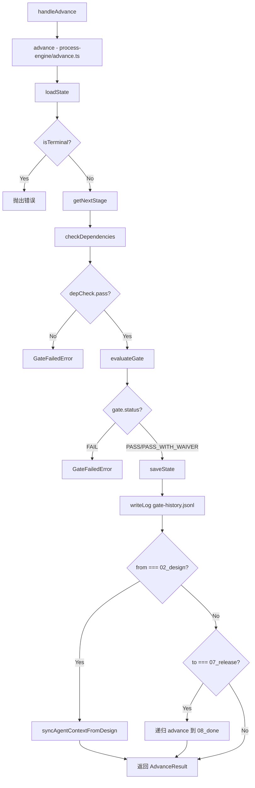
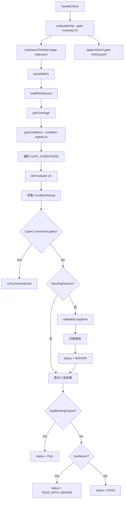
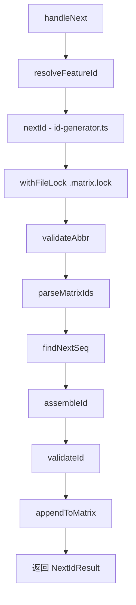
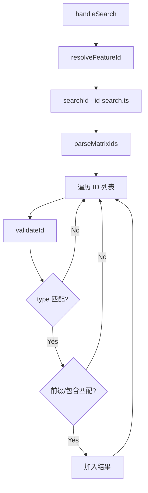
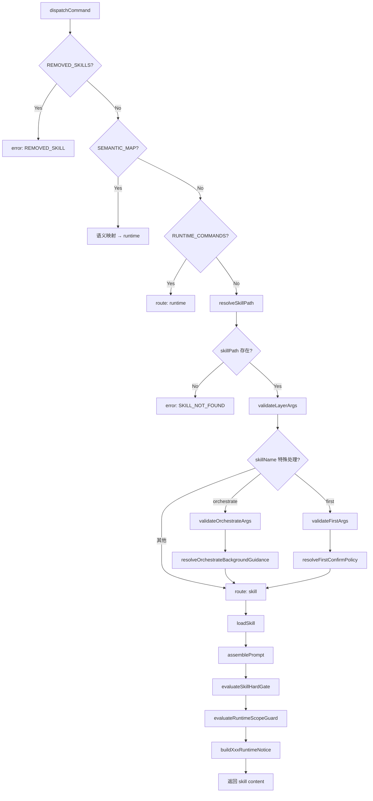
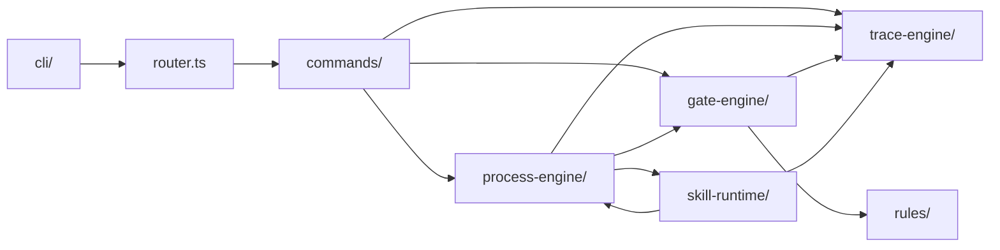

# Call Graph - Spec-First CLI

> 本文档基于源码静态分析生成，标注关键调用链与数据流。

---

## 1. CLI 启动链

**入口**: `bin/spec-first` → `src/cli/index.ts`



**关键函数**:

| 函数 | 文件路径 | 职责 |
|------|----------|------|
| `registerCommand()` | `src/cli/router.ts:31` | 注册命令到 Map |
| `dispatch()` | `src/cli/router.ts:79` | 分发命令，处理 --help/--version |
| `shouldRequireConfirmation()` | `src/cli/router.ts:50` | 判断是否需要 --yes 确认 |

**证据**:
- `src/cli/index.ts:100` - `await dispatch(process.argv.slice(2))`
- `src/cli/router.ts:90-94` - 命令查找与错误处理

---

## 2. Feature 初始化链

**命令**: `spec-first init --feat <abbr> --mode <N|I> --size <S|M|L> --platforms <p1,p2>`



**关键函数**:

| 函数 | 文件路径 | 职责 |
|------|----------|------|
| `handleInit()` | `src/cli/commands/init.ts:359` | CLI 入口，参数解析与校验 |
| `init()` | `src/core/process-engine/init.ts:735` | 核心初始化逻辑 |
| `generateFeatureId()` | `src/core/process-engine/init.ts:88` | 生成 `FSREQ-YYYYMMDD-FEAT-NNN` |
| `registerFeat()` | `src/core/process-engine/init.ts:167` | 写入 FEAT 注册表（带锁） |
| `writeFeatureSkeleton()` | `src/core/process-engine/init.ts:640` | 创建目录与骨架文件 |

**产物**:
- `specs/{featureId}/stage-state.json` - 阶段状态
- `specs/{featureId}/findings.md` - 决策记录
- `specs/{featureId}/task_plan.md` - 任务计划
- `specs/{featureId}/traceability-matrix.md` - 追溯矩阵
- `.spec-first/current` - 当前 Feature ID

**证据**:
- `src/core/process-engine/init.ts:736-755` - 主流程分支（已存在 vs 新建）
- `src/core/process-engine/init.ts:134-151` - 注册表锁机制

---

## 3. Stage 推进链

**命令**: `spec-first stage advance <featureId>`



**关键函数**:

| 函数 | 文件路径 | 职责 |
|------|----------|------|
| `handleAdvance()` | `src/cli/commands/stage.ts:211` | CLI 入口 |
| `advance()` | `src/core/process-engine/advance.ts:123` | 核心推进逻辑 |
| `loadState()` | `src/core/process-engine/advance.ts:60` | 读取 stage-state.json |
| `checkDependencies()` | `src/core/process-engine/dependency-checker.ts` | 依赖产物检查 |
| `evaluateGate()` | `src/core/gate-engine/gate-evaluator.ts:99` | Gate 评估 |
| `saveState()` | `src/core/process-engine/advance.ts:102` | 持久化状态 |

**推进约束**:
1. 依赖检查通过（产物齐全）
2. Gate 校验通过（条件满足）
3. 阶段转换合法（状态机规则）

**证据**:
- `src/core/process-engine/advance.ts:143-153` - 依赖检查阻断
- `src/core/process-engine/advance.ts:155-175` - Gate 评估与豁免处理
- `src/core/process-engine/advance.ts:247-264` - 07_release 自动跳转到 08_done

---

## 4. Gate 校验链

**命令**: `spec-first gate check <featureId>`



**关键函数**:

| 函数 | 文件路径 | 职责 |
|------|----------|------|
| `handleCheck()` | `src/cli/commands/gate.ts:72` | CLI 入口 |
| `evaluateGate()` | `src/core/gate-engine/gate-evaluator.ts:99` | 核心评估逻辑 |
| `getConditions()` | `src/core/gate-engine/gate-evaluator.ts:41` | 获取阶段条件定义 |
| `getCoverage()` | `src/core/trace-engine/coverage.ts` | 计算覆盖率 C3/C4/C6/C8/C9 |
| `validateExceptions()` | `src/core/trace-engine/exception-validator.ts` | 豁免校验 |

**条件评估上下文** (`EvalContext`):
```typescript
interface EvalContext {
  featureId: string;
  projectRoot: string;
  stage: Stage;
  state: StageState;
  coverage: CoverageMetrics;  // C3, C4, C6, C8, C9
  rows: MatrixRow[];          // 追溯矩阵行
  rfcStatuses: Map<string, string>;
}
```

**Gate 条件示例** (`src/core/gate-engine/condition-registry.ts`):
- `G-SPEC-01`: spec.md exists
- `G-PLAN-01`: Task coverage (C3) = 100%
- `G-IMPL-01`: Unit test coverage (C4) >= threshold
- `G-WRAP-01`: Implementation coverage (C6) = 100%

**证据**:
- `src/core/gate-engine/gate-evaluator.ts:108-112` - 构建评估上下文
- `src/core/gate-engine/gate-evaluator.ts:119-130` - Layer1 条件评估循环
- `src/core/gate-engine/gate-evaluator.ts:134-149` - Layer2 命令 Gate
- `src/core/gate-engine/gate-evaluator.ts:155-178` - 豁免匹配逻辑

---

## 5. ID 追溯链

### 5.1 ID 生成

**命令**: `spec-first id next <type> <abbr> --feature <featureId> [--level <UT|IT|E2E|ST>]`



**ID 格式**:
- FR/DS/TASK/RFC: `{TYPE}-{ABBR}-{NNN}` (例: `FR-AUTH-001`)
- TC: `TC-{LEVEL}-{ABBR}-{NNN}` (例: `TC-UT-AUTH-001`)
- RFC: `RFC-{NNN}` (例: `RFC-001`)

**关键函数**:

| 函数 | 文件路径 | 职责 |
|------|----------|------|
| `handleNext()` | `src/cli/commands/id.ts:57` | CLI 入口 |
| `nextId()` | `src/core/trace-engine/id-generator.ts:30` | 核心生成逻辑 |
| `findNextSeq()` | `src/core/trace-engine/id-generator.ts:76` | 扫描最大序号 |
| `assembleId()` | `src/core/trace-engine/id-generator.ts:63` | 组装 ID 字符串 |
| `appendToMatrix()` | `src/core/trace-engine/id-generator.ts:114` | 写入矩阵 |

**证据**:
- `src/core/trace-engine/id-generator.ts:31-51` - 文件锁 + 生成流程
- `src/core/trace-engine/id-generator.ts:63-73` - ID 组装规则

### 5.2 ID 搜索

**命令**: `spec-first id search <query> --feature <featureId> [--type <type>]`



**关键函数**:

| 函数 | 文件路径 | 职责 |
|------|----------|------|
| `handleSearch()` | `src/cli/commands/id.ts:124` | CLI 入口 |
| `searchId()` | `src/core/trace-engine/id-search.ts:17` | 模糊搜索 |
| `listIds()` | `src/core/trace-engine/id-search.ts:50` | 列出全部 ID |

**匹配规则**:
- 前缀匹配: `"FR-AUTH"` → 匹配 `"FR-AUTH-001"`
- 包含匹配: `"AUTH"` → 匹配所有含 AUTH 的 ID

**证据**:
- `src/core/trace-engine/id-search.ts:32-44` - 搜索逻辑

---

## 6. Skill 分发链

**入口**: `/spec-first:<skill-name>` (Claude Code Skill 命令)



**关键函数**:

| 函数 | 文件路径 | 职责 |
|------|----------|------|
| `dispatchCommand()` | `src/core/skill-runtime/dispatcher.ts:271` | 命令解析与路由 |
| `resolveSkillPath()` | `src/core/skill-runtime/dispatcher.ts:383` | 查找 Skill 文件 |
| `loadSkill()` | `src/core/skill-runtime/dispatcher.ts:435` | 加载并组装 Skill 内容 |
| `assemblePrompt()` | `src/core/skill-runtime/prompt-assembler.ts` | 动态注入上下文 |
| `evaluateSkillHardGate()` | `src/core/skill-runtime/hard-gate.ts` | Hard Gate 校验 |

**路由优先级**:
1. 语义映射 (`rfc approve` → `rfc transition {0} approved`)
2. Runtime 命令 (`id`, `matrix`, `stage`, `rfc`, `defect`, `metrics`, `gate`, `golive`, `ai`, `commit`, `feature`)
3. Skill 文件 (`skills/spec-first/NN-name/SKILL.md`)

**Skill 搜索路径**:
1. 项目本地: `{projectRoot}/skills/spec-first/NN-{name}/SKILL.md`
2. 包级: `{pkgRoot}/skills/spec-first/NN-{name}/SKILL.md`
3. 扩展: `{ext.skillsDir}/{name}/SKILL.md`

**证据**:
- `src/core/skill-runtime/dispatcher.ts:271-377` - 分发主逻辑
- `src/core/skill-runtime/dispatcher.ts:82-103` - 语义映射表与 Runtime 命令集
- `src/core/skill-runtime/dispatcher.ts:383-412` - Skill 路径解析
- `src/core/skill-runtime/dispatcher.ts:435-564` - Skill 加载与 Runtime Notice 注入

---

## 7. 调用链总结

### 7.1 模块依赖关系



### 7.2 核心数据流

| 数据结构 | 生成阶段 | 持久化位置 | 消费者 |
|----------|----------|------------|--------|
| `StageState` | init | `specs/{id}/stage-state.json` | stage advance, gate check |
| `MatrixRow[]` | id next | `specs/{id}/traceability-matrix.md` | gate check, coverage |
| `GateResult` | gate check | `specs/{id}/gate-history.jsonl` | stage advance, metrics |
| `CoverageMetrics` | gate check | 内存 | gate conditions |
| `SkillContent` | skill load | 内存 | Claude Code |

### 7.3 关键断言（带证据）

1. **Stage 推进必须通过 Gate** [证据: `src/core/process-engine/advance.ts:155-162`]
2. **ID 生成需要文件锁** [证据: `src/core/trace-engine/id-generator.ts:31`]
3. **Gate 评估聚合三态结果** [证据: `src/core/gate-engine/gate-evaluator.ts:181-191`]
4. **Skill 分发优先语义映射** [证据: `src/core/skill-runtime/dispatcher.ts:291-303`]
5. **Feature 初始化幂等** [证据: `src/core/process-engine/init.ts:746-755`]

---

## 附录: 文件索引

| 模块 | 核心文件 | 行数 |
|------|----------|------|
| CLI 入口 | `src/cli/index.ts` | 102 |
| 路由分发 | `src/cli/router.ts` | 157 |
| Feature 初始化 | `src/core/process-engine/init.ts` | 790 |
| Stage 推进 | `src/core/process-engine/advance.ts` | 346 |
| Gate 评估 | `src/core/gate-engine/gate-evaluator.ts` | 244 |
| Gate 条件注册 | `src/core/gate-engine/condition-registry.ts` | 399 |
| ID 生成 | `src/core/trace-engine/id-generator.ts` | 131 |
| ID 搜索 | `src/core/trace-engine/id-search.ts` | 66 |
| Skill 分发 | `src/core/skill-runtime/dispatcher.ts` | 1130 |
