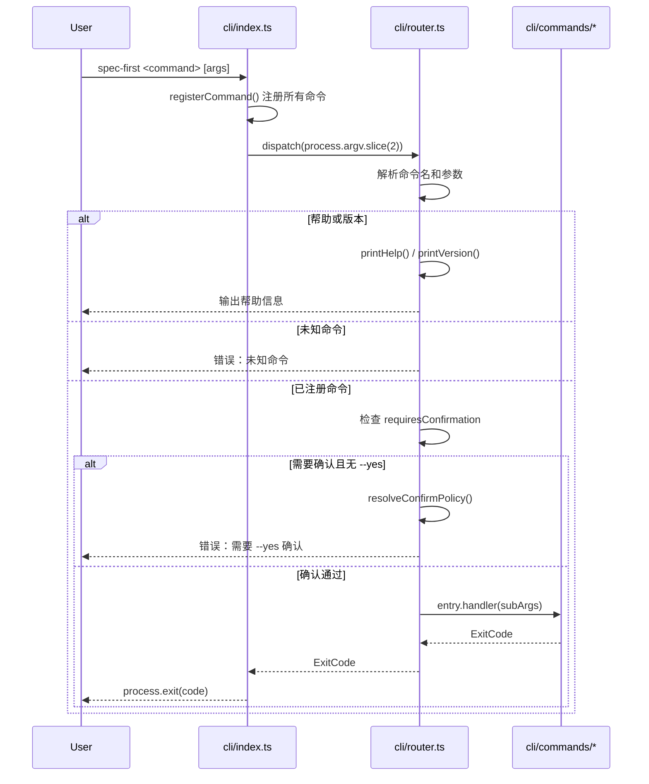
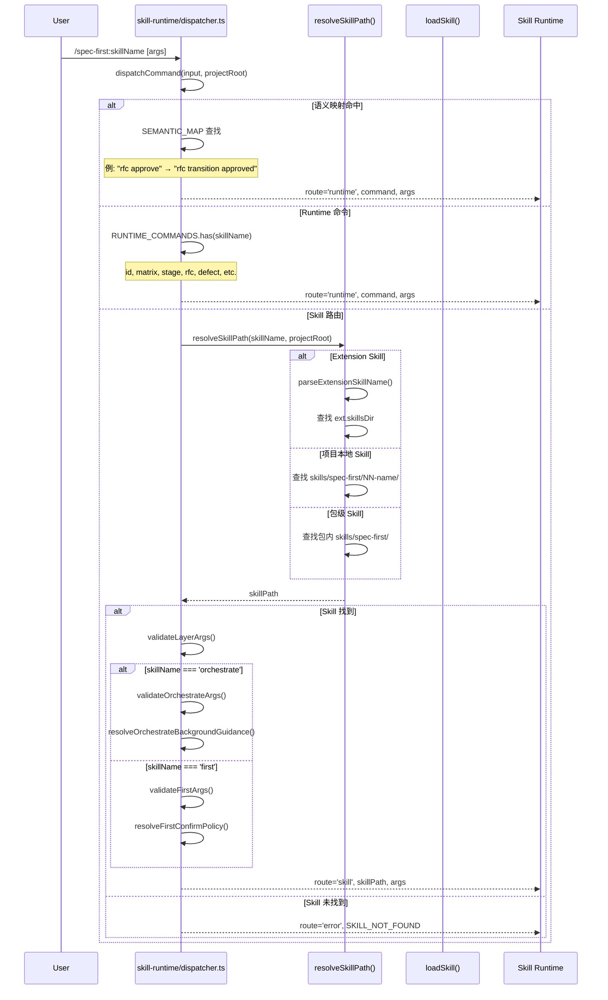
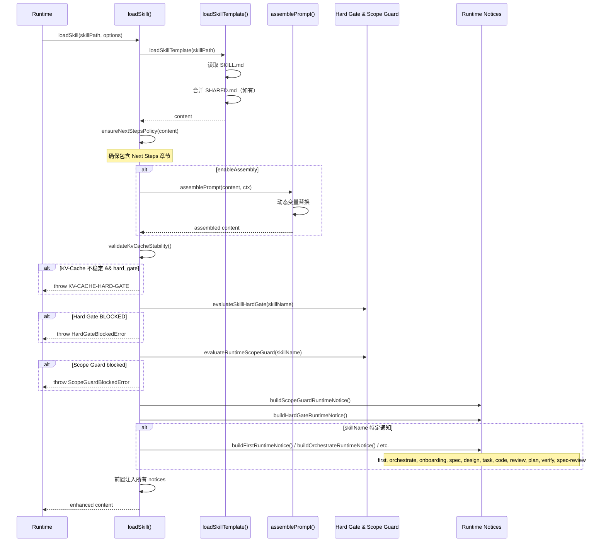
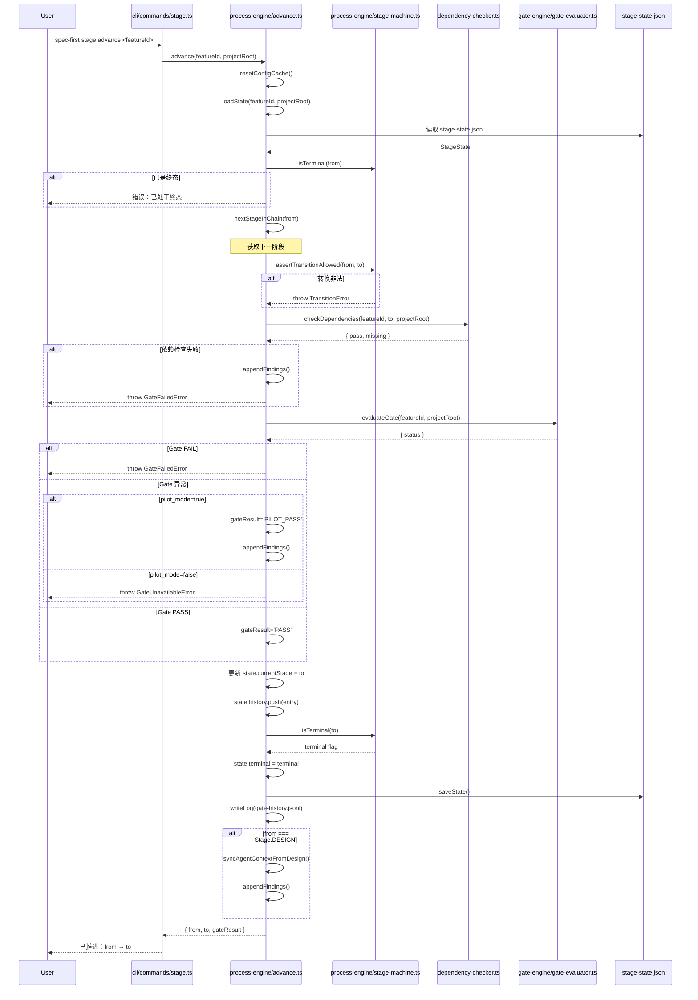
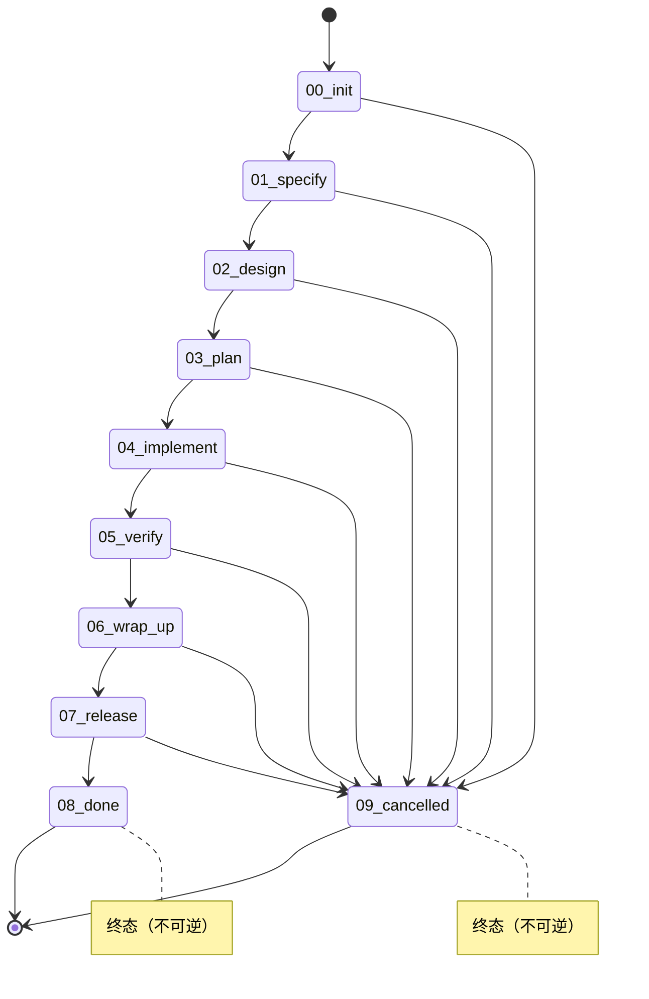
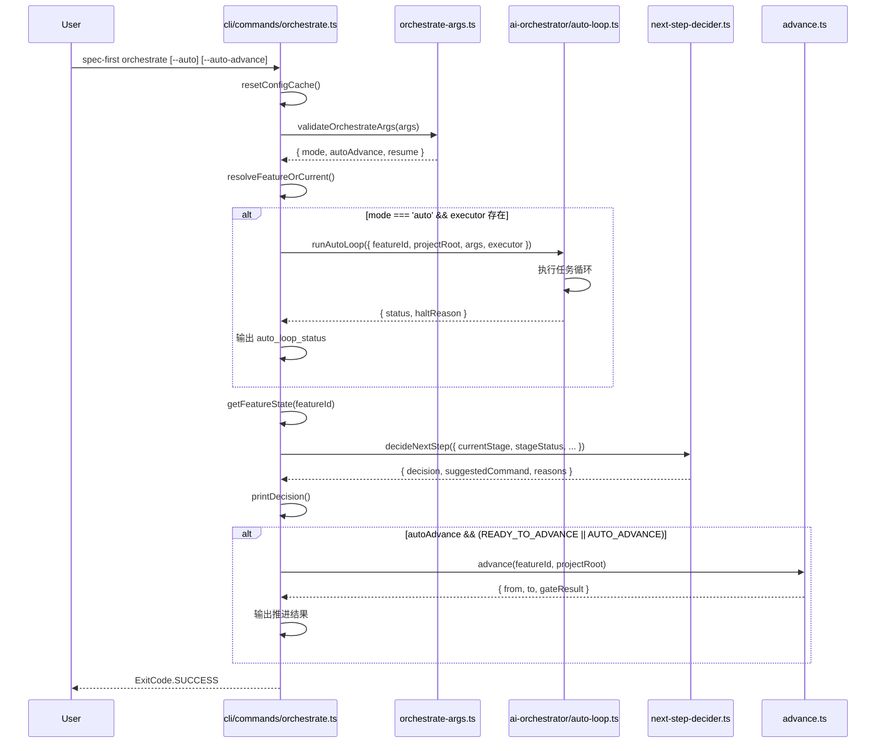

# 调用链分析

> **模式**: deep
> **生成时间**: 2026-03-09
> **分析范围**: CLI 命令执行、Skill 分发、阶段状态机

---

## 1. CLI 命令执行流程

### 1.1 入口到路由分发



**证据源**:
- `src/cli/index.ts:83` - `dispatch(process.argv.slice(2))`
- `src/cli/router.ts:68-105` - `dispatch()` 函数实现
- `src/cli/router.ts:28-35` - `registerCommand()` 注册逻辑

---

## 2. Skill 分发流程（三层路由）

### 2.1 Skill 命令解析与路由



**证据源**:
- `src/core/skill-runtime/dispatcher.ts:219-326` - `dispatchCommand()` 主流程
- `src/core/skill-runtime/dispatcher.ts:41-47` - `SEMANTIC_MAP` 语义映射表
- `src/core/skill-runtime/dispatcher.ts:50-54` - `RUNTIME_COMMANDS` 集合
- `src/core/skill-runtime/dispatcher.ts:332-362` - `resolveSkillPath()` 三层查找

### 2.2 Skill 加载与增强



**证据源**:
- `src/core/skill-runtime/dispatcher.ts:384-511` - `loadSkill()` 完整流程
- `src/core/skill-runtime/dispatcher.ts:942-959` - `loadSkillTemplate()` 模板加载
- `src/core/skill-runtime/dispatcher.ts:60-70` - `ensureNextStepsPolicy()` 策略注入
- `src/core/skill-runtime/dispatcher.ts:413-421` - Hard Gate 校验
- `src/core/skill-runtime/dispatcher.ts:418-421` - Scope Guard 校验
- `src/core/skill-runtime/dispatcher.ts:433-510` - 各 Skill 专属 Runtime Notice 构建

---

## 3. 阶段状态机流程

### 3.1 阶段推进（stage advance）



**证据源**:
- `src/cli/commands/stage.ts:189-217` - `handleAdvance()` 入口
- `src/core/process-engine/advance.ts:107-205` - `advance()` 完整流程
- `src/core/process-engine/stage-machine.ts:30-38` - `assertTransitionAllowed()` 转换校验
- `src/core/process-engine/advance.ts:126-133` - 依赖检查逻辑
- `src/core/process-engine/advance.ts:135-173` - Gate 校验与降级策略
- `src/core/process-engine/advance.ts:194-202` - Design 阶段特殊处理

### 3.2 阶段状态机转换规则



**证据源**:
- `src/core/process-engine/stage-machine.ts:8-17` - `TRANSITIONS` 转换表定义
- `src/shared/types.ts` - `Stage` 枚举定义
- `src/core/process-engine/stage-machine.ts:41-44` - `isTerminal()` 终态判断

---

## 4. Orchestrate 编排流程

### 4.1 Orchestrate 命令执行



**证据源**:
- `src/cli/commands/orchestrate.ts:52-112` - `handleOrchestrate()` 完整流程
- `src/core/skill-runtime/orchestrate-args.ts` - `validateOrchestrateArgs()` 参数校验
- `src/cli/commands/orchestrate.ts:64-74` - Auto Loop 执行分支
- `src/cli/commands/orchestrate.ts:92-97` - Auto Advance 执行分支

---

## 5. 关键数据流

### 5.1 Feature 状态数据流

```
specs/<featureId>/
├── stage-state.json          ← 阶段状态（currentStage, history, terminal）
├── gate-history.jsonl        ← Gate 评估历史
├── findings.md               ← 问题发现记录
├── spec.md                   ← 需求规范
├── design.md                 ← 设计文档
├── traceability-matrix.md    ← 追溯矩阵
└── ...
```

**读写路径**:
- `advance.ts:45-55` - 状态文件路径解析
- `advance.ts:57-61` - `loadState()` 读取
- `advance.ts:99-101` - `saveState()` 写入
- `advance.ts:185-192` - `writeLog()` 追加日志

### 5.2 配置加载与缓存

```
项目根目录/
├── .spec-first/
│   ├── config.yml            ← 主配置文件
│   └── current               ← 当前 Feature ID
└── specs/
    └── <featureId>/
        └── stage-state.json
```

**配置流程**:
1. `config-schema.ts` - `loadConfig()` 读取并校验
2. `resetConfigCache()` - 清除缓存（在关键操作前调用）
3. 配置影响：`pilot_mode`, `kv_cache_hard_gate`, `auto_advance_policy` 等

**证据源**:
- `src/cli/commands/stage.ts:16` - `resetConfigCache()` 调用
- `src/core/process-engine/advance.ts:112` - advance 前重置缓存
- `src/core/process-engine/advance.ts:148-158` - pilot_mode 降级策略

---

## 6. 循环依赖检测

**分析结果**: 未检测到循环依赖。

**模块依赖层级**:
```
cli/
  ├─→ cli/router.ts
  └─→ cli/commands/*.ts
       ├─→ core/process-engine/*
       ├─→ core/skill-runtime/*
       ├─→ core/gate-engine/*
       └─→ shared/*

core/skill-runtime/
  ├─→ core/process-engine/*
  ├─→ core/gate-engine/*
  └─→ shared/*

core/process-engine/
  ├─→ core/gate-engine/*
  ├─→ core/tool-integration/*
  └─→ shared/*

core/gate-engine/
  └─→ shared/*

shared/
  └─→ (无依赖)
```

**依赖原则**: 自底向上单向依赖，`shared/` 为最底层，`cli/` 为最顶层。

---

## 7. 关键调用路径汇总

### 7.1 用户命令 → 阶段推进

```
用户输入: spec-first stage advance FEAT-001
  ↓
cli/index.ts:83 dispatch()
  ↓
cli/router.ts:68 dispatch() → 查找 'stage' 命令
  ↓
cli/commands/stage.ts:189 handleAdvance()
  ↓
core/process-engine/advance.ts:107 advance()
  ├─→ stage-machine.ts:30 assertTransitionAllowed()
  ├─→ dependency-checker.ts checkDependencies()
  ├─→ gate-engine/gate-evaluator.ts evaluateGate()
  └─→ fs-utils.ts writeJson() 保存状态
```

### 7.2 Skill 命令 → 加载执行

```
用户输入: /spec-first:code
  ↓
skill-runtime/dispatcher.ts:219 dispatchCommand()
  ↓
dispatcher.ts:332 resolveSkillPath() → 查找 SKILL.md
  ↓
dispatcher.ts:384 loadSkill()
  ├─→ dispatcher.ts:942 loadSkillTemplate() 读取模板
  ├─→ prompt-assembler.ts assemblePrompt() 动态组装
  ├─→ hard-gate.ts evaluateSkillHardGate() 校验
  ├─→ scope-guard.ts evaluateRuntimeScopeGuard() 校验
  └─→ dispatcher.ts:717 buildCodeRuntimeNotice() 注入上下文
```

### 7.3 Orchestrate 自动编排

```
用户输入: spec-first orchestrate --auto --auto-advance
  ↓
cli/commands/orchestrate.ts:52 handleOrchestrate()
  ├─→ orchestrate-args.ts validateOrchestrateArgs()
  ├─→ ai-orchestrator/auto-loop.ts runAutoLoop() [如 --auto]
  ├─→ next-step-decider.ts decideNextStep()
  └─→ advance.ts advance() [如 --auto-advance 且决策允许]
```

---

## 8. 性能关键路径

### 8.1 热路径识别

1. **命令分发**: `router.ts:dispatch()` - 每次命令执行必经
2. **状态加载**: `advance.ts:loadState()` - 频繁读取 JSON
3. **Skill 解析**: `dispatcher.ts:resolveSkillPath()` - 目录扫描
4. **配置加载**: `config-schema.ts:loadConfig()` - YAML 解析

### 8.2 优化建议

- **配置缓存**: 已实现 `resetConfigCache()`，避免重复解析
- **Skill 路径缓存**: 可考虑缓存 `resolveSkillPath()` 结果
- **状态读取**: 考虑增量更新而非全量读写

---

## 9. 错误处理链路

### 9.1 异常类型层级

```
Error (基类)
├── TransitionError (stage-machine.ts)
├── GateFailedError (advance.ts)
├── GateUnavailableError (advance.ts)
├── HardGateBlockedError (hard-gate.ts)
├── ScopeGuardBlockedError (scope-guard.ts)
└── OrchestrateArgsError (orchestrate-args.ts)
```

### 9.2 错误传播路径

```
核心模块抛出异常
  ↓
CLI 命令 handler catch
  ↓
返回对应 ExitCode
  ↓
router.ts:dispatch() 统一处理
  ↓
process.exit(code)
```

**证据源**:
- `src/cli/router.ts:98-104` - 统一错误捕获
- `src/cli/commands/stage.ts:206-217` - Stage 命令错误处理
- `src/cli/commands/orchestrate.ts:100-111` - Orchestrate 命令错误处理

---

## 附录：分析方法

**分析工具**: 静态代码分析 + 文件读取
**覆盖范围**: 19 个 CLI 命令、核心引擎模块、Skill 运行时
**证据标注**: 所有关键调用均标注文件路径和行号
**验证方式**: 交叉验证函数调用关系、参数传递、状态变更

**局限性**:
- 未包含运行时动态加载的 Extension Skill
- 未分析 AI Orchestrator 内部循环逻辑细节
- 未覆盖所有边缘错误处理分支
