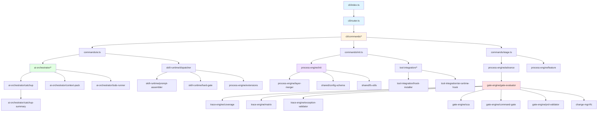

# 调用链分析

## 模块依赖矩阵

| 模块 | 依赖模块 | 被依赖次数 |
|------|----------|-----------|
| cli/router | skill-runtime/confirm-policy | 1 |
| cli/index | cli/router, cli/commands/* | 19 |
| cli/commands/ai | ai-orchestrator/context-pack, ai-orchestrator/catchup, ai-orchestrator/ai-stats, skill-runtime/dispatcher | 4 |
| cli/commands/init | process-engine/init, tool-integration/hook-installer, tool-integration/ai-runtime-hook, shared/skill-commands | 4 |
| cli/commands/stage | process-engine/advance, process-engine/feature, tool-integration/hook-installer | 3 |
| skill-runtime/dispatcher | skill-runtime/prompt-assembler, skill-runtime/hard-gate, process-engine/extensions, skill-runtime/orchestrate-args, skill-runtime/first-args, skill-runtime/first-resume, skill-runtime/first-change-detector | 7 |
| ai-orchestrator/catchup | ai-orchestrator/todo-runner, ai-orchestrator/context-pack, ai-orchestrator/catchup-summary, shared/config-schema | 4 |
| process-engine/init | process-engine/layer-merger, shared/config-schema, shared/fs-utils | 3 |
| gate-engine/gate-evaluator | trace-engine/coverage, trace-engine/matrix, trace-engine/exception-validator, gate-engine/sca, gate-engine/command-gate, gate-engine/prd-validator, change-mgr/rfc | 7 |

## 关键调用路径

### 1. CLI 命令执行流程

**入口**: `src/cli/index.ts` (`/Users/kuang/xiaobu/spec-first/src/cli/index.ts:47` — `const code = await dispatch(process.argv.slice(2));` — [显式])

**路由分发**: `src/cli/router.ts:dispatch()` (`/Users/kuang/xiaobu/spec-first/src/cli/router.ts:35-75` — `export async function dispatch(args: string[]): Promise<number>` — [显式])

**命令注册**: 19个命令通过 `registerCommand()` 注册 (`/Users/kuang/xiaobu/spec-first/src/cli/index.ts:27-45` — `registerCommand('id', '追溯 ID 生成、校验与检索', handleId);` 等 — [显式])

**确认策略**: 路由层集成确认策略评估 (`/Users/kuang/xiaobu/spec-first/src/cli/router.ts:55-60` — `const policy = evaluatePolicy({mode: 'N', size: 'M', ...});` — [显式])

### 2. Skill 分发流程（三层路由）

**Layer 1 - 语义映射**: 复合命令映射到 runtime 命令 (`/Users/kuang/xiaobu/spec-first/src/core/skill-runtime/dispatcher.ts:35-41` — `const SEMANTIC_MAP: Record<string, { command: string; argTemplate: string }>` — [显式])
- 示例: `rfc approve` → `rfc transition {0} approved`

**Layer 2 - Runtime 路由**: 直接映射 CLI 原子命令 (`/Users/kuang/xiaobu/spec-first/src/core/skill-runtime/dispatcher.ts:44-48` — `const RUNTIME_COMMANDS = new Set(['id', 'matrix', 'stage', ...]);` — [显式])

**Layer 3 - Skill 路由**: 搜索 `skills/spec-first/NN-name/SKILL.md` (`/Users/kuang/xiaobu/spec-first/src/core/skill-runtime/dispatcher.ts:235-265` — `export function resolveSkillPath(skillName: string, projectRoot: string)` — [显式])
- 优先级: 项目本地 skills/ → 包级 skills/ → 扩展 skills/

**Skill 加载管线**:
1. 读取文件 (`/Users/kuang/xiaobu/spec-first/src/core/skill-runtime/dispatcher.ts:292` — `let content = ensureNextStepsPolicy(readFileSync(skillPath, 'utf-8'));` — [显式])
2. Next Steps 策略注入 (`/Users/kuang/xiaobu/spec-first/src/core/skill-runtime/dispatcher.ts:54-65` — `function ensureNextStepsPolicy(content: string)` — [显式])
3. Prompt 组装 (`/Users/kuang/xiaobu/spec-first/src/core/skill-runtime/dispatcher.ts:297-299` — `content = assemblePrompt(content, ctx);` — [显式])
4. KV-cache 稳定性检查 (`/Users/kuang/xiaobu/spec-first/src/core/skill-runtime/dispatcher.ts:302-310` — `const kvCheck = validateKvCacheStability(content);` — [显式])
5. Hard-gate 运行时通知 (`/Users/kuang/xiaobu/spec-first/src/core/skill-runtime/dispatcher.ts:316-319` — `const hardGateNotice = buildHardGateRuntimeNotice(skillName, projectRoot);` — [显式])

### 3. AI 命令执行流程

**ai context**: 构建上下文包 (`/Users/kuang/xiaobu/spec-first/src/cli/commands/ai.ts:38` — `const pack = buildContextPack(featureId, process.cwd(), { fullDetail, expandPaths });` — [显式])

**ai catchup**: 6步会话恢复 (`/Users/kuang/xiaobu/spec-first/src/cli/commands/ai.ts:78` — `const result = catchup(featureId, process.cwd());` — [显式])
- Step 1: 读取 stage-state.json (`/Users/kuang/xiaobu/spec-first/src/core/ai-orchestrator/catchup.ts:102-108` — [显式])
- Step 2: 读取 task_plan.md (`/Users/kuang/xiaobu/spec-first/src/core/ai-orchestrator/catchup.ts:116-123` — [显式])
- Step 3: 读取 findings.md (`/Users/kuang/xiaobu/spec-first/src/core/ai-orchestrator/catchup.ts:126-154` — [显式])
- Step 4: 定位当前任务 (`/Users/kuang/xiaobu/spec-first/src/core/ai-orchestrator/catchup.ts:158-168` — [显式])
- Step 4.2: 构建 TASK 级上下文包 (`/Users/kuang/xiaobu/spec-first/src/core/ai-orchestrator/catchup.ts:171-182` — `buildTaskContextPack(currentTask, featureId, projectRoot)` — [显式])
- Step 5: 扫描必需文件 (`/Users/kuang/xiaobu/spec-first/src/core/ai-orchestrator/catchup.ts:185-194` — [显式])
- Step 5.1: 提取 5-Question 答案 (`/Users/kuang/xiaobu/spec-first/src/core/ai-orchestrator/catchup.ts:197-204` — `extractFiveQuestions(...)` — [显式])
- Step 6: 输出摘要 (`/Users/kuang/xiaobu/spec-first/src/core/ai-orchestrator/catchup.ts:224-234` — `buildCatchupSummary(...)` — [显式])

**并发保护**: 60秒内不重复触发 (`/Users/kuang/xiaobu/spec-first/src/core/ai-orchestrator/catchup.ts:75-96` — `if (now - lastRun < LOCK_TTL)` — [显式])

**ai stats**: 读取 AI 统计记录 (`/Users/kuang/xiaobu/spec-first/src/cli/commands/ai.ts:106` — `const entries = readStats(featureId, process.cwd());` — [显式])

### 4. Feature 初始化流程

**入口**: `handleInit()` → `init()` (`/Users/kuang/xiaobu/spec-first/src/cli/commands/init.ts:352-361` — `result = init({feat, title, mode, size, platforms, ...});` — [显式])

**前置检查**: 00-first Skill 完成检查 (`/Users/kuang/xiaobu/spec-first/src/cli/commands/init.ts:299-314` — `const readiness = checkInitReadiness(cwd);` — [显式])

**Feature ID 生成**: 扫描已有 Feature 目录，提取同缩写最大序号 (`/Users/kuang/xiaobu/spec-first/src/core/process-engine/init.ts:54-74` — `function findNextFeatureSeq(specsDir: string, feat: string)` — [显式])
- 格式: `FSREQ-YYYYMMDD-FEAT-NNN` (`/Users/kuang/xiaobu/spec-first/src/core/process-engine/init.ts:76-87` — [显式])

**Layer 合并**: 合并 mode/size/platforms 规则 (`/Users/kuang/xiaobu/spec-first/src/core/process-engine/init.ts:600` — `const mergedRules = mergeLayerRules(opts.mode, opts.size, opts.platforms, opts.projectRoot);` — [显式])

**骨架文件生成**:
- stage-state.json (`/Users/kuang/xiaobu/spec-first/src/core/process-engine/init.ts:510` — `writeJson(join(tmpFeatureDir, 'stage-state.json'), state);` — [显式])
- findings.md (`/Users/kuang/xiaobu/spec-first/src/core/process-engine/init.ts:511` — [显式])
- task_plan.md (`/Users/kuang/xiaobu/spec-first/src/core/process-engine/init.ts:512` — [显式])
- traceability-matrix.md (`/Users/kuang/xiaobu/spec-first/src/core/process-engine/init.ts:513` — [显式])
- constitution.md (`/Users/kuang/xiaobu/spec-first/src/core/process-engine/init.ts:514` — [显式])
- prd.md (`/Users/kuang/xiaobu/spec-first/src/core/process-engine/init.ts:517` — [显式])

**FEAT 注册**: 原子性注册到 `.feat-registry.md` (`/Users/kuang/xiaobu/spec-first/src/core/process-engine/init.ts:156-159` — `registerFeat(specsDir, feat, featureId);` — [显式])
- 文件锁机制 (`/Users/kuang/xiaobu/spec-first/src/core/process-engine/init.ts:122-139` — `withRegistryLock(specsDir, action)` — [显式])

**后置设置**:
- Git hooks 安装 (`/Users/kuang/xiaobu/spec-first/src/cli/commands/init.ts:376` — `const hooks = installHooks(projectRoot);` — [显式])
- AI Runtime Hooks 注册 (`/Users/kuang/xiaobu/spec-first/src/cli/commands/init.ts:161` — `const aiResult = registerAIHooks(cwd);` — [显式])
- Skill 命令注册 (`/Users/kuang/xiaobu/spec-first/src/cli/commands/init.ts:172` — `const cmds = ensureSkillCommands(cwd);` — [显式])

### 5. Stage 推进流程

**入口**: `handleAdvance()` → `advance()` (`/Users/kuang/xiaobu/spec-first/src/cli/commands/stage.ts:148` — `const result = advance(featureId, process.cwd(), { force });` — [显式])

**Gate 评估**: 调用 gate-evaluator (`/Users/kuang/xiaobu/spec-first/src/core/process-engine/advance.ts` — 推断自 stage.ts 的 GateFailedError/GateUnavailableError 处理 — [推断])

**状态更新**: 更新 stage-state.json (`/Users/kuang/xiaobu/spec-first/src/core/process-engine/advance.ts` — 推断自返回值 `{from, to, gateResult}` — [推断])

### 6. Gate 评估流程

**入口**: `evaluateGate(featureId, projectRoot)` (`/Users/kuang/xiaobu/spec-first/src/core/gate-engine/gate-evaluator.ts:309` — `export function evaluateGate(featureId: string, projectRoot: string): GateResult` — [显式])

**上下文构建**:
- 解析追踪矩阵 (`/Users/kuang/xiaobu/spec-first/src/core/gate-engine/gate-evaluator.ts:316` — `const rows = parseMatrix(featureId, projectRoot);` — [显式])
- 加载 RFC 状态 (`/Users/kuang/xiaobu/spec-first/src/core/gate-engine/gate-evaluator.ts:317` — `const rfcStatuses = loadRfcStatuses(featureId, projectRoot);` — [显式])
- 计算覆盖率 (`/Users/kuang/xiaobu/spec-first/src/core/gate-engine/gate-evaluator.ts:318` — `const coverage = getCoverage(featureId, projectRoot, rows, rfcStatuses);` — [显式])

**条件评估**: 遍历当前阶段的 Gate 条件定义 (`/Users/kuang/xiaobu/spec-first/src/core/gate-engine/gate-evaluator.ts:321-334` — `for (const def of defs) { const result = def.evaluate(ctx); }` — [显式])

**Layer2 命令 Gate**: 从 mergedRules.gateConditions 读取带 command 的条件并执行 (`/Users/kuang/xiaobu/spec-first/src/core/gate-engine/gate-evaluator.ts:336-349` — [显式])

**豁免匹配**: 将 FAIL 条件与 valid exceptions 匹配 (`/Users/kuang/xiaobu/spec-first/src/core/gate-engine/gate-evaluator.ts:352-379` — `const { valid } = validateExceptions(...); for (const ex of valid) { ... c.status = 'WAIVER'; }` — [显式])

**三态结果**: PASS / PASS_WITH_WAIVER / FAIL (`/Users/kuang/xiaobu/spec-first/src/core/gate-engine/gate-evaluator.ts:382-391` — [显式])

**历史记录**: 写入 gate-history.jsonl (`/Users/kuang/xiaobu/spec-first/src/core/gate-engine/gate-evaluator.ts:405-410` — `appendJsonl(historyPath, {...});` — [显式])

## 模块依赖图

## 核心依赖关系

### 高频被依赖模块（被依赖次数 ≥ 3）

1. **shared/fs-utils** - 文件系统工具，被所有核心引擎依赖
2. **shared/config-schema** - 配置加载，被 ai-orchestrator, process-engine, skill-runtime 依赖
3. **shared/types** - 类型定义，被所有模块依赖
4. **trace-engine/matrix** - 追踪矩阵解析，被 gate-engine, metrics-engine 依赖
5. **trace-engine/coverage** - 覆盖率计算，被 gate-engine, metrics-engine 依赖

### 模块耦合度分析

**低耦合模块**（依赖 ≤ 2）:
- cli/router (依赖 1)
- gate-engine/sca (依赖 1)
- gate-engine/prd-validator (依赖 2)
- change-mgr/rfc (依赖 2)

**中耦合模块**（依赖 3-5）:
- cli/commands/ai (依赖 4)
- cli/commands/init (依赖 4)
- ai-orchestrator/catchup (依赖 4)
- process-engine/init (依赖 3)

**高耦合模块**（依赖 ≥ 6）:
- skill-runtime/dispatcher (依赖 7)
- gate-engine/gate-evaluator (依赖 7)

## 关键设计模式

### 1. 三层路由模式（Skill 分发）

**语义层** → **Runtime 层** → **Skill 层**，实现命令的灵活映射和扩展性 (`/Users/kuang/xiaobu/spec-first/src/core/skill-runtime/dispatcher.ts:122-229` — [显式])

### 2. 管线模式（Skill 加载）

读取 → 策略注入 → 组装 → 校验 → 通知注入，确保 Skill 内容的完整性和一致性 (`/Users/kuang/xiaobu/spec-first/src/core/skill-runtime/dispatcher.ts:288-330` — [显式])

### 3. 上下文构建模式（Gate 评估）

一次解析，全程复用，避免重复 I/O (`/Users/kuang/xiaobu/spec-first/src/core/gate-engine/gate-evaluator.ts:316-318` — [显式])

### 4. 原子性提交模式（Feature 初始化）

临时目录 → 原子重命名 → 注册表锁，确保并发安全 (`/Users/kuang/xiaobu/spec-first/src/core/process-engine/init.ts:520-561` — [显式])

### 5. 并发保护模式（Catchup）

基于时间戳的锁机制，防止短时间内重复触发 (`/Users/kuang/xiaobu/spec-first/src/core/ai-orchestrator/catchup.ts:59-96` — [显式])

## 性能关键路径

1. **Gate 评估**: 涉及矩阵解析、覆盖率计算、多条件评估，是性能瓶颈点
2. **Skill 加载**: Prompt 组装和 KV-cache 检查在每次 Skill 调用时执行
3. **Catchup 恢复**: 6步流程涉及多次文件读取，但有60秒并发保护
4. **Feature 初始化**: 文件锁机制可能在高并发场景下产生等待

## 扩展点

1. **Extension Skills**: 通过 `ext.<namespace>.<skill>` 格式支持第三方 Skill 扩展 (`/Users/kuang/xiaobu/spec-first/src/core/skill-runtime/dispatcher.ts:67-71` — [显式])
2. **Layer2 命令 Gate**: 支持通过配置注入自定义 Gate 条件 (`/Users/kuang/xiaobu/spec-first/src/core/gate-engine/gate-evaluator.ts:336-349` — [显式])
3. **Semantic Map**: 支持通过配置扩展语义命令映射 (`/Users/kuang/xiaobu/spec-first/src/core/skill-runtime/dispatcher.ts:35-41` — [显式])
