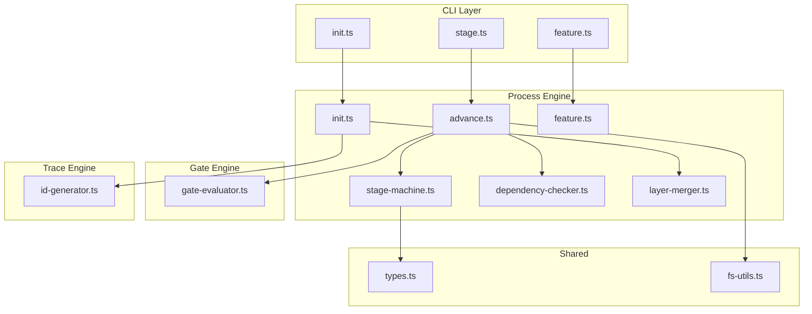
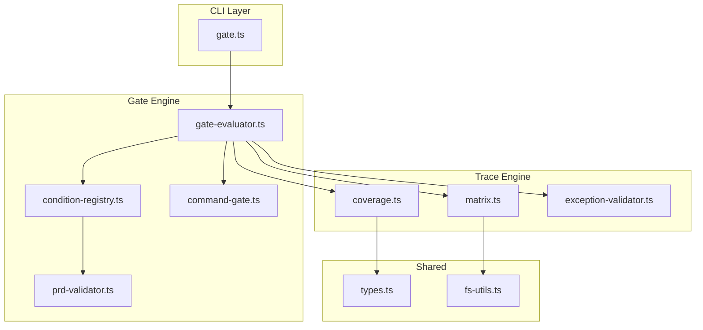
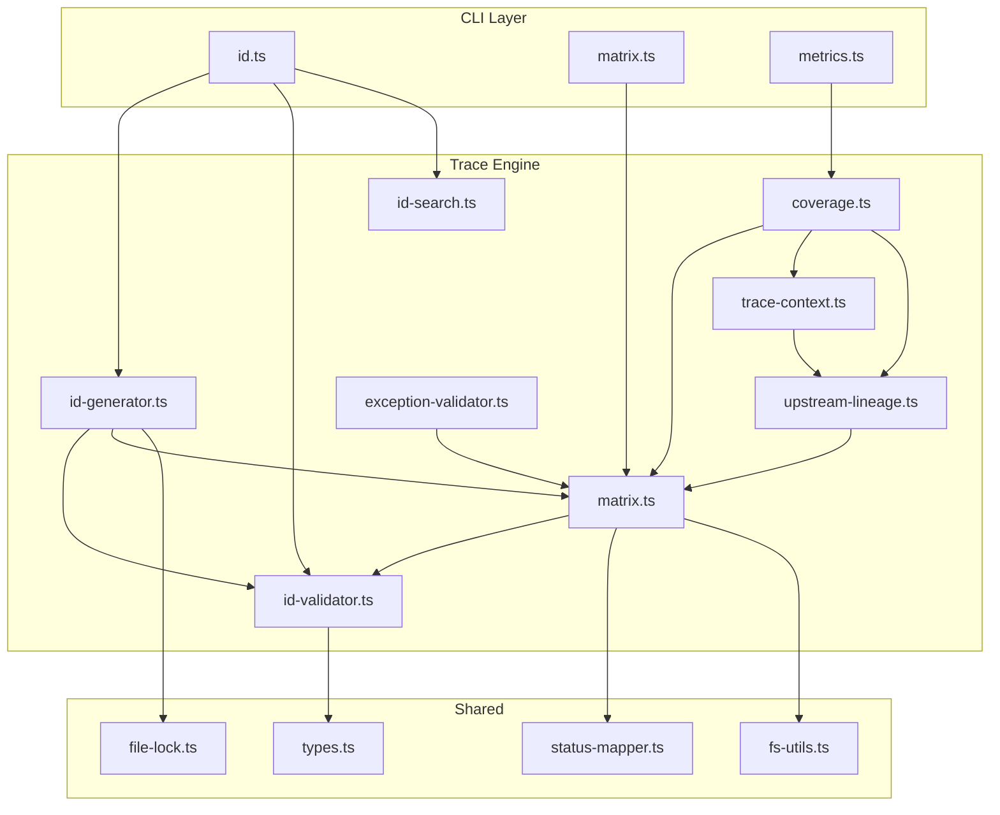
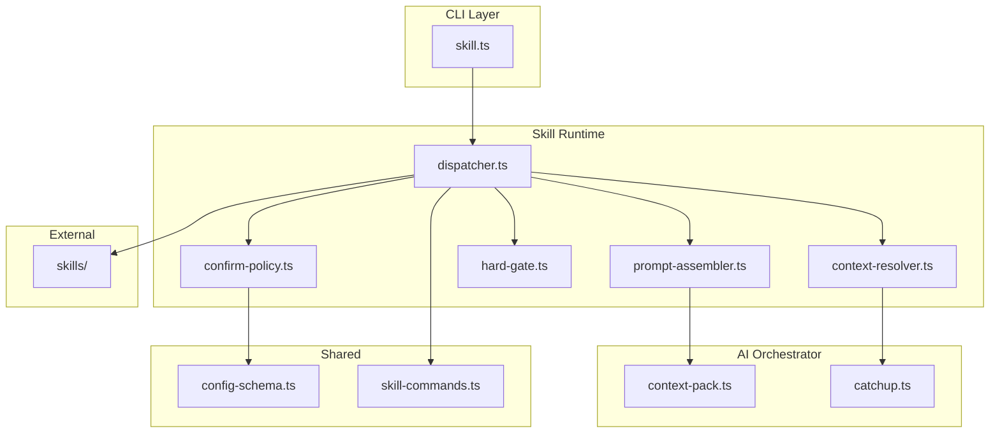
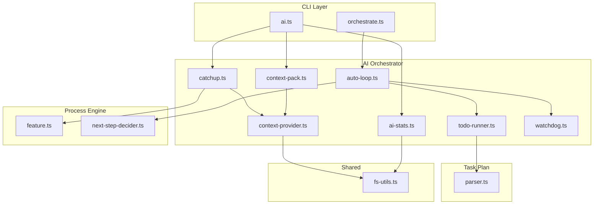
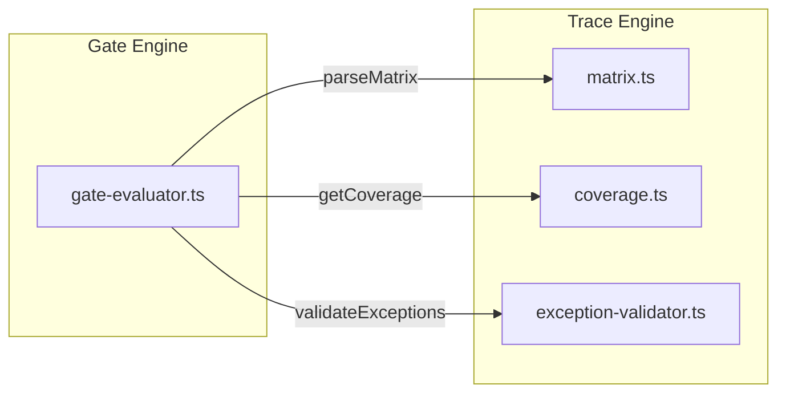
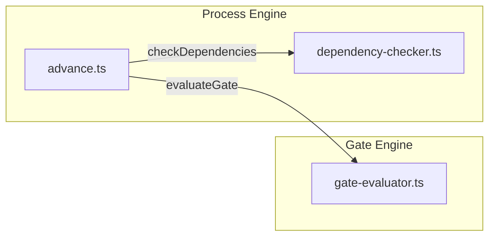
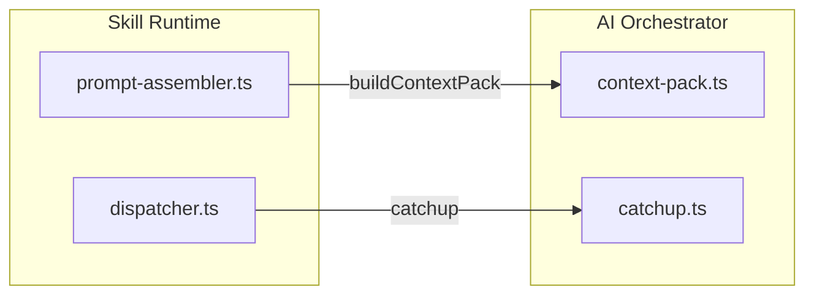

# 调用图与模块依赖

> 本文档描述 spec-first 项目的模块依赖关系、关键集成点和跨模块调用链路。
> 生成时间: 2026-03-20 | 版本: 1.1.4

---

## 架构层次

项目采用四层架构，依赖方向为单向向下：

```
┌─────────────────────────────────────────────────────────────┐
│                     CLI Layer (入口层)                        │
│                   src/cli/ (30 files)                        │
│                  用户交互与命令分发                             │
└─────────────────────────────────────────────────────────────┘
                              │
                              ▼
┌─────────────────────────────────────────────────────────────┐
│                    Core Layer (核心层)                        │
│                   src/core/ (103 files)                      │
│                   业务逻辑与领域引擎                            │
│                                                               │
│  ┌─────────────┐ ┌─────────────┐ ┌─────────────┐            │
│  │process-engine│ │gate-engine │ │trace-engine │            │
│  └─────────────┘ └─────────────┘ └─────────────┘            │
│  ┌─────────────┐ ┌─────────────┐ ┌─────────────┐            │
│  │skill-runtime│ │ai-orchestrator│ │change-mgr │            │
│  └─────────────┘ └─────────────┘ └─────────────┘            │
│  ┌─────────────┐ ┌─────────────┐ ┌─────────────┐            │
│  │metrics-engine│ │validators │ │batch-executor│            │
│  └─────────────┘ └─────────────┘ └─────────────┘            │
└─────────────────────────────────────────────────────────────┘
                              │
                              ▼
┌─────────────────────────────────────────────────────────────┐
│                   Shared Layer (共享层)                       │
│                   src/shared/ (13 files)                     │
│                  类型定义、工具函数、配置                        │
└─────────────────────────────────────────────────────────────┘
                              │
                              ▼
┌─────────────────────────────────────────────────────────────┐
│                   Config Layer (配置层)                       │
│                   src/config/ (2 files)                      │
│                    启动配置与清单                              │
└─────────────────────────────────────────────────────────────┘
```

### 依赖规则

| 层级 | 可导入 | 禁止导入 | 证据 |
|------|--------|----------|------|
| CLI Layer | Core, Shared | Config | `src/cli/commands/*.ts` — [显式] |
| Core Layer | Shared | CLI | `src/core/*/` — [显式] |
| Shared Layer | 无 | CLI, Core | `src/shared/types.ts` — [显式] |
| Config Layer | Shared | CLI, Core | `src/config/` — [推断] |

---

## 核心模块依赖图

### Process Engine 依赖关系



**关键调用链** (`src/core/process-engine/` — [显式]):

- `advance.ts` → `stage-machine.ts`: 校验阶段转换合法性
- `advance.ts` → `dependency-checker.ts`: 检查阶段依赖
- `advance.ts` → `gate-engine/gate-evaluator.ts`: 执行 Gate 校验
- `init.ts` → `layer-merger.ts`: 合并 Layer 规则
- `init.ts` → `trace-engine/id-generator.ts`: 生成 Feature ID

---

### Gate Engine 依赖关系



**关键调用链** (`src/core/gate-engine/` — [显式]):

- `gate-evaluator.ts` → `condition-registry.ts`: 获取 Gate 条件定义
- `gate-evaluator.ts` → `trace-engine/matrix.ts`: 解析追踪矩阵
- `gate-evaluator.ts` → `trace-engine/coverage.ts`: 计算覆盖率
- `gate-evaluator.ts` → `trace-engine/exception-validator.ts`: 验证豁免
- `gate-evaluator.ts` → `command-gate.ts`: 执行 Layer2 命令 Gate

---

### Trace Engine 依赖关系



**关键调用链** (`src/core/trace-engine/` — [显式]):

- `id-generator.ts` → `id-validator.ts`: 校验 ID 格式
- `id-generator.ts` → `matrix.ts`: 追加新 ID 到矩阵
- `id-generator.ts` → `file-lock.ts`: 获取文件锁
- `coverage.ts` → `matrix.ts`: 解析矩阵数据
- `coverage.ts` → `trace-context.ts`: 创建追踪上下文
- `coverage.ts` → `upstream-lineage.ts`: 计算上游血统
- `matrix.ts` → `status-mapper.ts`: 标准化状态值

---

### Skill Runtime 依赖关系



**关键调用链** (`src/core/skill-runtime/` — [显式]):

- `dispatcher.ts` → `prompt-assembler.ts`: 组装 Skill Prompt
- `dispatcher.ts` → `context-resolver.ts`: 解析上下文
- `dispatcher.ts` → `hard-gate.ts`: 执行 Hard Gate 校验
- `dispatcher.ts` → `skills/`: 加载 SKILL.md 文件
- `prompt-assembler.ts` → `ai-orchestrator/context-pack.ts`: 构建上下文包
- `confirm-policy.ts` → `config-schema.ts`: 加载配置

---

### AI Orchestrator 依赖关系



**关键调用链** (`src/core/ai-orchestrator/` — [显式]):

- `catchup.ts` → `context-provider.ts`: 提供上下文
- `catchup.ts` → `process-engine/feature.ts`: 读取 Feature 状态
- `context-pack.ts` → `context-provider.ts`: 收集上下文
- `auto-loop.ts` → `todo-runner.ts`: 执行 Todo 任务
- `auto-loop.ts` → `watchdog.ts`: 监控执行
- `auto-loop.ts` → `process-engine/next-step-decider.ts`: 决策下一步

---

## 跨模块调用关系

### CLI → Core 调用映射

| CLI 命令文件 | 调用的 Core 模块 | 核心函数 | 证据 |
|-------------|-----------------|----------|------|
| `id.ts` | `trace-engine/id-generator` | `nextId()` | `src/cli/commands/id.ts:91-99` — [显式] |
| `id.ts` | `trace-engine/id-validator` | `validateId()` | `src/cli/commands/id.ts` — [显式] |
| `id.ts` | `trace-engine/id-search` | `searchId()`, `listIds()` | `src/cli/commands/id.ts` — [显式] |
| `matrix.ts` | `trace-engine/matrix` | `checkMatrix()`, `exportMatrix()`, `updateMatrixRow()` | `src/cli/commands/matrix.ts` — [显式] |
| `init.ts` | `process-engine/init` | `init()` | `src/cli/commands/init.ts` — [显式] |
| `stage.ts` | `process-engine/advance` | `advance()`, `cancel()` | `src/cli/commands/stage.ts:211-239` — [显式] |
| `stage.ts` | `process-engine/feature` | `currentFeature()`, `getFeatureState()` | `src/cli/commands/stage.ts` — [显式] |
| `gate.ts` | `gate-engine/gate-evaluator` | `evaluateGate()`, `getConditions()` | `src/cli/commands/gate.ts` — [显式] |
| `rfc.ts` | `change-mgr/rfc` | `createRfc()`, `transitionRfc()` | `src/cli/commands/rfc.ts` — [显式] |
| `defect.ts` | `change-mgr/defect` | `registerDefect()`, `transitionDefect()` | `src/cli/commands/defect.ts` — [显式] |
| `metrics.ts` | `trace-engine/coverage` | `getCoverage()` | `src/cli/commands/metrics.ts` — [显式] |
| `metrics.ts` | `metrics-engine/health-score` | `calcHealthScore()` | `src/cli/commands/metrics.ts` — [显式] |
| `ai.ts` | `ai-orchestrator/catchup` | `catchup()` | `src/cli/commands/ai.ts` — [显式] |
| `ai.ts` | `ai-orchestrator/context-pack` | `buildContextPack()` | `src/cli/commands/ai.ts` — [显式] |
| `ai.ts` | `ai-orchestrator/ai-stats` | `readStats()` | `src/cli/commands/ai.ts` — [显式] |
| `feature.ts` | `process-engine/feature` | `currentFeature()`, `resolveFeatureId()` | `src/cli/commands/feature.ts` — [显式] |
| `router.ts` | `skill-runtime/confirm-policy` | `evaluatePolicy()` | `src/cli/router.ts` — [显式] |

---

### Core 模块间调用关系

#### Gate Engine → Trace Engine



**调用详情** (`critical-flows.json:flow-gate-evaluation` — [显式]):

- `evaluateGate()` 调用 `parseMatrix()` 获取追踪矩阵数据
- `evaluateGate()` 调用 `getCoverage()` 计算覆盖率指标
- `evaluateGate()` 调用 `validateExceptions()` 验证豁免状态

---

#### Process Engine → Gate Engine



**调用详情** (`critical-flows.json:flow-stage-lifecycle` — [显式]):

- `advance()` 调用 `checkDependencies()` 检查阶段依赖
- `advance()` 调用 `evaluateGate()` 执行质量门禁校验

---

#### Skill Runtime → AI Orchestrator



**调用详情** (`critical-flows.json:flow-skill-dispatch` — [显式]):

- `assemblePrompt()` 调用 `buildContextPack()` 构建上下文包
- `dispatchCommand()` 调用 `catchup()` 恢复会话上下文

---

## 外部依赖

### npm 依赖

| 依赖包 | 版本 | 用途 | 使用模块 | 证据 |
|--------|------|------|----------|------|
| `commander` | ^12.1.0 | CLI 框架 | `src/cli/index.ts` | `package.json:dependencies` — [显式] |
| `js-yaml` | ^4.1.0 | YAML 解析 | `src/shared/config-schema.ts` | `package.json:dependencies` — [显式] |
| `handlebars` | ^4.7.8 | 模板引擎 | `src/core/template/renderer.ts` | `package.json:dependencies` — [显式] |
| `chalk` | ^5.3.0 | 终端着色 | `src/cli/commands/*.ts` | `package.json:dependencies` — [显式] |
| `ora` | ^8.0.1 | 进度指示器 | `src/cli/commands/*.ts` | `package.json:dependencies` — [显式] |
| `glob` | ^11.0.0 | 文件匹配 | `src/core/template/*.ts` | `package.json:dependencies` — [显式] |
| `vitest` | ^2.0.5 | 测试框架 | `tests/` | `package.json:devDependencies` — [显式] |
| `tsup` | ^8.3.5 | 打包工具 | 构建流程 | `package.json:devDependencies` — [显式] |
| `typescript` | ^5.6.3 | 编译器 | 全项目 | `package.json:devDependencies` — [显式] |
| `eslint` | ^9.14.0 | 代码检查 | `src/` | `package.json:devDependencies` — [显式] |

---

### 运行时依赖

| 依赖 | 版本要求 | 用途 | 证据 |
|------|----------|------|------|
| Node.js | >=20.0.0 | 运行环境 | `package.json:engines` — [显式] |
| ESM | "type": "module" | 模块系统 | `package.json:6` — [显式] |
| TypeScript | >=5.4 | 类型系统 | `tsconfig.json` — [显式] |

---

### 文件系统依赖

| 路径 | 用途 | 管理方式 | 证据 |
|------|------|----------|------|
| `specs/{featureId}/` | Feature 产物目录 | CLI 管理 | `src/core/process-engine/init.ts` — [显式] |
| `.spec-first/` | 项目级配置与运行时状态 | CLI 管理 | `src/shared/config-schema.ts` — [显式] |
| `skills/` | Skill 定义文件 | 静态文件 | `src/core/skill-runtime/dispatcher.ts` — [显式] |
| `templates/` | Handlebars 模板 | 静态文件 | `src/core/template/renderer.ts` — [显式] |
| `dist/` | 构建输出 | tsup 生成 | `tsup.config.ts` — [显式] |

---

## 关键集成点

### 1. CLI → Core 集成

- **描述**: CLI 命令调用 Core 模块函数
- **模块**: `src/cli/commands/*` ↔ `src/core/*`
- **模式**: `handleXxx()` 调用 core 模块导出函数
- **证据**: `grep -h '^import.*from.*core' src/cli/commands/*.ts` — [显式]

### 2. Gate → Trace 集成

- **描述**: Gate 评估依赖追踪矩阵与覆盖率计算
- **模块**: `src/core/gate-engine` ↔ `src/core/trace-engine`
- **模式**: `evaluateGate()` 调用 `parseMatrix()` 和 `getCoverage()`
- **证据**: `critical-flows.json:flow-gate-evaluation` — [显式]

### 3. Advance → Gate + Dependency 集成

- **描述**: 阶段推进依赖 Gate 校验与依赖检查
- **模块**: `src/core/process-engine` ↔ `src/core/gate-engine`
- **模式**: `advance()` 调用 `checkDependencies()` 和 `evaluateGate()`
- **证据**: `critical-flows.json:flow-stage-lifecycle` — [显式]

### 4. Skill → Runtime 集成

- **描述**: Skill 加载依赖运行时上下文与配置
- **模块**: `src/core/skill-runtime` ↔ `src/shared/config-schema.ts`
- **模式**: `loadSkill()` 调用 `loadConfig()` 和 `resolveSkillContext()`
- **证据**: `critical-flows.json:flow-skill-dispatch` — [显式]

---

## 模块导出摘要

### Process Engine (`src/core/process-engine/`)

| 文件 | 导出函数 | 用途 |
|------|----------|------|
| `init.ts` | `init()` | 初始化 Feature 工作区 |
| `advance.ts` | `advance()`, `cancel()` | 阶段推进与取消 |
| `feature.ts` | `currentFeature()`, `getFeatureState()`, `resolveFeatureId()` | Feature 状态管理 |
| `dependency-checker.ts` | `checkDependencies()` | 依赖检查 |
| `next-step-decider.ts` | `decideNextStep()`, `getNextStage()` | 下一步决策 |

### Gate Engine (`src/core/gate-engine/`)

| 文件 | 导出函数 | 用途 |
|------|----------|------|
| `gate-evaluator.ts` | `evaluateGate()`, `getConditions()`, `getGateHistory()` | Gate 评估 |
| `golive.ts` | `checkGoLive()` | 上线就绪检查 |
| `sca.ts` | `analyzeArtifacts()`, `renderAnalysisReport()` | 跨产物分析 |

### Trace Engine (`src/core/trace-engine/`)

| 文件 | 导出函数 | 用途 |
|------|----------|------|
| `id-generator.ts` | `nextId()` | ID 生成 |
| `id-validator.ts` | `validateId()` | ID 校验 |
| `id-search.ts` | `searchId()`, `listIds()` | ID 搜索 |
| `matrix.ts` | `checkMatrix()`, `exportMatrix()`, `updateMatrixRow()`, `parseMatrix()` | 矩阵管理 |
| `coverage.ts` | `getCoverage()` | 覆盖率计算 |
| `trace-context.ts` | `createTraceContext()` | 追踪上下文 |

### Skill Runtime (`src/core/skill-runtime/`)

| 文件 | 导出函数 | 用途 |
|------|----------|------|
| `dispatcher.ts` | `loadSkill()`, `resolveSkillPath()` | Skill 加载与路由 |
| `confirm-policy.ts` | `evaluatePolicy()` | 确认策略评估 |

### AI Orchestrator (`src/core/ai-orchestrator/`)

| 文件 | 导出函数 | 用途 |
|------|----------|------|
| `context-pack.ts` | `buildContextPack()`, `validateControlSize()` | 上下文包构建 |
| `catchup.ts` | `catchup()` | 会话恢复 |
| `ai-stats.ts` | `readStats()`, `summarizeStats()` | AI 统计 |
| `auto-loop.ts` | `runAutoLoop()` | 自动循环执行 |
| `todo-runner.ts` | `loadTodoState()` | Todo 状态加载 |

### Change Manager (`src/core/change-mgr/`)

| 文件 | 导出函数 | 用途 |
|------|----------|------|
| `rfc.ts` | `createRfc()`, `submitRfc()`, `transitionRfc()`, `listRfc()`, `getRfc()` | RFC 管理 |
| `defect.ts` | `registerDefect()`, `transitionDefect()`, `listDefects()`, `getDefect()`, `getEscapeRate()` | 缺陷管理 |

### Metrics Engine (`src/core/metrics-engine/`)

| 文件 | 导出函数 | 用途 |
|------|----------|------|
| `health-score.ts` | `calcHealthScore()` | 健康分计算 |
| `bottleneck.ts` | `detectBottlenecks()` | 瓶颈检测 |
| `core-metric-thresholds.ts` | `getStageMetricTargets()`, `getAllCoreMetricDefs()` | 指标阈值定义 |

---

## 证据来源

| 证据路径 | 描述 | 类型 |
|----------|------|------|
| `package.json:dependencies` | npm 依赖声明 | [显式] |
| `package.json:devDependencies` | 开发依赖声明 | [显式] |
| `package.json:engines` | 运行时版本要求 | [显式] |
| `tsconfig.json` | TypeScript 配置 | [显式] |
| `tsup.config.ts` | 打包配置 | [显式] |
| `src/cli/commands/*.ts` | CLI 命令处理器 | [显式] |
| `src/core/process-engine/*.ts` | Process Engine 模块 | [显式] |
| `src/core/gate-engine/*.ts` | Gate Engine 模块 | [显式] |
| `src/core/trace-engine/*.ts` | Trace Engine 模块 | [显式] |
| `src/core/skill-runtime/*.ts` | Skill Runtime 模块 | [显式] |
| `src/core/ai-orchestrator/*.ts` | AI Orchestrator 模块 | [显式] |
| `src/core/change-mgr/*.ts` | Change Manager 模块 | [显式] |
| `src/core/metrics-engine/*.ts` | Metrics Engine 模块 | [显式] |
| `src/shared/types.ts` | 共享类型定义 | [显式] |
| `critical-flows.json:integration_points` | 模块间集成点定义 | [显式] |
| `structure-overview.json:module_hierarchy` | 模块层次结构 | [显式] |
