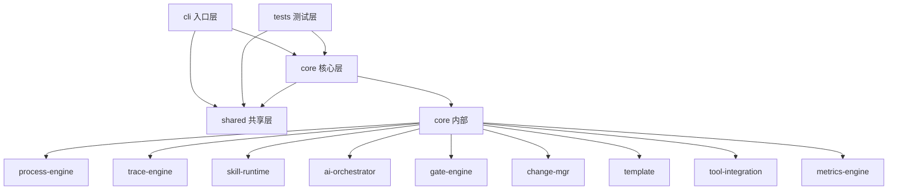

# 依赖调用链分析

> 本文档由 Serena MCP 驱动的 LSP 分析生成

## 模块依赖关系

### 依赖矩阵

| 被依赖 → | cli | core | shared | tests |
|----------|-----|------|--------|-------|
| **cli** ↓ | - | ❌ | ✅ | ❌ |
| **core** ↓ | ❌ | ✅ | ✅ | ❌ |
| **shared** ↓ | ❌ | ❌ | - | ❌ |
| **tests** ↓ | ❌ | ✅ | ✅ | - |

**说明**：
- ✅ = 存在依赖
- ❌ = 无依赖
- 核心原则：外层依赖内层，内层不依赖外层
- cli 和 tests 共同依赖 core 和 shared

### 模块依赖图



## 核心模块说明

### cli/ - 入口层
- **职责**: CLI 命令注册与路由
- **入度**: 0 (无其他模块依赖)
- **出度**: 2 (依赖 core, shared)
- **子模块**:
  - `commands/` - 19 个命令处理器
  - `router.ts` - 命令路由表
  - `index.ts` - 主入口

### core/ - 核心层
- **职责**: 业务逻辑核心
- **入度**: 2 (被 cli, tests 依赖)
- **出度**: 1 (依赖 shared)
- **子模块**:
  - `process-engine` - 阶段状态机 (init, advance, stage-machine, feature, extensions, layer-merger)
  - `trace-engine` - 追溯引擎 (id-generator, id-validator, id-search, matrix, coverage, exception-validator)
  - `skill-runtime` - Skill 分发 (dispatcher, prompt-assembler, hard-gate, front-matter, idempotent-write)
  - `ai-orchestrator` - AI 编排 (auto-loop, catchup, context-pack, watchdog, completion-detector)
  - `gate-engine` - 质量门禁 (gate-evaluator, security, sca, golive, command-gate)
  - `change-mgr` - 变更管理 (rfc, defect, rfc-machine, defect-machine, sync, impact)
  - `template` - 模板渲染 (renderer, artifact-checker)
  - `tool-integration` - 工具集成 (hook-installer, ai-runtime-hook, session-hook, context-sync)
  - `metrics-engine` - 指标引擎 (health-score, bottleneck)

### shared/ - 共享层
- **职责**: 跨层共享类型定义和工具函数
- **入度**: 2 (被 cli, core 依赖)
- **出度**: 0 (最底层，不依赖其他业务模块)
- **核心文件**:
  - `types.ts` - 核心类型定义 (Stage, ExitCode, ID types)
  - `fs-utils.ts` - 文件系统工具
  - `config-schema.ts` - 配置管理
  - `host-*.ts` - 宿主相关 (host-bootstrap, host-paths)

### tests/ - 测试层
- **职责**: 单元测试和集成测试
- **入度**: 0 (无其他模块依赖)
- **出度**: 2 (依赖 core, shared)
- **子目录**: unit/, integration/, e2e/

## 循环依赖检测

### ✅ 无循环依赖

当前模块结构符合单向依赖原则：
- cli → core → shared ✓
- tests → core → shared ✓
- core 内部模块间存在依赖，但整体方向清晰

## 常见调用路径

### 路径1: 命令执行流

```
用户输入 CLI 命令
  ↓
cli/index.ts (入口)
  ↓
cli/router.ts (路由分发)
  ↓
cli/commands/[command].ts (命令处理)
  ↓
core/[module]/ (核心业务逻辑)
  ↓
core/process-engine/advance.ts (状态流转)
```

### 路径2: 追溯 ID 生成

```
core/trace-engine/id-generator.ts (生成)
  ↓
core/trace-engine/matrix.ts (记录)
  ↓
shared/types.ts (类型定义)
```

### 路径3: AI 自动循环

```
core/ai-orchestrator/auto-loop.ts (主循环)
  ↓
core/ai-orchestrator/context-pack.ts (上下文打包)
  ↓
core/skill-runtime/prompt-assembler.ts (Prompt 组装)
  ↓
core/skill-runtime/dispatcher.ts (Skill 分发)
```

### 路径4: 质量门禁评估

```
core/gate-engine/gate-evaluator.ts (评估)
  ↓
core/trace-engine/coverage.ts (覆盖率)
  ↓
core/trace-engine/matrix.ts (矩阵检查)
  ↓
core/gate-engine/security.ts (安全扫描)
```

## 模块间依赖详情

### cli 依赖

| 依赖模块 | 引用次数 | 主要用途 |
|----------|----------|----------|
| shared/types.js | 20+ | 类型定义 (ExitCode, Stage, etc.) |
| shared/fs-utils.js | 10+ | 文件操作 |
| shared/config-schema.js | 5+ | 配置管理 |
| core/process-engine | 8+ | Feature 初始化、阶段流转 |
| core/trace-engine | 5+ | ID 生成、查询、矩阵 |
| core/change-mgr | 3+ | RFC、缺陷管理 |
| core/gate-engine | 3+ | 门禁评估 |
| core/tool-integration | 8+ | Hook 安装、AI 集成 |

### core 内部依赖

| 模块 | 主要依赖 | 被依赖 |
|------|----------|--------|
| process-engine | shared | cli, gate-engine, tool-integration |
| trace-engine | shared | cli, gate-engine, change-mgr |
| skill-runtime | shared, process-engine | ai-orchestrator, tool-integration |
| ai-orchestrator | shared, skill-runtime | cli |
| gate-engine | shared, trace-engine | cli, process-engine |
| change-mgr | shared, trace-engine | cli, gate-engine |

## 入口代码索引

| 我想... | 入口文件 | 入口函数 | 调用路径 |
|---------|----------|----------|----------|
| 添加新命令 | cli/router.ts | registerCommand() | 路径1 |
| 添加新 Stage | shared/types.ts | Stage enum | → process-engine/stage-machine.ts |
| 执行 AI 编排 | core/ai-orchestrator/auto-loop.ts | autoLoop() | 路径3 |
| 添加质量门禁 | core/gate-engine/gate-evaluator.ts | evaluateGate() | 路径4 |
| 生成追溯 ID | core/trace-engine/id-generator.ts | nextId() | 路径2 |
| 添加新 Skill | skills/spec-first/NN-name/SKILL.md | - | → skill-runtime/dispatcher.ts |

## 技术栈依赖

### 外部依赖（核心）

| 包名 | 版本 | 用途 | 被依赖位置 |
|------|------|------|------------|
| typescript | ^5.4.2 | 类型系统 | 全项目 |
- vitest | ^3.0.0 | 测试框架 | tests/ |
- handlebars | ^4.7.8 | 模板引擎 | core/template/ |
- js-yaml | ^4.1.0 | YAML 解析 | shared/config-schema.ts |
- chalk | ^5.3.0 | 终端颜色 | cli/ |

### 内部依赖（共享类型）

```
shared/types.ts (核心类型定义)
  ├── 被 cli 的所有命令引用
  ├── 被 core 的所有模块引用
  ├── 定义了 Stage 枚举 (00_init → 08_done/09_cancelled)
  ├── 定义了 ID 类型 (FR, DS, TASK, TC, RFC, REQ, etc.)
  ├── 定义了 ExitCode (成功/失败码)
  └── 定义了 Feature, StageState 等核心数据结构
```

## 架构分层

```
┌─────────────────────────────────────────────────────────────┐
│                        cli / tests                          │  入口/测试层
│  (用户命令、单元测试)                                        │
└─────────────────────────────────────────────────────────────┘
                              ↓
┌─────────────────────────────────────────────────────────────┐
│                          core                               │  核心业务层
│  ┌───────────┬───────────┬───────────┬─────────────────────┐ │
│  │  process  │   trace   │   skill   │  ai-orchestrate     │ │
│  │  -engine  │  -engine  │ -runtime  │                     │ │
│  ├───────────┼───────────┼───────────┼─────────────────────┤ │
│  │    gate   │  change   │  template │  tool-integration   │ │
│  │  -engine  │    -mgr   │           │                     │ │
│  └───────────┴───────────┴───────────┴─────────────────────┘ │
└─────────────────────────────────────────────────────────────┘
                              ↓
┌─────────────────────────────────────────────────────────────┐
│                         shared                              │  共享基础层
│  (类型定义、工具函数、配置管理)                               │
└─────────────────────────────────────────────────────────────┘
```

---

*分析时间: 2026-02-28 | 分析方法: Serena MCP LSP + 静态 import 分析 | 深度: module*
