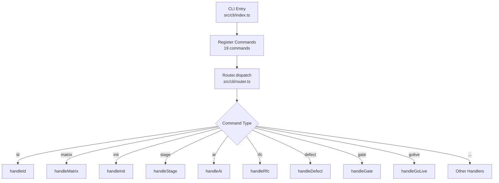
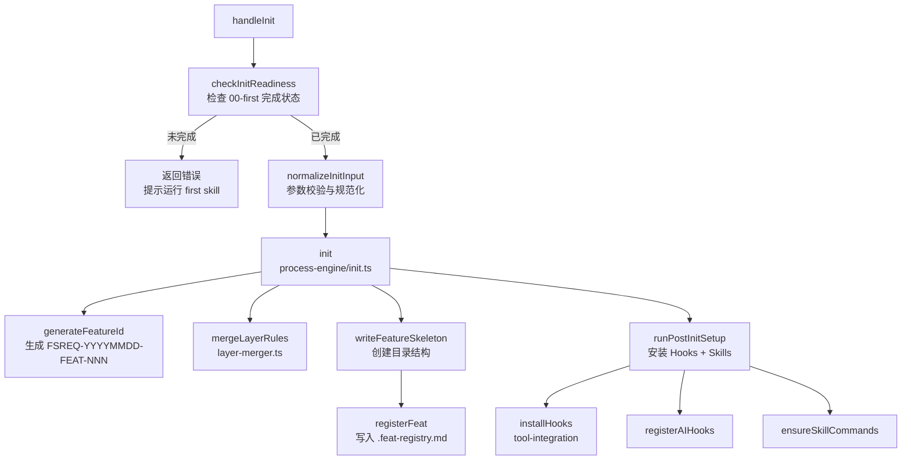
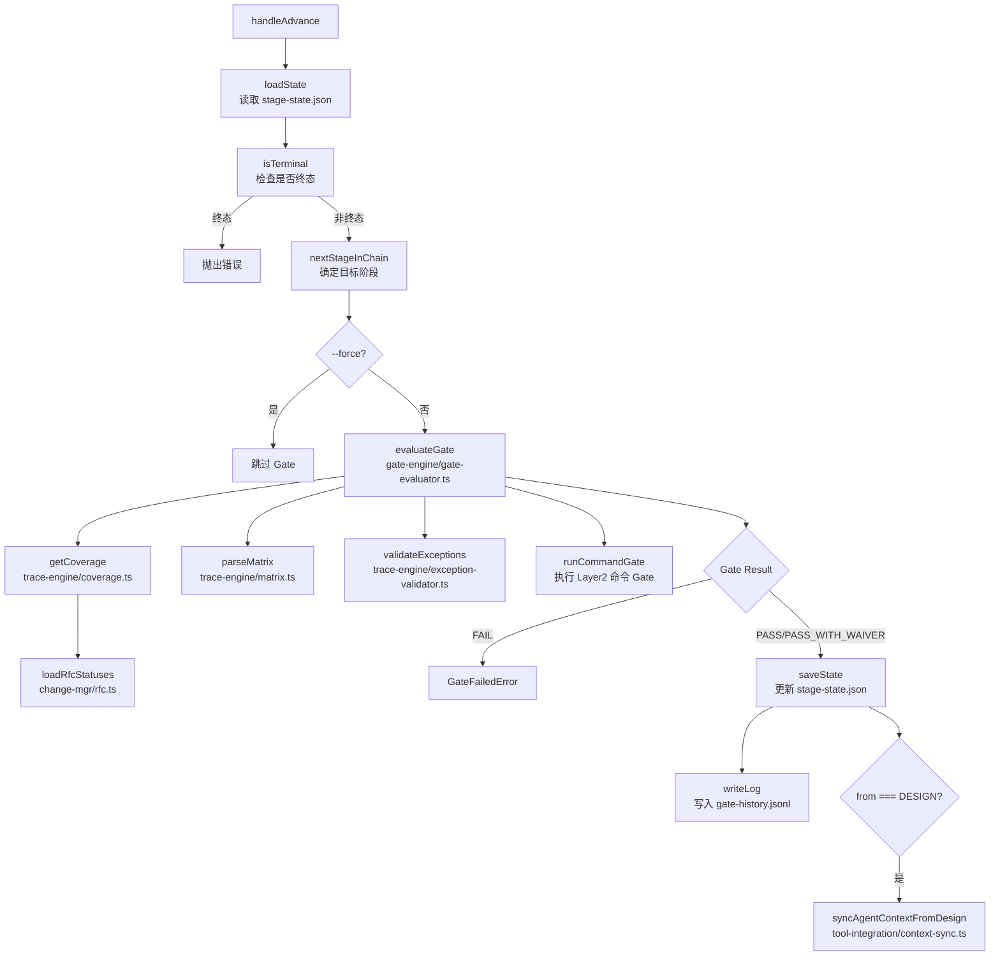
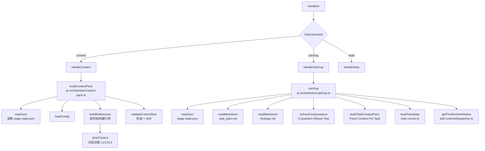
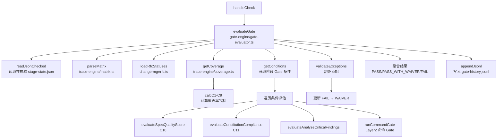
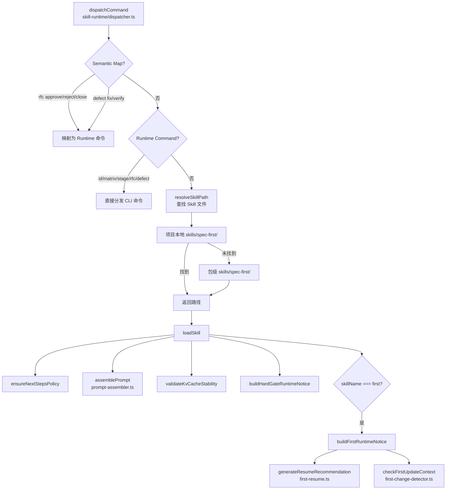
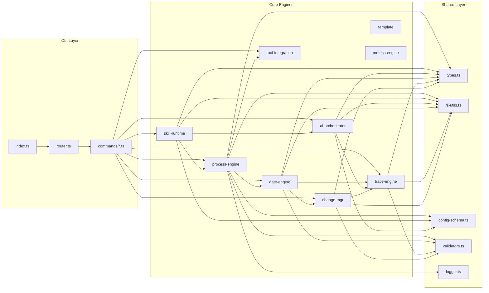
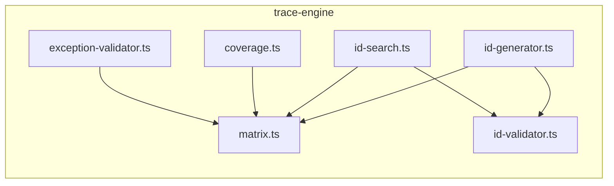
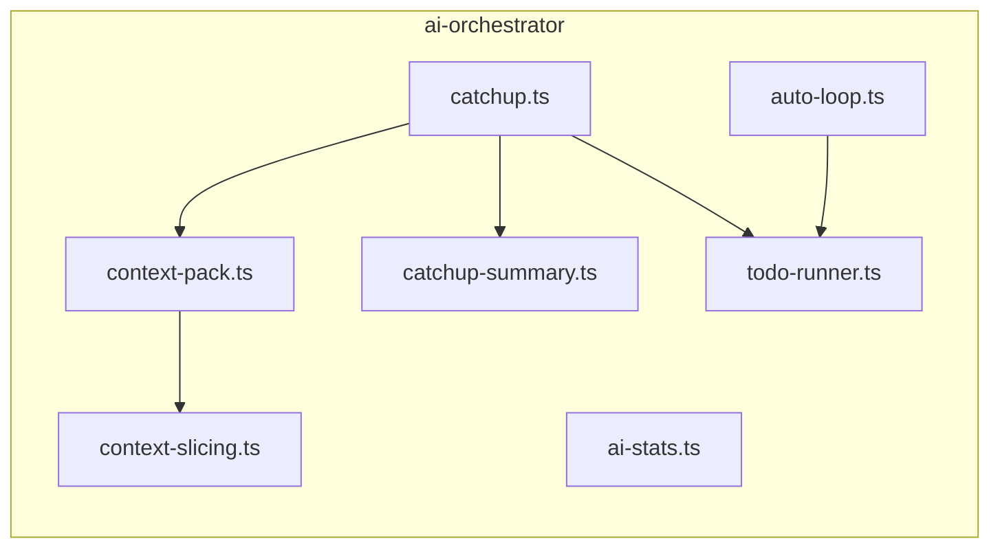
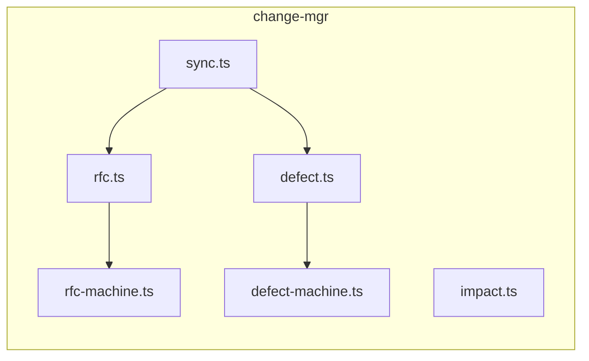

# 模块调用链分析

> 本文档分析 spec-first 项目的模块间调用关系，识别关键调用路径和高频依赖。

---

## 1. 架构层次概览

```
┌─────────────────────────────────────────────────────────────────┐
│                         CLI Layer                                │
│  src/cli/index.ts → router.ts → commands/*.ts                   │
└─────────────────────────────────────────────────────────────────┘
                              │
                              ▼
┌─────────────────────────────────────────────────────────────────┐
│                      Core Engine Layer                           │
│  process-engine │ skill-runtime │ ai-orchestrator               │
│  gate-engine │ trace-engine │ change-mgr                        │
│  template │ tool-integration │ metrics-engine                   │
└─────────────────────────────────────────────────────────────────┘
                              │
                              ▼
┌─────────────────────────────────────────────────────────────────┐
│                      Shared Layer                                │
│  types.ts │ fs-utils.ts │ config-schema.ts │ validators.ts      │
│  logger.ts │ host-bootstrap.ts │ skill-commands.ts              │
└─────────────────────────────────────────────────────────────────┘
```

---

## 2. 模块依赖矩阵

### 2.1 CLI Commands → Core Engines

| CLI Command | process-engine | skill-runtime | ai-orchestrator | gate-engine | trace-engine | change-mgr | tool-integration |
|-------------|:--------------:|:-------------:|:---------------:|:-----------:|:------------:|:----------:|:----------------:|
| init        | ✓ (init.ts)    | -             | -               | -           | -            | -          | ✓ (hooks)        |
| stage       | ✓ (advance)    | -             | -               | ✓ (eval)    | -            | -          | ✓ (hooks)        |
| ai          | -              | ✓ (dispatch)  | ✓ (context)     | -           | -            | -          | -                |
| rfc         | -              | -             | -               | -           | -            | ✓ (rfc)    | -                |
| defect      | -              | -             | -               | -           | -            | ✓ (defect) | -                |
| gate        | -              | -             | -               | ✓ (eval)    | ✓ (matrix)   | ✓ (rfc)    | -                |
| id          | -              | -             | -               | -           | ✓ (gen/val)  | -          | -                |
| matrix      | -              | -             | -               | -           | ✓ (matrix)   | -          | -                |
| commit      | -              | -             | -               | -           | -            | -          | -                |

### 2.2 Core Engines → Shared Modules

| Core Engine     | types.ts | fs-utils.ts | config-schema.ts | validators.ts | logger.ts |
|-----------------|:--------:|:-----------:|:----------------:|:-------------:|:---------:|
| process-engine  | ✓        | ✓           | ✓                | ✓             | ✓         |
| skill-runtime   | ✓        | ✓           | ✓                | -             | -         |
| ai-orchestrator | ✓        | ✓           | ✓                | -             | -         |
| gate-engine     | ✓        | ✓           | -                | ✓             | -         |
| trace-engine    | ✓        | ✓           | -                | ✓             | -         |
| change-mgr      | ✓        | ✓           | -                | ✓             | -         |
| template        | -        | ✓           | -                | -             | -         |
| tool-integration| ✓        | ✓           | -                | -             | -         |

### 2.3 Core Engines 内部依赖

| Source          | Target                    | 依赖说明                          |
|-----------------|---------------------------|-----------------------------------|
| process-engine  | gate-engine               | advance 时评估 Gate              |
| process-engine  | tool-integration          | Design 阶段后同步 Agent Context  |
| skill-runtime   | process-engine            | 加载扩展（extensions）           |
| skill-runtime   | ai-orchestrator           | 构建 first-runtime 上下文        |
| gate-engine     | trace-engine              | 读取矩阵、覆盖率、异常校验       |
| gate-engine     | change-mgr                | 加载 RFC 状态                    |
| ai-orchestrator | trace-engine              | context-pack 读取矩阵            |
| change-mgr      | trace-engine              | RFC 同步 known-exceptions        |

---

## 3. 关键调用路径图

### 3.1 CLI 入口到命令分发



### 3.2 `spec-first init` 执行链路



### 3.3 `spec-first stage advance` 执行链路



### 3.4 `spec-first ai` 执行链路



### 3.5 `spec-first gate check` 执行链路



### 3.6 Skill Runtime 三层路由



---

## 4. 高频调用路径

### 4.1 状态读取路径（高频）

```
CLI Command → process.cwd() → readJson(stage-state.json)
           → fs-utils.readJson → assertSafePath → existsSync → readFileSync
```

**调用频率**: 几乎所有 CLI 命令都会调用

**涉及模块**:
- `src/shared/fs-utils.ts` - 文件 I/O 封装
- `src/shared/validators.ts` - 运行时类型校验

### 4.2 矩阵解析路径（高频）

```
CLI Command → trace-engine/matrix.ts → parseMatrix
           → fs-utils.readMarkdown → parseMarkdownTable
           → id-validator.validateId
```

**调用频率**: id/matrix/gate/ai 命令都会调用

**涉及模块**:
- `src/core/trace-engine/matrix.ts` - 矩阵解析
- `src/core/trace-engine/id-validator.ts` - ID 校验

### 4.3 Gate 评估路径（中频）

```
stage advance / gate check → gate-engine/gate-evaluator.ts
                          → trace-engine/coverage.ts
                          → trace-engine/matrix.ts
                          → change-mgr/rfc.ts
                          → trace-engine/exception-validator.ts
```

**调用频率**: stage advance, gate check, golive check

**关键依赖**:
- 覆盖率计算依赖矩阵数据
- 豁免匹配依赖 RFC 状态

### 4.4 Context Pack 构建路径（中频）

```
ai context / ai catchup → ai-orchestrator/context-pack.ts
                        → config-schema.ts (loadConfig)
                        → context-slicing.ts (sliceContext)
```

**调用频率**: ai context, ai catchup

**关键特性**:
- 三层上下文 L1/L2/L3 分层压缩
- Token 预算控制

---

## 5. 模块依赖图

### 5.1 核心引擎依赖关系



### 5.2 trace-engine 内部依赖



### 5.3 ai-orchestrator 内部依赖



### 5.4 change-mgr 内部依赖



---

## 6. 关键依赖说明

### 6.1 共享类型系统

**文件**: `src/shared/types.ts`

**职责**: 定义所有跨模块共享的类型，消除隐式字符串协议

**关键类型**:
- `Stage` 枚举 - 10 个阶段（8 active + 2 terminal）
- `IdType` / `NextIdType` - 追溯 ID 类型
- `StageState` - Feature 状态结构
- `GateResult` / `ConditionResult` - Gate 评估结果
- `RfcRecord` / `DefectRecord` - 变更管理记录
- `MatrixRow` / `CoverageMetrics` - 追踪矩阵和覆盖率

**被依赖**: 所有 core 模块和 CLI commands

### 6.2 文件 I/O 封装

**文件**: `src/shared/fs-utils.ts`

**职责**: 统一文件读写，路径安全校验

**关键函数**:
- `readJson` / `readJsonChecked` - JSON 读取（带校验）
- `writeJson` / `writeMarkdown` - 文件写入
- `ensureDir` / `exists` - 目录和文件检查
- `parseMarkdownTable` - Markdown 表格解析

**安全特性**:
- 路径遍历防护（I2: 拒绝非绝对路径）
- JSON 结构校验（I3: readJsonChecked）

### 6.3 配置加载

**文件**: `src/shared/config-schema.ts`

**职责**: 加载和验证 .spec-first/config.yaml

**关键配置节**:
- `gate` - Gate 引擎配置（pilot_mode 等）
- `runtime` - 运行时配置（auto_orchestrate, kv_cache_hard_gate）
- `context` - 上下文配置（token_budget）

**缓存机制**: `resetConfigCache()` 用于配置变更后刷新

### 6.4 阶段状态机

**文件**: `src/core/process-engine/stage-machine.ts`

**职责**: 阶段流转校验，终态判断

**关键函数**:
- `assertTransitionAllowed(from, to)` - 校验流转合法性
- `isTerminal(stage)` - 判断是否终态

**阶段链**: INIT → SPECIFY → DESIGN → PLAN → IMPLEMENT → VERIFY → WRAP_UP → RELEASE → DONE

### 6.5 Gate 评估引擎

**文件**: `src/core/gate-engine/gate-evaluator.ts`

**职责**: 阶段质量门禁评估

**评估流程**:
1. 读取 stage-state.json
2. 解析 traceability-matrix.md
3. 计算 C1-C9 覆盖率
4. 执行阶段条件检查
5. 匹配豁免（known-exceptions）
6. 聚合三态结果（PASS/PASS_WITH_WAIVER/FAIL）
7. 写入 gate-history.jsonl

---

## 7. 命令与核心模块映射表

| CLI 命令 | 入口文件 | 核心模块 | 关键函数 |
|----------|----------|----------|----------|
| id | commands/id.ts | trace-engine/id-generator.ts, id-validator.ts, id-search.ts | nextId, validateId, searchId, listIds |
| matrix | commands/matrix.ts | trace-engine/matrix.ts | checkMatrix, exportMatrix, updateMatrixRow |
| init | commands/init.ts | process-engine/init.ts, layer-merger.ts | init, mergeLayerRules |
| stage | commands/stage.ts | process-engine/advance.ts, feature.ts | advance, cancel, getFeatureState |
| ai | commands/ai.ts | ai-orchestrator/context-pack.ts, catchup.ts, ai-stats.ts | buildContextPack, catchup, readStats |
| rfc | commands/rfc.ts | change-mgr/rfc.ts, rfc-machine.ts | createRfc, submitRfc, transitionRfc, listRfc |
| defect | commands/defect.ts | change-mgr/defect.ts, defect-machine.ts | registerDefect, transitionDefect, listDefects |
| gate | commands/gate.ts | gate-engine/gate-evaluator.ts | evaluateGate, getGateHistory, getConditions |
| golive | commands/gate.ts | gate-engine/golive.ts | checkGoLive |
| commit | commands/commit.ts | - (直接调用 git) | handleCommit |
| feature | commands/feature.ts | process-engine/feature.ts | listFeatures, switchFeature, getFeatureState |
| doctor | commands/doctor.ts | - (环境诊断) | handleDoctor |
| setup | commands/setup.ts | shared/host-bootstrap.ts, skill-commands.ts | handleSetup |
| hooks | commands/hooks.ts | tool-integration/hook-installer.ts | handleHooks |
| viewer | commands/viewer.ts | - (可视化面板) | handleViewer |
| update | commands/update.ts | migrations/manifest-engine.ts | handleUpdate |
| uninstall | commands/uninstall.ts | - (清理配置) | handleUninstall |
| analyze | commands/analyze.ts | template/artifact-checker.ts | handleAnalyze |

---

## 8. 性能关键路径

### 8.1 文件 I/O 热点

| 操作 | 频率 | 优化建议 |
|------|------|----------|
| readJson(stage-state.json) | 高 | 可考虑内存缓存（需注意一致性） |
| parseMatrix | 高 | 已有 parseMatrixIds 优化版本 |
| readMarkdown(task_plan.md) | 中 | 按需加载 |
| readConfig | 中 | 已有 resetConfigCache 机制 |

### 8.2 计算密集型操作

| 操作 | 位置 | 复杂度 |
|------|------|--------|
| 覆盖率计算 | trace-engine/coverage.ts | O(n×m) n=FR数, m=下游类型 |
| V-Model 校验 | trace-engine/matrix.ts | O(n²) |
| Gate 条件评估 | gate-engine/gate-evaluator.ts | O(条件数×复杂度) |
| Context 分层压缩 | ai-orchestrator/context-slicing.ts | O(引用数) |

---

## 9. 错误处理路径

### 9.1 Gate 失败路径

```
evaluateGate → GateFailedError
            → CLI 捕获 → ExitCode.GATE_FAILED (1)
```

### 9.2 校验失败路径

```
readJsonChecked → isStageState guard
               → 校验失败 → Error
               → CLI 捕获 → ExitCode.VALIDATION_ERROR (2)
```

### 9.3 配置错误路径

```
loadConfig → YAML 解析失败
          → Error → CLI 捕获 → ExitCode.CONFIG_ERROR (3)
```

---

## 10. 扩展点

### 10.1 Layer2 扩展

**位置**: `src/core/process-engine/layer-merger.ts`

**机制**: 合并 `.spec-first/layer2/*.yaml` 中的 Gate 条件和交付物定义

**注入点**:
- `mergedRules.gateConditions[stage]` - 额外 Gate 条件
- `mergedRules.deliverables[stage]` - 交付物清单
- `mergedRules.thresholds` - 阈值配置

### 10.2 Skill 扩展

**位置**: `src/core/skill-runtime/dispatcher.ts`

**机制**:
1. 项目本地 `skills/spec-first/NN-name/SKILL.md`
2. 包级 `skills/spec-first/NN-name/SKILL.md`
3. 扩展命名空间 `ext.namespace.skill`

### 10.3 模板扩展

**位置**: `src/core/template/renderer.ts`

**优先级**:
1. `.spec-first/local/templates/` - 用户定制
2. `.spec-first/meta/templates/` - 包级基线
3. `templates/` - 包内默认

---

## 附录：模块清单

### A. CLI 层模块

| 模块 | 文件 | 职责 |
|------|------|------|
| 入口 | src/cli/index.ts | 注册命令，启动分发 |
| 路由 | src/cli/router.ts | 命令分发，错误处理 |
| 参数解析 | src/cli/parse-utils.ts | Flag 解析 |
| 命令处理 | src/cli/commands/*.ts | 19 个命令处理器 |

### B. Core 层模块

| 模块 | 目录 | 职责 |
|------|------|------|
| process-engine | src/core/process-engine/ | 阶段状态机 |
| skill-runtime | src/core/skill-runtime/ | Skill 分发 |
| ai-orchestrator | src/core/ai-orchestrator/ | AI 上下文 |
| gate-engine | src/core/gate-engine/ | Gate 评估 |
| trace-engine | src/core/trace-engine/ | 追溯管理 |
| change-mgr | src/core/change-mgr/ | RFC/Defect |
| template | src/core/template/ | 模板渲染 |
| tool-integration | src/core/tool-integration/ | 工具集成 |
| metrics-engine | src/core/metrics-engine/ | 健康度评分 |
| migrations | src/core/migrations/ | 版本迁移 |

### C. Shared 层模块

| 模块 | 文件 | 职责 |
|------|------|------|
| 类型定义 | src/shared/types.ts | 共享类型 |
| 文件 I/O | src/shared/fs-utils.ts | 文件操作 |
| 配置 | src/shared/config-schema.ts | 配置加载 |
| 校验器 | src/shared/validators.ts | 运行时校验 |
| 日志 | src/shared/logger.ts | 日志写入 |
| 宿主引导 | src/shared/host-bootstrap.ts | 环境引导 |
| 宿主路径 | src/shared/host-paths.ts | 路径检测 |
| Skill 命令 | src/shared/skill-commands.ts | 命令注册 |
