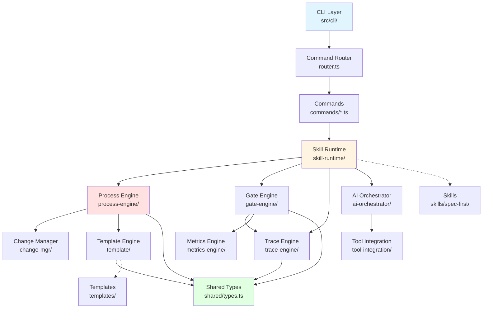

# 代码库概览

> **模式**: deep | **生成时间**: 2026-03-09 | **Agent**: A1
> **项目**: spec-first v0.5.49 | **技术栈**: Node.js ≥20 + TypeScript 5.4 + ESM

---

## 项目简介

**Spec-First** 是基于规范驱动的全链路研发流程引擎，为 AI 时代软件开发提供从需求到上线的完整闭环管理。

- **核心理念**: 规范即契约、规范即真理 (CLAUDE.md:13 — "规范即契约、规范即真理" — [显式])
- **入口文件**: `src/cli/index.ts` → CLI 命令分发 (package.json:7 — `"spec-first": "dist/cli/index.js"` — [显式])
- **构建工具**: tsup (package.json:10 — `"build": "tsup"` — [显式])
- **测试框架**: Vitest + v8 coverage，覆盖率阈值 75% (package.json:14 + vitest.config.ts — [显式])

---

## 目录结构

> **注意**: 项目文件数 10110，超大型项目，目录树已限制为 2 层深度 [大型项目: 目录树已截断]

```
spec-first/
├── src/                          # 源码目录
│   ├── cli/                      # CLI 命令层
│   │   ├── commands/             # 22 个命令实现
│   │   ├── index.ts              # CLI 入口，注册所有命令
│   │   ├── router.ts             # 命令路由注册与分发
│   │   └── parse-utils.ts        # 参数解析工具
│   ├── core/                     # 核心引擎模块（12 个子模块）
│   │   ├── process-engine/       # 阶段状态机 (8 active + 2 terminal)
│   │   ├── skill-runtime/        # Skill 分发与编排（22 个文件）
│   │   ├── ai-orchestrator/      # AI 自动循环与上下文管理（15 个文件）
│   │   ├── gate-engine/          # 质量门禁评估（7 个文件）
│   │   ├── trace-engine/         # 追溯 ID 与覆盖率矩阵（9 个文件）
│   │   ├── change-mgr/           # RFC + Defect 状态机（6 个文件）
│   │   ├── template/             # Handlebars 模板渲染（6 个文件）
│   │   ├── tool-integration/     # AI runtime hooks（6 个文件）
│   │   ├── metrics-engine/       # 健康度评分（2 个文件）
│   │   ├── validators/           # 校验器
│   │   ├── rules/                # 规则引擎
│   │   └── migrations/           # 数据迁移
│   ├── shared/                   # 共享类型与工具
│   │   └── types.ts              # Stage enum, ExitCode, ID types
│   └── config/                   # 配置管理
├── skills/                       # Skill 模板库
│   └── spec-first/               # 内置 Skill 集
├── templates/                    # Handlebars 模板
├── tests/                        # 测试套件（5 个子目录）
│   ├── unit/                     # 单元测试
│   ├── integration/              # 集成测试
│   ├── e2e/                      # 端到端测试
│   ├── benchmark/                # 性能基准
│   └── fixtures/                 # 测试固件
├── scripts/                      # 工具脚本
│   ├── stage-viewer/             # 阶段可视化服务器
│   └── codex/                    # Codex 集成脚本
└── docs/                         # 文档目录
```

---

## 核心模块详解

### 1. CLI 层 (`src/cli/`)

**入口文件**: `src/cli/index.ts`
- 注册 22 个命令到路由器 (src/cli/index.ts — 调用 registerCommand() — [显式])
- 调用 `dispatch(process.argv.slice(2))` 分发命令 (src/cli/router.ts:dispatch — [显式])

**命令路由**: `src/cli/router.ts`
- 核心函数: `registerCommand()`, `dispatch()`, `getRegisteredCommands()` (router.ts — Serena 符号分析 — [显式])
- 接口定义: `CommandEntry`, `RegisterCommandOptions` (router.ts — [显式])
- 存储结构: `Map<string, CommandEntry>` 命令注册表 (router.ts:commands — [显式])
- 确认策略: `resolveConfirmPolicy()`, `shouldRequireConfirmation()` (router.ts — [显式])

**已注册命令**（22 个）:
```
id, matrix, init, stage, rfc, defect, metrics, doctor, gate, golive, done,
ai, commit, feature, setup, hooks, viewer, update, uninstall, analyze, trace,
validate, orchestrate
```
(src/cli/commands/ — 22 个文件 — [显式])

### 2. 阶段状态机 (`src/core/process-engine/`)

**核心文件**（8 个）:
- `stage-machine.ts` — 状态转换规则与校验 (函数: assertTransitionAllowed, getNextStages, isTerminal — [显式])
- `advance.ts` — 阶段推进逻辑
- `init.ts` — Feature 初始化
- `feature.ts` — Feature 管理
- `next-step-decider.ts` — 下一步决策
- `dependency-checker.ts` — 依赖检查
- `layer-merger.ts` — 层级合并
- `extensions.ts` — 扩展机制

**Stage 枚举**（src/shared/types.ts:7-18 — [显式]）:
```typescript
00_init → 01_specify → 02_design → 03_plan → 04_implement
→ 05_verify → 06_wrap_up → 07_release → 08_done / 09_cancelled
```

### 3. Skill 运行时 (`src/core/skill-runtime/`)

**核心文件**（22 个）:
- `dispatcher.ts` — Skill 分发核心 (函数: dispatchCommand, loadSkill, resolveSkillPath — [显式])
- `prompt-assembler.ts` — Prompt 组装
- `hard-gate.ts` — 硬门禁校验
- `orchestrate-args.ts` — 编排参数解析
- `first-doc-projection.ts` — 文档投影
- `first-runtime-store.ts` — 运行时状态存储
- `phase-machine.ts` — 阶段机器
- `confirm-policy.ts` — 确认策略

**三层路由机制** (dispatcher.ts — SEMANTIC_MAP, RUNTIME_COMMANDS, resolveSkillPath — [显式]):
1. **Semantic Map** — 复合命令映射
2. **Runtime Route** — 直接 CLI 命令分发
3. **Skill Route** — 搜索 `skills/spec-first/NN-name/SKILL.md`

### 4. AI 编排器 (`src/core/ai-orchestrator/`)

**核心文件**（15 个）:
- `auto-loop.ts` — AI 自动循环 (接口: AutoLoopOptions, AutoLoopResult; 函数: runAutoLoop — [显式])
- `catchup.ts` — 上下文恢复
- `context-pack.ts` — 上下文打包
- `context-provider.ts` — 上下文提供
- `completion-detector.ts` — 完成检测
- `retry-controller.ts` — 重试控制
- `watchdog.ts` — 监控守护
- `audit-log.ts` — 审计日志

### 5. 质量门禁 (`src/core/gate-engine/`)

**核心文件**（7 个）:
- `gate-evaluator.ts` — 门禁评估核心 (函数: evaluateGate, getConditions; 常量: GATE_CONDITIONS — [显式])
- `security.ts` — 安全扫描
- `sca.ts` — 软件成分分析
- `golive.ts` — 上线门禁
- `rollback.ts` — 回滚门禁
- `prd-validator.ts` — PRD 校验
- `command-gate.ts` — 命令门禁

### 6. 追溯引擎 (`src/core/trace-engine/`)

**核心文件**（9 个）:
- `id-generator.ts` — ID 生成 (函数: nextId, assembleId, findNextSeq — [显式])
- `id-validator.ts` — ID 校验
- `id-search.ts` — ID 搜索
- `matrix.ts` — 覆盖率矩阵
- `coverage.ts` — 覆盖率计算
- `ratio.ts` — 比率计算
- `trace-context.ts` — 追溯上下文

**ID 类型** (src/shared/types.ts:27-31 — [显式]):
```
FR, DS, TASK, TC, RFC, REQ, SYS, ARCH, MOD, ATP, STP, ITP, UTP, Feature
```

### 7. 变更管理 (`src/core/change-mgr/`)

**核心文件**（6 个）:
- `rfc-machine.ts` — RFC 状态机 (函数: assertRfcTransition, getNextRfcStatuses — [显式])
- `rfc.ts` — RFC 管理
- `defect-machine.ts` — Defect 状态机
- `defect.ts` — Defect 管理
- `impact.ts` — 影响分析
- `sync.ts` — 同步机制

### 8. 模板引擎 (`src/core/template/`)

**核心文件**（6 个）:
- `renderer.ts` — Handlebars 渲染 (函数: renderTemplate, findTemplatePath — [显式])
- `artifact-checker.ts` — 产物检查
- `hash-registry.ts` — 哈希注册表
- `update-decision.ts` — 更新决策
- `change-classifier.ts` — 变更分类
- `template-level-classifier.ts` — 模板级别分类

### 9. 工具集成 (`src/core/tool-integration/`)

**核心文件**（6 个）:
- `ai-runtime-hook.ts` — AI 运行时钩子
- `session-hook.ts` — 会话钩子
- `context-sync.ts` — 上下文同步
- `hook-installer.ts` — 钩子安装器

### 10. 指标引擎 (`src/core/metrics-engine/`)

**核心文件**（2 个）:
- `health-score.ts` — 健康度评分 (函数: calcHealthScore, getGrade; 常量: WEIGHTS — [显式])
- `bottleneck.ts` — 瓶颈分析

---

## 开发入口

> 告诉你"改什么功能 → 改哪个文件"（CLI 工具类型项目）

### 常见开发任务

| 任务 | 文件/目录 | 说明 |
|------|-----------|------|
| 新增 CLI 命令 | `src/cli/commands/` | 创建新命令文件，在 `src/cli/index.ts` 注册 |
| 修改命令路由 | `src/cli/router.ts` | 命令分发、确认策略、路由逻辑 |
| 新增阶段逻辑 | `src/core/process-engine/` | 状态机转换、阶段推进、依赖检查 |
| 新增 Skill | `skills/spec-first/` | 创建 `NN-name/SKILL.md` 文件 |
| 修改 Skill 分发 | `src/core/skill-runtime/dispatcher.ts` | 三层路由、Skill 加载、参数解析 |
| 新增门禁条件 | `src/core/gate-engine/gate-evaluator.ts` | 修改 `GATE_CONDITIONS` 常量 |
| 新增追溯 ID 类型 | `src/shared/types.ts` | 修改 `NextIdType` 类型定义 |
| 修改模板渲染 | `src/core/template/renderer.ts` | Handlebars 渲染逻辑 |
| 新增 AI 编排逻辑 | `src/core/ai-orchestrator/` | auto-loop、catchup、context-pack |
| 添加测试 | `tests/unit/` | 按模块创建对应测试文件 |
| 修改配置 | `src/config/` | 配置管理逻辑 |

### 快速定位

- **应用入口**: `src/cli/index.ts` (package.json:7 — [显式])
- **命令注册**: `src/cli/router.ts` (registerCommand 函数 — [显式])
- **类型定义**: `src/shared/types.ts` (Stage, ExitCode, ID types — [显式])
- **状态机核心**: `src/core/process-engine/stage-machine.ts` (TRANSITIONS 常量 — [显式])
- **Skill 分发**: `src/core/skill-runtime/dispatcher.ts` (SEMANTIC_MAP, RUNTIME_COMMANDS — [显式])
- **门禁评估**: `src/core/gate-engine/gate-evaluator.ts` (GATE_CONDITIONS — [显式])
- **ID 生成**: `src/core/trace-engine/id-generator.ts` (nextId 函数 — [显式])

---

## 关键业务流程

### 1. 命令执行流程

```
用户输入命令
  ↓
src/cli/index.ts (入口)
  ↓
src/cli/router.ts:dispatch() (路由分发)
  ↓
src/cli/commands/*.ts (命令处理器)
  ↓
src/core/skill-runtime/dispatcher.ts (Skill 分发)
  ↓
三层路由: Semantic Map → Runtime Route → Skill Route
  ↓
加载 skills/spec-first/NN-name/SKILL.md
  ↓
执行业务逻辑 (process-engine, gate-engine, trace-engine 等)
```

### 2. 阶段推进流程

```
用户执行 spec-first stage advance
  ↓
src/core/process-engine/stage-machine.ts:assertTransitionAllowed()
  ↓
src/core/gate-engine/gate-evaluator.ts:evaluateGate()
  ↓
门禁通过 → src/core/process-engine/advance.ts
  ↓
更新 .spec-first/stage-state.json
  ↓
触发 src/core/tool-integration/session-hook.ts
```

### 3. Skill 加载流程

```
dispatchCommand(command, args)
  ↓
检查 SEMANTIC_MAP (复合命令映射)
  ↓
检查 RUNTIME_COMMANDS (直接 CLI 命令)
  ↓
resolveSkillPath() 搜索 skills/spec-first/NN-name/SKILL.md
  ↓
loadSkill() 读取 Skill 文件
  ↓
ensureNextStepsPolicy() 校验 Next Steps 策略
  ↓
assemblePrompt() 组装 Prompt
  ↓
buildHardGateRuntimeNotice() 前置硬门禁通知
```

---

## 依赖关系图

### 模块依赖关系（Mermaid）



### 核心依赖流向

1. **CLI → Skill Runtime** — 命令分发入口
2. **Skill Runtime → 各引擎** — 业务逻辑编排
3. **所有模块 → Shared Types** — 类型定义统一源
4. **Process Engine → Change Mgr** — 阶段推进触发变更管理
5. **Gate Engine → Trace Engine** — 门禁评估依赖追溯数据

---

## 技术约定

### 运行时环境

- **Node.js**: ≥20.0.0 (package.json:28 — [显式])
- **模块系统**: ESM (`"type": "module"`) (package.json:5 — [显式])
- **TypeScript**: ≥5.4.0, strict mode (package.json:63 — [显式])
- **构建工具**: tsup (package.json:62 — [显式])

### 代码规范

- **导出方式**: Named exports only，core 模块禁用 default export (CLAUDE.md:125 — [显式])
- **文件命名**: `kebab-case.ts` (CLAUDE.md:126 — [显式])
- **未使用变量**: 以 `_` 前缀标记 (CLAUDE.md:127 — [显式])
- **类型定义**: 集中在 `src/shared/types.ts` (CLAUDE.md:125 — [显式])

### 依赖管理

**核心依赖** (package.json:67-72 — [显式]):
- `handlebars` ^4.7.8 — 模板渲染
- `js-yaml` ^4.1.0 — YAML 解析
- `semver` ^7.7.4 — 版本管理
- `update-notifier` ^7.0.0 — 更新通知

**开发依赖** (package.json:54-66 — [显式]):
- `typescript` ^5.4.0
- `vitest` ^1.6.1
- `eslint` ^10.0.2
- `prettier` ^3.8.1
- `tsup` ^8.5.1

---

## 测试结构

### 测试目录

- **单元测试**: `tests/unit/` — 每模块一个文件 (tests/unit/ — [显式])
- **集成测试**: `tests/integration/` — 跨模块集成测试 (tests/integration/ — [显式])
- **端到端测试**: `tests/e2e/` — 完整流程测试 (tests/e2e/ — [显式])
- **性能基准**: `tests/benchmark/` — 性能测试 (tests/benchmark/ — [显式])
- **测试固件**: `tests/fixtures/` — 测试数据 (tests/fixtures/ — [显式])

### 覆盖率要求

(vitest.config.ts + CLAUDE.md:146 — [显式]):
- **Lines**: 75%
- **Functions**: 75%
- **Statements**: 75%
- **Branches**: 65%

### 测试命令

```bash
npm test                    # 运行全量测试
npm run test:watch          # Watch 模式
npm run test:coverage       # 生成覆盖率报告
npx vitest run tests/unit/xxx.test.ts  # 运行单个测试文件
```

---

## 构建与运行

### 常用命令

```bash
# 构建
npm run build              # tsup 打包到 dist/
npm run typecheck          # TypeScript 类型检查

# 测试
npm test                   # Vitest 全量测试
npm run test:watch         # Vitest watch 模式

# 代码质量
npm run lint               # ESLint 检查
npm run lint:fix           # ESLint 自动修复
npm run format             # Prettier 格式化

# 工具
npm run viewer:start       # 启动阶段可视化服务器
npm run viewer:bootstrap   # 引导启动可视化
```

(package.json:9-25 — [显式])

---

## 文档元信息

- **生成模式**: deep (使用 Serena LSP 符号分析)
- **生成时间**: 2026-03-09
- **Agent**: A1
- **项目版本**: v0.5.49
- **文件总数**: 10110 [大型项目]
- **证据类型**: [显式] — 基于代码直接证据
