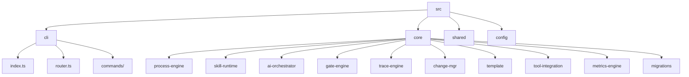

# Codebase Overview

> **项目**: spec-first | **类型**: CLI 工具（后端服务） | **语言**: TypeScript

## 1. 项目目录结构

```
spec-first/
├── src/                      # 源代码目录
│   ├── cli/                  # CLI 入口与命令
│   │   ├── commands/         # 19 个命令实现
│   │   ├── index.ts          # CLI 主入口
│   │   ├── router.ts         # 命令路由
│   │   └── parse-utils.ts    # 参数解析工具
│   ├── core/                 # 核心引擎模块
│   │   ├── process-engine/   # 阶段状态机
│   │   ├── skill-runtime/    # Skill 运行时
│   │   ├── ai-orchestrator/  # AI 编排引擎
│   │   ├── gate-engine/      # 质量门禁引擎
│   │   ├── trace-engine/     # 追溯引擎
│   │   ├── change-mgr/       # 变更管理
│   │   ├── template/         # 模板渲染
│   │   ├── tool-integration/ # 工具集成
│   │   ├── metrics-engine/   # 指标引擎
│   │   └── migrations/       # 数据迁移
│   ├── config/               # 配置管理
│   └── shared/               # 共享工具与类型
├── tests/                    # 测试目录
│   ├── unit/                 # 单元测试（77 个文件）
│   ├── integration/          # 集成测试
│   ├── e2e/                  # 端到端测试
│   ├── benchmark/            # 性能基准测试
│   └── fixtures/             # 测试固件
├── skills/                   # Skill 定义
│   └── spec-first/           # 22 个 Skill 模块
├── templates/                # 模板文件
│   ├── init/                 # 初始化模板
│   ├── metrics/              # 指标模板
│   ├── migrations/           # 迁移模板
│   ├── ci/                   # CI 模板
│   ├── release/              # 发布模板
│   ├── review/               # 审查模板
│   ├── gate/                 # 门禁模板
│   └── matrix/               # 矩阵模板
├── scripts/                  # 构建与工具脚本
├── docs/                     # 文档目录
├── specs/                    # 规范定义
└── dist/                     # 构建产物
```

## 2. 核心模块概览

### 2.1 目录结构图



### 2.2 核心模块清单

| 模块 | 目录 | 文件数 | 职责 |
|------|------|--------|------|
| **process-engine** | `src/core/process-engine/` | 6 | 阶段状态机，驱动 Feature 生命周期流转（8 active + 2 terminal stages） |
| **skill-runtime** | `src/core/skill-runtime/` | 15 | Skill 分发、prompt 组装、hard-gate 校验、编排参数解析 |
| **ai-orchestrator** | `src/core/ai-orchestrator/` | 14 | AI 自动循环（auto-loop）、上下文恢复（catchup）、context-pack |
| **gate-engine** | `src/core/gate-engine/` | 5 | 阶段质量门禁评估、安全扫描、SCA、上线/回滚门禁 |
| **trace-engine** | `src/core/trace-engine/` | 6 | 追溯 ID 生成/校验/搜索、覆盖率矩阵（C1-C9） |
| **change-mgr** | `src/core/change-mgr/` | 6 | RFC + Defect 状态机、影响分析 |
| **template** | `src/core/template/` | 6 | Handlebars 模板渲染、产物检查、变更分类 |
| **tool-integration** | `src/core/tool-integration/` | 6 | AI runtime hooks、context 同步、session 管理 |
| **metrics-engine** | `src/core/metrics-engine/` | 2 | 健康度评分、瓶颈分析 |
| **migrations** | `src/core/migrations/` | 6 | 版本迁移、manifest 管理 |

### 2.3 CLI 命令清单

| 命令 | 文件 | 职责 |
|------|------|------|
| `init` | `commands/init.ts` | 初始化项目结构 |
| `stage` | `commands/stage.ts` | 阶段管理 |
| `rfc` | `commands/rfc.ts` | RFC 变更请求管理 |
| `defect` | `commands/defect.ts` | 缺陷管理 |
| `feature` | `commands/feature.ts` | Feature 生命周期管理 |
| `ai` | `commands/ai.ts` | AI 编排入口 |
| `commit` | `commands/commit.ts` | 提交辅助 |
| `gate` | `commands/gate.ts` | 质量门禁 |
| `golive` | - | 上线门禁（通过 gate 实现） |
| `metrics` | `commands/metrics.ts` | 指标统计 |
| `doctor` | `commands/doctor.ts` | 环境诊断 |
| `id` | `commands/id.ts` | 追溯 ID 管理 |
| `matrix` | `commands/matrix.ts` | 覆盖率矩阵 |
| `analyze` | `commands/analyze.ts` | 代码分析 |
| `viewer` | `commands/viewer.ts` | 阶段可视化 |
| `setup` | `commands/setup.ts` | 环境配置 |
| `hooks` | `commands/hooks.ts` | Git hooks 管理 |
| `update` | `commands/update.ts` | 更新工具 |
| `uninstall` | `commands/uninstall.ts` | 卸载工具 |

## 3. 代码分布统计

### 3.1 按类型分布

| 类型 | 数量 | 说明 |
|------|------|------|
| TypeScript 源文件 | ~107 | 主要源代码 |
| CLI 命令 | 19 | 用户可执行命令 |
| 核心引擎模块 | 10 | process-engine, skill-runtime 等 |
| 单元测试 | 77 | tests/unit/ |
| 集成测试 | 2 | tests/integration/ |
| E2E 测试 | 3 | tests/e2e/ |
| Skill 模块 | 22 | skills/spec-first/ |
| 模板目录 | 8 | templates/ |

### 3.2 核心模块文件分布

| 模块 | 文件数 | 关键文件 |
|------|--------|----------|
| skill-runtime | 15 | `dispatcher.ts`, `prompt-assembler.ts`, `hard-gate.ts`, `first-*.ts` |
| ai-orchestrator | 14 | `auto-loop.ts`, `catchup.ts`, `context-pack.ts`, `watchdog.ts` |
| process-engine | 6 | `stage-machine.ts`, `feature.ts`, `advance.ts` |
| trace-engine | 6 | `id-generator.ts`, `id-validator.ts`, `matrix.ts` |
| change-mgr | 6 | `rfc-machine.ts`, `defect-machine.ts`, `impact.ts` |
| template | 6 | `renderer.ts`, `artifact-checker.ts`, `change-classifier.ts` |
| tool-integration | 6 | `ai-runtime-hook.ts`, `session-hook.ts`, `context-sync.ts` |
| migrations | 6 | `manifest-engine.ts`, `version-matcher.ts` |
| gate-engine | 5 | `gate-evaluator.ts`, `security.ts`, `sca.ts`, `golive.ts` |
| metrics-engine | 2 | `health-score.ts`, `bottleneck.ts` |

## 4. 入口与路由

### 4.1 入口点

- **CLI 入口**: `src/cli/index.ts` → 注册所有命令 → `dispatch(argv)`
- **安装后脚本**: `src/postinstall.ts`
- **卸载前脚本**: `src/preuninstall.ts`

### 4.2 命令路由

- **路由器**: `src/cli/router.ts`
- **注册模式**: `registerCommand(name, desc, handler)` 模式
- **注册表**: `Map<string, CommandEntry>`

### 4.3 Skill 分发流程（三层路由）

1. **Semantic Map** — 复合命令映射（如 `rfc approve` → 带参数模板的 runtime 命令）
2. **Runtime Route** — `RUNTIME_COMMANDS` 集合（id, matrix, stage, rfc, defect, metrics, gate, golive, ai, commit, feature）
3. **Skill Route** — `resolveSkillPath()` 搜索 `skills/spec-first/NN-name/SKILL.md`

## 5. 关键约定

- **ESM only** — 全项目 `"type": "module"`，使用 `import/export`
- **Named exports only** — core 模块不使用 default export
- **文件命名**: `kebab-case.ts`
- **类型集中**: 所有共享类型定义在 `src/shared/types.ts`
- **未使用变量**: 以 `_` 前缀标记（eslint 规则 `^_`）
- **Stage 枚举**: `00_init → 01_specify → 02_design → 03_plan → 04_implement → 05_verify → 06_wrap_up → 07_release → 08_done / 09_cancelled`

## 6. 测试结构

```
tests/
├── unit/                    # 77 个单元测试文件
│   ├── change-mgr-*.test.ts # 变更管理测试
│   ├── skill-runtime*.test.ts # Skill 运行时测试
│   ├── cli-*.test.ts        # CLI 命令测试
│   ├── gate-*.test.ts       # 门禁测试
│   └── ...
├── integration/             # 集成测试
│   ├── layer2-merge.test.ts
│   └── skill-integration.test.ts
├── e2e/                     # 端到端测试
│   ├── core-flow.test.ts
│   ├── auto-loop-scenarios.test.ts
│   └── error-paths.test.ts
├── benchmark/               # 性能基准
│   └── performance.bench.ts
└── fixtures/                # 测试固件
    └── first-change-detector/
```

**覆盖率阈值**: lines/functions/statements 75%, branches 65%

## 7. Skill 体系

项目包含 22 个 Skill 模块，位于 `skills/spec-first/`:

| 编号 | Skill | 职责 |
|------|-------|------|
| 00 | first | 全栈文档生成（首次） |
| 01 | init | 项目初始化 |
| 02 | catchup | 上下文恢复 |
| 03 | spec | 规范定义 |
| 04 | design | 架构设计 |
| 05 | research | 技术调研 |
| 06 | task | 任务分解 |
| 07 | code | 代码实现 |
| 08 | code-review | 代码审查 |
| 09 | test | 测试编写 |
| 10 | archive | 归档 |
| 11 | plan | 计划制定 |
| 12 | verify | 验证 |
| 13 | orchestrate | 编排 |
| 14 | status | 状态查看 |
| 15 | doctor | 环境诊断 |
| 16 | sync | 同步 |
| 17 | feature-list | Feature 列表 |
| 18 | feature-switch | Feature 开关 |
| 19 | feature-current | 当前 Feature |
| 20 | spec-review | 规范审查 |
| 21 | analyze | 代码分析 |

## 8. 依赖关系

```
src/cli/index.ts
    ├── src/cli/router.ts
    ├── src/cli/commands/*.ts
    └── src/core/*/
            ├── src/shared/types.ts
            ├── src/shared/logger.ts
            └── src/config/
```

## 9. 配置文件

| 文件 | 用途 |
|------|------|
| `package.json` | 项目配置、依赖、脚本 |
| `tsconfig.json` | TypeScript 配置 |
| `tsup.config.ts` | 打包配置 |
| `vitest.config.ts` | 测试配置 |
| `eslint.config.js` | Lint 配置 |
| `.prettierrc` | 格式化配置 |

---

*此文档由 quick 模式自动生成，基于文件系统扫描。*
