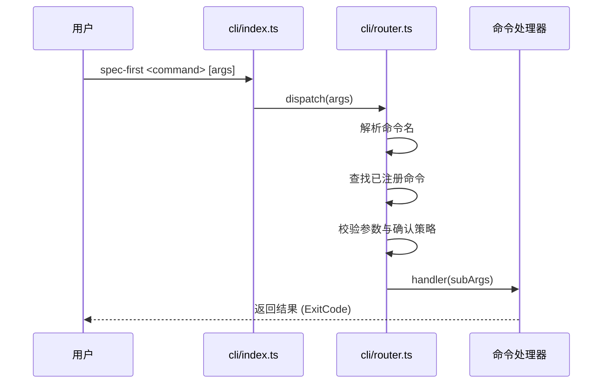
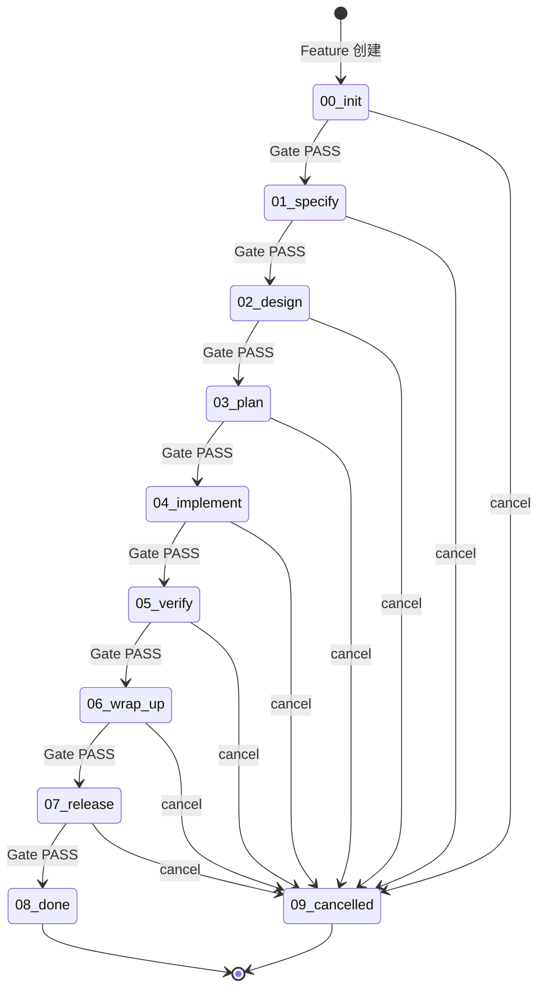
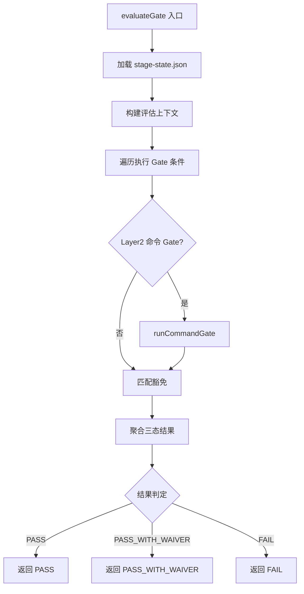
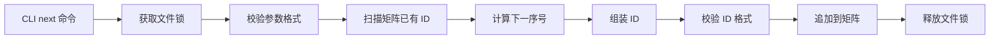
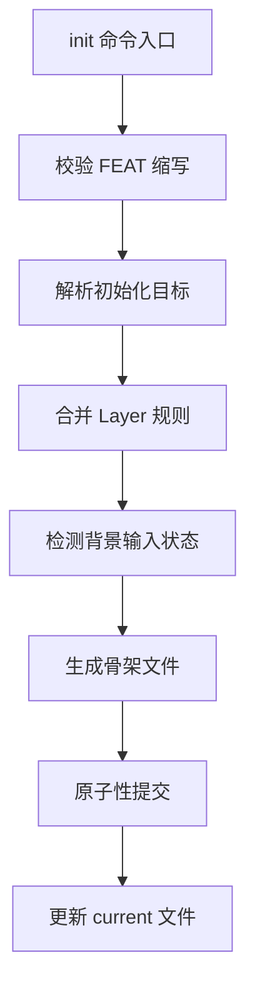
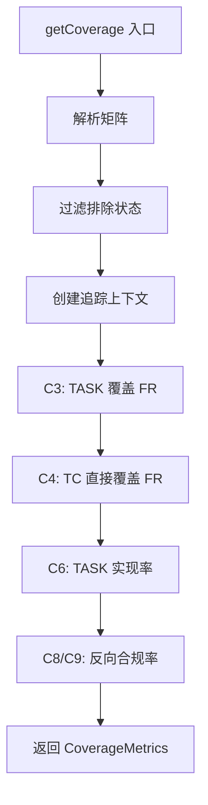
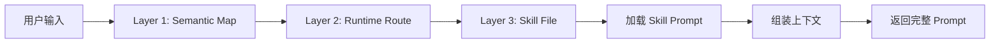
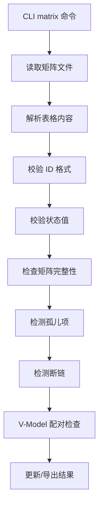

# 关键执行流程

> 本文档描述 spec-first 项目的 8 个关键执行流程，涵盖从 CLI 入口到核心业务逻辑的完整链路。
> 生成时间: 2026-03-20 | 版本: 1.1.4

---

## 流程概览

| 流程 ID | 名称 | 入口模块 | 核心模块 |
|---------|------|----------|----------|
| flow-cli-entry | CLI 入口分发 | `src/cli/index.ts` | `router.ts`, `parse-utils.ts` |
| flow-stage-lifecycle | 阶段生命周期 | `src/cli/commands/stage.ts` | `process-engine`, `gate-engine` |
| flow-gate-evaluation | Gate 门禁评估 | `src/cli/commands/gate.ts` | `gate-engine`, `trace-engine` |
| flow-id-generation | ID 生成与校验 | `src/cli/commands/id.ts` | `trace-engine` |
| flow-feature-init | Feature 初始化 | `src/cli/commands/init.ts` | `process-engine`, `template` |
| flow-coverage-calculation | 覆盖率计算 | `src/core/trace-engine/coverage.ts` | `trace-engine` |
| flow-skill-dispatch | Skill 分发路由 | `src/core/skill-runtime/dispatcher.ts` | `skill-runtime` |
| flow-matrix-sync | 追踪矩阵同步 | `src/cli/commands/matrix.ts` | `trace-engine` |

---

## 1. CLI 入口分发流程 (flow-cli-entry)

### 流程描述

CLI 入口到命令分发的完整执行链路，是所有用户交互的统一入口点。

### 执行步骤



### 详细步骤

1. **命令分发** (`src/cli/index.ts:103`)
   - 调用 `dispatch()` 分发命令行参数 (`src/cli/router.ts:dispatch()` — [显式])

2. **命令解析** (`src/cli/router.ts:79-95`)
   - 解析命令名，查找已注册命令 (`commands.get(cmd)` — [显式])

3. **参数校验** (`src/cli/router.ts:107-113`)
   - 校验参数并检查确认策略 (`evaluatePolicy()`, `shouldRequireConfirmation()` — [显式])

4. **执行处理器** (`src/cli/router.ts:115-121`)
   - 执行命令处理器 (`entry.handler(subArgs)` — [显式])

### 不变量

- 所有命令必须通过 `registerCommand()` 注册 (`src/cli/router.ts:registerCommand` — [显式])
- 需要确认的命令必须带 `--yes` 标志 (`src/cli/router.ts:shouldRequireConfirmation` — [显式])
- 错误统一返回 ExitCode 枚举值 (`src/shared/types.ts:ExitCode` — [显式])

### 验证命令

```bash
pnpm vitest run tests/unit/first-skill-docs.test.ts
pnpm typecheck
```

---

## 2. 阶段生命周期流程 (flow-stage-lifecycle)

### 流程描述

Feature 阶段状态机的推进与转换链路，确保阶段转换的单向性和质量门禁。

### 执行步骤



### 详细步骤

1. **CLI 接收命令** (`src/cli/commands/stage.ts:211-239`)
   - CLI 接收 `stage advance` 命令 (`advance(featureId, process.cwd())` — [显式])

2. **加载状态与校验终态** (`src/core/process-engine/advance.ts:129-137`)
   - 加载状态并校验终态 (`loadState()`, `isTerminal()`, `assertTransitionAllowed()` — [显式])

3. **执行依赖检查** (`src/core/process-engine/advance.ts:143-153`)
   - 执行依赖检查 (`checkDependencies()` — [显式])

4. **执行 Gate 校验** (`src/core/process-engine/advance.ts:155-212`)
   - 执行 Gate 校验（含降级策略） (`evaluateGate()` — [显式])

5. **更新状态与审计** (`src/core/process-engine/advance.ts:214-231`)
   - 更新 `stage-state.json` 并写入审计日志 (`saveState()`, `writeLog()` — [显式])

6. **校验转换合法性** (`src/core/process-engine/stage-machine.ts:30-38`)
   - 校验阶段转换合法性 (`TRANSITIONS.get(from)` — [显式])

### 不变量

- 阶段转换单向不可逆（除 `09_cancelled`） (`src/core/process-engine/stage-machine.ts:TRANSITIONS` — [显式])
- 终态阶段（`08_done`/`09_cancelled`）不可再转换 (`src/shared/types.ts:TERMINAL_STAGES` — [显式])
- Gate FAIL 必须阻断推进 (`src/core/process-engine/advance.ts:155-212` — [显式])
- `pilot_mode=true` 时 Gate 不可用可降级放行 (`src/core/process-engine/advance.ts` — [推断])

### 验证命令

```bash
pnpm vitest run tests/unit/stage-machine.test.ts
pnpm vitest run tests/unit/advance.test.ts
```

---

## 3. Gate 门禁评估流程 (flow-gate-evaluation)

### 流程描述

Gate 条件评估与三态结果判定链路，确保阶段转换的质量门槛。

### 执行步骤



### 详细步骤

1. **加载阶段状态** (`src/core/gate-engine/gate-evaluator.ts:106-113`)
   - 加载 `stage-state.json` 获取当前阶段 (`readJsonChecked()`, `isStageState()` — [显式])

2. **构建评估上下文** (`src/core/gate-engine/gate-evaluator.ts:116-119`)
   - 构建评估上下文（矩阵+覆盖率+RFC状态） (`parseMatrix()`, `loadRfcStatuses()`, `getCoverage()` — [显式])

3. **遍历执行条件** (`src/core/gate-engine/gate-evaluator.ts:123-137`)
   - 遍历执行所有 Gate 条件评估函数 (`getConditions()`, `def.evaluate(ctx)` — [显式])

4. **执行 Layer2 命令 Gate** (`src/core/gate-engine/gate-evaluator.ts:139-156`)
   - 执行 Layer2 命令 Gate（如有配置） (`runCommandGate()` — [显式])

5. **匹配豁免** (`src/core/gate-engine/gate-evaluator.ts:159-186`)
   - 匹配豁免并标记 WAIVER 状态 (`validateExceptions()` — [显式])

6. **聚合结果** (`src/core/gate-engine/gate-evaluator.ts:188-199`)
   - 聚合三态结果（PASS/PASS_WITH_WAIVER/FAIL）

### 不变量

- Gate 条件分 blocking 和 warning 两级 (`src/core/gate-engine/condition-registry.ts` — [显式])
- PASS_WITH_WAIVER 必须有有效 Exception 支持 (`src/core/trace-engine/exception-validator.ts` — [显式])
- warning 级失败不影响最终 PASS 判定 (`src/core/gate-engine/gate-evaluator.ts` — [推断])
- 结果持久化到 `gate-history.jsonl` (`src/core/gate-engine/gate-evaluator.ts` — [显式])

### 验证命令

```bash
pnpm vitest run tests/unit/gate-evaluator.test.ts
pnpm vitest run tests/unit/condition-registry.test.ts
```

---

## 4. ID 生成与校验流程 (flow-id-generation)

### 流程描述

追溯 ID 的生成、校验与矩阵写入链路，确保追溯 ID 的唯一性和格式规范。

### 执行步骤



### 详细步骤

1. **CLI 解析参数** (`src/cli/commands/id.ts:91-99`)
   - CLI 解析参数并调用 `nextId()` (`nextId({ type, abbr, featureId, projectRoot, tcLevel })` — [显式])

2. **获取锁与校验** (`src/core/trace-engine/id-generator.ts:31-35`)
   - 获取文件锁，校验参数格式 (`withFileLock()`, `validateAbbr()` — [显式])

3. **扫描与计算** (`src/core/trace-engine/id-generator.ts:37-41`)
   - 扫描矩阵已有 ID，计算下一序号 (`parseMatrixIds()`, `findNextSeq()`, `assembleId()` — [显式])

4. **校验 ID 格式** (`src/core/trace-engine/id-generator.ts:43-46`)
   - 校验生成的 ID 格式有效性 (`validateId()` — [显式])

5. **写入矩阵** (`src/core/trace-engine/id-generator.ts:48`)
   - 追加新行到 `traceability-matrix.md` (`appendToMatrix()` — [显式])

### 不变量

- ID 格式：`{TYPE}-{ABBR}-{SEQ}`（TC 除外） (`src/core/trace-engine/id-validator.ts` — [显式])
- 序号从 001 开始，自动递增 (`src/core/trace-engine/id-generator.ts:findNextSeq` — [显式])
- 缩写必须为 1-16 位大写字母+数字 (`src/core/trace-engine/id-validator.ts:validateAbbr` — [显式])
- 写矩阵前必须获取文件锁 (`src/shared/file-lock.ts` — [显式])

### 验证命令

```bash
pnpm vitest run tests/unit/id-generator.test.ts
pnpm vitest run tests/unit/id-validator.test.ts
```

---

## 5. Feature 初始化流程 (flow-feature-init)

### 流程描述

Feature 工作区初始化与骨架文件生成链路，确保 Feature 目录结构的规范性。

### 执行步骤



### 详细步骤

1. **校验缩写与解析目标** (`src/core/process-engine/init.ts:880-927`)
   - 校验 FEAT 缩写并解析初始化目标 (`validateFeat()`, `resolveFeatureInitTargets()` — [显式])

2. **合并 Layer 规则** (`src/core/process-engine/init.ts:886-889`)
   - 合并 Layer 规则并检测背景输入状态 (`mergeLayerRules()`, `detectBackgroundInputStatus()` — [显式])

3. **生成骨架文件** (`src/core/process-engine/init.ts:779-806`)
   - 生成骨架文件（`stage-state.json`, `prd.md`, `task_plan.md` 等） (`writeJson()`, `writeMarkdown()`, `skeletonPrd()`, `skeletonTaskPlan()` — [显式])

4. **原子性提交** (`src/core/process-engine/init.ts:808-849`)
   - 原子性提交：重命名临时目录并注册 FEAT (`renameSync()`, `registerFeatUnlocked()` — [显式])

5. **更新 current 文件** (`src/core/process-engine/init.ts:644-647`)
   - 更新 `.spec-first/current` 文件 (`writeCurrentFeature()` — [显式])

### 不变量

- Feature ID 格式：`FSREQ-YYYYMMDD-FEAT-NNN` (`src/core/process-engine/init.ts` — [显式])
- FEAT 缩写全局唯一（通过注册表保证） (`src/core/process-engine/init.ts:registerFeatUnlocked` — [显式])
- 已存在的 Feature 幂等返回（不覆盖） (`src/core/process-engine/init.ts` — [推断])
- 使用临时目录+rename 保证原子性 (`src/core/process-engine/init.ts:808-849` — [显式])

### 验证命令

```bash
pnpm vitest run tests/unit/init.test.ts
pnpm typecheck
```

---

## 6. 覆盖率计算流程 (flow-coverage-calculation)

### 流程描述

覆盖率指标（C3/C4/C6/C8/C9）计算链路，确保追溯矩阵的完整性度量。

### 执行步骤



### 详细步骤

1. **解析矩阵与过滤** (`src/core/trace-engine/coverage.ts:18-31`)
   - 解析矩阵并过滤排除状态 (`parseMatrix()`, `loadValidExceptionFrIds()` — [显式])

2. **创建追踪上下文** (`src/core/trace-engine/coverage.ts:32-38`)
   - 创建追踪上下文 (`createTraceContext()` — [显式])

3. **C3 计算** (`src/core/trace-engine/coverage.ts:44-60`)
   - C3: 计算 TASK 对 FR 的覆盖率（支持传递） (`lineage.collectCoveredTargetIds()` — [显式])

4. **C4 计算** (`src/core/trace-engine/coverage.ts:63-65`)
   - C4: 计算 TC 对 FR 的直接覆盖率 (`calcUpstreamCoverage()` — [显式])

5. **C6 计算** (`src/core/trace-engine/coverage.ts:68-74`)
   - C6: 计算 TASK 实现率（状态=Implemented/Verified/Accepted）

6. **C8/C9 计算** (`src/core/trace-engine/coverage.ts:79-113`)
   - C8/C9: 计算反向合规率（无孤儿 TASK/TC） (`lineage.hasAnyAncestor()` — [显式])

### 不变量

- 覆盖率值统一为 0~1 比例 (`src/core/trace-engine/coverage.ts` — [显式])
- C3 支持传递链（TASK→DS→FR） (`src/core/trace-engine/upstream-lineage.ts` — [显式])
- C4 仅支持直接关联（TC→FR） (`src/core/trace-engine/coverage.ts:63-65` — [显式])
- Exception 状态的 FR 从分母排除（需有效 RFC） (`src/core/trace-engine/exception-validator.ts` — [显式])

### 验证命令

```bash
pnpm vitest run tests/unit/coverage.test.ts
pnpm vitest run tests/unit/trace-context.test.ts
```

---

## 7. Skill 分发路由流程 (flow-skill-dispatch)

### 流程描述

Skill 命令解析、路由分发与 Prompt 组装链路，实现三层路由机制。

### 三层路由架构



### 详细步骤

1. **解析命令格式** (`src/core/skill-runtime/dispatcher.ts:258-291`)
   - 解析命令格式（`namespace:skillName`）

2. **语义映射** (`src/core/skill-runtime/dispatcher.ts:278-290`)
   - 语义映射（如 `rfc approve` → `rfc transition approved`） (`SEMANTIC_MAP[key]` — [显式])

3. **Runtime 命令分发** (`src/core/skill-runtime/dispatcher.ts:292-298`)
   - Runtime 命令直接分发到 CLI (`RUNTIME_COMMANDS.has(skillName)` — [显式])

4. **Skill 路由** (`src/core/skill-runtime/dispatcher.ts:300-338`)
   - Skill 路由：查找 SKILL.md 文件路径 (`resolveSkillPath()` — [显式])

5. **加载与组装 Prompt** (`src/core/skill-runtime/dispatcher.ts:420-554`)
   - 加载并组装 Skill Prompt（含上下文注入） (`loadSkill()`, `assemblePrompt()`, `evaluateSkillHardGate()` — [显式])

### 不变量

- Skill 三层路由：Semantic Map → Runtime Route → Skill File (`src/core/skill-runtime/dispatcher.ts` — [显式])
- 本地 `skills/` 优先于包级 `skills/` (`src/core/skill-runtime/dispatcher.ts:resolveSkillPath` — [显式])
- Hard Gate 阻断时抛出 `HardGateBlockedError` (`src/core/skill-runtime/hard-gate.ts` — [显式])
- Prompt 必须包含 Next Steps 小节 (`src/core/skill-runtime/prompt-assembler.ts` — [推断])

### 验证命令

```bash
pnpm vitest run tests/unit/dispatcher.test.ts
pnpm vitest run tests/unit/prompt-assembler.test.ts
```

---

## 8. 追踪矩阵同步流程 (flow-matrix-sync)

### 流程描述

追踪矩阵的解析、校验与更新链路，确保追溯关系的完整性。

### 执行步骤



### 详细步骤

1. **读取与解析** (`src/core/trace-engine/matrix.ts:45-51`)
   - 读取 `traceability-matrix.md` 并解析表格 (`readMarkdown()`, `parseMatrixContent()` — [显式])

2. **校验 ID 与状态** (`src/core/trace-engine/matrix.ts:160-198`)
   - 解析每行并校验 ID 格式与状态值 (`validateId()`, `normalizeStatus()` — [显式])

3. **检查矩阵完整性** (`src/core/trace-engine/matrix.ts:54-101`)
   - 检查矩阵完整性（孤儿项、断链、V-Model 配对） (`checkMatrix()`, `createTraceContext()` — [显式])

4. **更新矩阵** (`src/core/trace-engine/matrix.ts:118-136`)
   - 更新矩阵行状态或关联 (`updateMatrixRow()`, `rowsToMarkdown()` — [显式])

### 不变量

- ID 格式非法直接抛错（不降级） (`src/core/trace-engine/matrix.ts` — [显式])
- 状态值必须为有效枚举（Planned/Implemented/Verified 等） (`src/shared/status-mapper.ts` — [显式])
- 孤儿项（无 upstream）产生警告 (`src/core/trace-engine/matrix.ts:checkMatrix` — [推断])
- V-Model 配对检查（REQ↔ATP, SYS↔STP 等） (`src/core/trace-engine/matrix.ts` — [推断])

### 验证命令

```bash
pnpm vitest run tests/unit/matrix.test.ts
pnpm vitest run tests/unit/id-validator.test.ts
```

---

## 模块间集成点

### CLI → Core

- **描述**: CLI 命令调用 Core 模块函数
- **模块**: `src/cli/commands/*` → `src/core/*`
- **模式**: `handleXxx()` 调用 core 模块导出函数

### Gate → Trace

- **描述**: Gate 评估依赖追踪矩阵与覆盖率计算
- **模块**: `src/core/gate-engine` → `src/core/trace-engine`
- **模式**: `evaluateGate()` 调用 `parseMatrix()` 和 `getCoverage()` (`critical-flows.json:flow-gate-evaluation` — [显式])

### Advance → Gate + Dependency

- **描述**: 阶段推进依赖 Gate 校验与依赖检查
- **模块**: `src/core/process-engine` → `src/core/gate-engine`
- **模式**: `advance()` 调用 `checkDependencies()` 和 `evaluateGate()` (`critical-flows.json:flow-stage-lifecycle` — [显式])

### Skill → Runtime

- **描述**: Skill 加载依赖运行时上下文与配置
- **模块**: `src/core/skill-runtime` → `src/shared/config-schema.ts`
- **模式**: `loadSkill()` 调用 `loadConfig()` 和 `resolveSkillContext()` (`critical-flows.json:flow-skill-dispatch` — [显式])

---

## 证据来源

| 证据路径 | 描述 | 类型 |
|----------|------|------|
| `src/cli/index.ts:103` | CLI 入口分发 | [显式] |
| `src/cli/router.ts:79-121` | 命令路由与执行 | [显式] |
| `src/core/process-engine/advance.ts:129-231` | 阶段推进核心逻辑 | [显式] |
| `src/core/process-engine/stage-machine.ts:30-38` | 阶段转换规则 | [显式] |
| `src/core/gate-engine/gate-evaluator.ts:106-199` | Gate 评估核心逻辑 | [显式] |
| `src/core/gate-engine/condition-registry.ts:41` | Gate 条件注册 | [显式] |
| `src/core/trace-engine/id-generator.ts:30-48` | ID 生成逻辑 | [显式] |
| `src/core/trace-engine/id-validator.ts` | ID 校验规则 | [显式] |
| `src/core/trace-engine/coverage.ts:18-113` | 覆盖率计算逻辑 | [显式] |
| `src/core/trace-engine/matrix.ts:45-198` | 矩阵解析与校验 | [显式] |
| `src/core/skill-runtime/dispatcher.ts:258-554` | Skill 分发路由 | [显式] |
| `src/shared/types.ts:7-248` | 核心类型定义 | [显式] |
