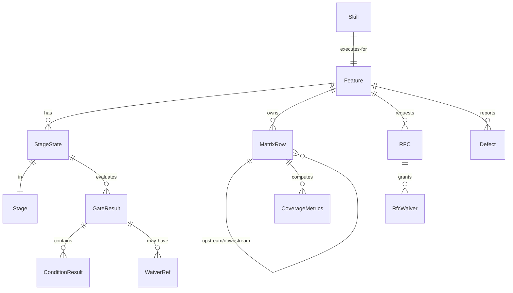
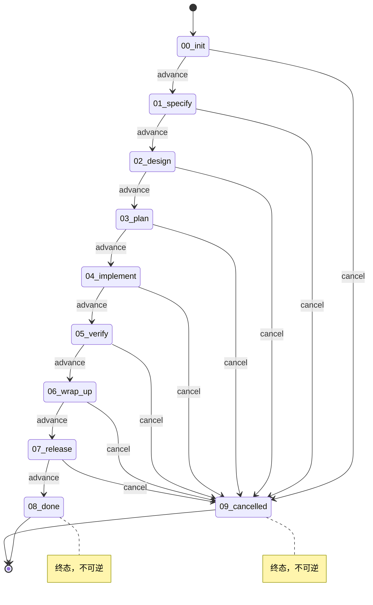
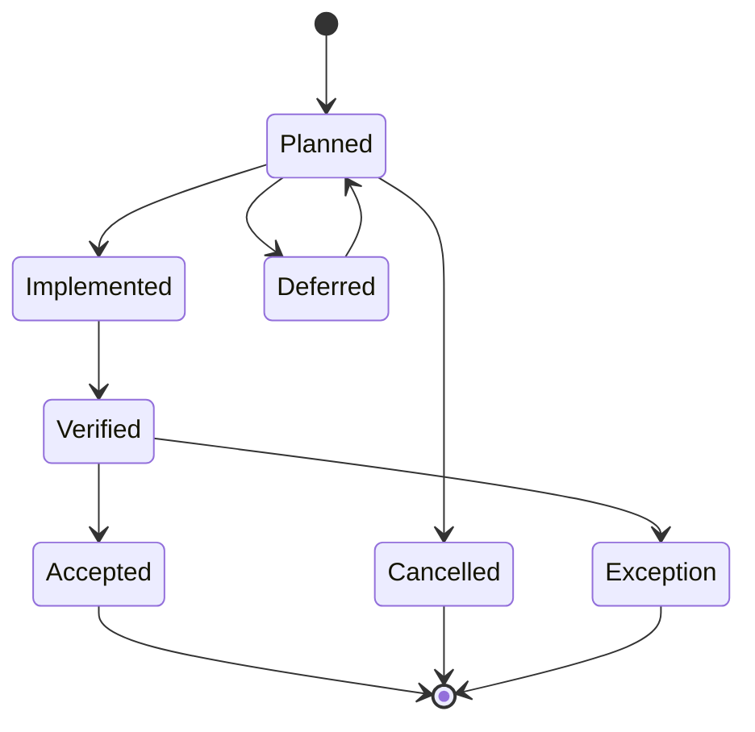
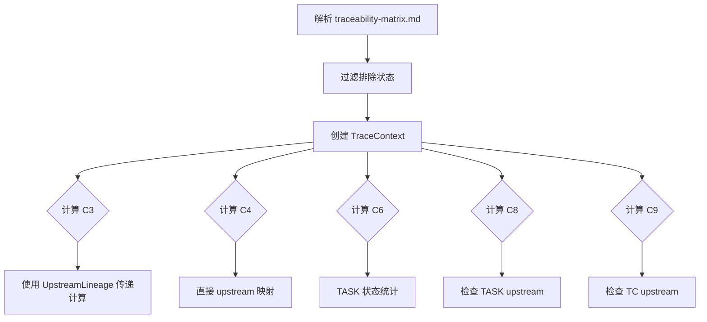
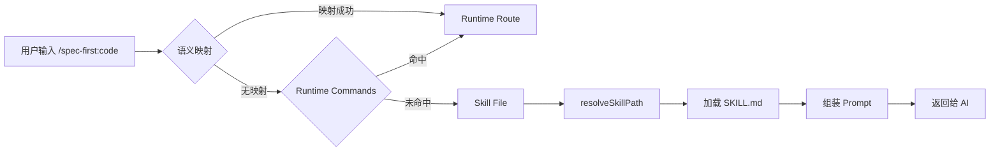
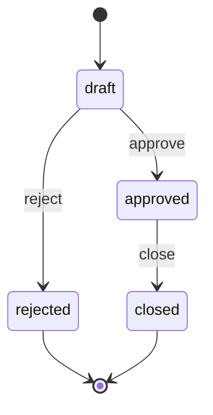
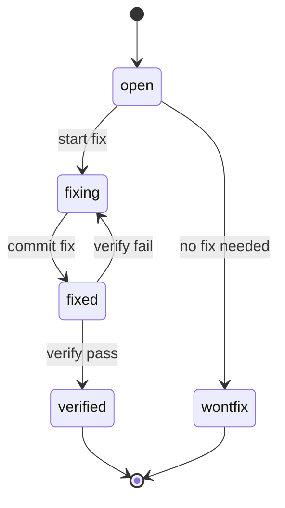

# Spec-First 领域模型

本文档描述 Spec-First 规范驱动开发引擎的核心领域概念、状态机定义和业务规则。

## 1. 核心领域概念

### 1.1 概念清单

| 概念名称 | 说明 | 类型 | 代码位置 |
|----------|------|------|----------|
| Feature | 功能特性工作区，聚合根 | Aggregate Root | `src/core/process-engine/feature.ts` |
| Stage | 开发阶段枚举（8 活跃 + 2 终态） | Enum | `src/shared/types.ts` |
| StageState | Feature 在某阶段的运行时状态 | Entity | `src/shared/types.ts` |
| Gate | 质量门禁，阶段推进前的校验 | Entity | `src/core/gate-engine/` |
| GateCondition | 单个门禁条件 | Value Object | `src/core/gate-engine/condition-registry.ts` |
| GateResult | Gate 评估结果 | Value Object | `src/shared/types.ts` |
| Trace | 追溯 ID 体系 | Value Object | `src/core/trace-engine/` |
| MatrixRow | 追溯矩阵行 | Entity | `src/shared/types.ts` |
| CoverageMetrics | 覆盖率指标（C3/C4/C6/C8/C9） | Value Object | `src/shared/types.ts` |
| Skill | AI 技能定义（prompt 模板） | Entity | `skills/spec-first/*/SKILL.md` |
| RFC | 变更请求记录 | Entity | `src/core/change-mgr/rfc.ts` |
| Defect | 缺陷记录 | Entity | `src/shared/types.ts` |
| Waiver | 豁免记录 | Value Object | `src/shared/types.ts` |
| KnownException | 已知例外 | Entity | `src/shared/types.ts` |

### 1.2 领域关系图



## 2. Stage 状态机

### 2.1 阶段定义

```typescript
enum Stage {
  INIT = '00_init',           // 初始化
  SPECIFY = '01_specify',     // 需求定义
  DESIGN = '02_design',       // 设计
  PLAN = '03_plan',           // 计划
  IMPLEMENT = '04_implement', // 实现
  VERIFY = '05_verify',       // 验证
  WRAP_UP = '06_wrap_up',     // 收尾
  RELEASE = '07_release',     // 发布
  DONE = '08_done',           // 完成（终态）
  CANCELLED = '09_cancelled', // 取消（终态）
}
```

### 2.2 状态转换图



### 2.3 转换规则

- **单向不可逆**：Stage 只能向前推进，不可回退
- **终态锁定**：`08_done` 和 `09_cancelled` 为终态，进入后不可再转换
- **门禁强制**：每次 `advance` 前必须通过 Gate 校验

代码位置：`src/core/process-engine/stage-machine.ts`

## 3. 追溯 ID 体系

### 3.1 ID 类型

**业务链路 ID（5 类）**

| 类型 | 说明 | 格式示例 |
|------|------|----------|
| FR | 功能需求 | `FR-AUTH-001` |
| DS | 设计规格 | `DS-AUTH-001` |
| TASK | 任务 | `TASK-AUTH-001` |
| TC | 测试用例 | `TC-UT-AUTH-001` |
| RFC | 变更请求 | `RFC-001` |

**V-Model ID（8 类）**

| 正向阶段 | 对应测试 |
|----------|----------|
| REQ（需求） | ATP（验收测试） |
| SYS（系统） | STP（系统测试） |
| ARCH（架构） | ITP（集成测试） |
| MOD（模块） | UTP（单元测试） |

**顶层 ID**

| 类型 | 说明 |
|------|------|
| Feature | 功能特性标识 |

### 3.2 ID 生成规则

```
{TYPE}-{ABBR}-{SEQ}        // 通用格式
TC-{LEVEL}-{ABBR}-{SEQ}    // TC 专用（含级别前缀）
RFC-{SEQ}                  // RFC 专用（无缩写）
```

- **ABBR**：1-16 位大写字母+数字，首字符必须是字母
- **SEQ**：3 位零填充序号（001, 002, ...）
- **TC Level**：`UT` | `IT` | `E2E` | `ST`

代码位置：`src/core/trace-engine/id-generator.ts`

### 3.3 追溯矩阵结构

| ID | Type | Title | Status | Upstream | Downstream |
|----|------|-------|--------|----------|------------|
| FR-AUTH-001 | FR | 用户登录 | Verified | REQ-AUTH-001 | TASK-AUTH-001 |
| TASK-AUTH-001 | TASK | 实现登录 API | Implemented | FR-AUTH-001 | TC-UT-AUTH-001 |

**MatrixStatus 状态流转**



## 4. Gate 质量门禁

### 4.1 门禁条件总览

| 阶段 | 条件 ID | 描述 | 阻塞 |
|------|---------|------|------|
| 00_init | G-INIT-01 | Feature 目录存在 | Yes |
| 00_init | G-INIT-02 | Mode/Size/Platforms 已确认 | Yes |
| 00_init | G-INIT-03 | stage-state.json 存在 | Yes |
| 01_specify | G-SPEC-00 | PRD 存在且 C-PRD >= 85% | No (warning) |
| 01_specify | G-SPEC-01 | spec.md 存在 | Yes |
| 01_specify | G-SPEC-02 | FR/NFR ID 已分配 | Yes |
| 01_specify | G-SPEC-03 | Spec 质量分 C10 >= 80% | No (warning) |
| 02_design | G-DESIGN-01 | design.md 存在 | Yes |
| 02_design | G-DESIGN-03 | Constitution 合规 C11 | No (warning) |
| 03_plan | G-PLAN-01 | Task 覆盖率 C3 = 100% | Yes |
| 03_plan | G-PLAN-02 | Task 合规率 C8 = 100% | Yes |
| 03_plan | G-PLAN-03 | Analyze CRITICAL = 0 | Yes |
| 04_implement | G-IMPL-01 | 测试覆盖率 C4 达阈值 | Yes |
| 05_verify | G-VERIFY-01 | 测试覆盖率 C4 达阈值 | Yes |
| 05_verify | G-VERIFY-03 | TC 合规率 C9 = 100% | Yes |
| 06_wrap_up | G-WRAP-01 | 实现覆盖率 C6 = 100% | Yes |
| 06_wrap_up | G-WRAP-02 | 所有矩阵项为终态 | Yes |
| 07_release | G-REL-01 | Release note 存在 | Yes |
| 07_release | G-REL-02 | Smoke test report 存在 | Yes |

代码位置：`src/core/gate-engine/condition-registry.ts`

### 4.2 Gate 结果状态

```typescript
type GateStatus = 'PASS' | 'PASS_WITH_WAIVER' | 'FAIL';
```

- **PASS**：所有阻塞条件通过
- **PASS_WITH_WAIVER**：部分条件通过豁免
- **FAIL**：存在未通过的阻塞条件

## 5. 覆盖率指标

### 5.1 指标定义

| 指标 | 名称 | 计算逻辑 | 目标 |
|------|------|----------|------|
| C3 | Task Coverage | FR 被 TASK 覆盖的比例（支持传递） | 100% |
| C4 | Test Coverage (FR) | FR 被 TC 覆盖的比例（直接映射） | 配置阈值 |
| C6 | Impl Coverage | TASK 状态为 Implemented/Verified/Accepted 的比例 | 100% |
| C8 | Task Compliance | TASK 有上游 FR/NFR/DS 的比例 | 100% |
| C9 | TC Compliance | TC 有上游 FR 的比例 | 100% |

### 5.2 覆盖率计算流程



代码位置：`src/core/trace-engine/coverage.ts`

## 6. Skill 技能体系

### 6.1 Skill 路由机制



### 6.2 三层路由详解

1. **Semantic Map**：复合命令映射
   - `rfc approve` → `rfc transition {id} approved`
   - `defect fix` → `defect update {id} --status fixing`

2. **Runtime Commands**：直接 CLI 分发
   - `id`, `matrix`, `stage`, `rfc`, `defect`, `metrics`, `gate`, `feature` 等

3. **Skill File**：SKILL.md 文件查找
   - 优先级：项目本地 `skills/` → 包级 `skills/`

代码位置：`src/core/skill-runtime/dispatcher.ts`

## 7. 变更管理

### 7.1 RFC 状态机



### 7.2 Defect 状态机



## 8. 关键业务规则

### 8.1 阶段推进规则

1. Gate 校验通过（或 PASS_WITH_WAIVER）
2. 终态不可逆
3. 每次推进记录 history

### 8.2 追溯完整性规则

1. FR 必须有 REQ upstream
2. TASK 必须有 FR/DS upstream
3. TC 必须有 FR upstream
4. V-Model 配对：REQ↔ATP, SYS↔STP, ARCH↔ITP, MOD↔UTP

### 8.3 豁免机制

1. 豁免必须关联 RFC
2. 豁免有过期时间
3. 豁免必须有 rollback point

---

*本文档基于代码静态分析生成，分析时间：2026-03-16*
