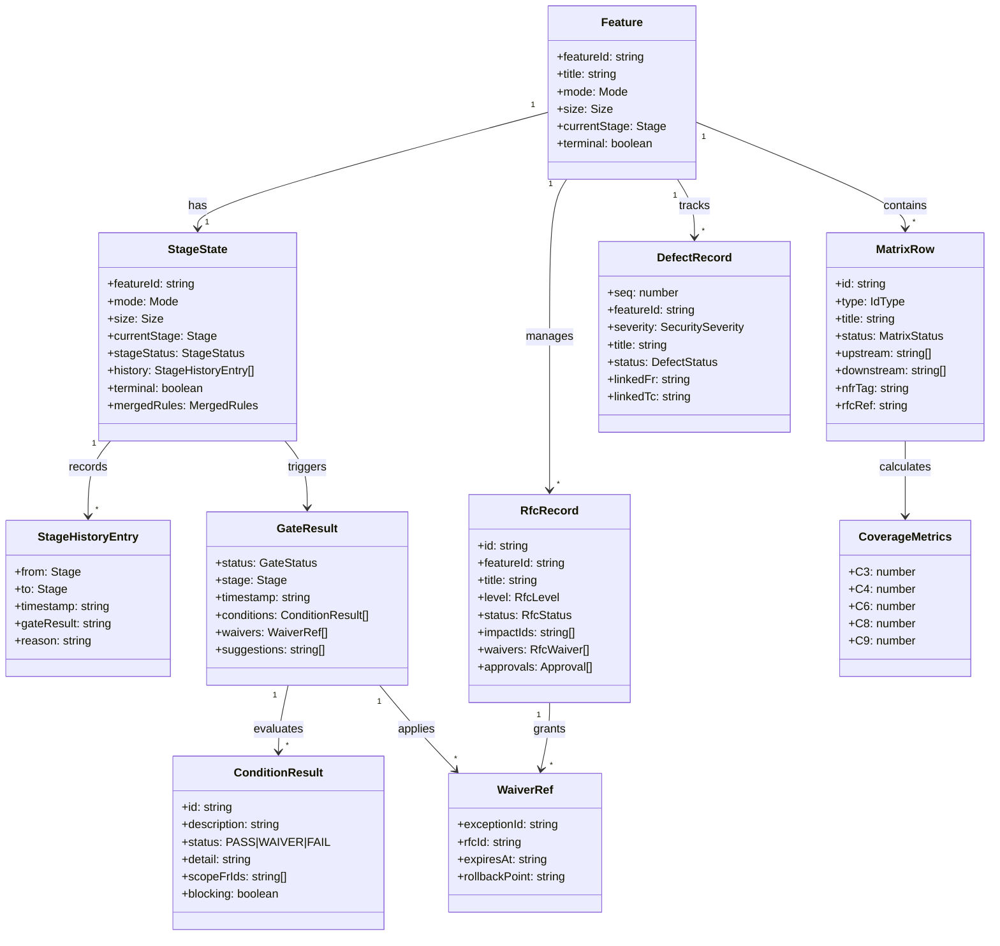

# Spec-First 核心领域模型

> 基于 `src/shared/types.ts` 类型定义分析

## 领域模型总览



---

## 核心枚举

### Stage（阶段枚举）

阶段是 Feature 生命周期的核心驱动器，**单向不可逆流转**。

| 值 | 名称 | 说明 |
|---|------|------|
| `00_init` | 初始化 | Feature 创建，目录初始化 |
| `01_specify` | 需求定义 | PRD 编写，FR 拆分 |
| `02_design` | 设计 | 技术设计，DS 产出 |
| `03_plan` | 计划 | 任务拆分，TASK 规划 |
| `04_implement` | 实现 | 代码开发 |
| `05_verify` | 验证 | 测试执行，TC 覆盖 |
| `06_wrap_up` | 收尾 | 文档整理，验收准备 |
| `07_release` | 发布 | 上线部署 |
| `08_done` | 完成 | 终态 |
| `09_cancelled` | 取消 | 终态 |

### IdType（追溯 ID 类型）

14 类追溯 ID，分为三组：

| 类型 | 前缀 | 用途 |
|------|------|------|
| **业务链路** | | |
| Feature | `FSREQ-*` | 顶层 Feature 标识 |
| FR | `FR-*` | 功能需求 |
| DS | `DS-*` | 设计规格 |
| TASK | `TASK-*` | 实现任务 |
| TC | `TC-*` | 测试用例 |
| RFC | `RFC-*` | 变更请求 |
| **V-Model 需求层级** | | |
| REQ | `REQ-*` | 业务需求 |
| SYS | `SYS-*` | 系统需求 |
| ARCH | `ARCH-*` | 架构需求 |
| MOD | `MOD-*` | 模块需求 |
| **V-Model 测试层级** | | |
| ATP | `ATP-*` | 验收测试计划 |
| STP | `STP-*` | 系统测试计划 |
| ITP | `ITP-*` | 集成测试计划 |
| UTP | `UTP-*` | 单元测试计划 |

---

## 核心实体

### StageState（阶段状态）

Feature 的运行时状态，存储于 `stage-state.json`。

| 字段 | 类型 | 说明 |
|------|------|------|
| `featureId` | `string` | Feature 唯一标识 |
| `mode` | `Mode` | N（New）或 I（Incremental） |
| `size` | `Size` | S/M/L 规模 |
| `platforms` | `string[]` | 目标平台 |
| `currentStage` | `Stage` | 当前阶段 |
| `stageStatus` | `StageStatus` | 阶段内状态 |
| `history` | `StageHistoryEntry[]` | 阶段流转历史 |
| `terminal` | `boolean` | 是否已终态 |
| `mergedRules` | `MergedRules` | 合并后的规则配置 |
| `createdAt` | `string` | 创建时间 |
| `updatedAt` | `string` | 更新时间 |

**StageStatus 取值**：
- `drafting` - 草稿中
- `awaiting_review` - 待评审
- `review_failed` - 评审失败
- `ready_to_advance` - 可推进
- `advanced` - 已推进

---

### MatrixRow（追踪矩阵行）

追溯矩阵的核心单元，建立 ID 间的上下游关系。

| 字段 | 类型 | 说明 |
|------|------|------|
| `id` | `string` | 唯一标识（FR-XXX 等） |
| `type` | `IdType` | ID 类型 |
| `title` | `string` | 标题 |
| `status` | `MatrixStatus` | 状态 |
| `upstream` | `string[]` | 上游 ID 列表 |
| `downstream` | `string[]` | 下游 ID 列表 |
| `nfrTag` | `string` | 非功能需求标签 |
| `rfcRef` | `string` | 关联 RFC |

**MatrixStatus 取值**：
- `Planned` - 已规划
- `Implemented` - 已实现
- `Verified` - 已验证
- `Accepted` - 已验收（终态）
- `Deferred` - 延期
- `Cancelled` - 已取消（终态）
- `Exception` - 例外（终态）

---

### GateResult（门禁结果）

阶段推进前的质量门禁评估结果。

| 字段 | 类型 | 说明 |
|------|------|------|
| `status` | `GateStatus` | 整体状态 |
| `stage` | `Stage` | 评估阶段 |
| `timestamp` | `string` | 评估时间 |
| `conditions` | `ConditionResult[]` | 条件评估列表 |
| `waivers` | `WaiverRef[]` | 豁免引用 |
| `suggestions` | `string[]` | 改进建议 |

**GateStatus 取值**：
- `PASS` - 通过
- `PASS_WITH_WAIVER` - 带豁免通过
- `FAIL` - 失败

---

### ConditionResult（条件结果）

单个门禁条件的评估结果。

| 字段 | 类型 | 说明 |
|------|------|------|
| `id` | `string` | 条件 ID |
| `description` | `string` | 条件描述 |
| `status` | `PASS \| WAIVER \| FAIL` | 评估状态 |
| `detail` | `string` | 详细说明 |
| `scopeFrIds` | `string[]` | 相关 FR 列表 |
| `blocking` | `boolean` | 是否阻塞（默认 true） |

---

### CoverageMetrics（覆盖率指标）

5 项覆盖率指标，用于质量评估。

| 指标 | 名称 | 计算方式 |
|------|------|----------|
| **C3** | 任务覆盖率 | TASK 覆盖 FR（支持传递链） |
| **C4** | 测试覆盖率 | TC **直接**覆盖 FR（不支持传递） |
| **C6** | 实现覆盖率 | TASK 已实现比例 |
| **C8** | 任务合规率 | TASK 有上游 FR 比例 |
| **C9** | TC 合规率 | TC 有上游 FR 比例 |

---

### RfcRecord（变更请求记录）

RFC（Request For Change）变更管理。

| 字段 | 类型 | 说明 |
|------|------|------|
| `id` | `string` | RFC 唯一标识 |
| `featureId` | `string` | 所属 Feature |
| `title` | `string` | 变更标题 |
| `level` | `RfcLevel` | 变更级别 |
| `status` | `RfcStatus` | RFC 状态 |
| `impactIds` | `string[]` | 影响 ID 列表 |
| `waivers` | `RfcWaiver[]` | 豁免列表 |
| `approvals` | `Approval[]` | 审批记录 |

**RfcLevel 取值**：
- `Minor` - 小变更
- `Major` - 大变更
- `Critical` - 关键变更

**RfcStatus 取值**：
- `draft` - 草稿
- `approved` - 已批准
- `closed` - 已关闭
- `rejected` - 已拒绝

---

### DefectRecord（缺陷记录）

缺陷跟踪管理。

| 字段 | 类型 | 说明 |
|------|------|------|
| `seq` | `number` | 序号 |
| `featureId` | `string` | 所属 Feature |
| `severity` | `SecuritySeverity` | 严重程度 |
| `title` | `string` | 缺陷标题 |
| `description` | `string` | 详细描述 |
| `discoveredIn` | `Stage` | 发现阶段 |
| `linkedFr` | `string` | 关联 FR |
| `linkedTc` | `string` | 关联 TC |
| `status` | `DefectStatus` | 缺陷状态 |

**SecuritySeverity 取值**：
- `S1` - 致命
- `S2` - 严重
- `S3` - 一般
- `S4` - 轻微

**DefectStatus 取值**：
- `open` - 待处理
- `fixing` - 修复中
- `fixed` - 已修复
- `verified` - 已验证
- `wontfix` - 不修复

---

### FeatureSummary（Feature 摘要）

Feature 的轻量级摘要视图。

| 字段 | 类型 | 说明 |
|------|------|------|
| `featureId` | `string` | 唯一标识 |
| `title` | `string` | 标题 |
| `mode` | `Mode` | N/I |
| `size` | `Size` | S/M/L |
| `currentStage` | `Stage` | 当前阶段 |
| `terminal` | `boolean` | 是否终态 |
| `updatedAt` | `string` | 更新时间 |

---

## 实体关系说明

### 1. Feature 与 StageState

- 每个 Feature 有且仅有一个 StageState
- StageState 记录 Feature 的完整生命周期
- 阶段流转历史通过 `history[]` 保存

### 2. 追溯链路

```
FR（功能需求）
  ↓ downstream
DS（设计规格）
  ↓ downstream
TASK（实现任务）
  ↓ downstream
TC（测试用例）
```

- MatrixRow 通过 `upstream`/`downstream` 建立双向追溯
- 覆盖率 C3 支持传递链（TASK → DS → FR）
- 覆盖率 C4 仅支持直接覆盖（TC → FR）

### 3. Gate 与 Waiver

- Gate 校验失败可通过 RFC 申请豁免
- WaiverRef 引用 RFC 和 Exception
- 豁免有过期时间和回滚点

### 4. 变更管理

- RFC 可影响多个 ID（impactIds）
- Defect 可关联 FR 和 TC
- 两者都支持状态机流转

---

## 状态机流转

### Stage 状态机

```
00_init ──→ 01_specify ──→ 02_design ──→ 03_plan ──→ 04_implement
                                                         │
                                                         ↓
08_done ←── 07_release ←── 06_wrap_up ←── 05_verify ←────┘

                              └──→ 09_cancelled（任意阶段）
```

### RFC 状态机

```
draft ──→ approved ──→ closed
   │
   └──→ rejected
```

### Defect 状态机

```
open ──→ fixing ──→ fixed ──→ verified
   │                    │
   └────────────────────┴──→ wontfix
```
