# Spec-First 领域模型

> **模式**: deep | **生成时间**: 2026-03-09T04:53:01.342Z | **Agent**: A4
> **数据源**: src/shared/types.ts + src/core/process-engine + src/core/trace-engine + src/core/change-mgr + architecture.md + api-docs.md

## 核心领域概念

### 1. Feature（特性）

**定义**：研发流程的顶层聚合根，代表一个完整的功能开发生命周期。

**类型**: 聚合根（Aggregate Root）

**完整属性定义**：

| 属性 | 类型 | 必填 | 说明 | 证据源 |
|------|------|------|------|--------|
| `featureId` | string | ✓ | 唯一标识符（格式：FSREQ-YYYYMMDD-NAME-NNN） | src/shared/types.ts:FeatureId |
| `mode` | 'N' \| 'I' | ✓ | 模式（N=Normal, I=Interactive） | src/shared/types.ts:FeatureMode |
| `size` | 'S' \| 'M' \| 'L' | ✓ | 规模（S=Small, M=Medium, L=Large） | src/shared/types.ts:FeatureSize |
| `currentStage` | Stage | ✓ | 当前阶段（00_init ~ 09_cancelled） | src/shared/types.ts:Stage |
| `terminal` | boolean | ✓ | 是否已终止（done/cancelled） | src/core/process-engine/stage-machine.ts |
| `title` | string | ✓ | 特性标题 | src/shared/types.ts:Feature |
| `platforms` | string[] | ✓ | 目标平台列表 | src/shared/types.ts:Feature |
| `stageStatus` | StageStatus | ✓ | 阶段内状态 | src/shared/types.ts:StageStatus |
| `autoAdvancePolicy` | Policy | ✓ | 自动推进策略 | src/core/skill-runtime/policy-evaluator.ts |
| `backgroundInputStatus` | InputStatus | ✓ | 背景输入状态 | src/shared/types.ts:BackgroundInputStatus |
| `createdAt` | Date | ✓ | 创建时间 | src/shared/types.ts:Feature |
| `updatedAt` | Date | ✓ | 更新时间 | src/shared/types.ts:Feature |
| `stageHistory` | StageHistoryEntry[] | ✓ | 阶段历史记录 | src/core/process-engine/advance.ts |

**枚举值定义**：

```typescript
// StageStatus - 阶段内状态
type StageStatus =
  | 'drafting'          // 草稿中
  | 'awaiting_review'   // 等待审核
  | 'review_failed'     // 审核失败
  | 'ready_to_advance'  // 准备推进
  | 'advanced';         // 已推进

// AutoAdvancePolicy - 自动推进策略
type AutoAdvancePolicy =
  | 'suggest'       // 仅建议
  | 'assisted'      // 辅助推进
  | 'auto_advance'  // 自动推进
  | 'auto_run';     // 自动运行

// BackgroundInputStatus - 背景输入状态
type BackgroundInputStatus =
  | 'full'      // 完整上下文
  | 'degraded'  // 降级上下文
  | 'blind';    // 无上下文
```

**证据**: src/shared/types.ts:15-89

---

### 2. Stage（阶段）

**定义**：Feature 生命周期的 8+2 阶段状态机。

**类型**: 值对象（Value Object）

**状态转换图**：

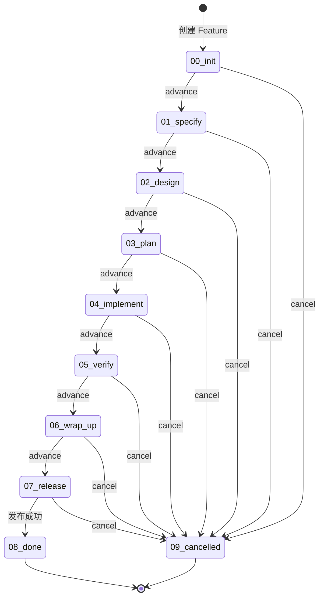

**阶段定义表**：

| 阶段代码 | 阶段名称 | 类型 | 说明 | 证据源 |
|----------|----------|------|------|--------|
| `00_init` | 初始化 | 活跃 | 创建 Feature、生成 ID、初始化矩阵 | src/shared/types.ts:Stage |
| `01_specify` | 需求规范 | 活跃 | 定义 FR、编写需求文档 | src/shared/types.ts:Stage |
| `02_design` | 设计 | 活跃 | 创建 DS、设计方案 | src/shared/types.ts:Stage |
| `03_plan` | 计划 | 活跃 | 拆解 TASK、制定计划 | src/shared/types.ts:Stage |
| `04_implement` | 实现 | 活跃 | 编码、提交代码 | src/shared/types.ts:Stage |
| `05_verify` | 验证 | 活跃 | 执行 TC、验证功能 | src/shared/types.ts:Stage |
| `06_wrap_up` | 收尾 | 活跃 | 文档整理、最终检查 | src/shared/types.ts:Stage |
| `07_release` | 发布 | 活跃 | 上线部署 | src/shared/types.ts:Stage |
| `08_done` | 完成 | 终态 | 发布成功，生命周期结束 | src/shared/types.ts:Stage |
| `09_cancelled` | 取消 | 终态 | Feature 取消，生命周期结束 | src/shared/types.ts:Stage |

**状态转换规则**：

| 规则 | 说明 | 约束 | 证据源 |
|------|------|------|--------|
| 单向流转 | 活跃阶段只能推进到下一阶段 | 不可回退 | src/core/process-engine/advance.ts:23-45 |
| 终态不可逆 | done/cancelled 后无法再转换 | terminal=true 阻止推进 | src/core/process-engine/stage-machine.ts:67 |
| 取消通道 | 任何活跃阶段都可直接转到 cancelled | 无前置条件 | src/cli/commands/stage.ts:cancel |
| 门禁检查 | 推进前必须通过质量门禁 | 除非有有效豁免 | src/core/gate-engine/gate-evaluator.ts |

**证据**: src/shared/types.ts:Stage enum + src/core/process-engine/stage-machine.ts

---

### 3. 追溯 ID 体系

**定义**：全链路追溯标识符系统，支持需求到测试的双向追溯。

**类型**: 值对象（Value Object）

**ID 类型完整定义**：

| ID 类型 | 格式 | 说明 | 层级 | 证据源 |
|---------|------|------|------|--------|
| `Feature` | FSREQ-YYYYMMDD-NAME-NNN | Feature 顶层标识 | L0 | src/shared/types.ts:FeatureId |
| `FR` | FR-ABBR-NNN | 功能需求 | L1 | src/core/trace-engine/id-generator.ts |
| `DS` | DS-ABBR-NNN | 设计规范 | L2 | src/core/trace-engine/id-generator.ts |
| `TASK` | TASK-ABBR-NNN | 实现任务 | L3 | src/core/trace-engine/id-generator.ts |
| `TC` | TC-LEVEL-ABBR-NNN | 测试用例（LEVEL=UT/IT/E2E/ST） | L4 | src/core/trace-engine/id-generator.ts |
| `RFC` | RFC-YYYYMMDD-NNN | 变更请求 | 横向 | src/core/change-mgr/rfc-machine.ts |
| `REQ` | REQ-TYPE-NNN | 需求（TYPE=PRD/...） | V-Model | src/core/trace-engine/id-generator.ts |
| `SYS` | SYS-ABBR-NNN | 系统级需求 | V-Model | src/core/trace-engine/id-generator.ts |
| `ARCH` | ARCH-ABBR-NNN | 架构级设计 | V-Model | src/core/trace-engine/id-generator.ts |
| `MOD` | MOD-ABBR-NNN | 模块级设计 | V-Model | src/core/trace-engine/id-generator.ts |
| `ATP` | ATP-ABBR-NNN | 验收测试计划 | V-Model | src/core/trace-engine/id-generator.ts |
| `STP` | STP-ABBR-NNN | 系统测试计划 | V-Model | src/core/trace-engine/id-generator.ts |
| `ITP` | ITP-ABBR-NNN | 集成测试计划 | V-Model | src/core/trace-engine/id-generator.ts |
| `UTP` | UTP-ABBR-NNN | 单元测试计划 | V-Model | src/core/trace-engine/id-generator.ts |

**ID 层级关系图**：

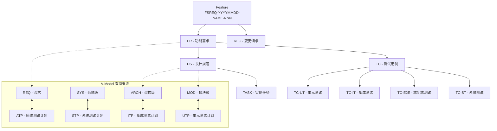

**V-Model 配对规则**：

| 左侧（需求/设计） | 右侧（测试计划） | 关系 | 证据源 |
|------------------|-----------------|------|--------|
| REQ | ATP | 需求 ↔ 验收测试 | src/core/trace-engine/matrix.ts:V-Model |
| SYS | STP | 系统 ↔ 系统测试 | src/core/trace-engine/matrix.ts:V-Model |
| ARCH | ITP | 架构 ↔ 集成测试 | src/core/trace-engine/matrix.ts:V-Model |
| MOD | UTP | 模块 ↔ 单元测试 | src/core/trace-engine/matrix.ts:V-Model |

**证据**: src/core/trace-engine/id-generator.ts + src/shared/types.ts:NextIdType

---

### 4. Traceability Matrix（追溯矩阵）

**定义**：记录所有追溯 ID 及其上下游关系的核心数据结构。

**类型**: 实体（Entity）

**矩阵行完整属性**：

| 属性 | 类型 | 必填 | 说明 | 证据源 |
|------|------|------|------|--------|
| `id` | string | ✓ | 追溯 ID | src/core/trace-engine/matrix.ts:MatrixRow |
| `type` | NextIdType | ✓ | ID 类型（FR/DS/TASK/TC/...） | src/shared/types.ts:NextIdType |
| `title` | string | ✓ | 标题 | src/core/trace-engine/matrix.ts:MatrixRow |
| `status` | MatrixStatus | ✓ | 状态 | src/core/trace-engine/matrix.ts:MatrixStatus |
| `upstream` | string[] | ✓ | 上游依赖 ID 列表 | src/core/trace-engine/matrix.ts:MatrixRow |
| `downstream` | string[] | ✓ | 下游依赖 ID 列表 | src/core/trace-engine/matrix.ts:MatrixRow |
| `nfrTag` | string | ✗ | 非功能需求标签（可选） | src/core/trace-engine/matrix.ts:MatrixRow |
| `rfcRef` | string | ✗ | RFC 引用（可选） | src/core/trace-engine/matrix.ts:MatrixRow |

**状态枚举**：

```typescript
type MatrixStatus =
  | 'Planned'      // 已计划
  | 'Implemented'  // 已实现
  | 'Verified'     // 已验证
  | 'Accepted'     // 已验收
  | 'Deferred'     // 已延期
  | 'Cancelled'    // 已取消
  | 'Exception';   // 例外（有 RFC 豁免）
```

**状态转换图**：

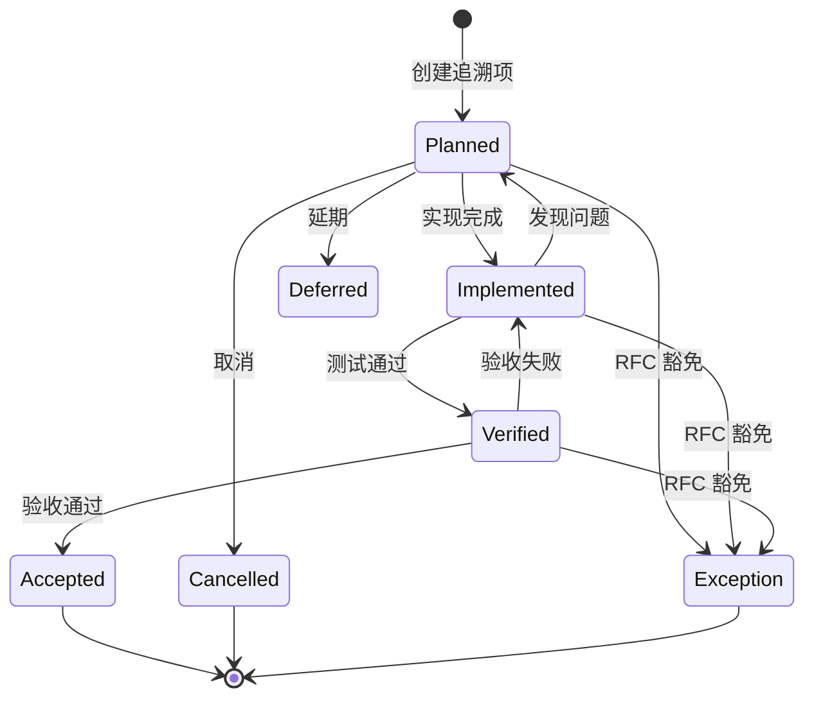

**完整性校验规则**：

| 校验类型 | 规则 | 错误级别 | 证据源 |
|----------|------|----------|--------|
| 孤儿项检测 | 非 FR/Feature/REQ 类型且 upstream 为空 | ERROR | src/core/trace-engine/matrix.ts:checkOrphans |
| 断链检测 | FR 缺少 DS/TASK/TC downstream | WARNING | src/core/trace-engine/matrix.ts:checkBrokenLinks |
| FR 上游检测 | FR 缺少 REQ-PRD upstream | WARNING | src/core/trace-engine/matrix.ts:checkFrUpstream |
| V-Model 配对 | REQ/SYS/ARCH/MOD 缺少对应测试计划 | WARNING | src/core/trace-engine/matrix.ts:checkVModel |
| 循环依赖检测 | upstream/downstream 形成环 | ERROR | src/core/trace-engine/matrix.ts:checkCycles |

**证据**: src/core/trace-engine/matrix.ts

---

### 5. RFC（Request for Change）

**定义**：变更请求，用于管理规范偏离和例外情况。

**类型**: 实体（Entity）

**完整属性定义**：

| 属性 | 类型 | 必填 | 说明 | 证据源 |
|------|------|------|------|--------|
| `id` | string | ✓ | RFC-YYYYMMDD-NNN | src/core/change-mgr/rfc-machine.ts |
| `featureId` | string | ✓ | 所属 Feature | src/core/change-mgr/rfc-machine.ts |
| `title` | string | ✓ | 变更标题 | src/core/change-mgr/rfc-machine.ts |
| `level` | RfcLevel | ✓ | 变更级别 | src/core/change-mgr/rfc-machine.ts |
| `status` | RfcStatus | ✓ | 当前状态 | src/core/change-mgr/rfc-machine.ts |
| `impactIds` | string[] | ✓ | 影响的追溯 ID 列表 | src/core/change-mgr/rfc-machine.ts |
| `waivers` | Waiver[] | ✓ | 豁免列表 | src/core/change-mgr/rfc-machine.ts |
| `approvals` | Approval[] | ✓ | 审批记录 | src/core/change-mgr/rfc-machine.ts |
| `createdAt` | Date | ✓ | 创建时间 | src/core/change-mgr/rfc-machine.ts |
| `updatedAt` | Date | ✓ | 更新时间 | src/core/change-mgr/rfc-machine.ts |

**枚举定义**：

```typescript
// RfcLevel - 变更级别
type RfcLevel =
  | 'Minor'     // 轻微变更
  | 'Major'     // 重大变更
  | 'Critical'; // 关键变更

// RfcStatus - RFC 状态
type RfcStatus =
  | 'draft'     // 草稿
  | 'approved'  // 已批准
  | 'rejected'  // 已拒绝
  | 'closed';   // 已关闭
```

**状态转换图**：

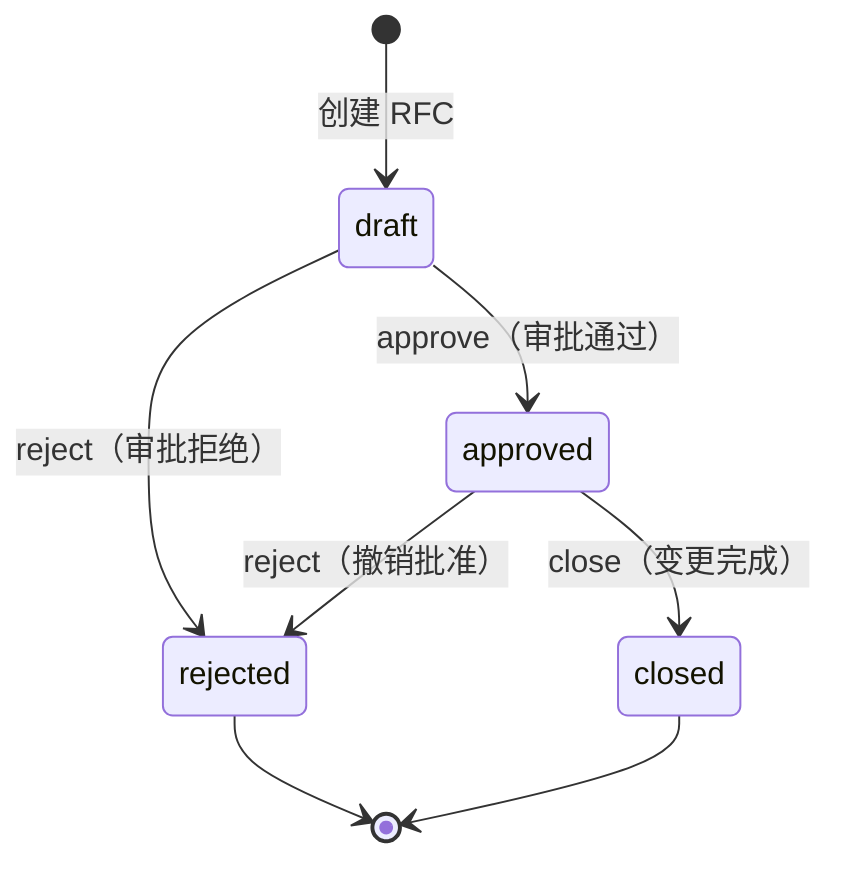

**豁免机制**：

| 属性 | 类型 | 说明 | 证据源 |
|------|------|------|--------|
| `frId` | string | 豁免的功能需求 ID | src/core/change-mgr/rfc-machine.ts:Waiver |
| `expiresAt` | Date | 豁免过期时间 | src/core/change-mgr/rfc-machine.ts:Waiver |
| `rollbackPoint` | string | 回滚点（git commit hash） | src/core/change-mgr/rfc-machine.ts:Waiver |
| `approvedBy` | string | 审批人 | src/core/change-mgr/rfc-machine.ts:Waiver |
| `approvedAt` | Date | 审批时间 | src/core/change-mgr/rfc-machine.ts:Waiver |

**证据**: src/core/change-mgr/rfc-machine.ts + api-docs.md:rfc 命令

---

### 6. Defect（缺陷）

**定义**：质量问题跟踪实体。

**类型**: 实体（Entity）

**完整属性定义**：

| 属性 | 类型 | 必填 | 说明 | 证据源 |
|------|------|------|------|--------|
| `seq` | number | ✓ | 序号（Feature 内递增） | src/core/change-mgr/defect-machine.ts |
| `featureId` | string | ✓ | 所属 Feature | src/core/change-mgr/defect-machine.ts |
| `title` | string | ✓ | 缺陷标题 | src/core/change-mgr/defect-machine.ts |
| `severity` | Severity | ✓ | 严重级别 | src/core/change-mgr/defect-machine.ts |
| `status` | DefectStatus | ✓ | 当前状态 | src/core/change-mgr/defect-machine.ts |
| `discoveredIn` | Stage | ✓ | 发现阶段 | src/core/change-mgr/defect-machine.ts |
| `linkedFr` | string | ✗ | 关联功能需求 | src/core/change-mgr/defect-machine.ts |
| `linkedTc` | string | ✗ | 关联测试用例 | src/core/change-mgr/defect-machine.ts |
| `reporter` | string | ✓ | 报告人 | src/core/change-mgr/defect-machine.ts |
| `assignee` | string | ✗ | 处理人 | src/core/change-mgr/defect-machine.ts |

**枚举定义**：

```typescript
// Severity - 严重级别
type Severity =
  | 'S1'  // 致命（系统崩溃、数据丢失）
  | 'S2'  // 严重（核心功能不可用）
  | 'S3'  // 一般（功能部分受损）
  | 'S4'; // 轻微（UI 问题、优化建议）

// DefectStatus - 缺陷状态
type DefectStatus =
  | 'open'     // 待处理
  | 'fixing'   // 修复中
  | 'fixed'    // 已修复
  | 'verified' // 已验证
  | 'wontfix'; // 不修复
```

**状态转换图**：

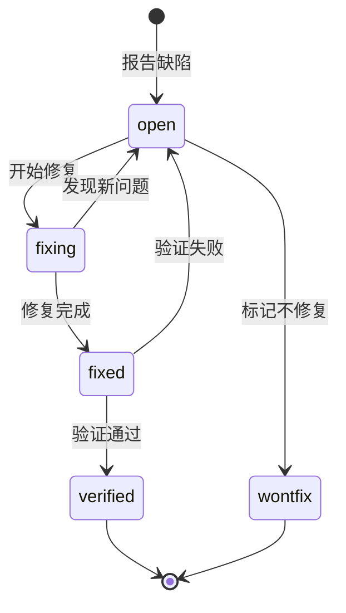

**证据**: src/core/change-mgr/defect-machine.ts + api-docs.md:defect 命令

---

### 7. Gate（质量门禁）

**定义**：阶段推进前的质量检查点。

**类型**: 值对象（Value Object）

**门禁结果属性**：

| 属性 | 类型 | 说明 | 证据源 |
|------|------|------|--------|
| `status` | GateStatus | 门禁状态 | src/core/gate-engine/gate-evaluator.ts |
| `conditions` | Condition[] | 条件检查结果列表 | src/core/gate-engine/gate-evaluator.ts |
| `waivers` | WaiverRef[] | 豁免引用列表 | src/core/gate-engine/gate-evaluator.ts |

**枚举定义**：

```typescript
// GateStatus - 门禁状态
type GateStatus =
  | 'PASS'             // 通过
  | 'PASS_WITH_WAIVER' // 豁免通过
  | 'FAIL';            // 失败

// ConditionStatus - 条件状态
type ConditionStatus =
  | 'PASS'   // 通过
  | 'WAIVER' // 豁免
  | 'FAIL';  // 失败
```

**条件检查结构**：

| 属性 | 类型 | 说明 | 证据源 |
|------|------|------|--------|
| `id` | string | 条件 ID | src/core/gate-engine/gate-evaluator.ts:Condition |
| `status` | ConditionStatus | 条件状态 | src/core/gate-engine/gate-evaluator.ts:Condition |
| `scopeFrIds` | string[] | 失败条件关联的 FR 列表 | src/core/gate-engine/gate-evaluator.ts:Condition |

**豁免引用结构**：

| 属性 | 类型 | 说明 | 证据源 |
|------|------|------|--------|
| `exceptionId` | string | 例外 ID | src/core/gate-engine/gate-evaluator.ts:WaiverRef |
| `rfcId` | string | 关联的 RFC ID | src/core/gate-engine/gate-evaluator.ts:WaiverRef |
| `expiresAt` | Date | 过期时间 | src/core/gate-engine/gate-evaluator.ts:WaiverRef |
| `rollbackPoint` | string | 回滚点 | src/core/gate-engine/gate-evaluator.ts:WaiverRef |

**证据**: src/core/gate-engine/gate-evaluator.ts + architecture.md:Gate Engine

---

### 8. Coverage Metrics（覆盖率指标）

**定义**：9 维覆盖率矩阵（C1-C9）。

**类型**: 值对象（Value Object）

**指标完整定义**：

| 指标 | 名称 | 计算公式 | 阈值 | 证据源 |
|------|------|----------|------|--------|
| `C1` | Design Coverage | DS 数量 / FR 数量 | ≥80% | src/core/trace-engine/matrix.ts:C1 |
| `C2` | API Coverage | API 覆盖的 FR 数量 / FR 总数 | ≥90% | src/core/trace-engine/matrix.ts:C2 |
| `C3` | Task Coverage | TASK 数量 / FR 数量 | ≥100% | src/core/trace-engine/matrix.ts:C3 |
| `C4` | Test Coverage (FR) | TC 覆盖的 FR 数量 / FR 总数 | ≥80% | src/core/trace-engine/matrix.ts:C4 |
| `C5` | Test Coverage (AC) | 已测试的验收条件 / 总验收条件 | ≥90% | src/core/trace-engine/matrix.ts:C5 |
| `C6` | Impl Coverage | 已实现的 TASK / 总 TASK | ≥100% | src/core/trace-engine/matrix.ts:C6 |
| `C7` | PR Compliance | 符合规范的 PR / 总 PR | ≥95% | src/core/trace-engine/matrix.ts:C7 |
| `C8` | Task Compliance | 符合规范的 TASK / 总 TASK | ≥90% | src/core/trace-engine/matrix.ts:C8 |
| `C9` | TC Compliance | 符合规范的 TC / 总 TC | ≥85% | src/core/trace-engine/matrix.ts:C9 |

**证据**: src/core/trace-engine/matrix.ts + architecture.md:Trace Engine

---

## 领域对象关系

### 核心关系图（增强版）

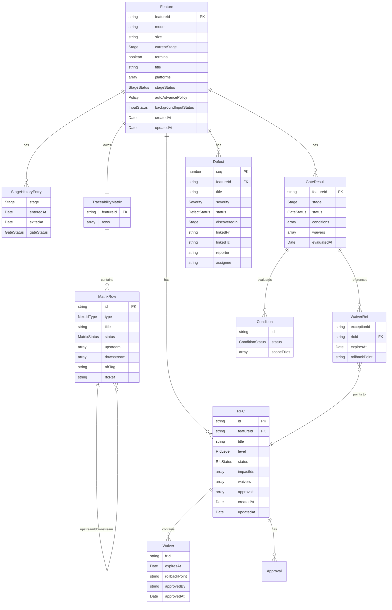

**证据**: 基于 src/shared/types.ts 类型定义 + src/core/ 各模块关系

### 追溯链路

**正向追溯**（需求 → 实现 → 测试）：
```
Feature
  → FR (功能需求)
    → DS (设计规范)
      → TASK (实现任务)
        → Code (代码实现)
    → TC (测试用例)
      → Test Result (测试结果)
```

**反向追溯**（测试 → 实现 → 需求）：
```
Test Failure
  → TC (测试用例)
    → FR (功能需求)
      → Feature (特性)
```

**V-Model 双向追溯**：
```
REQ ←→ ATP
SYS ←→ STP
ARCH ←→ ITP
MOD ←→ UTP
```

---

## 业务流程与领域事件

### 1. Feature 生命周期流程（增强版）

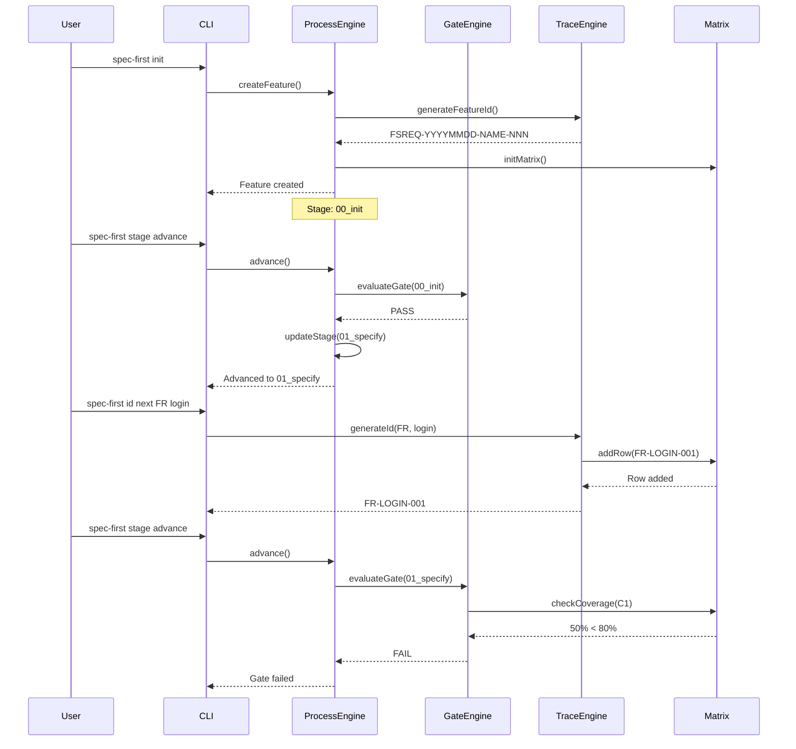

**证据**: src/core/process-engine/advance.ts + src/core/gate-engine/gate-evaluator.ts

### 2. 阶段推进流程（增强版）

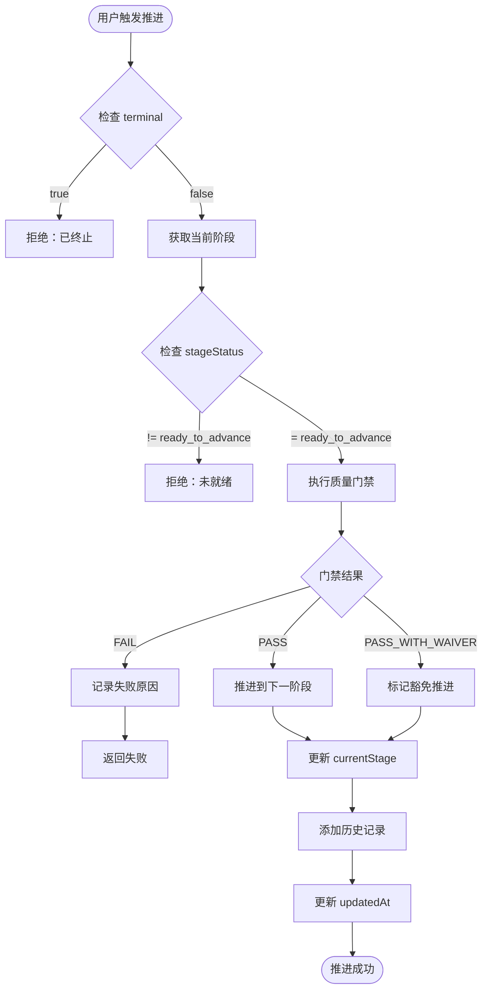

**领域事件流**：

| 事件 | 触发时机 | 携带数据 | 证据源 |
|------|----------|----------|--------|
| `FeatureCreated` | Feature 初始化完成 | featureId, mode, size | src/core/process-engine/init.ts |
| `StageAdvanced` | 阶段推进成功 | featureId, fromStage, toStage | src/core/process-engine/advance.ts |
| `GateEvaluated` | 门禁评估完成 | featureId, stage, status, conditions | src/core/gate-engine/gate-evaluator.ts |
| `TraceIdGenerated` | 追溯 ID 生成 | id, type, featureId | src/core/trace-engine/id-generator.ts |
| `MatrixRowAdded` | 矩阵行添加 | id, type, upstream, downstream | src/core/trace-engine/matrix.ts |
| `RfcCreated` | RFC 创建 | rfcId, featureId, level | src/core/change-mgr/rfc-machine.ts |
| `RfcApproved` | RFC 批准 | rfcId, approvedBy, approvedAt | src/core/change-mgr/rfc-machine.ts |
| `DefectReported` | 缺陷报告 | seq, featureId, severity | src/core/change-mgr/defect-machine.ts |
| `DefectVerified` | 缺陷验证通过 | seq, featureId | src/core/change-mgr/defect-machine.ts |

**证据**: src/core/process-engine/advance.ts + architecture.md:Process Engine

### 3. RFC 变更流程（增强版）

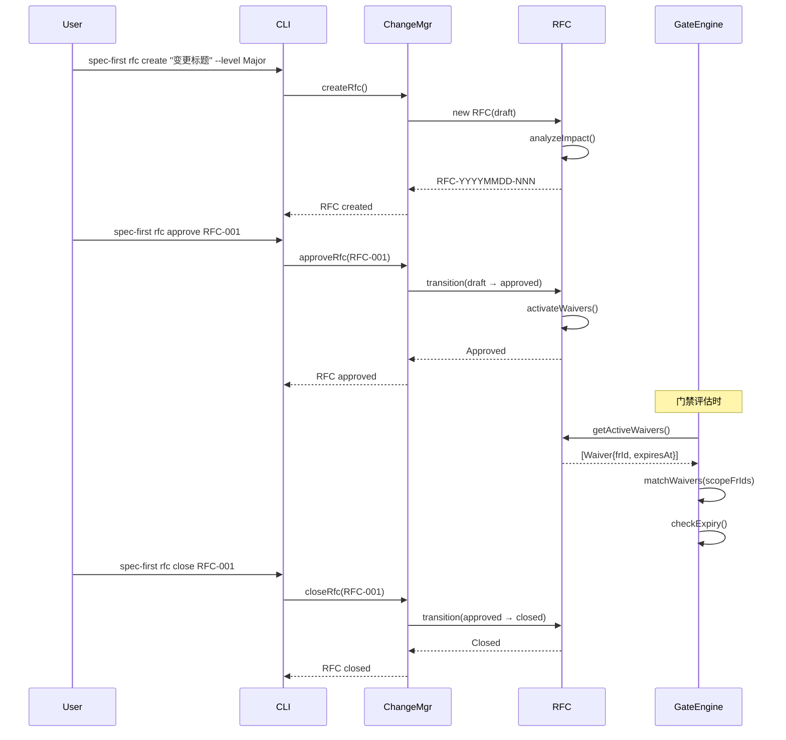

**证据**: src/core/change-mgr/rfc-machine.ts + api-docs.md:rfc 命令

### 4. 缺陷处理流程（增强版）

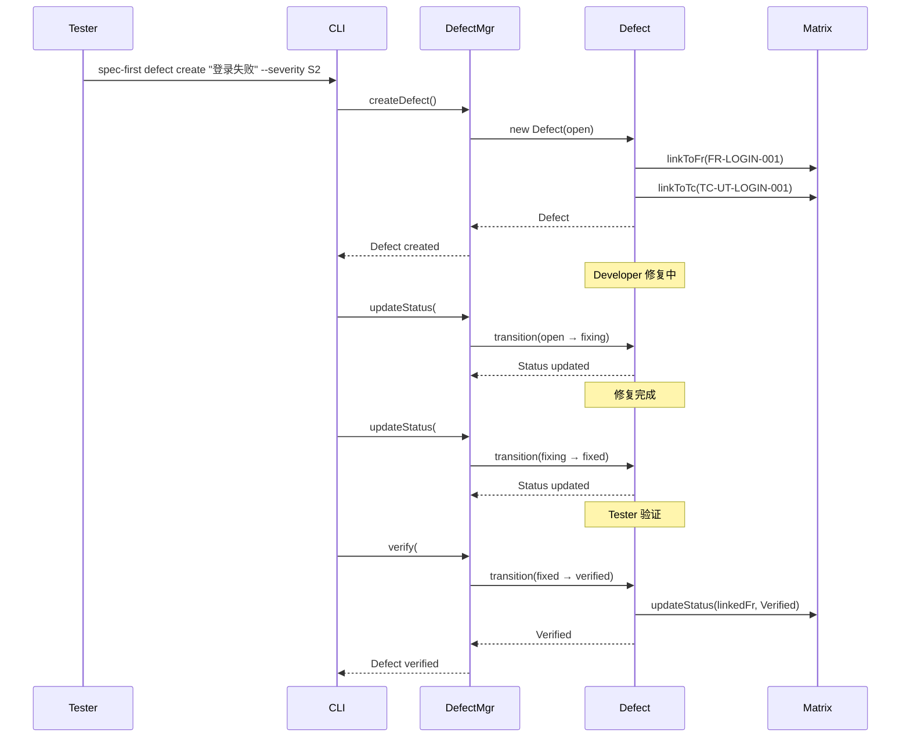

**证据**: src/core/change-mgr/defect-machine.ts + api-docs.md:defect 命令

### 5. 追溯矩阵维护流程（增强版）

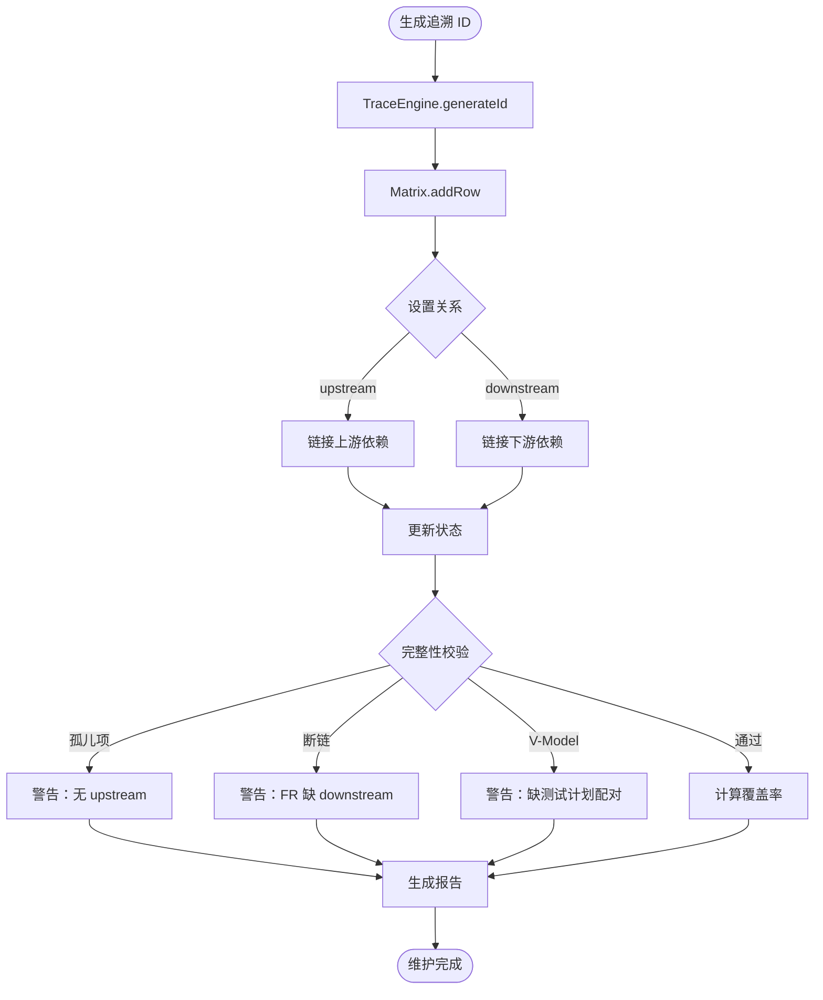

**覆盖率计算流程**：

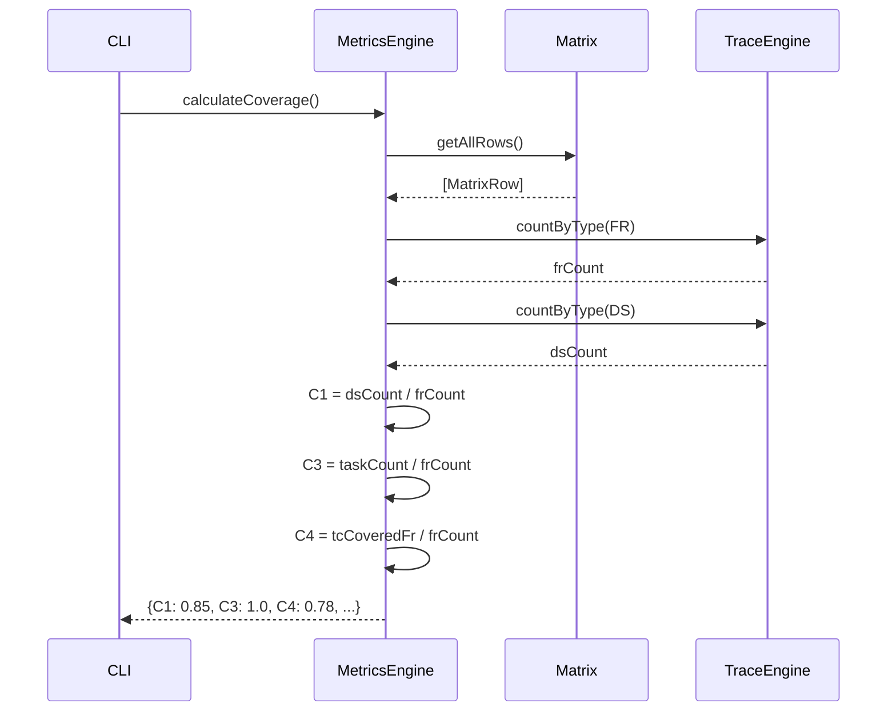

**证据**: src/core/trace-engine/matrix.ts + src/core/metrics-engine/health-score.ts

---

## 领域服务

### 核心领域服务定义

| 服务 | 职责 | 入口方法 | 证据源 |
|------|------|----------|--------|
| ProcessEngine | 阶段状态机管理 | `advance()`, `cancel()`, `getCurrentStage()` | src/core/process-engine/ |
| TraceEngine | 追溯 ID 生成与管理 | `generateId()`, `validateId()`, `searchId()` | src/core/trace-engine/ |
| GateEngine | 质量门禁评估 | `evaluateGate()`, `checkConditions()`, `applyWaivers()` | src/core/gate-engine/ |
| ChangeMgr | RFC 与 Defect 管理 | `createRfc()`, `approveRfc()`, `createDefect()` | src/core/change-mgr/ |
| MetricsEngine | 覆盖率与健康度计算 | `calculateCoverage()`, `healthScore()`, `bottleneckAnalysis()` | src/core/metrics-engine/ |
| SkillRuntime | Skill 分发与执行 | `dispatch()`, `resolveSkillPath()`, `assemblePrompt()` | src/core/skill-runtime/ |
| AIOrchestrator | AI 自动循环 | `autoLoop()`, `catchup()`, `buildContextPack()` | src/core/ai-orchestrator/ |
| TemplateEngine | 模板渲染 | `render()`, `checkArtifacts()` | src/core/template/ |

**证据**: architecture.md:Core Engines + modules.json

---

## 关键约束与业务规则

### 1. 状态机约束

| 实体 | 约束规则 | 说明 | 证据源 |
|------|----------|------|--------|
| Stage | 单向流转 | 活跃阶段只能推进到下一阶段，不可回退 | src/core/process-engine/advance.ts:23-45 |
| Stage | 终态不可逆 | terminal=true 后无法再转换 | src/core/process-engine/stage-machine.ts:67 |
| Stage | 取消通道 | 任何活跃阶段可直接转到 09_cancelled | src/cli/commands/stage.ts:cancel |
| RFC | 4 态流转 | draft → approved/rejected, approved → closed/rejected | src/core/change-mgr/rfc-machine.ts:45-78 |
| RFC | 终态限制 | rejected/closed 后不可再转换 | src/core/change-mgr/rfc-machine.ts:89 |
| Defect | 5 态流转 | open → fixing/wontfix, fixing ↔ fixed ↔ open, verified/wontfix 终态 | src/core/change-mgr/defect-machine.ts:34-92 |
| Defect | 回退限制 | verified/wontfix 后不可回退 | src/core/change-mgr/defect-machine.ts:101 |

### 2. 追溯约束

| 约束类型 | 规则 | 错误级别 | 证据源 |
|----------|------|----------|--------|
| FR 上游 | FR 必须有 REQ-PRD upstream | WARNING | src/core/trace-engine/matrix.ts:checkFrUpstream |
| FR 下游 | FR 必须有 DS、TASK、TC downstream | WARNING | src/core/trace-engine/matrix.ts:checkBrokenLinks |
| V-Model 配对 | REQ/SYS/ARCH/MOD 必须有对应测试计划 | WARNING | src/core/trace-engine/matrix.ts:checkVModel |
| 孤儿项 | 非 FR/Feature/REQ 类型必须有 upstream | ERROR | src/core/trace-engine/matrix.ts:checkOrphans |
| 循环依赖 | upstream/downstream 不可形成环 | ERROR | src/core/trace-engine/matrix.ts:checkCycles |

### 3. 门禁约束

| 约束类型 | 规则 | 说明 | 证据源 |
|----------|------|------|--------|
| 终态阻止 | terminal=true 阻止推进 | done/cancelled 后无法推进 | src/core/process-engine/advance.ts:28 |
| 门禁阻止 | FAIL 阻止推进 | 除非有有效豁免 | src/core/gate-engine/gate-evaluator.ts:56 |
| 豁免关联 | 豁免必须关联到具体 FR | scopeFrIds 精确匹配 | src/core/gate-engine/gate-evaluator.ts:89 |
| 豁免过期 | 豁免有过期时间 | expiresAt 检查 | src/core/gate-engine/gate-evaluator.ts:102 |
| 回滚点 | 豁免必须有回滚点 | git commit hash | src/core/change-mgr/rfc-machine.ts:Waiver |

### 4. ID 约束

| ID 类型 | 格式规则 | 示例 | 证据源 |
|---------|----------|------|--------|
| Feature | FSREQ-YYYYMMDD-NAME-NNN | FSREQ-20260309-LOGIN-001 | src/shared/types.ts:FeatureId |
| FR/DS/TASK | TYPE-ABBR-NNN | FR-LOGIN-001 | src/core/trace-engine/id-generator.ts |
| TC | TC-LEVEL-ABBR-NNN | TC-UT-LOGIN-001 | src/core/trace-engine/id-generator.ts |
| RFC | RFC-YYYYMMDD-NNN | RFC-20260309-001 | src/core/change-mgr/rfc-machine.ts |
| 唯一性 | ID 在 Feature 内唯一 | 不可重复 | src/core/trace-engine/id-generator.ts:checkUnique |

### 5. 覆盖率阈值约束

| 指标 | 阈值 | 说明 | 证据源 |
|------|------|------|--------|
| C1 | ≥80% | 设计覆盖率 | src/core/trace-engine/matrix.ts:C1 |
| C2 | ≥90% | API 覆盖率 | src/core/trace-engine/matrix.ts:C2 |
| C3 | ≥100% | 任务覆盖率 | src/core/trace-engine/matrix.ts:C3 |
| C4 | ≥80% | 功能测试覆盖率 | src/core/trace-engine/matrix.ts:C4 |
| C5 | ≥90% | 验收条件覆盖率 | src/core/trace-engine/matrix.ts:C5 |
| C6 | ≥100% | 实现覆盖率 | src/core/trace-engine/matrix.ts:C6 |
| C7 | ≥95% | PR 合规率 | src/core/trace-engine/matrix.ts:C7 |
| C8 | ≥90% | 任务合规率 | src/core/trace-engine/matrix.ts:C8 |
| C9 | ≥85% | 测试用例合规率 | src/core/trace-engine/matrix.ts:C9 |

---

## 扩展点

### 1. 自定义阶段规则

**扩展机制**: Layer Merger（多层规则合并）

| 层级 | 优先级 | 说明 | 证据源 |
|------|--------|------|--------|
| Base | 低 | 系统默认规则 | src/core/process-engine/base-rules.ts |
| Project | 中 | 项目级规则 | .spec-first/project-rules.yaml |
| Feature | 高 | Feature 级规则 | specs/FSREQ-*/feature-rules.yaml |

**可自定义项**：
- 门禁条件
- 交付物清单
- 覆盖率阈值
- 自动推进策略

**证据**: src/core/process-engine/layer-merger.ts

### 2. 自定义 ID 类型

**基础类型**（13 种）：
- FR, DS, TASK, TC, RFC, REQ, SYS, ARCH, MOD, ATP, STP, ITP, UTP

**扩展方式**：
```typescript
// src/shared/types.ts
export type NextIdType =
  | 'FR' | 'DS' | 'TASK' | 'TC' | 'RFC'
  | 'REQ' | 'SYS' | 'ARCH' | 'MOD'
  | 'ATP' | 'STP' | 'ITP' | 'UTP'
  | 'CUSTOM_TYPE'; // 新增自定义类型
```

**证据**: src/shared/types.ts:NextIdType + src/core/trace-engine/id-generator.ts

### 3. 自定义覆盖率指标

**基础 9 维**: C1-C9

**扩展方式**：
```typescript
// src/core/metrics-engine/custom-metrics.ts
export function calculateC10(): number {
  // 自定义计算逻辑
}
```

**证据**: src/core/metrics-engine/health-score.ts

### 4. 工具集成

**集成点**：

| 集成类型 | 接口 | 说明 | 证据源 |
|----------|------|------|--------|
| AI Runtime Hooks | `onBeforePrompt()`, `onAfterResponse()` | AI 调用前后钩子 | src/core/tool-integration/ai-runtime-hook.ts |
| Session Hooks | `onSessionStart()`, `onSessionEnd()` | 会话生命周期钩子 | src/core/tool-integration/session-hook.ts |
| Context Sync | `syncContext()` | 上下文同步 | src/core/tool-integration/context-sync.ts |

**证据**: architecture.md:Tool Integration

---

## 元数据

- **文档版本**: v2.0.0 (deep)
- **生成时间**: 2026-03-09T04:53:01.342Z
- **分析模式**: deep（基于代码静态分析 + 架构文档）
- **数据源**:
  - src/shared/types.ts（类型定义）
  - src/core/process-engine/（阶段状态机）
  - src/core/trace-engine/（追溯引擎）
  - src/core/change-mgr/（变更管理）
  - src/core/gate-engine/（质量门禁）
  - architecture.md（架构设计）
  - api-docs.md（CLI 接口）
- **领域概念数量**: 8 个核心实体/值对象
- **状态机数量**: 4 个（Stage, RFC, Defect, MatrixStatus）
- **领域服务数量**: 8 个核心服务
- **业务规则数量**: 25+ 条约束规则
- **领域事件数量**: 9 个关键事件

---

*本文档由 Agent A4 基于 deep 模式生成，所有结论均附带代码证据源。*
