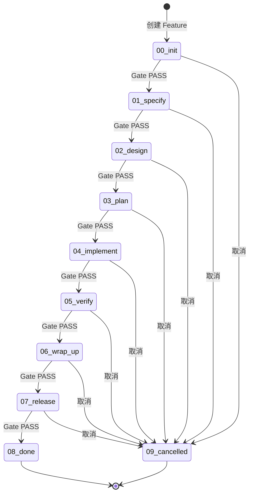
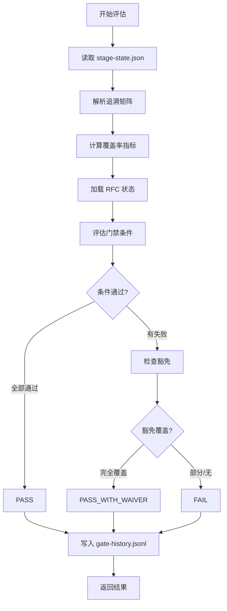
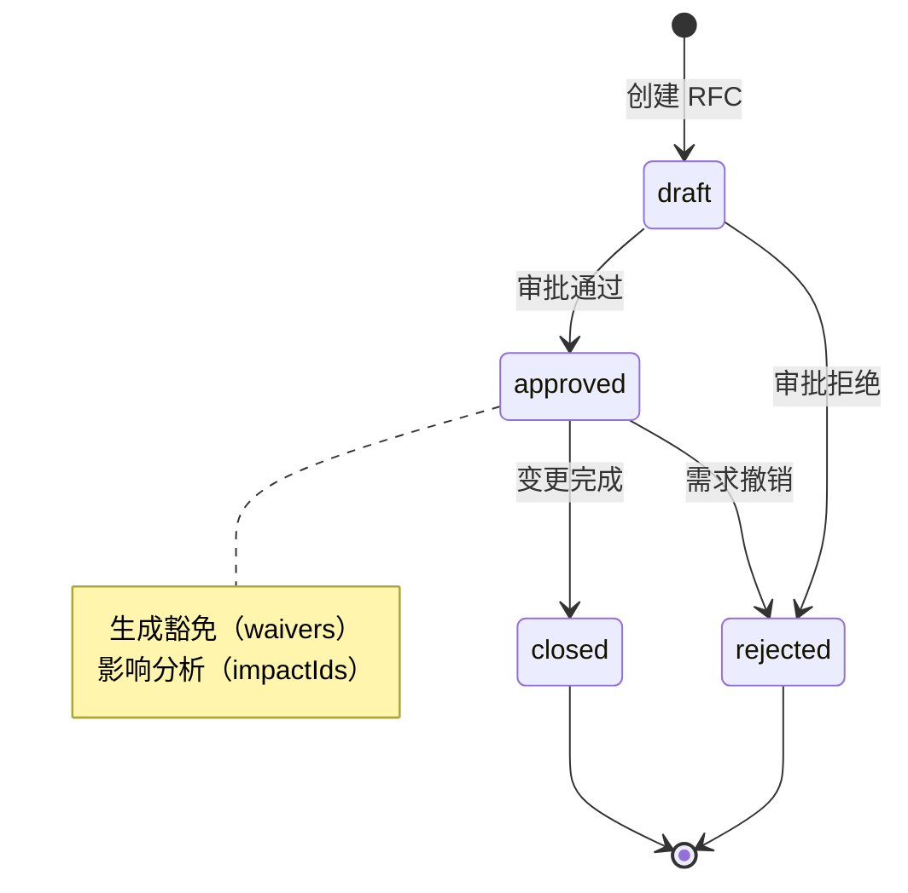
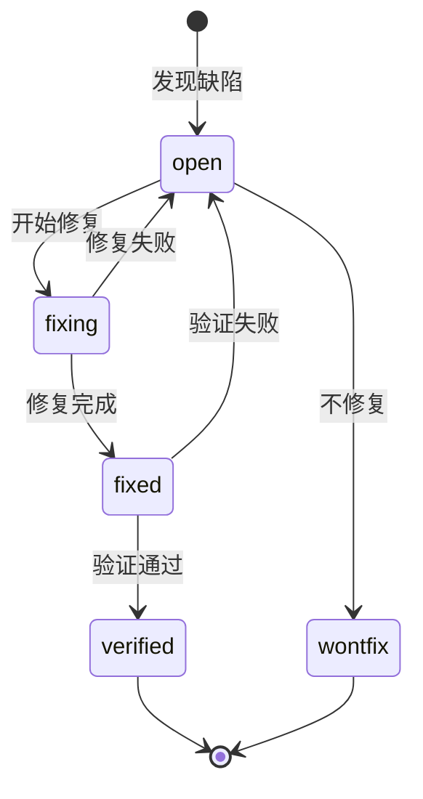
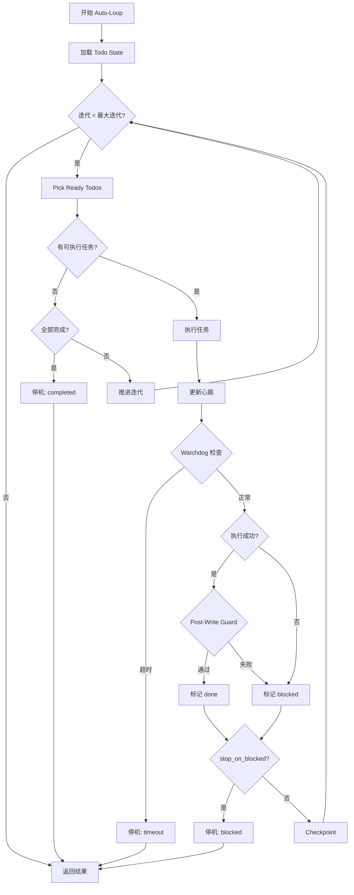
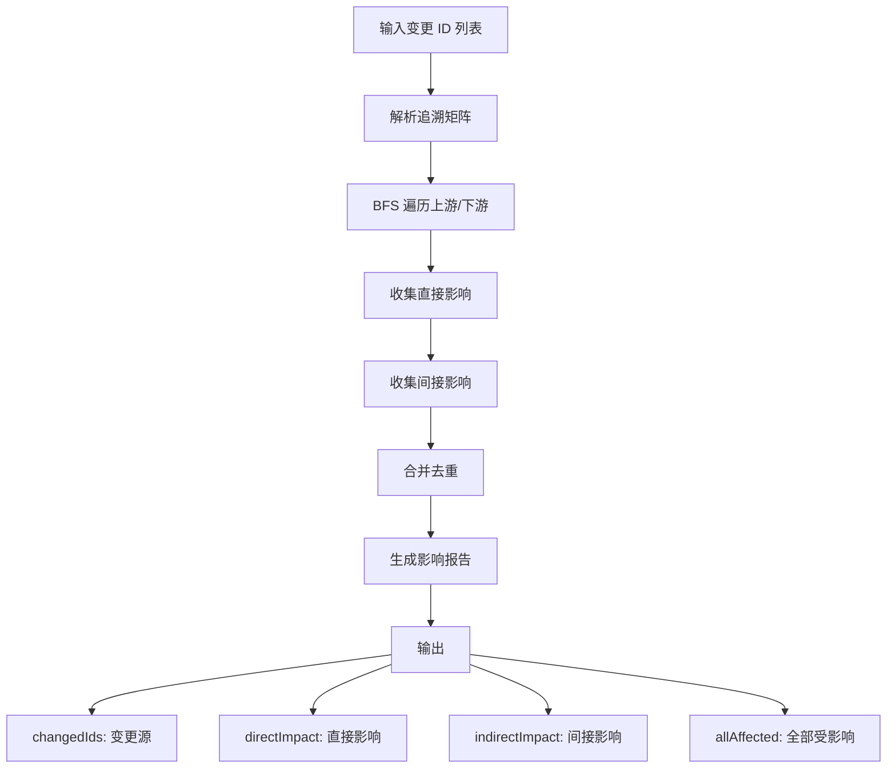
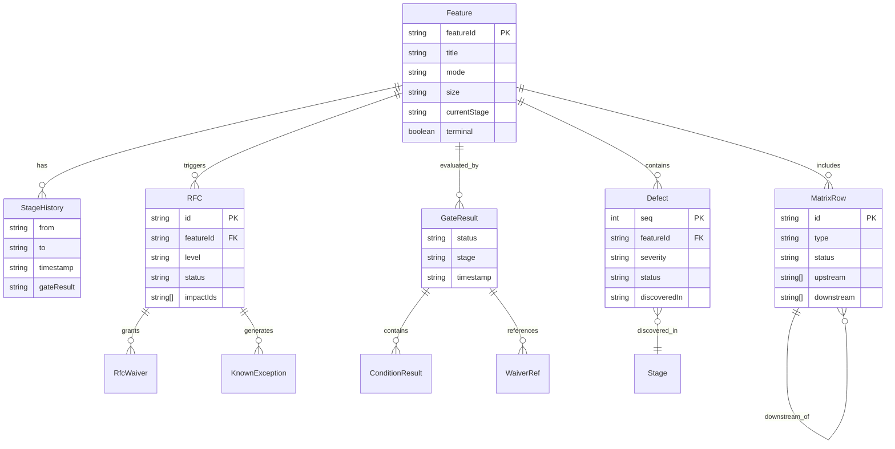

# Spec-First 业务领域模型

> 本文档定义 Spec-First 研发流程引擎的核心业务概念、流程和规则。

---

## 一、核心业务概念

### 1. Feature（功能特性）

**定义**：研发流程中的核心交付单元，代表一个完整的功能特性开发周期。

**关键属性**：
- `featureId`：全局唯一标识符
- `title`：功能标题
- `mode`：开发模式（`N` = New 新建, `I` = Improvement 改进）
- `size`：规模等级（`S` = Small, `M` = Medium, `L` = Large）
- `platforms`：目标平台列表
- `currentStage`：当前所处阶段
- `terminal`：是否已进入终态
- `history`：阶段流转历史记录

**业务意义**：Feature 是规范驱动开发的核心单元，从需求到上线全链路可追溯。

---

### 2. Stage（阶段）

**定义**：Feature 生命周期的标准化阶段，驱动研发流程流转。

**阶段枚举**（10 个阶段，8 个活动阶段 + 2 个终态）：

| 阶段代码 | 名称 | 说明 |
|---------|------|------|
| `00_init` | 初始化 | Feature 创建、基础配置确认 |
| `01_specify` | 需求定义 | 编写 spec.md、分配 FR/NFR ID |
| `02_design` | 设计 | 编写 design.md、API 设计 |
| `03_plan` | 计划 | 任务分解、依赖分析 |
| `04_implement` | 实现 | 编码、单元测试 |
| `05_verify` | 验证 | 集成测试、验收测试 |
| `06_wrap_up` | 收尾 | 文档完善、代码清理 |
| `07_release` | 发布 | 灰度/全量发布 |
| `08_done` | 完成 | 终态：成功完成 |
| `09_cancelled` | 取消 | 终态：中途取消 |

**关键属性**：
- 终态不可逆：`08_done` 和 `09_cancelled` 无法转换到其他阶段
- 线性流转：只能从当前阶段转换到下一阶段或取消

---

### 3. Gate（质量门禁）

**定义**：阶段转换前的质量检查点，确保交付物符合规范要求。

**三态结果**：
- `PASS`：全部条件通过
- `PASS_WITH_WAIVER`：有条件失败但已获得豁免
- `FAIL`：存在未通过且无豁免的条件

**关键属性**：
- `conditions`：门禁条件检查结果列表
- `waivers`：生效的豁免引用
- `suggestions`：修复建议

**核心门禁条件示例**：
- `G-INIT-01`：Feature 目录存在
- `G-SPEC-01`：spec.md 文件存在
- `G-DESIGN-02`：API 覆盖率（C2）= 100%
- `G-PLAN-01`：任务覆盖率（C3）= 100%
- `G-VERIFY-01`：测试覆盖率（C4）= 100%

---

### 4. RFC（需求变更请求）

**定义**：已批准 Feature 的变更管理机制，记录变更动机、影响范围和豁免。

**状态枚举**（4 态）：

| 状态 | 说明 | 可转换到 |
|------|------|---------|
| `draft` | 草稿 | `approved`, `rejected` |
| `approved` | 已批准 | `closed`, `rejected` |
| `rejected` | 已拒绝 | 终态 |
| `closed` | 已关闭 | 终态 |

**关键属性**：
- `level`：变更级别（`Minor` / `Major` / `Critical`）
- `impactIds`：受影响的 ID 列表
- `waivers`：豁免列表（哪些 FR 可以豁免门禁条件）
- `approvals`：审批记录

**业务规则**：
- 只有 `approved` 状态的 RFC 才能生成有效豁免
- 豁免有过期时间和回滚点

---

### 5. Defect（缺陷）

**定义**：缺陷跟踪管理，从发现到验证的全生命周期。

**状态枚举**（5 态）：

| 状态 | 说明 | 可转换到 |
|------|------|---------|
| `open` | 打开 | `fixing`, `wontfix` |
| `fixing` | 修复中 | `fixed`, `open` |
| `fixed` | 已修复 | `verified`, `open` |
| `verified` | 已验证 | 终态 |
| `wontfix` | 不修复 | 终态 |

**关键属性**：
- `severity`：安全严重度（`S1` ~ `S4`）
- `discoveredIn`：发现阶段
- `linkedFr`：关联的 FR ID
- `linkedTc`：关联的测试用例 ID

---

### 6. Traceability Matrix（追溯矩阵）

**定义**：需求-设计-任务-测试的全链路追溯关系矩阵。

**ID 类型**：
- 需求层：`Feature`, `FR`（功能需求）, `REQ`（业务需求）
- 设计层：`DS`（设计规范）, `SYS`, `ARCH`, `MOD`
- 执行层：`TASK`（任务）
- 测试层：`TC`（测试用例）, `ATP`, `STP`, `ITP`, `UTP`

**矩阵状态**：
- `Planned` / `Implemented` / `Verified` / `Accepted`
- `Deferred` / `Cancelled` / `Exception`

**关键属性**：
- `upstream`：上游依赖 ID 列表
- `downstream`：下游影响 ID 列表
- `nfrTag`：非功能需求标签

**V-Model 对应关系**：
```
REQ  ←→ ATP  (验收测试)
SYS  ←→ STP  (系统测试)
ARCH ←→ ITP  (集成测试)
MOD  ←→ UTP  (单元测试)
```

---

### 7. Coverage Metrics（覆盖率指标）

**定义**：C1-C9 九项覆盖率指标，量化衡量规范执行质量。

| 指标 | 名称 | 计算逻辑 | 阈值 |
|------|------|---------|------|
| C1 | Design Coverage | FR 有 DS 映射的比例 | 阶段依赖 |
| C2 | API Coverage | FR 有 API 设计的比例 | 100% (Design) |
| C3 | Task Coverage | FR 有 TASK 映射的比例 | 100% (Plan) |
| C4 | Test Coverage (FR) | FR 有 TC 映射的比例 | ≥80% (Impl), 100% (Verify) |
| C5 | Test Coverage (AC) | AC 有 TC 映射的比例 | S: 60%, M/L: 90% |
| C6 | Impl Coverage | TASK 已实现的比例 | 100% (Wrap-up) |
| C7 | PR Compliance | TASK 有上游 FR 的比例 | 100% |
| C8 | Task Compliance | TASK 合规率（反向） | 100% |
| C9 | TC Compliance | TC 合规率（反向） | 100% |

**计算规则**：
- 排除 `Deferred` 和 `Cancelled` 状态的项
- `Exception` 状态需验证豁免有效性

---

### 8. Known Exception（已知豁免）

**定义**：通过 RFC 批准的门禁条件豁免记录。

**关键属性**：
- `rfcId`：来源 RFC ID
- `frId`：豁免的 FR ID
- `expiresAt`：过期时间
- `rollbackPoint`：回滚点
- `approvedBy` / `approvedAt`：审批人和时间

**业务规则**：
- 只有 `approved` 状态的 RFC 生成的豁免才有效
- 过期豁免自动失效
- 豁免范围必须与门禁条件的 `scopeFrIds` 精确匹配

---

### 9. AI Orchestration（AI 编排）

**定义**：自动化任务执行引擎，支持 AI 驱动的研发流程。

**核心概念**：
- **Auto-Loop**：自动循环执行待办任务
- **Todo Runner**：任务状态管理器
- **Watchdog**：超时监控器
- **Completion Detector**：完成度检测器
- **Slop Checker**：代码质量检查器

**任务状态**：
- `pending` → `in_progress` → `done` / `blocked`

**停机原因**：
- `completed`：全部任务完成
- `task_timeout`：任务超时
- `stalled_timeout`：心跳停滞
- `blocked`：任务阻塞

---

## 二、业务流程

### 1. Feature 生命周期流程



---

### 2. Gate 评估流程



---

### 3. RFC 变更管理流程



---

### 4. Defect 缺陷管理流程



---

### 5. AI Auto-Loop 执行流程



---

### 6. 变更影响分析流程



---

## 三、业务规则

### 1. 阶段转换规则

| 规则 ID | 描述 | 约束 |
|---------|------|------|
| SR-001 | 线性流转 | 只能从当前阶段转换到下一阶段或取消 |
| SR-002 | 终态不可逆 | `08_done` 和 `09_cancelled` 无法转换 |
| SR-003 | Gate 前置 | 阶段转换前必须通过 Gate 评估 |
| SR-004 | 历史追溯 | 每次转换必须记录 `StageHistoryEntry` |

---

### 2. Gate 评估规则

| 规则 ID | 描述 | 约束 |
|---------|------|------|
| GR-001 | 三态结果 | 必须返回 `PASS` / `PASS_WITH_WAIVER` / `FAIL` |
| GR-002 | 豁免匹配 | 豁免的 `frId` 必须在条件的 `scopeFrIds` 中 |
| GR-003 | RFC 有效性 | 只有 `approved` 状态的 RFC 生成的豁免才有效 |
| GR-004 | 过期失效 | 超过 `expiresAt` 的豁免自动失效 |
| GR-005 | 历史记录 | 每次评估必须写入 `gate-history.jsonl` |

---

### 3. 覆盖率计算规则

| 规则 ID | 描述 | 约束 |
|---------|------|------|
| CR-001 | 排除状态 | `Deferred` 和 `Cancelled` 不计入分母 |
| CR-002 | 异常处理 | `Exception` 状态需验证豁免有效性 |
| CR-003 | 分母为零 | 分母为 0 时返回 0（而非 100%） |
| CR-004 | 精度 | 保留 4 位小数（0~1 范围） |

---

### 4. RFC 变更规则

| 规则 ID | 描述 | 约束 |
|---------|------|------|
| RR-001 | 状态机 | 必须遵循 4 态转换规则 |
| RR-002 | 影响分析 | 必须记录 `impactIds` |
| RR-003 | 豁免审批 | 豁免必须有 `approvedBy` 和 `approvedAt` |
| RR-004 | 回滚点 | 豁免必须指定 `rollbackPoint` |

---

### 5. Defect 缺陷规则

| 规则 ID | 描述 | 约束 |
|---------|------|------|
| DR-001 | 状态机 | 必须遵循 5 态转换规则 |
| DR-002 | 关联追溯 | 可选关联 `linkedFr` 和 `linkedTc` |
| DR-003 | 严重度 | 必须指定 `S1` ~ `S4` 严重度 |

---

### 6. 追溯矩阵规则

| 规则 ID | 描述 | 约束 |
|---------|------|------|
| MR-001 | V-Model 对应 | REQ↔ATP, SYS↔STP, ARCH↔ITP, MOD↔UTP |
| MR-002 | 孤儿检测 | 非 FR/Feature/REQ 且无 upstream 的项标记为孤儿 |
| MR-003 | 断链检测 | FR 缺少 DS/TASK/TC 映射标记为断链 |
| MR-004 | 双向引用 | 支持 `upstream` 和 `downstream` 双向追溯 |

---

### 7. AI 编排规则

| 规则 ID | 描述 | 约束 |
|---------|------|------|
| AR-001 | 最大迭代 | 迭代次数不能超过 `maxIterations` |
| AR-002 | 心跳更新 | 任务执行后必须更新 `heartbeatAt` |
| AR-003 | 审计日志 | 关键事件必须写入审计日志 |
| AR-004 | Post-Write Guard | 任务成功后必须运行完成度检测和代码质量检查 |
| AR-005 | 停机策略 | `stop_on_blocked` 控制是否在任务阻塞时停机 |

---

## 四、实体关系图



---

## 五、关键文件结构

```
specs/
└── {featureId}/
    ├── stage-state.json          # Feature 状态
    ├── spec.md                   # 需求规范
    ├── design.md                 # 设计文档
    ├── constitution.md           # 架构宪法
    ├── traceability-matrix.md    # 追溯矩阵
    ├── rfcs/                     # RFC 记录
    │   └── RFC-{seq}.md
    ├── defects/                  # 缺陷记录
    │   └── DEFECT-{seq}.md
    ├── exceptions.json           # 豁免记录
    ├── gate-history.jsonl        # Gate 评估历史
    ├── reports/                  # 分析报告
    │   ├── analysis-report.md
    │   ├── smoke-test-report.md
    │   └── release-note.md
    └── checklists/               # 检查清单
        └── spec-review.md

.spec-first/
└── current                       # 当前活跃 Feature
```

---

## 六、术语表

| 术语 | 全称 | 说明 |
|------|------|------|
| FR | Functional Requirement | 功能需求 |
| NFR | Non-Functional Requirement | 非功能需求 |
| DS | Design Specification | 设计规范 |
| TC | Test Case | 测试用例 |
| ATP | Acceptance Test Plan | 验收测试计划 |
| STP | System Test Plan | 系统测试计划 |
| ITP | Integration Test Plan | 集成测试计划 |
| UTP | Unit Test Plan | 单元测试计划 |
| RFC | Request for Change | 变更请求 |
| SCA | Software Composition Analysis | 软件成分分析 |
| BFS | Breadth-First Search | 广度优先搜索 |

---

**文档版本**: v1.0.0
**更新日期**: 2026-03-03
**维护者**: Spec-First Team
