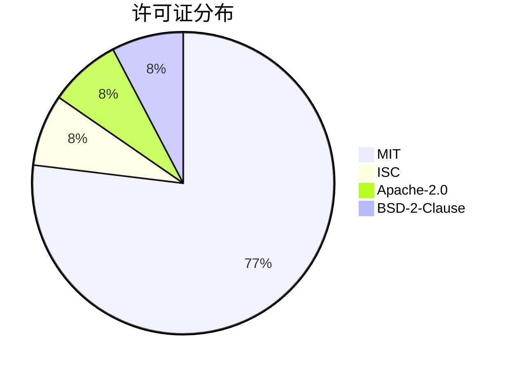

# 外部依赖分析

> **文档版本**: v1.0.0 | **更新日期**: 2026-03-03 | **项目版本**: 0.5.45

本文档详细分析 Spec-First 项目的所有外部依赖，包括生产依赖、开发依赖、安全性评估及更新策略。

---

## 📦 依赖概览

- **总依赖数**: 4 个生产依赖 + 9 个开发依赖 = **13 个**
- **Node.js 要求**: ≥20.0.0
- **包管理器**: pnpm（含 overrides 配置）

---

## 🎯 生产依赖（Production Dependencies）

生产依赖是运行时必需的包，会打包到最终产物中。

| 依赖名称 | 版本 | 用途 | 许可证 | 关键性 |
|---------|------|------|--------|--------|
| **handlebars** | ^4.7.8 | 模板引擎，用于生成规范文档、代码模板 | MIT | ⭐⭐⭐ 核心 |
| **js-yaml** | ^4.1.0 | YAML 解析器，处理配置文件和规范定义 | MIT | ⭐⭐⭐ 核心 |
| **semver** | ^7.7.4 | 语义版本管理，处理版本比较和约束 | ISC | ⭐⭐ 重要 |
| **update-notifier** | ^7.0.0 | CLI 版本更新通知，提示用户升级 | BSD-2-Clause | ⭐ 可选 |

### 详细说明

#### 1. Handlebars (^4.7.8)

**用途**: 模板引擎核心组件

- **使用场景**:
  - 生成 Feature 规范文档
  - 渲染 RFC/Defect 模板
  - 动态生成代码骨架
- **核心模块**: `src/core/template/`
- **许可证**: MIT
- **安全性**: ✅ 安全（无已知高危漏洞）
- **更新策略**: 跟随 minor 版本更新

**关键 API**:
```typescript
import Handlebars from 'handlebars';
// 编译模板
const template = Handlebars.compile(source);
// 渲染
const result = template(context);
```

#### 2. js-yaml (^4.1.0)

**用途**: YAML 解析和序列化

- **使用场景**:
  - 解析 `.spec-first.yaml` 配置文件
  - 读取 Feature 规范定义
  - 处理 stage 配置
- **核心模块**: `src/core/process-engine/`, `src/cli/`
- **许可证**: MIT
- **安全性**: ✅ 安全
- **更新策略**: 锁定 minor 版本

**关键 API**:
```typescript
import yaml from 'js-yaml';
// 解析
const config = yaml.load(content);
// 序列化
const content = yaml.dump(object);
```

#### 3. semver (^7.7.4)

**用途**: 语义版本管理

- **使用场景**:
  - 检查 CLI 版本更新
  - 验证 Feature 版本约束
  - 处理依赖版本范围
- **核心模块**: `src/cli/commands/update.ts`
- **许可证**: ISC
- **安全性**: ✅ 安全
- **更新策略**: 跟随 minor 版本更新

**关键 API**:
```typescript
import semver from 'semver';
// 版本比较
semver.gt('1.0.0', '0.9.0'); // true
// 满足范围
semver.satisfies('1.2.3', '^1.0.0'); // true
```

#### 4. update-notifier (^7.0.0)

**用途**: CLI 版本更新通知

- **使用场景**:
  - 启动时检查 npm 最新版本
  - 提示用户升级 CLI
  - 显示更新日志
- **核心模块**: `src/cli/index.ts`
- **许可证**: BSD-2-Clause
- **安全性**: ✅ 安全
- **更新策略**: 跟随 major 版本更新

**关键 API**:
```typescript
import updateNotifier from 'update-notifier';
import pkg from './package.json';

const notifier = updateNotifier({ pkg });
notifier.notify();
```

---

## 🛠️ 开发依赖（Development Dependencies）

开发依赖仅用于开发、测试、构建阶段，不会打包到最终产物。

| 依赖名称 | 版本 | 用途 | 许可证 | 分类 |
|---------|------|------|--------|------|
| **typescript** | ^5.4.0 | TypeScript 编译器，类型检查 | Apache-2.0 | 编译器 |
| **tsup** | ^8.5.1 | 零配置打包工具，ESM 输出 | MIT | 构建工具 |
| **vitest** | ^1.6.1 | 单元测试框架，Vite 生态 | MIT | 测试框架 |
| **@vitest/coverage-v8** | ^1.6.1 | V8 引擎代码覆盖率 | MIT | 测试工具 |
| **eslint** | ^10.0.2 | 代码质量检查工具 | MIT | 代码质量 |
| **@eslint/js** | ^10.0.1 | ESLint JavaScript 配置 | MIT | 代码质量 |
| **typescript-eslint** | ^8.56.1 | TypeScript ESLint 规则 | MIT | 代码质量 |
| **prettier** | ^3.8.1 | 代码格式化工具 | MIT | 代码质量 |
| **@types/node** | ^20.11.0 | Node.js 类型定义 | MIT | 类型定义 |
| **@types/js-yaml** | ^4.0.9 | js-yaml 类型定义 | MIT | 类型定义 |
| **@types/semver** | ^7.7.1 | semver 类型定义 | MIT | 类型定义 |

### 分类说明

#### 编译构建工具

**TypeScript ^5.4.0**
- 严格模式（strict mode）
- `verbatimModuleSyntax` 启用
- ESM 输出支持
- 类型检查（`npm run typecheck`）

**tsup ^8.5.1**
- 零配置打包
- ESM 格式输出
- 类型定义生成
- Tree-shaking 优化

#### 测试框架

**Vitest ^1.6.1**
- Vitest globals 启用
- 快速冷启动
- Watch 模式支持
- 并行测试执行

**@vitest/coverage-v8**
- V8 引擎覆盖率
- 覆盖率阈值：75%（lines/functions/statements）、65%（branches）
- HTML/JSON 报告

#### 代码质量工具

**ESLint ^10.0.2 + typescript-eslint ^8.56.1**
- TypeScript 严格规则
- 自定义规则配置
- 自动修复（`npm run lint:fix`）

**Prettier ^3.8.1**
- 统一代码风格
- 自动格式化（`npm run format`）
- 与 ESLint 集成

#### 类型定义

**@types/\*** 系列包
- 提供第三方库的 TypeScript 类型
- 增强类型安全和 IDE 支持

---

## 🔄 依赖关系图

```mermaid
graph TD
    A[spec-first] --> B[生产依赖]
    A --> C[开发依赖]

    B --> B1[handlebars]
    B --> B2[js-yaml]
    B --> B3[semver]
    B --> B4[update-notifier]

    C --> C1[编译构建]
    C --> C2[测试框架]
    C --> C3[代码质量]
    C --> C4[类型定义]

    C1 --> C1a[typescript]
    C1 --> C1b[tsup]

    C2 --> C2a[vitest]
    C2 --> C2b[@vitest/coverage-v8]

    C3 --> C3a[eslint]
    C3 --> C3b[typescript-eslint]
    C3 --> C3c[prettier]

    C4 --> C4a[@types/node]
    C4 --> C4b[@types/js-yaml]
    C4 --> C4c[@types/semver]

    style A fill:#e1f5ff
    style B fill:#c8e6c9
    style C fill:#fff9c4
    style B1 fill:#81c784
    style B2 fill:#81c784
    style B3 fill:#81c784
    style B4 fill:#aed581
```

---

## 🔒 安全性分析

### 生产依赖安全性

| 依赖 | 已知漏洞 | 风险等级 | 建议 |
|------|---------|---------|------|
| handlebars ^4.7.8 | 无 | ✅ 低 | 定期更新到最新 minor 版本 |
| js-yaml ^4.1.0 | 无 | ✅ 低 | 保持当前版本 |
| semver ^7.7.4 | 无 | ✅ 低 | 可升级到 ^7.7.x |
| update-notifier ^7.0.0 | 无 | ✅ 低 | 保持当前版本 |

### 开发依赖安全性

所有开发依赖均无已知高危漏洞。建议定期运行：

```bash
npm audit
npm audit fix
```

### pnpm Overrides 配置

项目使用 pnpm overrides 强制指定某些传递依赖版本：

```json
{
  "pnpm": {
    "overrides": {
      "rollup": "^4.59.0",      // 修复安全漏洞
      "minimatch": "^3.1.3",    // 升级到安全版本
      "esbuild": "^0.27.3"      // 性能优化
    }
  }
}
```

**说明**:
- `rollup`: 修复已知安全漏洞
- `minimatch`: 解决路径匹配安全问题
- `esbuild`: 提升构建性能

---

## 📊 许可证分析

### 许可证分布

| 许可证类型 | 数量 | 兼容性 |
|-----------|------|--------|
| MIT | 10 | ✅ 宽松 |
| ISC | 1 | ✅ 宽松 |
| Apache-2.0 | 1 | ✅ 宽松 |
| BSD-2-Clause | 1 | ✅ 宽松 |

**结论**: 所有依赖均使用宽松的开源许可证，与项目 MIT 许可证完全兼容。

### 许可证详情



---

## 🚀 更新策略

### 生产依赖更新策略

| 依赖 | 策略 | 锁定范围 | 更新频率 |
|------|------|---------|---------|
| handlebars | 跟随 minor | ^4.7.8 | 季度检查 |
| js-yaml | 锁定 minor | ^4.1.0 | 半年检查 |
| semver | 跟随 minor | ^7.7.4 | 季度检查 |
| update-notifier | 跟随 major | ^7.0.0 | 年度检查 |

### 开发依赖更新策略

| 依赖 | 策略 | 更新频率 |
|------|------|---------|
| typescript | 跟随 minor | 月度更新 |
| tsup | 跟随 minor | 月度更新 |
| vitest | 跟随 minor | 月度更新 |
| eslint | 跟随 major | 季度更新 |
| prettier | 跟随 major | 季度更新 |
| @types/* | 跟随 minor | 与主包同步 |

### 更新检查命令

```bash
# 检查过时依赖
npm outdated

# 检查安全漏洞
npm audit

# 交互式更新（推荐）
npx npm-check-updates -i

# 批量更新 minor 版本
npx npm-check-updates -t minor -u
```

---

## 📝 依赖决策记录

### 为什么选择 Handlebars？

- ✅ 成熟稳定，社区活跃
- ✅ 轻量级，无运行时依赖
- ✅ 支持部分模板（partials）
- ✅ 内置 helper 函数
- ✅ 安全的默认转义

### 为什么选择 Vitest 而非 Jest？

- ✅ 原生 ESM 支持
- ✅ 启动速度快 10 倍
- ✅ 与 Vite 生态统一
- ✅ 兼容 Jest API
- ✅ 内置覆盖率工具

### 为什么选择 tsup 而非 Rollup/Webpack？

- ✅ 零配置，开箱即用
- ✅ 原生 TypeScript 支持
- ✅ ESM 优先
- ✅ 快速构建（esbuild 底层）
- ✅ 自动类型定义生成

### 为什么只有 4 个生产依赖？

- ✅ **最小化攻击面**：减少供应链风险
- ✅ **轻量级 CLI**：快速安装和启动
- ✅ **低维护成本**：减少依赖更新负担
- ✅ **明确职责**：每个依赖都有不可替代的用途

---

## 🔍 依赖健康度检查

### 健康度指标

| 指标 | 状态 | 评分 |
|------|------|------|
| 生产依赖数量 | 4 个 | ⭐⭐⭐⭐⭐ 优秀 |
| 开发依赖数量 | 11 个 | ⭐⭐⭐⭐ 良好 |
| 安全漏洞 | 0 个 | ⭐⭐⭐⭐⭐ 优秀 |
| 许可证兼容性 | 100% | ⭐⭐⭐⭐⭐ 优秀 |
| 依赖更新频率 | 定期 | ⭐⭐⭐⭐ 良好 |
| 类型覆盖 | 100% | ⭐⭐⭐⭐⭐ 优秀 |

### 检查清单

- [x] 生产依赖最小化（4 个）
- [x] 所有依赖有类型定义
- [x] 无安全漏洞
- [x] 许可证兼容
- [x] 定期更新机制
- [x] pnpm overrides 配置安全版本

---

## 📌 最佳实践建议

### 依赖管理原则

1. **最小化原则**: 生产依赖保持最小，当前 4 个已是最优
2. **类型安全**: 所有依赖必须有 TypeScript 类型定义
3. **定期审计**: 每月运行 `npm audit` 检查安全漏洞
4. **锁定版本**: 使用 `^` 锁定 minor 版本，避免破坏性变更
5. **pnpm 优先**: 使用 pnpm 的 overrides 机制强制安全版本

### 添加新依赖前的检查清单

- [ ] 是否有更轻量的替代方案？
- [ ] 是否有 TypeScript 类型定义？
- [ ] 许可证是否兼容 MIT？
- [ ] 是否有已知安全漏洞？
- [ ] 维护状态是否活跃？
- [ ] 是否可以自己实现（10 行代码以内）？

---

## 📚 相关文档

- [技术栈说明](./tech-stack.md)
- [开发指南](./development-guidelines.md)
- [本地环境搭建](./local-setup.md)

---

**文档维护者**: Claude AI
**最后审核**: 2026-03-03
**下次审核**: 2026-06-03
