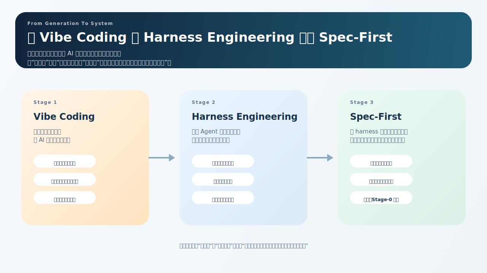

# 为什么 AI 编程需要一套工程系统，而不只是一个更强的模型

**导语**

AI 写代码已经不是问题。真正的问题是，它写出来的东西，能不能稳定进入真实工程。  
当团队从“偶尔用一下 AI”走到“开始依赖 AI 参与交付”，瓶颈很快就不再是生成速度，而是上下文、约束、验证和知识沉淀。  
这篇文章想讲清楚的，就是为什么 AI 编程最终会走向一套工程系统，以及 `spec-first` 想在这条路上解决什么问题。

很多团队第一次用 AI 编程时，体验都很好。一个需求，用自然语言描述一下，几十秒后就能看到代码；一个原型，原本要花半天搭骨架，现在几轮对话就能跑起来。这种轻盈感很像 `Vibe Coding`：先把东西生成出来，先把感觉跑通。

问题在于，项目一旦进入持续开发，这种轻盈感就会迅速碰到工程现实。前一轮说过的约定，下一轮就忘；今天刚修过的坑，明天换个会话又踩；需求、方案、实现和评审之间缺少稳定边界，知识也无法自然沉淀。最后真正拖慢团队的，往往不是模型生成得不够快，而是工程过程不够稳。

所以我越来越倾向于把 AI 编程理解成一个工程系统问题，而不是一个 prompt 调优问题。

*图 1：这篇总论的核心不是单独解释某个术语，而是把 `Vibe Coding`、`Harness engineering` 和 `spec-first` 放回一条连续升级的工程语境里。*

## 真正稀缺的不是生成能力，而是工程连续性

单次对话很擅长解决局部问题。补一个函数、改一个页面、试一个脚本，这些任务天然短链路，AI 的收益非常直接。但只要任务开始跨文件、跨模块、跨阶段，问题的性质就变了。

这时真正稀缺的，不是“再多给一点生成能力”，而是下面这些东西能不能稳定存在：

- 哪些上下文是事实来源
- 哪些规则必须持续被遵守
- 哪些步骤应该先做，哪些步骤必须后做
- 哪些经验要从一次修复变成长期资产

如果这些东西不存在，AI 每次进入项目都像第一次进入项目。它能很快写出局部代码，却很难稳定参与长期交付。

很多人会把这件事理解成“模型还不够强”。这个判断不完整。模型当然重要，但工程里的大量问题并不是因为模型不会推理，而是因为它看不见隐式规则，看不见团队约定，看不见架构边界，也看不见上一次会话留下来的教训。

换句话说，AI 编程缺的不是更多灵感，而是更稳定的执行环境。

## `Harness engineering` 提供了一个更准确的坐标系

这也是为什么我觉得 `Harness engineering` 这个参照很有帮助。

它的价值不在于又多了一个术语，而在于它把焦点从“怎么教模型”转到了“怎么设计 Agent 能可靠工作的环境”。无论是 OpenAI 在 **2026-02-11** 发布的文章《Harness engineering: leveraging Codex in an agent-first world》，还是仓库里收录的 [Qoder 工程实践：Harness Engineering 指南](../../../spec-first-doc/业界学习/01-外部文章/2026-04-03-Qoder-工程实践：Harness-Engineering-指南.md)，都在强调几件事：

- 仓库内要有稳定事实来源
- 规则要被编码，而不是靠口头约定
- 验证要尽量机械化，而不是全靠人工兜底
- 人的角色正在从“亲手写代码”转向“设计环境、约束和反馈回路”

这套思路很重要，因为它解释了为什么很多 AI 协作会在中后期失速。不是 Agent 不够聪明，而是它进入的是一个没有地图、没有护栏、没有验证闭环的环境。

但这里还要说清一个边界：`spec-first` 并不等于 `Harness engineering`。对我来说，`Harness engineering` 更像一个上位参照系。它告诉我们，方向是对的：真正要优化的对象，不是单次回答，而是整个执行环境。接下来才轮到另一个问题，如何把这种思路继续推进成一套可落地、可治理、可复用、可持续演进的工作流。

这正是 `spec-first` 想做的事。

*图 2：`Harness engineering` 可以被理解为比 prompt 和上下文更高一层的环境设计问题。它关注的不是“再写一段更好的提示词”，而是“让 Agent 在什么环境里工作”。*

## `spec-first` 解决的，不只是“让 Agent 能工作”

如果只看表面，`spec-first` 很容易被理解成一个 CLI，或者一组给 Claude Code / Codex 用的命令和技能。但如果只这样理解，它的定位就被压扁了。

`spec-first` 真正想做的，不是提供几条更顺手的 AI 命令，而是把 AI 编程从一次性对话升级成一个可安装、可治理、可复用的工程系统。

它背后的判断其实很简单：

- 只靠 prompt，无法稳定约束长期协作
- 只靠模型，无法替代项目级事实来源
- 只靠一次生成，无法形成知识复利

所以 `spec-first` 做的不是再补几条提示词，而是把工作流本身产品化。

在这个仓库里，这套系统的骨架已经很清楚：

- `doctor / init / clean` 负责运行时资产的检查、注入和回收
- `/spec:*` 和 `$spec-*` 提供跨宿主的稳定入口
- `Stage-0` 通过 `spec-graph-bootstrap` 先生产项目上下文，再进入后续执行
- `Ideate -> Brainstorm -> Plan -> Work -> Review -> Compound` 把交付过程拆成可治理的阶段
- `docs/brainstorms`、`docs/plans`、`docs/solutions` 把一次性讨论和修复沉淀成可复用资产

如果说 `Harness engineering` 更强调“让 Agent 能在仓库里可靠工作”，那么 `spec-first` 更进一步强调“让整个 AI 交付过程可以被编排、治理、复用，并随着项目演进持续积累资产”。

这就是它和普通“AI 命令集合”的本质差别。

*图 3：`spec-first` 的重点不是单条命令，而是稳定入口、闭环流程、状态管理和知识复利共同组成的工程系统。*

## 从 `Vibe Coding` 到 `Harness engineering`，再到 `spec-first`

把这几个概念放在一起看，关系会更清楚。

`Vibe Coding` 解决的是“AI 能不能先开始干活”。它强调速度、直觉和快速生成，很适合原型期，也很适合局部任务。

`Harness engineering` 往前推进了一步。它开始认真处理另一个问题：当 Agent 真正进入工程现场之后，怎样给它提供事实来源、约束边界和验证闭环，让它不要在同一类问题上反复翻车。

而 `spec-first` 还想继续推进。它不是停在“让 Agent 能在仓库里工作”，而是继续问：团队能不能围绕 AI 建立一整套稳定交付流程？

这也是它为什么不只关心 AGENTS.md、约束和验证，而是继续往前做：

- `Stage-0` 的上下文生产
- 多阶段工作流编排
- 语言和 Changelog 治理
- review 到 compound 的知识沉淀
- Claude Code 和 Codex 的双宿主适配

所以它们之间不是替代关系，而是递进关系：

- `Vibe Coding`：先生成
- `Harness engineering`：先把环境和护栏搭起来
- `spec-first`：把环境、流程、治理和知识复利一起做成系统

这组连载要讲清楚的，就是这条递进线。不是为了给 `spec-first` 找一个更时髦的标签，而是为了把它放回一个更准确的工程语境里。

## 为什么第一块底座不是实现，而是上下文

如果要问这套系统最先该补哪一块，我的答案不是“换更强的模型”，也不是“多写几条规则”，而是先把上下文生产机制建起来。

因为没有稳定上下文，后面的所有流程都会漂。

需求分析会漂，因为每次都要重新解释项目边界；方案设计会漂，因为没有稳定的事实来源；实现会漂，因为上下游约束无法持续加载；评审会漂，因为很多结论停留在聊天记录里，无法沉淀成下一轮输入。

这也是 `spec-first` 里 `Stage-0` 特别重要的原因。它不只是“在正式工作前先分析一下项目”，而是在回答一个更根本的问题：

如何把“理解项目”从一次性的脑力活动，变成长期可复用的工程资产？

这个问题，刚好把前面几条线连了起来。`Vibe Coding` 会让你先动手，`Harness engineering` 会提醒你先把环境搭好，而 `spec-first` 给出的答案是：把项目理解本身也纳入工作流，作为正式进入实现前的第一层底座。

## 这组连载接下来会怎么写

这篇总论只做一件事：先把坐标系立起来。

后面的连载会沿着这个坐标系逐个拆开：

- 先讲为什么 `Stage-0` 必须存在，`spec-graph-bootstrap` 如何把上下文生产成底座
- 再讲 `mcp-setup + doctor + init` 如何把第一次成功路径产品化
- 再讲语言治理、Changelog 铁律和版本提醒，为什么治理本身也是用户体验
- 然后进入可靠性，解释为什么可恢复、可校验、可回滚不是附加题
- 再讲 review、compound 和 `docs/solutions` 如何把问题修复变成知识复利
- 最后回到双宿主，解释同一套工作流如何在 Claude Code 和 Codex 上保持一致

如果说这篇文章回答的是“为什么我们需要一套工程系统”，那么下一篇要回答的，就是“这套系统的第一块底座为什么不是实现，而是上下文”。

真正决定它能不能成立的，不是某个命令，而是 `Stage-0`。

## 参考来源

- [Spec-First 连载首篇详细大纲](./2026-04-03-spec-first-blog-series-article-1-outline.md)
- [Harness Engineering 指南](../../../spec-first-doc/业界学习/01-外部文章/2026-04-03-Qoder-工程实践：Harness-Engineering-指南.md)
- OpenAI 官方文章：<https://openai.com/index/harness-engineering/>
