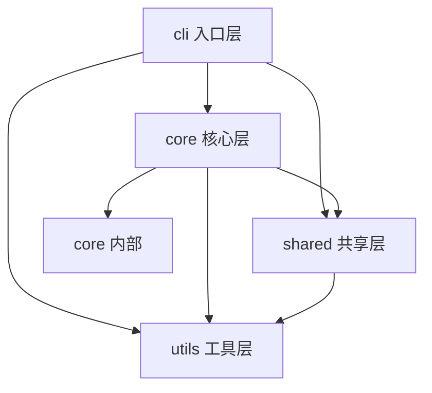

# First Skill 依赖调用链分析设计

> **日期**: 2026-02-28 | **状态**: 草案 | **优先级**: P1 中优先级

---

## 概述

在 `spec-first:first` skill 中增加 **依赖调用链分析** 功能，帮助新人快速理解模块间的调用关系和依赖方向。

## 核心目标

**新人介入开发时能够：**
1. 快速查看模块间的依赖关系
2. 找到功能的入口点和调用路径
3. 理解代码的执行流转
4. 识别循环依赖问题

---

## 技术方案

### 1. Serena MCP 集成

**激活项目**：First Skill 执行前，先激活目标项目

```bash
# 使用 Serena MCP 激活项目
serena:activate_project project="/path/to/target"
```

**可用工具**：

| Serena 工具 | 用途 | 调用方式 |
|-------------|------|----------|
| `activate_project` | 激活目标项目的 LSP 分析 | 首次执行 |
| `get_symbols_overview` | 获取文件/目录的符号概览 | 快速扫描 |
| `find_symbol` | 查找特定符号定义 | 精确分析 |
| `find_referencing_symbols` | 查找符号的所有引用 | 构建调用图 |
| `search_for_pattern` | 模式搜索 | 补充分析 |

### 2. 分析策略

**分层分析**：

```
Level 1: 模块级依赖（快速）
├── 分析 src/ 下一级目录间的 import 关系
├── 输出：模块依赖矩阵

Level 2: 文件级依赖（中速）
├── 分析模块内文件的引用关系
├── 输出：文件调用图

Level 3: 符号级依赖（详细）
├── 使用 LSP 精确分析函数/类的调用
├── 输出：符号级调用链
```

**默认使用 Level 1**，`--depth=deep` 时使用 Level 2+3。

### 3. 产物结构

**新增文档**：

```
docs/first/
└── call-graph.md           # 新增：依赖调用链分析
```

---

## 文档内容模板

```markdown
---
last_updated: 2026-02-28
analysis_depth: module
analysis_method: serena-mcp
---

# 依赖调用链分析

> 本文档由 Serena MCP 驱动的 LSP 分析生成

## 模块依赖关系

### 依赖矩阵

| 被依赖 → | cli | core | shared | utils |
|----------|-----|------|--------|-------|
| **cli** ↓ | - | ✅ | ✅ | ✅ |
| **core** ↓ | ❌ | ✅ | ✅ | ✅ |
| **shared** ↓ | ❌ | ❌ | - | ❌ |
| **utils** ↓ | ❌ | ❌ | ❌ | - |

**说明**：
- ✅ = 存在依赖
- ❌ = 无依赖
- 核心原则：外层依赖内层，内层不依赖外层

### 模块依赖图



## 核心模块说明

### cli/ - 入口层
- **职责**: CLI 命令注册与路由
- **入度**: 0 (无其他模块依赖)
- **出度**: 3 (依赖 core, shared, utils)
- **关键文件**:
  - `index.ts` - 主入口
  - `router.ts` - 命令路由表

### core/ - 核心层
- **职责**: 业务逻辑核心
- **子模块**:
  - `process-engine` - 阶段状态机
  - `skill-runtime` - Skill 分发
  - `ai-orchestrator` - AI 编排
  - `gate-engine` - 质量门禁
  - `trace-engine` - 追溯引擎
  - `change-mgr` - 变更管理

### shared/ - 共享层
- **职责**: 跨层共享类型定义
- **入度**: 2 (被 cli, core 依赖)
- **出度**: 1 (依赖 utils)

### utils/ - 工具层
- **职责**: 通用工具函数
- **入度**: 3 (被 cli, core, shared 依赖)
- **出度**: 0 (最底层)

## 循环依赖检测

### ✅ 无循环依赖

当前模块结构符合单向依赖原则。

## 常见调用路径

### 路径1: 命令执行流

```
用户输入
  ↓
cli/index.ts (入口)
  ↓
cli/router.ts (路由分发)
  ↓
core/skill-runtime/ (Skill 加载)
  ↓
core/ai-orchestrator/ (AI 执行)
  ↓
core/process-engine/ (状态流转)
```

### 跦径2: 追溯 ID 生成

```
core/trace-engine/id-generator.ts (生成)
  ↓
core/trace-engine/matrix.ts (记录)
  ↓
shared/types.ts (类型定义)
```

## 入口代码索引

| 我想... | 入口文件 | 入口函数 | 调用路径 |
|---------|----------|----------|----------|
| 添加新命令 | cli/router.ts | registerCommand() | 路径1 |
| 添加新 Stage | core/process-engine/stage-machine.ts | Stage enum | 路径1 |
| 执行 AI 编排 | core/ai-orchestrator/auto-loop.ts | autoLoop() | 路径1 |
| 添加质量门禁 | core/gate-engine/gate-evaluator.ts | evaluateGate() | 路径1 |

## 技术栈依赖

### 外部依赖

| 包名 | 版本 | 用途 | 被依赖位置 |
|------|------|------|------------|
| typescript | ^5.4.2 | 类型系统 | 全项目 |
| vitest | ^3.0.0 | 测试框架 | tests/ |
| handlebars | ^4.7.8 | 模板引擎 | core/template/ |

### 内部依赖

```
共享类型 (shared/types.ts)
  ├── 被所有 core 模块引用
  ├── 被 cli 引用
  └── 定义了 Stage, Feature, ID 等核心类型
```

---

*分析时间: 2026-02-28 | 分析方法: Serena MCP LSP | 深度: module*
```

---

## 执行流程

### P0: 项目激活（新增）

在 P0 定位与校验阶段，增加 Serena 项目激活：

```markdown
### P0: 定位与校验

1. 检测项目根目录
2. 解析参数
3. **激活 Serena 项目**（新增）
   - 使用 `serena:activate_project` 激活目标项目
   - 等待 LSP 语言服务器就绪
   - 验证符号分析能力
4. 幂等检测
```

### P1: 技术栈识别 + 外部依赖扫描（保持不变）

...

### P2: 代码库分析（增强）

**新增调用链分析**：

```
### P2: 代码库分析

**调用链分析（call-graph.md）：**

Level 1 (默认 overview):
- 使用 `serena:get_symbols_overview` 获取各模块符号
- 分析模块间的 import 语句
- 生成模块依赖矩阵
- 生成 Mermaid 依赖图

Level 2 (--depth=deep):
- 使用 `serena:find_referencing_symbols` 追踪符号引用
- 生成文件级调用图
- 检测循环依赖
- 生成常见调用路径

输出 → docs/first/call-graph.md
```

---

## 并发执行策略更新

```
P0 主线程: 定位 + 幂等检测 + **Serena 激活**
    │
P1 主线程: 技术栈识别 → tech-stack.md
    │
    ├─ Agent A: codebase-overview.md → architecture.md → **call-graph.md**（串行，调用链依赖概览）
    ├─ Agent B: api-docs.md
    ├─ Agent C: external-deps.md → development-guidelines.md → local-setup.md
    └─ Agent D: 数据库检测 → database-er.md
    │
P5 主线程: 收集结果 → 生成 README.md → 汇总输出
```

**变更说明**：
- Agent A 新增串行任务：生成 `call-graph.md`（依赖 codebase-overview.md 的模块结构）
- 其他 Agent 保持不变

---

## 技术约束

### Serena MCP 依赖

**前提条件**：
- 目标项目必须被 Serena 支持（LSP 语言服务器可用）
- 需要足够的项目符号索引时间

**降级策略**：
```
如果 Serena 不可用或超时：
1. 降级到静态分析（基于 import 语句扫描）
2. 标注 "[依赖分析: 静态模式，未使用 LSP]"
3. 输出基础的模块依赖图
```

### 支持的语言

| 语言 | Serena 支持度 | 推荐分析方式 |
|------|---------------|--------------|
| TypeScript/JavaScript | ✅ 完整 | LSP 精确分析 |
| Python | ✅ 完整 | LSP 精确分析 |
| Go | ✅ 完整 | LSP 精确分析 |
| Java | ✅ 完整 | LSP 精确分析 |
| 其他 | ⚠️ 有限 | 静态 import 分析 |

---

## 版本更新

| 版本 | 日期 | 变更 |
|------|------|------|
| 1.3.0 | 2026-02-28 | 新增依赖调用链分析（call-graph.md），集成 Serena MCP |

---

## 参数扩展

| 参数 | 默认值 | 说明 |
|------|--------|------|
| `--depth` | `overview` | `overview`（模块级）/ `deep`（符号级） |
| `--skip-call-graph` | `false` | 跳过调用链分析 |
| `--call-graph-format` | `mermaid` | `mermaid` / `dot` / `json` |
