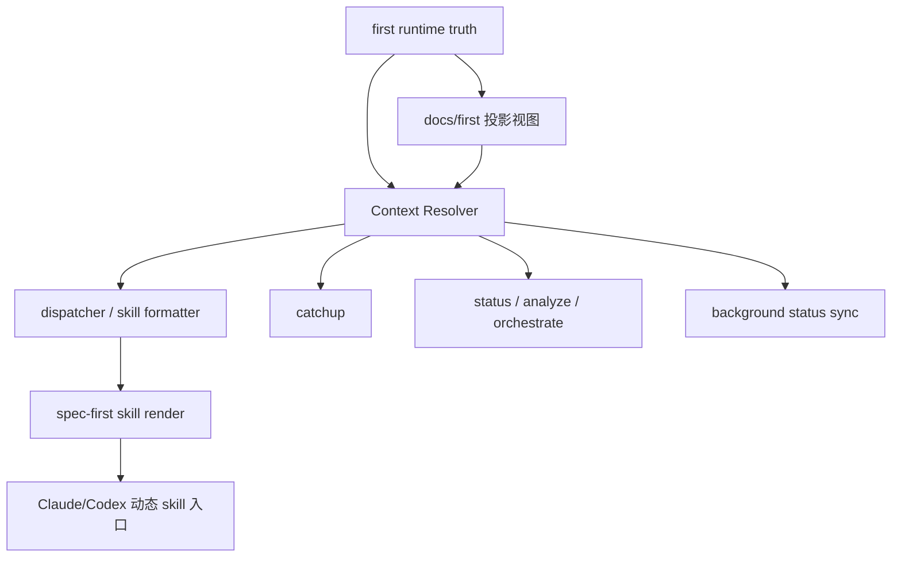

# First Context Dynamic Injection Design

**Goal:** 打通 `spec-first:first` 生成的项目背景真源到后续 skill 的真实自动注入链路，让宿主实际调用稳定获得最新上下文。

**Architecture:** 保留现有 `first` runtime truth 与 docs 投影视图，先打通宿主动态 skill 入口，再新增一个 V1 精简版 `Context Resolver` 负责按 `skillName + featureId` 解析上下文；随后让 `dispatcher` 逐步改为消费 resolver 输出；`backgroundInputStatus` 继续保留在 Feature 的 `stage-state.json` 中，但由 `first` 执行后触发一次缓存刷新。

**Tech Stack:** TypeScript, Node.js, spec-first CLI, Claude/Codex skill registration, runtime JSON truth source

---

## 1. 背景与问题

当前仓库已经具备以下基础能力：

- `first` 可生成 `.spec-first/runtime/first/` 下的真源资产：
  - `index.json`
  - `summary.json`
  - `role-views.json`
  - `stage-views.json`
- `dispatcher.loadSkill()` 已支持按 skill 类型注入 runtime notice。
- `docs/first/*` 已作为 docs 降级投影视图存在。

但当前链路没有真正闭环，主要断点在宿主入口：

1. Claude/Codex 当前安装的是静态 skill 内容或 skill 目录副本。
2. 宿主真实调用不保证经过 `dispatcher.loadSkill()`。
3. 因此 `first` 真源虽然存在，但后续 skill 并不稳定拿到动态上下文。
4. `backgroundInputStatus` 主要在 `init` 时采样写入，后续补跑 `first` 后已有 Feature 状态可能滞后。

结论：当前实现是“内部已有注入能力”，但不是“全流程自动注入”。

## 2. 设计目标

本设计目标：

1. 后续 skill 在宿主真实调用时稳定获得 `first` 上下文。
2. 统一背景解析逻辑，避免 `dispatcher`、`catchup`、`status`、`analyze` 各自维护一套判断。
3. 保持现有 runtime truth 模型不变，避免一次性重构过大。
4. 为后续 richer context slice 留好扩展点。

非目标：

1. 本轮不重做全新的 Context Pack 框架。
2. 本轮不替换 `first` runtime 的数据模型。
3. 本轮不追求把所有 long-form 文档全文注入 skill prompt。

## 3. 方案选择

### 方案 A：继续增强 `build*RuntimeNotice()`

- 优点：改动最小。
- 缺点：只增强注入内容，不解决宿主真实入口未接线问题。

### 方案 B：统一 `Context Resolver` + 动态 skill 入口

- 优点：直接修主链路断点，风险可控，能复用现有 runtime truth 与 notice 体系。
- 缺点：需要调整宿主注册方式与 skill 渲染流程。

### 方案 C：全新 Context Pack 体系

- 优点：长期最彻底。
- 缺点：改动过大，短期性价比最低。

**结论：采用方案 B。**

## 4. 目标架构



设计原则：

- runtime truth 仍是首选数据源。
- docs 投影视图仅用于降级与兼容。
- 解析逻辑统一到 `Context Resolver`。
- 宿主只消费动态渲染后的 skill，而不是原始静态 `SKILL.md`。

## 5. 核心模块设计

### 5.1 Context Resolver

建议新增：

- `src/core/skill-runtime/context-resolver.ts`

职责：

1. 定位 `featureId`
2. 读取 runtime truth
3. 运行 docs 降级
4. 按 `skillName` 生成标准化上下文结果
5. 输出 `backgroundInputStatus`、视图切片与推荐动作

V1 建议返回结构：

```ts
interface ResolvedSkillContext {
  featureId?: string;
  skillName: string;
  source: 'runtime' | 'docs' | 'none';
  backgroundInputStatus: 'full' | 'degraded' | 'blind';
  stageViewSummary?: string;
  roleViewSummary?: string;
  firstSummaryLite?: {
    projectName: string;
    platformType?: string;
    techStack: string[];
    modules: string[];
    risks: string[];
  };
  missingAssets: string[];
  recommendedAction?: string;
}
```

### 5.2 Dynamic Skill Render

建议新增 CLI 子命令：

- `spec-first skill render <skill-name> [--feature <featureId>]`

职责：

1. 定位原始 `SKILL.md`
2. 调用 `dispatcher.loadSkill()` 或新的 resolver + formatter
3. 输出最终动态渲染后的 skill 内容

这个命令将成为宿主 skill 的真实入口。

### 5.3 Background Status Sync

建议新增：

- `syncBackgroundInputStatus(projectRoot: string): SyncResult`

触发时机：

1. `first` 成功执行后自动触发一次
2. `status/orchestrate/analyze` 允许只读兜底重算，但不静默写盘

作用：

- 扫描 `specs/*/stage-state.json`
- 基于最新 runtime/docs 状态重算 `backgroundInputStatus`
- 回写 Feature 运行态文件中的缓存字段

说明：

- `backgroundInputStatus` 仍然是 Feature `stage-state.json` 上的运行态缓存。
- `first runtime` 仍然是背景真源，sync 只负责刷新缓存，不引入新的 truth source。

## 6. skill 维度的上下文切片规则

V1 只定义最小切片规则：

- `spec/design/code/verify/review`
  - 主要消费 `stageViewSummary`
- `onboarding`
  - 主要消费 `roleViewSummary`
- `task/plan/orchestrate/status/analyze`
  - 主要消费 `backgroundInputStatus + firstSummaryLite + recommendedAction`

后续 richer context slice 再单独扩展，不在本轮设计中一次性做满。

## 7. 与现有代码的集成方式

### `src/core/skill-runtime/dispatcher.ts`

现状：

- 每个 `build*RuntimeNotice()` 自己读 runtime / docs 并决定降级逻辑。

改造后：

- `dispatcher` 只负责：
  - 调用 resolver
  - 把 `ResolvedSkillContext` 渲染成 notice
- 背景判断逻辑移出 `dispatcher`

### `src/core/skill-runtime/first-context.ts`

现状：

- 负责 runtime 资产加载、重建、健康判断。

改造后：

- 继续保留为 runtime truth 读写层
- 不再承担 skill-specific 渲染逻辑

### `src/shared/skill-commands.ts`

现状：

- Claude 写静态命令文件
- Codex 复制整个 skill 目录

改造后：

- Claude/Codex 入口改成动态代理
- 宿主不再直接依赖静态正文作为最终执行内容

## 8. 迁移策略

### Step 1：新增动态 skill 入口

新增：

- `spec-first skill render`

这一阶段先证明真实 skill 内容可以动态渲染。

### Step 2：切宿主入口到动态渲染

- 修改 Claude command 生成逻辑
- 修改 Codex skill 注册逻辑
- 保留兼容期与 fallback 行为

### Step 3：新增 V1 `Context Resolver` 并让 `dispatcher` 改用 resolver

把现有：

- `buildSpecRuntimeNotice()`
- `buildDesignRuntimeNotice()`
- `buildTaskRuntimeNotice()`
- `buildCodeRuntimeNotice()`
- `buildReviewRuntimeNotice()`
- `buildVerifyRuntimeNotice()`
- `buildPlanRuntimeNotice()`
- `buildOnboardingRuntimeNotice()`

逐步改成：

- `resolveSkillContext(...)`
- `formatSkillNotice(...)`

### Step 4：接入 `first -> stage-state` 自动同步

- `first` 完成后自动同步所有 Feature 的 `backgroundInputStatus`

## 9. 测试设计

### 单元测试

1. `context-resolver`
   - runtime 完整 -> `source=runtime`
   - docs 降级 -> `source=docs`
   - 全缺失 -> `source=none`
   - 不同 skillName -> 返回对应切片

2. `background status sync`
   - 补跑 `first` 后，已有 Feature 的状态被正确更新

### 集成测试

1. `dispatcher.loadSkill()`
   - 基于 resolver 后，输出 notice 与旧行为兼容

2. `spec-first skill render <skill>`
   - 输出动态 skill 内容，而不是原始静态正文

### 端到端测试

1. `spec-first update`
   - 安装后宿主入口应指向动态代理链路

2. 场景回归
   - 先 `init`
   - 后补跑 `first`
   - 再执行 `spec/design/code/review/verify`
   - 应能拿到更新后的背景状态与注入内容

## 10. 风险与控制

### 风险 1：宿主兼容性

- 不同宿主对 skill 文件结构要求不同。
- 控制：
  - 保留原 skill 目录布局
  - 用 wrapper / command proxy 代替正文副本

### 风险 2：KV-Cache 稳定性退化

- 动态注入内容过大可能破坏缓存稳定性。
- 控制：
  - resolver 只输出轻量切片
  - 限制注入字节预算

### 风险 3：逻辑迁移期双轨维护

- `dispatcher` 与 resolver 共存期间可能出现行为不一致。
- 控制：
  - 分阶段迁移
  - 对比旧 notice 与新 notice 的测试快照

## 11. 成功标准

满足以下条件时视为设计落地成功：

1. `first` 生成后，宿主真实 skill 调用稳定拿到动态背景。
2. `backgroundInputStatus` 可在补跑 `first` 后自动同步到已有 Feature。
3. `dispatcher` 不再手写分散的背景判断逻辑。
4. docs 降级路径仍可正常工作。
5. 新增 E2E 用例能证明“真实入口已接线”。

## 12. 下一步

建议基于本设计生成独立实现计划，拆成以下四批：

1. `Context Resolver` 与单元测试
2. `dispatcher` 接 resolver
3. `skill render` 与宿主入口切换
4. `backgroundInputStatus` 同步与 E2E 回归
