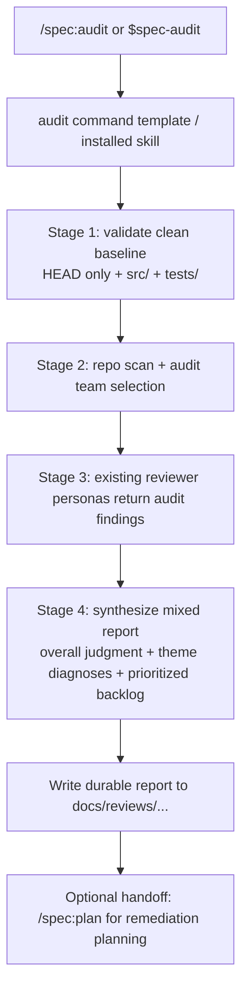

# 功能：新增 `spec-audit` 基线审查工作流

## 概览

为 `spec-first` 增加一个辅助型 `spec-audit` workflow，用来对当前分支最新已提交状态下的 `src/` 与 `tests/` 做全仓基线体检。它不是五阶段主链上的新阶段，也不替代现有 `spec-review` 的 diff/PR 审查合同，而是提供一个单独的、可复用的深度诊断入口。

## 问题背景

当前仓库已经有成熟的 `spec-review` 工作流，但它的 scope discovery、schema、输出模板和 verdict 都围绕“代码变更审查”设计，默认目标是评估一个 diff 是否能合并。用户这次需要的不是变更集 verdict，而是对当前仓库已提交代码状态做一次多视角基线体检，输出整体判断、主题诊断和带优先级的整改清单，并且结论不能被未提交修改污染。

## 需求追踪

- R1-R3. 新 workflow 必须以当前分支最新已提交状态为准，只审查 `src/` 与 `tests/`，且默认排除文档与 workflow 资产（见 origin: `docs/brainstorms/2026-03-30-repo-code-baseline-review-requirements.md`）。
- R4-R5. 输出必须覆盖维护者、产品负责人、开源使用者三种视角，且不能退化成单一 bug hunt。
- R6-R8. 报告必须是混合型深度版：先给整体判断和主题诊断，再给分级问题清单，至少覆盖代码健康、测试策略、架构/模块边界、对外可理解性/可采用性。
- R9-R11. 发现项必须使用明确优先级，并区分事实观察、风险判断、建议动作。
- R12-R13. 结果首先服务于“建立健康基线”和后续决策，而不是直接承诺修复方案。

## 范围边界

- 不修改 `spec-review` 的 diff 审查合同、merge verdict 语义或 autofix 路径。
- 不把 `spec-audit` 放进五阶段主链，也不把产品叙事改成“六阶段”。
- 不在 MVP 中增加新的 Node.js CLI 子命令；继续沿用 manifest + command template + skill 资产的现有打包模式。
- 不在 MVP 中扩展 `spec-audit` 的审查目标到 README、技能文档、模板资产或历史分析文档。
- 不在本计划中设计修复方案生成器、todo 自动拆分器或自动整改闭环。

## 上下文与调研

### 相关代码与模式

- `.claude-plugin/plugin.json`
  现有 public command 清单来源；新增 workflow 时必须在这里注册，生成链路和 smoke test 都依赖它。
- `templates/claude/commands/spec/brainstorm.md`
- `templates/claude/commands/spec/plan.md`
- `templates/claude/commands/spec/review.md`
  这些命令模板体现了“public command -> installed skill contract”的标准写法。
- `skills/spec-review/SKILL.md`
  当前 review 合同明确围绕 diff/PR/branch scope、pre-existing finding、merge verdict 和 autofix 队列，不能直接拿来做全仓基线体检。
- `skills/spec-review/references/diff-scope.md`
- `skills/spec-review/references/findings-schema.json`
- `skills/spec-review/references/review-output-template.md`
  这些 reference 文件证明现有 review 输出是“按 diff、按 severity 汇总”的模型，适合作为新 audit workflow 的参考，但不适合直接复用。
- `src/cli/plugin.js`
- `src/cli/commands/init.js`
- `src/cli/index.js`
- `bin/postinstall.js`
  打包、同步、帮助输出、安装提示都在这些入口上硬编码了当前 command/skill 的产品表述。
- `tests/smoke/cli.sh`
  当前对 command 数量、skill 数量、生成资产、打包产物有硬编码断言；新增 workflow 必须同步更新。

### 经验沉淀

- 当前仓库没有可直接复用的 `docs/solutions/` 基线审查方案文档。

### 外部参考

- 无。该工作主要是 repo 内 workflow 资产扩展，现有本地模式已足够支撑规划。

## 关键技术决策

- **新增辅助型 `spec-audit` workflow，而不是扩展 `spec-review`**: `spec-review` 从 scope discovery 到 findings schema 都内建了 diff 审查语义；把 repo-baseline 模式塞进去会同时污染 prompt 合同、报告模板和用户心智。
- **保持五阶段主链不变**: `spec-audit` 作为辅助诊断入口存在，文档上应表述为“补充型诊断 workflow”，而不是第六个主阶段。
- **首版仍暴露为公开入口，而不是只做隐藏 skill**: 这次工作的目标不是内部试验一个 prompt，而是给用户一个稳定、可复用、跨平台一致的基线体检入口。若只做隐藏 skill，README、手册、runtime 生成和跨平台 discoverability 都无法闭环，用户仍需要记住仓库内部细节才能触发能力。
- **复用现有 reviewer 资产，新增 audit 专属 orchestrator 合同**: MVP 不新增 reviewer 文件，优先通过 `spec-audit` 的 team 选择、综合规则和模板来重组已有能力。
- **复用 P0-P3 优先级刻度，但改变解释语境**: 在 baseline audit 中，P0-P3 代表整改优先级而非 merge verdict；这样能和现有 triage 体系兼容，又不会误导为“当前 PR 阻断”。
- **使用专属报告模板和 findings schema**: 基线体检需要“总评 + 主题诊断 + 优先级问题单”的混合结构，不能直接套 `spec-review` 的 diff findings 表格。
- **基线报告写入新的 durable artifact 路径，并同步升级保护规则**: 正式报告输出到 `docs/reviews/`，运行期 scratch/context 保持在 `.context/spec-first/spec-audit/`；同时要把 `docs/reviews/` 纳入相邻 workflow 的 protected-artifact 规则，避免新报告在后续 review/todo 流程中被误判为普通可删除文档。
- **未提交修改默认视为阻塞输入**: 为满足 R1，若 `src/` 或 `tests/` 存在未提交变更，`spec-audit` 应停止并要求用户清理工作区或在隔离 checkout 中运行，而不是静默忽略或混入结果。

## 开放问题

### 规划阶段已解决

- **是扩展 `spec-review` 还是新增 workflow？**
  结论：新增 `spec-audit`。`spec-review` 的 diff scope、pre-existing 语义和 merge verdict 过于特化，不适合作为 repo-baseline 入口。
- **是否复用 `spec-review` 的严重级别？**
  结论：复用 P0-P3 级别，但在 `spec-audit` 中重定义为“整改优先级”，不携带 merge-ready 语义。
- **是否需要新增 reviewer 资产？**
  结论：MVP 不新增 reviewer 文件，先复用现有 `review` 类 agent，通过 audit orchestrator 的 team 组合和综合层来满足三视角要求。
- **是否直接复用 `review-output-template.md`？**
  结论：不复用。保留 severity 和 file/line finding 结构，但改为 audit 专属模板，增加整体判断、主题诊断、事实/风险/建议分层。

### 延后到实现阶段

- `spec-audit` 的最小 reviewer team 应该包含哪些 always-on persona，哪些条件性 persona 应跟随 repo 技术面自动启用，需要在实现时根据 prompt 长度和重复率再做收敛。
- `docs/reviews/` 的命名细则是按仓库名、分支名还是主题名组织，实施时需要在不引入脆弱命名的前提下定稿。
- 是否需要在首版中支持 path filter 或 commit-ish 参数，当前计划默认不支持，后续可根据真实使用再扩展。

## 高层技术设计

> *This illustrates the intended approach and is directional guidance for review, not implementation specification. The implementing agent should treat it as context, not code to reproduce.*

设计重点：

- `spec-audit` 不走 diff merge-base，而是直接把 `HEAD` 下 `src/` 与 `tests/` 视作基线。
- `spec-audit` 的 synthesis 需要同时输出主题级诊断与文件级问题单，而不是只做 diff finding merge。
- handoff 方向以 `spec:plan` 为主，强调“把高优先级发现转成修复计划”，而不是继续 `spec:work` 或 autofix。

## 实现单元

- [ ] **单元 1：定义 `spec-audit` 工作流合同**

**目标：** 建立一个独立的 baseline audit skill 合同，明确 scope、team、report 结构和 handoff 规则。

**需求：** R1, R2, R3, R4, R5, R6, R7, R8, R9, R10, R11, R12, R13

**依赖：** 无

**文件：**
- Create: `skills/spec-audit/SKILL.md`
- Create: `skills/spec-audit/references/audit-findings-schema.json`
- Create: `skills/spec-audit/references/audit-output-template.md`
- Create: `skills/spec-audit/references/repo-baseline-scope.md`
- Modify: `skills/spec-review/SKILL.md`
- Modify: `skills/document-review/SKILL.md`
- Modify: `skills/todo-resolve/SKILL.md`
- Test: `tests/smoke/cli.sh`

**方案：**
- 以 `spec-review` 为参考，但将 Stage 1 改为“已提交基线检查 + `src/`/`tests/` inventory”，不再做 merge-base diff。
- 定义 audit 专属输出结构，至少包含：overall judgment、theme diagnoses、prioritized findings、fact/risk/action split、next-step recommendation。
- 明确 `spec-audit` 为只读工作流：不写代码、不做 autofix、不创建 PR，不与 `spec-review` 的修复路由混用。
- 明确 baseline 被未提交修改污染时的阻塞行为。
- 将 `docs/reviews/` 纳入 canonical source 层的 protected-artifact 规则，至少覆盖 `spec-review`、`document-review`、`todo-resolve` 这三个会对文档做删除/清理判断的相邻 workflow。

**参考模式：**
- `skills/spec-review/SKILL.md`
- `skills/spec-review/references/findings-schema.json`
- `skills/spec-review/references/review-output-template.md`
- `skills/agent-native-audit/SKILL.md`

**测试场景：**
- Happy path: `spec-audit` 明确声明只针对当前分支 `HEAD` 的 `src/` 与 `tests/`，不会误审文档或未提交修改。
- Happy path: audit 输出模板同时包含整体判断、主题诊断和带 P0/P1/P2/P3 的问题清单。
- Happy path: `docs/reviews/` 被相邻 workflow 视为受保护产物，不会在清理、review synthesis 或 todo resolve 中被误建议删除。
- Error path: 当 `src/` 或 `tests/` 有未提交变更时，workflow 明确停止并要求用户清理工作区或切换到隔离 checkout。
- Integration: audit contract 的 handoff 指向 `spec:plan`，而不是沿用 `spec-review` 的 merge/fix/todo 路径。

**验证方式：**
- 新 skill 与 reference 资产能单独读通，且其合同不再依赖 diff-only 语义。

- [ ] **单元 2：将 `spec-audit` 作为可发布的辅助工作流暴露出来**

**目标：** 把 `spec-audit` 纳入 canonical 资产同步链路，让 Claude 和 Codex 都能安装并调用它，同时不改写五阶段主链叙事。

**需求：** R1, R2, R6, R7, R12, R13

**依赖：** 单元 1

**文件：**
- Modify: `.claude-plugin/plugin.json`
- Create: `templates/claude/commands/spec/audit.md`
- Modify: `src/cli/index.js`
- Modify: `bin/postinstall.js`
- Test: `tests/smoke/cli.sh`

**方案：**
- 在 plugin manifest 中新增 `audit` command，映射到 `spec-audit` folder，但在产品文案上标注为辅助诊断 workflow。
- 延续现有 internal/public naming split：source skill 使用内部 workflow 名称，生成到 Codex runtime 后再改写为 `name: spec-audit`。
- 更新版本横幅和安装提示，把 audit 放在 “auxiliary” 或 “additional workflow” 位置，而不是重写为六阶段主链。
- 在命令描述中明确 `spec-audit` 是“全仓基线体检”，`spec-review` 是“变更集审查”，避免两个入口在安装后对用户表现得像同义词。

**参考模式：**
- `.claude-plugin/plugin.json`
- `templates/claude/commands/spec/review.md`
- `templates/claude/commands/spec/plan.md`
- `src/cli/plugin.js`

**测试场景：**
- Happy path: `init --claude` 后生成 `audit.md`，且命令模板引用 `.claude/skills/spec-audit/SKILL.md`。
- Happy path: `init --codex` 后生成 `.agents/skills/spec-audit/SKILL.md`，且 runtime 名称被适配为 `spec-audit`。
- Integration: CLI 安装/版本提示新增 audit，但仍保留“五阶段主链 + 辅助审计”的叙述边界。
- Error path: 清理和重装流程不会遗留或漏删 `spec-audit` 资产。

**验证方式：**
- manifest、模板、帮助输出和安装提示在本地资产同步链路中一致可见。

- [ ] **单元 3：补齐新增资产数量与打包输出的回归覆盖**

**目标：** 让现有 smoke/package 检查覆盖 `spec-audit` 的安装、同步和打包回归。

**需求：** R6, R7, R9, R10, R12

**依赖：** 单元 2

**文件：**
- Modify: `tests/smoke/cli.sh`
- Test: `tests/smoke/cli.sh`

**方案：**
- 更新 Claude command 数量断言、Codex skill 数量断言，以及 `audit.md` / `spec-audit` 的存在性检查。
- 保持 agent 数量不变，确保这次功能不误引入新的 agent inventory 漂移。
- 在 `npm pack --dry-run` 断言中加入 `templates/claude/commands/spec/audit.md` 和 `skills/spec-audit/SKILL.md`。

**参考模式：**
- `tests/smoke/cli.sh`

**测试场景：**
- Happy path: smoke test 断言 Claude 安装后存在 6 个 command file，其中包含 `audit.md`。
- Happy path: smoke test 断言 Codex 安装后存在 42 个 skill directory，其中包含 `spec-audit`。
- Integration: `npm pack --dry-run` 输出包含新的 command template 与 skill 目录。
- Error path: clean/re-init 后 `spec-audit` 不会残留孤儿文件，也不会在重装时缺失。

**验证方式：**
- 当前 smoke 套件能够在 `spec-audit` 资产丢失、数量不一致、打包遗漏时直接失败。

- [ ] **单元 4：在不打破五阶段模型的前提下更新对外文档**

**目标：** 让用户能够发现 `spec-audit`，同时不把产品叙事从“五阶段主链”误导成“六阶段主链”。

**需求：** R4, R5, R6, R7, R12, R13

**依赖：** 单元 2

**文件：**
- Modify: `README.md`
- Modify: `docs/05-用户手册/01-快速开始.md`
- Modify: `docs/05-用户手册/README.md`
- Modify: `docs/05-用户手册/02-核心概念.md`
- Modify: `docs/05-用户手册/03-完整示例.md`
- Modify: `docs/05-用户手册/04-常见问题.md`
- Test: `tests/smoke/cli.sh`

**方案：**
- 在 README 和用户手册中增加“辅助诊断 workflow: `spec-audit`”说明，并明确它与 `spec-review` 的区别：前者做全仓基线体检，后者做变更集审查。
- 保留所有“五阶段”图和主链表述；仅在列出可用命令、典型使用场景或 FAQ 时补充 audit。
- 在“快速开始”中补一个可选支线：完成主链或需要建立健康基线时，可额外运行 `spec-audit`。
- 在“完整示例”中补一个短小的 audit 分支示例，而不是把 audit 硬插进主链步骤。
- 将硬编码的 command/skill 计数更新为“5 个核心工作流命令 + 1 个辅助审计命令 / 42 个技能”。

**参考模式：**
- `README.md`
- `docs/05-用户手册/02-核心概念.md`

**测试场景：**
- Happy path: README 明确给出 `spec-audit` 的使用场景和与 `spec-review` 的边界。
- Happy path: 快速开始和完整示例都能让首次用户看到 `spec-audit` 的入口，但不会误以为它是必经阶段。
- Happy path: 用户手册保留五阶段主链描述，同时将 audit 标注为辅助诊断入口。
- Error path: 文档不会把 `spec-audit` 写成五阶段里的新 stage，也不会暗示它替代 `spec-review`。

**验证方式：**
- 用户从 README 或手册入口能找到 `spec-audit`，并理解它不是主链阶段替代品。

## 系统级影响

- **Interaction graph:** plugin manifest 新增 command 后，会影响 `init` 生成资产、runtime 安装结构、版本提示和 smoke/package 断言。
- **Error propagation:** 如果 `spec-audit` 的 scope 规则不严格，最容易出现“把未提交修改混入基线”或“错误审到文档资产”的假阳性。
- **State lifecycle risks:** 新增 durable report 路径 `docs/reviews/` 后，需要与 `.context/spec-first/spec-audit/` 的 scratch 路径职责分离，避免把 scratch 误当长期资产。
- **API surface parity:** Claude 需要 `/spec:audit` command，Codex 需要 `$spec-audit` skill；两端都必须遵守同一个 canonical contract。
- **Integration coverage:** 关键集成面是 manifest -> init sync -> runtime path transform -> smoke/package assertions，而不是 Node.js 业务逻辑。
- **Unchanged invariants:** 五阶段主链、`spec-review` 的 diff 审查合同、47 个 agent inventory、现有 `doctor/clean` 平台适配模式都不应被改变。

## 备选方案与取舍

- **给 `spec-review` 增加 repo-baseline 模式**: 未选。现有 skill 的 diff-scope、pre-existing、merge verdict、autofix 路由写得过深，硬扩展只会让合同和报告模板同时变脏。
- **只写一份一次性审查文档，不新增 workflow 资产**: 未选。用户要的是可复用的基线体检入口，而不是当前 session 的一次性输出。
- **新增专门的 reviewer agent 集合**: 暂不选。MVP 先验证已有 persona 是否足以支撑三视角综合；如首轮使用后仍有明显盲区，再增加 audit-specific agent。

## 风险与依赖

| Risk | Mitigation |
|------|------------|
| 用户分不清 `spec-audit` 和 `spec-review` | 在 command template、README、FAQ 中显式对比“全仓基线体检 vs 变更集审查” |
| 新 workflow 让产品叙事从五阶段漂移成六阶段 | 所有文案都将 audit 标为辅助诊断 workflow，不改阶段图和主链表 |
| 沿用现有 reviewer 导致重复 finding 太多 | 在 `spec-audit` synthesis 层定义主题诊断与 finding 去重规则，并压缩 always-on team |
| `HEAD` 基线与工作区状态混淆，导致结果失真 | 在 Stage 1 强制检查 `src/`/`tests/` 工作区是否干净，不满足就停止 |
| 新 asset 漏进打包或 runtime 同步链路 | 用 smoke test 和 `npm pack --dry-run` 断言 command/skill 的存在性和数量 |

## 文档与运行说明

- MVP 至少应更新 README 与用户手册入口页，让 `spec-audit` 可发现。
- `docs/01-*`、`docs/02-*`、`docs/03-*` 这些设计文档大量硬编码“五阶段”，不应在本轮全部重写；若后续把 audit 定位提升为官方长期能力，再评估是否统一补充辅助 workflow 章节。
- 首次实现后，建议在真实仓库上做一次手工 dry run，验证 reviewer 组合、报告长度和 P0/P1/P2 校准是否符合预期。

## 来源与参考

- **Origin document:** [docs/brainstorms/2026-03-30-repo-code-baseline-review-requirements.md](/Users/kuang/xiaobu/spec-first/docs/brainstorms/2026-03-30-repo-code-baseline-review-requirements.md)
- Related code: [skills/spec-review/SKILL.md](/Users/kuang/xiaobu/spec-first/skills/spec-review/SKILL.md)
- Related code: [skills/spec-review/references/diff-scope.md](/Users/kuang/xiaobu/spec-first/skills/spec-review/references/diff-scope.md)
- Related code: [skills/spec-review/references/review-output-template.md](/Users/kuang/xiaobu/spec-first/skills/spec-review/references/review-output-template.md)
- Related code: [.claude-plugin/plugin.json](/Users/kuang/xiaobu/spec-first/.claude-plugin/plugin.json)
- Related code: [src/cli/plugin.js](/Users/kuang/xiaobu/spec-first/src/cli/plugin.js)
- Related code: [tests/smoke/cli.sh](/Users/kuang/xiaobu/spec-first/tests/smoke/cli.sh)
