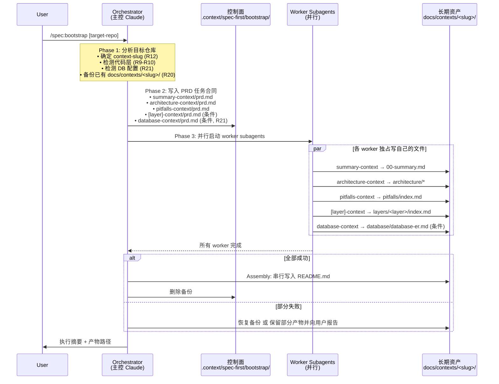

# feat: 新增 spec-bootstrap Stage-0 项目上下文生成 workflow

## Overview

为 `spec-first` 增加一个新的 supporting workflow `spec-bootstrap`，把 Trellis 的 `cc-codex-spec-bootstrap` 能力集成为原生的 Stage-0 项目上下文资产生成器。外部开发者可在自己的项目上运行 `/spec:bootstrap`（Claude）或 `$spec-bootstrap`（Codex），自动为目标项目生成 `docs/contexts/<context-slug>/` 下的可长期复用上下文资产。

## Problem Frame

使用 spec-first 工作流的外部开发者在面对新项目时，缺乏项目级的上下文基座。后续的 brainstorm / plan / work / review 各阶段只能依赖临场猜测，导致产出质量不稳定、重复分析成本高。需要一个 Stage-0 supporting workflow 为目标项目自动生成可长期复用的项目上下文资产（see origin: `docs/brainstorms/2026-03-31-spec-bootstrap-requirements.md`）。

## Requirements Trace

- R1. 新增 canonical skill `skills/spec-bootstrap/SKILL.md`
- R2. Skill 文案保持平台中立，面向外部开发者
- R3. 创建命令模板 `templates/claude/commands/spec/bootstrap.md`，更新 `.claude-plugin/plugin.json`
- R4-R6. 产物模型：长期资产 `docs/contexts/<slug>/`，短期控制面 `.context/spec-first/bootstrap/<slug>/tasks/`
- R7-R8. 固定产物：README.md、00-summary.md、architecture/*、pitfalls/index.md；README.md 由 orchestrator assembly
- R9-R11. 条件产物：按代码库证据生成 layers/* 和 guides/*
- R12-R13. Slug 规则：用户传入 > 复用已验证 slug > 目录名 kebab-case
- R14-R16. 三阶段执行 + 文件级 ownership
- R17-R18. 任务模型：固定 3 任务 + 条件层任务
- R19. PRD Contract 保留 Trellis 骨架，`references/prd-template.md`
- R20. Rerun 备份/恢复机制
- R21. 数据库配置检测：Phase 1 扫描目标项目的 DB 连接配置（用户传入 > config.yaml > 环境变量 > ORM 配置 > 框架配置），识别单/多数据源，MVP 仅支持 MySQL
- R22. ER 文档生成：检测到 MySQL + CLI 可连接时，触发 database-context 条件任务，产出 `docs/contexts/<slug>/database/` 下的 ER 概览文档（索引化 + Mermaid erDiagram + Mermaid flowchart + 可执行 CLI 查询、<200行/<10KB）。图格式选用 Mermaid（而非 ASCII art），因 Mermaid 语法是线性 token 序列，LLM 推理精度显著高于依赖对齐的 box-drawing 字符
- R23. 备份表/过期表过滤：通过表名后缀启发式（_bak/_backup/_old/_copy/_tmp/_temp/_deprecated/_archive）、表名前缀（bak_/backup_/tmp_/temp_）、表名含日期模式、最后更新时间 180 天 + 无 FK 关联等规则排除非业务表

## Scope Boundaries

- 不自动把 `docs/contexts/` 注入五阶段
- 不新增 Node CLI 子命令
- 不修改 adapter 架构
- 不新增专门的 orchestrator/worker agent
- MVP 仅支持 MySQL 数据库分析，架构预留多 DB 扩展（PostgreSQL/SQLite/MongoDB/Oracle/MSSQL）

## Context & Research

### Relevant Code and Patterns

- `.claude-plugin/plugin.json` — manifest 结构：5 个 command entries，每个有 name/filename/description/argumentHint/skill
- `templates/claude/commands/spec/plan.md` — 命令模板模式：frontmatter(description, argument-hint) + 标题 + "read SKILL.md as primary contract" 规则
- `skills/spec-brainstorm/SKILL.md` — 复杂 skill 结构参考，包含 phases、interaction rules、templates
- `skills/document-review/SKILL.md` — 多 agent 调度模式参考
- `tests/smoke/cli.sh` — 断言：5 commands、41 skills、47 agents；需更新为 6/42（agents 不变）
- `docs/07-经验总结/2026-03-30-新增-skill-agent-标准操作清单.md` — 新增 skill/agent 的标准步骤清单
- `docs/07-经验总结/2026-03-30-codex-打包发布经验总结.md` — Codex 打包发布经验，skill name 必须与目录名一致
- `docs/01-需求分析/6.项目知识库/cc-codex-spec-bootstrap-skill-分析.md` — Trellis 原 skill 完整分析
- `docs/01-需求分析/6.项目知识库/cc-codex-spec-bootstrap-skill-实现梳理.md` — Trellis 原 skill 实现拆解
- `docs/plans/2026-03-31-spec-bootstrap-design.md` — 详细设计文档
- `docs/plans/2026-03-30-004-feat-spec-audit-baseline-plan.md` — 支撑型 workflow 先例（spec-audit）
- `agent-database.md`（外部参考，见 External References）— 数据库检测 + ER 生成 agent 设计（配置检测优先级、ORM 文件映射、CLI 验证命令、产物模板、质量检查标准）

### Institutional Learnings

- Codex skill 目录名和 `name:` 必须一致（see `docs/07-经验总结/2026-03-30-codex-打包发布经验总结.md`）
- 源码资产只维护在 `skills/` 和 `agents/`，运行时目录视为生成物（see 标准操作清单）
- 核心_workflow_ skill 必须同步更新：manifest + command template + skill directory
- 发布验证需走完整 `npm pack → install → init → doctor` 链路
- 支撑型 workflow 应表述为"补充型"，不放进五阶段主链（see spec-audit plan 先例）

### External References

- `agent-database.md` — 数据库检测 + ER 生成 agent 设计参考（实施前需将其核心内容提炼为 `skills/spec-bootstrap/references/database-prd-template.md`，不在仓库内，实施时由实施者自行定位本地副本读取）

## Key Technical Decisions

- **Skill-first、subagent-assisted**: 不新增专门的 orchestrator/worker agent，主控逻辑在 SKILL.md 中
- **保留 Trellis PRD 骨架**: Goal/Context/Tools/Files/Rules/Acceptance/Notes 七节结构，只改写路径和执行模型
- **三级降级策略**: 完整模式（GitNexus+ABCoder）→ 增强降级（Serena MCP）→ 基础降级（Read/Grep/Glob）
- **文件级 ownership + orchestrator assembly**: 每个 worker 独占自己文件，README.md 由 orchestrator 串行写入
- **Stage-0 定位**: supporting workflow，不属于五阶段主链，文档中不使用"第六阶段"表述

## Open Questions

### Resolved During Planning

- Worker subagent prompt 模板设计: 在 `references/prd-template.md` 中统一模板，降级策略由 orchestrator 在 PRD 的 "Tools Available" 节注入模式相关的工具说明
- Orchestrator assembly 方式: 主控 Claude 直接收集 worker 产出并写入 README.md，不需要专门 assembly 函数
- Worker 部分失败处理: R20 已定义备份/恢复机制，orchestrator 在 Phase 3 前备份，全成功后删除备份，部分失败时恢复或报告
- Phase 1 排除 docs/contexts/: SKILL.md Phase 1 指令中明确排除该目录
- R3 Codex init 处理: 确认无需额外处理，Codex 通过 skill sync 自动发现

### Deferred to Implementation

- SKILL.md 的具体文案长度和详细程度: 保留 Trellis 主结构的同时适配 spec-first 路径，具体措辞在实现时打磨

## High-Level Technical Design

> *此图展示三阶段执行模型的整体流程，作为方向性审阅指引，不是实施规格。实施者应将其作为上下文理解，不应直接照搬。*

**关键设计验证点**：
- Orchestrator 是主控 Claude 实例本身，不是新的 agent（节约 token，降低复杂度）
- 每个 worker 只读自己的 PRD，只写自己拥有的文件清单（文件级 ownership 防止并行冲突）
- `README.md` 在 Phase 3 全部完成后由 orchestrator 串行写入（唯一共享导航文件）
- 两层产物分离：长期资产（`docs/contexts/`）与控制面（`.context/spec-first/bootstrap/`）各自独立

## Implementation Units

- [ ] **Unit 1: 创建 spec-bootstrap canonical skill**

**Goal:** 新增 `skills/spec-bootstrap/SKILL.md`、`skills/spec-bootstrap/references/prd-template.md` 和 `skills/spec-bootstrap/references/database-prd-template.md`，定义完整的 bootstrap workflow。SKILL.md 内需包含 R20 定义的 rerun 备份/恢复机制（Phase 3 前备份已有 `docs/contexts/<slug>/`，全部成功后删除备份，部分失败时恢复或报告），以及 R21-R23 定义的数据库 ER 分析能力（条件触发：后端项目 + MySQL 可连接）

**Requirements:** R1, R2, R4-R6, R7-R11, R12-R13, R14-R16, R17-R23

**Dependencies:** None

**Files:**
- Create: `skills/spec-bootstrap/SKILL.md`
- Create: `skills/spec-bootstrap/references/prd-template.md`
- Create: `skills/spec-bootstrap/references/database-prd-template.md`

> **注：** 设计文档中列出的 `skills/spec-bootstrap/references/mcp-setup.md` 已被有意省略——三级降级策略的工具检测逻辑和模式报告说明将直接内联在 SKILL.md 中，不单独抽文件。

**Approach:**
- SKILL.md 保留 Trellis 原始骨架（frontmatter + Why This Exists + Prerequisites + Phase 1/2/3 + Checklist）
- 必要改写：长期产物路径改为 `docs/contexts/<slug>/`，控制面改为 `.context/spec-first/bootstrap/`，执行术语改为 worker subagents，任务拆分改为 context domains
- 包含三级降级策略（完整/增强/基础）、文件级 ownership 规则、Phase 1 排除 `docs/contexts/` 规则、rerun 备份/恢复机制（R20）
- Phase 1 新增 DB 配置检测（R21）：按优先级扫描用户传入 > config.yaml > 环境变量 > ORM 配置 > 框架配置，识别 MySQL 单/多数据源，CLI 连接验证
- Phase 2 新增条件任务 `database-context`：仅当 Phase 1 检测到 MySQL + CLI 可连接时创建，PRD 中注入连接信息来源（不注入密码）、过滤规则（R23）、产物模板
- Phase 3 新增 database worker 指引：连接 MySQL，分析 schema（SHOW TABLES/DESCRIBE/SHOW CREATE TABLE/外键），应用过滤规则排除备份表/过期表，生成 ER 文档（R22）
- DB 降级策略（独立于代码分析降级链）：Level 1 MCP MySQL Server 可用（`mcp__mysql-mcp-server__*`）→ 直接查询 schema；Level 2 CLI mysql 可用 → 通过 bash 执行 SQL；Level 3 都不可用 → 降级为从 ORM/代码推断 ER，标记 `[未验证]`
- 产物路径 `docs/contexts/<slug>/database/`：单库 → `database-er.md`；多库 → `database-index.md` + `database-{name}.md`
- 面向外部开发者：引导说明、错误提示、模式检测报告
- prd-template.md 保留 Trellis 7 节骨架，改写路径和执行模型
- database-prd-template.md 参考 `agent-database.md` 设计：Step 1 配置检测流程（检测优先级表、环境变量模式表、协议识别规则、ORM 文件检测表、CLI 验证命令表、4 个连接状态标记：`[已验证 ✓]`/`[CLI不可用]`/`[未验证]`/`[连接超时]`）+ Step 2 ER 产物模板（Mermaid erDiagram + 核心关系表 + 实体类型清单 + 数据流图 + 表清单 + 索引摘要）+ 凭证防护规则（密码字段和完整 DSN 字符串均替换为 `***`）+ 质量检查标准
- database-prd-template.md 架构预留多 DB 支持（PostgreSQL/SQLite/MongoDB/Oracle/MSSQL），MVP 仅启用 MySQL 路径
- Skill frontmatter `name:` 使用 `spec-bootstrap`，与目录名一致（Codex 兼容）

**Patterns to follow:**
- `skills/spec-brainstorm/SKILL.md` — 复杂 skill 结构参考
- `skills/document-review/SKILL.md` — 多 agent 调度模式
- `docs/01-需求分析/6.项目知识库/cc-codex-spec-bootstrap-skill-实现梳理.md` — Trellis PRD 模板参考
- `agent-database.md`（外部参考，见 External References） — 数据库检测 + ER 生成的完整流程设计（Step 1 配置检测 + Step 2 ER 产物 + Step 3 多库产物 + 质量检查）

**Test scenarios:**
- Happy path: `spec-first init --claude` 后 `.claude/skills/spec-bootstrap/SKILL.md` 存在
- Happy path: `spec-first init --codex` 后 `.agents/skills/spec-bootstrap/SKILL.md` 存在且 `name:` 为 `spec-bootstrap`
- Content: SKILL.md 不包含 `.trellis/`、`codex -q`、外部绝对路径
- Content: prd-template.md 包含 Goal/Context/Tools/Files/Rules/Acceptance/Notes 七节
- Content: database-prd-template.md 包含 Step 1 配置检测 + Step 2 ER 产物模板 + 凭证防护 + 质量检查，以及 4 个连接状态标记（`[已验证 ✓]`、`[CLI不可用]`、`[未验证]`、`[连接超时]`）
- Content: database-prd-template.md 包含备份表过滤规则（后缀/前缀/日期模式启发式）
- Content: SKILL.md 包含 Phase 1 DB 检测逻辑 + Phase 2 database-context 条件任务创建 + Phase 3 database worker 指引

**Verification:**
- `grep -c "docs/contexts" skills/spec-bootstrap/SKILL.md` > 0
- `grep -c "\.trellis\|codex -q" skills/spec-bootstrap/SKILL.md` = 0
- `grep -c "database-context\|database-prd" skills/spec-bootstrap/SKILL.md` > 0
- `node -e "console.log(require('fs').existsSync('skills/spec-bootstrap/references/prd-template.md'))"` outputs true
- `node -e "console.log(require('fs').existsSync('skills/spec-bootstrap/references/database-prd-template.md'))"` outputs true

---

- [ ] **Unit 2: 创建命令入口与更新 manifest**

**Goal:** 新增 Claude command template，更新 plugin.json，使 `/spec:bootstrap` 和 `$spec-bootstrap` 可用

**Requirements:** R3

**Dependencies:** Unit 1

**Files:**
- Create: `templates/claude/commands/spec/bootstrap.md`
- Modify: `.claude-plugin/plugin.json`

**Approach:**
- 命令模板遵循现有模式：frontmatter(description, argument-hint) + 标题 + "read SKILL.md as primary contract" 规则
- plugin.json commands 数组追加 bootstrap entry：name/bootstrap, filename/bootstrap.md, description/Stage-0 项目上下文 bootstrap workflow, argumentHint/[项目路径或 slug], skill/spec-bootstrap
- 不为 Codex 新增 commands 数组（Codex hasCommands=false，通过 skill sync 自动发现）

**Patterns to follow:**
- `templates/claude/commands/spec/plan.md` — 命令模板格式
- `.claude-plugin/plugin.json` 现有 6 个 command entries — manifest 格式

**Test scenarios:**
- Happy path: `spec-first init --claude` 后 `.claude/commands/spec/bootstrap.md` 存在
- Happy path: 命令模板包含 "spec-bootstrap" 和 "SKILL.md" 引用
- Validation: `node -e 'JSON.parse(require("fs").readFileSync(".claude-plugin/plugin.json","utf8")); console.log("ok")'` 成功
- Validation: plugin.json commands 数组长度为 7

**Verification:**
- `node -e 'const p=JSON.parse(require("fs").readFileSync(".claude-plugin/plugin.json","utf8")); console.log(p.commands.length)'` = 7
- `node -e 'const p=JSON.parse(require("fs").readFileSync(".claude-plugin/plugin.json","utf8")); console.log(p.commands.find(c=>c.name==="bootstrap")?.skill)'` = spec-bootstrap

---

- [ ] **Unit 3: 更新用户与架构文档**

**Goal:** 在 README、核心概念、架构文档中补充 bootstrap 叙事，明确 Stage-0 定位

**Requirements:** R2, R4, R7, R12-R13

**Dependencies:** Unit 1, Unit 2

**Files:**
- Modify: `README.md`
- Modify: `docs/05-用户手册/02-核心概念.md`
- Modify: `docs/02-架构设计/01-整体架构.md`
- Modify: `docs/02-架构设计/02-目录结构.md`

**Approach:**
- README: 在五阶段列表后新增 bootstrap 说明段，明确 supporting workflow 定位，列出 Claude/Codex 入口
- 核心概念: 在五阶段闭环之后新增 "Supporting Workflows" 节，补充 `docs/contexts/` artifact family 说明
- 整体架构: 在核心 Skills 表格后新增 bootstrap 行，用户交互层图补充 `/spec:bootstrap`
- 目录结构: 在仓库源码视角补充 `skills/spec-bootstrap/`，在目标项目运行态补充 contexts 相关说明
- 全部文档中不使用"第六阶段"表述，统一使用 "Stage-0 supporting workflow" 或 "supporting workflow"

**Patterns to follow:**
- `docs/plans/2026-03-30-004-feat-spec-audit-baseline-plan.md` — spec-audit 如何定位为补充型 workflow

**Test scenarios:**
- Consistency: README、核心概念、架构文档中对 bootstrap 的描述一致
- Naming: 所有文档使用 "supporting workflow" 或 "Stage-0"，不出现 "第六阶段"
- Entry: Claude 入口 `/spec:bootstrap` 和 Codex 入口 `$spec-bootstrap` 都有提及

**Verification:**
- `grep -c "bootstrap" README.md docs/05-用户手册/02-核心概念.md docs/02-架构设计/01-整体架构.md docs/02-架构设计/02-目录结构.md` 全部 > 0
- `grep -c "第六" README.md docs/05-用户手册/02-核心概念.md docs/02-架构设计/01-整体架构.md` = 0

---

- [ ] **Unit 4: 更新 smoke tests**

**Goal:** 更新冒烟测试以覆盖 bootstrap 新增的 command、skill 和数量变化

**Requirements:** R3

**Dependencies:** Unit 1, Unit 2

**Files:**
- Modify: `tests/smoke/cli.sh`

**Approach:**
- 更新 command count 断言：6 → 7（"Generated 7 command file(s)"）
- 更新 skill count 断言：41 → 42（"Generated 42 skill directory(ies)"）
- 新增 bootstrap 文件存在性断言：`.claude/commands/spec/bootstrap.md`、`.claude/skills/spec-bootstrap/SKILL.md`
- 新增 Codex bootstrap 断言：`.agents/skills/spec-bootstrap/SKILL.md`
- 新增内容检查：bootstrap.md 包含 "Spec-First Bootstrap"，skill 包含 `spec-bootstrap`
- 更新 Codex init 的 skill count 断言：41 → 42
- 更新 npm pack 检查：新增 `skills/spec-bootstrap/SKILL.md` 和 `templates/claude/commands/spec/bootstrap.md`
- 更新 `for file in ideate.md brainstorm.md plan.md work.md review.md compound.md` 循环追加 bootstrap.md

**Patterns to follow:**
- `tests/smoke/cli.sh` 现有断言结构

**Test scenarios:**
- Happy path: `bash tests/smoke/cli.sh` 退出码 0
- Regression: 现有 6 个 command 断言仍然通过
- Coverage: bootstrap.md 在 Claude init 后被生成
- Coverage: spec-bootstrap skill 在 Codex init 后被生成

**Verification:**
- `bash tests/smoke/cli.sh` 退出码 0

---

- [ ] **Unit 5: 更新设计文档并最终验证**

**Goal:** 确认全部 Unit 1-4 完成后，设计文档与实施产物之间的一致性；旧草稿已在规划阶段手动删除，本 Unit 重点为验证通过。注意：本文件（006 前缀）是正式计划，不应被删除

**Requirements:** None（本 Unit 为实施后验证，不直接映射 R1-R23 中的任何需求项）

**Dependencies:** Unit 1, Unit 2, Unit 3, Unit 4

**Files:**
- Verify: `docs/plans/2026-03-31-spec-bootstrap-design.md`（当前已无绝对路径，验证一致性即可，无需修改）
- Note: `docs/plans/2026-03-31-spec-bootstrap-plan.md`（旧草稿）已在规划阶段手动删除，无需在实施中重复处理

**Approach:**
- 验证设计文档无绝对路径（`grep -n "/Users/" docs/plans/2026-03-31-spec-bootstrap-design.md` 应无输出）；如发现则移除
- 确认设计文档中的 slug 规则与需求文档 R12-R13 一致、产物路径描述与 SKILL.md 一致
- 运行一致性检查：关键术语在 skill/模板/文档/测试中出现且表述统一
- 确认设计文档明确声明"不自动接入五阶段"

**Test scenarios:**
- Content: 设计文档不包含外部绝对路径（`/Users/` 等）
- Consistency: 关键术语 `spec-bootstrap`、`spec:bootstrap`、`$spec-bootstrap`、`docs/contexts` 出现在应有位置
- Scope: 设计文档明确记录"不自动接入五阶段"

**Verification:**
- `grep -rn "docs/contexts\|spec-bootstrap\|spec:bootstrap\|\\$spec-bootstrap" skills templates README.md docs tests` 覆盖所有关键位置
- `grep -c "不自动接入\|不自动注入\|Out Of Scope\|后续版本" docs/plans/2026-03-31-spec-bootstrap-design.md` > 0
- `grep -c "/Users/" docs/plans/2026-03-31-spec-bootstrap-design.md` = 0

## System-Wide Impact

- **Interaction graph:** 新增 `/spec:bootstrap` 入口点，不影响现有五阶段的交互图
- **Error propagation:** bootstrap 的 worker 失败不影响现有 workflow，仅在 bootstrap scope 内报告
- **State lifecycle risks:** rerun 备份/恢复机制防止部分失败导致的不一致状态
- **API surface parity:** Claude `/spec:bootstrap` 和 Codex `$spec-bootstrap` 双平台入口
- **Unchanged invariants:** 五阶段主链完全不变，bootstrap 是独立的 supporting workflow

## Risks & Dependencies

| Risk | Mitigation |
|------|------------|
| 上下文资产生成但不被后续 workflow 消费 | 当前版本明确文档声明"只生成，不自动接入"；后续版本做消费链路 |
| 数据库连接失败或 CLI 不可用 | 降级为从 ORM/代码推断 ER，标记 `[未验证]`；MVP 仅 MySQL，架构预留多 DB |
| 并行 worker 覆盖共享文件 | 文件级 ownership + orchestrator 串行 assembly |
| Slug 混乱导致 rerun 分叉 | R12 优先级规则 + 验证条件（bootstrap 标记） |
| Skill 内容包含 Trellis 遗留术语 | Unit 1 自检 + Unit 5 交叉验证 |
| Smoke test count 硬编码 | Unit 4 更新所有数量断言 |
| 备份表/过期表误判 | 使用多维度启发式（后缀+前缀+日期+更新时间），过滤结果在 ER 文档中列出已排除表及原因 |

## Documentation / Operational Notes

- README 和用户手册需明确区分 bootstrap（supporting workflow）和五阶段（core workflow）
- bootstrap 不在五阶段数据流图中出现，而是作为独立的 Stage-0 入口
- `docs/contexts/` 被定义为新的 durable artifact family，不应被视为临时文件
- `docs/contexts/<slug>/database/` 为条件产物目录：仅后端项目 + MySQL 可连接时生成
- database 产物遵循"索引化 + 可执行 CLI + 轻量化"原则（< 200 行 / < 10 KB），不输出逐字段详情
- 凭证防护：不写入密码/连接串到产物，仅引用环境变量名；日志中密码替换为 `***`

## Sources & References

- **Origin document:** [docs/brainstorms/2026-03-31-spec-bootstrap-requirements.md](docs/brainstorms/2026-03-31-spec-bootstrap-requirements.md)
- **Design document:** [docs/plans/2026-03-31-spec-bootstrap-design.md](docs/plans/2026-03-31-spec-bootstrap-design.md)
- **Trellis analysis:** [docs/01-需求分析/6.项目知识库/cc-codex-spec-bootstrap-skill-分析.md](docs/01-需求分析/6.项目知识库/cc-codex-spec-bootstrap-skill-分析.md)
- **Trellis implementation:** [docs/01-需求分析/6.项目知识库/cc-codex-spec-bootstrap-skill-实现梳理.md](docs/01-需求分析/6.项目知识库/cc-codex-spec-bootstrap-skill-实现梳理.md)
- **Skill/Agent SOP:** [docs/07-经验总结/2026-03-30-新增-skill-agent-标准操作清单.md](docs/07-经验总结/2026-03-30-新增-skill-agent-标准操作清单.md)
- **Codex release lessons:** [docs/07-经验总结/2026-03-30-codex-打包发布经验总结.md](docs/07-经验总结/2026-03-30-codex-打包发布经验总结.md)
- **Precedent plan (spec-audit):** [docs/plans/2026-03-30-004-feat-spec-audit-baseline-plan.md](docs/plans/2026-03-30-004-feat-spec-audit-baseline-plan.md)
- **Database agent design (external):** `agent-database.md` — 见 External References 节
