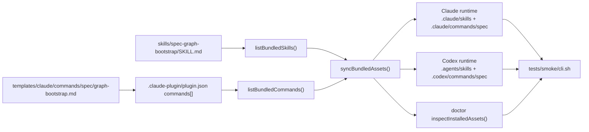

# feat: spec-graph-bootstrap 阶段1安装集成

## Overview

为 `spec-first` 新增 `spec-graph-bootstrap` 的阶段 1 安装集成能力，使其能在不替换现有 `spec-bootstrap` 的前提下，作为一个并行的 Stage-0 workflow 被打包、初始化、同步到 Claude/Codex runtime，并通过 smoke 级验证与文档说明完成首轮上线准备。

本阶段只解决“可安装、可发现、可调用、可验收”的问题，不实现事实抽取、文档生成或消费链路。

## Execution Status

- 2026-04-09 实施结果：Unit 1、Unit 2、Unit 3 已完成
- 自动化验证已完成：`bash tests/smoke/install-local.sh`、`bash tests/smoke/cli.sh`、`npm test` 全部通过
- Unit 4 仍待在真实 Claude / Codex 宿主重启后的会话中执行人工验收；当前仓库内已完成可自动证明的部分

## Problem Frame

当前仓库只有 `spec-bootstrap` 这一条稳定的 Stage-0 入口。阶段 1 需求要求在不破坏既有工作流的前提下，引入新的 `spec-graph-bootstrap`，并确保：

- 新旧入口并行存在，旧入口仍保持默认稳定入口
- Claude 与 Codex 都能完成 runtime 安装
- Codex 兼容命令层继续存在，但它只是兼容层，不是平台正式契约
- 文档与验收标准能明确区分“文件已生成”和“宿主已发现”

代码库现状对这项工作是友好的：命令与技能安装是 manifest 驱动的，`init` 通过 `syncBundledAssets()` 泛化同步 commands/skills/agents，Codex command 产物本身也是由同一份模板经 adapter 转换生成，而不是独立源模板。真正的风险不在实现复杂度，而在不要破坏既有 `init / doctor / clean / smoke` 的泛化资产模型，不要把阶段 2 的实现内容提前混入阶段 1。

## Requirements Trace

- R1. 新增 `spec-graph-bootstrap` skill 源资产，并让其进入仓库打包与 runtime 安装链路
- R2. 新增 `graph-bootstrap` command 定义与 Claude command 源模板
- R3. 保持旧 `spec-bootstrap` 入口与 runtime 资产并行存在，不发生覆盖或替换
- R4. Claude runtime 必须生成 `.claude/skills/spec-graph-bootstrap/` 与 `.claude/commands/spec/graph-bootstrap.md`
- R5. Codex runtime 必须生成 `.agents/skills/spec-graph-bootstrap/`，并按兼容层约定生成 `.codex/commands/spec/graph-bootstrap.md`
- R6. Codex 兼容命令入口必须复用同一 command 源模板经 adapter 生成，不新增独立 Codex command 源模板
- R7. README / 用户手册 / 版本说明必须明确双入口并行期边界，不得把新入口误写为默认正式入口
- R8. smoke / install 级测试必须覆盖新入口的打包、初始化、doctor 可见性与旧入口保留
- R9. 阶段 1 只要求“可安装、可发现、可调用”，不要求实现 `spec-graph-bootstrap` 的事实层和产物层能力

## Scope Boundaries

- 不包含 `skills/spec-graph-bootstrap/` 的事实抽取、路由生成、refresh 或消费逻辑
- 不包含阶段 2、3、4 的任何产物 contract 落地
- 不包含入口切换，不会让 `/spec:graph-bootstrap` 覆盖 `/spec:bootstrap`
- 不包含把 Codex 正式入口从 `$spec-*`/skill discovery 改造为原生命令模型
- 允许在 `spec-graph-bootstrap` 的初版 `SKILL.md` 中使用明确的阶段 1 stub 行为，只要不伪装成已完成的 Stage-0 实现

## Context & Research

### Relevant Code and Patterns

- [`.claude-plugin/plugin.json`](/Users/kuang/xiaobu/spec-first/.claude-plugin/plugin.json): commands 清单是唯一命令源，`listBundledCommands()` 与 `syncCommands()` 全部依赖它
- [`src/cli/plugin.js`](/Users/kuang/xiaobu/spec-first/src/cli/plugin.js): commands/skills/agents 的 bundled 枚举、同步、inspect 都是泛化实现；新增资产只要接入 manifest 和源目录，就会自然进入 `init` / `doctor`
- [`src/cli/commands/init.js`](/Users/kuang/xiaobu/spec-first/src/cli/commands/init.js): `runInit()` 先生成 preview state、清理旧 managed assets，再统一同步 commands/skills/agents，说明阶段 1 不应新增一套特判安装链
- [`src/cli/adapters/codex.js`](/Users/kuang/xiaobu/spec-first/src/cli/adapters/codex.js): Codex command runtime 使用 `.codex/commands/spec/`，并通过 `transformSkillContent()`/路径改写将同一 command 模板转换为 Codex 兼容层
- [`src/cli/commands/doctor.js`](/Users/kuang/xiaobu/spec-first/src/cli/commands/doctor.js): `doctor` 对 commands/skills/agents 的检查是基于 bundled manifest 和 runtime inspect 的泛化逻辑
- [`templates/claude/commands/spec/bootstrap.md`](/Users/kuang/xiaobu/spec-first/templates/claude/commands/spec/bootstrap.md): 现有 bootstrap command 模板是新 `graph-bootstrap` 模板的最直接参考
- [`tests/smoke/cli.sh`](/Users/kuang/xiaobu/spec-first/tests/smoke/cli.sh): 已覆盖 Claude/Codex init、doctor、clean、pack 的完整链路，是阶段 1 最重要的自动化回归入口
- [`install-local.sh`](/Users/kuang/xiaobu/spec-first/install-local.sh) 与 [`tests/smoke/install-local.sh`](/Users/kuang/xiaobu/spec-first/tests/smoke/install-local.sh): 现有本地源码安装说明与其 smoke 校验可作为阶段 1 install 级验证的最小承载点

### Institutional Learnings

- [`docs/07-经验总结/2026-03-30-codex-打包发布经验总结.md`](/Users/kuang/xiaobu/spec-first/docs/07-经验总结/2026-03-30-codex-打包发布经验总结.md): Codex 的关键教训是“不能把文件存在误判为宿主 discovery 成立”，且必须区分 `.agents/skills/` 的正式契约与 `.codex/commands/spec/` 的兼容层
- [`docs/07-经验总结/2026-03-30-新增-skill-agent-标准操作清单.md`](/Users/kuang/xiaobu/spec-first/docs/07-经验总结/2026-03-30-新增-skill-agent-标准操作清单.md): 新增核心 workflow 的标准路径是“新增 skill + 更新 manifest + 新增 Claude command 模板 + 通过 init/doctor/smoke 验证”，且运行时目录一律视为生成物

### External References

- 无。当前代码库已经有清晰的本地模式，阶段 1 不需要额外外部 research。

## Key Technical Decisions

- 决策 1：阶段 1 采用“资产接入优先”的最小实现，不改 `init`/`doctor` 的泛化框架。
  - 理由：`plugin.js` 与 `init.js` 已经是 manifest 驱动；如果为了新 workflow 单独加分支，会立刻破坏后续可维护性。

- 决策 2：`graph-bootstrap` command 继续以 Claude command 源模板为唯一模板源，Codex 兼容命令层由 adapter 生成。
  - 理由：这与现有 `syncCommands()` 的实现一致；当前 `codex` adapter 的 `hasCommands()` 固定为 `true`，因此 `spec-first init --codex` 会自动安装 `.codex/commands/spec/` 兼容层，无需额外 flag，可避免双模板漂移。

- 决策 3：`skills/spec-graph-bootstrap/` 的第一版只提供可安装、可识别、可最小调用的 stub contract，不提前承诺阶段 2 行为。
  - 理由：阶段 1 的验收目标是安装集成，不是 Stage-0 产物质量。用明确 stub 比“半实现、半空壳”的文档更诚实，也更利于后续阶段演进。
  - 说明：这是基于阶段 1 需求文档“不包含事实层抽取逻辑、正式产物生成逻辑”的实现假设；如果实现期发现需要更强 contract，应先回填需求文档，再调整实现。

- 决策 4：自动化测试只验证“资产同步 + 文案边界 + 不破坏旧入口”，Codex discovery 的真实证据保留为人工/宿主验证 gate。
  - 理由：阶段 1 文档本身已经把 Codex discovery 定义成宿主重启后的可观测证据，这不应被伪装成纯本地 smoke 可完全证明的事情；实施记录只要求写明实际采用的宿主验证步骤，不预设固定 Codex 命令名。

- 决策 5：README 与版本更新文档必须同步引入“双入口并行期”表述，但不得提前宣称迁移完成。
  - 理由：仓库 README 当前仍把 Stage-0 入口聚焦在 `spec-bootstrap`，阶段 1 如果不显式调整文案，用户会误解新入口地位；如果写得过头，又会与当前并行策略冲突。

## Open Questions

### Resolved During Planning

- 是否需要改 `src/cli/plugin.js` 或 `src/cli/commands/init.js` 才能支持新 workflow？
  - 不需要前置改造。现有代码已经是 manifest/目录驱动，阶段 1 的主工作是新增源资产与测试/文档更新。

- skill 与 command 是否通过同一种注册机制进入安装清单？
  - 不是。`listBundledSkills()` 直接枚举 `skills/` 目录，创建 `skills/spec-graph-bootstrap/` 即可进入 skill 安装清单；`listBundledCommands()` 只读取 `.claude-plugin/plugin.json` 的 `commands[]`，必须显式新增 `graph-bootstrap` 条目。

- Codex 兼容命令层是否需要新增独立源模板？
  - 不需要。沿用单一 Claude command 源模板，经 Codex adapter 生成 runtime 兼容层。

- 阶段 1 的 `spec-graph-bootstrap` 是否必须具备真实 bootstrap 能力？
  - 不必须。应提供清晰的阶段 1 stub 行为与后续阶段指向，避免假装已具备阶段 2 能力。

### Deferred to Implementation

- `spec-graph-bootstrap/SKILL.md` 的 stub 文案采用“明确未实现提示”还是“阶段路线说明 + 暂不执行”哪种更合适，实施时可根据当前命令体验微调
- Codex discovery 的“最小探测调用”具体采用哪条交互路径，属于人工验收方案细化，不影响本计划的代码结构

## High-Level Technical Design

> *This illustrates the intended approach and is directional guidance for review, not implementation specification. The implementing agent should treat it as context, not code to reproduce.*

## Implementation Units

- [x] **Unit 1: 接入 `spec-graph-bootstrap` 源资产与 manifest**

**Goal:** 在源码层新增 `spec-graph-bootstrap` skill 与 `graph-bootstrap` command，使其进入统一 bundled assets 模型。

**Requirements:** R1, R2, R5, R6, R9

**Dependencies:** 无

**Files:**
- Create: `skills/spec-graph-bootstrap/SKILL.md`
- Create: `templates/claude/commands/spec/graph-bootstrap.md`
- Modify: `.claude-plugin/plugin.json`
- Test: `tests/smoke/cli.sh`

**Approach:**
- 新建 `skills/spec-graph-bootstrap/`，提供阶段 1 stub `SKILL.md`：
  - frontmatter `name:` 必须与目录名一致
  - 明确其为并行验证入口
  - 不伪装成已完成的事实抽取/文档生成实现
- skill 注册遵循目录自动发现：
  - 只需创建 `skills/spec-graph-bootstrap/`
  - 由 `listBundledSkills()` 自动枚举，不向 manifest 额外注册 skill
- 新建 `graph-bootstrap` command 定义与模板：
  - command 模板结构跟随 `bootstrap.md`
  - source of truth 指向 `.claude/skills/spec-graph-bootstrap/SKILL.md`
  - 文案上明确这是新 Stage-0 workflow 的验证入口
- 更新 `.claude-plugin/plugin.json`：
  - 新增 `graph-bootstrap` command 条目
  - command 注册必须走 manifest；否则 `listBundledCommands()` 无法读到新入口
  - 不修改 `bootstrap` 现有条目
- 保持实现依赖现有 manifest + adapter 模型，不新增“graph-bootstrap 专用安装逻辑”。

**Patterns to follow:**
- [`templates/claude/commands/spec/bootstrap.md`](/Users/kuang/xiaobu/spec-first/templates/claude/commands/spec/bootstrap.md)
- [`skills/spec-bootstrap/SKILL.md`](/Users/kuang/xiaobu/spec-first/skills/spec-bootstrap/SKILL.md)
- [`docs/07-经验总结/2026-03-30-新增-skill-agent-标准操作清单.md`](/Users/kuang/xiaobu/spec-first/docs/07-经验总结/2026-03-30-新增-skill-agent-标准操作清单.md)

**Test scenarios:**
- Happy path: manifest 新增 `graph-bootstrap` 后，`listBundledCommands()` 能枚举到新 command
- Happy path: `listBundledSkills()` 能枚举到 `spec-graph-bootstrap`
- Edge case: 保留旧 `bootstrap` 条目时，新旧命令同时存在，不发生覆盖
- Error path: `SKILL.md` frontmatter `name:` 与目录名不一致时，应在评审中视为不合格，不允许合入
- Integration: Codex runtime command 内容应经 adapter 改写后指向 `.agents/skills/spec-graph-bootstrap/SKILL.md`

**Verification:**
- `init` 使用现有同步链路即可把新 skill 和新 command 同步到对应 runtime
- 新旧 command/skill 能同时出现在 bundled assets 与 runtime 资产集合中

- [x] **Unit 2: 扩展 runtime 安装、doctor 可见性与 smoke 回归**

**Goal:** 证明新资产进入现有 `init / doctor / pack / clean` 主链，同时不破坏旧入口与 managed asset 清理逻辑。

**Requirements:** R3, R4, R5, R6, R8

**Dependencies:** Unit 1

**Files:**
- Modify: `tests/smoke/cli.sh`
- Modify: `tests/smoke/install-local.sh`
- Modify: `install-local.sh`

**Approach:**
- 扩展 Claude smoke：
  - 新增 `graph-bootstrap.md` 文件存在断言
  - 新增 `.claude/skills/spec-graph-bootstrap/SKILL.md` 存在与模板引用断言
  - 保留旧 `bootstrap` 断言
- 扩展 Codex smoke：
  - 新增 `.codex/commands/spec/graph-bootstrap.md` 断言
  - 新增 `.agents/skills/spec-graph-bootstrap/SKILL.md` 断言
  - 校验 Codex command 内容引用 `.agents/skills/spec-graph-bootstrap/SKILL.md`
  - 保留旧 `spec-bootstrap` skill 与 `bootstrap.md` 断言
- 扩展 `npm pack --dry-run` 断言：
  - 确认新的 command 模板与 skill 目录被打包
- 扩展 install 级验证：
  - 更新 `install-local.sh` 的说明输出，使其体现 `graph-bootstrap` 的并行验证入口
  - 更新 `tests/smoke/install-local.sh`，验证本地安装说明脚本已同步双入口并行期表述
- 不把 Codex discovery 的真实宿主识别伪装成自动化单测；自动化只证明资产已同步且 doctor 可见。
- Codex discovery 的通过证据在实施阶段按宿主实际能力记录为以下其一：
  - skill 可用列表
  - 等价 discovery 结果
  - 最小探测调用
- 计划文档不预设固定 Codex 命令名，以避免把宿主差异误写成稳定契约。
- Unit 2 不直接写入 `CHANGELOG.md`；本阶段的最终文案收口统一由 Unit 3 负责，避免中间态与最终态重复记录。

**Patterns to follow:**
- [`tests/smoke/cli.sh`](/Users/kuang/xiaobu/spec-first/tests/smoke/cli.sh)
- [`src/cli/commands/doctor.js`](/Users/kuang/xiaobu/spec-first/src/cli/commands/doctor.js)
- [`docs/07-经验总结/2026-03-30-codex-打包发布经验总结.md`](/Users/kuang/xiaobu/spec-first/docs/07-经验总结/2026-03-30-codex-打包发布经验总结.md)
- 实施注意：[`tests/smoke/cli.sh`](/Users/kuang/xiaobu/spec-first/tests/smoke/cli.sh) 当前对 agent 数量使用了 `Generated 47 agent file(s)` 硬编码断言；阶段 1 不新增 agents，因此本次不会直接触发失败，但扩展 smoke 时不要误以为该计数已像 commands/skills 一样动态化

**Test scenarios:**
- Happy path: `spec-first init --claude` 后，`.claude/commands/spec/graph-bootstrap.md` 与 `.claude/skills/spec-graph-bootstrap/SKILL.md` 同时存在
- Happy path: `spec-first init --codex` 后，`.codex/commands/spec/graph-bootstrap.md` 与 `.agents/skills/spec-graph-bootstrap/SKILL.md` 同时存在
- Happy path: `spec-first doctor --claude` 与 `spec-first doctor --codex` 仍能 PASS 现有 commands/skills/agents 检查
- Happy path: `spec-first doctor --claude` 与 `spec-first doctor --codex` 的输出中，能看到 `spec-graph-bootstrap` skill 与 `graph-bootstrap` command 的检查条目
- Edge case: 重新执行 `init` 时，新入口不重复生成，也不影响旧入口
- Edge case: 执行 `clean` 后，`graph-bootstrap` 相关 managed assets 被清除；重新 `init` 后可恢复
- Integration: Codex runtime 的 `graph-bootstrap.md` 由同一模板经 adapter 改写生成，而非独立源模板
- Integration: `npm pack --dry-run` 输出包含 `templates/claude/commands/spec/graph-bootstrap.md` 与 `skills/spec-graph-bootstrap/SKILL.md`
- Integration: `install-local.sh` 与 `tests/smoke/install-local.sh` 能体现双入口并行期说明，满足阶段 1 的 install 级验证要求

**Verification:**
- 现有 smoke 主链能覆盖 graph-bootstrap 的新增资产
- 新入口接入后，既不会破坏旧入口断言，也不会破坏 clean/doctor 的 managed assets 流程

- [x] **Unit 3: 收口用户文档与双入口并行期说明**

**Goal:** 让 README、版本更新文档和阶段 1 文档形成一致的对外叙述，避免用户误解新入口地位。

**Requirements:** R7

**Dependencies:** Unit 1, Unit 2

**Files:**
- Modify: `README.md`
- Modify: `docs/05-用户手册/README.md`
- Modify: `docs/05-用户手册/01-快速开始.md`
- Modify: `docs/05-用户手册/04-常见问题.md`
- Modify: `docs/05-用户手册/06-本地源码安装.md`
- Modify: `docs/08-版本更新/README.md`
- Modify: `docs/01-需求分析/spec-graph-bootstrap需求/阶段1-skill安装集成需求.md` only if implementation发现需要轻微回填（预计无需）
- Update: `CHANGELOG.md`

**Approach:**
- Unit 2 与 Unit 3 的职责分工按以下边界执行，避免 README / 版本说明 / CHANGELOG 产生重复修改冲突：
  - Unit 2 只负责安装、init、doctor、smoke、install-local 相关技术验证说明与测试承载
  - Unit 3 负责 README、用户手册、版本更新文档中的双入口并行期对外叙述收口
  - `CHANGELOG.md` 的最终文案收口以 Unit 3 为准；Unit 2 若产生中间实现记录，应在提交前合并去重
- 在 README 的 Stage-0 入口说明中加入双入口并行期说明：
  - `/spec:bootstrap` 仍是默认稳定入口
  - `/spec:graph-bootstrap` 是并行验证入口
  - Codex 正式能力仍以 skill discovery 为准，`.codex/commands/spec/graph-bootstrap.md` 是兼容层
- 在用户手册范围内同步最小文案 contract，至少覆盖：
  - `docs/05-用户手册/README.md`
  - `docs/05-用户手册/01-快速开始.md`
  - `docs/05-用户手册/04-常见问题.md`
  - `docs/05-用户手册/06-本地源码安装.md`
- 在 `docs/08-版本更新/README.md` 增加本次阶段 1 的更新条目，说明“新增并行验证入口，而非切换默认入口”
- 确保文案不与阶段 1 需求文档中的最小文案 contract 冲突。

**Patterns to follow:**
- [阶段1-skill安装集成需求.md](/Users/kuang/xiaobu/spec-first/docs/01-需求分析/spec-graph-bootstrap需求/阶段1-skill安装集成需求.md)
- [`README.md`](/Users/kuang/xiaobu/spec-first/README.md)
- [`docs/05-用户手册/README.md`](/Users/kuang/xiaobu/spec-first/docs/05-用户手册/README.md)
- [`docs/05-用户手册/01-快速开始.md`](/Users/kuang/xiaobu/spec-first/docs/05-用户手册/01-快速开始.md)
- [`docs/05-用户手册/04-常见问题.md`](/Users/kuang/xiaobu/spec-first/docs/05-用户手册/04-常见问题.md)
- [`docs/05-用户手册/06-本地源码安装.md`](/Users/kuang/xiaobu/spec-first/docs/05-用户手册/06-本地源码安装.md)
- [`docs/08-版本更新/README.md`](/Users/kuang/xiaobu/spec-first/docs/08-版本更新/README.md)

**Test scenarios:**
- Happy path: README 明确写出旧入口稳定、新入口验证的双入口并行语义
- Happy path: 用户手册关键入口页同步写出旧入口稳定、新入口验证的双入口并行语义
- Edge case: 不再出现“已迁移到 `/spec:graph-bootstrap`”或“新入口已成默认入口”的表述
- Integration: README、用户手册与版本更新文档对 Codex 的表述不与阶段 1 需求文档冲突

**Verification:**
- 读者在不看需求文档的前提下，也能从 README 明确理解当前处于双入口并行期
- 读者在 README、快速开始、FAQ、本地源码安装说明中都不会被误导为“已完成切换到新入口”

- [ ] **Unit 4: 执行阶段 1 的人工验收与交付收口**

**Goal:** 依据阶段 1 文档的正式验收标准，完成自动化之外的宿主级验证与交付结论记录。

**Requirements:** R3, R5, R8

**Dependencies:** Unit 1, Unit 2, Unit 3

**Files:**
- Modify: `docs/01-需求分析/spec-graph-bootstrap需求/阶段1-skill安装集成需求.md` only if implementation uncovers contract drift（默认不改）
- Update: `CHANGELOG.md` only if implementation阶段有额外用户可见调整

**Approach:**
- 执行文档中定义的人工/宿主验证：
  - Claude 宿主重启后最小调用验证
  - Codex 宿主重启后的 discovery 结果或最小探测调用验证
- 将自动化可证部分与人工可证部分分开记录：
  - 自动化：init/doctor/clean/pack/smoke
  - 人工：宿主重启后的入口识别/skill 发现
- Codex 人工验收记录必须写明实际采用的验证步骤，不要求绑定某一个固定命令或 UI 入口。
- 若 Codex 真实 discovery 与兼容命令层表现不一致，以正式契约优先，兼容层仅做附加说明。

**Patterns to follow:**
- [阶段1-skill安装集成需求.md](/Users/kuang/xiaobu/spec-first/docs/01-需求分析/spec-graph-bootstrap需求/阶段1-skill安装集成需求.md)
- [`docs/07-经验总结/2026-03-30-codex-打包发布经验总结.md`](/Users/kuang/xiaobu/spec-first/docs/07-经验总结/2026-03-30-codex-打包发布经验总结.md)

**Test scenarios:**
- Happy path: Claude 重启后可从新入口完成最小调用
- Happy path: Codex 重启后，能在 skill 可用列表或等价 discovery 结果中看到 `spec-graph-bootstrap`
- Edge case: Codex 兼容命令入口可见，但宿主 discovery 无证据时，不得判定阶段 1 通过
- Error path: 新入口存在但旧入口缺失，判定阶段 1 失败

**Verification:**
- 阶段 1 文档的 8.1/8.2/8.3 能被逐项对照并得出明确结论
- 开发团队可以基于该结论进入阶段 2，而无需回头再解释阶段 1 是否完成

## System-Wide Impact

- **Interaction graph:** 影响 `.claude-plugin/plugin.json` → `src/cli/plugin.js` → `src/cli/commands/init.js` → `src/cli/commands/doctor.js` → `tests/smoke/cli.sh` 这一整条打包与 runtime 校验链
- **Error propagation:** 如果 manifest、模板或 skill 资产有任一缺口，`init` 仍可能成功执行部分同步，但 smoke/doctor/pack 会出现不一致；因此必须通过统一 smoke 覆盖整条链路
- **State lifecycle risks:** `init` 采用 preview state + removeObsoleteManagedAssets + sync 的流程，新增资产不能让 clean/prune 误删旧入口
- **API surface parity:** 对外用户入口、README、版本更新文档、pack 产物都需要同步出现 `graph-bootstrap`，否则平台体验会碎裂
- **Integration coverage:** 仅看目录存在不够，必须同时覆盖 command 模板引用、skill frontmatter、pack 输出和 runtime clean/re-init 行为
- **Unchanged invariants:** 现有 `spec-bootstrap` 默认入口、现有 `init / doctor / clean` 泛化模型、现有 Codex adapter 路径契约在本阶段都不应被改变

## Risks & Dependencies

| Risk | Mitigation |
|------|------------|
| 新增 command/skill 后破坏 `init` 或 `clean` 的 managed assets 行为 | 通过现有 smoke 中的 re-init、clean、legacy prune 断言覆盖新入口 |
| `spec-graph-bootstrap` 的 stub 行为过于模糊，用户误以为阶段 2 已完成 | 在 `SKILL.md` 和 README 中显式标注阶段 1 仅做并行验证入口 |
| Codex 兼容命令层与正式 discovery 语义混淆 | 文档与验收中始终把 `.agents/skills/` discovery 作为正式契约，把 `.codex/commands/spec/` 作为兼容层附加验证 |
| README/版本更新文档提前宣布切换完成 | 将其纳入文档验收与失败判定，并在实现时逐条对照阶段 1 文档 |

## Documentation / Operational Notes

- 该计划完成后，应优先用 `tests/smoke/cli.sh` 验证自动化链路，再做 Claude/Codex 的人工重启验证
- 阶段 1 是一个“安装集成 gate”，不是 Stage-0 能力 gate；进入阶段 2 前不应继续讨论 facts/documents/refresh 的质量问题
- 若实现过程中发现 `doctor` 现有能力不足以支撑阶段 1 文档中的人工 gate，也应通过“文档保留人工验收”优先收口，而不是临时拔高 doctor 范围

## Sources & References

- **Origin document:** [阶段1-skill安装集成需求.md](/Users/kuang/xiaobu/spec-first/docs/01-需求分析/spec-graph-bootstrap需求/阶段1-skill安装集成需求.md)
- Related code: [plugin.js](/Users/kuang/xiaobu/spec-first/src/cli/plugin.js)
- Related code: [init.js](/Users/kuang/xiaobu/spec-first/src/cli/commands/init.js)
- Related code: [codex.js](/Users/kuang/xiaobu/spec-first/src/cli/adapters/codex.js)
- Related code: [doctor.js](/Users/kuang/xiaobu/spec-first/src/cli/commands/doctor.js)
- Related code: [bootstrap.md](/Users/kuang/xiaobu/spec-first/templates/claude/commands/spec/bootstrap.md)
- Related tests: [cli.sh](/Users/kuang/xiaobu/spec-first/tests/smoke/cli.sh)
- Institutional learning: [2026-03-30-codex-打包发布经验总结.md](/Users/kuang/xiaobu/spec-first/docs/07-经验总结/2026-03-30-codex-打包发布经验总结.md)
- Institutional learning: [2026-03-30-新增-skill-agent-标准操作清单.md](/Users/kuang/xiaobu/spec-first/docs/07-经验总结/2026-03-30-新增-skill-agent-标准操作清单.md)
