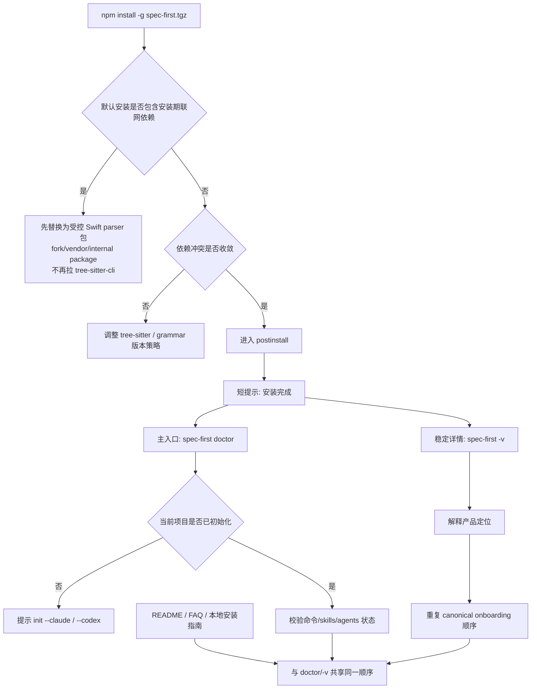

# feat: Improve npm install experience and onboarding

## Overview

优化 `npm install -g spec-first-1.5.1.tgz` 的首屏安装体验，目标不是“润色欢迎文案”，而是系统性解决三类问题：一是默认安装路径存在硬失败风险；二是 `tree-sitter` 依赖树失配导致的大量 peer warning 噪音；三是 `postinstall`、`spec-first -v`、`spec-first doctor` 三个入口分工混乱，导致用户在安装成功后看不到一条清晰、稳定、可执行的下一步路径。

本计划把安装体验拆成三个层次治理：先消除默认安装路径中的硬失败依赖，再收敛依赖图以减少 warning，然后压缩 `postinstall` 为最短提示，最后把稳定 onboarding 入口收敛到 `spec-first -v` 与 `spec-first doctor`，并同步 README / FAQ / 本地安装文档与 smoke 回归，避免未来再发生文案漂移。这里有一条新增且不可退让的前提：**Swift 必须继续作为默认安装能力存在**，不能通过把 Swift parser 从默认安装面移出来换取“安装成功”。

## Problem Frame

当前用户执行 `npm install -g spec-first-1.5.1.tgz` 时，会遇到两层问题：

- 第一层是噪音：安装日志前段会被多组 `npm warn ERESOLVE overriding peer dependency` 覆盖，核心原因是 `package.json` 中直依赖 `tree-sitter@~0.21.0`，但多个 grammar 包实际声明 `peerOptional tree-sitter@^0.22.1`。
- 第二层是硬失败：当前依赖树里的 `tree-sitter-swift` 会拉入 `tree-sitter-cli`，后者安装期执行 `node install.js` 并下载 GitHub release 二进制。在弱网、企业网络或 GitHub 不可达环境下，`npm install -g` 会直接以 `npm error code 1` 失败，用户甚至看不到后续 onboarding。由于 Swift 仍是默认必装语言，这里的正确解法不是“把 Swift 移出默认安装面”，而是**改造 Swift parser 的分发路线**，让默认安装继续携带 Swift，同时不再依赖安装期 GitHub 下载。

与此同时，安装成功后的三类提示缺少产品分层：

- `bin/postinstall.js` 在安装阶段包含 warning 兜底文案（"属于预期行为"）+ 4 条 workflow 入口列表，与 Unit 1 完成后的目标状态（无需 warning 兜底 + 只指向 doctor/-v）不一致。
- `src/cli/index.js` 的 `printVersion()` 完全没有提到 `doctor`，直接跳到 `init` → `/spec:ideate`/`/spec:brainstorm`，与 `doctor` 的 canonical onboarding 路径（doctor → init → 重启 → workflow）方向冲突。
- `src/cli/commands/doctor.js` 已具备很好的“安装后第一动作”能力，但当前没有被提升为最稳定、最权威的后续入口。

结果是：用户经历了大量 warning，却没有得到单一且稳定的成功路径；文档也把噪音当作“预期行为”长期接受，降低了整体产品质量门槛。

## Requirements Trace

- R0. 默认 `npm install -g spec-first.tgz` 路径不得依赖安装期 GitHub 二进制下载；在弱网或 GitHub 不可达环境下也应能完成安装，且 Swift 仍作为默认能力随安装可用
- R1. 全局安装日志中 `tree-sitter` 相关 peer conflict 的**冲突包集合**收敛为仅 `{tree-sitter-objc}`（或为空）；`tree-sitter-c`、`tree-sitter-python`、`tree-sitter-rust`、`tree-sitter-swift` 的冲突必须消除
- R2. `postinstall` 只承担“安装完成 + 最短下一步”职责，不再暴露完整 workflow 菜单
- R3. `spec-first -v` 成为稳定欢迎页，输出与 `doctor/init` 路径一致的 canonical onboarding
- R4. `spec-first doctor` 成为安装成功后的首选验证入口，并在未初始化项目时给出简洁、正确的下一步
- R5. README、FAQ、本地源码安装文档与 CLI 输出的 onboarding 顺序保持一致，不再出现“警告可忽略”式长期兜底表述
- R6. 为 tarball 安装链路增加可重复的回归验证，覆盖 warning 噪音、`postinstall` 输出、`-v` 欢迎页和 `doctor` 引导

## Scope Boundaries

- 不在本计划中新增新的 CLI 子命令
- 不改变 `spec-first init --claude|--codex` 的核心行为，只调整其在安装链路中的提示位置
- 不把“让 npm 生命周期输出始终可见”作为目标；这不受本仓库完全控制
- 不在本计划中处理所有可能的 npm warning 类型，只聚焦当前真实安装日志中的 `tree-sitter` peer dependency 噪音
- 不把 CRG 功能本身的正确性作为本计划目标；本计划只处理安装体验与入口引导
- 不将 `postinstall` 改为静默模式（如重定向 stderr 或设置 `--silent`）；保持输出可见，只压缩内容
- 不要求在本计划内保留对上游 `tree-sitter-swift` 包的直接依赖；允许通过 fork / vendor / 内部包等受控方式重构 Swift parser 的供给路线，但必须保持 Swift 默认可用
- 不把“通过并发安装掩盖单个下载阻塞”作为产品方案；并发只可用于研发实施组织，不作为用户安装期体验优化手段

### Smoke 测试职责分工

| 脚本 | 职责边界 | 运行方式 |
|------|---------|---------|
| `tests/smoke/install-local.sh` | 仓库辅助脚本 `install-local.sh` 的文案检查 | `bash ./install-local.sh` 输出断言 |
| `tests/smoke/cli.sh` | 源码级 CLI 行为（`node bin/spec-first.js` 的 help/version/init/doctor/clean） | 从源码直接运行，不依赖全局安装 |
| `tests/smoke/install-tarball.sh` | **packaged install 全链路**：npm pack → npm install -g → postinstall 输出 → 全局 shim → 安装日志 warning 计数 | 临时 prefix 隔离，绝对路径调用；**通过 `npm run test:release` 运行，不纳入默认 `npm test`** |

三者不重叠：postinstall 输出的 packaged install 回归只在 `install-tarball.sh` 中验证；`cli.sh` 和 `install-local.sh` 不承担 packaged install 职责。

## Context & Research

### Relevant Code and Patterns

- `package.json`：当前声明 `tree-sitter@~0.21.0`，而多个 grammar 包版本已要求 `^0.22.1`
- **tree-sitter peer 兼容矩阵**（截至 2026-04-12）：
  - 兼容组 A（peer `^0.21.x`，与当前 tree-sitter 兼容）：c-sharp@0.23.1、cpp@0.23.4、go@0.23.4、java@0.23.5、javascript@0.23.1、kotlin@0.3.8、php@0.23.0、ruby@0.23.1、scala@0.24.0、typescript@0.23.2 — 共 10 包
  - 兼容组 B（peer `^0.22.1`，与当前 tree-sitter 不兼容，触发 warning）：c@0.23.6、objc@3.0.2、python@0.23.6、rust@0.23.3、swift@0.7.1 — 共 5 包
  - **关键事实**：不存在单一 tree-sitter 版本能同时满足所有 15 个 grammar 包。升级到 0.22.x 会转移 warning 到兼容组 A 的 10 包，降级兼容组 B 的 grammar 包可消除 warning 但有解析能力退化风险
- `package-lock.json`：锁文件中已经能看到 `tree-sitter` peer 范围混杂，说明 warning 不是偶发，而是可复现的依赖图问题
- `package-lock.json`：`tree-sitter-swift@0.7.1` 直接依赖 `tree-sitter-cli@^0.23`，而 `tree-sitter-cli` 安装脚本会下载 GitHub release 二进制；这是当前安装硬失败的直接来源
- `npm view tree-sitter-swift@0.6.0`：即使把 Swift 版本降到 `0.6.0`，其依赖里仍包含 `tree-sitter-cli@^0.23`，说明“仅降级 Swift 版本”不能消除安装期 GitHub 下载链
- `node_modules/tree-sitter-cli/install.js`：下载地址固定指向 GitHub release，且未提供镜像、重试、离线缓存等产品级兜底能力，因此不应继续作为默认安装链路的一部分
- `bin/postinstall.js`：在安装阶段包含 warning 兜底文案（”属于预期行为”）+ 4 条 workflow 入口列表，与 Unit 1 完成后的目标状态（无需 warning 兜底 + 只指向 doctor/-v）不一致
- `src/cli/index.js`：`printVersion()` 完全没有提到 `doctor`，直接跳到 `init` → `/spec:ideate`/`/spec:brainstorm`，与 canonical onboarding 路径（doctor → init → 重启 → workflow）方向冲突
- `src/cli/commands/doctor.js`：在未初始化项目时已能输出简洁的 `init --claude` / `init --codex` 指引，适合成为 canonical next step
- `src/crg/lang-config.js`：Swift 当前被硬编码到上游包名 `tree-sitter-swift`，因此若采用受控 Swift parser 包，必须同步调整包名映射或加一层最小适配
- `src/crg/parser.js`：当某个 parser 包 `require()` 失败时，`parseFile()` 会返回 `reason: 'no_parser'` 的 graceful degradation；这仍可作为安全兜底，但在新约束下**不能**作为 Swift 的默认安装路径
- `tests/smoke/cli.sh`：已有 `--version` 与 `doctor` 输出断言，是扩展安装引导回归的最佳切入点
- `tests/smoke/install-local.sh`：已有本地安装文案 smoke 测试，可扩展为安装模型一致性校验

### Institutional Learnings

- `docs/05-用户手册/04-常见问题.md` 已经明确指出 npm lifecycle 输出不保证稳定可见，因此 `postinstall` 不应承担唯一欢迎入口
- `docs/05-用户手册/06-本地源码安装.md` 目前仍把 peer warning 描述为“预期行为，可忽略”，说明文档口径已经漂移到接受噪音，而不是消除噪音
- `docs/brainstorms/2026-03-30-code-audit-report.md` 曾指出安装引导文案存在错误和漂移历史，说明需要一个统一的 canonical onboarding 来源，而不是多处各写一套

### External References

- npm package.json documentation: `peerDependencies` / `peerDependenciesMeta` / `overrides`
  `https://docs.npmjs.com/cli/v11/configuring-npm/package-json`
- npm scripts documentation: lifecycle scripts including `postinstall`
  `https://docs.npmjs.com/cli/v11/using-npm/scripts`
- npm config documentation: `foreground-scripts` controls whether lifecycle script stdio is shared,说明安装脚本输出可见性不是稳定产品契约
  `https://docs.npmjs.com/cli/v11/using-npm/config#foreground-scripts`
- tree-sitter 包元数据：`tree-sitter-swift@0.7.1` 与 `tree-sitter-swift@0.6.0` 均依赖 `tree-sitter-cli@^0.23`
  `npm view tree-sitter-swift@0.7.1 dependencies scripts peerDependencies --json`
  `npm view tree-sitter-swift@0.6.0 dependencies scripts peerDependencies --json`

## Key Technical Decisions

- **KD0: 先保证能装上，再治理 warning 与文案。** 默认安装路径中的硬失败优先级高于 warning 噪音；如果用户在安装阶段就因为下载二进制超时而失败，后续 onboarding 完全没有意义。
- **KD1: 先治理依赖图，再治理文案。** 当前最刺眼的问题是 `tree-sitter` peer mismatch 触发的安装噪音；如果不先解决，任何欢迎文案优化都会被 warning 冲掉。
- **KD2: `postinstall` 只保留最短 next step。** 安装阶段输出不可作为稳定承诺，因此这里只做“安装成功 + 运行 `spec-first doctor` + 如需详情执行 `spec-first -v`”。
- **KD3: `spec-first -v` 作为稳定欢迎页，`doctor` 作为稳定第一动作。** `-v` 负责解释“这个 CLI 是什么 + 你现在该干什么”；`doctor` 负责在当前项目里给出精确状态与下一步。
- **KD4: 统一 onboarding 的 canonical 顺序。** 推荐顺序收敛为：安装 CLI → `spec-first doctor` → `spec-first init --claude|--codex` → 重启宿主 → 使用 `/spec:*` 或 `$spec-*`。
- **KD5: `tree-sitter-swift` 的问题不是单纯 peer conflict，而是 install-time network dependency。** 仅把 `tree-sitter-swift` 从 `0.7.1` 降到 `0.6.0` 不能解决安装失败，因为 `0.6.0` 依然依赖 `tree-sitter-cli@^0.23`。
- **KD6: Swift 保持必装，但默认安装面只接受“无安装期网络依赖”的 Swift parser 路线。** 这意味着不能继续直接依赖当前上游 `tree-sitter-swift`；推荐维护受控的 Swift parser 包（例如 scoped fork、vendor 包或内部包），把生成产物随包分发，切断 `tree-sitter-cli` 安装链。
- **KD7: 以“受控 Swift parser 包 + 其余 grammar 版本收敛”为主策略，`overrides` 为辅助兜底。** npm 的 `overrides` 在全局安装场景下不保证生效（`overrides` 需要 npm v8.3+，而 `engines.node >= 20` 默认 bundled npm 9+，版本满足），因此核心策略必须是：Swift 改用受控包、c/python/rust 等 grammar 用兼容版本收敛 peer range。`overrides` 只作为额外保障层。
- **KD8: 并发安装不是产品方案。** npm 自身已有并发能力，而当前真实失败点是 `tree-sitter-cli` 的单点下载阻塞。多线程或多 subagent 只能用于研发实施并行，不能消除用户安装期的根因。
- **KD9: 回归验证以真实 tarball 安装为准。** 只测 `postinstall.js` 文本拼接不够，必须覆盖 `npm pack` / `npm install -g <tarball>` 场景，才能证明安装体验真的变好了。
- **KD10: 把“警告可忽略”降级为过渡性兼容说明，而不是主叙事。** 若个别 warning 无法在第一轮完全消除，文档可以保留故障说明，但不能再把它作为默认安装体验的合理化解释。

## Open Questions

### Resolved During Planning

- **Q: 这次优化的主问题是不是 `postinstall` 文案不够友好？** 不是。真正的首屏失败体验首先来自依赖 warning 噪音，文案只是第二层问题。
- **Q: `doctor` 是否适合作为安装后第一动作？** 适合。当前实现已经能在未初始化项目中给出简洁、正确的下一步。
- **Q: 是否应继续在 `postinstall` 中直接展示 `/spec:bootstrap`、`/spec:plan` 等 workflow 列表？** 不应。那是初始化和重启宿主之后的事情，安装阶段提前暴露会增加信息噪音。
- **Q: 是否可以通过包内 `overrides` 快速遮掉 warning？** 不应作为消除 warning 的主手段，但作为辅助兜底层仍有价值。npm 的 `overrides` 在全局安装场景下不保证生效，核心策略必须是 grammar 包版本降级。
- **Q: 把 `tree-sitter-swift` 从 `0.7.1` 降到 `0.6.0`，能否同时解决 warning 和安装失败？** 不能。`0.6.0` 仍然依赖 `tree-sitter-cli@^0.23`，安装期 GitHub 下载链依然存在。
- **Q: 是否可以靠并发安装、多线程或多 subagent 解决当前用户安装失败？** 不能。失败根因是 `tree-sitter-cli` 下载 GitHub release 的单点阻塞；并发只会让其他依赖更早完成，无法移除这个硬阻塞步骤。
- **Q: 如果某个 parser 包在运行时缺失，CRG 是否还能工作？** 可以降级工作。`src/crg/parser.js` 在 parser 包缺失时会返回 `reason: 'no_parser'` 而不是直接崩溃，但这条机制只应作为安全兜底，不应再被用作 Swift 默认安装策略。
- **Q: `tree-sitter` 最终统一到哪个主版本最稳妥？** 保持 `tree-sitter@~0.21.0` 不变，降级要求 `^0.22.1` 的 grammar 包中除 Swift 外的 c/python/rust 到兼容 0.21.x 的版本，保留 `tree-sitter-objc@^3.0.2` 不降级；Swift 则改为受控 parser 包（例如 `@spec-first/tree-sitter-swift`），要求其随默认安装分发、与选定的 `tree-sitter` 主版本兼容、且不再引入 `tree-sitter-cli` 安装链。原因：不存在单一 tree-sitter 版本能同时满足所有 15 个 grammar 包，且 Swift 的真正问题是 install-time network dependency，不是单纯 peer range。

### Deferred to Implementation

- **共享 onboarding helper（推荐实现）**：`bin/postinstall.js` 和 `src/cli/index.js` 长期各写一套文案是本次漂移的根因之一。建议在实施阶段至少把 canonical next-step 顺序、主命令名、短文案片段收敛到一个 helper 或常量模块（如 `src/cli/install-message.js`），不需要完整模板系统，但要避免两个入口再次各自维护独立文案。这是"从结构上减少漂移"的最低成本方案，优先级高于"等测试发现漂移"
- **是否保留少量进阶入口文案**：如 `spec-first --help`、README 链接、Stage-0 特定入口，需在实际输出长度和认知负担之间取平衡

## High-Level Technical Design

> *这部分用于说明预期的职责分层，是方向性指引，不是实现规格。实现代理应把它视为设计上下文，而不是逐字照写的代码。*



## Implementation Units

- [ ] **Unit 0: 保持 Swift 必装并消除安装期网络依赖**

**Goal:** 确保默认 `npm install -g spec-first.tgz` 不会因为安装期 GitHub 二进制下载而失败，同时默认安装仍包含可用的 Swift parser。

**Requirements:** R0, R6

**Dependencies:** 无

**Files:**
- Modify: `package.json`
- Modify: `package-lock.json`
- Modify: `src/crg/lang-config.js`
- Modify: `src/crg/parser.js`
- Test: `tests/unit/crg-parser.test.js`
- Test: `tests/unit/crg-input-convergence.test.js`
- Test: `tests/smoke/install-tarball.sh`

**Approach:**
- 用受控 Swift parser 包替代当前上游 `tree-sitter-swift` 依赖路线，切断 `tree-sitter-swift -> tree-sitter-cli -> GitHub release download` 这条安装期联网链
- 推荐主方案：维护一个受控的 Swift parser 包（例如 `@spec-first/tree-sitter-swift`），把生成后的 parser 产物直接随 npm 包发布，并移除 `tree-sitter-cli` 作为用户安装期依赖；若短期内不便单独发包，则在仓库内 vendor 同等内容并确保 `npm pack` 产物自包含
- 不把“降级到 `tree-sitter-swift@0.6.0`”作为方案，因为 `0.6.0` 仍然依赖 `tree-sitter-cli@^0.23`
- `src/crg/lang-config.js` 中 Swift 的包名映射必须同步切到受控包，必要时在 `load()` 或 `parser.js` 增加最小适配层，但对上层 CRG 调用方保持接口不变
- `src/crg/parser.js` 的 `no_parser` 降级逻辑保留为兜底，但验收标准必须是“默认安装下 Swift parser 可正常加载并解析”，而不是默认走降级路径
- 这一步的目标不是弱化 Swift，而是**保持 Swift 必装前提下重构其分发方式**

**Patterns to follow:**
- `src/crg/lang-config.js` 当前每种语言一条 `{ exts, pkg, load }` 记录的映射模式
- `src/crg/parser.js` 当前的懒加载缓存与统一 parser 初始化路径
- `tests/unit/crg-parser.test.js` 中已有的 Swift/Kotlin 解析断言结构

**Test scenarios:**
- Happy path: 真实 tarball 安装不再出现 `tree-sitter-cli` 安装脚本下载 GitHub release 的行为
- Happy path: 安装日志中不再出现 `tree-sitter-cli`、`Downloading https://github.com/tree-sitter/tree-sitter/releases`、`ETIMEDOUT`
- Happy path: 默认安装后的全局包目录中可以成功 `require()` Swift parser 包，并对最小 Swift fixture 完成一次真实解析
- Edge case: `src/crg/lang-config.js` 切换包名后，Swift 的 `inferLanguage`、parser 初始化和 `presentLanguages` 行为保持稳定
- Edge case: `src/crg/parser.js` 的 `no_parser` 分支仍保留，但只在异常缺包时触发，不作为默认 Swift 路径
- Error path: 若仍有其他 parser 包在默认安装路径上触发安装期联网下载，应在本单元继续收敛，而不是带着进入后续 warning 治理

**Verification:**
- 默认 `npm install -g spec-first.tgz` 在弱网或 GitHub 不可达环境下仍能完成安装
- `install-tarball.sh` 不再因为 `tree-sitter-cli` 下载失败而中断
- 默认安装后的 Swift parser 可被加载并通过基础解析 smoke，而不是仅靠 `no_parser` 兜底

---

- [ ] **Unit 1: 收敛 `tree-sitter` 依赖兼容策略**

**Goal:** 从根源减少 `npm install -g spec-first-1.5.1.tgz` 期间的 peer dependency warning，使安装日志恢复可读。

**Requirements:** R1, R6

**Dependencies:** Unit 0

**Files:**
- Modify: `package.json`
- Modify: `package-lock.json`
- Test: `tests/unit/crg-parser.test.js`（补足 C/Python/Rust/ObjC AST parse 断言）
- Test: `tests/fixtures/parser/c/`（新增 C 语言 fixture）
- Test: `tests/fixtures/parser/py/`（扩展 Python fixture）
- Test: `tests/fixtures/parser/rs/`（新增 Rust fixture）
- Test: `tests/fixtures/parser/objc/`（新增 ObjC fixture：含 @interface/@implementation/@protocol 的 .m 文件）
- Test: `tests/unit/crg-build-cli.test.js`
- Test: `tests/unit/crg-router.test.js`
- Test: `tests/integration/e2e.sh`

**Approach:**
- **前置步骤：补足 C/Python/Rust/ObjC 的 AST parse 断言**。当前 `tests/unit/crg-parser.test.js` 对这四种语言只有 `inferLanguage` 断言，无法检测 grammar 降级后的 AST 提取退化。降级前必须先补足 parse-level 测试（参照现有 Swift/Kotlin 测试结构：创建 fixture 文件，断言 `skipped=false` + `class`/`function` 节点存在 + `rawEdges` 结构正确），使降级决策有回归网支撑。**ObjC 尤其重要**：它是方案唯一保留的例外（residual conflict 的来源），必须补足 `@interface`/`@implementation`/`@protocol` 节点提取断言，为“保留不降级”决策提供可执行证据
- 补足测试后，再执行“受控 Swift parser 包 + 降级 c/python/rust + 保留 objc + overrides 兜底”策略，将冲突包集合从 4 个收敛为仅 `{tree-sitter-objc}`（或为空）
- 具体版本调整：

  | 包 | 当前版本 | 调整为 | 原因 |
  |----|---------|-------|------|
  | tree-sitter-c | `~0.23.0` | `~0.21.4` | peer `^0.21.0`，兼容 tree-sitter 0.21.x |
  | tree-sitter-python | `~0.23.0` | `~0.21.0` | peer `^0.21.0`，兼容 tree-sitter 0.21.x |
  | tree-sitter-rust | `~0.23.0` | `~0.21.0` | peer `^0.21.1`，兼容 tree-sitter 0.21.x |
  | Swift parser 包 | `tree-sitter-swift@~0.7.0` | **受控 Swift parser 包**（例如 `@spec-first/tree-sitter-swift`） | 保持 Swift 必装，同时切断 `tree-sitter-cli` 下载链，并将 peer/runtime 契约收敛到当前 `tree-sitter` 主版本 |
  | tree-sitter-objc | `^3.0.2` | **保留不变** | iOS 解析链最近修复（ea453c70），降级到 2.1.0 有 ObjC @interface/@implementation/@protocol 提取能力退化风险 |

- 在 `package.json` 中增加 `overrides` 字段锁定 `tree-sitter` 版本，作为依赖解析的兜底保障；受控 Swift parser 包也必须遵守这一主版本契约：
  ```json
  “overrides”: {
    “tree-sitter”: “0.21.1”
  }
  ```
- 注意：`overrides` 在 `npm install -g` 场景下不能保证 100% 生效（npm 对全局包的 overrides 支持依赖版本和配置），但它是一层额外保障，且对 `npm pack` → 本地安装链路有帮助
- 完成版本收敛后，验证 CRG 相关 parser/build/router 测试以及 tarball 安装行为，防止”日志变干净但解析功能退化”

**Execution note:** 执行顺序严格为：(1) 先完成 Unit 0，确保默认安装不再被 `tree-sitter-cli` 下载链阻断，且默认安装后的 Swift parser 仍能真实加载；(2) 用当前 grammar 版本补足 C/Python/Rust/**ObjC** 的 AST parse fixture 和断言，确认全部通过（ObjC 断言必须覆盖 `@interface`/`@implementation`/`@protocol` 节点提取）；(3) 保留当前安装 conflict 的复现命令与样本；(4) 变更版本组合，跑完整 CRG 单测套件确认无回归；(5) `npm pack` + 真实安装验证冲突包集合。修改 `package.json` 依赖后必须执行 `npm install` 重新生成 `package-lock.json`，不要手动编辑 lock file。

**Patterns to follow:**
- `package.json` 中现有 direct dependency 声明方式
- `tests/unit/crg-*.test.js` 现有对 CRG 路由、构图、解析的覆盖结构

**Test scenarios:**
- **Prerequisite**: Unit 0 已完成，默认安装不再因 `tree-sitter-cli` 下载失败而中断，且默认安装后的 Swift parser 真实可用；同时降级前，C/Python/Rust/**ObjC** 的 AST parse 断言在当前 grammar 版本下全部通过（ObjC 必须覆盖 `@interface`/`@implementation`/`@protocol`，验证新增 fixture 和断言本身正确）
- Happy path: 使用新依赖组合重新打包后，全局安装日志中 `tree-sitter` 冲突包集合 ⊆ `{tree-sitter-objc}`
- Happy path: `spec-first crg` 相关既有单测全部通过，证明解析栈没有因依赖收敛而退化
- Edge case: 降级后的 tree-sitter-c/python/rust 仍能正确提取 symbol_key 和 raw_edges；Swift 受控 parser 包在默认安装下也仍能正确提取 symbol_key 和 raw_edges
- Error path: 若某一版本组合导致 parser 初始化失败，应在 CRG 单测中直接暴露，而不是留到用户安装后发现
- Integration: `npm pack` 生成 tarball 后，使用该 tarball 真实安装并执行 `spec-first -v`、`spec-first doctor` 均成功

**Verification:**
- 新 tarball 在默认全局安装路径下，安装日志中 `tree-sitter` 冲突包集合 ⊆ `{tree-sitter-objc}`（或为空）
- CRG 既有单测与集成测试通过，说明依赖收敛没有破坏运行时能力

---

- [ ] **Unit 2: 压缩 `postinstall` 为最短安装提示**

**Goal:** 让安装阶段输出只承担“成功确认 + 下一步动作”，避免信息过载和未来漂移。

**Requirements:** R2, R4

**Dependencies:** Unit 1

**Files:**
- Modify: `bin/postinstall.js`

**Approach:**
- 删除安装阶段对 workflow 菜单的直接暴露，只保留安装成功、`spec-first doctor`、`spec-first -v`
- 如必须提及 warning，只保留一句短解释，且在 Unit 1 完成后应趋近于无需解释
- 避免在安装阶段承诺”重启后一定能看到哪些入口”，因为那取决于后续是否初始化以及宿主是否重启
- 输出长度控制在一屏内，使用户在终端中能完整看到真正有效的下一步

**Patterns to follow:**
- `bin/postinstall.js` 当前 box 样式可保留，但内容要显著收缩

**Test scenarios:**
- Happy path: `postinstall` 输出包含安装完成与 `spec-first doctor`
- Happy path: `postinstall` 输出包含 `spec-first -v` 作为详情入口
- Edge case: `postinstall` 不再列出 `/spec:bootstrap`、`/spec:graph-bootstrap`、`/spec:plan` 等后续 workflow 入口
- Edge case: 输出总行数受控，不再形成长篇说明块

**Verification:**
- `node bin/postinstall.js` 源码级输出验证（不依赖 packaged install）
- 正式 packaged-install 下的 postinstall 验收由 Unit 5b 承担（使用 Unit 5a 创建的 install-tarball.sh）

---

- [ ] **Unit 3: 重写 `spec-first -v` 的稳定欢迎页**

**Goal:** 把 `spec-first -v` 变成权威、稳定、可重复查看的安装后欢迎入口。

**Requirements:** R3, R4, R5

**Dependencies:** Unit 2

**Files:**
- Modify: `src/cli/index.js`
- Test: `tests/smoke/cli.sh`

**Approach:**
- `printVersion()` 改为解释产品定位与 canonical onboarding 顺序，而不是直接罗列 ideation/workflow 菜单
- 将顺序明确收敛为：`doctor` → `init --claude|--codex` → 重启宿主 → 使用 workflow
- 使 `-v` 的输出与 `doctor` 的行为互补，而不是重复 `init` 或越级展示 workflow 列表
- 预留最少量的 discoverability 信息，如 `spec-first --help` 或文档链接，但不喧宾夺主

**Patterns to follow:**
- `src/cli/index.js` 中现有 `printHelp()` 与 `printVersion()` 分层方式
- `tests/smoke/cli.sh` 当前对 version 输出和 fresh-project `doctor` 输出的协同断言

**Test scenarios:**
- Happy path: `spec-first -v` 输出版本号、产品定位和 `spec-first doctor`
- Happy path: `spec-first -v` 输出 `init --claude` / `init --codex` 的后续动作
- Edge case: `spec-first -v` 不再把 `/spec:ideate`、`/spec:brainstorm` 当作安装后的第一建议
- Edge case: `-v` 与 `doctor` 的指引顺序一致，不存在互相打架的下一步
- **Regression guard**: `spec-first -v` 的输出必须包含 `doctor` 字符串（`spec-first -v | grep -q “doctor”`），且不能把 `/spec:ideate` 或 `/spec:brainstorm` 作为安装后第一建议；此断言写入 smoke 测试防止未来回退
- Integration: fresh project 中先看 `-v` 再执行 `doctor`，两者共同形成一条连续路径

**Verification:**
- `spec-first -v` 在任何时刻都能稳定输出正确欢迎页，不依赖 npm lifecycle 是否展示
- smoke 断言能防止未来版本重新回到”版本页即 workflow 菜单”的旧模式

---

- [ ] **Unit 4: 统一 README / FAQ / 本地安装文档的 onboarding 口径**

**Goal:** 让仓库内面对用户的安装说明与 CLI 输出保持一致，不再把 warning 当作标准体验解释。

**Requirements:** R5

**Dependencies:** Unit 3

**Files:**
- Modify: `README.md`
- Modify: `docs/05-用户手册/01-快速开始.md`
- Modify: `docs/05-用户手册/04-常见问题.md`
- Modify: `docs/05-用户手册/06-本地源码安装.md`
- Modify: `docs/08-版本更新/README.md`

**Approach:**
- 统一所有入口文档中的推荐顺序：安装 → `doctor` → `init` → 重启 → workflow
- 重写”peer dependency 警告”相关段落：从”预期行为，可忽略”改为”这是已知兼容性噪音，本版本目标是消除；若仍出现则作为故障排查说明”
- **修正现有文档中的版本方向描述错误**：`06-本地源码安装.md` 第 53 行和 `04-常见问题.md` 第 314-325 行错误地将版本关系描述为”tree-sitter@~0.22.0 主包 vs grammar 要 ^0.21.x”，实际方向相反（tree-sitter@0.21.0 主包，grammar 要 ^0.22.1）。Unit 4 必须同时修正这一事实错误
- 在 FAQ 中明确区分”安装成功确认”与”宿主内 workflow 可见”是两个阶段，避免把 `/spec:*` 可见性归咎于安装本身
- 更新版本更新文档，记录安装体验治理属于用户可见改进
- 注意：README 已在 Quick Start 中包含 `spec-first doctor`（第 82-84 行），Unit 4 的 README 改动范围主要是修正 warning 相关文案，不需要从零写 doctor 引导

**Patterns to follow:**
- README 当前安装与 doctor 章节的双语结构
- FAQ 当前对 lifecycle 输出不稳定的说明方式，但要收敛为更明确的产品分层

**Test scenarios:**
- Happy path: README 和本地安装文档都把 `spec-first doctor` 作为安装后的第一个命令
- Happy path: FAQ 正确解释 `postinstall` 不是稳定欢迎页，`spec-first -v` 才是稳定入口
- Edge case: 文档中不再把”大量 peer warning 是预期行为”作为主叙事
- **Fact check**: `06-本地源码安装.md` 和 `04-常见问题.md` 中 tree-sitter 版本方向描述已修正为”tree-sitter@0.21.0 主包，grammar 要 ^0.22.1”，不再写反
- Integration: 新用户按 README 或本地安装指南操作时，步骤顺序与 CLI 提示完全一致

**Verification:**
- 仓库内所有面向用户的安装文档都遵循同一 onboarding 顺序
- 没有一处文档仍把 warning 噪音描述为标准、合理、可长期接受的默认体验

---

- [ ] **Unit 5a: tarball 依赖 warning 回归**（依赖 Unit 1）

**Goal:** 验证默认安装路径已摆脱安装期联网依赖，且 Unit 1 的依赖收敛策略在真实 tarball 安装中生效。

**Requirements:** R0, R1, R6

**Dependencies:** Unit 0, Unit 1

**Files:**
- Create: `tests/smoke/install-tarball.sh`（新增专用 harness，不挤进现有 install-local.sh）
- Modify: `package.json`（新增 `test:release` 脚本，**不**追加到 `test:smoke`）

**Approach:**
- 新建独立 smoke 脚本 `tests/smoke/install-tarball.sh`，实现完整的隔离安装验证：
  1. 创建临时目录作为 `npm_config_prefix`（避免污染全局环境）
  2. 设置临时 `npm_config_cache`（避免缓存污染）
  3. 在仓库根目录执行 `npm pack` 生成 tarball
  4. 执行 `npm install -g ./spec-first-<version>.tgz`，捕获完整 stdout+stderr
  5. 从临时 prefix 调用 `spec-first -v` 和 `spec-first doctor`，验证全局安装后二进制可用
     - **必须通过绝对路径调用**：`"$TMP_PREFIX/bin/spec-first" -v`，或设置 `PATH="$TMP_PREFIX/bin:$PATH"` 后执行 `hash -r` 清除 shell 缓存
     - **禁止使用裸 `spec-first`**：避免命中系统已有的全局安装导致假阳性（本仓库 `install-local.sh:19` 已警告过旧 shim / shell cache 问题）
  6. 从临时 prefix 的全局安装目录执行一次 Swift parser 真实加载与最小解析 smoke，验证默认安装确实携带可用的 Swift parser，而不是仅仅“能装上 CLI”
     - 推荐方式：在 `"$TMP_PREFIX/lib/node_modules/spec-first"` 下运行 `node -e`，`require()` 受控 Swift parser 包并解析一个最小 Swift fixture
     - 该断言与 CRG 单测互补：前者证明 packaged install 可用，后者证明源码级 AST 提取不退化
  7. 断言安装日志中不存在安装期联网下载链：
     - **禁止出现**：`tree-sitter-cli`
     - **禁止出现**：`Downloading https://github.com/tree-sitter/tree-sitter/releases`
     - **禁止出现**：`ETIMEDOUT`
  8. 断言安装日志中 `tree-sitter` 相关 peer warning 的**冲突包集合**而非原始行数：
     - **允许的冲突来源**：仅 `tree-sitter-objc`
     - **禁止出现的冲突来源**：`tree-sitter-c`、`tree-sitter-python`、`tree-sitter-rust`、`tree-sitter-swift`
     - 实现方式：提取安装日志中所有 `tree-sitter-<lang>` 冲突包名（去重），断言集合恰好为 `{tree-sitter-objc}` 或为空；不依赖具体日志行数、格式或 npm 版本
  9. 清理临时 prefix 和 cache（`trap ... EXIT`）
- 现有 `tests/smoke/install-local.sh` 和 `tests/smoke/cli.sh` 继续承担源码级验证（从源码运行 `node bin/spec-first.js`），不承担 tarball 安装验证
- **不将 `install-tarball.sh` 追加到默认 `test:smoke`**：该脚本执行 `npm pack` + `npm install -g`，触发完整依赖解析和 native binding 下载/编译，依赖外网和 npm registry 可用性。将其并入 `npm test` 会把日常开发测试变成非 hermetic 流程。改为新增独立的 `test:release` 脚本：`"test:release": "bash tests/smoke/install-tarball.sh"`，仅在发布前或 CI release gate 中运行

**Test scenarios:**
- Happy path: tarball 安装日志中不出现 `tree-sitter-cli` / GitHub release 下载 / `ETIMEDOUT`
- Happy path: tarball 安装日志中 `tree-sitter` 相关冲突包集合 ⊆ `{tree-sitter-objc}`（去重后的包名集合）
- Happy path: 安装日志中不出现 `tree-sitter-c`、`tree-sitter-python`、`tree-sitter-rust`、`tree-sitter-swift` 的冲突
- Happy path: 安装后的全局包树中 Swift parser 包可被 `require()`，并对最小 Swift fixture 完成一次解析
- Happy path: 安装后从临时 prefix 执行 `spec-first -v` 成功输出版本号
- Happy path: 安装后从临时 prefix 执行 `spec-first doctor` 在空目录输出 init 指引
- Error path: 若安装日志中出现禁止的冲突包名，说明 Unit 1 的降级策略需要调整
- Cleanup: 临时 prefix 和 cache 在脚本退出时被完全清理，不污染本机全局环境

**Verification:**
- Unit 0 和 Unit 1 完成后立即可验证，不需要等文案和文档改动
- 冲突包集合断言跨 npm 版本稳定（不依赖具体日志行数或格式）
- 脚本可在本地和 CI 中重复运行，结果一致

---

- [ ] **Unit 5b: 完整安装体验回归与提示契约测试**（依赖 Unit 1-4）

**Goal:** 用真实安装链路守住全链路体验——依赖噪音 + 引导文案 + CLI 输出一致性。

**Requirements:** R0, R2, R3, R4, R6

**Dependencies:** Unit 0, Unit 1, Unit 2, Unit 3, Unit 4

**Files:**
- Modify: `tests/smoke/cli.sh`
- Modify: `tests/smoke/install-tarball.sh`（扩展 Unit 5a 创建的 harness）
- Modify: `README.md`

**Approach:**
- 扩展 `tests/smoke/install-tarball.sh`（Unit 5a 创建），验证 `postinstall` / `-v` / `doctor` 三者在”默认安装后、未初始化项目”的组合行为
- **postinstall 输出断言必须在 `npm_config_foreground_scripts=true` 下运行**：npm 默认 `foreground-scripts` 配置在不同版本下不一致（npm v7 默认 true，v8+ 默认 false），不设置该变量则 postinstall 输出不会出现在 stdout。测试脚本必须显式设置 `export npm_config_foreground_scripts=true`
- 区分两类断言的稳定性层级：
  - **确定性断言**（不依赖 npm lifecycle）：`spec-first -v` 包含 `doctor` + 版本号；`spec-first doctor` 输出 init 指引
  - **环境相关断言**（依赖 foreground_scripts）：postinstall 输出包含 `spec-first doctor`
- 在 README 或 release 文档中明确发布前需要做的安装体验验收，不让体验回归只依赖人工感受

**Patterns to follow:**
- `tests/smoke/install-local.sh` 当前对输出文本的精确断言模式
- `tests/smoke/cli.sh` 当前对版本页和 doctor 的组合检查模式

**Test scenarios:**
- **确定性断言**（不依赖 npm config）：安装完成后执行 `spec-first -v`，输出包含 `doctor` 且顺序与文档一致
- **确定性断言**：在 fresh project 执行 `spec-first doctor`，得到简洁 `init --claude|--codex` 指引
- **环境相关断言**（需 `npm_config_foreground_scripts=true`）：postinstall 输出包含 `spec-first doctor` 和 `spec-first -v`
- **Installability guard**：packaged install 日志中不出现 `tree-sitter-cli` 下载 GitHub release 的行为
- Edge case: 即使 npm lifecycle 输出不可见（未设置 foreground_scripts），执行 `spec-first -v` 仍能看到完整欢迎页
- Integration: 整个 tarball 安装验证链路可以在 CI 或本地发布前重复运行

**Verification:**
- 发布前存在一条清晰、可重复的安装体验回归路径，能够同时守住依赖噪音和引导文案两个层面
- 未来若有人重新引入 warning 噪音或膨胀安装提示，smoke 测试会直接失败

## System-Wide Impact

- **Interaction graph:** 本计划同时影响 npm 打包安装、CLI 版本输出、doctor 指引和文档入口，是典型的跨层用户体验改动
- **Error propagation:** 若依赖收敛策略处理不当，风险会直接从安装期传播到 CRG 运行时，因此必须由 CRG 单测和真实 tarball 安装共同兜底
- **State lifecycle risks:** 全局安装与项目初始化是两个不同阶段，文案必须清楚区分，否则会制造“安装成功但入口不可见”的伪故障
- **API surface parity:** `spec-first -v`、README、FAQ、本地安装文档都属于对外契约；任何一处更新都要同步其余入口
- **Integration coverage:** 单个文件的单测无法证明真实安装体验，必须保留 tarball 安装级别的回归
- **Unchanged invariants:** `doctor`、`init`、`clean` 三个核心命令的行为不变；本计划只调整依赖策略和对外引导，不改变初始化产物结构

## Risks & Dependencies

| Risk | Mitigation |
|------|------------|
| 默认安装仍被 `tree-sitter-cli` 的 GitHub 下载链阻断 | 用受控 Swift parser 包替代上游依赖链，并用 `install-tarball.sh` 断言安装日志中不再出现 `tree-sitter-cli` / GitHub release 下载 |
| `tree-sitter` 版本收敛后触发 CRG 解析回归 | 以 CRG 单测 + tarball 安装回归双重验证，先收集兼容矩阵再选版本 |
| tree-sitter-c/python/rust 降级后丢失较新语言语法的解析能力 | **降级前先补足 C/Python/Rust 的 AST parse fixture + 断言**（当前只有 `inferLanguage` 测试，无法检测 AST 退化），补足后再执行降级，降级后立即跑新增断言确认无回归 |
| tree-sitter-objc 保留 3.0.2 会持续产生 1 条 peer warning，且 ObjC parse 行为无测试保障 | **补足 ObjC AST fixture + parse 断言**（覆盖 `@interface`/`@implementation`/`@protocol`），为"保留不降级"决策提供可执行证据；在 postinstall 中保留一句短说明 |
| 受控 Swift parser 包引入长期维护成本，并可能偏离 upstream `tree-sitter-swift` | 明确记录 upstream 同步策略、版本 pin 与来源；把 Swift parser fixture、安装 smoke 和 lockfile diff 纳入发布前检查 |
| Swift 受控包替换后虽然能安装，但默认解析能力退化 | 在 Unit 0 和 Unit 5a 中增加“默认安装后真实加载 Swift parser 并解析最小 fixture”的验收，不允许只验证安装成功 |
| `overrides` 在全局安装时不生效 | `overrides` 只是兜底层，核心策略仍是直接依赖版本收敛；即使 overrides 不生效，warning 也仅剩 objc 1 条 |
| `postinstall` 压缩过度，导致用户不知道后续动作 | 保留 `spec-first doctor` 作为唯一主动作，并用 `spec-first -v` 承接详细说明 |
| `-v`、`doctor`、文档再次漂移 | 把 canonical onboarding 顺序写入 smoke 断言与文档同步要求 |
| npm lifecycle 输出在不同环境下不可见，导致用户以为安装没成功 | 明确把稳定欢迎页落在 `spec-first -v`（确定性断言），postinstall 断言只在 `npm_config_foreground_scripts=true` 下执行（环境相关断言），并在 FAQ 中解释分层 |
| 文档仍保留“warning 可忽略”的旧叙事 | 将其降级为故障排查说明，并在文档统一更新时显式清理旧表述 |

## Documentation / Operational Notes

- 这是用户可见改动，实施时必须同步更新 `CHANGELOG.md`
- 若依赖版本策略发生调整，需在 `docs/08-版本更新/README.md` 记录安装体验与依赖治理背景
- 发布前建议把”真实 tarball 安装体验回归”纳入 release checklist，而不是仅依赖 `npm test`
- 实施组织建议：可并行拆成三条研发工作流推进，例如（1）Swift 受控 parser 包改造，（2）依赖矩阵与 CRG fixture 收敛，（3）onboarding / tarball harness / 文档统一；这是研发并行策略，不是用户安装期并发方案
- **可选收尾**：Unit 1 完成后，验证 `npm install`（不加 `--legacy-peer-deps`）在开发环境下是否仍然成功；若成功，移除 `CLAUDE.md` 中 `npm run test:jest` 前的 `--legacy-peer-deps` 说明。此改动属于开发者工作流改进，不直接影响 R1-R6 的用户安装体验目标，不应作为 Unit 1 的核心验收门

## Plan Depth

本计划按 **Deep** 执行。原因是它同时触及：

- 对外 CLI 安装体验与欢迎页契约
- npm 生命周期与依赖解析策略
- CRG 运行时依赖兼容性
- 文档、测试、发布前验证的一致性治理

## Confidence Check

当前计划已经具备可执行所需的关键信息：

- 问题边界清晰：依赖噪音与 onboarding 分层都被纳入，而不是只改文案
- 文件路径具体：实现、测试、文档路径均已明确
- 测试足够具体：每个 feature-bearing unit 都包含真实安装或 fresh-project 场景
- 风险已显式化：特别是 `tree-sitter` 版本收敛与 CRG 回归风险

剩余不确定性主要集中在实现阶段需要验证的版本组合，而不影响当前进入实施阶段。因此本计划可直接作为后续执行输入。
