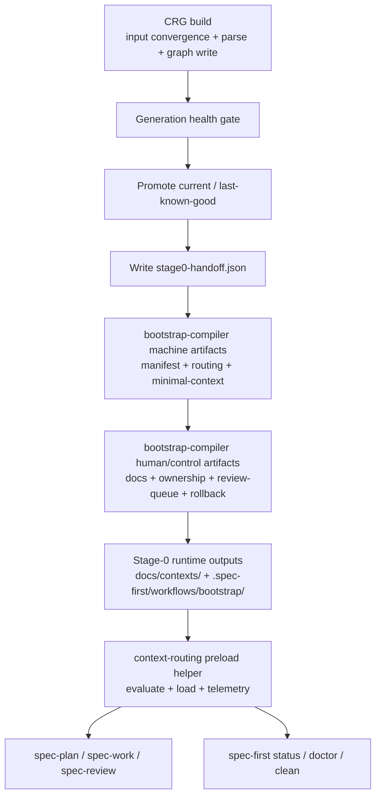
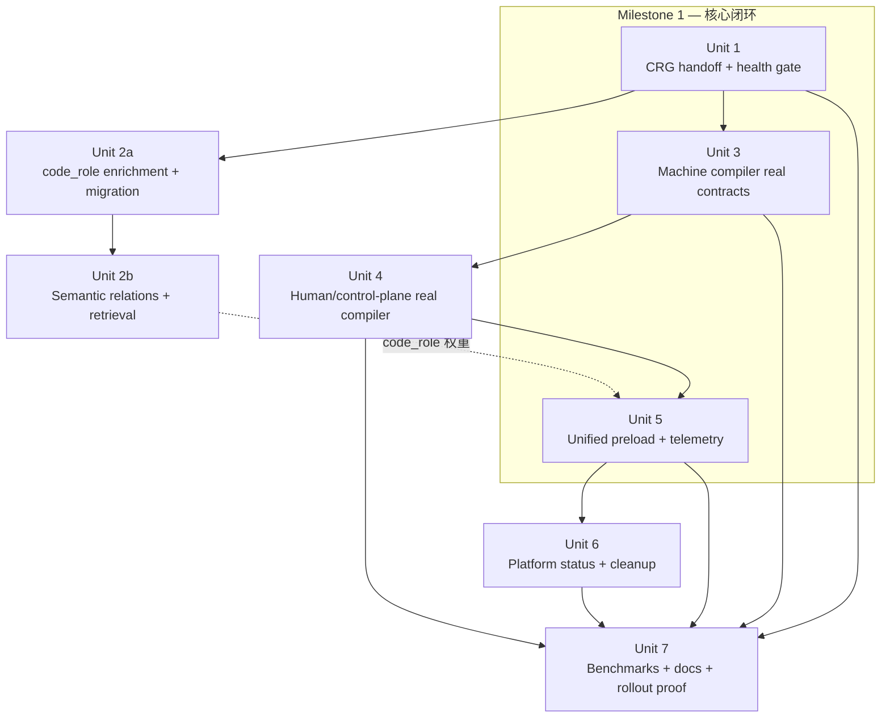

# refactor: Execute unified CRG and Stage-0 runtime roadmap

**Target repo:** `spec-first`

## 状态校准（2026-04-18）

这份计划仍可作为 `CRG + Stage-0` 中长期路线的历史参考，尤其适合回看当时的 wave 拆分、依赖顺序和风险判断。

但当前真正处于执行状态的整改主文档，已经切到 `docs/plans/2026-04-18-spec-first-ai-dev-quality-remediation-plan.md`。后续如果本计划中的重构路线、交付边界或优先级与当前代码事实冲突，应以最新代码、最新测试和该整改主文档为准。

补充边界：本计划里较重的 `stage0-handoff`、平台 `status` 治理、分波次大改等内容，当前应视为路线讨论或候选任务，而不是“必须按原顺序全部实现”的硬约束。当前整改遵循的是“轻 contract + 明确边界 + 让 LLM 决策”。

## Overview

本计划把 `docs/02-架构设计/全局分析/2026-04-16-spec-first-CRG-统一开发执行清单.md` 收敛为一份可直接施工的深度实施计划，目标是在不引入过度平台化外壳的前提下，按正确顺序完成：

1. `CRG` 事实底座升级
2. `spec-graph-bootstrap` 编译链去 sample 化
3. `plan/work/review` 主链统一接入 Stage-0
4. 平台层的 status / cleanup 治理补齐

这不是一份“终局愿景陈列文档”，而是一份以当前仓库代码事实、现有测试面、现有产物边界为基础的执行计划。它要求每个阶段都产出稳定 contract，并以单元测试、合同测试、E2E 与 benchmark gate 作为验收边界。

## Problem Frame

当前 `spec-first` 已经具备 `CRG`、`bootstrap-compiler`、`context-routing` 和 workflow SKILL 预载能力，但主链仍存在**三个核心根问题 + 一个结构性问题**：

1. `CRG` 虽然可用，但 generation 健康门禁、语义边和 `code_role` 分层还不足以稳定支撑上层 Stage-0。
2. `bootstrap-compiler` 当前仍大量依赖 `sample-generator.js`、`DEFAULT_CONTEXT_DOCS` 和占位式 control-plane 输出，导致 `docs/contexts/<slug>/` 与 `.spec-first/workflows/bootstrap/<slug>/` 的内容不是真实编译结果。
3. `spec-plan`、`spec-work`、`spec-review` 虽然已约定消费 evaluator 输出 contract，但运行时仍未形成统一、可解释、可追踪的 Stage-0 装配主链。

在最新一轮重构后，还新增了一个必须显式承接的结构性问题：

4. `skills/spec-graph-bootstrap/SKILL.md` 已经把 Phase 0-4 生命周期、`artifact-manifest.json` 两段写入、`fact-inventory.json / risk-signals.json / test-surface.json` 三主文件、以及 `fact.*` 路由条件写成上层 workflow contract；但当前 `src/bootstrap-compiler/*`、`schema-loader.js`、`context-routing/evaluator.js`、相关 tests 仍明显停留在 sample/skeleton 或部分规则跳过状态。如果计划不把这层 “skill-to-code reconciliation” 显式纳入，后续会长期同时维护 workflow 文本、compiler 实现、schema/test、runtime evaluator 四套语义，最终难以收敛。

用户提供的统一执行清单已经给出了正确顺序：先补底层事实，再补 Stage-0 编译闭环，再补 workflow runtime 与平台治理。本计划的职责是把这条顺序落到真实模块、真实文件、真实测试面与真实依赖关系上。

补充说明：

- 本次没有找到与该主题**精确等价**的 `docs/brainstorms/*-requirements.md`。最接近的历史输入是 `docs/brainstorms/2026-03-31-spec-graph-bootstrap-requirements.md`，但它主要覆盖通用 `spec-graph-bootstrap`，且其中部分控制面路径已过时，因此本计划以用户给定的统一执行清单为主输入，仅把该 brainstorm 文档作为历史背景参考。
- Stage-0 预载可用，但 `freshness.json` 当前为 `stale`，说明它可用于架构与路径研究，不可作为“当前图状态已新鲜”的验收依据。

## Requirements Trace

### CRG Foundation

- R1. 先把 `src/crg` 升级为可稳定支撑 Stage-0 的事实底座，优先补 health gate、稳定 handoff、语义边与 `code_role` 分层。（see origin: `docs/02-架构设计/全局分析/2026-04-16-spec-first-CRG-统一开发执行清单.md`）
- R2. Wave 2 只能消费稳定的 machine-readable handoff contract，不能继续直接耦合 `graph.db` 内部表结构。合规边界定义：通过 `stage0-handoff.json` 稳定字段 + CRG CLI 稳定命令输出（`crg stats`、`crg query`、`crg architecture` 等 `cli/router.js` 暴露的公开子命令）消费 = 合规；在 compiler / evaluator 中直接 `SELECT * FROM nodes/edges` 或依赖 SQLite 表内部列名 = 违规。CRG CLI 命令输出格式由 `docs/contracts/crg-cli-v1.schema.json` 锁定。

### Stage-0 Compiler Outputs

- R3. `bootstrap-compiler` 必须用真实 `CRG` 输入生成 `fact-inventory.json`、`risk-signals.json`、`test-surface.json`、`artifact-manifest.json`、`context-routing.json`、`freshness.json`、`ownership.json`、`review-queue.json`、`docs/contexts/<slug>/` 等正式产物，而不是 sample 输出。
- R4. `docs/contexts/<slug>/` 必须成为可持续消费的 durable docs；`.spec-first/workflows/bootstrap/<slug>/` 必须成为真实 control plane，而不是占位壳。

### Workflow Runtime Unification

- R5. `spec-plan`、`spec-work`、`spec-review` 必须通过统一 preload helper 消费同一套 Stage-0 evaluator / telemetry 语义。
- R6. 单仓与 workspace 语义必须在 slug 解析、degrade level、fallback reason 与 telemetry 记录上保持一致。

### Platform And Governance Boundaries

- R7. Wave 4 才进入 status / retention / cleanup 等平台治理接口；不得倒置顺序先做平台外壳。
- R8. 所有实现必须坚持 source-of-truth 边界：改 `src/`、`skills/`、`templates/`、`agents/`、`.claude-plugin/`，不把 runtime 副本与 control-plane 产物当源码维护。

### Quality Gates

- R9. 变更完成后必须通过 unit / contract / smoke / e2e / benchmark gate，且不得通过放宽 baseline 伪造达标。

## Scope Boundaries

- 不提前进入跨 repo / polyrepo / 终局研究项；相关内容仍留在后续 roadmap 或 research backlog。
- 不引入重型 vector DB、复杂 orchestration runtime、UI dashboard 或平台化壳层。
- 不把所有 workflow 统一改写为 JS 执行器；Wave 3 只收敛 `spec-plan`、`spec-work`、`spec-review` 主链。
- 不把运行时副本目录（`.claude/`、`.codex/`、`.agents/`、`.spec-first/`）升级为长期真源。
- 不以向下兼容历史 sample 输出为首要目标；当前仍处于开发阶段，优先真实 contract 与正确边界。

### Deferred to Separate Tasks

- Deferred research backlog：semantic rerank、强化 hybrid retrieval、入口驱动 flow 建模、跨 repo 扩展、contract-level dependency extraction。
- 双仓知识库 / 外挂知识库模式与 cross-repo 终局路线：继续以 `docs/plans/2026-04-15-012-cross-repo-endgame-master-roadmap.md` 等文档单独推进，不并入本计划的当前施工主线。

## Context & Research

### Relevant Code and Patterns

- `src/crg/cli/build.js`
  - 当前已串起 generation 目录、增量检测、图写入、postprocess、promote / rollback 前置逻辑，是 Wave 1 / Unit 1 的核心落点。
  - 现状问题是职责过重，且 handoff artifact 尚不存在。
- `src/crg/generations/health.js`
  - 当前健康判断仅覆盖 `db exists` 和 `nodeCount > 0`，明显低于上层所需的可信度门槛。
- `src/bootstrap-compiler/compile-machine-artifacts.js`
  - 当前 `freshness / lint / contradictions / minimal-context` 仍围绕 sample manifest 组装，是真实编译闭环的关键替换点。
- `src/bootstrap-compiler/compile-routing.js`
  - 当前完全返回 `sample-generator` 输出，说明 routing 还没有进入真实编译链。
- `src/bootstrap-compiler/run-bootstrap.js`
  - 当前会写入 sample ownership、sample review queue 和 `DEFAULT_CONTEXT_DOCS`，说明 Wave 2 / Unit 3-4 还停留在“骨架可跑”而非“真实产物可信”。
- `skills/spec-graph-bootstrap/SKILL.md`、`skills/spec-graph-bootstrap/references/artifact-schemas.md`
  - 最新 skill 已把 Stage-0 生命周期、降级语义、Phase 0 readiness / stale、Phase 1 三主 JSON、Phase 3 第二次 manifest 写入、Phase 4 路由生成都写成更强约束的上层 contract。
  - 当前源码并未同步实现这些 contract，因此这两份文件已经成为本计划必须纳入的“上游约束”，不能再把它们视作纯说明文档。
- `src/bootstrap-compiler/schema-loader.js`
  - 当前只加载 `artifact-manifest`、`context-routing`、`minimal-context`、`freshness` 四个 schema，尚未覆盖 skill 中已提升为正式控制面主文件的 `fact-inventory`、`risk-signals`、`test-surface`。
- `src/context-routing/evaluator.js`
  - 已具备 `output_exists.*`、`stage_is.*`、fallback level 与 token budget 语义，是 Wave 3 / Unit 5 统一 preload helper 的现实基础。
  - 当前 `fact.*` 会进入 `skipped_rules`，说明事实驱动裁剪尚未落地。
- `.spec-first/workflows/bootstrap/spec-first/context-routing.json`、`docs/contexts/spec-first/injection-index.yaml`
  - 当前两份“路由表达”并不完全同构，且 runtime evaluator 实际只消费 `context-routing.json`。
  - 这意味着后续必须收敛成“单一 routing model -> 双产物渲染”，否则 skill Phase 4、human 文档视图与 runtime evaluator 会继续漂移。
- `src/context-routing/loader.js`、`src/context-routing/workspace-loader.js`、`src/context-routing/telemetry.js`
  - 已经形成可扩展的运行时装配路径，适合继续强化而不是重写。
- `tests/unit/spec-graph-bootstrap-compiler.test.js`
  - 当前主要证明“sample 编排链可跑 + 回滚可用 + 输出确定性”，适合作为 Wave 2 的增量替换测试支架。
- `tests/unit/context-routing-evaluator.test.js`、`tests/unit/workflow-telemetry.test.js`、`tests/unit/workspace-context.test.js`
  - 当前已覆盖 fallback、telemetry、workspace slug 解析等主链行为，适合作为 Wave 3 的回归守护面。

### Stage-0 Preload Findings

- 当前 `slug = spec-first`
- 可读 control-plane：
  - `.spec-first/workflows/bootstrap/spec-first/context-routing.json`
  - `.spec-first/workflows/bootstrap/spec-first/artifact-manifest.json`
  - `.spec-first/workflows/bootstrap/spec-first/minimal-context/plan.json`
- 当前 `selected_assets` 重点在：
  - `minimal-context/plan.json`
  - `architecture/module-map.md`
  - `code-facts/public-entrypoints.md`
  - `00-summary.md`
- 当前 freshness 为 `stale`，原因是 `graph_stale`

本计划据此采用两个约束：

1. 继续使用 evaluator contract 作为 Stage-0 真源，而不是回退到 `injection-index.yaml` 主导运行时。
2. 计划中的质量门与 E2E 需要显式刷新 `CRG` / Stage-0 产物，不能拿当前 stale snapshot 充当最终验证结果。
3. `skills/spec-graph-bootstrap/SKILL.md` 已不只是“说明文档”，而是 Stage-0 workflow contract 的上游真源之一；实现计划必须显式安排 skill 文本、`docs/contracts/`、compiler、evaluator、tests 的同步收敛任务。

### Institutional Learnings

- `docs/solutions/workflow-issues/modify-source-not-artifacts-2026-04-13.md`
  - 关键结论：遇到 `docs/contexts/`、`.spec-first/workflows/`、`.claude/`、`.codex/` 等产物问题时，必须回溯并修改源头模板或源头逻辑，而不是直接手改产物。
  - 对本计划的直接影响：
    - Wave 2 / Wave 3 的实施必须以 `src/bootstrap-compiler/**`、`skills/spec-*.md`、`templates/**`、`src/cli/**` 为主改动面。
    - 任何对 runtime 副本或 control-plane 文件的检查都只作为验证面，不作为主要变更目标。

### External References

- 本次规划**不新增外部研究**。
  - 原因：当前任务是对一个已经做过多轮本地架构审查、并且有明确代码与测试面的内部执行清单进行落地规划。
  - 本仓库在 `src/crg/`、`src/bootstrap-compiler/`、`src/context-routing/`、`tests/**` 上已存在足够直接的局部模式，不需要再用外部资料替代本地事实。

## Key Technical Decisions

- 使用用户给定的统一执行清单作为主 origin，而不是强行回退到较早期的 brainstorm 文档。
  - 理由：当前任务是“如何施工”，不是重新定义 Stage-0 需求边界；执行清单已经完成平台级排序与施工边界收敛。
- 把 `stage0-handoff.json` 视为 Wave 1 / Unit 1 的强制新增 contract。
  - 决策：正式 schema 固定落在 `docs/contracts/spec-graph-bootstrap/stage0-handoff.schema.json`，并纳入现有 schema / contract test 体系。
  - 稳定字段边界：至少包含 `schema_version`、`repo_root`、`slug`、`generation`、`graph_stats`、`health`、`support_state`、`degrade_signals`、`artifact_paths`。
  - 可移植性约束：`repo_root` 仅记录生成时的本地绝对路径，供 debug / telemetry 使用；Wave 2 编译器和 evaluator 不得依赖 `repo_root` 做路径拼接，应通过 `artifact_paths`（相对路径）定位产物。CI / 跨机器场景下 `repo_root` 可能不匹配，消费方必须容忍此字段过时。
  - 依赖边界：Wave 2 编译器、evaluator 与 runtime 只能依赖稳定字段；调试字段允许追加，但不得成为强依赖。
  - 理由：只靠 `graph.db` 内部结构无法给 Wave 2 提供稳定边界，且不利于显式 degrade 语义。
  - Exit gate：Unit 1 结束后，必须用一个高支持仓库（如 `spec-first`）和一个低支持 / 降级仓库验证 handoff 是否真的优于更薄桥接层。只有当它能稳定承载 degrade 语义、promote / rollback 语义和 contract tests，Wave 2 之后的单元才继续建立在 handoff 之上；否则先停在更薄 bridge，禁止继续把错误边界放大。
  - Plan B（exit gate 失败时的调整路径）：若 `stage0-handoff.json` 被证明不优于 thin bridge（例如：稳定字段集过于复杂难以维护、degrade 语义在实际仓库中不可靠、contract tests 脆弱频繁误报），则：
    - 保留 health gate 成果（这部分独立于 handoff contract，直接价值明确）；
    - 用更薄的 bridge 替代 handoff contract：bridge 只暴露 `generation` 指针 + `health_passed` 布尔 + `support_level` 枚举 + `artifact_paths` 相对路径，不把图统计、degrade signals 等语义打包进 contract；
    - Unit 3 的 analyzer 改为通过 CRG CLI 稳定命令（`crg stats`、`crg query`、`crg architecture`）动态获取图数据，而非读取静态 handoff 文件；
    - Milestone 1 的验证仍然可以推进，只是 compiler 输入来源从 handoff 文件切换为 CRG CLI 命令调用。
- `skills/spec-graph-bootstrap/SKILL.md` 与 `docs/contracts/spec-graph-bootstrap/` 在本轮分别承担 workflow-level contract 与 machine-field contract。
  - 决策：裁决优先级固定为 `docs/contracts/spec-graph-bootstrap/*` + checked contract tests > `src/bootstrap-compiler/*` / `src/context-routing/*` 的实现约束 > `SKILL.md` / `references/artifact-schemas.md` 的叙述层。skill 文本必须与 machine contract 同步，但冲突时不得反向覆盖 machine truth。
  - 理由：最新 skill 已经先行定义了 Phase 0-4 行为；如果完全不把它纳入收敛面，会继续漂移。但如果把它和 machine schema 设成并列真源，又会制造“谁说了算”的额外复杂度。
- 让 `sample-generator.js` 退回“测试 fixture / fallback helper”角色，而不是继续承担生产编译主链。
  - 理由：当前 sample 与真实逻辑混用，是 Wave 2 产物不可信的直接原因。
- 路由语义先收敛为单一 `routingModel`，再分别渲染 `context-routing.json` 与 `injection-index.yaml`。
  - 决策：当前阶段运行时 machine truth 继续固定为 `context-routing.json`，因为 `src/context-routing/evaluator.js`、现有 schema 与主链 tests 都围绕它构建；`injection-index.yaml` 保留为 durable docs / human-view projection，不让 evaluator 直接读取 YAML。
  - 理由：当前 checked-in `context-routing.json` 与 `injection-index.yaml` 已存在实际漂移；若继续分别维护两套路由规则，只会扩大 skill 与 runtime 的差异。
- `artifact-manifest.json` 生命周期采用两段写入，而不是单次“直接 complete”。
  - 决策：skill Phase 0 readiness / slug / support-state 判定完成后先写 `status=in_progress`；skill Phase 3 human assets 与 skill Phase 4 routing 收口后再写 `status=complete`。
  - 理由：这既是最新 skill 的明确 contract，也是避免 control-plane 在失败场景下伪装成“完整成功产物”的必要前提。
- Phase 0 的 slug 冲突检测、宿主探测、MCP / CRG readiness probe、交互式 build 提示归 workflow/CLI orchestration 层，不内嵌到纯 compiler 函数。
  - 决策：`run-bootstrap.js` / `orchestrator.js` 可以接收已经解析好的 `slug`、`support_state`、`graph_stats`、`stale_info` 等输入，但不把 host 交互、确认提示、宿主探测硬塞进 `compile-*` 纯函数。
  - 理由：当前 `src/bootstrap-compiler/*` 基本仍是纯编译风格；把交互/探测与编译拆层，才能同时保住可测试性、双宿主适配能力与 skill contract 的可落实性。
- Wave 2 分成“machine contract 去 sample 化”和“human/control-plane 真实编译化”两个实施单元。
  - 理由：这样能把 manifest / routing / minimal-context 与 docs / ownership / rollback 的替换风险分层处理，避免一次性重写全部编译逻辑。
- Wave 3 先统一 `plan/work/review` 三条主链，不提前追求所有 workflow 的完全统一。
  - 理由：这三条链是现有 Stage-0 预载 contract 的直接消费者，也是 benchmark gate 的主要影响面。
- Wave 4 才补 `spec-first status` 与最小治理视图。
  - 理由：若前置 contract 仍不稳定，平台观测层只会放大底层噪声。
- `spec-first status` 本轮仅要求 human-readable 输出，不把 `--json` 纳入当前交付。
  - 理由：当前优先收敛底层 contract 与治理边界，避免过早暴露第二套平台接口。
- `spec-first status` 优先派生现有 managed state、adapter / plugin metadata 与 Stage-0 control-plane 输出，不默认新增持久化 runtime registry。
  - 决策：只有当 `doctor`、`clean`、host adapter 与 CLI status 之间确实存在无法从现有状态派生的共享元数据，才允许引入额外的最小 read-model；默认不新增新的持久化 registry 文件。
  - 理由：当前仓库已经有 `src/cli/state.js`、adapter 路径和 plugin metadata，human-readable status 可以先做派生视图，避免为一个只读命令额外造状态层。
- `code_role` 在当前阶段固定落为 `nodes` 表单列主角色，不引入独立 role 映射表。
  - 决策：`code_role` 作为 `nodes` 的稳定语义列，由 build 主链在 parse 之后、upsert 之前完成 enrichment。
  - 约束：只支持单主角色，最小枚举集为 `product`、`test`、`fixture`、`tooling`、`workflow_runtime`、`knowledge_script`、`unknown`。
  - 边界：保留 `is_test` 作为热路径布尔过滤位；`code_role` 只用于更高层检索权重与解释，不替代 `is_test`。
  - 现状核对：`src/crg/migrations.js` 已定义 `SCHEMA_VERSION = 'crg-cli/v1'`（第 14 行）、`graph_meta.schema_version` 表（第 88-95 行），并已在第 206-218 行用幂等 `ALTER TABLE ... ADD COLUMN` + `PRAGMA table_info` 模式给 `nodes` 追加过 `generation_id`、`parser_quality`、`summary`、`retrieval_text` 四列。`code_role` 是第 17 列，**复用**现有模式即可，不新建迁移框架。
  - 理由：当前消费面直接围绕 `nodes` 查询，若先上独立 role 映射表，会引入额外 join、迁移和一致性成本，但收益不足。
- Characterization test 最小覆盖面：Unit 1、Unit 2a、Unit 2b 在修改热点模块之前，必须先录制当前行为快照。
  - Unit 1 最小覆盖：对 spec-first 仓库执行 `crg build`，录制 promote 后的 `current.json` / `last-known-good.json` 字段集与 `crg stats` 输出格式 → `tests/fixtures/characterization/generation-promote-baseline.json`。
  - Unit 2a 最小覆盖：对 spec-first 仓库录制 `architecture` 的前 10 输出结果（节点 ID + score + kind）→ `tests/fixtures/characterization/architecture-baseline.json`。
  - Unit 2b 最小覆盖：对 spec-first 仓库录制 `review-context` 的前 10 输出结果（节点 ID + score + kind）→ `tests/fixtures/characterization/review-context-baseline.json`。
  - 理由：这几个模块是已知热点，历史修改多次引入隐式行为变化；没有 characterization 快照就改动等于盲操作。
  - 详细 protocol 见 Success Metrics / Characterization Test Protocol 小节。
- 当前 `edges` 表维持”Observed structural relations only”边界，不把缺乏 provenance 的推断边混入核心图。
  - 决策：非 JS/TS 最小稳定 contract 只承诺 `defined_in`、`contains`、`imports_from`；`inherits`、`implements` 仅在单语言 fixture 锁定后逐个开放。
  - 延后项：`tested_by`、`route_to`、`exports` 不进入当前 parser / core graph 最小 contract；如未来确需进入核心图，前提是先补齐 edge provenance 能力。
  - 理由：当前 `edges` schema 不携带 `confidence`、`source_tier`、`evidence`，若把推断边直接写入，将破坏图事实可信度与降级语义。

## Open Questions

### Resolved During Planning

- 哪份文档作为本次实施计划的主输入？
  - 结论：使用 `docs/02-架构设计/全局分析/2026-04-16-spec-first-CRG-统一开发执行清单.md` 作为 origin；历史 brainstorm 仅作背景参考。
- Wave 2 是否允许直接消费 `graph.db` 内部表结构？
  - 结论：不允许。必须通过新增的 `stage0-handoff.json` 或等价稳定 contract 进入编译器。
- `sample-generator.js` 是否继续承担生产编译输出？
  - 结论：不承担。它只能作为测试 fixture / 合同样本生成器存在。
- Wave 3 是否一次性统一所有 workflow？
  - 结论：否。只统一 `spec-plan`、`spec-work`、`spec-review` 主链。
- Wave 4 是否可以提前到 Wave 2 之前？
  - 结论：不可以。必须等 Wave 1-3 的 contract 稳定后再补平台治理面。
- `spec-first status` 本轮是否要求 `--json`？
  - 结论：不要求。当前计划只交付 human-readable `status`，`--json` 延后到后续平台化任务。
- `code_role` 当前应落在哪一层？
  - 结论：落在 `nodes` 表单列主角色，并在 build 主链做 parse 后 enrichment；不做独立 role 映射表，不把 role 判定塞进 parser。
- 非 JS/TS 关系提取的当前最小精度边界是什么？
  - 结论：统一最小 contract 是 `defined_in`、`contains`、`imports_from`；`inherits`、`implements` 按语言逐个开放；`tested_by`、`route_to`、`exports` 延后到 provenance 更完整的阶段。
- 最新 `spec-graph-bootstrap` skill 中的 Phase 0 交互逻辑、readiness probe 与 stale 检测应落在哪一层？
  - 结论：保留在 workflow/CLI orchestration 层；compiler 只消费解析后的 machine inputs，不直接承担宿主探测与交互职责。
- `context-routing.json` 与 `injection-index.yaml` 哪个是运行时真源？
  - 结论：本轮继续以 `context-routing.json` 为 runtime machine truth，`injection-index.yaml` 由同一 `routingModel` 渲染为 human-view 投影；不让两套文件分别演化。

### Deferred to Implementation

- `inherits`、`implements` 在 Java / Kotlin / Swift / C# / Python / Rust 等单语言上的开放顺序。
  - 原因：这取决于各语言 fixture 的完备度与误报控制，不适合在 planning 阶段硬编码优先级。
- `code_role` 的 repo 级局部例外是否需要后续引入 override 层。
  - 原因：当前先以内建路径/文件名规则完成 80% 覆盖，只有在真实仓库出现系统性误判时，才值得追加轻量 override 机制。
- skill Phase 0 中哪些提示文案、交互式确认、宿主差异需要进一步下沉到 CLI，哪些只保留在 `SKILL.md` 文本层。
  - 原因：这涉及 Claude / Codex 双宿主、非交互批处理模式与未来 CLI entrypoint 设计，当前 planning 阶段先锁定“层次边界正确”，不提前把所有交互细节硬编码到模块接口。

## High-Level Technical Design

> *This illustrates the intended approach and is directional guidance for review, not implementation specification. The implementing agent should treat it as context, not code to reproduce.*

## Delivery Waves

为避免与 `spec-graph-bootstrap` skill 内部的 Phase 0-4 生命周期混淆，本节统一使用 `Wave 1-4` 表示本计划的实施波次；共 **8 个施工单元（Unit 1 / 2a / 2b / 3 / 4 / 5 / 6 / 7）**，其中原 Unit 2 已拆分为 Unit 2a + Unit 2b；`skill Phase 0-4` 仅表示 bootstrap runtime 生命周期。具体实现和验收一律以下文 Unit 定义为准。

### Milestone 1 — 核心闭环（验证假设）

**目标：** 用最短路径证明"真实 CRG 驱动的 Stage-0 上下文 > sample 上下文"这一核心假设。

**交付切片：** Unit 1 → Unit 3（Slice A: manifest + routing + plan minimal-context + freshness） → Unit 5（basic fact rules only: `fact.graph_support_state` + `fact.code_facts_confidence`）

**用户可感知价值：** `spec-plan` 能消费基于真实 CRG 输入编译的 Stage-0 上下文，而非 sample 数据。

**验证方法：** 在 spec-first 仓库和至少一个外部仓库上运行完整 `crg build → bootstrap compile → spec-plan`，对比 sample 模式与真实模式的 `selected_assets` 差异，确认真实模式产出的上下文可追溯到实际代码结构。

**里程碑判定（三分支决策树）：**

- **分支 A — 验证成功**（真实模式在 review/repo_qa hit_rate 和 irrelevant_ratio 均不退化，且至少一项改善）：进入 Milestone 2，按 Unit 2a → 2b → 3B/C → 4 → 完整 Unit 5 → 6 → 7 推进。
- **分支 B — 部分成功**（hit_rate 改善但 irrelevant_ratio 未改善，或反之）：暂停 Unit 2b 与 Unit 4 的高成本投入，先深入调优 `fact.*` 规则、`priority.js` 权重、`pack.js` 预算切分。调优迭代 2 周仍无法达到 "两项指标均不退化"，升级为分支 C。
- **分支 C — 验证失败**（任一关键指标相对 sample baseline 显著退化）：**暂停整个计划**，回退到 CRG 数据质量本身的诊断：handoff 字段是否缺失关键语义？analyzer 写出的 fact-inventory/risk-signals/test-surface 是否与 CRG 真实数据对齐？不得盲目推进 Milestone 2。

**版本号规划：**

- Milestone 1 完成 → 发布 `v1.7.0`（新特性：真实 Stage-0 编译链路启用）
- Unit 2a / 2b / 4 等中间 Unit 落地 → `v1.7.x` patch / minor 增量
- Milestone 2 全部完成（含 Unit 7 的 quality gate 收口）→ `v2.0.0`（major：Stage-0 全真实化 + 平台治理接口 + 双宿主统一 preload）

### Milestone 2 — 质量增强（扩大收益）

**目标：** 在核心闭环验证通过的基础上，扩大收益面：补 code_role 去噪、human assets 真实化、全 workflow 统一消费、平台治理。

**交付切片：** Unit 2a → Unit 2b → Unit 3（Slice B/C） → Unit 4 → Unit 5（完整 fact rules） → Unit 6 → Unit 7

### Wave 1

- 先建立 `CRG -> Stage-0` 稳定 handoff 与 generation quality gate。
- 再补 `code_role` enrichment（Unit 2a），验证去噪效果后再补语义边与检索链路（Unit 2b）。

### Wave 2

- 先让 machine artifacts 摆脱 sample 依赖。
- 再让 docs / ownership / review-queue / rollback 成为真实 control-plane 闭环。

### Wave 3

- 先统一 `plan/work/review` 的 Stage-0 装配入口。
- 再收敛 workspace 语义、wrapper / adapter / skill 三层一致性。

### Wave 4

- 在前述 contract 稳定后，再补 `spec-first status` 与 retention / cleanup。

## Implementation Units

- [ ] **Unit 1: CRG generation contract and health gate**

**Goal:** 把 `CRG` 从“能建图”升级为“能向 Stage-0 暴露稳定、可判断健康度的事实 contract”。

**Requirements:** R1, R2, R9

**Dependencies:** None

**Files:**
- Modify: `src/crg/artifact-paths.js`
- Modify: `src/crg/cli/build.js`
- Modify: `src/crg/generations/health.js`
- Modify: `src/crg/generations/paths.js`
- Modify: `src/crg/generations/promote.js`
- Modify: `src/crg/generations/rollback.js` *(新增 `rollbackToLastKnownGood` 函数)*
- Modify: `src/crg/graph.js`
- Modify: `src/crg/migrations.js`
- Create: `docs/contracts/spec-graph-bootstrap/stage0-handoff.schema.json`
- Test: `tests/unit/crg-generation-build.test.js`
- Test: `tests/unit/crg-artifact-paths.test.js`
- Test: `tests/contracts/crg-cli-v1.test.js`
- Test: `tests/e2e/crg-all-commands.sh`
- Test: `tests/e2e/crg-sqlite-audit.sh`

**Approach:**
- 在 `.spec-first/graph/` 下新增稳定 handoff artifact，并用 `docs/contracts/spec-graph-bootstrap/stage0-handoff.schema.json` 锁定字段语义与版本。
- handoff contract 的稳定字段至少覆盖 generation 指针、图规模、未解析质量、支撑状态、degrade signals 与 health 状态；扩展字段只允许用于调试，不得成为编译器强依赖。
- 把 generation health 从“`db exists + nodeCount > 0`”升级为聚合式质量门，纳入 unresolved edge、parser 退化计数、FTS / orphan edge 等指标。
- 分离 `current.json` 与 `last-known-good.json` 的更新时机：当前实现在 `promoteGeneration()` 中同时写入两者，导致 last-known-good 失去安全网作用。改为 health gate 通过后先写 `current.json`，仅当完整 promote（含 handoff artifact 写入）确认成功后才更新 `last-known-good.json`。
- 在 `rollback.js` 中新增 `rollbackToLastKnownGood()` 函数：当前仅有 `discardFailedGeneration()`（删除目录）和 `readCurrentGeneration()`（读指针），缺少从 `last-known-good.json` 恢复到 `current.json` 的显式路径。新函数负责读取 last-known-good 指针、验证其指向的 DB 存在且可打开、更新 `current.json` 与活跃 graph.db。
- 让 promote / rollback 对 handoff artifact 与 `current.json` / `last-known-good.json` 保持同一状态语义。
- 统一 build 主链在健康失败时的 discard 与结构化失败输出，不允许静默 promote。

**Execution note:** Add characterization coverage before changing generation promotion and rollback semantics.

**Patterns to follow:**
- `src/crg/cli/build.js` 现有 generation 目录与 envelope 输出风格
- `src/crg/generations/rollback.js` 现有 rollback 语义
- `tests/e2e/crg-sqlite-audit.sh` 现有 SQLite 一致性校验模式

**Test scenarios:**
- Happy path: 成功 build 后写出 `current.json`、`last-known-good.json` 与新增 handoff artifact，字段和 generation 指针一致。
- Happy path: 健康通过时 promote 结果可被 `crg stats` 与下游编译器读取，不改变现有 CLI 可用性。
- Edge case: 当 `edge_count = 0`、`community_count = 0` 或 FTS 行数不一致时，health gate 返回失败且 generation 不 promote。
- Edge case: 当只有 module 节点、存在大量 parse_error/no_parser 退化时，handoff artifact 明确标记 degraded support state。
- Error path: build 过程中 postprocess 或 health 失败时，当前 generation 不覆盖 last-known-good。
- Integration: `spec-first crg build --repo=.` 产出的 handoff artifact 能被 Wave 2 编译器按稳定字段消费，而不是读取 SQLite 内部表结构。

**Verification:**
- 同一仓库成功 build 后，`.spec-first/graph/` 下存在稳定 handoff contract，且健康失败不会 promote 失败 generation。
- 合同测试与 SQLite 审计能证明新 contract 与现有 CLI 输出保持一致、可追踪。

- [ ] **Unit 2a: code_role enrichment and schema migration**

**Goal:** 为节点引入稳定 `code_role` 语义分层，在 `analyze.js` 入口验证 code_role 去噪有效后，再由 Unit 2b 扩展到 retrieval 全链路。这是降低 Unit 2 整体风险的第一步：先证明 code_role 有效，再投入 parser 拆分和 retrieval 改造。

**Requirements:** R1, R9

**Dependencies:** Unit 1

**Files:**
- Create: `src/crg/code-role.js`
- Modify: `src/crg/cli/build.js`
- Modify: `src/crg/graph.js`
- Modify: `src/crg/migrations.js`
- Modify: `src/crg/analyze.js`
- Modify: `src/crg/commands/architecture.js`
- Test: `tests/unit/crg-build-cli.test.js`
- Test: `tests/unit/crg-analyze.test.js`
- Test: `tests/unit/crg-graph.test.js`
- Test: `tests/contracts/crg-cli-v1.test.js`
- Test: `tests/unit/crg-code-role.test.js` *(新增)*

**Approach:**
- 为节点引入稳定 `code_role` 语义，最小枚举集为 `product`、`test`、`fixture`、`tooling`、`workflow_runtime`、`knowledge_script`、`unknown`。
- `code_role` 固定落在 `nodes` 表单列主角色，并通过独立 enrichment 模块（`code-role.js`）在 build 主链中完成推断；parser 仍只负责 AST 观察事实。
- Schema migration 向前兼容：**复用** `src/crg/migrations.js` 第 206-218 行已有的幂等 `ALTER TABLE ... ADD COLUMN` + `PRAGMA table_info` 模式（该文件已用此模式追加过 `generation_id` / `parser_quality` / `summary` / `retrieval_text`）。加入 `ALTER TABLE nodes ADD COLUMN code_role TEXT DEFAULT 'unknown'` 即可，不新建迁移框架，不要求用户手动删库。
- `code_role` 首次上线与后续规则变更都不依赖用户手动 `--force`：引入显式 `CODE_ROLE_REVISION`（或等价 enrichment revision）与 `graph_meta` 持久化标记；当 revision 不匹配时，当前 `crg build` 自动升级为一次性全量 rebuild/backfill，刷新所有输入文件与 fingerprints，然后写回最新 revision。
- `is_test` 保持现有布尔过滤职责；`code_role=test` 不替代 `is_test`，只补充更高层语义分层与权重解释。
- `architecture` 的 role-aware 改动面以 `src/crg/analyze.js` 为主：`godNodes()` 与相关分析函数需要读取 `code_role`，在默认 hub ranking 中对 `test`、`fixture`、`tooling` 做软去噪，同时把 `code_role` 暴露到输出 FactItem；`architecture.js` 只负责 envelope 对齐。
- `graph.js` 的改动点：`upsertNodes` 的 INSERT 语句增加 `code_role` 列，读取 enrichment 模块的 `effective_code_role` 写入（与 migrations 新增列对齐）。其余 edge upsert / resolve 逻辑不动。
- 本单元**不涉及** parser.js 拆分、retrieval 链路改造、search.js 更新。这些留给 Unit 2b。

**Execution note:** 在修改 `analyze.js` 之前，先录制 `architecture` 命令在 spec-first 仓库的前 10 输出结果作为 characterization baseline，存放于 `tests/fixtures/characterization/architecture-baseline.json`。

**Patterns to follow:**
- `src/crg/input-convergence.js` 已有的分层过滤与输入收敛思路
- `tests/fixtures/parser/**` 已有多语言 fixture 结构

**Test scenarios:**
- Happy path: build 完成后所有节点都有非 `unknown` 的 `code_role`（测试文件标记为 `test`，fixture 文件标记为 `fixture`，src/ 下产品代码标记为 `product`）。
- Happy path: `architecture` 输出中 god_nodes 对 `test`、`fixture`、`tooling` 节点做了软去噪，不再与 `product` 节点混排。
- Edge case: 首次引入 `code_role` 或 revision 升级时，已有 graph.db 不需要人工删库；build 自动触发一次性全量 rebuild/backfill，旧节点不会长期停留在 mixed-epoch 的 `unknown` 状态。
- Edge case: 无法推断角色的文件（非标准路径/命名）正确标记为 `unknown`，不伪装精度。
- Error path: enrichment 模块遇到意外路径时不阻断 build，退化为 `unknown` 并写入 warning。

**Verification:**
- `architecture` 输出可观察到 `code_role` 的去噪效果（`test`/`fixture`/`tooling` 节点在 hub ranking 中被降权）。
- characterization baseline 对比证明 `product` 节点排名上升、噪声节点排名下降，且无核心 `product` 节点意外消失。

**Exit gate:** Unit 2a 完成后，在 spec-first 仓库和至少一个外部仓库上运行 `architecture` 命令，对比去噪前后的 top-10 结果。只有当 `code_role` 证明对 `analyze.js` 的去噪有效，才推进 Unit 2b 的 retrieval 链路改造。

---

- [ ] **Unit 2b: Semantic relation extraction and retrieval code_role propagation**

**Goal:** 在 Unit 2a 验证 `code_role` 有效的基础上，为 JS/TS 补齐 `inherits`/`implements` 语义边，并把 `code_role` 贯穿到 retrieval 热路径。

**Requirements:** R1, R9

**Dependencies:** Unit 2a

**Files:**
- Modify: `src/crg/parser.js`
- Modify: `src/crg/retrieval/api.js`
- Modify: `src/crg/retrieval/seed.js`
- Modify: `src/crg/retrieval/expand.js`
- Modify: `src/crg/retrieval/rerank.js`
- Modify: `src/crg/retrieval/pack.js`
- Modify: `src/crg/retrieval/profiles.js`
- Modify: `src/crg/search.js`
- Modify: `src/crg/commands/review-context.js`
- Test: `tests/unit/crg-parser.test.js`
- Test: `tests/unit/crg-retrieval.test.js`
- Test: `tests/unit/crg-cli-handlers.test.js`
- Test: `tests/contracts/crg-cli-v1.test.js`

**Approach:**
- **`parser.js` 范围收缩：** 不做 1841 行文件的架构性拆分（当前没有第 2 种语言等着复用抽象）；只在现有 JS/TS 抽取代码路径内局部新增 `inherits`、`implements` 的结构关系边（预估 ~100 LOC 增量）。relation extraction 的模块化抽象延后到未来有第 2 种语言真实需要扩展时再做。
- 不把 `tested_by`、`route_to`、`exports` 作为本单元的 parser 主目标。
- `code_role` 必须贯穿当前 retrieval 热路径：`search.js`、`retrieval/seed.js`、`retrieval/expand.js`、`retrieval/rerank.js`、`retrieval/pack.js` 都要传递 `effective_code_role`。`chunk` 不新增持久化 role 字段，而是在读取时通过父 `node` join/继承其 `code_role`。
- retrieval 范围不是”顺手重构整条检索平台”，而是由当前热路径决定的最小闭包：`review-context` 经由 `retrieval/api -> seed -> expand -> rerank -> pack` 取数，这些文件属于必须触达的热路径。`semantic-rerank`、query planning、profile 泛化等非阻塞优化保持延后。
- 更新 `review-context` / `architecture` 默认权重，使非核心角色噪声下降，但只做软权重，不通过简单排除目录或硬删除角色破坏图完整性；packed output 至少保留 role-aware reasons/score breakdown。
- 保持非 JS/TS 语言先达到最小可用边覆盖；当前最小稳定 contract 是 `defined_in`、`contains`、`imports_from`。
- 对 `inherits`、`implements` 采用”fixture 先行、逐语言开放”策略；对 `tested_by`、`route_to`、`exports` 保持延后。
- JS/TS 最小 fixture 验收清单（Unit 2b 完成时必须全部通过）：
  - `class Foo extends Bar` → 产出 `inherits` 边（Foo → Bar）
  - `class Baz implements IQux` → 产出 `implements` 边（Baz → IQux）
  - mixin / abstract class 继承链 → 产出 `inherits` 边且不重复
  - 框架装饰器（如 `@Injectable`）→ 不产出误判的 `inherits` 边
  - 测试文件中的 class 继承 → 正确标记 `code_role=test`，不影响核心图权重

**Execution note:** Add characterization coverage before splitting `parser.js`; this file is a known hotspot. 快照存放于 `tests/fixtures/characterization/review-context-baseline.json`（`review-context` 在 spec-first 仓库的前 10 输出结果：节点 ID + score + kind）。

**Patterns to follow:**
- `src/crg/retrieval/profiles.js` 现有 profile 化权重入口
- `tests/fixtures/parser/**` 已有多语言 fixture 结构

**Test scenarios:**
- Happy path: JS/TS fixture 中的类继承、接口实现能产出新增结构关系边，且不会误把框架语义或测试推断边混入核心图。
- Happy path: review-context 对同时包含 `product`、`test`、`workflow_runtime` 节点的仓库，优先返回 `product` 与相关测试上下文；role 权重必须经 `search -> seed -> expand -> rerank -> pack` 全链路生效，而不是只在 DB 中存在。
- Happy path: `chunk` 命中时能够继承父 `node` 的 `effective_code_role`，不会因为 chunk 自身无持久化 role 列而丢失权重语义。
- Edge case: 非 JS/TS 语言缺少某类提取器时，build 不失败，但 handoff / retrieval 明确表现为部分支撑而非伪精确。
- Edge case: Swift / Kotlin 等当前只锁定节点抽取的语言，在未补齐 fixture 之前不承诺额外关系边。
- Error path: relation extraction 遇到无法解析的 AST 片段时，保留现有节点事实并写入 parse degradation 统计。
- Integration: `review-context` 与 Stage-0 最小 retrieval 路径能直接消费新增关系边与 `code_role`，且 benchmark 指标不低于 baseline。

**Verification:**
- `review-context`、`architecture` 与 Stage-0 所需最小 retrieval API 中能观察到新增关系边和 `code_role` 权重的实际效果；`code_role` 不再停留在落库层，而是穿透到 retrieval/analysis 热路径，同时核心图中不存在无法解释来源的推断边。
- benchmark gate 不因噪声上升而退化出 baseline。

- [ ] **Unit 3: Real machine-artifact compiler**

**Goal:** 让 `artifact-manifest.json`、`context-routing.json`、`minimal-context/*.json` 与 freshness 基于真实 `CRG` / Stage-0 输入编译，而不是 sample generator。

**Requirements:** R2, R3, R4, R9

**Dependencies:**
- Unit 1 — **exit gate 通过** → Unit 3 的 analyzers 按 `stage0-handoff.json` 稳定字段消费
- Unit 1 — **exit gate 失败走 Plan B** → Unit 3 的 analyzers 改为调用 CRG CLI 稳定命令（`crg stats` / `crg query` / `crg architecture`）动态获取图数据，不读静态 handoff 文件

**Files:**
- Create: `src/bootstrap-compiler/analyzers/fact-inventory.js` *(Slice A)*
- Create: `src/bootstrap-compiler/analyzers/risk-signals.js` *(Slice B)*
- Create: `src/bootstrap-compiler/analyzers/test-surface.js` *(Slice B)*
- Modify: `src/bootstrap-compiler/orchestrator.js` *(Slice A：pipeline 改接真实 analyzer 输入；Slice B/C：增量扩展)*
- Modify: `src/bootstrap-compiler/compile-machine-artifacts.js` *(Slice A：移除默认 sample manifest 兜底)*
- Modify: `src/bootstrap-compiler/compile-minimal-context.js` *(Slice A 仅确保上游传真实数据；本文件 145 行本身为真实逻辑，不重写)*
- Modify: `src/bootstrap-compiler/compile-routing.js` *(Slice A：当前 19 行 wrapper 重写为 routingModel 构建器，~100 LOC)*
- Modify: `src/bootstrap-compiler/run-bootstrap.js` *(Slice A：两段 manifest + 移除 DEFAULT_CONTEXT_DOCS 对生产链路的依赖)*
- Modify: `src/bootstrap-compiler/schema-loader.js` *(Slice A：加载 fact-inventory；Slice B：加载 risk-signals / test-surface)*
- Modify: `src/bootstrap-compiler/sample-generator.js` *(Slice A：保留现有函数，仅解除对生产链路的默认绑定；Slice C：正式降级为 test fixture helper)*
- Modify: `src/bootstrap-compiler/freshness.js` *(Slice A：基于真实 manifest.updated_at / graph_last_built 派生)*
- Modify: `docs/contracts/spec-graph-bootstrap/artifact-manifest.schema.json` *(Slice A：两段 status 生命周期)*
- Modify: `docs/contracts/spec-graph-bootstrap/context-routing.schema.json` *(Slice A)*
- Create: `docs/contracts/spec-graph-bootstrap/fact-inventory.schema.json` *(Slice A)*
- Create: `docs/contracts/spec-graph-bootstrap/risk-signals.schema.json` *(Slice B)*
- Create: `docs/contracts/spec-graph-bootstrap/test-surface.schema.json` *(Slice B)*
- Modify: `docs/contracts/spec-graph-bootstrap/minimal-context.schema.json` *(Slice A 为 plan，Slice B 扩 work/review)*
- Modify: `docs/contracts/spec-graph-bootstrap/freshness.schema.json` *(Slice A)*
- Test: `tests/unit/spec-graph-bootstrap-compiler.test.js` *(需大幅重写：当前多数断言绑定 sample 输出)*
- Test: `tests/unit/spec-graph-bootstrap-contracts.test.js` *(需同步更新对 checked-in sample 文件的断言)*
- Test: `tests/unit/stage0-freshness.test.js` *(Slice A)*
- Test: `tests/e2e/spec-graph-bootstrap-mainline.sh`

**Approach:**
- 先落地三主文件的生产者边界，而不是只补“消费者 contract”：
  - `fact-inventory.json`、`risk-signals.json`、`test-surface.json` 的生产者固定为本地 Node 侧分析器（建议收敛到 `src/bootstrap-compiler/analyzers/*`，也可等价放在 `src/bootstrap-compiler/` 内部模块），输入为 `stage0-handoff`、CRG 查询结果和 repo 本地文件事实；不由 `SKILL.md`、runtime prompt worker 或 sample generator 直接生成。
  - 三主文件的权威落盘路径固定为 `.spec-first/workflows/bootstrap/<slug>/`；生产路径必须先真实写出这三个文件，再允许后续 machine compiler 和 evaluator 把它们当成输入。
  - `run-bootstrap.js` / `orchestrator.js` 的生产主链要显式区分“生产者”与“编译器”：生产者负责三主文件写入与 schema 校验，编译器负责基于真实 control-plane 文件继续生成 `manifest / routing / minimal-context / freshness`。
- 用 Unit 1 新增的 handoff artifact 作为编译器主要输入之一，明确编译器只消费稳定字段，而不触摸 SQLite 内部细节。
- 把最新 `skills/spec-graph-bootstrap/SKILL.md` / `references/artifact-schemas.md` 中已经提升为 contract 的生命周期语义真正落到源码，而不是继续让 skill 文本领先实现。Unit 3 的最小收口至少包括：
  - `fact-inventory.json`、`risk-signals.json`、`test-surface.json` 成为正式 control-plane 主文件，并进入 `schema-loader.js` 与 contract tests。
  - `artifact-manifest.json` 实现第一次写入（`status=in_progress`）与最终写入（`status=complete`）的生命周期。
  - routing 机器真源与 human-view 路由投影基于同一中间模型生成。
- 用“最小真实替换切片”推进去 sample 化，避免一次性重写全部 machine contracts：
  - Slice A: 先只替换 `artifact-manifest.json`、`context-routing.json`、`minimal-context/plan.json`、`freshness.json`。
  - Slice B: 在 Slice A 稳定后扩到 `minimal-context/work.json`、`minimal-context/review.json`。
  - Slice C: 最后再开放给依赖 manifest/routing 的其他 machine consumers。
- 让 `artifact-manifest.json` 包含真实 graph metadata、quality / support 状态、真实 outputs 依赖，而不是硬编码 sample 值。
- 让 `compileRouting()` 先构建单一 `routingModel`，再由它渲染 `context-routing.json`；`injection-index.yaml` 的渲染在 Unit 4 接入，但不得再单独维护另一套规则来源。
- 对 `compile-minimal-context.js` 的精确处理：该文件本身不调用 sample-generator，其逻辑从 `factInventory`、`riskSignals`、`testSurface` 参数构建输出。本单元对它的改动不是"去 sample 化"，而是"确保上游调用方传入真实数据而非 sample 值"——即 `orchestrator.js` 在组装 pipeline 时必须把 handoff artifact 解析结果（而非 sample 常量）注入为 `compile-minimal-context.js` 的输入参数。
- 把 `sample-generator.js` 收敛为测试 fixture 辅助模块；生产编译路径不再直接依赖其输出。
- 明确 control-plane 的 machine 原子提交单元与状态机，避免两阶段 manifest 落地后留下可误消费的半成品：
  - `manifest.status=in_progress` 时，至少必须存在 `artifact-manifest.json` 基础字段（`schema_version`、`generated_at`、`updated_at`、`status`、`inputs`、`schema_versions`）和已成功写入的三主文件；human docs 与 final routing 允许尚未完成。
  - `manifest.status=complete` 时，必须同时满足：三主文件、`context-routing.json`、`minimal-context/*.json`、`freshness.json` 已通过 schema 校验，且 `outputs` 依赖清单完整。
  - machine control-plane 写入采用 temp 目录 + 原子替换或等价 staged write；失败时允许保留 `in_progress` / `failed` 状态与 `generation_errors`，但不得留下伪装成 `complete` 的 manifest。

**Patterns to follow:**
- `src/context-routing/evaluator.js` 当前对 `context-routing.json` / `artifact-manifest.json` 的消费 contract
- `tests/unit/spec-graph-bootstrap-compiler.test.js` 现有编排顺序与确定性验证结构

**Test scenarios:**
- Happy path: 在提供真实 fact inventory / risk signals / test surface / handoff 输入时，machine compiler 写出的 manifest、routing、minimal-context 彼此字段一致。
- Happy path: skill Phase 0 完成后可先写出 `status=in_progress` 的 `artifact-manifest.json`，skill Phase 3 / skill Phase 4 完成后再升级为 `status=complete`；任一中途失败都不能留下“看起来 complete”的假成功 manifest。
- Happy path: freshness 状态与 schema 枚举完全一致，healthy / stale / unknown 三类状态都能被 evaluator 正常识别。
- Happy path: 先在 `plan` 场景上通过 evaluator 与 workflow 主链，再扩到 `work` / `review` 场景，避免替换范围与验证范围失配。
- Happy path: 三主文件由本地分析器真实写入 control-plane 后，`schema-loader`、compiler、evaluator 走同一套文件路径读取，不再依赖 runBootstrap 的外部传参兜底。
- Edge case: handoff 缺失或 support state degraded 时，compiler 产出显式降级 manifest / routing，而不是回退到 sample 假数据。
- Edge case: `fact-inventory`、`risk-signals`、`test-surface` 任一 schema 缺失或不匹配时，schema-loader 能明确失败并阻止后续“伪完整 routing”生成。
- Error path: schema-loader 读到缺字段或版本不匹配的输入时，编译器返回结构化失败信息，不写出“看起来完整”的产物。
- Error path: machine bundle 写入中途失败时，control-plane 只允许保留 `in_progress` / `failed` 状态和可解释的 `generation_errors`；evaluator 必须把这类 manifest 识别为不可直接消费。
- Integration: evaluator 读取新 manifest/routing 后，不再依赖 sample 结构也能正确选中 `minimal-context/plan.json`、`minimal-context/work.json`、`minimal-context/review.json`。

**Verification:**
- control-plane 机器产物能追溯到真实 `CRG` 输入。
- `spec-graph-bootstrap` mainline E2E 中，routing 与 minimal-context 不再是 sample 输出。

- [ ] **Unit 4: Real human assets and governance control plane**

**Goal:** 让 `docs/contexts/<slug>/`、`ownership.json`、`review-queue.json`、`lint-report.json`、`contradictions.json`、rollback 主链成为真实编译闭环。

**Requirements:** R3, R4, R8, R9

**Dependencies:** Unit 3

**Files:**
- Modify: `src/bootstrap-compiler/compile-human-assets.js` *(当前仅 14 行过滤逻辑，需大幅扩展为完整编译器：接收真实 fact/risk/test 输入，生成 `00-summary.md`、`architecture/*`、`code-facts/*`、`pitfalls/*`、`context-packs/*` 与 `injection-index.yaml`)*
- Modify: `src/bootstrap-compiler/ownership.js`
- Modify: `src/bootstrap-compiler/ownership-registry.js`
- Modify: `src/bootstrap-compiler/review-queue.js`
- Modify: `src/bootstrap-compiler/review-queue-state.js`
- Modify: `src/bootstrap-compiler/lint.js`
- Modify: `src/bootstrap-compiler/contradictions.js`
- Modify: `src/bootstrap-compiler/rollback.js`
- Modify: `src/bootstrap-compiler/run-bootstrap.js`
- Modify: `src/bootstrap-compiler/schema-loader.js`
- Modify: `src/bootstrap-compiler/workspace-compiler.js`
- Create: `docs/contracts/spec-graph-bootstrap/ownership.schema.json`
- Create: `docs/contracts/spec-graph-bootstrap/review-queue.schema.json`
- Create: `docs/contracts/spec-graph-bootstrap/lint-report.schema.json`
- Create: `docs/contracts/spec-graph-bootstrap/contradictions.schema.json`
- Test: `tests/unit/spec-graph-bootstrap-compiler.test.js`
- Test: `tests/unit/spec-graph-bootstrap-contracts.test.js`
- Test: `tests/e2e/spec-graph-bootstrap-mainline.sh`
- Test: `tests/unit/workspace-context.test.js`

**Approach:**
- 用真实 fact/risk/test 输入生成 `00-summary.md`、`architecture/*`、`code-facts/*`、`pitfalls/*`、`context-packs/*` 与 `injection-index.yaml`，移除 `DEFAULT_CONTEXT_DOCS` 的长期占位角色。
- **子任务拆分（compile-human-assets.js 从 14 行扩展至约 400-700 行，必须按子任务拆 PR 推进，不作为单个 PR 提交）**：
  - 4.1 `00-summary.md` + `README.md` 生成器（narrative 摘要类，~100 LOC，Milestone 1.5 可交付）
  - 4.2 `architecture/module-map.md` 生成器（从 fact-inventory.modules 派生，~120 LOC，Milestone 1.5 可交付）
  - 4.3 `code-facts/public-entrypoints.md` 生成器（从 fact-inventory.entrypoints 派生，~80 LOC，Milestone 1.5 可交付）
  - 4.4 `code-facts/test-map.md` + `code-facts/high-risk-modules.md` 生成器（从 test-surface / risk-signals 派生，~150 LOC）
  - 4.5 `pitfalls/index.md` 生成器（从 risk-signals 派生，~70 LOC）
  - 4.6 `context-packs/review-change.md` 生成器（从 git diff + risk-signals 派生，~100 LOC）
  - 4.7 `injection-index.yaml` 序列化（复用 `sample-generator.serializeInjectionIndex` 中已有的真实序列化逻辑，由 routingModel 驱动，~30 LOC）
  - 4.8 ownership / review-queue / lint / contradictions（从 governance 状态派生，~150 LOC）
- 把 ownership / review-queue 纳入正式编译链，并通过 `ownership-registry.js` 与真实 freshness / contradictions 状态来决定 queue 内容。
- 让 lint / contradictions 真正影响编译输出健康度和 rollback 路径，而不是仅生成报告壳。
- `workspace-compiler.js` 的改动点：在多 repo 模式下为每个 repo 独立调用新版 `compileHumanAssets()`，并把各 repo 的产物按 slug 隔离写入；保证不把多 repo 的 human docs 混合渲染成单 repo 结果。
- 保持 `docs/contexts/<slug>/` 为 durable docs、`.spec-first/workflows/bootstrap/<slug>/` 为 control plane；但要与最新 skill contract 对齐：backup 只保护 `docs/contexts/<slug>/`，不恢复到"旧 control-plane 快照"。
- control-plane 的正确语义不是"失败时回滚到旧版 complete"，而是"当前运行结果必须保持自洽"：
  - 采用临时目录 / 原子替换或等价 staged write，避免残留半写入文件。
  - 失败时 durable docs 从 backup 恢复；control-plane 保留本次运行的失败或 `in_progress` 状态，并写明 `generation_errors`，不得伪装成旧的 complete 成功快照。
  - `run-bootstrap.js` 的阶段顺序要显式化：先写 Phase 0 manifest，再写 Phase 1 主文件，再写 human docs，再收口 routing / final manifest。

**Execution note:** Start with a failing integration test for rollback and partial-write recovery before replacing placeholder docs.

**Patterns to follow:**
- `src/bootstrap-compiler/run-bootstrap.js` 当前 backup / restore 主链
- `docs/solutions/workflow-issues/modify-source-not-artifacts-2026-04-13.md` 对 durable docs vs runtime artifact 的边界约束

**Test scenarios:**
- Happy path: `runBootstrap()` 在真实输入下写出的 `docs/contexts/<slug>/` 不再依赖 placeholder 文本，且 control-plane / durable docs 内容互相可追溯。
- Happy path: ownership / review-queue 会根据 freshness、contradictions、asset 状态生成非空且可解释的结果。
- Edge case: 某些 human asset 缺输入时，仅该资产降级或缺失，其余资产与 control-plane 仍保持结构完整。
- Error path: human docs 写入中途失败时，只恢复旧 durable docs；control-plane 必须留下本次失败运行的可解释状态，且 evaluator 不会把其误判为可直接消费的完整成功产物。
- Integration: workspace compiler 在多 repo 模式下仍使用同一 control-plane 语义，且不会把多个 repo 混成单 repo 文档输出。

**Verification:**
- `docs/contexts/<slug>/` 成为真实可读上下文资产。
- `ownership.json`、`review-queue.json`、`lint-report.json`、`contradictions.json` 成为正式 control-plane 组成部分，并进入 E2E 断言。

- [ ] **Unit 5: Unified Stage-0 preload and workflow telemetry**

**Goal:** 让 `spec-plan`、`spec-work`、`spec-review` 通过同一 preload helper 消费 Stage-0，并统一 telemetry、fallback 与 workspace 语义。

**Requirements:** R5, R6, R8, R9

**Dependencies:**
- Unit 3（强依赖，Milestone 1 只需 Slice A；完整 fact rules 需要 Slice B）
- Unit 4（强依赖，human assets 必须存在才能被 preload 选中）
- Unit 2b（弱依赖：preload helper 需消费 `code_role` 权重；若 Unit 2b 未完成，preload helper 先只消费基础边，`code_role` 相关权重入口设为 no-op）
- **分阶段启用说明：** Milestone 1 可在 Unit 3 Slice A + Unit 5 basic fact rules 完成后即启动 `spec-plan` 验证，不必等 Unit 4 / Unit 2b 全部完成。Milestone 2 的完整 Unit 5 需要 Unit 3 Slice B + Unit 4 + Unit 2b。

**Files:**
- Modify: `src/context-routing/evaluator.js`
- Modify: `src/context-routing/fallback.js`
- Modify: `src/context-routing/loader.js`
- Modify: `src/context-routing/profiles.js`
- Modify: `src/context-routing/priority.js`
- Modify: `src/context-routing/telemetry.js`
- Modify: `src/context-routing/workspace-loader.js`
- Modify: `templates/claude/commands/spec/plan.md`
- Modify: `templates/claude/commands/spec/work.md`
- Modify: `templates/claude/commands/spec/review.md`
- Modify: `skills/spec-plan/SKILL.md`
- Modify: `skills/spec-work/SKILL.md`
- Modify: `skills/spec-review/SKILL.md`
- Modify: `skills/spec-graph-bootstrap/SKILL.md`
- Modify: `skills/spec-graph-bootstrap/SKILL.md`
- Modify: `src/cli/adapters/codex.js`
- Modify: `src/cli/plugin.js`
- Test: `tests/unit/context-routing-evaluator.test.js`
- Test: `tests/unit/workflow-stage0-consumption.test.js`
- Test: `tests/unit/workflow-telemetry.test.js`
- Test: `tests/unit/workspace-context.test.js`
- Test: `tests/smoke/cli.sh`

**Approach:**
- 为 `fact.*` 引入第一批真实可执行规则（最小集，每条附 match 条件与影响），分两个启用阶段：
  - **Milestone 1 启用（Unit 3 Slice A 完成后即可激活）**：
    - `fact.graph_support_state`：match 条件为 control-plane 暴露的 `graph_support_state == 'local-available'`；命中时允许注入 `code-facts/*` 与 `architecture/*` 资产，未命中时这些资产降为 fallback 候选。
    - `fact.code_facts_confidence`：match 条件为 `artifact-manifest.json` 的 `inputs.crg.node_count >= 50 && inputs.crg.edge_count >= 20`；命中时提升 `code-facts/public-entrypoints.md`、`code-facts/test-map.md` 的 priority 权重。
  - **Milestone 2 启用（Unit 3 Slice B 完成后才激活，因为依赖真实 `risk-signals.json`）**：
    - `fact.risk_hotspot_exists`：match 条件为 `risk-signals.json` 存在且包含至少一个 `severity=high` 条目；命中时追加 `code-facts/high-risk-modules.md` 到 selected assets（仅 review stage）。在 Unit 3 Slice A 阶段，该规则保持 skip-and-record 语义，不因 `risk-signals.json` 不存在而报错。
  - 未列出的其他 fact 规则仍保持 skip-and-record 语义，不在本单元激活。
- evaluator 不再把 skill Phase 4 中已明确存在的 `fact.*` 条件一律视为“未来扩展项”；至少要打通 `fact-inventory / risk-signals / test-surface / manifest inputs` 到 rule-evaluation 的读取桥接，避免 skill 文本已经声明、runtime 却永远 skip。
- `loader.js` / preload helper 的读取边界要同步收紧：三主文件从 `.spec-first/workflows/bootstrap/<slug>/` 真实读取并校验；不允许继续把它们当成“由调用方传进来的隐式内存对象”。
- 抽出统一 preload helper，由 `spec-plan / spec-work / spec-review` 共享 `evaluateContextForRepo()`、asset load、telemetry 记录和 fallback 结果解释。
- 对 Claude wrapper、Codex adapter、workflow SKILL 三层入口做同一 contract 收敛，避免只更新 `skills/` 造成 host 级漂移。
- `skills/spec-graph-bootstrap/SKILL.md` 与 `skills/spec-graph-bootstrap/SKILL.md` 在本单元只做 Stage-0 contract、产物命名和说明文案对齐，不把 bootstrap workflow 本身纳入 Wave 3 主链统一范围。
- 统一 workspace loader 与单仓 loader 的 slug 解析、fallback reason、level 语义与状态表达。
- `context-routing.json` 与 `injection-index.yaml` 的解释边界在本单元锁死：
  - evaluator / preload helper 只读取 `context-routing.json`。
  - human-facing 文档与 README 可以引用 `injection-index.yaml`。
  - 两者都必须由 Unit 3 的单一 `routingModel` 派生，不接受手写双规则表。

**Patterns to follow:**
- `src/context-routing/evaluator.js` 当前 `selected_assets / fallback_reason / level / skipped_rules` contract
- `tests/unit/workflow-stage0-consumption.test.js` 当前对 SKILL contract 的守护模式
- `tests/unit/workflow-telemetry.test.js` 当前最小 telemetry contract

**Test scenarios:**
- Happy path: plan/work/review 在有完整 control-plane 时都能通过统一 helper 得到对应 stage 的 selected assets。
- Happy path: `fact.*` 规则命中时，不再进入 `skipped_rules`，并影响最终 selected assets 或 fallback reason。
- Edge case: manifest、routing 或 minimal-context 缺失时，单仓与 workspace 都按一致 level / fallback reason 降级，不崩溃。
- Edge case: Windows 与 Unix 风格路径在 workspace 模式下都解析为正确 slug。
- Edge case: `manifest.status = in_progress | failed` 时，evaluator 显式降级并记录稳定 `fallback_reason`，不把半成品 control-plane 当成完整上下文消费。
- Error path: 损坏的 control-plane JSON 被视为缺失并优雅降级，不阻断 workflow 主链。
- Integration: Claude wrapper、Codex adapter、SKILL.md 的 Stage-0 说明与实际 evaluator 行为保持一致；telemetry 记录可以解释“为什么选了这些上下文”。

**Verification:**
- `spec-plan / spec-work / spec-review` 的 Stage-0 预载行为可追踪、可复现、可解释。
- smoke 与 unit 测试证明单仓 / workspace / 双宿主入口对同一 contract 保持一致。

- [ ] **Unit 6: Minimal platform status and lifecycle governance**

**Goal:** 在前述 contract 稳定后，只补 `status` / `doctor` / `clean` 当前必需的最小治理语义，不提前建设通用平台层或新的持久化状态层。

**Requirements:** R7, R8, R9

**Dependencies:** Unit 5

**Files:**
- Modify: `.claude-plugin/plugin.json`
- Modify: `src/cli/index.js`
- Modify: `src/cli/plugin.js`
- Modify: `src/cli/state.js` *(仅在需要补只读 selector / helper 时调整；不新增运行态 freshness / telemetry 字段)*
- Create: `src/cli/commands/status.js`
- Modify: `src/cli/adapters/codex.js`
- Modify: `src/cli/adapters/claude.js`
- Test: `tests/unit/cli-status.test.js`
- Test: `tests/smoke/cli.sh`
- Test: `tests/integration/e2e.sh`
- Test: `tests/unit/managed-state-contracts.test.js`
- Test: `tests/unit/dual-host-governance-contracts.test.js`
- Test: `tests/unit/knowledge-governance.test.js`

**Approach:**
- `spec-first status` 优先从现有 managed state、adapter / plugin metadata、bootstrap control-plane、graph outputs 和 workflow telemetry 直接派生，不默认新增新的 workflow runtime registry 文件。
- 新增 `spec-first status`，本轮只要求 human-readable 输出，最少回答 runtime 同步状态、bootstrap freshness、graph freshness、最近 workflow telemetry、durable docs 缺失与 review/backlog 积压。
- 统一 `clean`、`doctor`、`status` 对 runtime assets、workflow artifacts、telemetry 的分类认识，确保不误删 durable docs 与 source-of-truth。
- managed `state.json` 继续只承担安装/治理清单语义，不写入运行态 freshness、graph 状态或 workflow telemetry 摘要；这些运行态指标的权威来源必须留在 `.spec-first/**` control-plane 与 telemetry 文件本身。
- 只有当 `doctor`、`clean`、CLI status、host adapter 确实需要共享一组无法从现有状态派生的只读元数据时，才允许补一个最小 in-memory read-model 或非持久化汇总层；不新增新的持久化 registry 作为默认方案。
- 保持 Wave 4 只扩展平台治理接口，不逆向改变前 3 个单元已经稳定的运行时语义。

**Patterns to follow:**
- `src/cli/index.js` 现有命令分发模式
- `src/cli/plugin.js` 当前 runtime 同步与受管状态写入逻辑
- `AGENTS.md` 中对 source-of-truth 与 changelog 的治理要求

**Test scenarios:**
- Happy path: `spec-first status` 能在已初始化且已跑过 Stage-0 的仓库中同时读出 runtime、graph 与 bootstrap 状态。
- Edge case: Stage-0 未运行、graph 不存在或 telemetry 为空时，status 返回明确 degraded 信息而不是报错。
- Error path: cleanup 在存在 `docs/contexts/<slug>/` 时不会误删 durable docs；doctor/status 也不会把 control-plane 当源码修复目标。
- Integration: 最小只读派生视图 / 汇总逻辑可被 CLI / host adapter 共享读取，且 host adapter、plugin manifest 与 CLI 状态输出对 workflow 列表保持一致。

**Verification:**
- 平台层能够回答“系统当前是否健康、哪里退化了”，且不会破坏前 3 个阶段确立的真源边界，也不会为只读状态展示额外引入新的持久化真源。

- [ ] **Unit 7: Quality-gate closure and documentation alignment**

**Goal:** 把 benchmark、contracts、docs 与主链验收收口成真正可交付状态，避免“功能在代码里存在，但契约和说明仍漂移”。

**Requirements:** R8, R9

**Dependencies:** Unit 1, Unit 3, Unit 4, Unit 5, Unit 6 *(Unit 4 为全链路 E2E 所需：human assets 必须存在才能验证完整 handoff → compiler → docs → evaluator → workflow 链路)*

**Files:**
- Modify: `package.json`
- Modify: `.github/workflows/crg-quality-gate.yml`
- Modify: `tests/e2e/spec-graph-bootstrap-mainline.sh`
- Modify: `tests/contracts/crg-cli-v1.test.js`
- Modify: `tests/unit/spec-graph-bootstrap-contracts.test.js`
- Modify: `tests/unit/spec-plan-contracts.test.js`
- Modify: `tests/unit/spec-work-contracts.test.js`
- Modify: `tests/unit/spec-review-contracts.test.js`
- Modify: `benchmarks/regression/baselines.json`
- Modify: `docs/05-用户手册/02-核心概念.md`
- Modify: `docs/05-用户手册/04-常见问题.md`
- Modify: `docs/05-用户手册/05-最佳实践.md`
- Modify: `docs/02-架构设计/全局分析/2026-04-16-spec-first-团队协作规范.md`
- Modify: `docs/08-版本更新/README.md`
- Modify: `CHANGELOG.md`

**Approach:**
- 把新增 handoff contract、Stage-0 编译 contract、workflow preload contract 与 platform status contract 统一回写到合同测试与 E2E。
- 把 `npm run test:e2e:stage0` 与 `npm run test:quality:stage0` 接到标准可执行入口；`npm test` 保持当前开发者快速路径，不强行膨胀。
- 让 `.github/workflows/crg-quality-gate.yml` 以标准入口强制执行 Stage-0 quality gate，而不是仅靠本地约定。
- 基于 benchmark 实际结果决定是否抬高 baseline；任何 baseline 更新必须被记录为“标准提高”，不能作为退化遮羞布。
- 同步用户手册与团队协作文档，明确 durable docs / control-plane / runtime 副本的边界与 Git merge 纪律。
- `CHANGELOG.md` 与 `docs/08-版本更新/README.md` 必须在各 source-bearing unit 落地时同步增量维护；Unit 7 只负责最终校对、补漏与术语统一，不把它们变成末尾收口项。

**Patterns to follow:**
- `package.json` 当前 test matrix 与 benchmark scripts
- `docs/05-用户手册/**` 当前对 Stage-0 durable docs / control-plane 边界的说明方式

**Test scenarios:**
- Happy path: 完整主链执行后，unit / contract / smoke / integration / e2e / benchmark 均通过，且 baseline 未被放宽。
- Edge case: benchmark 指标持平时，不更新 baseline；只有显著抬高标准时才改 `benchmarks/regression/baselines.json`。
- Integration: 用户手册、团队协作规范、contract tests 与实际实现对同一 Stage-0 语义保持一致，不再出现“文档讲 sample，代码讲真实 contract”的漂移。
- Integration: `package.json`、CI workflow、本地 E2E 与 benchmark harness 对同一组质量门入口命名一致，避免”有脚本、无统一入口”。
- Integration (全链路): 新增跨 Unit 端到端集成场景 — `crg build --repo=.` → 写出 handoff artifact → `bootstrap compile` 消费 handoff 产出真实 machine/human artifacts → evaluator 基于真实 routing 选中 selected_assets → workflow telemetry 记录可追溯。此场景扩展 `tests/e2e/spec-graph-bootstrap-mainline.sh`，覆盖 Unit 1 → Unit 3 → Unit 5 全链路，不接受仅靠各 Unit 内部单元测试拼凑。

**Verification:**
- 代码、合同、文档、benchmark 与平台治理对同一套语义达成一致，交付状态可被下一轮 `spec-work` 直接执行。

## System-Wide Impact

- **Interaction graph:** `src/crg/cli/build.js` -> `src/crg/generations/*` -> `src/bootstrap-compiler/*` -> `src/context-routing/*` -> `skills/spec-plan|spec-work|spec-review` -> `src/cli/*`。这是一条从底层事实到 workflow runtime 再到平台治理的纵向主链。
- **Error propagation:** CRG 质量退化必须优先在 handoff / health gate 显式暴露，再由 Stage-0 compiler 进入 degrade 语义；不允许拖到 workflow preload 才以隐式 fallback 表现。
- **State lifecycle risks:** generation promote/rollback、bootstrap backup/restore、durable docs 与 control-plane 的分层、workspace 多 repo 语义一致性，都是本计划的高风险状态面。
- **API surface parity:** 受影响的外部接口包括 `spec-first crg build|stats|review-context`、`spec-first status`、`spec-plan/work/review` 的 Stage-0 预载 contract、Claude/Codex 双宿主路径改写。
- **Integration coverage:** 单元测试不足以证明主链正确；必须用 `spec-graph-bootstrap` mainline、CRG E2E、workflow consumption contract 和 smoke/integration 共同覆盖。
- **Unchanged invariants:** `src/`、`skills/`、`templates/`、`agents/`、`.claude-plugin/` 仍是源码真源；`docs/contexts/<slug>/` 仍是 durable docs；`.spec-first/` 仍是 control plane；`.claude/`、`.codex/`、`.agents/` 仍是 runtime 副本而非协作真源。
- **Codex 侧影响分析：** 本计划主要从 Claude 视角论述，但以下 Unit 对 Codex 有显式影响：
  - **Unit 5:** `src/cli/adapters/codex.js` 需同步 preload helper 的路径改写逻辑。Codex 通过 `.agents/skills/` 发现技能，Stage-0 context 路径在 Codex runtime 布局中需要对应映射。preload helper 的 `evaluateContextForRepo()` 输出必须对 Claude/Codex 两个 adapter 保持语义一致（相同的 `selected_assets` 列表、相同的 `fallback_reason`），只是路径前缀不同。
  - **Unit 6:** `spec-first status` 的输出需兼容 `--codex` flag，展示 Codex 侧的 runtime 状态（`.codex/` 或 `.agents/` 资产完整性）。
  - **Unit 7:** 用户手册更新需同步覆盖 Codex 侧的 `$spec-*` 入口说明。
  - **验证要求：** Unit 5 和 Unit 6 的 smoke 测试必须同时覆盖 `--claude` 和 `--codex` 场景，不接受只在 Claude 侧验证通过。

## Alternative Approaches Considered

- 直接让 Wave 2 读取 `graph.db` 内部表结构。
  - 拒绝原因：跨阶段耦合过深，不利于显式健康状态、回滚语义和稳定合同测试。
- 继续在 `sample-generator.js` 上叠加更多条件逻辑。
  - 拒绝原因：这会延长“sample 与真实产物混写”的状态，继续制造 contract 偏差。
- 提前构建统一平台 registry / status / dashboard。
  - 拒绝原因：顺序倒置，会把当前底层噪声产品化；而且对当前 human-readable `status` 目标来说，新增持久化 registry 也没有被证明是必要成本。
- 一次性统一所有 workflow。
  - 拒绝原因：风险过大、回归面过宽，与当前主链价值不成比例。
- 先加一层 typed read-model / controlled query API 作为桥接层，再决定是否引入正式 handoff contract。
  - 拒绝原因：它能短期降低对 SQLite 结构的直接耦合，但仍无法统一 degrade 语义、contract testing、promote/rollback 边界，最终还是会回到显式 handoff contract。

## Success Metrics

### 定性指标

- `CRG` 能稳定产出 handoff contract，且健康失败不会 promote 失败 generation。
- `artifact-manifest.json`、`context-routing.json`、`minimal-context/*.json`、`freshness.json`、`ownership.json`、`review-queue.json`、`docs/contexts/<slug>/` 都能追溯到真实输入。
- `spec-plan / spec-work / spec-review` 能解释 selected assets、fallback reason、freshness status 和 skipped rules。
- `spec-first status` 能以 human-readable 方式在单仓健康 / degraded 场景下回答系统状态。

### 数值指标

当前 `benchmarks/regression/baselines.json` 实测真值为 `review >= 0.75 / repo_qa >= 0.70 / irrelevant <= 0.85 / fallback <= 0.10`。Milestone 1 的本质是"证明真实 Stage-0 上下文不劣于 sample"，因此**阈值必须保持现有 baseline 不退化**，不允许以"放宽阈值"遮盖净退化；Milestone 2 则要求主动改善。

| 指标 | 当前 baseline | Milestone 1 阈值 | Milestone 2 目标 | 说明 |
|------|--------------|-----------------|-----------------|------|
| `review_average_hit_rate` | >= 0.75 | **>= 0.75（不退化）** | >= 0.78 | Milestone 1 只允许持平或改善 |
| `repo_qa_average_hit_rate` | >= 0.70 | **>= 0.70（不退化）** | >= 0.73 | 同上 |
| `context_efficiency_irrelevant_ratio` | <= 0.85 | **<= 0.75** | <= 0.60 (目标值) | 见下方说明 |
| `fallback_rate` (full-support repos) | <= 0.10 | **<= 0.10（不退化）** | <= 0.08 | 仅计算 full-support 仓库 |
| `fallback_rate` (degraded repos) | 未单独统计 | <= 0.40 | <= 0.30 | 需扩展 harness 支持分层统计 |

**Milestone 1 的通过条件**：上述全部指标不退化 baseline，且 `irrelevant_ratio` 至少从 0.85 改善到 0.75。若仅 `irrelevant_ratio` 改善但其他任一指标退化，按 Delivery Waves 中 Milestone 1 的"分支 B / C"处理。

**`context_efficiency_irrelevant_ratio` 说明：** 该指标衡量 selected_assets 中不在 expected_key_evidence 内的资产占比，即"不相关上下文噪声率"。当前历史 baseline 为 `0.85`。

- Milestone 1 验收阈值为 `<= 0.75`，验证真实上下文确实优于 sample。
- 最终目标为 `<= 0.60`，标为”目标值”而非”硬性验收线”——若 Milestone 2 无法达到 `0.60`，优先诊断是 benchmark 样本覆盖不足、routing 规则缺陷、还是 priority / pack 逻辑问题，在根因明确前不以”放宽阈值”掩盖退化，但也不把不成熟的阈值变为 blocker。
- 阈值仅在根因诊断证明样本和评测方法稳定后才固化为硬性验收线。

**`fallback_rate` 分层统计说明：** 不同支持等级的仓库 fallback 率差异巨大。在 degraded / low-support 仓库上几乎必然触发 fallback（CRG 数据不足、control-plane 降级），因此必须分层统计。混合计算会导致 full-support 仓库的退化被 degraded 仓库的高 fallback 率稀释。

### Measurement Protocol

- 数值指标统一通过 `benchmarks/regression/run-regression.js` 聚合执行，子入口分别是：
  - `benchmarks/review/run-review-benchmark.js`
  - `benchmarks/repo-qa/run-repo-qa.js`
  - `benchmarks/context-efficiency/run-context-efficiency.js`
- baseline 真源是 `benchmarks/regression/baselines.json`；任何阈值调整只能表示”标准抬高”，不能用来掩盖退化。
- 当前样本集真源是：
  - `benchmarks/review/cases.json`
  - `benchmarks/repo-qa/questions.json`
  - `benchmarks/context-efficiency/cases.json`
- 代表性样本约束：
  - `spec-first` 自仓库不能作为唯一 benchmark / E2E 样本。
  - 至少覆盖 1 个 Full-support 仓库、1 个 degraded / low-support 仓库、1 个 workspace 场景，避免只在单一高支持样本上”看起来有效”。
  - `fallback_rate` 必须按仓库支持等级（full / degraded）分别报告，不得只输出混合值。
- 判定规则：
  - 任一 benchmark 脚本报错、样本数为 `0`、或无法生成 metrics，视为该项未达标。
  - E2E fixture / clean repo 验证属于独立 gate，不并入上述数值 baseline，除非后续显式扩展 benchmark harness。
- Stage-0 主链验收要求先通过 `plan` 场景与 clean repo 场景，再扩到 `work` / `review` 与 workspace 场景，避免拿局部样例冒充全链路达标。

### Characterization Test Protocol

- **目的：** 在修改热点模块之前，录制当前行为快照作为回归基线，确保重构不引入隐式行为变化。
- **存放位置：** `tests/fixtures/characterization/`
- **格式：** JSON，包含可确定性比对的结构化输出。
- **具体快照：**
  - Unit 1: `generation-promote-baseline.json` — `crg build` 后 `current.json` / `last-known-good.json` 的完整字段集 + `crg stats` 输出。
  - Unit 2a: `architecture-baseline.json` — `crg architecture --repo=.` 的前 10 输出结果（节点 ID + score + kind + code_role=null）。
  - Unit 2b: `review-context-baseline.json` — `crg review-context --repo=.` 的前 10 输出结果（节点 ID + score + kind）。
- **比对方式：** 重构后运行相同命令，输出与 baseline 做 `jest` 结构化 diff。允许 score 浮动 ±5%，但 top-10 排名的核心 `product` 节点不得消失。
- **维护规则：** baseline 仅在明确”行为改善”时更新（需在 commit message 中标注 `baseline-update: <reason>`），不允许因”输出不匹配”而静默更新。

## Dependencies / Prerequisites

- 本地 `Node.js >= 20`
- `better-sqlite3` 可用，能够支撑 `CRG` build / stats / audit
- 现有 `docs/contracts/spec-graph-bootstrap/` 与 `tests/unit/spec-graph-bootstrap-contracts.test.js` 作为 Stage-0 contract 扩展入口
- `skills/spec-graph-bootstrap/SKILL.md` 与 `skills/spec-graph-bootstrap/references/artifact-schemas.md` 作为 workflow-level 说明与字段解释参考，但冲突裁决仍以 `docs/contracts/` + checked tests 为准
- 现有 `benchmarks/regression/baselines.json` 与 `package.json` scripts 作为统一 gate 入口
- 实施过程中需要定期刷新 `docs/contexts/spec-first/` 与 `.spec-first/workflows/bootstrap/spec-first/`，但这些目录仅作为验证面，不应直接手改

### Input Completeness Levels

- Level A: full support
  - 输入包含 `stage0-handoff`、`fact-inventory`、`risk-signals`、`test-surface`，且 schema 与版本匹配。
  - 要求完整 machine outputs、human assets、ownership / review-queue / lint / contradictions 全量生成。
- Level B: partial support / low coverage
  - `stage0-handoff` 存在，但 `risk-signals`、`test-surface` 或部分 fact 输入缺失。
  - 仍必须生成 `artifact-manifest.json`、`context-routing.json`、`freshness.json`、`minimal-context/plan.json`、`00-summary.md`、`architecture/module-map.md`。
  - `ownership`、`review-queue`、高风险 test map 等资产允许显式标记 degraded / omitted，但不得伪造完整结果。
- Level C: first init / non-JS/TS / low-support repo
  - 允许只有最小 handoff 与基础事实输入，编译器必须稳定完成最小 Stage-0 装配。
  - 验收通过标准是：主链不崩溃、fallback 可解释、必须产物存在、降级原因可追踪；不要求伪造高精度语义边与治理资产。

## Risks & Dependencies

| Risk | Mitigation |
|------|------------|
| `CRG` handoff contract 设计过于依赖现有 SQLite 细节，导致 Wave 2 仍被底层实现绑死 | 在 Unit 1 先定义最小稳定字段集，并通过合同测试锁定字段语义 |
| 最新 `skills/spec-graph-bootstrap/SKILL.md` 已先行重构，但 plan / compiler / evaluator / tests 未同步收敛，导致 workflow contract 与代码实现长期漂移 | 在 Unit 3-5 显式加入 skill-to-code reconciliation 任务，并要求 `SKILL.md`、`docs/contracts/`、`src/bootstrap-compiler/*`、`src/context-routing/*`、contract tests 同步修改 |
| 语义边与 `code_role` 升级引入 retrieval 回归，导致 benchmark 退化 | Unit 2a 先在 analyze.js 单入口验证 code_role 有效后，再由 Unit 2b 扩展到 retrieval 全链路；先做 characterization tests，再用 benchmark gate 守住 baseline |
| Wave 2 一次性替换 sample 逻辑过多，导致 `spec-graph-bootstrap` 主链失稳 | 分成 machine artifacts 与 human/control-plane 两个实施单元，逐层替换，并先补三主文件 producer 再补消费者 |
| `context-routing.json` 与 `injection-index.yaml` 双路由来源并存，导致 runtime、skill 文本与 durable docs 的选路规则不一致 | 在 Unit 3 先统一成单一 `routingModel`，Unit 5 锁定 runtime 只消费 `context-routing.json` |
| workflow wrapper / skill / adapter 三层不同步，导致宿主行为漂移 | Unit 5 同时覆盖 `skills/`、`templates/`、`src/cli/adapters/*` 和合同测试 |
| `spec-first status` 过早抽象，反向耦合未稳定 contract 或把运行态信息写回 managed state | 严格把 Unit 6 放在 Unit 5 之后，只做 control-plane / telemetry 的只读派生视图，不创造第二套状态语义或新的持久化真源 |
| durable docs 与 control-plane 边界在实施中被破坏，产生错误 Git 协作模式 | 按 institutional learning 与团队协作规范，始终把源头逻辑与运行时产物分离处理 |
| backup 语义处理错误，失败时把 control-plane 回滚成旧 complete 快照，掩盖本次运行失败事实 | Unit 4 明确“docs backup only + control-plane failed/in_progress self-consistency”语义，不做旧 control-plane 复原 |
| 新增 `code_role` 列与已有 `graph.db` 的向前兼容 | `src/crg/migrations.js` 已具备 `SCHEMA_VERSION`、`graph_meta.schema_version` 表与幂等 `ALTER TABLE` + `PRAGMA table_info` 模式（第 206-218 行对 nodes 追加过 4 列）。Unit 2a 直接复用该模式追加 `code_role`，不新建迁移框架 |
| `promoteGeneration()` 同时覆盖 `current.json` 和 `last-known-good.json`，last-known-good 失去安全网 | Unit 1 分离两者的更新时机：health 通过写 current，promote 确认后写 last-known-good |
| `compile-human-assets.js` 当前仅 14 行过滤器，升级为完整编译器的工作量被 Modify 标注低估 | Unit 4 Files 已标注为"大幅扩展"，实施时需按独立子任务管理 |
| 各 Unit 内部测试充分但缺跨 Unit 全链路集成覆盖（handoff → compiler → evaluator → workflow） | Unit 7 新增全链路 E2E 场景，扩展 `spec-graph-bootstrap-mainline.sh` |
| `code_role` 引入后只对 changed files 生效，旧图节点长期停留在 `unknown`，造成 mixed-epoch retrieval 偏差 | Unit 2a 通过 `CODE_ROLE_REVISION` / enrichment revision 自动触发一次性全量 rebuild/backfill；benchmark 与 review-context 验收只在 backfill 完成后采信 |
| 施工面过大（~50 文件修改 + ~30 测试），任何 Unit 延期都阻塞后续 | 引入 Milestone 1/2 分层交付：Milestone 1 (Unit 1→3A→5basic) 先用最短路径验证核心假设；若验证通过再进入 Milestone 2 全量交付 |
| Codex 侧影响分析不足，导致双宿主行为漂移 | Unit 5/6/7 补充 Codex adapter 预期行为变化，smoke 测试同时覆盖 `--claude` 和 `--codex` |
| `context_efficiency_irrelevant_ratio` 从 0.85 直接收紧到 0.60 过于激进，且 Milestone 1 阈值若放宽会产生反向退化空间 | Success Metrics 改为分层：Milestone 1 = 现有 baseline 不退化 + irrelevant 从 0.85 收紧到 0.75；Milestone 2 目标值 <= 0.60（标为目标值非硬性 blocker）；根因明确前不以"放宽阈值"掩盖退化 |
| Unit 4 的 `compile-human-assets.js` 从 14 行扩展到 400-700 行是单 Unit 最大工作量，若作为单 PR 提交会成为黑洞 | Unit 4 Approach 已拆为 4.1-4.8 共 8 个子任务清单，按 PR 边界独立推进；其中 4.1/4.2/4.3 作为 Milestone 1.5 可交付切片 |

## Documentation Plan

- 实施期间同步维护 `docs/contracts/spec-graph-bootstrap/` 对 machine contract 的定义。
- `stage0-handoff.schema.json`、`fact-inventory.schema.json`、`risk-signals.schema.json`、`test-surface.schema.json`、`ownership.schema.json`、`review-queue.schema.json`、`lint-report.schema.json`、`contradictions.schema.json` 在对应 unit 落地时同步进入 schema-loader、合同测试与用户说明，不允许“代码先依赖、文档后补”。
- `skills/spec-graph-bootstrap/SKILL.md` 与 `skills/spec-graph-bootstrap/references/artifact-schemas.md` 视为 Stage-0 workflow contract 文档；凡是 lifecycle、route 条件、产物命名、降级语义有变化，必须与 `docs/contracts/`、compiler、evaluator 和 tests 同步更新，不允许 skill 文本长期领先实现。若发生冲突，按“`docs/contracts/` + checked tests 优先，skill 文本随后校正”的规则执行。
- 当 Stage-0 语义或平台接口对用户可见时，更新：
  - `docs/05-用户手册/02-核心概念.md`
  - `docs/05-用户手册/04-常见问题.md`
  - `docs/05-用户手册/05-最佳实践.md`
- 当团队协作边界发生变化时，更新 `docs/02-架构设计/全局分析/2026-04-16-spec-first-团队协作规范.md`。
- 每次源码变动按仓库治理要求更新 `CHANGELOG.md`；若对外 workflow 能力显著变化，同步更新 `docs/08-版本更新/README.md`。
- CHANGELOG 维护粒度（硬性约束）：
  - 每个 Unit 落地至少 1 条 CHANGELOG 记录（feat / refactor / fix 分类视内容而定）
  - Unit 3 / Unit 4 因 Slice 或子任务拆分而多次落地时，每个 Slice / 子任务独立 1 条记录，不合并
  - Schema 文件首次 checked-in 独立 1 条记录，以便后续溯源
  - 指标 baseline 抬高也需要 1 条记录，明确标注 `baseline-bump:`

## Operational / Rollout Notes

- 每个单元落地后，都应在 clean fixture repo 与当前仓库双场景验证，避免只对 `spec-first` 自仓库有效。
- 对 `docs/contexts/spec-first/` 与 `.spec-first/workflows/bootstrap/spec-first/` 的刷新必须通过生成链完成，不应手工修补产物来掩盖源头缺陷。
- benchmark 与 E2E 建议在 Unit 1、Unit 2a exit gate、Unit 5、Unit 7 结束时至少完整跑一轮，避免把回归积累到最后再集中爆发。
- 引入 `code_role` 的首个版本（Unit 2a）必须完成一次自动全量 rebuild/backfill 后，才允许采信 retrieval benchmark、review-context 排名结果与 Stage-0 freshness 相关结论；未完成 backfill 的 mixed-epoch 图只能视为过渡态。
- **Milestone 1 rollout checkpoint：** Unit 1 + Unit 3 Slice A + Unit 5 basic rules 完成后，必须在 spec-first 仓库和至少一个外部仓库上运行完整 `crg build → bootstrap compile → spec-plan`，对比 sample 模式与真实模式的 `selected_assets` 差异。此 checkpoint 是进入 Milestone 2 的前提。

## Sources & References

- **Origin document:** `docs/02-架构设计/全局分析/2026-04-16-spec-first-CRG-统一开发执行清单.md`
- Related background: `docs/02-架构设计/全局分析/2026-04-16-crg-代码数据索引基座全局审查与优化方案.md`
- Related background: `docs/02-架构设计/全局分析/2026-04-16-bootstrap-全景分析.md`
- Historical requirements context: `docs/brainstorms/2026-03-31-spec-graph-bootstrap-requirements.md`
- Institutional learning: `docs/solutions/workflow-issues/modify-source-not-artifacts-2026-04-13.md`
