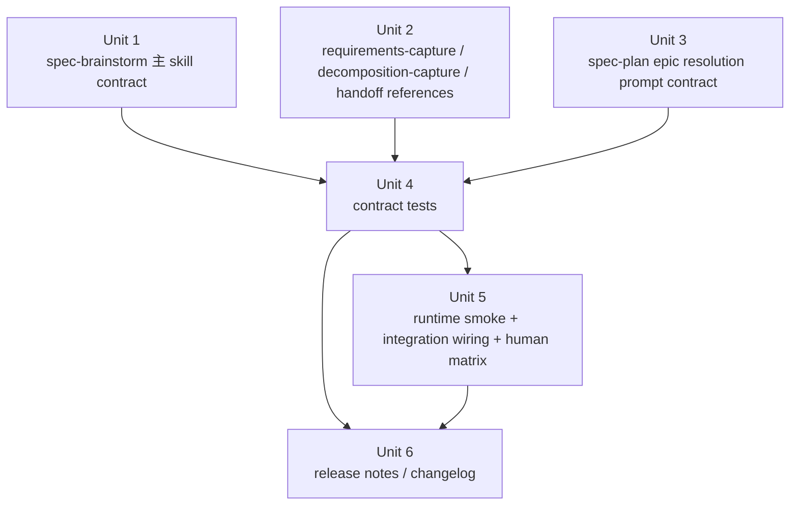

# feat: implement spec-brainstorm capability upgrade v1.3

## Completion Note

> 状态回写：`2026-04-17`
>
> 本计划对应的 `spec-brainstorm` 能力升级已完成实施与验证。计划正文保留为执行前的决策工件，不按事后结果重写；实际交付范围以下列事实为准：
>
> - `spec-brainstorm` 已补齐 `Current Work Pulse`、`Scope Decomposition`、`Preflight Self-Check`、`User Review Gate`、`Terminal State Lock`
> - `spec-plan` 已补入 `epic` frontmatter decomposition consumer prompt contract
> - source / mirror / unit / smoke / integration / release-facing docs 已同 wave 收口
> - 执行期额外修复了两项收口问题：发布文档中的绝对路径链接、`spec-plan` 合同测试里混入的 execution-readiness 越界断言
>
> 已执行验证：
>
> - `npx jest tests/unit/spec-brainstorm-contracts.test.js tests/unit/spec-plan-contracts.test.js --runInBand`
> - `bash tests/smoke/cli.sh`
> - `bash tests/integration/e2e.sh`

## Overview

把 `spec-brainstorm` 从“已追平 `ce-brainstorm` 基线、但仍缺少流程纪律增强”的状态，升级到 `v1.3` 方案定义的能力面：补齐 `Scope Decomposition`、`Requirements 分节逐确认`、`User Review Gate`、`Terminal State Lock`、`Context Pulse`、`Preflight Self-Check` 等 contract，同时把这些变化同步到 `spec-plan` 的 epic metadata 消费、prompt mirror、unit/integration 测试和发布说明。

本次工作是一次 **workflow contract 升级**，不是新功能脚手架开发。主要改动面在 `skills/`、`docs/10-prompt/skills/`、`tests/` 和版本文档，目标是让 `spec-brainstorm` 的新行为对 source、runtime mirror、测试和下游 handoff 保持同一口径。

## Problem Frame

当前 `spec-brainstorm` 的真实问题不再是“明显落后于正式同步基线”，而是：

- 相对 `ce-brainstorm` 已基本追平，并在 supplemental context / research digest / dual-host 适配上更强
- 相对 `superpowers/brainstorming` 仍缺少流程纪律层优势，尤其是：
  - 大型需求早分解
  - 写作过程中的中途确认
  - recent commits / current work pulse
  - deterministic preflight self-check
  - terminal state 的安全锁

如果这些 contract 不落到 source skill、reference、downstream plan consumer 和默认测试入口，当前 `v1.3` 方案文档依然只是“分析正确”，不是“系统已实现”。这会导致：

- brainstorm 文案和实际执行流程继续脱节
- `spec-plan` 仍然无法消费 decomposition 带来的 epic metadata
- 用户可见 mirror 漂移
- 新测试即使存在，也可能没有接到 `npm run test:integration`

## Requirements Trace

- R1. `spec-brainstorm` 必须落地 `P0.1 Scope Decomposition`，并把 epic metadata contract 收口为 requirements frontmatter `epic` + `spec-plan` 单向消费。
- R2. `spec-brainstorm` 必须落地 `P0.2 Requirements 分节逐确认`，保留 `Lightweight fast path`。
- R3. `spec-brainstorm` 必须落地 `P0.3 User Review Gate`，并把 `skip future gates` 明确限制在当前运行期内存。
- R4. `spec-brainstorm` 必须落地 `P0.4 Terminal State Lock`，包含 denylist、双 allowlist、逃生口和 `Deliberate Divergence`。
- R5. `spec-brainstorm` 必须落地 `P1.1 HARD-GATE`、`P1.2 Design-for-isolation`、`P1.3 Targeted Improvements Scope Rule`、`P1.4 Process Flow`。
- R6. `spec-brainstorm` 必须落地 `P1.5 Context Pulse` 和 `P1.6 Preflight Self-Check`，并保持它们是低副作用 contract，不升级成 code review 或第二套 review 流程。
- R7. `spec-plan` 必须消费 decomposition 的 `epic` frontmatter，并在 epic doc 缺失时按 warning + continue 降级，不能阻断 planning。
- R8. source skill、prompt mirror、contract tests、integration runner 必须同 wave 同步，避免 runtime-visible drift。
- R9. 本次 workflow 能力升级必须同步更新 `CHANGELOG.md` 和 `docs/08-版本更新/README.md`。

## Scope Boundaries

- 不包含 `P2.1 Visual Companion` 的实际实现，也不新增 `skills/spec-brainstorm-visual/`
- 不新增 public command，不改变 Claude/Codex 双宿主 entrypoint 规则
- 不修改 `src/cli/contracts/dual-host-governance/skills-governance.json`，因为本轮没有新增 skill 或改变 host delivery
- 不把 epic metadata 消费下放到 `spec-work`
- 不重写 `document-review`；`Preflight Self-Check` 只是 brainstorm 本地预检

### Deferred to Separate Tasks

- `P2.1 Visual Companion` 独立立项：后续如启动，需要单独覆盖 server lifecycle、session dir contract、events protocol、host startup matrix、cleanup / timeout

## Context & Research

### Relevant Code and Patterns

- `skills/spec-brainstorm/SKILL.md`
  当前 `spec-brainstorm` 主 workflow contract，现有能力已包含 task-domain classify、supplemental context scan、document-review handoff，是本轮新增 phase / guardrail 的主落点。

- `skills/spec-brainstorm/references/requirements-capture.md`
  当前 requirements doc contract 已定义基础模板，但尚未包含分节确认、design-for-isolation、targeted improvements、preflight self-check 相关规则。

- `skills/spec-brainstorm/references/handoff.md`
  当前已支持 `/spec:plan`、`/spec:work`、`Share to Proof` 等 handoff，但尚未内建三层 `Terminal State Lock` 和 unlisted skill 分类规则。

- `skills/spec-plan/SKILL.md`
  当前 planning workflow 已支持 origin document carry-forward，但没有 `epic` frontmatter -> decomposition doc 的补充消费逻辑。

- `tests/unit/spec-brainstorm-contracts.test.js`
  现有 contract test 已锁定 `spec-brainstorm` 的 source naming、supplemental context route 和 runtime transform，是本轮新增 contract 断言的直接落点。

- `tests/unit/spec-plan-contracts.test.js`
  当前只锁定 Stage-0 / deepening / visual communication 等通用 planning contract，需要新增 epic metadata consumption 守卫。

- `tests/integration/e2e.sh`
  当前 `npm run test:integration` 只执行这个入口，因此新的 `spec-brainstorm` 集成脚本必须在这里被独立调用，否则新增脚本不会进默认测试链。

- `docs/10-prompt/skills/spec-brainstorm/`、`docs/10-prompt/skills/spec-plan/`
  这些是 source skill 的 human-readable mirror；Stage-0 相关计划已经明确要求 runtime-visible skill 变化必须同 wave 同步 mirror，不能事后补写。

- `docs/08-版本更新/README.md`
  2026-04-15 已有 `spec-brainstorm` 上一轮升级记录，本轮应延续同样的发布说明粒度。

### Institutional Learnings

- `docs/plans/2026-04-14-009-feat-spec-brainstorm-supplemental-context-plan.md`
  已经证明 `spec-brainstorm` 类工作最稳的落点是“source skill / mirror / tests / release notes 一次收口”，而不是先改 CLI 控制面。

- `docs/plans/2026-04-17-stage0-workspace-implementation-sequence.md`
  明确要求“任何改变 runtime-visible 行为的 wave，都必须在同一 wave 内完成 source skill、mirror 和 tests 同步”，这条经验应直接套用到本次 workflow contract 升级。

- `docs/plans/2026-04-17-stage0-index-entry-upgrade-plan.md`
  进一步强化了“source skill / mirror / tests 与实际 runtime 行为一致”的完成标准，说明本次不应把 mirror sync 当作最后的文档收尾工作。

### Stage-0 Context Notes

- Stage-0 Level 1 machine context 中缺少 `docs/contexts/spec-first/minimal-context/plan.json`，本次按 Level 2 固定集合降级继续，不阻断 planning。
- `docs/contexts/spec-first/code-facts/test-map.md` 显示 `src/cli/plugin.js` 本身测试直连较薄，说明本轮应优先用 workflow asset contract tests + integration wiring 守住行为边界，而不是扩大到 CLI 运行时重构。

### External References

- 本次未做外部在线研究。
- 原因：本轮问题是 repo-owned workflow contract 落地，现有 source 文档、技能文件、测试入口和 Stage-0 产物已经足以支撑 planning。

## Key Technical Decisions

- **以 `skills/spec-brainstorm/` 为唯一 source of truth，mirror 同 wave 同步，不引入第二真源。**
  - 理由：当前仓库的 skill 治理已经明确 `skills/` 是真源，`docs/10-prompt/skills/` 是镜像。

- **把 `spec-brainstorm` 改动拆成“主 skill contract”与“reference contract”两层，而不是把所有新规则塞进 `SKILL.md`。**
  - 理由：`requirements-capture.md` 和 `handoff.md` 已经承担 late-sequence contract；复用这个分层能降低主 skill 的 token 负担与维护成本。

- **`spec-plan` 只消费 `epic` frontmatter，不从 Key Decisions 正文读结构化信息。**
  - 理由：Key Decisions 是自由文本区，不适合作为下游机械消费的真源。

- **epic doc 缺失时使用 warning + continue，而不是 hard block。**
  - 理由：避免把 decomposition 变成 planning 的单点故障，符合 origin 文档的 consumer-side 降级要求。

- **`Context Pulse` 仅做轻量工作脉冲，不做完整 code review。**
  - 理由：吸收 source 的 recent-commits 优势，但不把 brainstorm 扩张成 repo 审查流程。

- **`Preflight Self-Check` 只作为 `document-review` 前的低成本预检。**
  - 理由：它的职责是去掉显而易见的占位符、矛盾和歧义，不替代 multi-persona document-review。

- **本轮不修改 governance JSON/README。**
  - 理由：没有新增 skill、没有改变 host delivery，也没有新的 public entrypoint；治理文件会被当前实现间接消费，但不需要改 contract 本身。

- **集成测试必须接入 `tests/integration/e2e.sh`，不得新增孤立脚本后靠人工单跑。**
  - 理由：`package.json` 已锁定 `npm run test:integration -> bash tests/integration/e2e.sh`。

- **本轮不伪造“对话式 prompt 行为已被 shell 集成测试完整证明”的确定性。**
  - 理由：当前仓库没有专门驱动 `spec-brainstorm` 交互回合的 deterministic workflow harness；自动化验证应停在 runtime assets、prompt contract 与默认入口接线这一层。

## Validation Boundaries

### Machine-verifiable

- `skills/spec-brainstorm/` source 与 `docs/10-prompt/skills/spec-brainstorm/` mirror 同步
- Claude/Codex runtime transform 后的新 contract 仍存在
- 新增 references 能被安装到 Claude/Codex runtime，且由默认 smoke 入口显式断言
- `tests/integration/e2e.sh` 已接入新增脚本，`npm run test:integration` 默认覆盖
- `CHANGELOG.md` 与 `docs/08-版本更新/README.md` 已同步更新

### Prompt-contract verifiable

- `spec-plan` 明确记录 epic frontmatter resolution 规则
- `Terminal State Lock` 三层模型、逃生口与 `Deliberate Divergence`
- `Context Pulse` 的触发矩阵与动作边界
- `Preflight Self-Check` 的四项固定检查
- `skip future gates` 的运行期内存边界

### Human-verifiable

- decomposition 触发质量是否合理，而不是过度打断
- 分节确认流程是否顺畅，不造成 `Lightweight` 误增重
- review gate 是否真的能挡住未确认就进入 planning
- `Current Work Pulse` 是否有信息增益而不是噪音
- `Share to Proof` / direct-to-work / planning handoff 是否被 `Terminal State Lock` 正确分类

自动化验证只应对前两层负责。第三层必须通过人工剧本验证或后续专门 harness 立项承接，不能在本计划中伪装成 shell integration 已证明。

## Open Questions

### Resolved During Planning

- **Q1. 本次 planning 是否必须从 `docs/brainstorms/*-requirements.md` 起步？**
  - 结论：不必须。当前用户明确给出 origin 文档路径，且该方案文档已经具备足够清晰的 requirements / scope / rollout 信息，可直接作为 planning origin。

- **Q2. 本轮是否要把 `Visual Companion` 一起实现掉？**
  - 结论：不实现。仅保留 deferred-not-absorbed 的边界声明。

- **Q3. 本轮是否需要修改 `skills/spec-work/SKILL.md` 或新增 `tests/unit/spec-work-contracts.test.js` epic consumer 覆盖？**
  - 结论：不需要。当前边界保持 `spec-work` 不消费 epic metadata。

- **Q4. 本轮是否需要补外部研究？**
  - 结论：不需要。问题完全位于仓内 workflow contract 与测试接线面。

### Deferred to Implementation

- **新增 contract test 的断言粒度锁到“精确段落标题”还是“关键 contract 语义短语”？**
  - 原因：这是实现期测试稳健性取舍问题，需在避免 brittle string matching 与保持 contract 可验证之间权衡。

## High-Level Technical Design

> *此图说明本次 workflow contract 升级的实施依赖关系，是评审用方向性设计，不是实现规范。实现时允许调整小的文件分组，但必须保留同样的依赖顺序与边界。*

## Implementation Units

- [x] **Unit 1: 升级 `spec-brainstorm` 主 skill contract**

**Goal:** 把 `v1.3` 中属于主 workflow 的新增 phase、gate 和 flow control 直接落到 `skills/spec-brainstorm/SKILL.md`，并同步 mirror。

**Requirements:** R1, R3, R4, R5, R6, R8

**Dependencies:** None

**Files:**
- Modify: `skills/spec-brainstorm/SKILL.md`
- Modify: `docs/10-prompt/skills/spec-brainstorm/SKILL.md`
- Test: `tests/unit/spec-brainstorm-contracts.test.js`

**Approach:**
- 在主 skill 中引入并编排这些 contract：
  - `P0.1 Scope Decomposition` 的 phase 插入点、交互说明，以及命中分解路径时对 `references/decomposition-capture.md` 的调用入口
  - `P0.3 User Review Gate`
  - `P0.4 Terminal State Lock` 与 `Deliberate Divergence`
  - `P1.1 HARD-GATE`
  - `P1.4 Process Flow`
  - `P1.5 Context Pulse`
  - `P1.6 Preflight Self-Check` 的 phase 编排入口
- 保持当前 supplemental context、task domain classify、approaches phase 等既有优势不回退
- mirror 与 source 同步修改，不接受“source 先改、mirror 后补”

**Execution note:** 先更新或并行更新 contract tests 中对应断言，再改主 skill 文案，避免改完后遗漏 runtime-visible contract。

**Patterns to follow:**
- `docs/plans/2026-04-14-009-feat-spec-brainstorm-supplemental-context-plan.md`
- `skills/spec-brainstorm/SKILL.md`
- `docs/plans/2026-04-17-stage0-workspace-implementation-sequence.md`

**Test scenarios:**
- Happy path: source skill 出现新的 phase 标题、hard gate、terminal state lock、context pulse、preflight self-check 关键 contract 语义
- Edge case: Claude/Codex runtime transform 后，source naming 与 runtime naming 仍保持现有约定，不因新增文案漂移
- Error path: 不得误删现有 supplemental context routing、document-review handoff、Lightweight fast path 等既有合同
- Integration: mirror 与 source 的关键段落保持一致，避免用户阅读的 `docs/10-prompt` 版本和真实 source 漂移

**Verification:**
- `spec-brainstorm` source 与 mirror 都包含新 contract，且现有 host transform contract tests 仍能成立

- [x] **Unit 2: 升级 brainstorm references contract**

**Goal:** 把分节确认、decomposition 模板、design-for-isolation、targeted improvements、epic metadata、unlisted skill 分类等落到 reference 层，并同步 mirror。

**Requirements:** R1, R2, R3, R4, R5, R6, R8

**Dependencies:** Unit 1

**Files:**
- Modify: `skills/spec-brainstorm/references/requirements-capture.md`
- Create: `skills/spec-brainstorm/references/decomposition-capture.md`
- Modify: `skills/spec-brainstorm/references/handoff.md`
- Modify: `docs/10-prompt/skills/spec-brainstorm/references/requirements-capture.md`
- Create: `docs/10-prompt/skills/spec-brainstorm/references/decomposition-capture.md`
- Modify: `docs/10-prompt/skills/spec-brainstorm/references/handoff.md`
- Test: `tests/unit/spec-brainstorm-contracts.test.js`

**Approach:**
- 在 `requirements-capture.md` 中加入：
  - `Standard / Deep` 分节确认 contract
  - design-for-isolation 边界检查
  - targeted improvements 纳入规则
  - `Preflight Self-Check` 的完成性检查钩子
  - sub-project requirements frontmatter `epic` 的 requirements-side contract
- 新增 `decomposition-capture.md`，收口：
  - `docs/brainstorms/YYYY-MM-DD-<epic>-decomposition.md` 模板
  - sub-project 表格、build order、cross-cutting concerns、next steps 的固定结构
  - epic slug 命名与后续 requirements `epic` frontmatter 的对齐规则
- 在 `handoff.md` 中加入：
  - `Terminal State Lock` 的三层模型
  - unlisted skill 请求的分类处理
  - direct-to-work gate 与 Proof 出口的边界保持
- 主 skill 只负责在 Phase 0.3a / Phase 3 / Phase 4 编排何时加载这些 references；具体文档模板不散落回 `SKILL.md`
- 不把实现细节、CLI 命令步骤或额外宿主治理塞进 references

**Patterns to follow:**
- `skills/spec-brainstorm/references/requirements-capture.md`
- `skills/spec-brainstorm/references/decomposition-capture.md`（new）
- `skills/spec-brainstorm/references/handoff.md`
- `docs/01-需求分析/brainstorm优化/spec-brainstorm-能力升级方案.md`

**Test scenarios:**
- Happy path: `requirements-capture.md` 明确 Standard/Deep 分节确认与 preflight 检查，`decomposition-capture.md` 明确 epic decomposition 模板，`handoff.md` 明确 allowlist / denylist / escape hatch
- Edge case: `Lightweight` 路径仍允许一次性生成且 review gate 可自动略过
- Error path: `skip future gates` 不得扩张到跨会话或覆盖 Terminal State Lock escape hatch
- Integration: source references 与 mirror references 的 contract 同步，`spec-brainstorm` 主 skill 对 decomposition / requirements / handoff 三类 reference 的调用边界明确

**Verification:**
- `tests/unit/spec-brainstorm-contracts.test.js` 能同时验证 source skill 与三类 references 的新增 contract

- [x] **Unit 3: 补齐 `spec-plan` 的 epic resolution prompt contract**

**Goal:** 让 planning workflow 以 prompt-contract 的方式稳定表达 decomposition 消费规则，但不在本轮伪装成已有独立 runtime resolver。

**Requirements:** R1, R7, R8

**Dependencies:** Unit 2

**Files:**
- Modify: `skills/spec-plan/SKILL.md`
- Modify: `docs/10-prompt/skills/spec-plan/SKILL.md`
- Test: `tests/unit/spec-plan-contracts.test.js`

**Approach:**
- 在 `spec-plan` Phase 0 的 source-document 流程中补入 epic resolution 语义：
  - 读取 requirements frontmatter `epic`
  - 推导并加载 `docs/brainstorms/*-<epic>-decomposition.md`
  - 命中多个时选择最新 date
  - 未命中时 warning + continue
- 明确这只是 `spec-plan` 的附加 origin context prompt contract，不改变 `spec-work` 的输入边界
- 本轮**不**新增独立 planner runtime helper、frontmatter parser helper 或 glob resolver；若后续需要把这套语义沉淀成可执行 helper，应单独立项
- 若 `spec-plan` 文字说明需要引用 epic doc，统一使用 repo-relative path

**Execution note:** 先锁定 unit test 的 prompt-contract 语义，再插入 skill 文案，避免 planning source doc carry-forward 逻辑被误改。

**Patterns to follow:**
- `skills/spec-plan/SKILL.md`
- `tests/unit/spec-plan-contracts.test.js`
- `docs/01-需求分析/brainstorm优化/spec-brainstorm-能力升级方案.md`

**Test scenarios:**
- Happy path: prompt contract 明确要求 requirements frontmatter 存在 `epic` 时，planning 会把 decomposition doc 作为补充 context
- Edge case: prompt contract 明确要求多命中取最新 date 版本
- Error path: prompt contract 明确要求 zero-match 只告警不阻断 planning
- Integration: `spec-plan` 新 contract 不要求 `spec-work` 同步消费 epic metadata，也不声称已有独立 runtime resolver

**Verification:**
- `tests/unit/spec-plan-contracts.test.js` 新增 epic resolution prompt-contract 断言，并保持现有 Stage-0 / deepening / handoff contract 通过

- [x] **Unit 4: 扩展 unit contract 测试并锁定边界**

**Goal:** 用最小但明确的 contract tests 锁住本轮新增能力，避免后续 prompt 漂移。

**Requirements:** R1, R2, R3, R4, R5, R6, R7, R8

**Dependencies:** Unit 1, Unit 2, Unit 3

**Files:**
- Modify: `tests/unit/spec-brainstorm-contracts.test.js`
- Modify: `tests/unit/spec-plan-contracts.test.js`

**Approach:**
- `spec-brainstorm` unit tests 重点锁定：
  - decomposition / user review gate / terminal state lock / hard gate / context pulse / preflight self-check
  - source + runtime transform + references 的一致性
- `spec-plan` unit tests 重点锁定：
  - epic resolution prompt contract
  - warning + continue 降级语义
  - 不要求 `spec-work` 消费 epic metadata 的边界说明
  - 不伪装成真实 frontmatter/glob runtime helper 已存在
- 避免把测试做成完整 snapshot；优先锁定稳定的 contract 语义短语和关键结构

**Patterns to follow:**
- `tests/unit/spec-brainstorm-contracts.test.js`
- `tests/unit/spec-plan-contracts.test.js`
- `tests/unit/spec-work-contracts.test.js`

**Test scenarios:**
- Happy path: 新增 contract 在 source assets 中存在，runtime transform 后仍保留正确宿主语义
- Edge case: mirror 同步后，source / mirror 的关键 contract 语义一致
- Error path: `spec-plan` epic consumer 的 zero-match 路径明确是 warning + continue，且测试断言的是 prompt contract 而非虚构 helper 行为
- Integration: `spec-brainstorm` contract tests 不应误要求新增 public command、governance entry、`spec-work` epic consumer 或 shell 可验证的对话流程

**Verification:**
- `npm run test:unit` 中的 Jest 部分可覆盖本轮新增 contract，不新增 brittle snapshot 负担

- [x] **Unit 5: 默认入口接线、runtime smoke 与人工验证矩阵分层**

**Goal:** 确保所有**可确定性验证**的 `spec-brainstorm` 新 contract 进入默认测试入口；其中 runtime asset 安装落到 smoke 层，`e2e.sh` 只负责 integration 接线与失败传播，同时把真正依赖对话质量的部分显式归入人工验证矩阵，不做伪 integration。

**Requirements:** R8

**Dependencies:** Unit 4

**Files:**
- Modify: `tests/smoke/cli.sh`
- Create: `tests/integration/spec-brainstorm-flow.sh`
- Modify: `tests/integration/e2e.sh`

**Approach:**
- 在 `tests/smoke/cli.sh` 中补 runtime asset 断言：
  - Claude runtime 存在 `spec-brainstorm/references/decomposition-capture.md`
  - Codex runtime 存在 `spec-brainstorm/references/decomposition-capture.md`
  - 必要时同步补 `requirements-capture.md` / `handoff.md` 新 contract 关键语义，避免只验证“文件存在”
- `tests/integration/spec-brainstorm-flow.sh` 只覆盖**确定性**检查：
  - 默认 integration 入口确实调到该脚本
  - 脚本失败会向上冒泡到 `npm run test:integration`
  - 若脚本内包含 asset / prompt contract smoke，它只断言 deterministic surfaces，不断言对话质量
- decomposition 触发质量、分节确认顺滑度、review gate 人机交互效果、`Current Work Pulse` 信息增益、`Share to Proof` 分类体验等，明确落入人工验证矩阵
- 在 `e2e.sh` 中以独立 `bash tests/integration/spec-brainstorm-flow.sh` 调用把该脚本接入默认入口，避免子脚本的 `set -euo pipefail`、`trap`、变量和 `cd` 状态污染父脚本
- 明确拒绝 `git log`、单纯脚本存在性或 `grep` 提示词文案冒充“流程已验证”的伪验收
- 若未来需要自动证明对话式行为，先单独立项建设 workflow harness，再升级本单元验收口径

**Execution note:** 让集成脚本的失败可以直接向上传播到 `npm run test:integration`，不要新增需要人工单跑的旁路。

**Patterns to follow:**
- `tests/smoke/cli.sh`
- `tests/integration/e2e.sh`
- `package.json`
- `docs/01-需求分析/brainstorm优化/spec-brainstorm-能力升级方案.md`

**Test scenarios:**
- Happy path: `npm run test:smoke` 断言新的 brainstorm reference 已安装到 Claude/Codex runtime，且 `npm run test:integration` 间接执行新脚本完成 wiring checks
- Edge case: 子脚本即使包含独立 `trap`/cleanup，也不会覆盖 `e2e.sh` 现有的 EXIT trap 或污染父 shell 变量
- Error path: 若 runtime 中缺少 `decomposition-capture.md`，或 `e2e.sh` 未调用新脚本 / 调用失败未向上冒泡，默认测试入口必须显式失败
- Integration: smoke 负责 runtime asset 安装，`e2e.sh` 负责默认 integration 主链；两者共同运行时不影响既有五步闭环与 `spec-graph-bootstrap` 主链；交互式行为继续由人工矩阵承接

**Verification:**
- 不手工单独执行 `spec-brainstorm-flow.sh` 的前提下，`npm run test:smoke` 能覆盖 runtime references 安装，`npm run test:integration` 能覆盖该脚本的确定性检查并正确失败/通过；人工矩阵另行执行

- [x] **Unit 6: 更新 release-facing 文档与变更记录**

**Goal:** 把本轮 workflow 能力升级写进正式发布面，满足仓库治理要求。

**Requirements:** R9

**Dependencies:** Unit 4, Unit 5

**Files:**
- Modify: `CHANGELOG.md`
- Modify: `docs/08-版本更新/README.md`

**Approach:**
- 在 `CHANGELOG.md` 中按仓库格式追加本轮 `spec-brainstorm` 能力升级记录
- 在 `docs/08-版本更新/README.md` 中新增一条面向用户的升级说明，覆盖：
  - decomposition / review gate / terminal state lock / context pulse / preflight 等新能力
  - `Visual Companion` 仍未落地，只是 deferred-not-absorbed
- 若实现期发现实际落地范围小于方案文档，发布说明必须写真实已交付内容，不复制方案稿

**Patterns to follow:**
- `docs/08-版本更新/README.md` 中 2026-04-15 的 `feat(spec-brainstorm)` 条目
- `AGENTS.md` 中关于 CHANGELOG 的治理要求

**Test scenarios:**
- Test expectation: none -- 该单元只同步 `CHANGELOG.md` 与 `docs/08-版本更新/README.md`，不引入新的可执行行为；通过文档一致性与治理检查验收

**Verification:**
- 代码与 workflow asset 改动存在时，`CHANGELOG.md` 和 `docs/08-版本更新/README.md` 同步完成更新

## System-Wide Impact

- **Interaction graph:** `skills/spec-brainstorm/SKILL.md` -> `references/requirements-capture.md` / `references/decomposition-capture.md` / `references/handoff.md` -> `skills/spec-plan/SKILL.md` -> `tests/unit/*contracts.test.js` -> `tests/smoke/cli.sh` + `tests/integration/e2e.sh`
- **Error propagation:** 如果 `spec-plan` 的 epic consumer 写错，风险应退化为 warning + continue，而不是把 planning 卡死
- **State lifecycle risks:** `skip future gates` 必须继续只存在于当前运行期内存；`Context Pulse` 不得引入持久化 state；`Terminal State Lock` escape hatch 不得被 session flag 绕过
- **API surface parity:** Claude runtime 的 workflow source naming、Codex runtime 的 `name: spec-brainstorm`、`Share to Proof`、`/spec:plan` 与 direct-to-work gate 都要保持双宿主语义一致
- **Integration coverage:** 新增 integration 只算完成了一半；接入 `e2e.sh` 才算默认测试入口覆盖
- **Unchanged invariants:** 不新增 public command；不新增 `spec-brainstorm-visual`；不改 dual-host governance JSON；不让 `spec-work` 开始消费 epic metadata

## Risks & Dependencies

| Risk | Mitigation |
|------|------------|
| 主 skill、references、mirror 分批修改导致中间态 drift | 按 Unit 1-3 分层，但每个 unit 内 source 与 mirror 同步完成 |
| contract tests 写得过于脆弱，后续正常措辞优化也会频繁失败 | 断言 contract 语义短语和结构，不做整文件 snapshot |
| `spec-plan` epic consumer 过度扩张到 `spec-work` | 在 Unit 3 和 Unit 4 中显式锁定 consumer 边界 |
| 新增 `decomposition-capture.md` 未进入 Claude/Codex runtime，或 integration 新脚本未接入默认入口 / 以 `source` 方式接入后污染父脚本状态 | Unit 5 同时修改 `tests/smoke/cli.sh` 与 `tests/integration/e2e.sh`：smoke 负责 runtime asset 安装断言，integration 强制用独立 `bash` 调用并以默认入口验收 |
| 发布说明提前声称未落地的能力 | Unit 6 要求以实际交付为准，尤其明确 `Visual Companion` 仍 deferred |

## Documentation / Operational Notes

- 本轮不需要修改 `docs/contracts/dual-host-governance/README.md`，除非实现中意外引入新的 host delivery 或 public entrypoint 行为
- 本轮需要显式补 `tests/smoke/cli.sh`，因为新增 `decomposition-capture.md` 属于 runtime-generated brainstorm reference，现有 unit/integration 不足以证明其已安装到 Claude/Codex runtime
- 当前运行环境下若无法执行交互式 `document-review`，计划写入后应返回“仍需 interactive document-review before execution handoff”的明确提示

## Execution Readiness Checklist

### Unit 1

- `skills/spec-brainstorm/SKILL.md` 必须新增这些稳定入口：`0.1a Current Work Pulse`、`0.3a Scope Decomposition`、`3.4 Preflight Self-Check`、`3.6 User Review Gate`
- `skills/spec-brainstorm/SKILL.md` 必须把 `P0.4 Terminal State Lock` 与 `Deliberate Divergence` 写进主流程，而不是只留在 reference
- `docs/10-prompt/skills/spec-brainstorm/SKILL.md` 必须与 source 同步，不允许 source 已升级而 mirror 仍停留旧流程
- 不得回退现有 supplemental context routing、non-software route、approaches phase、document-review handoff

### Unit 2

- `skills/spec-brainstorm/references/requirements-capture.md` 必须补齐：分节确认、design-for-isolation、targeted improvements、preflight 完成性检查、requirements frontmatter `epic`
- `skills/spec-brainstorm/references/decomposition-capture.md` 必须新建，并承载 epic decomposition 模板本体
- `skills/spec-brainstorm/references/handoff.md` 必须补齐：Terminal State Lock 三层模型、unlisted skill 分类、escape hatch 边界
- `docs/10-prompt/skills/spec-brainstorm/references/` 下三个 mirror 文件必须同 wave 同步
- 不得把 `skip future gates` 扩张成跨会话状态，不得让它覆盖 Terminal State Lock escape hatch

### Unit 3

- `skills/spec-plan/SKILL.md` 必须明确：读取 requirements frontmatter `epic`、glob `docs/brainstorms/*-<epic>-decomposition.md`、多命中取最新、零命中 warning + continue
- `docs/10-prompt/skills/spec-plan/SKILL.md` 必须同步该 prompt contract
- 不得声称已有 runtime helper、frontmatter parser helper 或 glob resolver
- 不得把 epic consumer 边界扩张到 `spec-work`

### Unit 4

- `tests/unit/spec-brainstorm-contracts.test.js` 需要新增对主 skill、`requirements-capture.md`、`decomposition-capture.md`、`handoff.md` 的 contract 断言
- `tests/unit/spec-plan-contracts.test.js` 需要新增 epic resolution prompt-contract 断言，并锁住 warning + continue 语义
- 断言优先使用稳定 contract 语义短语，不做整文件 snapshot
- 不得新增要求 `spec-work` 消费 epic metadata 的测试

### Unit 5

- `tests/smoke/cli.sh` 必须新增 Claude/Codex runtime 对 `spec-brainstorm/references/decomposition-capture.md` 的安装断言
- `tests/integration/spec-brainstorm-flow.sh` 只验证 deterministic surfaces，不证明完整对话行为
- `tests/integration/e2e.sh` 必须以独立 `bash tests/integration/spec-brainstorm-flow.sh` 方式接线，不得 `source`
- 人工验证矩阵必须单列：decomposition 触发质量、分节确认顺滑度、review gate 体验、Current Work Pulse 信息增益、Proof 分类体验

### Unit 6

- `CHANGELOG.md` 必须按仓库格式补一条 `spec-brainstorm` 能力升级记录
- `docs/08-版本更新/README.md` 必须明确写出已交付能力与未交付的 `Visual Companion`
- 发布文案必须反映真实交付，不得直接复制方案稿的全部目标

## Sources & References

- **Origin document:** `docs/01-需求分析/brainstorm优化/spec-brainstorm-能力升级方案.md`
- Related code:
  - `skills/spec-brainstorm/SKILL.md`
  - `skills/spec-brainstorm/references/requirements-capture.md`
  - `skills/spec-brainstorm/references/handoff.md`
  - `skills/spec-plan/SKILL.md`
  - `tests/unit/spec-brainstorm-contracts.test.js`
  - `tests/unit/spec-plan-contracts.test.js`
  - `tests/integration/e2e.sh`
- Related plans:
  - `docs/plans/2026-04-14-009-feat-spec-brainstorm-supplemental-context-plan.md`
  - `docs/plans/2026-04-17-stage0-workspace-implementation-sequence.md`
  - `docs/plans/2026-04-17-stage0-index-entry-upgrade-plan.md`
- Stage-0 context:
  - `docs/contexts/spec-first/00-summary.md`
  - `docs/contexts/spec-first/architecture/module-map.md`
  - `docs/contexts/spec-first/code-facts/public-entrypoints.md`
  - `docs/contexts/spec-first/code-facts/test-map.md`
