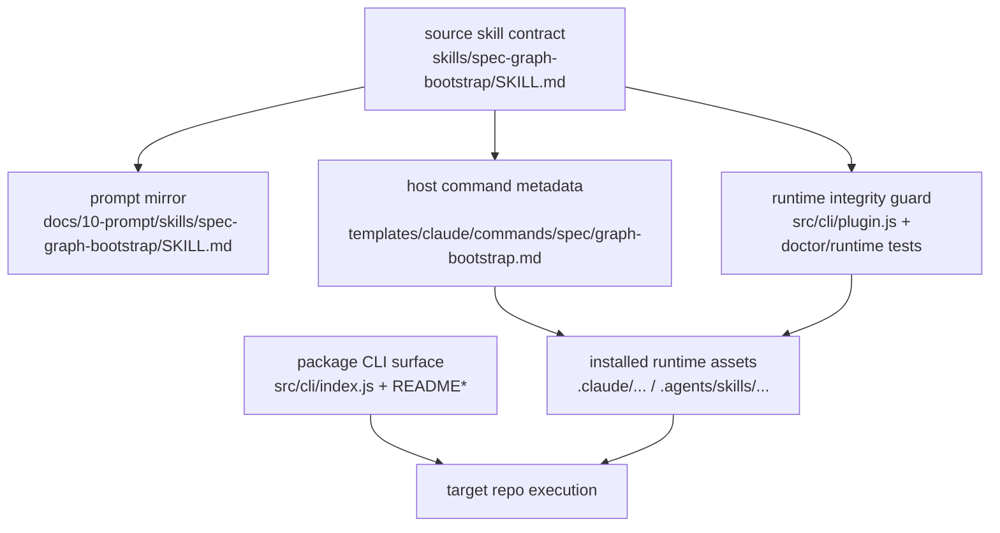

# fix: Clarify graph-bootstrap runtime boundary contract

## Overview

修复 `spec-graph-bootstrap` 当前在线误导信号：让 LLM 能稳定区分 spec-first 源码仓库内部真源、宿主运行时资产、目标仓库生成产物和 package CLI surface，避免在外部 workspace 中把 source repo 内部路径误读成 target repo 的前提条件。

本计划不重做 bootstrap 编译器，也不把 workflow 改成强编排状态机；它聚焦于修正错误决策输入，并补上会在真实入口阻止同类回归的验证面。

## Problem Frame

当前仓库代码已经具备可运行的 bootstrap 编译链与相关测试，但真实用户入口仍存在边界表达失真：

- `skills/spec-graph-bootstrap/SKILL.md` 直接陈述 `docs/contracts/spec-graph-bootstrap/` 和 `src/bootstrap-compiler/`，却没有显式标注这些是 spec-first 源码仓库内部真源。
- `README.md` 仍把 `graph-bootstrap` 描述为 `Code-hard gate`，而 package CLI 本身并没有对外暴露 `graph-bootstrap` 子命令。
- 现有 contract / compiler / e2e 测试主要证明“编译器主链能跑通”，没有证明“安装后的 runtime workflow 在外部 repo 中不会误导模型”。

这使得 LLM 在外部仓库执行 `/spec:graph-bootstrap` 或 `$spec-graph-bootstrap` 时，很容易把 source repo truth、runtime assets、target repo artifacts 和 package CLI surface 混成一个层面，进而得出“当前仓库没有真正 compiler / contract，只能手工生成产物”的错误结论。

## Requirements Trace

- R1. `spec-graph-bootstrap` 的 source contract 必须显式区分四类 surface：source repo internals、installed runtime assets、target repo generated artifacts、package CLI surfaces。
- R2. 用户可见文案不得把宿主 workflow 入口误表述为 package CLI 子命令，不得继续制造“Code-hard gate”与真实 enforce 面不匹配的心智误导。
- R3. runtime integrity / contract tests 必须从“检查字符串存在”升级到“检查边界语义是否被正确标注”，防止把歧义锚点固化成回归标准。
- R4. 验证面必须覆盖外部 repo 安装后的真实入口行为，证明同类误读不会再次在线出现。
- R5. 现有 bootstrap compiler 主链、Stage-0 产物 contract 和 host-specific runtime transform 不被这次修复破坏。

## Scope Boundaries

- 不重写 `src/bootstrap-compiler/` 的事实抽取、routing 或 workspace fan-out 主链。
- 不新增中心化 gate 系统，不把 workflow 改造成自动执行树。
- 不在本次范围内引入新的 `spec-first graph-bootstrap` 包级执行子命令，除非实现过程中发现不新增该 surface 无法消除核心误导。
- 不顺手扩张到 `spec-plan`、`spec-work`、`spec-code-review` 之外的 workflow contract 重写。

### Deferred to Separate Tasks

- package / bundled plugin 版本同步治理：作为单独发布治理问题处理，不绑定到本次边界修复。
- 更通用的 runtime capability preflight helper：保留为后续增量能力，而不是当前修复的必要前提。

## Verification

本计划完成的判定标准：

- `skills/spec-graph-bootstrap/SKILL.md` 与 `docs/10-prompt/skills/spec-graph-bootstrap/SKILL.md` 明确给出四层 surface map，并写明“不要在 target repo 中查找 source repo 内部路径来判断 workflow 能力”。
- `README.md`、`README.zh-CN.md` 和 CLI help 对 package commands 与 host workflow entrypoints 的表述一致，不再让用户或 LLM把 `/spec:graph-bootstrap` 误读为 `spec-first graph-bootstrap`。
- contract / runtime integrity tests 能在 source contract 缺失边界标签或把内部路径写成 target repo 前提时失败。
- 至少一条外部 repo 安装后回归测试证明：生成的 runtime `graph-bootstrap` 文本会给出清晰边界，且不会再引导模型在目标仓库中寻找 source repo 内部真源。
- 既有 `spec-graph-bootstrap` compiler / mainline tests 继续通过，说明本次修复没有破坏 bootstrap 主价值链。

仍然算未完成的情况：

- 只是改了 README 或审查文案，但 runtime skill 本身仍保留边界歧义。
- 只是新增存在性断言，没有增加语义级 drift 守卫。
- 只是验证内部 `runBootstrap()` 主链可用，没有覆盖宿主安装后的真实入口行为。

## Context & Research

### Relevant Code and Patterns

- `skills/spec-graph-bootstrap/SKILL.md`：当前边界误导的直接 source contract。
- `docs/10-prompt/skills/spec-graph-bootstrap/SKILL.md`：对外 prompt mirror，必须与 source contract 保持同义。
- `templates/claude/commands/spec/graph-bootstrap.md`：Claude 端 command metadata，定义 command 与 runtime skill 的装配关系。
- `src/cli/index.js`：package CLI help surface，当前未对外解释 workflow 和 CLI 的边界。
- `src/cli/plugin.js`：runtime asset integrity 与高价值锚点校验入口，可扩展为边界语义守卫。
- `tests/unit/spec-graph-bootstrap-contracts.test.js`：当前把 source repo 内部路径存在性当作正确 contract 的回归标准，需要改成边界标签语义断言。
- `tests/unit/spec-graph-bootstrap-compiler.test.js` 与 `tests/e2e/spec-graph-bootstrap-mainline.sh`：当前能证明 compiler 主链可运行，是本次修复的“不得破坏”基线。

### Institutional Learnings

- `docs/solutions/workflow-issues/modify-source-not-artifacts-2026-04-13.md`
  明确要求先区分 source-of-truth 与 runtime artifact，再决定修改位置；这次修复必须把这条原则写进 `graph-bootstrap` 主 contract，而不是只留在 learnings 里。
- `docs/solutions/workflow-issues/database-routing-and-dual-view-refresh-boundaries-2026-04-20.md`
  强调“轻 contract + 明确边界 + 让 LLM 决策”的具体落法：不同 artifact 只回答自己的问题，不把语义混进一个厚对象。

### External References

- 本次不做外部研究。问题出在当前仓库的 contract 表达、runtime 装配和回归验证缺口，现有 repo context 已足够支撑方案决策。

## Key Technical Decisions

- 不新增新的重型 orchestration 命令来掩盖问题，而是优先把边界表达写实为四层 surface map。
  原因：这次问题不是“缺少更多状态机”，而是“错误决策输入导致 LLM 自己走偏”。新增命令面会扩大系统复杂度，但未必真正修复输入质量。

- 保留 source repo 内部路径信息，但必须把它们放进显式标注的 `spec-first source repo internals` 语义区块。
  原因：这些路径对维护者和契约收口仍然有价值；问题不在“不能出现”，而在“出现时没有标明所属边界”。

- package CLI help 与 README 只做“边界诚实化”收口，不把本次修复扩成新的 bootstrap execution surface。
  原因：当前已有 `stage0-context`、`init`、宿主 workflow 和内部 compiler 主链；本次先修用户和 LLM 的认知误导，避免 scope 扩张。

- 把语义 drift 守卫落在现有 `plugin.js` / contract tests 上，而不是新造一套独立检查器。
  原因：现有 runtime integrity 机制已经是这个仓库的治理主链；应在原有边界内增强，而不是再引入第二套治理真源。

## Open Questions

### Resolved During Planning

- 是否需要新增 `spec-first graph-bootstrap` CLI 子命令来解决这次问题？
  结论：本计划先不新增。当前更高杠杆的修复是边界表达写实、help/README 诚实化和 runtime regression 守卫；只有这些做完仍无法消除误导，再评估新增 execution surface。

- 现有大路线图是否应直接更新，而不是创建新计划？
  结论：不直接更新 `docs/plans/2026-04-18-spec-first-ai-dev-quality-remediation-plan.md`。那份文档范围更宽、状态已完成；这次更适合一个聚焦当前在线误导信号的 follow-up fix plan。

### Deferred to Implementation

- `doctor` 是否只提示 warning，还是在某些边界漂移场景下降级 runtime asset health？
  这取决于实现时能否在不制造误报的前提下稳定识别语义 drift，属于实现期权衡。

- CLI help 是否需要把 `stage0-context` 公开为“advanced command”，以及如何措辞最不误导？
  这是实现文案细化问题，不影响当前方案边界。

## High-Level Technical Design

> 这部分用于说明方案形状，是面向评审的方向性指导，不是实现规格。

设计要点：

- `A/B/C` 解决“源合同如何表述边界”。
- `D` 解决“package CLI 和 host workflow 如何对外说清楚”。
- `E/F` 解决“安装后的 runtime 文本是否仍保持边界诚实”。
- `G` 是真实用户现场；回归测试必须落到这里，而不能只停在 `runBootstrap()` 内部模块。

## Implementation Units

- [ ] **Unit 1: 重写 graph-bootstrap 四层边界合同**

**Goal:** 让 `spec-graph-bootstrap` source contract 和 prompt mirror 明确区分四类 surface，消除 source repo internal path 被误读成 target repo prerequisite 的主因。

**Requirements:** R1, R5

**Dependencies:** None

**Files:**
- Modify: `skills/spec-graph-bootstrap/SKILL.md`
- Modify: `docs/10-prompt/skills/spec-graph-bootstrap/SKILL.md`
- Modify: `skills/spec-graph-bootstrap/references/artifact-schemas.md`
- Test: `tests/unit/spec-graph-bootstrap-contracts.test.js`

**Approach:**
- 在 `SKILL.md` 顶部增加明确的 surface map，至少覆盖：
  - spec-first source repo internals
  - installed runtime assets
  - target repo generated artifacts
  - package CLI surfaces
- 保留 `docs/contracts/spec-graph-bootstrap/` 与 `src/bootstrap-compiler/` 引用，但重写为“spec-first source repo 维护者真源”，而不是“目标仓库运行时前提”。
- 在 contract 中加入硬规则：不要在 target repo 中查找 source repo 内部路径来判断 workflow 是否可用。
- 让 prompt mirror 与 source contract 同步，避免 mirror 继续传播旧心智。

**Execution note:** contract-first

**Starting point:** `skills/spec-graph-bootstrap/SKILL.md` 顶部 “Contract 真源” 和 “缺失运行时时的处理” 两段。

**Patterns to follow:**
- `docs/solutions/workflow-issues/modify-source-not-artifacts-2026-04-13.md`
- `docs/solutions/workflow-issues/database-routing-and-dual-view-refresh-boundaries-2026-04-20.md`

**Test scenarios:**
- Happy path: source skill 和 mirror 都包含同一组 surface labels，且 source repo internal path 被放在明确标注区块中。
- Error path: 若 source skill 仍把 `docs/contracts/spec-graph-bootstrap/` 或 `src/bootstrap-compiler/` 写成 target repo prerequisite，contract test 失败。
- Integration: Codex / Claude runtime transform 后，host-specific init guidance 仍正确，不因合同重写而回退成错误宿主文案。

**Verification:**
- `tests/unit/spec-graph-bootstrap-contracts.test.js` 能证明 source skill 与 mirror 在边界标签上保持一致。
- 修改后的合同让评审者无需查看源码也能明确区分哪类路径属于 source repo、哪类属于 target repo；若仍需靠上下文猜测，则未完成。

- [ ] **Unit 2: 对齐 package CLI 与用户可见文案的边界诚实性**

**Goal:** 让 README、双语文档和 CLI help 对 package commands 与 host workflow entrypoints 做出一致、诚实的表述，不再放大“Code-hard gate”误解。

**Requirements:** R2, R5

**Dependencies:** Unit 1

**Files:**
- Modify: `README.md`
- Modify: `README.zh-CN.md`
- Modify: `src/cli/index.js`
- Modify: `templates/claude/commands/spec/graph-bootstrap.md`
- Test: `tests/smoke/cli.sh`

**Approach:**
- 把 package CLI surface 与 host workflow surface 分开描述，明确 `/spec:graph-bootstrap` / `$spec-graph-bootstrap` 是 `init` 安装后的宿主入口，而不是 `spec-first graph-bootstrap`。
- 评估 CLI help 是否需要更清楚地区分 package commands 与宿主 workflow surfaces；若涉及 `stage0-context` 的呈现，只能作为次级文案决策，不能把“公开更多命令”当作本次问题的主修复路径。
- 收紧 README 中关于 `Code-hard gate` 的措辞，使其与真实 enforce 面一致：哪些是包级代码硬约束，哪些是 runtime skill contract，哪些是宿主加载后的行为。

**Execution note:** contract-first

**Starting point:** `README.md` 中 `graph-bootstrap` 的对外描述、`README.zh-CN.md` 的对应双语段落，以及 `src/cli/index.js` 里当前 help surface 的命令枚举。

**Patterns to follow:**
- `src/cli/index.js`
- `README.md`

**Test scenarios:**
- Happy path: `spec-first --help` 与 README 双语文案同时明确区分 package commands（如 `init` / `doctor` / `stage0-context`）和 host workflow entrypoints（如 `/spec:graph-bootstrap` / `$spec-graph-bootstrap`）。
- Edge case: 仅查看 CLI help、未安装任何 runtime asset 的用户，不会被引导去假设存在 `spec-first graph-bootstrap` 子命令。
- Error path: 若 README 仍把 `graph-bootstrap` 表述成 `Code-hard gate` 或 package CLI surface，而 help 没有对应子命令，smoke 断言失败。
- Integration: 生成后的 Claude command metadata 仍只承载 command wrapper 角色，不重新承诺不存在的 package CLI surface。

**Verification:**
- `tests/smoke/cli.sh` 能锁住 help / 文案关键锚点。
- 文档和帮助文本不再给“graph-bootstrap 是包级 CLI 子命令”的错误暗示；若仍有多处冲突表述，则未完成。

- [ ] **Unit 3: 升级 runtime integrity 为边界语义守卫**

**Goal:** 把现有 runtime asset integrity 与 contract tests 从“锚点存在性”提升到“边界语义是否被正确标注”，防止把歧义文本固化成治理标准。

**Requirements:** R3, R5

**Dependencies:** Unit 1, Unit 2

**Files:**
- Modify: `src/cli/plugin.js`
- Modify: `src/cli/commands/doctor.js`
- Modify: `tests/unit/spec-graph-bootstrap-contracts.test.js`
- Modify: `tests/unit/asset-consistency.test.js`
- Modify: `tests/unit/runtime-asset-integrity.test.js`

**Approach:**
- 调整 `HIGH_VALUE_*_ANCHORS` 与相关 contract assertions，不再简单要求 source skill 必须包含 source repo 内部路径；改为要求最小边界语义锚点存在：四层 surface labels、禁止把 source repo internals 当作 target repo prerequisite、以及 package CLI / host workflow 的明确区分。
- 在 runtime integrity 检查中仅增加 graph-bootstrap 的最小专项语义 drift 守卫，不把 `doctor` 扩成 prompt 语义审查器；专项守卫只诊断本次已确认的高风险误导信号。
- 评估 `doctor` 对此类 drift 的最合适呈现方式：优先 warning，其次才考虑 runtime health 降级；无论如何都不引入第二套真源，也不要求 `doctor` 承担人工评审职责。

**Execution note:** characterization-first — 先锁住当前 integrity 行为，再增加新语义断言。

**Starting point:** `src/cli/plugin.js` 里的 `HIGH_VALUE_SKILL_ANCHORS`、`HIGH_VALUE_COMMAND_ANCHORS` 和 `commandIntegrityIssues()` / `skillIntegrityIssues()`。

**Patterns to follow:**
- `src/cli/plugin.js`
- `tests/unit/runtime-asset-integrity.test.js`

**Test scenarios:**
- Happy path: source contract 和 runtime assets 同时满足边界标签断言时，integrity 检查通过。
- Error path: runtime asset 缺少 surface map、缺少“不要在 target repo 查 source repo internals”的规则时，integrity 检查报告 drift。
- Error path: source skill、mirror、runtime asset 三者任一重新把 source repo 内部路径写成 target repo prerequisite 时，相关 unit test 失败。
- Integration: `doctor` 在 graph-bootstrap semantic drift 场景下给出稳定、可解释的反馈，不影响其他 workflow integrity 检查。

**Verification:**
- 语义 drift 可以通过自动化测试稳定复现和拦截，而不是只能靠人工审查日志发现。
- graph-bootstrap 专项守卫与现有 runtime integrity 主链共存；若需要新造独立检查器才能表达，则说明设计越界。

- [ ] **Unit 4: 增加外部 repo 安装后的真实入口回归**

**Goal:** 把“这份合同在外部仓库中不会再误导模型”的要求变成真实安装场景下的回归测试，而不是仅验证内部 compiler 模块。

**Requirements:** R4, R5

**Dependencies:** Unit 1, Unit 2, Unit 3

**Files:**
- Create: `tests/e2e/spec-graph-bootstrap-installed-runtime.sh`
- Modify: `tests/e2e/spec-graph-bootstrap-mainline.sh`
- Modify: `tests/unit/runtime-asset-integrity.test.js`
- Modify: `tests/smoke/cli.sh`
- Test: `tests/integration/e2e.sh`

**Approach:**
- 保持 `tests/e2e/spec-graph-bootstrap-mainline.sh` 只验证 compiler / control-plane 主链，不把 installed-runtime 语义回归塞进同一个脚本。
- 单独新增 installed-runtime e2e，在临时 repo 中通过 `spec-first init --claude` 与 `spec-first init --codex` 安装 runtime 后，直接检查宿主安装后的实际 `graph-bootstrap` 资产文本是否保留正确边界标签与禁止误读规则，而不是只检查 source skill 或模板输入。
- 区分两类回归：
  - compiler mainline 仍可运行
  - installed runtime workflow 在外部 repo 中不会引导模型去查找 source repo internals
- 把双宿主 parity 写成硬约束：Claude 与 Codex 的安装后 runtime 都必须保留同义的边界语义，不能以“单宿主已修复”视为完成。
- 保持测试聚焦“高风险在线误导信号”，不要把用例扩展成新的 orchestration 演练。

**Execution note:** integration-first — 优先锁真实入口，再回补更细的 unit 断言。

**Starting point:** 先检查 `tests/e2e/spec-graph-bootstrap-mainline.sh` 当前只覆盖 `runBootstrap()` 主链的边界，再以 `tests/unit/runtime-asset-integrity.test.js` 里已有 `runInit(['--claude' ...])` / `runInit(['--codex' ...])` 模式为锚点，新增独立的 installed-runtime e2e，并把它接入 `tests/integration/e2e.sh`。

**Patterns to follow:**
- `tests/e2e/spec-graph-bootstrap-mainline.sh`
- `tests/unit/runtime-asset-integrity.test.js`
- `tests/smoke/cli.sh`

**Test scenarios:**
- Happy path: 外部临时 repo 经过 `spec-first init --claude` 后，Claude runtime `graph-bootstrap` 文本包含四层 surface map，并明确声明不要在 target repo 中查找 spec-first source repo internals。
- Happy path: 外部临时 repo 经过 `spec-first init --codex` 后，Codex runtime `graph-bootstrap` 文本保留与 Claude 同义的边界语义，不残留 `.claude/...` 旧路径或单宿主特化文案。
- Edge case: 仅有 package CLI 可见时，help / smoke 路径不会暗示存在 `spec-first graph-bootstrap` 子命令。
- Error path: 若 Claude 或 Codex 任一宿主的 runtime 文本回退为仅列出 `docs/contracts/spec-graph-bootstrap/`、`src/bootstrap-compiler/` 但未标注 source repo internals，安装场景回归测试失败。
- Error path: 若只修复 Claude 而 Codex runtime 仍保留宿主错配路径、旧宿主文案或缺少边界规则，双宿主 parity 断言失败。
- Integration: 既有 compiler mainline fixture 继续通过，且新增 installed-runtime e2e 单独通过，证明 control-plane 主链与宿主安装后入口被分别守住。

**Verification:**
- `tests/e2e/spec-graph-bootstrap-mainline.sh` 与新增 installed-runtime e2e 明确分工：前者守 compiler / control-plane，后者守宿主安装后 runtime 语义。
- Claude 与 Codex 两条安装后回归都能在“边界合同回退”时失败；若只覆盖单宿主，或仍只停留在 `runBootstrap()` 内部模块而没有覆盖安装后 runtime 行为，则该单元未完成。

## System-Wide Impact

- **Interaction graph:** `skills/spec-graph-bootstrap/SKILL.md` -> `docs/10-prompt/skills/spec-graph-bootstrap/SKILL.md` -> `templates/claude/commands/spec/graph-bootstrap.md` -> `src/cli/plugin.js` / `spec-first init` -> installed runtime assets -> host workflow execution。
- **Source of truth:** `skills/spec-graph-bootstrap/SKILL.md` 是 graph-bootstrap 边界语义的主真源；prompt mirror、installed runtime assets、README 与 CLI help 只负责同义传播，不各自定义第二套边界语义。
- **Error propagation:** 边界歧义不是编译错误，而是错误决策输入；一旦 source contract 误导，下游日志、人工审查和 LLM 推断都会一起偏航。
- **State lifecycle risks:** runtime asset 与 source contract 文案如果不同步，会造成“源码正确、运行时错误”或“测试通过、在线误导”两类断裂。
- **API surface parity:** Claude 与 Codex 的 runtime transform 都必须保留同义的边界标签，不能只修一个宿主。
- **Integration coverage:** 需要同时覆盖 source contract、mirror、一致性检查、help surface 和外部 repo runtime 安装场景；任一层缺失都会留下回归漏洞。
- **Unchanged invariants:** `src/bootstrap-compiler/` 的事实抽取、artifact 输出、workspace fan-out、analyzer mode / data quality 语义不在本次计划内改变。

## Risks & Dependencies

| Risk | Mitigation |
|------|------------|
| 语义锚点写得过于刚性，导致后续文案小调整触发大量脆弱测试 | 断言“边界标签和禁止误读规则”而不是逐句绑定完整 prose |
| 为修 help / README 误导而意外扩张成新的 CLI execution surface | 在 Unit 2 明确“诚实化优先、扩 surface 次之”，新增命令仅作为实现期备选 |
| 只修 source skill，忘记同步 prompt mirror 和 runtime integrity | 把 source、mirror、runtime drift guard 放在同一计划主链，并用一致性测试锁住 |
| 新增 doctor / integrity 诊断时制造误报，反过来增加使用噪音 | 先 characterization 现有行为，再只对 graph-bootstrap 专项添加语义 drift 检查 |

## Documentation / Operational Notes

- 需要同步更新双语 README，避免中英文文案继续输出不同的边界心智。
- 若 implementation 修改了 `src/cli/`、`skills/`、`templates/` 或测试治理逻辑，需按仓库治理要求同步更新根目录 `CHANGELOG.md`。
- 若 `doctor` 新增 graph-bootstrap semantic drift 告警，需要在对应说明文档中解释这代表“边界语义失真”，不是 compiler 主链损坏。
- 若 runtime contract wording 变化显著，需同步维护 `docs/10-prompt/skills/spec-graph-bootstrap/SKILL.md`，避免 source / mirror 再次分叉。

## Sources & References

- Related code: `skills/spec-graph-bootstrap/SKILL.md`
- Related code: `src/cli/index.js`
- Related code: `src/cli/plugin.js`
- Related code: `tests/unit/spec-graph-bootstrap-contracts.test.js`
- Related code: `tests/unit/spec-graph-bootstrap-compiler.test.js`
- Related code: `tests/e2e/spec-graph-bootstrap-mainline.sh`
- Related plan: `docs/plans/2026-04-18-spec-first-ai-dev-quality-remediation-plan.md`
- Institutional learning: `docs/solutions/workflow-issues/modify-source-not-artifacts-2026-04-13.md`
- Institutional learning: `docs/solutions/workflow-issues/database-routing-and-dual-view-refresh-boundaries-2026-04-20.md`
- Incident log: `2026-04-22-015057-command-messagespecgraph-bootstrapcommand-me.txt`
