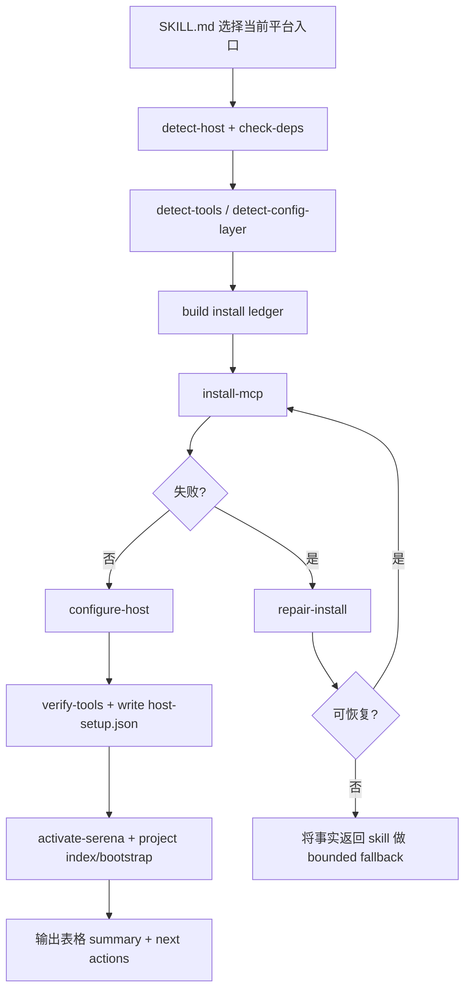

# refactor: Rebuild spec-mcp-setup installer architecture

## Overview

重构 `spec-mcp-setup`，不再把它维持为“宿主配置写入器 + install-coordinator 补丁层”，而是重建为一个面向 macOS / Linux / WSL / Windows 的稳定全链路安装体系：先做 host / OS / dependency / config facts 检测，再按工具执行真实安装或配置写入，失败时先走确定性 repair，再输出结构化表格结论；同时在 Serena 安装完成后自动为当前仓库建立项目级激活与索引准备，并新增一份独立的 MCP 工具索引文档供后续 skill 按需引用。

## Problem Frame

当前 `spec-mcp-setup` 的主能力仍然偏向“为当前宿主写入 MCP 配置并做 host marker 校验”，真实安装能力不完整，且架构被 `install-coordinator.sh/.ps1` 集中承载，导致几个问题：

1. **全链路安装边界不清**：依赖安装、宿主配置写入、工具检测、验证、repair 混在一起，当前脚本更像 host config coordinator，而不是稳定的 installer。
2. **跨系统稳定性不足**：当前 shell / PowerShell 流程虽有 host detection，但对 Windows `npx` 包装、Claude/Codex 配置层级、绝对路径要求、不同 CLI 的细节差异没有被收束为清晰 contract。
3. **失败自愈不足**：当前失败更多是“restore backup + 停止”，缺少可重复执行的 reason-coded repair flow，无法很好支撑“现场自行解决完成安装”。
4. **Serena 项目激活链不闭环**：虽然当前 `mcp-tools.json` 已用 `--project-from-cwd` 和 host-specific context，但没有显式的安装后 project activation / index bootstrap，Codex 场景尤其容易停留在“server 已配置，但项目未激活”。
5. **支持面索引缺失**：后续 skill 虽依赖 `serena` / `context7` / `playwright` / `feishu` 等 MCP 能力，但仓库中没有一份独立、可引用的“支持的 MCP 工具列表 + 宿主差异 + 就绪信号”文档。
6. **现有架构约束过强**：你已明确允许推翻当前 `install-coordinator` 架构，因此本计划不以“最小修补现脚本”为目标，而是以“重新设计更稳定的安装脚本体系”为目标。

（see origin: `docs/01-需求分析/12.mcp-setup.md/需求.md`）

## Requirements Trace

- R1. `spec-mcp-setup` 必须按当前 OS / shell surface 自动选择对应安装脚本，并正确区分 macOS / Linux / WSL / Windows。
- R2. `spec-mcp-setup` 必须支持全链路安装：依赖检测、真实安装、宿主 MCP 配置写入、验证、结果输出，而不是只写配置。
- R3. 安装过程出现失败时，系统必须先走确定性 repair / retry；未知失败则输出足够的事实供 skill 做 bounded fallback，而不是直接放弃。
- R4. 重复执行必须幂等：已经安装的依赖、已存在的宿主配置、已完成的 Serena 项目 bootstrap 都应被跳过或提升为 stronger state，而不是重复写入。
- R5. Serena 安装完成后，必须自动为当前仓库建立项目激活准备；至少完成当前目录 project bootstrap / index seed，并确保后续会话可直接激活当前仓库。
- R6. 安装完成后，必须输出结构化表格结论，区分 installed / configured / skipped / repaired / action-required。
- R7. 支持的 MCP 工具列表必须以独立 reference 文档形式沉淀，并可被后续 skill 引用；`CLAUDE.md` / `AGENTS.md` 只保留入口提示，不承载完整列表。
- R8. 本轮允许同步改造 `spec-graph-bootstrap` 与其他直接消费方，统一切到新的 host readiness ledger；不为旧 `host-setup.json` 结构保留兼容层。
- R9. 本轮允许删除现有 `install-coordinator.sh/.ps1` 架构，不保留兼容包装或 shim。
- R10. 本轮允许重命名、重组甚至替换当前 `mcp-tools.json` / summary / marker 结构，只要新结构在仓库内形成单一真相源并同步更新所有消费方。

## Scope Boundaries

- 不在本计划中引入新的用户可见 workflow 入口；入口仍为 `spec-mcp-setup`。
- 不把“在线搜索并自动修任意未知错误”硬编码进 shell / PowerShell 脚本；脚本只做确定性 repair，LLM/skill 才负责对未知失败做语义决策。
- 不把 supported MCP list 设计成新的 machine-readable registry；本轮以独立 reference 文档为主。
- 不改变 `spec-graph-bootstrap` 仍从当前宿主 marker 读取 readiness 这一协作方向，但允许本轮同步修改它读取的新 marker 结构与文档说明。
- 不要求在本计划内重构所有间接依赖 `spec-mcp-setup` 的下游 skill；但所有直接消费旧 host marker 或旧 summary 结构的入口都应在本轮同步迁移。

### Deferred to Separate Tasks

- 若后续需要把 supported MCP list 升级为统一 machine-readable registry，另开独立计划。
- 若后续需要把未知失败的外部 research / retry fully productize 为单独子工作流，另开独立计划。

## Context & Research

### Relevant Code and Patterns

- `skills/spec-mcp-setup/SKILL.md`：当前 workflow contract。已明确 required/optional 工具、host marker、Phase 1-4 流程与 summary 输出，但整体仍围绕“detect + configure + verify”，没有真正分离 install / configure / repair / bootstrap。
- `skills/spec-mcp-setup/mcp-tools.json`：当前配置驱动真相源。已承载工具列表、依赖、`mcp_config`、`detect` 规则，是未来重构最值得保留的元数据入口。
- `skills/spec-mcp-setup/scripts/detect-host.sh` / `.ps1`：当前 host detection contract，统一产出 `host` / `config_path` / `marker_path` / `cli_command`。这层分离是成熟模式，应保留。
- `skills/spec-mcp-setup/scripts/check-deps.sh` / `.ps1`：当前依赖检测层。已具备结构化 JSON 输出，但依赖面较窄，需要升级为全链路 installer 的 preflight facts。
- `skills/spec-mcp-setup/scripts/detect-tools.sh` / `.ps1`：当前“已配置/未配置”检测层。已存在 host-aware detection 与 `mcp_key_only`，但对 Codex TOML 的解析仍偏启发式。
- `skills/spec-mcp-setup/scripts/install-coordinator.sh` / `.ps1`：当前集中式 orchestrator。具备 backup / lock / add / verify / rollback 等模式，但单文件承载过多职责，且真实安装能力偏弱，是本次允许推翻的核心对象。
- `skills/spec-mcp-setup/scripts/verify-tools.sh` / `.ps1`：当前 host-level verification 与 `host-setup.json` writer。该层与 `spec-graph-bootstrap` 耦合，但你已明确“不需要考虑向下兼容”，因此本轮可连同消费方一起整体换新结构，而不是在旧 contract 上打补丁。
- `tests/unit/mcp-setup.sh`：当前 `spec-mcp-setup` 的主回归锚点，覆盖 mcp-tools 配置、detect/install/verify、marker schema、host paths、Feishu 分支等，是本次重构最重要的测试面。
- `skills/spec-graph-bootstrap/SKILL.md`：下游消费者，会读取当前宿主的 `host-setup.json`，依赖 `setup_success`、`tools.*.configured`、`crg.*`。
- `.claude-plugin/plugin.json`：声明 `mcp-setup` command → `spec-mcp-setup` skill 的产品面绑定。
- `src/cli/contracts/dual-host-governance/skills-governance.json`：决定 dual-host 交付与 runtime 分发边界。

### Institutional Learnings

- `docs/solutions/developer-experience/bash-portability-pitfalls-2026-04-01.md`：Shell 方案必须按 macOS Bash 3.2 / POSIX 兼容面设计；空数组、`jq --arg`、同目录原子写入、`mkdir` 锁等是本次 installer 设计的底线。
- `docs/solutions/workflow-issues/modify-source-not-artifacts-2026-04-13.md`：本次重构只能修改 source-of-truth（`skills/`、`templates/`、contracts），不能把 `.claude/` / `.codex/` / `.agents/skills/` 当成持久修改入口。
- `docs/solutions/developer-experience/standalone-skill-name-convention-2026-04-20.md`：保持 `spec-mcp-setup` 对外命名与 dual-host adapter 语义，不把宿主差异重新塞回 skill identity。
- `docs/solutions/developer-experience/npm-registry-mirror-release-override-2026-04-20.md`：面对环境差异优先采用命令级显式覆盖，不依赖用户机器的全局默认环境。
- `docs/solutions/workflow-issues/database-routing-and-dual-view-refresh-boundaries-2026-04-20.md`：把“静态发现事实”“运行时 readiness”“建议动作/repair 摘要”分层表达，避免把 installer 做成厚状态机。

### External References

- Claude Code MCP docs：确认 Claude MCP 有 `local/project/user` scope，`managed-mcp.json` 是组织级独占控制面，不适合当前面向个人用户的 `spec-mcp-setup` 默认写入路径；Windows 上 `npx` 需 `cmd /c` 包装，且本地脚本应优先使用绝对路径。（official docs: `https://code.claude.com/docs/en/mcp`, `https://code.claude.com/docs/en/debug-your-config`）
- Serena 官方文档 / 仓库：确认 Serena 支持 `--project-from-cwd`、支持 `project index` 预建索引与 project bootstrap；Codex 场景仍强调 project activation 是独立步骤，因此本计划需要显式补齐 Serena bootstrap，而不是只写 server config。（official repo/docs: `https://github.com/oraios/serena`）
- Codex 官方配置文档：Codex 使用 `config.toml` 配置 `mcp_servers`，并存在多层配置语义；本计划默认面向 host baseline 写 user-level 配置，同时检测更高/更低层配置对当前工具的影响。（official docs family: OpenAI Developers Codex configuration docs）

## Key Technical Decisions

- **KD-1：重构目标是“installer pipeline”，不是“install-coordinator v2”**：允许退役 `install-coordinator.sh/.ps1`，改为显式的 detect → install → configure → repair → verify → bootstrap pipeline。原因是当前 coordinator 单文件职责过厚，已经妨碍稳定性与可测性。
- **KD-2：脚本负责确定性执行，skill 负责异常解释与 bounded fallback**：已知失败模式（缺依赖、权限不足、Windows `npx` 启动、Codex timeout、配置文件缺失/损坏）由脚本 reason-code + repair 分支处理；未知失败不在 shell 里发明猜测逻辑，而是把事实抛给 skill 做语义决策。这与项目“脚本执行固定清晰流程，LLM 执行分析决策”的原则一致。
- **KD-3：允许重做工具元数据真相源，但仍坚持单一真相源**：可以继续沿用 `mcp-tools.json`，也可以重命名/重组为更适合 installer pipeline 的结构；关键约束不是文件名，而是“机器侧只有一份工具元数据真相源”，不能一边保留旧 JSON 一边再发明第二套并长期并存。
- **KD-4：Claude 默认写 user scope，而不是 `managed-mcp.json`**：`managed-mcp.json` 是组织级独占控制面，一旦存在会禁止用户通过 `claude mcp add` 或配置文件扩展 MCP；这与 `spec-mcp-setup` 的个人 host baseline 定位冲突。默认仍以 user-level 为主，必要时记录 project-scope / managed-scope 的限制说明。
- **KD-5：Codex 默认写 user-level `config.toml`，但检测必须感知多层配置**：用户要求“重复执行时已全局安装可跳过”，因此不能只看一个文件有没有段落；需要把“系统已存在更强配置”“项目层已有等效配置”“user 层缺失但无需补写”区分开。
- **KD-6：Windows `npx` / `uvx` 需要显式 wrapper 策略**：Claude 官方已明确 Windows native 场景下 `npx` 需要 `cmd /c` 包装；因此重构时必须把 Windows MCP command 生成收束为 deterministic adapter，而不是沿用 Unix 假设。
- **KD-7：Serena bootstrap 视为安装链的一部分**：仅把 Serena server 写入宿主配置不够。安装完成后还需对当前仓库执行 Serena project bootstrap（至少创建/刷新 `.serena/project.yml` 与 index seed），并在 summary 中明确激活状态。这是满足“自动激活当前目录项目”的最小闭环。
- **KD-8：supported MCP list 以独立 reference 文档表达，`CLAUDE.md` / `AGENTS.md` 只保留入口提示**：避免主治理文档膨胀，也减少后续 skill 引用时的重复维护面。
- **KD-9：`host-setup.json` 可以整体重做为新的 readiness ledger**：既然无需向下兼容，本轮不再受当前 `setup_success` / `tools.*` / `crg.*` 字段形状约束。允许设计更适合 installer pipeline 的新 marker 结构，但必须同步更新所有直接消费方、文档和测试，避免仓库内出现旧新双轨。

## Open Questions

### Resolved During Planning

- **Q：安装边界是“只写配置”还是“全链路安装”？** 结论：按“全链路安装”规划，包括依赖准备、真实安装、宿主配置写入、验证与 Serena bootstrap。
- **Q：supported MCP list 是文档还是 machine-readable registry？** 结论：以独立 reference 文档为主，不新增第二份 machine-readable registry。
- **Q：能否推翻当前 `install-coordinator` 架构？** 结论：可以，且应当明确把它视为可退役对象，而不是既有架构必须保留的中心。

### Deferred to Implementation

- **Serena 非交互 bootstrap 的精确 CLI 组合**：当前官方资料明确支持 `project index` 与 project activation，但“当前版本 Serena CLI 最稳的非交互命令组合”应在实现时对照最新 Serena 官方文档和实际命令验证确认。
- **Codex 多层 `config.toml` 的冲突优先级细节**：官方文档已表明存在 layered config；具体落库策略与冲突提升规则需在实现时结合最新 Codex docs 与当前 CLI 行为确认。
- **新的 readiness ledger 结构与文件名是否仍叫 `host-setup.json`**：本轮可以保留文件名但重做 schema，也允许在实现时评估是否应改名；关键是所有直接消费方与文档在同一轮一起切换，不保留旧 schema 兼容层。
- **未知失败的 bounded web fallback 触发条件**：本轮会设计结构化 failure surface，但“哪些未知错误允许自动查官方资料并重试一次”的阈值需要在实现时保守设定。

## Output Structure

```text
skills/spec-mcp-setup/
├── SKILL.md
├── mcp-tools.json
├── references/
│   └── supported-mcp-tools.md
└── scripts/
    ├── check-deps.sh
    ├── check-deps.ps1
    ├── detect-host.sh
    ├── detect-host.ps1
    ├── detect-tools.sh
    ├── detect-tools.ps1
    ├── install-mcp.sh
    ├── install-mcp.ps1
    ├── configure-host.sh
    ├── configure-host.ps1
    ├── repair-install.sh
    ├── repair-install.ps1
    ├── activate-serena.sh
    ├── activate-serena.ps1
    ├── verify-tools.sh
    └── verify-tools.ps1
```

> 说明：`install-coordinator.sh/.ps1` 计划直接删除；新的主逻辑不再保留兼容包装或 shim。

## High-Level Technical Design

> *此设计图用于说明 installer pipeline 的目标形态，是评审用方向性指导，不是实现规范。*



### 设计说明

- **facts 层**：`detect-host` / `check-deps` / `detect-tools` 只回答“当前机器与宿主是什么状态”。
- **execution 层**：`install-mcp` / `configure-host` / `repair-install` 只做确定性动作，不做开放式推理。
- **bootstrap 层**：`activate-serena` 只处理 Serena 项目激活与 index seed，不混入其他工具逻辑。
- **verification/report 层**：`verify-tools` 负责 readiness ledger；最终由 skill 生成用户可读表格结论。

## Implementation Units

- [ ] **Unit 1: 扩展 installer metadata contract，并把当前工具 catalog 升级为“可安装 + 可修复 + 可报告”的真相源**

**Goal:** 让 `mcp-tools.json` 不再只是“配置写入模板”，而是足以驱动全链路安装与结果汇总的单一工具元数据入口。

**Requirements:** R1, R2, R3, R4, R6, R7

**Dependencies:** 无

**Files:**
- Modify: `skills/spec-mcp-setup/mcp-tools.json`
- Test: `tests/unit/mcp-setup.sh`

**Approach:**
- 为每个工具补齐 installer 所需元数据：依赖、host-specific command strategy、Windows wrapper hint、detection strategy、verification hint、repair hint、summary label。
- 允许在必要时重组 tool metadata 的字段与组织方式；若 tool IDs 或分类命名需要调整，也可在本轮一并同步更新所有消费方。
- 不新增第二份 machine-readable registry；supported MCP list 的人类文档稍后由 Unit 6 生成。
- 把“当前已全局存在则跳过”的判定依据拆成至少三层：dependency available、host config present、project bootstrap present。

**Execution note:** contract-first — 先收口 metadata shape 与测试，再重写安装脚本。

**Starting point:** `skills/spec-mcp-setup/mcp-tools.json`

**Patterns to follow:**
- `skills/spec-mcp-setup/mcp-tools.json` 当前 tool catalog 结构
- `tests/unit/mcp-setup.sh` 对 Serena host context、tool categories、timeout 等契约断言

**Test scenarios:**
- Happy path：每个工具都具有 installer 所需最小字段，`mcp-tools.json` 仍是合法 JSON。
- Edge case：required / optional 分类不变，避免重构元数据时误改 baseline gate。
- Edge case：Serena 仍保留 host-specific context 与启动 timeout 约束。
- Error path：缺失关键 installer metadata 时，测试应失败而不是让脚本静默退化。
- Integration：后续 `detect-tools` / `verify-tools` 仍能用同一份 JSON 驱动，不需要第二份配置源。

**Verification:**
- `tests/unit/mcp-setup.sh` 中关于 tool catalog 的断言能明确证明：tool IDs、required/optional、Serena host context、Windows adapter hints、summary labels 均存在且形状稳定。
- 若实现后仍需脚本内写死 tool IDs 或 host-specific exception lists，说明本单元未完成。

---

- [ ] **Unit 2: 用 installer pipeline 替换现有 install-coordinator 架构，并按平台拆出 install / configure / repair 三层脚本**

**Goal:** 退役当前中心化 `install-coordinator` 结构，建立更清晰的跨平台 installer 主链。

**Requirements:** R1, R2, R3, R4, R9

**Dependencies:** Unit 1

**Files:**
- Create: `skills/spec-mcp-setup/scripts/install-mcp.sh`
- Create: `skills/spec-mcp-setup/scripts/install-mcp.ps1`
- Create: `skills/spec-mcp-setup/scripts/configure-host.sh`
- Create: `skills/spec-mcp-setup/scripts/configure-host.ps1`
- Create: `skills/spec-mcp-setup/scripts/repair-install.sh`
- Create: `skills/spec-mcp-setup/scripts/repair-install.ps1`
- Modify: `skills/spec-mcp-setup/SKILL.md`
- Modify: `tests/unit/mcp-setup.sh`
- Delete: `skills/spec-mcp-setup/scripts/install-coordinator.sh`
- Delete: `skills/spec-mcp-setup/scripts/install-coordinator.ps1`

**Approach:**
- 让 `install-mcp.*` 成为新的主执行入口：读取 metadata → 构建 install ledger → 调用 per-phase scripts。
- `configure-host.*` 专门处理 Claude/Codex 的 MCP config 写入与升级，避免 installer 主链直接操作 CLI 细节。
- `repair-install.*` 专门处理确定性失败：例如缺依赖、Windows `cmd /c npx` 包装、权限不足、config 文件损坏、Codex timeout 提升。
- 当前 `install-coordinator` 的职责全部迁移到新 pipeline；实现完成后直接删除旧脚本，避免仓库内残留双轨入口。

**Execution note:** integration-first — 先按最终 pipeline 切分职责，再回填 unit tests，避免在旧 coordinator 上继续叠逻辑。

**Starting point:** `skills/spec-mcp-setup/scripts/install-coordinator.sh`

**Patterns to follow:**
- `skills/spec-mcp-setup/scripts/detect-host.sh` / `.ps1` 的“单一职责 + 结构化 JSON 输出”模式
- `docs/solutions/developer-experience/bash-portability-pitfalls-2026-04-01.md` 对 Bash 3.2 / 原子写入 / 锁的约束

**Test scenarios:**
- Happy path：macOS/Linux 路径使用 `*.sh` 主链，Windows 路径使用 `*.ps1` 主链。
- Happy path：当所有 required tools 缺失时，脚本能按 detect → install → configure → verify 顺序完成基线安装。
- Edge case：当部分工具已存在时，只补缺失部分，不重复写配置。
- Error path：单个工具安装失败时，`repair-install` 能按 reason code 尝试安全修复；若仍失败，主链以结构化失败收口，而不是 silent rollback。
- Error path：配置文件创建失败或写入冲突时，主链保持原子性，不留下半写入状态。
- Integration：删除/退役 `install-coordinator` 后，`SKILL.md`、测试、命令模板仍指向新的主链，不存在悬挂引用。

**Verification:**
- 代码组织上能清楚区分 install / configure / repair 三层；若主要逻辑仍聚集在单个 coordinator 脚本中，则本单元未完成。
- `tests/unit/mcp-setup.sh` 能覆盖新主链入口，并证明旧 coordinator 不再是唯一执行面。

---

- [ ] **Unit 3: 升级 facts 检测与幂等跳过逻辑，显式区分 dependency / config / bootstrap 三种已完成状态**

**Goal:** 让重复执行真正稳定可预期，而不是只做“工具名是否已出现在配置里”的浅层跳过。

**Requirements:** R1, R2, R4, R6

**Dependencies:** Unit 1, Unit 2

**Files:**
- Modify: `skills/spec-mcp-setup/scripts/check-deps.sh`
- Modify: `skills/spec-mcp-setup/scripts/check-deps.ps1`
- Modify: `skills/spec-mcp-setup/scripts/detect-tools.sh`
- Modify: `skills/spec-mcp-setup/scripts/detect-tools.ps1`
- Modify: `tests/unit/mcp-setup.sh`

**Approach:**
- 扩展 dependency 检测，区分“可执行存在”“版本可用”“需要 upgrade / wrapper / PATH 修正”。
- 升级 tool 检测，使其返回更细的 status ledger：例如 `installed`、`configured`、`bootstrap_pending`、`repairable`、`action_required`，而不是只有 installed/missing 二值。
- 对 Codex 检测加入 layered config awareness，避免 user-level 缺失但 project/system 已具备时重复写入。
- 对 Claude 检测明确 user scope 与 project scope 的差异，并保持不触碰 `managed-mcp.json` 默认路径。

**Execution note:** contract-first — 先把检测结果 shape 固定下来，再调整 summary / verify 消费面。

**Starting point:** `skills/spec-mcp-setup/scripts/detect-tools.sh`

**Patterns to follow:**
- `skills/spec-mcp-setup/scripts/detect-host.sh` / `.ps1` 当前的结构化 facts 输出
- `skills/spec-mcp-setup/scripts/verify-tools.sh` 当前对 `setup_success` 与 `crg` block 的区分方式

**Test scenarios:**
- Happy path：已全局具备 required 依赖与 host config 时，第二次执行只输出 skipped / already-ready，不重复安装。
- Edge case：user-level 缺配置，但更高/更低层已有等效配置时，检测能区分“无需补写”与“需要提升到 host baseline”。
- Edge case：Serena server 已配置但当前项目未 bootstrap 时，状态应为 bootstrap pending，而不是 fully ready。
- Error path：检测到配置损坏时，状态落为 repairable，而不是直接 missing。
- Integration：summary / verify / repair 均消费同一份 facts ledger，不出现三套互相矛盾的状态语义。

**Verification:**
- 二次执行的输出能证明“依赖可用 / 配置已存在 / Serena bootstrap 已完成”三层状态被独立识别。
- 若仍只能输出 installed/missing 二值，无法回答“为什么跳过/为什么还未就绪”，则本单元未完成。

---

- [ ] **Unit 4: 为 Serena 增加安装后项目 bootstrap / activation seed，并把当前仓库就绪状态纳入 summary 与 marker**

**Goal:** 满足“Serena 安装后自动激活当前目录项目”的目标，让当前仓库不再停留在“server 已配置但项目未准备”的灰色状态。

**Requirements:** R2, R4, R5, R6

**Dependencies:** Unit 1, Unit 2, Unit 3

**Files:**
- Create: `skills/spec-mcp-setup/scripts/activate-serena.sh`
- Create: `skills/spec-mcp-setup/scripts/activate-serena.ps1`
- Modify: `skills/spec-mcp-setup/mcp-tools.json`
- Modify: `skills/spec-mcp-setup/SKILL.md`
- Modify: `tests/unit/mcp-setup.sh`

**Approach:**
- 在 Serena host config 写入成功后，执行 Serena project bootstrap：面向当前工作目录创建或刷新 `.serena/project.yml`，并预建 index seed / activation seed。
- 将“项目已 bootstrap / 仍需首次在宿主内 activate”与“server 已配置”分开记录，避免误报 fully ready。
- 保持 Claude 与 Codex 的差异可见：Claude 可更积极利用 `--project-from-cwd`；Codex 仍需显式 project activation 语义，因此 summary 必须说明当前项目的剩余动作是否已全部消除。

**Execution note:** integration-first — 先明确 Serena bootstrap 成功/失败的 observable evidence，再决定 marker 字段。

**Starting point:** `skills/spec-mcp-setup/mcp-tools.json` 中的 Serena 条目与 `tests/unit/mcp-setup.sh` 的 Serena 断言区

**Patterns to follow:**
- `mcp-tools.json` 中 Serena 当前的 host context / timeout 配置
- Serena 官方文档关于 `project index` / `--project-from-cwd` / project activation 的推荐路径

**Test scenarios:**
- Happy path：Serena 安装成功后，当前仓库生成 `.serena/project.yml` 或等效 bootstrap 产物，并被 summary 标记为 ready。
- Edge case：Serena server 已配置但 `.serena/project.yml` 缺失时，第二次执行只补 project bootstrap，不重装 server config。
- Edge case：当前目录不是可 bootstrap 项目时，summary 明确为 action-required，而不是 silent success。
- Error path：Serena bootstrap 失败不会把 required MCP config 回滚掉，但会在 summary 和 marker 中标明 project bootstrap 未完成。
- Integration：Codex 路径不会因为 server configured 就被误判为“项目已激活”。

**Verification:**
- 运行链路能区分 `serena configured` 与 `serena project bootstrapped` 两个状态。
- 若最终 summary 仍只能显示 Serena configured，而无法回答当前仓库是否已准备好被 Serena 使用，则本单元未完成。

---

- [ ] **Unit 5: 重构 verify / marker / summary 输出，形成 installer-ready ledger 与表格结论**

**Goal:** 让 `verify-tools` 和最终 summary 成为同一套事实投影：既能服务下游 workflow，也能向用户清晰展示 installed / configured / skipped / repaired / action-required。

**Requirements:** R3, R4, R6, R8

**Dependencies:** Unit 2, Unit 3, Unit 4

**Files:**
- Modify: `skills/spec-mcp-setup/scripts/verify-tools.sh`
- Modify: `skills/spec-mcp-setup/scripts/verify-tools.ps1`
- Modify: `skills/spec-mcp-setup/SKILL.md`
- Modify: `tests/unit/mcp-setup.sh`
- Modify: `skills/spec-graph-bootstrap/SKILL.md`
- Modify: `docs/10-prompt/skills/spec-mcp-setup/SKILL.md`
- Modify: `docs/10-prompt/skills/spec-graph-bootstrap/SKILL.md`

**Approach:**
- 直接定义新的 readiness ledger 结构，不再受当前 `setup_success`、`tools.*`、`crg.*` 形状约束。
- 新 marker 必须一次性覆盖 host baseline、tool states、Serena bootstrap、repair history 与 next actions，避免旧新字段并存。
- 建议字段草案如下（方向性 contract，不是最终实现语法）：
  - `schema_version`
  - `host`（claude/codex）
  - `platform`（macos/linux/wsl/windows）
  - `completed_at`
  - `overall_status`（ready/partial/action-required/failed）
  - `baseline_ready`（布尔，替代旧 `setup_success`）
  - `tools.<tool_id>.required`
  - `tools.<tool_id>.dependency_status`（ready/missing/repaired/action-required）
  - `tools.<tool_id>.host_config_status`（ready/skipped/repaired/action-required）
  - `tools.<tool_id>.project_status`（not-applicable/pending/ready/failed）
  - `tools.<tool_id>.last_action`（installed/configured/repaired/skipped/none）
  - `tools.<tool_id>.next_action`
  - `serena.project.path`
  - `serena.project.bootstrap_status`
  - `serena.project.index_status`
  - `repair.attempted`
  - `repair.resolved`
  - `repair.last_reason_code`
  - `next_actions[]`
- 最终在 skill 输出中强制使用表格结论，而不是零散文本：每个工具至少展示 Tool / Required? / Dependency / Host Config / Project Bootstrap / Result / Next Action。
- `verify-tools` 的职责是生成 machine-truth ledger；`SKILL.md` 的职责是把该 ledger 投影成用户可读表格。
- `spec-graph-bootstrap` 的消费迁移原则：不再读取旧字段名推断状态，而是显式消费 `overall_status` / `baseline_ready` 与其真正需要的 tool/project 子字段。

**Execution note:** contract-first — 先定义 marker 与表格字段，再改脚本与文案。

**Starting point:** `skills/spec-mcp-setup/scripts/verify-tools.sh`

**Patterns to follow:**
- 当前 `verify-tools.sh` 对 `setup_success` 与 `crg` block 的分层
- `tests/unit/mcp-setup.sh` 中对 `host-setup.json` schema 的断言区

**Test scenarios:**
- Happy path：baseline required tools ready → `overall_status=ready`、`baseline_ready=true`，且表格中所有 required tools 结果为 ready/skipped/installed 之一。
- Edge case：optional tools 未安装时，不阻塞 `baseline_ready`，但表格明确显示 skipped/not installed，`overall_status` 可为 ready 或 partial（取决于是否有用户显式选择的 optional 目标未完成）。
- Edge case：某工具通过 repair 成功后，summary 与 marker 均能看到 `repair.attempted=true`、`repair.resolved=true` 与对应 `last_reason_code`。
- Edge case：Serena server ready 但 project bootstrap 未完成时，`tools.serena.host_config_status=ready` 且 `tools.serena.project_status=pending|failed`，不会被误报为 fully ready。
- Error path：verify 失败时，不写入“看起来成功”的 marker，也不输出误导性的 complete summary。
- Integration：`spec-graph-bootstrap` 读取新的 ledger 时，只消费新字段，不再依赖旧字段别名；相应文档与测试同步更新。

**Verification:**
- `tests/unit/mcp-setup.sh` 能证明 marker 与 summary 来自同一套事实字段，而非两套互相漂移的逻辑。
- `spec-graph-bootstrap` 的 host readiness 描述与其实际消费的新 ledger 字段一致，不再出现旧字段名残留。
- 计划进入实现前，reviewer 可以仅凭字段草案回答三个问题：当前宿主基线是否 ready、某个工具为何被 skipped/repair、Serena 当前项目是否已 bootstrap；若仍答不清，则字段草案仍不够好。

---

- [ ] **Unit 6: 新增 supported MCP list reference，并把 `spec-mcp-setup` 文档改为“reference-first” 引用方式**

**Goal:** 为后续 skill 提供一份独立、稳定、可引用的 supported MCP list，而不是继续把完整工具列表散落在 `SKILL.md`、`CLAUDE.md`、`AGENTS.md` 和 README 里。

**Requirements:** R6, R7

**Dependencies:** Unit 1, Unit 5

**Files:**
- Create: `skills/spec-mcp-setup/references/supported-mcp-tools.md`
- Modify: `skills/spec-mcp-setup/SKILL.md`
- Modify: `AGENTS.md`
- Modify: `CLAUDE.md`
- Modify: `README.md`
- Modify: `README.zh-CN.md`
- Modify: `tests/unit/mcp-setup.sh`

**Approach:**
- 新增独立 reference 文档，记录：supported tools、required/optional、host-specific config notes、Serena bootstrap notes、下游依赖 skill/agent、readiness signals。
- `SKILL.md` 保留简化总览，但把细节说明引用到 reference 文档。
- `CLAUDE.md` / `AGENTS.md` 只追加最小入口提示，不把完整列表复制进去。
- README 仅在合适位置补指向 `spec-mcp-setup` reference 的 discoverability 入口，避免首页信息膨胀。

**Patterns to follow:**
- 仓库当前 `skills/*/references/` 的 reference-first 组织方式
- “修改源而非运行时产物”的文档治理原则

**Test scenarios:**
- Happy path：`supported-mcp-tools.md` 存在并能列清所有当前支持的工具。
- Edge case：当工具列表更新时，`SKILL.md` 不需要重复维护完整细节，只需指向 reference。
- Integration：`tests/unit/mcp-setup.sh` 或相关 contract test 能防止 skill 与 reference 的 drift。

**Verification:**
- 仓库中存在一份独立的 supported MCP list，可被后续 skill 直接引用。
- `CLAUDE.md` / `AGENTS.md` 未被扩展成新的完整工具目录，只保留指路信息。

---

- [ ] **Unit 7: 扩展测试与治理验证，覆盖新 installer pipeline、Windows adapter、幂等跳过与 Serena bootstrap**

**Goal:** 让重构后的 `spec-mcp-setup` 不只靠文案成立，而是有覆盖跨平台分支、幂等、repair、marker、Serena bootstrap 的回归面。

**Requirements:** R1, R2, R3, R4, R5, R6, R8, R9

**Dependencies:** Unit 1-6

**Files:**
- Modify: `tests/unit/mcp-setup.sh`
- Modify: `tests/smoke/cli.sh`
- Modify: `tests/unit/dual-host-governance-contracts.test.js`
- Modify: `.claude-plugin/plugin.json`（仅在命令描述或 argument hint 需要同步时）
- Modify: `src/cli/contracts/dual-host-governance/skills-governance.json`（仅在治理 contract 需要同步时）

**Approach:**
- 扩展 unit shell tests，覆盖：新脚本入口、Windows wrapper 语义、Claude/Codex host config difference、repair path、second-run idempotency、Serena project bootstrap。
- 补 smoke tests，验证 `spec-first init --claude|--codex` 后 runtime artifact 仍正确投影新 skill 内容。
- 如果 `plugin.json` 或 skills governance 的说明字段随重构变更，需要同步 contract tests 锁定。

**Execution note:** characterization-first — 先明确哪些旧行为允许直接删除、哪些入口必须同步迁移，再扩新测试。

**Starting point:** `tests/unit/mcp-setup.sh`

**Patterns to follow:**
- 当前 `tests/unit/mcp-setup.sh` 的 detect/install/verify 一体化测试风格
- `tests/smoke/cli.sh` 对 command template / runtime artifact 的 smoke 守护模式

**Test scenarios:**
- Happy path：Unix 主链完整跑通 required baseline。
- Happy path：Windows adapter 产出正确的 command/wrapper 语义。
- Edge case：再次执行时，只输出 skipped / already-ready，不重复写入。
- Edge case：Serena server 已在 host config，但项目 bootstrap 缺失时，只补 bootstrap。
- Error path：repairable failure 经 repair 后成功；unknown failure 正确收口为 action-required。
- Integration：`spec-first init` 生成的 runtime skill/template 与 source-of-truth 一致。

**Verification:**
- 至少存在 unit + smoke 两层证据，证明新 installer pipeline、host marker、runtime skill 内容三者一致。
- 若只能证明脚本局部函数可运行，但无法证明 `spec-first init` 后用户实际会读到正确 skill 内容，则本单元未完成。

## System-Wide Impact

- **Interaction graph:** `spec-mcp-setup` 上游受 `plugin.json`、skills governance、runtime template 分发影响；下游直接影响 `spec-graph-bootstrap` 读取 `host-setup.json` 的 host readiness gate；同时影响 Serena / Context7 / Playwright / Feishu 等后续 skill 调用前置条件。
- **Error propagation:** 检测层错误应先转成 reason-coded facts；installer/repair 层只处理确定性可恢复错误；未知错误交还 skill 做 bounded fallback，不应在脚本里静默吞掉。
- **State lifecycle risks:** 宿主 MCP config、host marker、`.serena/project.yml`、index seed 都属于持久状态，必须保证原子写入、重复执行幂等、失败不留半状态。
- **API surface parity:** Claude 与 Codex 的 command/config surface 必须同语义不同适配；Windows 与 Unix 也必须同语义不同脚本，不允许一端后补。
- **Integration coverage:** 仅 mock config 文件不足以证明全链路成立；至少要覆盖 host detection → install/configure → verify → marker → runtime artifact 的跨层链路。
- **Unchanged invariants:** `spec-mcp-setup` 仍然是唯一的 MCP host baseline workflow；不新增新的用户可见 workflow；`spec-graph-bootstrap` 仍从当前宿主 `host-setup.json` 读取 readiness，而不是改走新的中心化服务。

## Alternative Approaches Considered

- **在当前 `install-coordinator.sh/.ps1` 上继续增量补逻辑**：拒绝。虽然改动面更小，但会让 coordinator 继续膨胀，且无法清晰表达 install / configure / repair / bootstrap 的边界。
- **把支持的 MCP 工具列表做成新的 machine-readable registry**：本轮不选。会增加第二份机器真相源和同步成本，而当前 `mcp-tools.json` 已足够承载机器侧需求。
- **把完整工具索引直接写进 `CLAUDE.md` / `AGENTS.md`**：不选。主治理文档会膨胀，后续 drift 风险更高。

## Risks & Dependencies

| Risk | Mitigation |
|------|------------|
| Windows `npx` / `uvx` 调用语义与 Unix 差异导致配置无效 | 在 host adapter 中显式定义 Windows wrapper 策略，并由 tests 锁定 |
| Codex layered config 识别不准，重复写入或误跳过 | 把 layered config detection 提升为 facts contract，并在 unit tests 中覆盖 project/user/system 冲突场景 |
| Serena CLI 当前版本的 project bootstrap 命令与计划假设存在差异 | 在实现时以官方 Serena 最新文档和命令验证为准；计划中只锁定“必须有 bootstrap step”，不锁死具体命令字符串 |
| 新 readiness ledger 字段定义不够清晰，进入实现后仍反复摇摆 | 在计划阶段先给出字段草案，并要求实现前通过“ready / skipped / repaired / Serena bootstrap”四类场景走查 |
| 新 readiness ledger 替换旧 `host-setup.json` 结构后，`spec-graph-bootstrap` 与其他直接消费方读不到新字段 | 把所有直接消费方纳入同一轮迁移范围，更新代码、文档与测试，禁止旧新双轨并存 |
| 重构过大导致 source/runtime artifact 漂移 | 严格只改 `skills/` / `templates/` / contracts 真相源，并补 `spec-first init` smoke 验证 |
| Bash / PowerShell 两端实现语义不一致 | 同一个 implementation unit 内要求 sh/ps1 同步交付，不允许单端后置 |

## Documentation / Operational Notes

- README 与 README.zh-CN 只补 discoverability，不在首页承载完整 supported tools 细节。
- `skills/spec-mcp-setup/references/supported-mcp-tools.md` 作为后续 skill 引用入口，应说明：工具用途、required/optional、host constraints、Serena project bootstrap 特别说明、summary/marker readiness 含义。
- 若实现阶段确认某些官方文档链接需要长期引用，可在 reference 文档中集中维护，而不是散落在 `SKILL.md`。

## Verification

本计划完成后的“done”证据应同时满足：

1. `spec-mcp-setup` 的源码结构已经从 coordinator 中心迁移为 installer pipeline，install / configure / repair / bootstrap / verify 职责清晰。
2. macOS/Linux/WSL/Windows 的安装主链都能通过对应脚本入口执行，不再依赖 Unix-only 假设。
3. 第二次执行能正确区分 installed / configured / bootstrap_ready / skipped / repaired / action_required，且不会重复写入。
4. Serena 安装后，当前仓库能留下明确的 project bootstrap 证据（如 `.serena/project.yml` 或等效 seed），summary 与 marker 也能反映其状态。
5. 最终用户输出以表格形式清晰展示每个工具的状态与下一步动作，而不是零散提示。
6. 新 readiness ledger 的字段足以直接回答：基线是否 ready、某工具为什么 skipped/repair、Serena 当前项目是否已 bootstrap。
7. 新 readiness ledger 与其直接消费方（至少 `spec-graph-bootstrap`）在同一轮完成切换，仓库内不存在依赖旧 marker 结构的活跃入口。
8. `skills/spec-mcp-setup/references/supported-mcp-tools.md` 已存在，且 `SKILL.md` / `CLAUDE.md` / `AGENTS.md` / README 的 discoverability 口径一致。
9. `tests/unit/mcp-setup.sh` 与相关 smoke/governance 测试证明 source-of-truth、runtime artifact、host marker 三条链路是一致的。

若最终实现仍满足以下任一情况，则仍算“未完成”：
- 主要逻辑仍集中在 `install-coordinator`，没有形成清晰 pipeline。
- summary 与 marker 使用两套不同状态语义，互相无法解释。
- Serena 仍只有 server config，没有 current project bootstrap / activation seed。
- 第二次执行无法说明“为什么跳过”“为什么未就绪”。
- 支持的 MCP 工具列表仍散落在多个文档，没有独立 reference 入口。

## Sources & References

- **Origin document:** `docs/01-需求分析/12.mcp-setup.md/需求.md`
- Related requirements: `docs/brainstorms/2026-04-01-mcp-setup-skill-requirements.md`
- Related requirements: `docs/brainstorms/2026-04-14-feishu-mcp-setup-integration-requirements.md`
- Related plans: `docs/plans/2026-04-10-001-feat-crg-mcp-setup-integration-plan.md`
- Related plans: `docs/plans/2026-04-14-008-feat-feishu-mcp-setup-integration-plan.md`
- Related code: `skills/spec-mcp-setup/SKILL.md`
- Related code: `skills/spec-mcp-setup/mcp-tools.json`
- Related code: `skills/spec-mcp-setup/scripts/detect-host.sh`
- Related code: `skills/spec-mcp-setup/scripts/check-deps.sh`
- Related code: `skills/spec-mcp-setup/scripts/detect-tools.sh`
- Related code: `skills/spec-mcp-setup/scripts/install-coordinator.sh`
- Related code: `skills/spec-mcp-setup/scripts/verify-tools.sh`
- Related code: `skills/spec-graph-bootstrap/SKILL.md`
- Related tests: `tests/unit/mcp-setup.sh`
- Related governance: `.claude-plugin/plugin.json`
- Related governance: `src/cli/contracts/dual-host-governance/skills-governance.json`
- External docs: `https://code.claude.com/docs/en/mcp`
- External docs: `https://code.claude.com/docs/en/debug-your-config`
- External docs: `https://github.com/oraios/serena`
