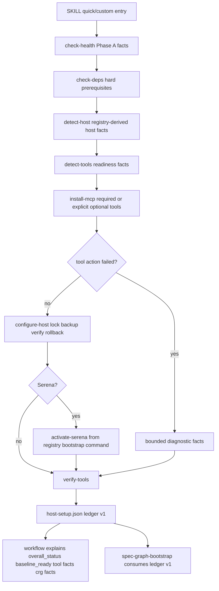

# refactor: Harden spec-mcp-setup installer readiness

## Overview

本计划加固现有 `spec-mcp-setup` 分层安装链路，而不是重做安装器或恢复 `install-coordinator.*`。目标是让 quick / custom setup 在依赖缺失、host config 不可写、fallback 生效、Serena bootstrap 失败、CRG native module 缺失等情况下输出可信事实：脚本负责确定性检测、写入、回滚、诊断摘要和 readiness ledger；LLM workflow 负责解释事实、权衡 fallback 风险并给出下一步建议。

计划的核心改造面是：稳定 `mcp-tools.json` 单一机器真相源；补强 install/configure/bootstrap 的失败诊断；让 Unix 与 PowerShell host config 写入具备对齐的 lock / backup / verify / rollback 语义；把 Serena bootstrap 命令从 registry 派生；保持 MCP baseline 与 CRG health 分离；同步更新 `spec-graph-bootstrap` 消费口径、source 文档和测试。

---

## Problem Frame

`spec-mcp-setup` 已经完成从旧 GitNexus / ABCoder / install-coordinator 方向到当前 MCP baseline 安装链路的迁移，但现有实现仍存在几个容易造成 false-ready 或难诊断 partial 状态的薄弱点：

- `install-mcp.*` 对 warmup、configure、repair、Serena bootstrap 多处吞掉 stdout / stderr，只留下粗粒度 `reason_code`，无法满足失败可诊断要求。
- Unix `configure-host.sh` 已有 lock / backup / verify / rollback，PowerShell `configure-host.ps1` 只有 backup / verify / rollback，缺少同等并发写入保护。
- `activate-serena.*` 从 registry 读取了 Serena bootstrap metadata，但实际命令仍硬编码语言参数，registry 还不是完整执行真相源。
- `verify-tools.*` 写入 ledger 是正确行为，但用户输出和下游消费必须明确区分 `overall_status`、`baseline_ready`、tool 级 facts 与 CRG health，不能把“ledger 已刷新”表达为“setup 成功”。
- 现有测试和文档中仍存在 prompt mirror / retired coordinator 口径需要重新核实，避免 source、runtime artifact 和历史文档被混作同一真相源。

这些问题影响 A1 使用者、A2 `spec-mcp-setup` workflow、A3 安装脚本链路和 A4 下游 workflow（see origin: `docs/brainstorms/2026-04-01-mcp-setup-skill-requirements.md`）。

---

## Requirements Trace

- R1. `skills/spec-mcp-setup/mcp-tools.json` 继续作为唯一机器真相源；required 为 Serena、Sequential Thinking、Context7，optional 为 Playwright MCP。
- R2. Serena readiness 必须同时满足 host MCP config 与当前仓库 bootstrap；当前仓库 ready 以 `.serena/project.yml` 和 `.serena/index-ready.json` 同时存在为准。
- R3. Custom 模式只改变本次 install/skip 选择，不改变 registry；optional Playwright 失败不得让 required baseline 误报失败。
- R4. Host config 写入必须保持 lock / backup / verify / rollback 语义，失败不破坏用户原配置。
- R5. Claude / Codex 宿主差异必须来自 registry host config metadata，不复制第二份机器目录。
- R6. Host readiness 必须区分 `ready`、`fallback-active`、`precedence-blocked`、`action-required`，并可被 workflow 解释为实际含义和下一步。
- R7. 安装链路必须支持 quick 与 custom：quick 默认 required，custom 显式传递 install/skip 选择。
- R8. 每个工具的安装结果必须返回结构化事实：tool id、status、last action、reason code、configured path、selected scope、fallback applied、next action。
- R9. warmup、configure、repair、Serena bootstrap 等失败路径必须保留足够诊断信息，不能只返回笼统失败。
- R10. `jq` 是 Unix JSON 脚本硬前提时，应作为 bootstrap hard prerequisite 明确报告，而不是伪装成同一 JSON 检测脚本能完整报告的普通依赖。
- R11. `verify-tools` 写入 readiness ledger 只表示事实已刷新，不等同于 setup 成功；输出必须展示 `overall_status` 与 `baseline_ready`。
- R12. Readiness ledger v1 必须稳定提供 host、platform、repo_root、overall_status、baseline_ready、tools、crg、next_actions。
- R13. CRG CLI / native module 状态可影响 overall health，但不得与 required MCP baseline 混淆。
- R14. 健壮性改进应强化现有 `detect-host`、`check-deps`、`detect-tools`、`install-mcp`、`configure-host`、`repair-install`、`activate-serena`、`verify-tools` 分层脚本，不恢复 `install-coordinator.*`。
- R15. 脚本只输出确定性事实、写入结果和恢复状态；LLM workflow 负责解释 tradeoff、选择建议和是否继续下一步。
- R16. 文档必须删除或标注过时的 GitNexus / ABCoder / Feishu / install-coordinator 口径，避免历史需求被误读为当前支持面。

**Origin actors:** A1 使用者, A2 `spec-mcp-setup` workflow, A3 安装脚本链路, A4 下游 workflow

**Origin flows:** F1 Quick baseline setup, F2 Custom optional setup, F3 Host config write and repair, F4 Downstream readiness consumption

**Origin acceptance examples:** AE1 covers R2/R11, AE2 covers R4/R8, AE3 covers R6/R13, AE4 covers R9/R10, AE5 covers R12/R13

---

## Scope Boundaries

- 不新增新的 MCP 工具支持；本轮只围绕 Serena / Sequential Thinking / Context7 / Playwright MCP。
- 不恢复 GitNexus、ABCoder 或 Feishu MCP 安装路径。
- 不恢复 `install-coordinator.*` 或跨工具中心状态机。
- 不把 readiness ledger 扩展成强 gate；它是事实输入，不替 LLM 做最终裁决。
- 不处理 MCP 工具版本升级策略、卸载体验或自定义第三方 MCP catalog。
- 不手改 `.claude/`、`.codex/`、`.agents/skills/` 等 runtime/generated artifacts；持久修改落在 `skills/`、`templates/`、`src/cli/`、`tests/`、`docs/` 的 source-of-truth。

### Deferred to Follow-Up Work

- MCP 工具升级 / pinning 策略：后续如需稳定 tool 版本，再单独规划 registry 字段和 rollout。
- 完整 PowerShell 并发压力测试：本计划要求 PowerShell lock contract 与单元测试；真实 Windows 多进程压力验证可作为后续人工或 CI 增强。

---

## Context & Research

### Relevant Code and Patterns

- `skills/spec-mcp-setup/SKILL.md`：当前 workflow contract，已经明确 Phase A preflight 与 Phase B MCP baseline setup 的边界，且声明不恢复 `install-coordinator.*`。
- `skills/spec-mcp-setup/mcp-tools.json`：当前唯一机器 registry，已包含 required / optional、host config、fallback order、uninstall targets、detection、Serena bootstrap marker 与 warmup command。
- `skills/spec-mcp-setup/scripts/detect-host.sh` / `detect-host.ps1`：从 registry 派生 Claude managed/user、Codex user/system、fallback、precedence、marker path 等 host facts。
- `skills/spec-mcp-setup/scripts/detect-tools.sh` / `detect-tools.ps1`：输出 `overall_status`、`baseline_ready`、tool 级 dependency / host_config / project facts、CRG facts 与 `next_actions`。
- `skills/spec-mcp-setup/scripts/install-mcp.sh` / `install-mcp.ps1`：安装编排层，当前默认 required-only，custom 通过 `--install` / `-Install` 显式包含 optional。
- `skills/spec-mcp-setup/scripts/configure-host.sh` / `configure-host.ps1`：host config 写入层；Unix 已有 lock，PowerShell 需要对齐 lock 语义。
- `skills/spec-mcp-setup/scripts/activate-serena.sh` / `activate-serena.ps1`：当前仓库 Serena bootstrap；需要从 registry 派生命令而不是硬编码语言列表。
- `skills/spec-mcp-setup/scripts/verify-tools.sh` / `verify-tools.ps1`：ledger writer，写入 host-specific `spec-first/host-setup.json`。
- `skills/spec-graph-bootstrap/SKILL.md`：下游 readiness ledger v1 消费方，要求不再读取旧字段 `setup_success`、`tools.*.configured`、`crg.cli_available`、`crg.native_modules`。
- `tests/unit/mcp-setup.sh`：当前主测试面，覆盖 registry、host facts、readiness facts、installer、uninstall、ledger、skill/reference 文案。
- `tests/unit/dual-host-governance-contracts.test.js` 与 `tests/smoke/cli.sh`：守住 `$spec-mcp-setup` / `/spec:mcp-setup` runtime exposure。

### Institutional Learnings

- `docs/solutions/developer-experience/bash-portability-pitfalls-2026-04-01.md`：Unix shell 需要按 macOS Bash 3.2 设计；空数组、`jq --arg`、同目录 tempfile、权限保留、`flock` feature-detect 与 `mkdir` lock 是底线。
- `docs/solutions/workflow-issues/database-routing-and-dual-view-refresh-boundaries-2026-04-20.md`：不要把静态发现、runtime readiness 和顶层 compatibility projection 混成厚状态机；ledger 应保持轻 contract。
- `docs/solutions/workflow-issues/modify-source-not-artifacts-2026-04-13.md`：runtime artifacts 滞后不能推导为 source 缺陷；修改应追溯 source-of-truth。
- `docs/solutions/architecture-patterns/workflow-entrypoint-exposure-contract-2026-04-26.md`：跨 Claude/Codex surface 需要维护 manifest、governance、adapter 边界；同理，MCP host 差异应由 registry 与脚本 adapter 承担，而不是散落在 prose。

### External References

- 未使用外部研究。当前改动主要是仓库内 installer / ledger contract 加固，本地需求、source、tests 和 institutional learnings 已提供足够决策依据。

---

## Key Technical Decisions

- **保持 `mcp-tools.json` 为唯一机器真相源**：新增或调整 bootstrap / diagnostic / host metadata 时只扩展这一份 registry；`supported-mcp-tools.md` 与 `SKILL.md` 只解释事实，避免第二份工具目录（R1, R5, R14）。
- **选择 `jq` hard prerequisite，而不是无 jq 最小 JSON 输出路径**：Unix 脚本大量依赖 `jq` 做安全 JSON 构造和动态 key 访问。为了最小可维护，本轮把 `jq` 明确为 bootstrap hard prerequisite，并让 `check-deps.sh` / workflow 文案给出清晰安装建议；不在 shell 里维护一套脆弱的无 jq JSON fallback（R10, AE4）。
- **失败诊断采用 bounded summary 字段，不落完整日志**：安装结果应补齐 exit code、stderr/stdout 摘要或 `diagnostic_summary`，但限制长度并避免泄露过长日志。脚本输出事实；LLM 解释 next action（R8, R9, R15）。
- **`fallback-active` 可使 MCP baseline usable，但不能伪装成全绿**：Claude user fallback 在 required tools 和 Serena project ready 时可让 `baseline_ready=true`；`overall_status` 仍可保持 `partial` 并由 workflow 明确解释 fallback 状态（R6, R13, AE3）。
- **CRG health 与 MCP baseline 分离**：`baseline_ready` 只表达 required MCP baseline；CRG CLI/native module 状态只进入 `crg.*`、`overall_status` 和 `next_actions`，供 graph-bootstrap 降级判断（R11, R12, R13, AE5）。
- **PowerShell 与 Unix 写入语义对齐，但实现细节可平台化**：PowerShell 不需要复制 Unix `flock` 实现，但必须提供等价的命名锁、backup、verify、rollback contract 和测试证据（R4, AE2）。
- **Serena bootstrap 命令由 registry 派生**：`activate-serena.*` 应消费 `project_bootstrap.index_command` 的 command + args，避免脚本内语言列表与 registry 漂移（R2, R5）。
- **清理过时口径以 source surface 为准**：目标 source surface 不应继续把 GitNexus / ABCoder / Feishu 作为当前 MCP setup 支持项；历史文档可保留，但应避免被 tests 或 active references 误读为当前能力（R16）。

---

## Open Questions

### Resolved During Planning

- **`jq` 是 hard prerequisite 还是无 jq fallback？** 结论：作为 hard prerequisite。理由是当前脚本的安全 JSON/TOML 投影严重依赖 `jq`；无 jq fallback 会增加第二套输出逻辑并削弱可维护性。
- **Serena bootstrap 命令是否由 registry 派生？** 结论：是。`mcp-tools.json` 已有 `project_bootstrap.index_command`，继续硬编码语言列表会违反单一真相源。
- **是否需要外部研究？** 结论：不需要。改动主要围绕本仓库既有脚本、tests、ledger v1 和项目治理边界；外部 MCP 文档不会改变本轮设计。

### Deferred to Implementation

- **诊断摘要字段命名与长度上限**：实现时根据现有 JSON shape 选择最小字段名；计划只要求 bounded、结构化、不会吞掉关键 stderr / exit code。
- **PowerShell lock 的具体机制**：可用 lock file、named mutex 或同等平台机制；计划只要求同一 config path 的并发写入被串行化并可测试。
- **TOML 写入是否继续使用文本替换**：短期可沿用现有确定性替换，但必须通过 verify 和测试守住；是否引入 parser 留给实现时基于复杂度决定。

---

## High-Level Technical Design

> *This illustrates the intended approach and is directional guidance for review, not implementation specification. The implementing agent should treat it as context, not code to reproduce.*

关键边界：

- Phase A repo preflight 不写入 MCP readiness ledger。
- install / configure / repair / bootstrap 只输出确定性事实和恢复状态。
- ledger 是下游 LLM/workflow 的事实输入，不是中心化 gate。
- `spec-graph-bootstrap` 只消费 ledger v1，不重新猜测 host config 语义。

---

## Implementation Units

- U1. **Lock the Registry and Ledger Contract**

**Goal:** 固化 `mcp-tools.json` 与 readiness ledger v1 的最小稳定 contract，明确 `jq` hard prerequisite 和 CRG/MCP baseline 分离语义。

**Requirements:** R1, R5, R10, R11, R12, R13, R14, R15; F1, F4; AE1, AE5

**Dependencies:** None

**Files:**
- Modify: `skills/spec-mcp-setup/mcp-tools.json`
- Modify: `skills/spec-mcp-setup/SKILL.md`
- Modify: `skills/spec-mcp-setup/references/supported-mcp-tools.md`
- Modify: `skills/spec-mcp-setup/scripts/check-deps.sh`
- Modify: `skills/spec-mcp-setup/scripts/check-deps.ps1`
- Modify: `tests/unit/mcp-setup.sh`
- Modify: `CHANGELOG.md`
- Test: `tests/unit/mcp-setup.sh`

**Approach:**
- Preserve current tool IDs and required/optional classification.
- Add only registry fields that remove real script hardcoding, especially around Serena bootstrap and host metadata; do not introduce a second machine-readable catalog.
- Clarify in `SKILL.md`, `supported-mcp-tools.md`, and `check-deps.*` output semantics that `jq` is a Unix hard prerequisite and that Unix may fail before full JSON facts when `jq` is absent.
- Keep the `jq` missing path actionable: even when `check-deps.sh` cannot emit full JSON, stderr should include the platform-appropriate install suggestion instead of a generic missing-dependency error.
- Keep ledger v1 shape stable: `schema_version`, `host`, `platform`, `repo_root`, `overall_status`, `baseline_ready`, `tools`, `crg`, `next_actions`, `completed_at`.
- Reconcile `tests/unit/mcp-setup.sh` assertions that reference non-existent prompt mirror paths; tests should verify active source surfaces and generated runtime surfaces only where this repo actually produces them.
- Append the required `CHANGELOG.md` entry in the same implementation batch as the source changes, not only during final documentation cleanup.

**Execution note:** Contract-first. Update tests around registry/ledger expectations before changing behavior-heavy scripts.

**Patterns to follow:**
- `skills/spec-mcp-setup/mcp-tools.json` existing schema v3 structure.
- `skills/spec-graph-bootstrap/SKILL.md` Phase 0.2b ledger v1 field list.
- `docs/solutions/workflow-issues/database-routing-and-dual-view-refresh-boundaries-2026-04-20.md` for runtime readiness vs projection separation.

**Test scenarios:**
- Happy path: registry contains exactly the current supported tools with Serena/Sequential Thinking/Context7 required and Playwright optional.
- Happy path: ledger documentation and tests include `overall_status`, `baseline_ready`, `tools`, `crg`, `next_actions`, and `completed_at`.
- Edge case: `jq` missing is asserted as hard prerequisite behavior for Unix scripts and emits a concrete install suggestion while remaining a non-JSON bootstrap failure, not ordinary `dependency_status=missing`.
- Edge case: CRG native module missing can set `overall_status=partial` and add next action while leaving MCP `baseline_ready` determined only by required tool facts.
- Integration: `spec-graph-bootstrap` referenced fields remain a subset of ledger v1 and do not require direct host config reads.
- Governance: source changes in this unit are accompanied by a root `CHANGELOG.md` entry.

**Verification:**
- Registry tests prove one machine truth source remains sufficient.
- Documentation and tests agree that ledger refresh is fact refresh, not setup success.

---

- U2. **Add Bounded Diagnostics to Installer Results**

**Goal:** Make warmup, configure, repair, and Serena bootstrap failures diagnosable without dumping unbounded logs or letting scripts make semantic decisions.

**Requirements:** R3, R7, R8, R9, R10, R15; F1, F2, F3; AE4

**Dependencies:** U1

**Files:**
- Modify: `skills/spec-mcp-setup/scripts/install-mcp.sh`
- Modify: `skills/spec-mcp-setup/scripts/install-mcp.ps1`
- Modify: `skills/spec-mcp-setup/scripts/repair-install.sh`
- Modify: `skills/spec-mcp-setup/scripts/repair-install.ps1`
- Modify: `skills/spec-mcp-setup/SKILL.md`
- Modify: `tests/unit/mcp-setup.sh`
- Modify: `CHANGELOG.md`
- Test: `tests/unit/mcp-setup.sh`

**Approach:**
- Replace broad `2>/dev/null` / `Out-Null` swallowing with bounded capture that records exit code, reason code, last action, and short diagnostic summary.
- Keep full command output out of the stable ledger unless explicitly bounded; diagnostic fields should be enough to distinguish network/package resolution failure, permission failure, missing dependency, and bootstrap failure.
- Ensure custom mode still only includes explicitly selected optional tools; optional Playwright failure must not mark required baseline failed.
- Define skip semantics conservatively: `--skip` / `-Skip` may skip optional tools only. Skipping a required tool is invalid input and must return structured action-required facts instead of silently producing a partial baseline that looks intentional.
- Preserve existing result fields (`tool_id`, `status`, `last_action`, `reason_code`, `configured_path`, `selected_scope`, `fallback_applied`, `next_action`) and add diagnostic detail conservatively.
- Append the required `CHANGELOG.md` entry in the same implementation batch as the source changes.

**Patterns to follow:**
- Current `install-mcp.*` result array shape.
- Bash portability guidance in `docs/solutions/developer-experience/bash-portability-pitfalls-2026-04-01.md`.

**Test scenarios:**
- Happy path: required quick install returns one result per required tool and excludes Playwright by default.
- Happy path: custom explicit Playwright install includes Playwright result without changing registry required/optional facts.
- Edge case: custom `--skip playwright` / `-Skip playwright` skips only the optional Playwright tool and still processes the required baseline.
- Error path: custom `--skip serena` / `-Skip serena` is rejected or returned as structured `action-required` invalid-selection facts; it must not silently omit a required tool from the baseline run.
- Error path: simulated warmup failure returns `status=action-required`, `reason_code=warmup_failed`, non-empty bounded diagnostic summary, and actionable `next_action`.
- Error path: simulated configure failure followed by repair failure returns `reason_code=configure_failed` and preserves diagnostic facts from both attempts where practical.
- Error path: Serena bootstrap failure returns `status=partial`, `reason_code=serena_bootstrap_failed`, and does not claim Serena ready.
- Edge case: diagnostic summary is bounded and does not break JSON output when stderr contains quotes, newlines, or non-ASCII package-manager output.
- Governance: source changes in this unit are accompanied by a root `CHANGELOG.md` entry.

**Verification:**
- A failing tool no longer collapses to only `warmup_failed` / `configure_failed`; the result explains enough for the workflow to tell the user what failed and what to try next.

---

- U3. **Align Host Config Atomicity Across Unix and PowerShell**

**Goal:** Ensure host config writes are serialized, backed up, verified, and rolled back on both platform families.

**Requirements:** R4, R5, R6, R8, R14; F3; AE2, AE3

**Dependencies:** U1, U2

**Files:**
- Modify: `skills/spec-mcp-setup/scripts/configure-host.sh`
- Modify: `skills/spec-mcp-setup/scripts/configure-host.ps1`
- Modify: `skills/spec-mcp-setup/scripts/detect-host.sh`
- Modify: `skills/spec-mcp-setup/scripts/detect-host.ps1`
- Modify: `skills/spec-mcp-setup/scripts/detect-tools.sh`
- Modify: `skills/spec-mcp-setup/scripts/detect-tools.ps1`
- Modify: `tests/unit/mcp-setup.sh`
- Create: `tests/unit/mcp-setup-powershell-contracts.test.js`
- Modify: `CHANGELOG.md`
- Test: `tests/unit/mcp-setup.sh`
- Test: `tests/unit/mcp-setup-powershell-contracts.test.js`

**Approach:**
- Preserve Unix `flock` with `mkdir` fallback and Bash 3.2-compatible array handling.
- Add an equivalent PowerShell lock around the selected config path before writing.
- Verify write by re-reading the target through the same detection logic used by readiness, then restore backup on failure.
- Keep Claude `fallback-active` and Codex `precedence-blocked` distinct; do not collapse them into boolean configured/unconfigured.
- Keep host target path resolution in `detect-host.*` and registry metadata, not in prose or duplicated script constants.
- Add a cross-platform Jest contract test for `configure-host.ps1` that checks lock acquisition/release anchors, backup/restore paths, verify-before-success behavior, and selected config-path scoping. This does not replace a real Windows concurrent write test, but it prevents the PowerShell contract from existing only in prose.
- Append the required `CHANGELOG.md` entry in the same implementation batch as the source changes.

**Patterns to follow:**
- Unix `configure-host.sh` lock / backup / verify / rollback pattern.
- `detect-host.*` target facts for selected scope, fallback order, uninstall targets, and precedence facts.

**Test scenarios:**
- Happy path: Claude managed writable path yields `host_config_status=ready` and `selected_scope=managed`.
- Happy path: Claude managed unavailable but user config valid yields `host_config_status=fallback-active`, `selected_scope=user`, `fallback_applied=true`.
- Happy path: Codex user config valid with no higher-precedence file yields `host_config_status=ready`.
- Error path: forced verify failure restores the original config content and returns structured failure facts.
- Error path: two writes targeting the same config path cannot interleave into malformed JSON/TOML.
- Edge case: PowerShell source contract exposes a lock around the selected config path before write and releases it on success/failure; verified by `tests/unit/mcp-setup-powershell-contracts.test.js`.
- Edge case: existing config file permissions are not loosened by tempfile + move.
- Integration: `detect-tools.*` observes the same status projection after `configure-host.*` writes.
- Governance: source changes in this unit are accompanied by a root `CHANGELOG.md` entry.

**Verification:**
- Host config failure leaves either the original config intact or no created config when none existed.
- Unix and PowerShell behavior differ only in platform mechanics, not in observable contract.

---

- U4. **Derive Serena Bootstrap from Registry Metadata**

**Goal:** Remove hardcoded Serena bootstrap language/command drift and make project readiness match registry-defined bootstrap metadata.

**Requirements:** R2, R5, R8, R9, R14; F1, F4; AE1

**Dependencies:** U1, U2

**Files:**
- Modify: `skills/spec-mcp-setup/scripts/activate-serena.sh`
- Modify: `skills/spec-mcp-setup/scripts/activate-serena.ps1`
- Modify: `skills/spec-mcp-setup/scripts/detect-tools.sh`
- Modify: `skills/spec-mcp-setup/scripts/detect-tools.ps1`
- Modify: `tests/unit/mcp-setup.sh`
- Modify: `CHANGELOG.md`
- Test: `tests/unit/mcp-setup.sh`

**Approach:**
- Read `project_bootstrap.index_command.command` and args from `mcp-tools.json`.
- Treat `.serena/project.yml` without `.serena/index-ready.json` as `project_status=failed`, not ready.
- On bootstrap start, remove stale ready marker before running the index command; only write a new ready marker after the command succeeds.
- Preserve project metadata if implementation can do so safely, but do not report success unless the ready marker exists.
- Return bounded diagnostics when the registry-derived command fails.
- Append the required `CHANGELOG.md` entry in the same implementation batch as the source changes.

**Patterns to follow:**
- Existing `project_status()` logic in `detect-tools.sh`.
- Serena readiness explanation in `skills/spec-mcp-setup/references/supported-mcp-tools.md`.

**Test scenarios:**
- Happy path: registry-defined Serena bootstrap command succeeds and creates both `.serena/project.yml` and `.serena/index-ready.json`.
- Edge case: `.serena/project.yml` exists without ready marker yields `project_status=failed` and `baseline_ready=false`.
- Error path: bootstrap command failure removes stale ready marker and returns `serena_bootstrap_failed`.
- Error path: ready marker write failure prevents success.
- Integration: after successful bootstrap, `verify-tools.*` writes ledger with `tools.serena.project_status=ready`.
- Governance: source changes in this unit are accompanied by a root `CHANGELOG.md` entry.

**Verification:**
- No Serena language list or bootstrap command is duplicated outside `mcp-tools.json` except in tests that intentionally assert registry content.

---

- U5. **Harden Ledger Writing and Downstream Consumption**

**Goal:** Make `verify-tools.*` ledger semantics and `spec-graph-bootstrap` consumption robust against false-ready, fallback ambiguity, and CRG/MCP conflation.

**Requirements:** R6, R11, R12, R13, R15; F4; AE1, AE3, AE5

**Dependencies:** U1, U3, U4

**Files:**
- Modify: `skills/spec-mcp-setup/scripts/verify-tools.sh`
- Modify: `skills/spec-mcp-setup/scripts/verify-tools.ps1`
- Modify: `skills/spec-mcp-setup/SKILL.md`
- Modify: `skills/spec-graph-bootstrap/SKILL.md`
- Modify: `tests/unit/mcp-setup.sh`
- Modify: `CHANGELOG.md`
- Test: `tests/unit/mcp-setup.sh`
- Test: `tests/e2e/spec-graph-bootstrap-mainline.sh`

**Approach:**
- Ensure `verify-tools.*` writes ledger atomically and preserves `schema_version=v1`.
- Make user-facing workflow text explicit: ledger written, `overall_status`, and `baseline_ready` are separate facts.
- Keep `fallback-active` usable for MCP baseline while surfacing it as partial or warning-level overall context.
- Keep `precedence-blocked` as action-required for effectiveness, not silently ready.
- Confirm `spec-graph-bootstrap` consumes only ledger v1 fields and treats CRG native module missing as graph-mode warning, not MCP baseline failure.
- Append the required `CHANGELOG.md` entry in the same implementation batch as the source changes.

**Patterns to follow:**
- `skills/spec-graph-bootstrap/SKILL.md` Phase 0.2b current ledger v1 logic.
- `verify-tools.sh` same-directory tempfile + `chmod` + `mv` pattern.

**Test scenarios:**
- Happy path: all required tools ready and Serena project ready produces `baseline_ready=true`.
- Happy path: required tools ready under Claude `fallback-active` keeps baseline usable but exposes fallback status for workflow explanation.
- Error path: Serena host config ready but project marker missing yields `baseline_ready=false` and no complete setup claim.
- Error path: Codex higher-precedence config exists yields `host_config_status=precedence-blocked`, `overall_status=action-required`.
- Edge case: CRG native modules missing adds CRG next action without changing required tool readiness facts.
- Integration: graph-bootstrap readiness text still references ledger v1 and does not mention old fields.
- Governance: source changes in this unit are accompanied by a root `CHANGELOG.md` entry.

**Verification:**
- A downstream workflow can decide Serena / MCP baseline / CRG state from `host-setup.json` alone without re-reading host config files.

---

- U6. **Refresh Active Documentation and Retired-Surface Tests**

**Goal:** Align active docs, workflow text, and tests with the current supported MCP surface while keeping historical docs clearly historical.

**Requirements:** R1, R5, R6, R11, R16; F1, F2, F3, F4

**Dependencies:** U1, U2, U3, U4, U5

**Files:**
- Modify: `skills/spec-mcp-setup/SKILL.md`
- Modify: `skills/spec-mcp-setup/references/supported-mcp-tools.md`
- Modify: `skills/spec-graph-bootstrap/SKILL.md`
- Modify: `templates/claude/commands/spec/mcp-setup.md`
- Modify: `tests/unit/mcp-setup.sh`
- Modify: `tests/smoke/cli.sh`
- Modify: `CHANGELOG.md`
- Test: `tests/unit/mcp-setup.sh`
- Test: `tests/smoke/cli.sh`

**Approach:**
- Remove or clearly mark active-surface references that imply GitNexus / ABCoder / Feishu / `install-coordinator.*` are current MCP setup capabilities.
- Keep historical docs under `docs/01-需求分析/` or archive paths unchanged unless they are linked as current guidance.
- Ensure `templates/claude/commands/spec/mcp-setup.md` remains only a command metadata surface; behavior stays in source skill.
- Update tests so they verify actual active source and runtime exposure surfaces, not stale prompt mirror paths.
- Add `CHANGELOG.md` entry because implementation will modify project source files.
- Keep this unit's changelog work scoped to documentation/test cleanup performed in U6; earlier implementation units must already have their own changelog entry in the batch that modifies source.

**Patterns to follow:**
- `docs/solutions/workflow-issues/modify-source-not-artifacts-2026-04-13.md` for source vs generated artifact boundaries.
- `docs/solutions/architecture-patterns/workflow-entrypoint-exposure-contract-2026-04-26.md` for workflow command exposure.

**Test scenarios:**
- Happy path: active `spec-mcp-setup` source docs list exactly current supported tools and statuses.
- Happy path: smoke tests still confirm `/spec:mcp-setup` and `$spec-mcp-setup` exposure.
- Edge case: retired `install-coordinator.*` appears only as retired/negative guidance, not as an executable path.
- Edge case: GitNexus / ABCoder / Feishu mentions in active setup surfaces are absent or explicitly historical.
- Integration: generated runtime assets are not hand-edited; init/smoke paths remain the verification surface.

**Verification:**
- Active docs, tests, and workflow text agree on the same tool catalog, ledger semantics, and retired surfaces.

---

## System-Wide Impact

- **Interaction graph:** `$spec-mcp-setup` / `/spec:mcp-setup` invokes `check-health`, `check-deps`, `detect-host`, `detect-tools`, `install-mcp`, `configure-host`, `repair-install`, `activate-serena`, and `verify-tools`; `spec-graph-bootstrap` consumes the resulting host ledger.
- **Error propagation:** Script failures should propagate as structured facts with reason code, diagnostic summary, and next action. The workflow explains these facts; scripts do not perform open-ended semantic recovery.
- **State lifecycle risks:** Host config writes can partially modify user files unless lock / backup / verify / rollback are correct. Serena ready markers can become stale unless removed before bootstrap and only recreated after success. Ledger writes can mislead users unless `baseline_ready` and `overall_status` are clearly separated.
- **API surface parity:** Unix `.sh` and Windows `.ps1` entrypoints must expose equivalent observable JSON fields and readiness semantics.
- **Integration coverage:** Unit tests should cover script contracts; smoke tests cover workflow exposure; graph-bootstrap e2e or contract checks cover ledger consumption.
- **Unchanged invariants:** No new MCP tools, no second registry, no restored coordinator, no runtime artifact hand edits, no old ledger fields reintroduced as compatibility requirements.

---

## Risk Analysis & Mitigation

| Risk | Likelihood | Impact | Mitigation |
|------|------------|--------|------------|
| Diagnostic capture leaks too much command output or breaks JSON | Medium | Medium | Bound summaries, construct JSON with `jq --arg` / PowerShell JSON serialization, test quotes/newlines. |
| PowerShell lock implementation diverges from Unix semantics | Medium | High | Define observable contract first: serialized write, verify, rollback; test failure and restore behavior. |
| Registry-derived Serena bootstrap changes behavior unintentionally | Medium | High | Keep existing command metadata equivalent, add tests that assert ready marker semantics and failure handling. |
| `fallback-active` is misread as either full success or failure | Medium | Medium | Preserve tool-level fact and make workflow text explain usable baseline vs partial overall status. |
| Tests continue asserting stale prompt mirror paths | High | Medium | Reconcile tests to actual source/generated surfaces in U1/U6 before relying on them for regression coverage. |
| Documentation cleanup accidentally edits historical requirement archives | Low | Low | Scope cleanup to active skill/reference/template/test surfaces; leave archival docs unless linked as current guidance. |

---

## Documentation / Operational Notes

- `skills/spec-mcp-setup/references/supported-mcp-tools.md` remains the human-readable tool index; do not duplicate the full catalog in `AGENTS.md` or root docs.
- `skills/spec-mcp-setup/SKILL.md` should explain failure states in user-facing language, but not encode a second decision table that competes with scripts.
- `skills/spec-graph-bootstrap/SKILL.md` should continue pointing field semantics back to `supported-mcp-tools.md` instead of embedding the full MCP setup catalog.
- Implementation must append a root `CHANGELOG.md` entry for source changes, with `(user-visible)` if user-facing setup output or workflow behavior changes.

---

## Alternative Approaches Considered

- **No diagnostic fields, only richer prose:** Rejected because failures happen inside deterministic scripts; prose cannot recover stderr/exit-code facts after scripts discard them.
- **Add a second registry for diagnostics or host targets:** Rejected because it violates the project role baseline and would create drift against `mcp-tools.json`.
- **Implement no-jq JSON fallback in Unix scripts:** Rejected as higher maintenance risk than value; `jq` is already a hard dependency for safe JSON mutation and should be reported as bootstrap prerequisite.
- **Treat CRG missing native modules as MCP baseline failure:** Rejected because origin explicitly separates MCP baseline from CRG availability, and graph-bootstrap can degrade independently.

---

## Success Metrics

- Re-running setup produces either ready facts or specific actionable next actions, with no ambiguous “ledger written therefore successful” message.
- Serena host config without `.serena/index-ready.json` cannot produce `baseline_ready=true`.
- Host config verify failure restores the prior config and reports why the write failed.
- Optional Playwright failure is visible at tool level but does not fail required baseline.
- `spec-graph-bootstrap` can rely on ledger v1 fields without reading old fields or host config files.

---

## Sources & References

- **Origin document:** [docs/brainstorms/2026-04-01-mcp-setup-skill-requirements.md](../brainstorms/2026-04-01-mcp-setup-skill-requirements.md)
- Related plan: [docs/plans/2026-04-22-003-refactor-rebuild-mcp-setup-installer-plan.md](2026-04-22-003-refactor-rebuild-mcp-setup-installer-plan.md)
- Related plan: [docs/plans/2026-04-23-001-refactor-hard-cut-merge-setup-into-spec-mcp-setup-plan.md](2026-04-23-001-refactor-hard-cut-merge-setup-into-spec-mcp-setup-plan.md)
- Related skill: `skills/spec-mcp-setup/SKILL.md`
- Related registry: `skills/spec-mcp-setup/mcp-tools.json`
- Related reference: `skills/spec-mcp-setup/references/supported-mcp-tools.md`
- Downstream consumer: `skills/spec-graph-bootstrap/SKILL.md`
- Tests: `tests/unit/mcp-setup.sh`, `tests/smoke/cli.sh`, `tests/e2e/spec-graph-bootstrap-mainline.sh`
- Learning: `docs/solutions/developer-experience/bash-portability-pitfalls-2026-04-01.md`
- Learning: `docs/solutions/workflow-issues/database-routing-and-dual-view-refresh-boundaries-2026-04-20.md`
- Learning: `docs/solutions/workflow-issues/modify-source-not-artifacts-2026-04-13.md`
- Learning: `docs/solutions/architecture-patterns/workflow-entrypoint-exposure-contract-2026-04-26.md`
