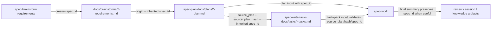

# feat: Add unified spec_id across requirements, plans, and task packs

## Overview

本计划为 `spec-brainstorm` 生成的需求文档、`spec-plan` 生成的技术方案、`spec-write-tasks` 生成的 task pack 增加统一 `spec_id`。目标是解决同一个需求在多个工件之间只能靠文件名、`origin`、`source_plan` 和人工上下文弱关联的问题，同时保持 spec-first 的核心方向：轻 contract、明确边界、让 LLM 基于更好的输入做判断。

`spec_id` 只表达“这些文档属于同一条需求/计划链路”。它不表达 freshness，不替代 `source_plan_hash`，不成为中心 registry，不引入 workflow 状态机，也不让脚本替 LLM 判断是否要生成 task pack 或是否可以执行。

---

## Problem Frame

当前链路已经有局部锚点：

- requirements 文档有 `date`、`topic`、R/A/F/AE ID，但没有跨文档身份字段。
- plan 文档有 `origin`、Requirements Trace、U-ID，但关联主要依赖路径和人工阅读。
- task pack 有 `source_plan` 和 `source_plan_hash`，能证明它派生自某份 plan 且未过期，但不能稳定表达“同一需求链路”的身份。
- `spec-work` 会消费 plan/task pack 中的 R/U/task refs，但同一需求的 artifacts 之间缺少统一、可机器读取、低漂移的 join key。

这会带来三个实际问题：

- 同一需求多次 deepening、重命名或 task pack 重建后，LLM 需要从路径和 prose 推断关联，决策输入弱。
- `source_plan_hash` 被迫承担身份感知语义，容易和 freshness/防 stale 的职责混淆。
- 后续如果要做 artifacts 查询、review trace、issue 关联或 sessions 检索，只能靠文本搜索，可靠性不足。

---

## Requirements Trace

**Artifact Identity Contract**
- R1. requirements、plan、task pack 必须共享同一个 `spec_id`，用于表达同一需求链路的稳定身份。
- R2. `spec_id` 必须是轻 contract：可读、可复制、可机器校验格式，但不引入中心 registry、状态机或全局唯一服务。
- R3. `spec_id` 不得替代 `origin`、`source_plan`、`source_plan_hash`、R/A/F/AE ID、U-ID 或 task_id；每个字段保留单一职责。
- R11. 方案必须显式区分 identity 与 freshness：`spec_id` 解决跨文档关联，`source_plan_hash` 解决 task pack 是否还能执行。

**Generation and Inheritance**
- R4. `spec-plan` 从 origin requirements 生成 plan 时必须继承已有 `spec_id`；没有 origin 时必须生成新的 `spec_id` 并写入 plan frontmatter。
- R5. `spec-brainstorm` 生成 requirements 时必须写入新的 `spec_id`；新 requirements 默认文件名使用 `docs/brainstorms/YYYY-MM-DD-NNN-<slug>-requirements.md` 并与 frontmatter 对齐，但机器 contract 以 frontmatter 为准。
- R6. `spec-write-tasks` 生成 task pack 时必须继承 source plan 的 `spec_id`，并在 schema 中声明它是 identity 字段，不参与 stale 判定。
- R7. `spec-work` 和 `spec-work-beta` 消费 plan/task pack 时必须保留 `spec_id` 作为 trace context；当 task pack 的 `spec_id` 与 source plan 不一致时，必须把它视为 handoff 风险并停止或要求重建。
- R12. 方案必须支持已有文档渐进兼容：旧 requirements/plan/task pack 没有 `spec_id` 时，LLM 可以继续用现有 `origin` / `source_plan` 路径；新生成文档必须写入 `spec_id`。

**Workflow and Runtime Boundaries**
- R8. 现有 command-backed workflow 边界必须保持：`spec-plan`、`spec-work` 是 public workflow entry，`spec-write-tasks` 仍是 standalone optional derived layer。
- R9. Claude / Codex runtime sync 必须能把更新后的 skill contract 分发到 `.claude/` / `.agents/`，不需要手改 generated artifacts。

**Verification**
- R10. 单元测试必须覆盖 `spec_id` 的契约、继承、task pack schema、work 消费边界和 dual-host runtime sync 关键锚点。

---

## Scope Boundaries

- 不新增 `/spec:write-tasks` 或 `$spec-write-tasks`；`spec-write-tasks` 继续是 standalone skill。
- 不让 `spec-plan` 自动决定或自动调用 `spec-write-tasks`；plan 结束后仍通过 handoff menu 暴露选择。
- 不让 `spec-work` 自动生成 task pack；它只消费 plan 或已验证 task pack。
- 不引入 `.spec-first/specs/registry.json`、数据库表、全局 sequence allocator 或 artifact 状态机。
- 不把 `spec_id` 用作权限、审批、完成状态、执行进度、freshness 或质量分数。
- 不批量迁移历史文档；历史文档兼容由 workflow 文案和测试保护。
- 不改变 R/A/F/AE、U-ID、task_id 的局部语义；这些仍分别服务 requirements、plan、task pack 内部 trace。

### Deferred to Follow-Up Work

- Artifact search/index：未来可以用 CRG 或单独脚本按 `spec_id` 查询相关 requirements/plan/task pack/review artifacts，但本轮只定义和落地字段 contract。
- Issue / PR / session 关联：后续可把 `spec_id` 带入 issue body、PR description 或 session summary；本轮不扩展这些 workflow。
- 旧文档迁移工具：如果历史文档检索价值变高，再规划一个只做 frontmatter backfill 的明确脚本。

---

## Context & Research

### Relevant Code and Patterns

- `skills/spec-brainstorm/references/requirements-capture.md`：requirements frontmatter 当前只有 `date`、`topic`，并定义 R/A/F/AE 局部 ID。
- `skills/spec-plan/SKILL.md`：plan frontmatter 当前包含 `title`、`type`、`status`、`date`、可选 `origin` / `deepened`；plan 通过 Requirements Trace 和 U-ID 保留需求到实现单元的 trace。
- `skills/spec-plan/references/plan-handoff.md`：plan 完成后通过菜单选择 `spec-work`、`spec-write-tasks`、Issue 或 Proof；其中明确 `spec-write-tasks` 是 standalone skill，不是 command-backed workflow。
- `skills/spec-write-tasks/SKILL.md`：task pack 是 `spec-plan` 与 `spec-work` 之间的可选派生层，不能成为第二份 plan；`source_plan_hash` 用于防 stale。
- `skills/spec-write-tasks/references/task-pack-schema.md`：task pack frontmatter 已要求 `source_plan`、`source_plan_hash`、`generated_by`、`mode`、`source_sections`。
- `skills/spec-work/SKILL.md` 与 `skills/spec-work-beta/SKILL.md`：执行前会读取 plan/task pack，并在 task pack 输入时校验 `source_plan_hash`，失败时拒绝执行。
- `tests/unit/spec-write-tasks-contracts.test.js`：已有 task pack contract 测试，适合扩展 `spec_id` schema 和 work 消费断言。
- `tests/unit/spec-plan-contracts.test.js`：当前只覆盖 CRG hook contract，可增加 plan metadata / handoff identity contract。
- `src/cli/plugin.js`：runtime sync 的高价值 skill anchors 是当前 generated assets 质量门，必要时可增加 `spec_id` anchor。
- `src/cli/contracts/dual-host-governance/skills-governance.json`：`spec-write-tasks` 当前为 `standalone_skill`，`spec-plan` / `spec-work` 为 `workflow_command`，该边界不应被本改动改变。

### Institutional Learnings

- `docs/10-prompt/项目角色.md`：脚本执行确定性流程，LLM 执行语义分析；优先提升输入质量，而不是增加流程控制。
- `docs/solutions/workflow-issues/modify-source-not-artifacts-2026-04-13.md`：修改 source-of-truth 后通过 init/sync 生成 runtime assets，不手改 `.claude/` / `.agents/`。
- `docs/solutions/workflow-issues/database-routing-and-dual-view-refresh-boundaries-2026-04-20.md`：不要把事实层、projection 和运行态 readiness 混成厚状态机；字段要单一职责。

### External References

- 未使用外部研究。本计划是仓库内 workflow contract 与 artifact metadata 设计，现有 source、tests 和项目角色文档足以支撑。

### CRG Planning Input

- `spec-first crg hook before-plan --task="为需求文档、技术方案 plan、开发任务 task 增加统一 spec_id 关联机制" --repo=.` 返回 graph ready，但 `code-navigation.json` 缺失。
- `spec-first crg locate --query="spec_id frontmatter requirements plan task pack source_plan_hash"` 未找到候选，说明 `spec_id` 不是现有 contract，需要新增。

---

## Key Technical Decisions

- **`spec_id` 格式采用 `YYYY-MM-DD-NNN-<slug>`**：与现有 `docs/plans/YYYY-MM-DD-NNN-...` 命名习惯一致，可读、可手工创建、可排序。示例：`2026-04-26-002-unified-spec-id`。
- **`spec_id` 是 identity，不是 freshness**：task pack 仍必须依赖 `source_plan_hash` 判断是否 stale；`spec_id` mismatch 是身份链路错误，hash mismatch 是派生内容过期。
- **不新增中心 registry**：`spec_id` 写在 artifacts frontmatter 中，由 LLM 和轻量 lint 消费。脚本最多检查格式、一致性和 source path 是否存在，不判断语义质量。
- **生成规则本地 deterministic，但不中心化**：新 requirements 使用 `docs/brainstorms/YYYY-MM-DD-NNN-<slug>-requirements.md`，`spec_id` 为 `YYYY-MM-DD-NNN-<slug>`；`NNN` 通过扫描同日已存在的 sequenced requirements frontmatter/文件名选择下一个序号，忽略旧的 non-sequenced legacy 文件。Direct-entry plan 没有 origin 时使用 plan 文件序号生成新的 `spec_id`。从 origin 生成的 plan 继承 origin `spec_id`，即使 plan 文件名包含额外 `<type>` 片段。
- **本地碰撞检查是确定性校验，不是 registry**：生成新 `spec_id` 前扫描 `docs/brainstorms/`、`docs/plans/`、`docs/tasks/` 的 frontmatter；如果相同 `spec_id` 已存在且不能通过 `origin` / `source_plan` 证明属于同一链路，则递增 `NNN` 或要求用户确认。脚本只检查格式、存在性和可解析路径，不判断语义等价。
- **继承优先，但链路边界要显式**：普通编辑、plan deepening、task pack 重建和同一 source plan 的 work/review handoff 保持同一 `spec_id`。替代实现方案、拆成独立交付链路、abandon-and-replace、或同一 requirements 下并行探索互斥方案时，由 LLM 判断是否新建 spec chain，并在 plan frontmatter 附近或 Problem Frame 中说明为何继承或新建。
- **文件名默认对齐，但 frontmatter 是机器 contract**：新 requirements/task pack 生成时默认把 `spec_id` 放进文件名；已有文件重命名或人工移动不改变身份判断。机器读取以 frontmatter 为准，文件名用于可读性、排序和碰撞排查。
- **旧文档兼容为显式弱 trace**：旧 requirements 缺失 `spec_id` 时，plan 可以生成新的 plan-local `spec_id`，但必须说明 origin identity 未被继承、trace confidence 较弱，且默认不回写 origin。旧 plan 缺失 `spec_id` 时，`spec-write-tasks` 不生成 executable task pack；它必须要求先回到 `spec-plan` 补齐 plan frontmatter，或只生成 `draft` / `transient` 非执行 task pack。
- **`spec-write-tasks` 继续 standalone**：`spec_id` 增强它的派生输入质量，不把它提升为 command-backed workflow，也不让 plan/work 自动调用它。
- **测试优先覆盖 contract 文本和 runtime sync**：当前这些 workflow 大多是 prompt/skill contract，不是可执行 parser；测试应锁定 source skill、schema、work guardrail 和 sync 后 Codex runtime skill 的关键语句。只有当现有 unit sync 测试无法证明 runtime drift 风险时，才扩展 `src/cli/plugin.js` high-value anchors 或 smoke tests。

---

## Open Questions

### Resolved During Planning

- **是否把 `spec-write-tasks` 提升为 command-backed workflow？** 不提升。当前价值是可选 task pack 派生层，提升为 command-backed entry 会增加用户心智和入口治理成本，且不能解决 identity 关联问题。
- **`spec_id` 是否替代 `source_plan_hash`？** 不替代。二者职责不同：`spec_id` 关联链路，`source_plan_hash` 防止 stale task pack 被执行。
- **是否需要脚本自动生成全局唯一 ID？** 不需要。按当前日期、同日本地序号和 slug 生成即可；唯一性由 frontmatter 扫描、文件名默认对齐和轻量碰撞检查支撑，不引入中心状态。
- **legacy requirements 缺失 `spec_id` 时是否回写 origin？** 默认不回写。plan 生成新的 plan-local `spec_id` 并显式标注 weak trace；如用户需要完整链路 identity，可单独执行 backfill/migration follow-up。
- **旧 plan 缺失 `spec_id` 时能否生成 executable task pack？** 不能。executable task pack 必须继承 source plan `spec_id`；旧 plan 需要先回到 `spec-plan` 补齐 frontmatter，或者只生成 draft/transient task pack。
- **plan 本身是否可以先 dogfood `spec_id`？** 可以。本计划 frontmatter 已写入 `spec_id: 2026-04-26-002-unified-spec-id`，作为目标 contract 的示例，不要求当前工具已经 enforce。

### Deferred to Implementation

- **具体 slug 归一化细节**：实现时沿用现有 plan filename 的 kebab-case 生成规则即可，不需要新增复杂 slug 库。
- **是否为 `spec_id` 增加独立 deterministic lint 脚本**：本轮优先通过 contract tests 锁定文本和 schema；如实现中发现多个 workflow 需要相同检查，再抽轻量 helper。

---

## High-Level Technical Design

> *This illustrates the intended approach and is directional guidance for review, not implementation specification. The implementing agent should treat it as context, not code to reproduce.*



字段职责：

| Field | Scope | Purpose | Must Not Do |
| --- | --- | --- | --- |
| `spec_id` | requirements / plan / task pack | 关联同一需求链路 | 不判断 stale、不表达状态、不替代 hash |
| `origin` | plan | 指向上游 requirements 或输入来源 | 不证明 task pack freshness |
| `source_plan` | task pack | 指向唯一 source plan | 不替代 plan 内容 |
| `source_plan_hash` | task pack | 判断 task pack 是否从当前 plan 派生 | 不表达业务身份 |
| R/A/F/AE | requirements / plan trace | 表达产品意图和验收例 | 不跨需求全局唯一 |
| U-ID | plan / work trace | 表达 plan-local implementation unit | 不替代 task splitting |
| `task_id` | task pack | 表达 task pack 内部执行 slice | 不成为进度数据库 |

Proposed frontmatter examples:

```yaml
---
date: 2026-04-26
topic: unified-spec-id
spec_id: 2026-04-26-002-unified-spec-id
---
```

```yaml
---
title: feat: Add unified spec_id across requirements, plans, and task packs
type: feat
status: active
date: 2026-04-26
spec_id: 2026-04-26-002-unified-spec-id
origin: docs/brainstorms/2026-04-26-002-unified-spec-id-requirements.md
---
```

```yaml
---
title: "Task Pack: Add unified spec_id across requirements, plans, and task packs"
type: "task-pack"
status: "derived"
date: "2026-04-26"
spec_id: "2026-04-26-002-unified-spec-id"
source_plan: "docs/plans/2026-04-26-002-feat-unified-spec-id-plan.md"
source_plan_hash: "sha256:<64-hex>"
generated_by: "spec-write-tasks"
mode: "derived"
source_sections:
  - "Requirements Trace"
  - "Scope Boundaries"
  - "Implementation Units"
---
```

---

## Implementation Units

- U1. **Define the `spec_id` Artifact Contract**

**Goal:** 在 brainstorm requirements、plan、task pack 的 source contract 中定义 `spec_id` 的格式、职责和兼容语义。

**Requirements:** R1, R2, R3, R5, R6, R11, R12

**Dependencies:** None

**Files:**
- Modify: `skills/spec-brainstorm/references/requirements-capture.md`
- Modify: `skills/spec-plan/SKILL.md`
- Modify: `skills/spec-write-tasks/SKILL.md`
- Modify: `skills/spec-write-tasks/references/task-pack-schema.md`
- Modify: `CHANGELOG.md`
- Test: `tests/unit/spec-plan-contracts.test.js`
- Test: `tests/unit/spec-write-tasks-contracts.test.js`

**Approach:**
- Add `spec_id` to requirements frontmatter template with format guidance `YYYY-MM-DD-NNN-<slug>`.
- Add `spec_id` to plan frontmatter template and planning rules.
- Add `spec_id` to task pack schema required frontmatter for executable handoff.
- State clearly that `spec_id` is identity-only and `source_plan_hash` remains freshness-only.
- Define the new requirements filename convention: `docs/brainstorms/YYYY-MM-DD-NNN-<slug>-requirements.md`; choose `NNN` by scanning same-day sequenced requirements and ignore legacy non-sequenced files for numbering.
- Define local collision handling: scan `docs/brainstorms/`, `docs/plans/`, and `docs/tasks/` frontmatter before minting a new `spec_id`; reuse only when origin/source links prove the same chain, otherwise increment or ask.
- Preserve legacy compatibility wording: old docs without `spec_id` remain readable; new generated docs must include it.
- Add `CHANGELOG.md` entry because this changes project source/workflow contracts.

**Patterns to follow:**
- `skills/spec-brainstorm/references/requirements-capture.md` ID and layout rules.
- `skills/spec-plan/SKILL.md` Phase 3.1 and Core Plan Template.
- `skills/spec-write-tasks/references/task-pack-schema.md` required frontmatter table.

**Test scenarios:**
- Happy path: contract tests find `spec_id: YYYY-MM-DD-NNN-<slug>` in requirements and plan templates.
- Happy path: requirements capture contract names the sequenced requirements filename convention and same-day sequence source.
- Happy path: task pack schema lists `spec_id` as required frontmatter and labels it as identity, not freshness.
- Edge case: task pack schema still requires `source_plan_hash: "sha256:<64-hex>"`; adding `spec_id` does not loosen stale rejection.
- Edge case: ID collision with an unrelated existing artifact is rejected or forces a new local sequence value.
- Governance: source contract changes are paired with `CHANGELOG.md`.

**Verification:**
- Source skill docs and schema have a single, consistent definition of `spec_id`.
- Tests fail if future edits remove the identity/freshness distinction.

---

- U2. **Carry `spec_id` Through Brainstorm to Plan**

**Goal:** 让 `spec-plan` 在有 origin requirements 时继承 `spec_id`，无 origin 时生成新的 `spec_id`，并在 plan 中保留 trace。

**Requirements:** R1, R3, R4, R5, R10, R12

**Dependencies:** U1

**Files:**
- Modify: `skills/spec-plan/SKILL.md`
- Modify: `skills/spec-plan/references/deepening-workflow.md`
- Modify: `skills/spec-plan/references/plan-handoff.md`
- Test: `tests/unit/spec-plan-contracts.test.js`

**Approach:**
- In Phase 0.3, instruct plan generation to read origin frontmatter and carry `spec_id` forward when present.
- In Phase 0.4/3.1, instruct direct-entry planning to generate a new `spec_id` from the plan filename sequence and slug.
- If the origin requirements document lacks `spec_id`, generate a new plan-local `spec_id`, note that origin identity was not inherited, and do not modify the origin document unless the user explicitly asks for a backfill.
- Add chain-boundary guidance: normal edits and deepening preserve `spec_id`; alternative implementation plans, independent delivery chains, or abandon-and-replace plans require an explicit LLM decision to inherit or create a new spec chain.
- In final review checks, add a lightweight check: if origin has `spec_id`, plan frontmatter should match; if it does not, record why.
- In deepening workflow, state that existing `spec_id` is stable and must not be changed during plan deepening or edits.
- In handoff, surface `spec_id` only as trace context; do not add a new menu option or new workflow branch.

**Patterns to follow:**
- Existing origin carry-forward rules in `skills/spec-plan/SKILL.md` Phase 0.3.
- Existing U-ID stability rules in `skills/spec-plan/SKILL.md` Phase 3.5.

**Test scenarios:**
- Happy path: `spec-plan` contract contains “inherit origin `spec_id`” wording.
- Happy path: direct-entry plan contract contains “generate a new `spec_id`” wording.
- Edge case: legacy origin without `spec_id` produces a plan-local `spec_id` and weak-trace note without rewriting origin.
- Edge case: deepening contract says existing `spec_id` must not be regenerated or renumbered.
- Edge case: alternative or replacement plan documents must explicitly state why they inherit or create a new spec chain.
- Integration: plan handoff continues to list the same five options and does not introduce command-backed `spec-write-tasks`.

**Verification:**
- A new plan can be read as belonging to a specific spec chain without relying only on filename or `origin` prose.

---

- U3. **Carry `spec_id` Through Task Pack Compilation**

**Goal:** 让 `spec-write-tasks` 继承 source plan 的 `spec_id`，并让 task pack validation 检查 identity consistency 和 hash freshness 两条独立线。

**Requirements:** R1, R3, R6, R7, R8, R10, R11, R12

**Dependencies:** U1, U2

**Files:**
- Modify: `skills/spec-write-tasks/SKILL.md`
- Modify: `skills/spec-write-tasks/references/task-pack-schema.md`
- Modify: `skills/spec-write-tasks/references/task-quality-guide.md`
- Test: `tests/unit/spec-write-tasks-contracts.test.js`

**Approach:**
- Add compilation rule: executable task pack must copy `spec_id` from source plan frontmatter.
- Add validation rule: when validating existing task pack, read source plan and confirm task pack `spec_id` matches source plan `spec_id` when both exist.
- If the source plan lacks `spec_id`, do not write an executable task pack. Require returning to `spec-plan` to add plan frontmatter, or write only a draft/transient task pack that is explicitly not valid `spec-work` input.
- If validating a legacy task pack whose source plan lacks `spec_id`, treat identity as unverifiable weak trace; do not pretend this is equivalent to hash verification.
- If `spec_id` mismatches, reject executable handoff and require rebuilding from the source plan.
- Keep `source_plan_hash` exactly as current freshness contract; hash mismatch remains stale rejection.
- Update quality guide examples to include `spec_id` only in frontmatter, not repeated in every task card.

**Patterns to follow:**
- `skills/spec-write-tasks/SKILL.md` Input Paths and Drift And Hash sections.
- `skills/spec-write-tasks/references/task-pack-schema.md` Validation Notes and Regeneration Rules.

**Test scenarios:**
- Happy path: schema example includes `spec_id` plus `source_plan_hash`.
- Happy path: source skill says task pack inherits `spec_id` from source plan.
- Edge case: `spec_id` mismatch is a handoff rejection separate from hash mismatch.
- Edge case: old source plan without `spec_id` cannot produce executable task pack; it returns to `spec-plan` or creates only draft/transient output.
- Edge case: existing legacy task pack with source plan missing `spec_id` is described as weak trace, not a successful full identity validation.
- Integration: runtime sync test for Codex includes the updated `spec_id` guardrails in `.agents/skills/spec-write-tasks/SKILL.md`.

**Verification:**
- Task pack can reduce context load while preserving a clear path back to the same spec chain and current source plan.

---

- U4. **Teach Workflows to Consume `spec_id` as Trace Context**

**Goal:** 让 `spec-work` 和 `spec-work-beta` 在读取 plan/task pack 时保留 `spec_id`，并在 task pack identity mismatch 时停止，而不是静默执行。

**Requirements:** R3, R7, R8, R10, R11, R12

**Dependencies:** U2, U3

**Files:**
- Modify: `skills/spec-work/SKILL.md`
- Modify: `skills/spec-work-beta/SKILL.md`
- Modify: `skills/spec-work/references/shipping-workflow.md`
- Modify: `skills/spec-work-beta/references/shipping-workflow.md`
- Test: `tests/unit/spec-work-contracts.test.js`
- Test: `tests/unit/spec-work-beta-contracts.test.js`
- Test: `tests/unit/spec-write-tasks-contracts.test.js`

**Approach:**
- In Phase 1 document reading, record `spec_id` when present and use it in blockers, deferred notes, and final summaries when useful.
- For task pack input, add validation after reading `source_plan`: if both task pack and source plan have `spec_id`, they must match.
- If mismatch, reject the task pack as wrong-chain handoff even if `source_plan_hash` shape looks valid.
- If missing from legacy docs, continue with existing `source_plan` / `source_plan_hash` / R/U refs and mark identity confidence as weaker only in reasoning, not as a hard failure.
- Keep the “do not edit plan body during execution” rule unchanged; `spec_id` does not create progress state.

**Patterns to follow:**
- Existing task pack validation block in `skills/spec-work/SKILL.md` and `skills/spec-work-beta/SKILL.md`.
- Existing stable R/U/task ref usage rules in work finalization.

**Test scenarios:**
- Happy path: work contract says it records `spec_id` as trace context when present.
- Happy path: task pack validation checks `spec_id` against source plan before creating execution tasks.
- Edge case: mismatch rejects handoff and asks to rerun `spec-write-tasks` or return to `spec-plan`.
- Edge case: legacy missing `spec_id` does not block direct plan execution.
- Integration: shipping workflow can mention `spec_id` in final summary when it helps traceability without turning it into a status field.

**Verification:**
- Execution gets a stronger identity input without changing the work loop into a state machine.

---

- U5. **Preserve Dual-Host Runtime and Governance Boundaries**

**Goal:** 确保 `spec_id` contract 在 Claude/Codex runtime sync 后仍存在，并且不改变 command-backed workflow / standalone skill 分层。

**Requirements:** R8, R9, R10

**Dependencies:** U1, U2, U3, U4

**Files:**
- Modify: `tests/unit/spec-write-tasks-contracts.test.js`
- Modify: `tests/unit/dual-host-governance-contracts.test.js`
- Test: `tests/unit/spec-write-tasks-contracts.test.js`
- Test: `tests/unit/dual-host-governance-contracts.test.js`

**Approach:**
- First extend existing unit-level runtime sync coverage, especially the `syncSkills` path that already verifies Codex runtime skill output.
- Treat Claude generated command/skill files and Codex `.agents/skills/...` runtime skill files as the generated surfaces in scope; `.codex/` is only in scope where existing adapter tests already prove it is a generated surface for this repo.
- Add `spec_id` to `src/cli/plugin.js` high-value anchor lists only if the unit sync test reveals runtime drift that current anchors cannot catch.
- Add or change smoke tests only if the public command/skill exposure changes; this plan should not change exposure.
- Keep `src/cli/contracts/dual-host-governance/skills-governance.json` entry for `spec-write-tasks` as `standalone_skill`.
- Ensure tests continue to assert `spec-plan` and `spec-work` are workflow commands while `spec-write-tasks` is standalone.
- Do not modify `.claude/`, `.codex/`, or `.agents/skills/` generated assets directly.

**Patterns to follow:**
- `tests/unit/spec-write-tasks-contracts.test.js` Codex runtime sync test.
- `src/cli/plugin.js` `HIGH_VALUE_SKILL_ANCHORS` and `HIGH_VALUE_COMMAND_ANCHORS`.
- `src/cli/contracts/dual-host-governance/skills-governance.json` entry surface taxonomy.

**Test scenarios:**
- Happy path: generated Codex runtime skill preserves task pack `spec_id` validation wording.
- Happy path: governance tests still identify `spec-write-tasks` as standalone, not command-backed.
- Edge case: no new `/spec:write-tasks` or `$spec-write-tasks` command appears in runtime manifests.
- Edge case: `src/cli/plugin.js` high-value anchors and smoke tests remain unchanged when unit runtime sync already proves the contract reaches generated assets.

**Verification:**
- The same source contract reaches both hosts without changing public workflow topology.

---

- U6. **Document and Validate End-to-End Trace Semantics**

**Goal:** 补充面向维护者和用户的说明，证明 `spec_id` 提升的是 LLM 决策输入质量，而不是新增强制流程。

**Requirements:** R1, R2, R3, R8, R11, R12

**Dependencies:** U1, U2, U3, U4, U5

**Files:**
- Create: `docs/contracts/workflows/spec-id-traceability.md`
- Test: `tests/unit/spec-plan-contracts.test.js`
- Test: `tests/unit/spec-write-tasks-contracts.test.js`
- Test: `tests/unit/spec-work-contracts.test.js`
- Test: `tests/unit/spec-work-beta-contracts.test.js`

**Approach:**
- Add a short contract doc explaining the chain: requirements `spec_id` -> plan `spec_id` -> task pack `spec_id` + `source_plan_hash` -> work trace. The doc should summarize and link to the source skill/schema contracts instead of becoming a second normative source.
- Use `docs/10-prompt/项目角色.md` as the non-modified design baseline: `spec_id` must remain a decision-input enhancement, not a new orchestration layer.
- Do not update `using-spec-first` or `src/cli/instruction-bootstrap.js` by default. Only touch those entry-governance surfaces if implementation discovers a concrete routing conflict caused by the new field.
- Add tests in the existing plan/task/work contract suites that prevent future wording from treating `spec_id` as a workflow state, progress database, or approval gate.

**Patterns to follow:**
- `docs/contracts/workflows/spec-work-run-artifact.schema.json` boundary style for workflow contracts.
- `skills/spec-plan/references/plan-handoff.md` existing boundary notes around `spec-write-tasks`.

**Test scenarios:**
- Happy path: docs describe identity/freshness/state as separate concepts.
- Edge case: tests reject wording that says `spec_id` controls execution state or replaces `source_plan_hash`.
- Integration: no entry-governance text changes are required unless the implementation demonstrates a concrete conflict.

**Verification:**
- Maintainers can explain the new field without over-promising hard enforcement.

---

## System-Wide Impact

- **Interaction graph:** `spec-brainstorm` creates identity; `spec-plan` inherits or creates it; `spec-write-tasks` inherits it and pairs it with freshness hash; `spec-work` consumes it as trace context.
- **Error propagation:** mismatch in task pack `spec_id` should stop task-pack execution as wrong-chain handoff; missing legacy `spec_id` should degrade trace confidence but not block old plan execution.
- **State lifecycle risks:** `spec_id` is immutable after artifact creation except when intentionally creating a new spec chain. Deepening and task pack regeneration must not regenerate it. Alternative or replacement plans must record why they inherit or create a new chain. It is not progress state.
- **API surface parity:** Claude and Codex must receive the same source skill contract through runtime sync; no new command surface is introduced.
- **Integration coverage:** unit contract tests should cover source skill wording, task pack schema, work consumption, runtime sync, and governance classification.
- **Unchanged invariants:** plan remains the single source of truth for technical approach; task pack remains derived; `source_plan_hash` remains executable freshness proof; LLM still decides whether a task pack is useful.

---

## Risks & Dependencies

| Risk | Mitigation |
| --- | --- |
| `spec_id` 被误用为 workflow 状态或审批 gate | 在 contract docs、skills 和 tests 中明确 identity-only，不表达 progress/ready/approved |
| `spec_id` 与 `source_plan_hash` 职责混淆 | task pack schema 同时列出两者，并说明 mismatch 类型不同：wrong-chain vs stale |
| 旧文档缺失字段导致 workflow 过度阻塞 | 旧 requirements 缺 `spec_id` 时生成 plan-local weak trace；旧 plan 缺 `spec_id` 时不生成 executable task pack |
| 新字段只写在文档里但 runtime assets 漂移 | 优先扩展现有 runtime sync unit tests；只有 unit tests 证明覆盖不足时才动 high-value anchors 或 smoke tests |
| 文件名与 frontmatter 不一致 | 新生成文件默认对齐；机器 contract 以 frontmatter 为准，重命名不破坏身份 |
| 本地 `spec_id` 碰撞导致错误 join | 生成新 ID 前扫描 artifact frontmatter；无 source-chain 证明时递增序号或要求用户确认 |
| plan deepening 意外重生成 `spec_id` | 在 deepening workflow 中加入稳定性规则，仿照 U-ID 不 renumber 的约束 |

---

## Documentation / Operational Notes

- 这不是自动代码生成能力，也不是新的状态管理系统；它是 artifact traceability contract。
- 用户可见变化主要是新生成 requirements/plan/task pack frontmatter 多一个 `spec_id`。
- 对团队协作的价值是同一需求链路可被人工和 LLM 更稳定地关联，尤其适合长计划、多次 deepening、task pack 重建、后续 review 或 issue/PR 关联。
- 对个人小改动的负担很低：字段由 workflow 生成，用户通常不需要手动维护。

---

## Success Metrics

- 新生成的 requirements、plan、task pack 都包含同一个 `spec_id`。
- task pack 同时保留 `spec_id` 和 `source_plan_hash`，且 tests 能证明二者职责不同。
- `spec-work` 能在 task pack mismatch 时拒绝执行；legacy plan 缺 `spec_id` 时不会被 task pack 当作 executable handoff。
- legacy requirements 缺 `spec_id` 时，plan 能生成 plan-local weak trace 而不回写 origin。
- Claude/Codex runtime sync 后关键 `spec_id` guardrails 仍存在。
- `spec-write-tasks` 仍是 standalone skill，没有新增 command-backed workflow。

---

## Sources & References

- `docs/10-prompt/项目角色.md`
- `skills/spec-brainstorm/references/requirements-capture.md`
- `skills/spec-plan/SKILL.md`
- `skills/spec-plan/references/plan-handoff.md`
- `skills/spec-write-tasks/SKILL.md`
- `skills/spec-write-tasks/references/task-pack-schema.md`
- `skills/spec-work/SKILL.md`
- `skills/spec-work-beta/SKILL.md`
- `tests/unit/spec-plan-contracts.test.js`
- `tests/unit/spec-write-tasks-contracts.test.js`
- `tests/unit/spec-work-contracts.test.js`
- `tests/unit/spec-work-beta-contracts.test.js`
- `src/cli/plugin.js`
- `src/cli/contracts/dual-host-governance/skills-governance.json`
