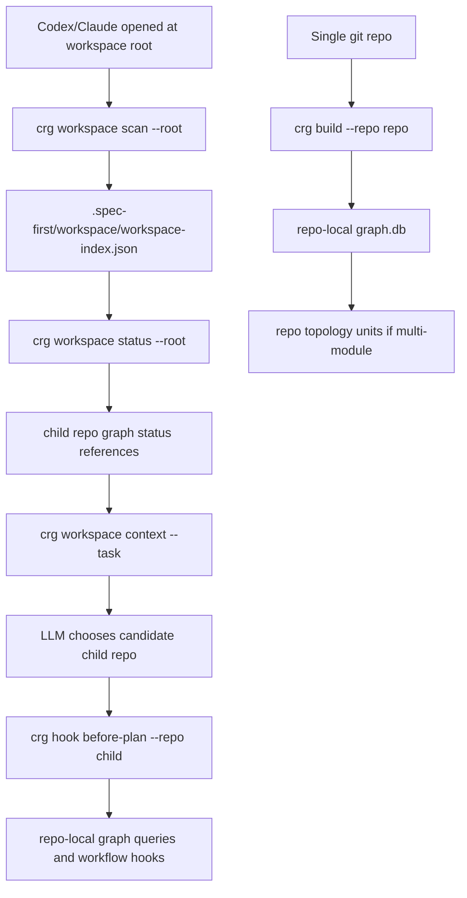

# feat: Add CRG Workspace Topology Support

## Overview

Add CRG-native topology support for the three repository shapes that matter to agent workflows:

- Parent-directory workspace containing multiple independent git repositories
- Single git repository containing multiple modules/packages
- Single git repository containing one project

The implementation must not restore the retired Stage-0 stack. The current CRG query-first model remains the source of truth: child repositories own their own `.spec-first/graph/graph.db`, and a parent workspace only owns lightweight discovery, status, and candidate-selection facts.

Delivery should be phased. The first release should validate the parent-workspace workflow because that is the immediate Codex/Claude failure mode. Repo-local module units should follow once workspace scan/status/context is stable, unless implementation proves they are needed to make the parent-workspace flow usable.

---

## Problem Frame

The previous topology plan correctly identified the product problem: users often open Codex or Claude at a parent workspace directory that contains multiple independent git projects, while the current CRG runtime assumes one `--repo=<path>` maps to one repository graph. If the parent directory is treated as a repo, graph facts, git diff, work-run handoff, and review context can all point at the wrong boundary.

The earlier plan was written for Stage-0 outputs (`fact-inventory.json`, `stage0-context`, `minimal-context`, `context-routing`). Those surfaces are now retired. The useful part to carry forward is the model: topology facts, selection facts, and readiness facts are deterministic inputs; LLMs choose the target repo/module and verification strategy.

---

## Requirements Trace

### Workspace Boundaries

- R1. A parent directory with multiple child git repos must be recognized as a workspace without building one mixed parent graph.
- R2. Each child repo must keep its own CRG artifacts under the child repo, including `graph.db`, generation pointers, status, navigation, operation log, and work runs.
- R3. Workspace root artifacts must be lightweight control-plane facts: child repo registry, per-child graph readiness, and candidate repo recommendations.

### Repo-Local Topology

- R4. Single git repo multi-module projects must be represented as repo-local topology units, not as fake child repos.
- R5. Single git repo single-project behavior must remain the default and must not regress.

### Workflow Behavior

- R6. Workflow skills must guide agents differently when they are opened at a workspace root: first identify candidate child repos, then run repo-local CRG hooks.
- R7. Readiness summaries and candidate scores are advisory only; they must not become gates or hard routing state machines.

### Governance And Retirement

- R8. Generated schemas, tests, and docs must make the unsupported Stage-0 surfaces stay retired.

---

## Scope Boundaries

- Do not restore `src/bootstrap-compiler/`, `src/context-routing/`, `stage0-context`, `minimal-context`, `docs/contexts`, or `docs/contracts/spec-graph-bootstrap`.
- Do not create a parent-level `graph.db` that merges multiple independent child repos.
- Do not make modules independent repo graphs or give them repo-level generation pointers.
- Do not build a general cross-repo dependency graph in this iteration.
- Do not auto-decide the semantic target repo for a task; scripts may rank candidates, but LLMs choose.

### Deferred to Follow-Up Work

- Cross-repo semantic edges and dependency inference across child repos: defer until workspace registry and per-child graph readiness prove stable.
- Gradle, Cargo, and arbitrary ecosystem module detectors: defer after Maven and JavaScript workspace signals are in place.
- Optional visualization of workspace topology: defer until CLI JSON contracts are stable.
- Full module-unit rollout may be split after the parent-workspace release if scope pressure appears. The first release must not block on Maven/npm/pnpm module detection unless the workspace UX depends on it.

---

## Context & Research

### Relevant Code and Patterns

- `src/crg/cli/router.js` is the CRG command dispatcher and should gain a `workspace` command handler.
- `src/crg/artifact-paths.js` centralizes path constants and should gain workspace artifact path resolvers.
- `src/crg/cli/build.js` owns repo-local graph generation and should remain repo-local.
- `src/crg/generations/paths.js` resolves active repo graph DBs and should not be reused for parent-level mixed graphs.
- `src/crg/workflow-context/stage.js` builds stage-specific decision inputs and currently assumes one repo root.
- `src/crg/hooks/*` provide advisory lifecycle hooks and are the right model to preserve.
- `src/crg/input-convergence.js` already handles large monorepo file collection inside a single git repo; topology units should layer above it.
- `tests/unit/stage0-context-command.test.js`, `tests/unit/stage0-context-monorepo.test.js`, and `tests/unit/workspace-nested-topology.test.js` currently assert Stage-0 retirement. New tests should keep that invariant.

### Institutional Learnings

- `docs/plans/2026-04-19-008-topology-unified-bootstrap-plan.md` provides the correct conceptual split between workspace, monorepo, and single repo, but its implementation units target retired Stage-0 files.
- Current CRG cutover work established that `graph.db` is the code fact source and JSON control-plane artifacts are navigation/status/advisory surfaces.

### External References

- VS Code multi-root workspaces use an explicit workspace file listing root folders and group search/source-control behavior by folder. This supports a workspace registry model rather than treating the parent folder as one project. Source: https://code.visualstudio.com/docs/editing/workspaces/multi-root-workspaces
- Nx affected uses Git changes plus a project graph to identify affected projects. This supports deterministic changed-file-to-unit mapping with LLM judgment on final action. Source: https://nx.dev/docs/features/ci-features/affected
- Turborepo separates package graph from task graph and derives the package graph from the package manager workspace. This supports keeping module/package topology distinct from execution decisions. Source: https://turborepo.com/repo/docs/core-concepts/package-and-task-graph
- Maven reactor collects modules, sorts them by declared module relationships, and supports building selected projects with dependencies/dependents. This makes Maven `<modules>` a high-confidence module unit signal. Source: https://maven.apache.org/guides/mini/guide-multiple-modules.html
- npm workspaces are declared in `package.json` and allow running commands in one or all configured workspaces. This supports reading JavaScript workspace declarations as module/package units. Source: https://docs.npmjs.com/cli/v7/using-npm/workspaces

---

## Key Technical Decisions

- Use `crg workspace <action>` instead of overloading `crg build --repo=<workspace-root>`: this keeps repo-local graph behavior intact and makes parent-directory semantics explicit.
- Store parent workspace artifacts under `.spec-first/workspace/`, not `.spec-first/graph/`: this avoids confusing workspace facts with repo graph facts.
- Keep child graph artifacts in each child repo: parent workspace status references child graph status rather than copying or merging child DBs.
- Represent monorepo modules as repo-local topology units: modules improve selection and review focus but do not get independent graph generations.
- Prefer declarative module signals first: Maven `pom.xml <modules>`, npm `package.json workspaces`, and pnpm `pnpm-workspace.yaml` are stronger than directory naming heuristics.
- Use advisory candidate ranking only: `workspace context` can rank child repos by path/name/graph/git signals, but it must return candidates and recommended commands rather than making the decision.
- Parent workspace discovery must not stop just because the root itself is a git repo. Umbrella repos and superprojects can still contain independent child repos, so discovery should surface the root repo and nested child repos as candidates instead of silently choosing the parent.
- Bulk workspace build must be opt-in. The primary first-run path is `scan -> status -> context -> selected child repo build/hook`; building every child repo requires explicit selection such as `--all`.

---

## Open Questions

### Resolved During Planning

- Should this revive Stage-0 topology? No. The plan must be CRG-native because Stage-0 runtime files are intentionally retired.
- Should parent workspaces have a combined graph DB? No. Independent git repos keep independent graph DBs; the parent owns only registry/status/candidate facts.
- Should monorepo modules become child repos? No. Modules remain repo-local topology units.

### Deferred to Implementation

- Exact candidate scoring weights for `workspace context`: defer to implementation after fixture data exists; the contract should expose reasons, not depend on one fragile score.
- Exact pnpm workspace YAML parser choice: use structured parsing if the repo already has a YAML helper; otherwise keep first implementation narrow and tested.
- Exact Maven XML parser strategy: default to a narrow, dependency-free extractor for simple reactor POMs unless implementation chooses to add and justify an XML parser dependency.
- Whether to expose `--json` flags separately: current CRG commands already output JSON envelopes, so only add if implementation reveals ambiguity.

---

## Output Structure

```text
src/crg/
  commands/
    workspace.js
  workspace/
    artifacts.js
    discovery.js
    status.js
    context.js
  topology/
    modules.js
docs/contracts/crg/
  workspace-index.schema.json
  workspace-status.schema.json
  repo-topology.schema.json
tests/unit/
  crg-workspace-artifacts.test.js
  crg-workspace-discovery.test.js
  crg-workspace-command.test.js
  crg-topology-modules.test.js
tests/e2e/
  crg-workspace-mainline.sh
```

---

## High-Level Technical Design

> *This illustrates the intended approach and is directional guidance for review, not implementation specification. The implementing agent should treat it as context, not code to reproduce.*



The workspace root never owns a merged `graph.db`. It owns a registry and readiness view. Child repos own graph facts. Monorepo module units enrich a single repo graph.

---

## Implementation Units

- U1. **Add CRG Workspace Artifact Paths And Schemas**

**Goal:** Establish the durable parent-workspace control-plane layout.

**Requirements:** R1, R2, R3, R7

**Dependencies:** None

**Files:**
- Modify: `src/crg/artifact-paths.js`
- Create: `src/crg/workspace/artifacts.js`
- Create: `docs/contracts/crg/workspace-index.schema.json`
- Create: `docs/contracts/crg/workspace-status.schema.json`
- Test: `tests/unit/crg-workspace-artifacts.test.js`

**Approach:**
- Add resolvers for `.spec-first/workspace/`, `workspace-index.json`, `workspace-status.json`, and optional workspace operation log.
- Define `workspace-index/v1` as stable discovery facts: workspace root, discovered child repos, child slug, child repo root, git root, discovery signals, ignored candidates, generated time.
- Define `workspace-status/v1` as advisory readiness facts: child graph state, active DB path if available, node/edge counts, limitations, observed time.
- Keep artifact paths separate from `.spec-first/graph/` so parent workspace facts cannot be mistaken for repo graph facts.

**Patterns to follow:**
- `src/crg/artifact-paths.js`
- `docs/contracts/crg/graph-index-status.schema.json`
- `tests/unit/crg-artifact-paths.test.js`

**Test scenarios:**
- Happy path: resolving workspace artifact paths for a root returns `.spec-first/workspace/*` paths.
- Edge case: child slug normalization is deterministic and prevents path traversal.
- Error path: invalid or empty workspace root is rejected by public helpers if helper validation is added.
- Contract: sample workspace index/status payloads validate against schemas.

**Verification:**
- Workspace artifacts are path-isolated from repo graph artifacts.
- Schemas can validate representative parent workspace and child readiness payloads.

---

- U2. **Implement Workspace Discovery And Status**

**Goal:** Let a parent directory discover child git repos and summarize their graph readiness without building a mixed graph.

**Requirements:** R1, R2, R3, R7

**Dependencies:** Existing repo-local CRG build/status helpers. U1 is only needed if the shared `docs/contracts/crg/` schema directory conventions are introduced there first.

**Files:**
- Create: `src/crg/workspace/discovery.js`
- Create: `src/crg/workspace/status.js`
- Test: `tests/unit/crg-workspace-discovery.test.js`

**Approach:**
- Start candidate discovery with a bounded filesystem scan, then validate git roots instead of assuming `.git` is always a directory. Candidate detection should recognize both `.git` directories and `.git` files, then confirm roots with `git -C <candidate> rev-parse --show-toplevel` or an equivalent helper.
- Skip generated and dependency directories using the same spirit as CRG input convergence: `.spec-first`, `.git`, `node_modules`, `dist`, `build`, `coverage`, `vendor`, `.claude`, `.codex`, `.agents`.
- Always scan for nested child repos, even when the workspace root itself has `.git`. If both the root repo and nested independent repos exist, classify the container as a parent workspace with a root-repo candidate and child-repo candidates rather than silently selecting the root.
- For each child repo, read graph readiness using existing graph status helpers rather than opening or copying child DBs manually.
- If exactly one child repo is discovered under a non-git parent, keep parent-workspace artifact semantics but return a direct repo-local recommendation for the only child. There is no semantic candidate choice to make, but the parent still must not become the graph root.
- Define a freshness contract for `workspace-index.json`: `status` and `context` should rescan or compare a root fingerprint before returning commands, and stale/deleted/renamed child paths must appear as limitations rather than ready candidates.

**Execution note:** Characterize discovery before integrating it into CLI routing; false positives here can poison downstream planning.

**Patterns to follow:**
- `src/crg/workflow-context/status.js`
- `src/crg/input-convergence.js`
- `tests/unit/workspace-nested-topology.test.js`

**Test scenarios:**
- Happy path: parent with `repo-a/.git` and `repo-b/.git` produces two child repo records.
- Edge case: parent root with its own `.git` plus nested independent child repos returns both the root repo and child repos as candidates.
- Edge case: child repo with a `.git` file, such as a worktree or submodule shape, is discovered after git-root validation.
- Edge case: parent with one child repo remains parent-workspace controlled when parent has no `.git`, but `context` recommends the only child repo directly.
- Edge case: nested generated directories such as `node_modules/pkg/.git` are ignored.
- Edge case: slug collision between `repo-a` and another path with the same basename is resolved deterministically.
- Error path: unreadable child directories produce limitations without failing the entire scan.
- Error path: invalid `.git` files or failed `rev-parse` checks produce limitations without failing the entire scan.
- Stale path: added, removed, and renamed child repos after an existing workspace index are reflected in refreshed status/context output.
- Integration: a child repo with ready CRG graph contributes ready status; a child without graph contributes missing status.

**Verification:**
- Discovery produces deterministic output order and stable slugs.
- Status summarizes child graph readiness without creating parent `.spec-first/graph/graph.db`.

---

- U3. **Add `crg workspace` CLI Actions**

**Goal:** Expose workspace scan/status/build/context as CRG query-first commands.

**Requirements:** R1, R2, R3, R6, R7

**Dependencies:** U1, U2

**Files:**
- Modify: `src/crg/cli/router.js`
- Create: `src/crg/commands/workspace.js`
- Create: `src/crg/workspace/context.js`
- Test: `tests/unit/crg-workspace-command.test.js`
- Test: `tests/e2e/crg-workspace-mainline.sh`

**Approach:**
- Add `workspace` to CRG subcommands with action dispatch:
  - `spec-first crg workspace scan --root=<workspace>`
  - `spec-first crg workspace status --root=<workspace>`
  - `spec-first crg workspace build --root=<workspace> --repo=<child-slug-or-path>`
  - `spec-first crg workspace build --root=<workspace> --all`
  - `spec-first crg workspace context --root=<workspace> --task="<task>"`
- `scan` writes `workspace-index.json`.
- `status` reads or refreshes discovery facts and emits child readiness.
- `build` is state-changing and must require explicit scope. With `--repo=<child>`, it builds one selected child repo. With `--all`, it loops over every discovered child repo and preserves each child `.spec-first/graph/`.
- For `--all`, avoid calling repo-local build handlers directly while they still write stdout/stderr and call `process.exit`. Either extract a pure build core or spawn the repo-local CLI per child and aggregate each child result. The simpler first implementation may use child processes and produce workspace-level degraded output for partial failures.
- Define aggregate exit semantics for bulk build: partial success returns a degraded envelope with per-child limitations; all children failing exits non-zero.
- `context` returns candidate child repos, match reasons, readiness, and recommended repo-local hook commands.
- All actions return the existing `crg-cli/v1` envelope shape.

**Patterns to follow:**
- `src/crg/commands/hook.js`
- `src/crg/commands/workflow-context.js`
- `src/crg/cli/envelope.js`
- `tests/e2e/crg-all-commands.sh`

**Test scenarios:**
- Happy path: `workspace scan` writes index and returns child repo list.
- Happy path: `workspace status` returns missing/degraded/ready per child.
- Happy path: `workspace build --repo=<child>` builds one selected child repo and does not create parent graph DB.
- Happy path: `workspace build --all` builds all child repos and reports per-child results.
- Happy path: `workspace context --task="api"` returns candidates with recommended `crg hook before-plan --repo=<child>` commands.
- Edge case: no child repos returns a clear limitation and non-ready context rather than treating the parent as a repo.
- Edge case: workspace with unrelated discovered repos can run scan/status/context without mutating any child.
- Error path: one child build failure in `--all` is reported as a per-child limitation and does not hide successful siblings.
- Error path: invalid `--root` exits with user error.
- Contract: every action returns `schema_version: crg-cli/v1`.

**Verification:**
- Parent workspace commands can be used from Codex/Claude opened at the parent directory.
- Recommended commands always point to child repo roots, never the parent root, when child repos are detected.

---

- U4. **Detect Repo-Local Module Units**

**Goal:** Represent multi-module single git repos as one graph with topology units.

**Requirements:** R4, R5

**Dependencies:** U1

**Files:**
- Create: `src/crg/topology/modules.js`
- Modify: `src/crg/cli/build.js`
- Modify: `src/crg/workflow-context/stage.js`
- Create: `docs/contracts/crg/repo-topology.schema.json`
- Test: `tests/unit/crg-topology-modules.test.js`
- Test: `tests/unit/crg-generation-build.test.js`

**Approach:**
- Detect `single_repo` vs `monorepo_multi_module` inside a single git repo.
- First supported module signals:
  - Maven root `pom.xml` with `<modules>` and child module paths
  - npm `package.json` `workspaces`
  - pnpm `pnpm-workspace.yaml` package globs
- Persist repo topology as a JSON control-plane artifact under `.spec-first/graph/repo-topology.json`.
- Include `topology` summary in `workflow-context` so plan/work/review can see module units.
- Do not create per-module graph directories.
- Keep U4 as the second phase unless implementation shows it is required by the parent-workspace release. This prevents ecosystem-specific module parsing from delaying the main workspace-root fix.
- For Maven, choose one explicit parser strategy before coding. The default plan is a narrow dependency-free extractor for simple reactor POMs that supports comments and multiline `<modules>` blocks, returns limitations for malformed XML or missing module paths, and avoids adding a package dependency unless implementation justifies it.

**Execution note:** Add characterization tests for module detection before wiring it into `build`.

**Patterns to follow:**
- `src/crg/cli/build.js`
- `src/crg/workflow-context/navigation.js`
- `tests/unit/stage0-context-monorepo.test.js` as a retirement boundary, not as an implementation pattern

**Test scenarios:**
- Happy path: Maven parent with two `<module>` entries yields `topology.kind=monorepo_multi_module`.
- Happy path: npm `workspaces: ["packages/*"]` yields package units with paths and package names.
- Happy path: pnpm workspace globs include package directories and respect basic negation.
- Edge case: no recognized module declarations yields `single_repo`.
- Edge case: Maven `<modules>` is empty, malformed, or contains a missing child path and produces limitations.
- Edge case: Maven module extraction handles comments and multiline module blocks in the supported narrow format.
- Edge case: declared module path missing on disk is reported as a limitation, not a hard failure.
- Contract: `repo-topology.json` validates against schema.

**Verification:**
- Single repo single-project output remains unchanged except for an advisory topology artifact.
- Multi-module repos expose units without splitting graph lifecycle.

---

- U5. **Update Workflow Skill Handoffs For Workspace Roots**

**Goal:** Make public workflow instructions use workspace context when agents are opened at a parent directory.

**Requirements:** R6, R7, R8

**Dependencies:** U3 for parent-workspace handoff. U4 is only required for module-specific workflow context and must not block the first parent-workspace release.

**Files:**
- Modify: `skills/spec-graph-bootstrap/SKILL.md`
- Modify: `skills/spec-plan/SKILL.md`
- Modify: `skills/spec-work/SKILL.md`
- Modify: `skills/spec-work-beta/SKILL.md`
- Modify: `skills/spec-code-review/SKILL.md`
- Modify: `skills/using-spec-first/SKILL.md`
- Test: `tests/unit/spec-plan-contracts.test.js`
- Test: `tests/unit/spec-work-contracts.test.js`
- Test: `tests/unit/spec-work-beta-contracts.test.js`
- Test: `tests/unit/spec-code-review-contracts.test.js`
- Test: `tests/unit/using-spec-first-contracts.test.js`

**Approach:**
- Update `spec-graph-bootstrap` to detect parent-directory workspace roots and run `crg workspace scan/status/context` instead of `crg build --repo=<parent>`. Workspace build should run only after an explicit child repo is selected, or through the explicit maintenance path `crg workspace build --all`.
- Update `spec-plan` CRG planning anchor:
  - If opened at a ready child repo, use `crg hook before-plan --repo=<child>`.
  - If opened at a workspace root, use `crg workspace context --root=<workspace> --task="<task>"` first, then use repo-local hooks after LLM selects candidate repo.
- Update `spec-work` and `spec-code-review` to require an explicit child repo or ask the LLM/user to choose from advisory workspace candidates before running repo-local hooks. Scripts must not auto-select the semantic target repo.
- Keep all text free of retired Stage-0 fallback instructions.

**Patterns to follow:**
- Current CRG anchors in `skills/spec-plan/SKILL.md`
- Stage-0 retirement assertions in workflow contract tests

**Test scenarios:**
- Contract: workflow skill text mentions `crg workspace context` for parent workspace roots.
- Contract: workflow skill text still mentions repo-local `crg hook` for child repo execution.
- Contract: workflow skill text does not reintroduce `stage0-context`, `minimal-context`, or `docs/contexts`.
- Edge case: instructions say candidate workspace output is advisory and LLM chooses target repo.

**Verification:**
- Agents opened at workspace roots receive explicit first-step guidance.
- Existing single repo CRG instructions remain intact.

---

- U6. **Add End-To-End Coverage And Runtime Governance**

**Goal:** Lock the three supported topology scenarios and prevent regression to retired Stage-0 behavior.

**Requirements:** R1, R2, R3, R4, R5, R8

**Dependencies:** U1, U2, U3, U4, U5

**Files:**
- Create: `tests/e2e/crg-workspace-mainline.sh`
- Modify: `tests/e2e/spec-graph-bootstrap-mainline.sh`
- Modify: `tests/e2e/spec-graph-bootstrap-installed-runtime.sh`
- Modify: `tests/unit/stage0-context-command.test.js`
- Modify: `tests/unit/workspace-nested-topology.test.js`
- Modify: `tests/unit/stage0-context-monorepo.test.js`
- Modify: `README.md`
- Modify: `README.zh-CN.md`
- Modify: `docs/05-用户手册/04-workflows-artifacts-map.md`
- Modify: `CHANGELOG.md`

**Approach:**
- Add an e2e fixture with a parent directory containing two independent child git repos.
- Verify `crg workspace build --repo=<child>` and `crg workspace build --all` create child graph artifacts and no parent `graph.db`.
- Verify `crg workspace context` returns candidate repos and repo-local recommended commands.
- Add a monorepo fixture with Maven modules and a JavaScript workspace fixture if test runtime remains reasonable.
- Keep retirement tests that assert `stage0-context` remains unavailable.
- Update user-facing docs to describe support tiers honestly:
  - Single repo single project: full repo-local support
  - Single repo multi-module: one graph with module units
  - Parent workspace multi repo: workspace registry/status plus child repo graphs

**Patterns to follow:**
- `tests/e2e/crg-all-commands.sh`
- `tests/e2e/spec-graph-bootstrap-mainline.sh`
- `tests/unit/workspace-nested-topology.test.js`

**Test scenarios:**
- Happy path: parent workspace with two child repos scans, builds, and produces context recommendations.
- Happy path: single repo project still builds and hooks normally.
- Happy path: single repo Maven multi-module produces repo topology units.
- Edge case: workspace root with one child repo stays parent-workspace controlled but recommends the only child directly.
- Edge case: git root containing nested independent repos is treated as a parent workspace candidate set, not silently as a single repo.
- Edge case: child repo represented by a `.git` file is discovered or explicitly reported unsupported with a limitation.
- Edge case: child repo missing graph appears as missing in workspace status but does not break other children.
- Regression: no command or runtime output tells users to run `stage0-context`.
- Regression: no parent `.spec-first/graph/graph.db` is created by workspace commands.

**Verification:**
- All topology modes are covered by repeatable tests.
- User docs and runtime skill contracts match the implemented support level.

---

## System-Wide Impact

- **Interaction graph:** `spec-graph-bootstrap`, `spec-plan`, `spec-work`, `spec-work-beta`, and `spec-code-review` all gain a parent-workspace preflight path before repo-local hooks.
- **Error propagation:** Workspace-level failures should be per-child limitations where possible; one broken child repo should not hide healthy siblings.
- **State lifecycle risks:** Parent workspace index can go stale when child repos are added/removed. `workspace status` and `workspace context` should rescan or compare a root fingerprint before returning recommended commands, and stale child paths should be downgraded with limitations.
- **API surface parity:** CLI help, skill docs, README, e2e tests, and generated runtime assets must all expose the same workspace terminology.
- **Integration coverage:** Unit tests alone cannot prove parent/child artifact separation; e2e must assert no parent graph DB is created.
- **Unchanged invariants:** Repo-local `crg build`, `graph.db`, generation promotion, `workflow-context`, and lifecycle hooks remain the authoritative path once a child repo is selected.

---

## Risks & Dependencies

| Risk | Mitigation |
|------|------------|
| Parent workspace scan accidentally indexes generated directories | Use explicit ignore rules and bounded depth; test `node_modules`, `.spec-first`, and nested `.git` exclusions. |
| Workspace context becomes a hidden semantic router | Return candidates, reasons, and commands only; document that LLM chooses the target. |
| Module detection becomes ecosystem sprawl | Start with Maven and JavaScript workspace declarations; defer other ecosystems. |
| Parent and child artifacts collide | Store parent facts in `.spec-first/workspace/` and child graph facts in each child `.spec-first/graph/`. |
| Root repo with nested child repos is misclassified as a single repo | Always scan for nested repos and surface root repo plus child repos as candidates when both exist. |
| Bulk workspace build mutates unrelated child repos | Make bulk build explicit with `--all`; keep scan/status/context read-only and support selected child build. |
| Local global `spec-first` install is older than repo code | Tests and docs should prefer repo-local command examples in development docs where relevant, while released docs keep package CLI examples. |
| Existing Stage-0 retirement tests conflict with new topology work | Keep tests framed around Stage-0 command retirement; add new CRG workspace tests instead of rewriting old tests to Stage-0 semantics. |

---

## Documentation / Operational Notes

- Update `CHANGELOG.md` when implementing code changes, per repository governance.
- Update user docs with explicit support semantics rather than saying all three modes are equivalent.
- Document that the normal first-run workspace flow is scan/status/context, followed by repo-local build or hooks for the selected child. `crg workspace build --all` is explicit bulk maintenance and may be expensive.
- Document that monorepo modules are advisory topology units inside one graph, not independent projects with separate graph lifecycles.

---

## Success Metrics

- Opening Codex or Claude at a parent workspace directory no longer leads agents to build a mixed parent graph.
- `spec-graph-bootstrap` can report child repo graph readiness from the parent directory.
- `spec-plan` can obtain candidate child repo commands before planning from a parent workspace.
- Maven and JavaScript workspace repos expose module/package units in CRG workflow context.
- Stage-0 retired surfaces remain absent from CLI help, workflow skills, and runtime fallback paths.

---

## Alternative Approaches Considered

- Restore the Stage-0 topology implementation: rejected because the current architecture intentionally retired `stage0-context`, `bootstrap-compiler`, and static context packs.
- Build one parent-level graph across all child repos: rejected because git diff, generations, work-runs, and review context are repo-local contracts.
- Require users to always pass `--repo=<child>` manually: rejected as insufficient for the stated Codex/Claude parent-directory workflow.
- Make every monorepo module a child repo: rejected because it pollutes git boundaries and creates false graph lifecycle semantics.
- Treat any directory with its own `.git` as a single repo without scanning children: rejected because umbrella repos and superprojects can still contain independent nested repos, which is the same boundary-confusion failure in another shape.

---

## Sources & References

- **Origin document:** `docs/plans/2026-04-19-008-topology-unified-bootstrap-plan.md`
- Related code: `src/crg/cli/router.js`
- Related code: `src/crg/artifact-paths.js`
- Related code: `src/crg/cli/build.js`
- Related code: `src/crg/workflow-context/stage.js`
- Related code: `src/crg/hooks/`
- Related tests: `tests/unit/stage0-context-command.test.js`
- Related tests: `tests/unit/workspace-nested-topology.test.js`
- External docs: https://code.visualstudio.com/docs/editing/workspaces/multi-root-workspaces
- External docs: https://nx.dev/docs/features/ci-features/affected
- External docs: https://turborepo.com/repo/docs/core-concepts/package-and-task-graph
- External docs: https://maven.apache.org/guides/mini/guide-multiple-modules.html
- External docs: https://docs.npmjs.com/cli/v7/using-npm/workspaces
