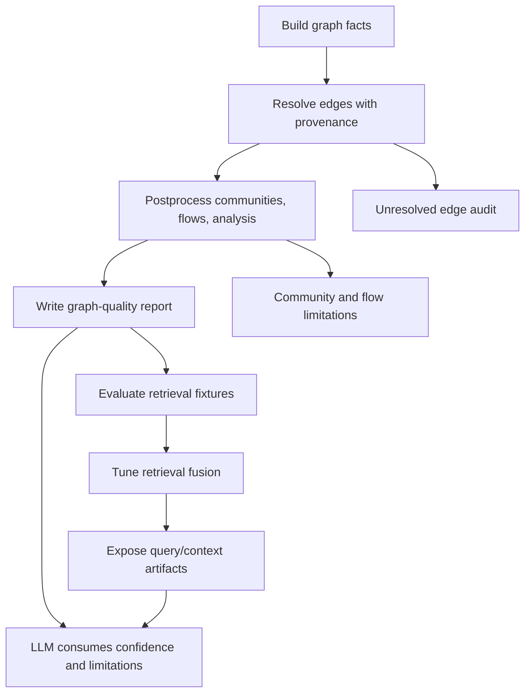
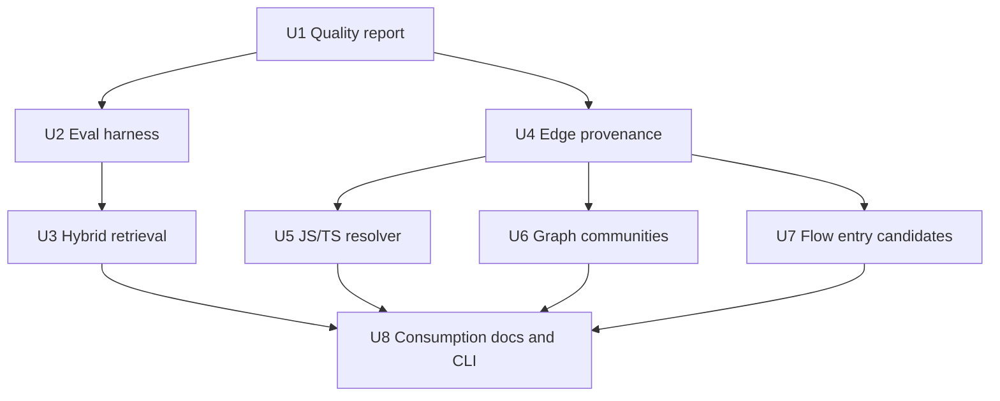
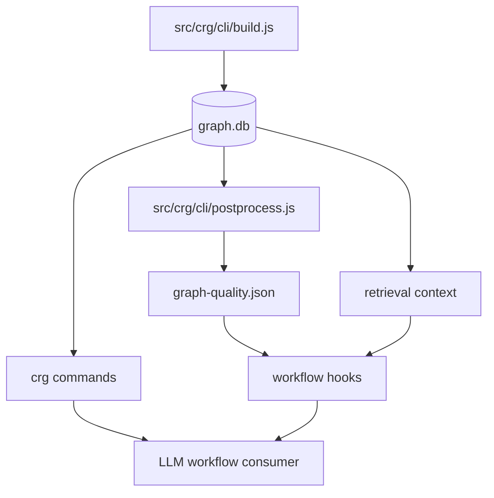

# feat: Improve CRG Artifact Quality Algorithms

## Overview

Improve CRG from a useful heuristic code graph into a measurable, confidence-aware evidence system for agent workflows. The goal is not to turn CRG into a compiler-grade semantic engine. The goal is to make deterministic scripts produce better facts, clearer confidence, richer limitations, and measurable retrieval quality, while LLMs continue to make semantic decisions.

The work should land in phases:

| Phase | Focus | Why first |
|---|---|---|
| Phase 1 | Quality report and benchmark harness | Makes current and future graph quality measurable before changing ranking or parsing behavior |
| Phase 2 | Hybrid retrieval and edge-resolution metadata | Directly improves the context most workflows consume |
| Phase 3 | JS/TS resolver, graph communities, flow entry candidates | Improves structural facts while preserving fallback behavior |
| Phase 4 | Risk/explanation surfaces and docs | Makes downstream agent consumption more trustworthy |

---

## Problem Frame

Current CRG artifacts are useful as advisory inputs, but several core algorithms still behave like medium-confidence heuristics:

- Retrieval starts from ASCII-style token extraction in `src/crg/retrieval/seed.js`, then uses FTS/LIKE, graph expansion, and hand-weighted rerank.
- `src/crg/retrieval/semantic-rerank.js` is identifier lexical overlap, not dense semantic retrieval.
- Edge resolution in `src/crg/graph.js` relies on path probing and global/same-file symbol heuristics, with limited resolution provenance.
- Communities in `src/crg/communities.js` are directory-first, with BFS refinement only for oversized groups.
- Flow detection in `src/crg/flows.js` uses zero-in-degree calls as inferred entries.
- Current algorithm quality is not measured with MRR, Recall@K, precision/recall/F1, flow entry recall, or token efficiency.

This creates two risks for spec-first workflows:

- The graph can look authoritative while hiding parser degradation, unresolved edges, stale control-plane facts, or low-confidence inferred relationships.
- Algorithm improvements cannot be judged rigorously because the repo lacks stable evaluation fixtures and quality reports.

---

## Requirements Trace

- R1. CRG must produce a graph quality report that exposes coverage, degradation, unresolved edge rates, confidence distribution, community quality, flow quality, and known limitations.
- R2. Retrieval quality must become measurable with deterministic fixtures and metrics such as MRR, Recall@K, precision/recall/F1, and token efficiency.
- R3. Retrieval ranking must support multi-source candidate fusion instead of a single FTS/LIKE seed path.
- R4. The current lexical overlap reranker must be renamed or reframed so it is not mistaken for dense semantic retrieval.
- R5. Edge records and unresolved edge records must expose resolution provenance and confidence so consumers can distinguish observed, resolved, inferred, ambiguous, external, and unresolved facts.
- R6. JS/TS import resolution must handle common project patterns such as `tsconfig` paths, `baseUrl`, JSONC comments, extension probing, and index probing.
- R7. Community detection must support a graph-based mode or hybrid mode with deterministic fallback to the current directory-first behavior.
- R8. Flow detection must expose entry source, confidence, and truncation metadata rather than only zero-in-degree inferred entries.
- R9. Risk and surprising-connection output must include score breakdowns and reasons that help LLMs judge evidence quality.
- R10. All enhancements must preserve the project philosophy: deterministic scripts prepare facts; LLMs decide semantic scope, target repo/module, and final interpretation.

---

## Scope Boundaries

- Do not build a compiler-grade semantic engine or a full Code Property Graph.
- Do not make embeddings a default dependency or require network access for normal CRG use.
- Do not make quality reports hard gates for workflow execution in this plan; they are evidence and warnings unless an existing command already treats failures as hard errors.
- Do not replace LLM decision-making with script-level semantic routing.
- Do not merge independent workspace child repositories into one graph DB.
- Do not remove existing directory-first community behavior until graph-based detection has fixtures and fallback coverage.

### Deferred to Follow-Up Work

- Optional dense embeddings with provider-isolated vector spaces: defer until lexical/RRF retrieval has measurable baselines.
- Python Jedi enrichment: valuable, but defer until the Node CLI has a clear optional external-tool contract and JS/TS resolver work proves the metadata model.
- Cross-repo dependency inference across workspace child repos: defer until repo-local graph quality is stable.
- Full security-oriented CPG layers such as CFG/PDG: defer outside this CRG iteration.

---

## Context & Research

### Relevant Code and Patterns

- `src/crg/cli/build.js` coordinates graph generation and should remain the owner of build-time quality metadata.
- `src/crg/cli/postprocess.js` already sequences communities, flows, analysis, and FTS rebuild; quality reporting should run after those steps.
- `src/crg/migrations.js` owns SQLite schema evolution for new edge/community/flow metadata.
- `src/crg/graph.js` owns node/edge CRUD and edge resolution; provenance should be attached here rather than inferred later.
- `src/crg/retrieval/api.js`, `src/crg/retrieval/seed.js`, `src/crg/retrieval/expand.js`, `src/crg/retrieval/rerank.js`, and `src/crg/retrieval/pack.js` define the current retrieval pipeline.
- `src/crg/communities.js` and `tests/unit/crg-communities.test.js` provide the current directory-first community contract.
- `src/crg/flows.js` and `tests/unit/crg-flows-scoring.test.js` provide the current flow scoring contract.
- `src/crg/analyze.js` already computes surprising connections and god nodes, but should expose richer reason metadata and avoid structural hub noise consistently.
- `tests/unit/crg-retrieval.test.js`, `tests/unit/crg-graph.test.js`, `tests/unit/crg-build-cli.test.js`, and `tests/e2e/crg-all-commands.sh` are the main existing validation surfaces.

### Institutional Learnings

- `docs/brainstorms/2026-04-02-spec-graph-bootstrap-v2-requirements.md` reinforces that high-value conclusions should carry `Verified / Inferred / Unknown` style confidence rather than unaudited claims.
- `docs/plans/2026-04-26-003-feat-crg-workspace-topology-plan.md` established the current CRG-native model: topology and readiness are deterministic facts; candidate selection remains advisory.
- `docs/10-prompt/项目角色.md` is the governance baseline: scripts execute deterministic flow, LLMs perform semantic analysis.

### External References

- Sourcegraph indexer guidance separates syntactic occurrences from semantic occurrences and recommends deterministic index snapshots while building precise code navigation incrementally: https://sourcegraph.com/docs/code-navigation/writing-an-indexer
- Kythe schema separates stable node identity, facts, and edge kinds, which supports explicit provenance instead of downstream guessing: https://kythe.io/docs/schema/
- OpenGrok demonstrates the baseline value of robust source search and cross-reference navigation before heavier semantic layers: https://oracle.github.io/opengrok/
- Joern's Code Property Graph model shows the value of layered program graphs for security analysis, but its AST/CFG/PDG scope is intentionally beyond this CRG iteration: https://joern.io/

---

## Key Technical Decisions

- Add quality reporting before algorithm rewrites: without measurable baselines, later retrieval and resolver changes cannot be judged.
- Use RRF-style multi-source fusion for retrieval: it combines FTS, identifier matches, changed-file candidates, chunks, and graph expansion without calibrating all raw scores onto one fragile scale.
- Keep lexical overlap but rename/reframe it: the current behavior is useful, but calling it semantic rerank overstates confidence.
- Attach provenance at write time: edge confidence and resolution method should be created when resolving edges, not guessed by readers.
- Start resolver improvements with JS/TS: the current Node CLI repo and common user projects will benefit immediately from `tsconfig` aliases and extension probing.
- Add graph-based communities as an optional or hybrid mode first: directory-first remains deterministic fallback until graph partition quality is proven.
- Treat flow entries as candidates: zero-in-degree calls, CLI files, package scripts, route-like files, and test files can all be entry signals, but none should become script-level semantic truth.
- Prefer reason arrays and score breakdowns over opaque scores: downstream LLMs need evidence, not just rankings.

---

## Open Questions

### Resolved During Planning

- Should this plan introduce embeddings now? No. Dense retrieval is valuable later, but the immediate quality gap is measurable lexical/RRF retrieval and provenance.
- Should CRG enforce quality gates before workflows can continue? No. This plan produces explicit limitations and quality facts; workflows can decide how to interpret them.
- Should directory-first communities be removed? No. They remain fallback and comparison baseline.
- Should Python Jedi enrichment be in this implementation? No. It is deferred until optional external-tool contracts are clearer.

### Deferred to Implementation

- Exact RRF constant and source weights: defer until evaluation fixtures exist and baseline scores can be compared.
- Exact graph community algorithm dependency: implementation should prefer dependency-light JavaScript options or a deterministic local algorithm first; heavier native dependencies require explicit justification.
- Exact schema field names for every metadata column: implementation should pick names consistent with existing `confidence`, `source_tier`, `evidence`, and `inference_reason` fields.
- Exact CLI command naming for quality/eval reports: choose the smallest surface that fits existing CRG command patterns.

---

## Output Structure

```text
src/crg/
  quality/
    report.js
  eval/
    scorer.js
    fixtures.js
  retrieval/
    fusion.js
    tokenize.js
    lexical-overlap-rerank.js
  resolvers/
    tsconfig.js
  communities/
    graph-partition.js
  flows/
    entrypoints.js
docs/contracts/crg/
  graph-quality.schema.json
  retrieval-eval.schema.json
tests/unit/
  crg-quality-report.test.js
  crg-eval-scorer.test.js
  crg-retrieval-fusion.test.js
  crg-retrieval-tokenize.test.js
  crg-edge-provenance.test.js
  crg-tsconfig-resolver.test.js
  crg-communities-graph.test.js
  crg-flow-entrypoints.test.js
```

This structure is directional. If implementation can integrate a small helper into existing files without reducing clarity, it may do so, but feature-bearing units must keep equivalent tests.

---

## High-Level Technical Design

> *This illustrates the intended approach and is directional guidance for review, not implementation specification. The implementing agent should treat it as context, not code to reproduce.*



Implementation unit dependencies:



---

## Implementation Units

- U1. **Add graph quality report**

**Goal:** Produce a deterministic quality artifact that tells consumers how trustworthy the active graph is.

**Requirements:** R1, R5, R10

**Dependencies:** None

**Files:**
- Create: `src/crg/quality/report.js`
- Create: `docs/contracts/crg/graph-quality.schema.json`
- Modify: `src/crg/cli/build.js`
- Modify: `src/crg/cli/postprocess.js`
- Modify: `src/crg/artifact-paths.js`
- Modify: `src/crg/generations/promote.js`
- Test: `tests/unit/crg-quality-report.test.js`
- Test: `tests/unit/crg-build-cli.test.js`

**Approach:**
- Generate a `graph-quality.json` artifact under the active generation directory after postprocess completes and before a generation is promoted; root-level status may reference it but must not become a second source of truth.
- Define an explicit build-time input contract for report generation: `build.js` should pass a snapshot containing generation id/path, final input count, parsed/skipped/no-parser/parse-error file counts and samples, skipped sensitive count, warnings, unresolved edge summary, and postprocess stats into the quality writer before promotion.
- Include baseline parser coverage, node/edge counts by kind, unresolved edge rates by language and edge kind where available, confidence distribution, retrieval index coverage, existing community/flow counts, and limitations.
- Represent richer community quality, flow entry quality, and truncation details as nullable or `unknown` until U6 and U7 enrich those sections.
- Make degraded parser state, parse error files, skipped sensitive files, and unresolved edge ratios visible as structured facts even when affected files were not inserted into `nodes`.
- Keep the report advisory; do not introduce a new workflow gate.

**Patterns to follow:**
- `src/crg/workspace/status.js` for structured readiness summaries.
- `src/crg/generations/health.js` for generation health inputs.
- `src/crg/artifact-paths.js` for artifact path ownership.

**Test scenarios:**
- Happy path: a graph with parsed nodes, resolved edges, communities, and flows produces quality sections with nonzero counts and no fatal limitations.
- Edge case: a graph with zero edges still produces a valid report with unresolved rate `0` and explicit low-signal limitations.
- Error path: parse error and no-parser files that are not inserted into `nodes` still appear in quality limitations through the build snapshot.
- Integration: build promotion only points to a generation whose quality report belongs to the same generation id.

**Verification:**
- Active generations expose `graph-quality.json`.
- Existing build and postprocess tests continue to pass.
- Quality report fields are stable enough for workflow hooks to include as decision inputs later.

---

- U2. **Add CRG retrieval evaluation harness**

**Goal:** Make retrieval ranking and token-efficiency improvements measurable before tuning retrieval algorithms.

**Requirements:** R2, R3

**Dependencies:** U1

**Files:**
- Create: `src/crg/eval/scorer.js`
- Create: `src/crg/eval/fixtures.js`
- Create: `docs/contracts/crg/retrieval-eval.schema.json`
- Modify: `src/crg/commands/search.js`
- Modify: `src/crg/cli/router.js`
- Test: `tests/unit/crg-eval-scorer.test.js`
- Test: `tests/unit/crg-retrieval.test.js`

**Approach:**
- Implement small deterministic scoring helpers for MRR, Recall@K, precision/recall/F1, and token efficiency.
- Add fixture-driven retrieval evaluation that can run against synthetic in-memory graphs first.
- Keep evaluation local and deterministic; do not require external services or model calls.
- Expose reports as JSON so future optimization work can compare before/after results.
- Leave impact and flow evaluation fixture design to later tasks after flow entry metadata exists; this unit should not invent those contracts.

**Patterns to follow:**
- `tests/unit/crg-retrieval.test.js` for minimal SQLite graph fixtures.
- `src/crg/retrieval/pack.js` for token estimate conventions.

**Test scenarios:**
- Happy path: expected result at rank 1 yields MRR `1.0`; expected result at rank 3 yields `0.3333`.
- Edge case: empty predicted and empty actual sets yield precision/recall/F1 `1.0`.
- Edge case: empty results with nonempty expected target yields MRR `0`.
- Integration: retrieval evaluation can score `retrieveContext` output from a fixture graph without mutating graph facts.

**Verification:**
- Evaluation helpers are covered by unit tests.
- A future retrieval change can be judged by deterministic metric output rather than manual inspection.

---

- U3. **Introduce measurable multi-source retrieval fusion**

**Goal:** Improve query result quality by adding lexical, identifier, file, chunk, and graph candidate fusion behind fixture-backed comparison before switching default ranking behavior.

**Requirements:** R3, R4, R9, R10

**Dependencies:** U2

**Files:**
- Create: `src/crg/retrieval/fusion.js`
- Create: `src/crg/retrieval/tokenize.js`
- Create: `src/crg/retrieval/lexical-overlap-rerank.js`
- Modify: `src/crg/retrieval/api.js`
- Modify: `src/crg/retrieval/seed.js`
- Modify: `src/crg/retrieval/rerank.js`
- Modify: `src/crg/retrieval/semantic-rerank.js`
- Test: `tests/unit/crg-retrieval-fusion.test.js`
- Test: `tests/unit/crg-retrieval-tokenize.test.js`
- Test: `tests/unit/crg-semantic-rerank.test.js`

**Approach:**
- Split query tokens with Unicode-aware natural-language tokens, path tokens, dotted names, camelCase, snake_case, and hyphenated identifiers.
- Gather ranked lists from FTS, LIKE fallback, identifier exact/prefix/contains matches, changed files, candidate tests, chunks, and graph expansion.
- Merge candidates with RRF-like fusion so each source contributes rank evidence without forcing raw scores onto one scale.
- Preserve `reasons` and `score_breakdown` for every packed item.
- Keep the old lexical-overlap behavior available under an honest name; only use `semantic` naming for future dense retrieval.
- Use U2 fixtures as a shadow comparison baseline; do not make fusion the default path until fixture results prove stable or improved ranking with compatible output shape.

**Patterns to follow:**
- `src/crg/retrieval/profiles.js` for profile-specific budgets and weights.
- `src/crg/retrieval/expand.js` for graph-neighbor expansion.
- `src/crg/retrieval/pack.js` for file caps and budget handling.

**Test scenarios:**
- Happy path: a PascalCase query boosts class/type-like nodes above unrelated text matches.
- Happy path: a snake_case query boosts function-like exact or prefix matches.
- Happy path: a Chinese natural-language query is not dropped by ASCII-only tokenization.
- Edge case: no FTS hits still returns LIKE/identifier candidates with explicit fallback reasons.
- Integration: changed files and candidate tests remain discoverable after fusion and still fit budget packing.

**Verification:**
- Retrieval tests demonstrate improved ranking on fixtures.
- The public result shape remains compatible for existing callers, with richer reason metadata.

---

- U4. **Persist edge provenance and confidence**

**Goal:** Make resolved and unresolved relationships auditable instead of opaque.

**Requirements:** R5, R9, R10

**Dependencies:** U1

**Files:**
- Modify: `src/crg/migrations.js`
- Modify: `src/crg/graph.js`
- Modify: `src/crg/parser.js`
- Modify: `src/crg/analyze.js`
- Test: `tests/unit/crg-edge-provenance.test.js`
- Test: `tests/unit/crg-graph.test.js`
- Test: `tests/unit/crg-resolve-edges-cache.test.js`
- Test: `tests/unit/crg-migrations.test.js`

**Approach:**
- Add edge-level metadata for confidence, resolution method, evidence, and inference reason.
- Add unresolved-edge metadata for unresolved reason and candidate count when ambiguity is known.
- Map current resolution paths to explicit methods such as direct target id, exact module path, relative module path, basename proximity, unique symbol, same-file disambiguation, ambiguous symbol, and no candidate.
- Keep existing `confidence`, `source_tier`, `evidence`, and `inference_reason` node fields aligned with new edge conventions.
- Add only backward-compatible nullable/default columns and legacy DB migration coverage unless a rebuild/copy migration strategy is explicitly added to the plan.

**Patterns to follow:**
- Existing `nodes` metadata fields in `src/crg/migrations.js`.
- Existing unresolved edge persistence in `src/crg/graph.js`.

**Test scenarios:**
- Happy path: raw edge with valid `target_id` persists with direct resolution metadata.
- Happy path: relative import resolution records relative module path provenance.
- Edge case: ambiguous global symbol records unresolved reason and candidate count.
- Error path: invalid `target_id` does not produce a false resolved edge and records an unresolved reason.
- Integration: legacy graph DBs without new edge/unresolved-edge metadata columns are upgraded without losing existing rows.
- Integration: `surprisingConnections` can use edge confidence without relying only on node confidence.

**Verification:**
- Existing edge resolution behavior remains stable where confidence metadata is ignored.
- Consumers can explain why each edge exists or why it failed to resolve.

---

- U5. **Add JS/TS module resolver enrichment**

**Goal:** Reduce unresolved import edges for common JavaScript and TypeScript project layouts.

**Requirements:** R5, R6

**Dependencies:** U4

**Files:**
- Create: `src/crg/resolvers/tsconfig.js`
- Modify: `src/crg/graph.js`
- Modify: `src/crg/lang-config.js`
- Test: `tests/unit/crg-tsconfig-resolver.test.js`
- Test: `tests/unit/crg-graph.test.js`

**Approach:**
- Land the resolver in test-backed increments inside this unit: first nearest `tsconfig.json` JSONC parsing with `baseUrl`/`paths` plus extension and `index.*` probing; then add relative `extends` and `tsconfig.app.json` discovery only after invalid/ambiguous cases stay unresolved.
- Probe `.ts`, `.tsx`, `.js`, `.jsx`, `.mjs`, `.cjs`, and directory `index.*` candidates.
- Keep resolver failure nonfatal and record limitations or unresolved reasons rather than throwing during graph build.
- Do not implement package manager workspace dependency inference in this unit; repo topology already owns module boundaries.

**Patterns to follow:**
- Current relative import probing in `src/crg/graph.js`.
- Existing topology detector style in `src/crg/topology/modules.js`.

**Test scenarios:**
- Happy path: `@/lib/foo` resolves through nearest-config `baseUrl` and `paths`.
- Happy path: a child `tsconfig` inherits paths from a relative `extends` parent.
- Edge case: invalid JSONC returns no resolution and records a nonfatal limitation.
- Edge case: a directory import resolves to `index.ts` or `index.tsx`.
- Integration: resolver output feeds `resolveEdges` and persists provenance from U4.

**Verification:**
- JS/TS unresolved import rate drops in fixture graphs.
- Resolver behavior remains deterministic and dependency-light.

---

- U6. **Introduce graph-based community detection mode**

**Goal:** Improve module grouping quality by using graph structure while preserving directory-first fallback.

**Requirements:** R1, R7, R9, R10

**Dependencies:** U4

**Files:**
- Create: `src/crg/communities/graph-partition.js`
- Modify: `src/crg/communities.js`
- Modify: `src/crg/migrations.js`
- Modify: `src/crg/commands/communities.js`
- Test: `tests/unit/crg-communities-graph.test.js`
- Test: `tests/unit/crg-communities.test.js`
- Test: `tests/unit/crg-migrations.test.js`

**Approach:**
- Build a module-level undirected graph from resolved semantic and import edges, excluding purely structural noise where appropriate.
- Add a graph or hybrid community path that can split or group modules based on connectivity.
- Preserve the current directory-first community id behavior as fallback and comparison baseline.
- Record algorithm source, cohesion, density, independence, split reason, and limitations in community output.
- Use deterministic ordering for community ids to avoid noisy rebuild diffs.

**Patterns to follow:**
- Existing module-level edge projection in `src/crg/communities.js`.
- Existing community health fields and tests.

**Test scenarios:**
- Happy path: two directories with strong cross-calls can be grouped or marked as cross-community according to graph mode with explicit algorithm metadata.
- Happy path: a graph with no edges falls back to deterministic singleton or directory behavior with limitations.
- Edge case: isolated modules are handled without generating unstable community ids.
- Edge case: oversized community splitting is deterministic across runs.
- Integration: legacy `communities` tables upgrade additively and preserve existing rows when new metadata columns are introduced.
- Integration: node `community_id` propagation to non-module nodes still works.

**Verification:**
- Community output explains whether a boundary came from directory, graph, or fallback.
- Existing commands that query communities remain compatible.

---

- U7. **Add explicit flow entry candidates and truncation metadata**

**Goal:** Make flow artifacts more truthful by separating entry evidence from inferred call-graph roots.

**Requirements:** R1, R8, R9, R10

**Dependencies:** U4

**Files:**
- Create: `src/crg/flows/entrypoints.js`
- Modify: `src/crg/flows.js`
- Modify: `src/crg/migrations.js`
- Modify: `src/crg/commands/flows.js`
- Modify: `src/crg/commands/flow.js`
- Test: `tests/unit/crg-flow-entrypoints.test.js`
- Test: `tests/unit/crg-flows-scoring.test.js`
- Test: `tests/unit/crg-migrations.test.js`

**Approach:**
- Keep zero-in-degree calls as one inferred entry source, but add explicit source metadata.
- Detect conservative entry candidates from CLI files, `package.json` scripts, route-like file paths, test files, and conventional main functions where language support is already present.
- Record entry confidence, entry source, inference reason, max depth, max nodes, and truncation flags.
- Keep BFS bounds to prevent graph explosion.

**Patterns to follow:**
- Current `annotateFlowOutput` in `src/crg/flows.js`.
- `src/crg/changes.js` platform inference helpers for CLI/web/test-like file signals.

**Test scenarios:**
- Happy path: a CLI-like file produces a flow with `entry_source=cli_surface` or equivalent metadata.
- Happy path: zero-in-degree fallback still works and is marked inferred.
- Edge case: a flow truncated by max nodes records truncation metadata.
- Edge case: a graph with no calls returns zero flows and a clear limitation.
- Integration: legacy `flows` tables upgrade additively and preserve existing rows when entry metadata columns are introduced.
- Integration: flow command output includes entry confidence without breaking existing fields.

**Verification:**
- Flow artifacts stop implying that zero-in-degree is a proven runtime entry.
- Review/work hooks can reason about flow confidence and truncation.

---

- U8. **Expose quality-aware consumption surfaces**

**Goal:** Ensure workflow consumers receive better evidence without changing their decision authority.

**Requirements:** R1, R2, R3, R9, R10

**Dependencies:** U3, U5, U6, U7

**Files:**
- Modify: `src/crg/hooks/before-plan.js`
- Modify: `src/crg/hooks/before-work.js`
- Modify: `src/crg/hooks/before-review.js`
- Modify: `src/crg/workflow-context/stage.js`
- Modify: `src/crg/commands/review-context.js`
- Modify: `src/crg/commands/architecture.js`
- Modify: `docs/02-架构设计/05-crg-作为工作流质量底座.md`
- Test: `tests/unit/crg-workflow-context-hooks.test.js`
- Test: `tests/unit/crg-review-context.test.js`
- Test: `tests/e2e/crg-all-commands.sh`

**Approach:**
- Add quality summary and top limitations to hook envelopes and workflow context outputs.
- Include retrieval/evidence reasons where context packs are returned.
- Keep all generated facts advisory: hooks recommend queries, candidate files, and limitations but do not select the final semantic target.
- Update CRG-facing documentation only to clarify the new evidence model and confidence semantics. Do not modify the project role baseline unless a later governance-specific plan explicitly scopes that change.

**Patterns to follow:**
- Existing hook envelope shape in `src/crg/hooks/shared.js`.
- Current workflow context decision-input pattern in `src/crg/workflow-context/stage.js`.

**Test scenarios:**
- Happy path: before-plan hook includes graph quality summary when available.
- Happy path: before-review context includes top unresolved-edge or parser limitations.
- Edge case: missing quality report does not crash hooks and returns an explicit limitation.
- Integration: CRG-facing documentation describes `graph-quality.json`, retrieval evaluation, edge confidence, community algorithm source, and flow entry confidence without changing the project role baseline.
- Integration: existing e2e CRG commands still emit valid JSON envelopes.

**Verification:**
- Agents see quality and limitation evidence in the same surfaces they already consume.
- CRG-facing documentation explains the evidence/confidence model added by this plan.
- No workflow starts making semantic decisions in scripts.

---

## System-Wide Impact



- **Interaction graph:** Build, postprocess, query, review-context, workflow-context, and hooks will all consume richer graph metadata.
- **Error propagation:** Resolver and quality-report failures should become structured limitations unless the DB itself cannot be opened or written.
- **State lifecycle risks:** Generated quality reports must match the promoted generation id; stale quality artifacts must not describe a different active DB.
- **API surface parity:** JSON envelope compatibility must be preserved for existing CRG commands, with additive fields for quality and evidence.
- **Integration coverage:** e2e CRG command tests must prove build/query/context flows still work after schema and output additions.
- **Unchanged invariants:** Workspace parent roots still do not own merged graph DBs; scripts still provide advisory facts, not semantic decisions.

---

## Alternative Approaches Considered

- Full compiler/LSP-backed indexer first: rejected for this iteration because it increases dependency and runtime complexity before CRG has quality baselines.
- Embeddings-first retrieval: rejected for now because provider identity, network access, vector freshness, and cost would distract from deterministic improvements.
- Replace directory communities entirely: rejected because current directory-first output is stable and should remain fallback until graph partition quality is proven.
- Make quality report a hard build gate: rejected because it would introduce central gate behavior; the report should inform LLM and user judgment first.

---

## Success Metrics

- Retrieval fixture MRR and Recall@K improve or remain stable after fusion changes.
- Graph quality report exposes unresolved edge rate by edge kind and language.
- JS/TS alias fixtures resolve imports that are currently unresolved.
- Community output includes algorithm source and cohesion-like quality fields.
- Flow outputs include entry confidence and truncation metadata.
- Hook outputs surface quality limitations without breaking existing JSON consumers.

---

## Risk Analysis & Mitigation

| Risk | Likelihood | Impact | Mitigation |
|---|---:|---:|---|
| Schema additions break existing graph DBs | Medium | High | Add migrations with backward-compatible nullable columns and unit coverage |
| Retrieval ranking changes degrade existing workflows | Medium | High | Add evaluation fixtures before replacing ranking behavior |
| Community graph mode creates unstable ids | Medium | Medium | Use deterministic sorting and keep directory fallback |
| Resolver false positives create misleading edges | Medium | High | Persist resolution method/confidence and keep ambiguous candidates unresolved |
| Hook envelopes become too noisy | Medium | Medium | Surface only summaries and top limitations; keep full report in artifact |
| Optional semantic features pull in heavy dependencies | Low | Medium | Defer embeddings and Python Jedi enrichment from this plan |

---

## Documentation / Operational Notes

- Update CRG docs to describe `graph-quality.json`, retrieval evaluation, edge confidence, community algorithm source, and flow entry confidence.
- Any implementation that modifies source code must update `CHANGELOG.md` according to repository governance.
- Generated runtime assets under `.codex/` or `.claude/` are not source of truth and should not be edited directly.

---

## Sources & References

- Related code: `src/crg/retrieval/seed.js`
- Related code: `src/crg/retrieval/semantic-rerank.js`
- Related code: `src/crg/graph.js`
- Related code: `src/crg/communities.js`
- Related code: `src/crg/flows.js`
- Related code: `src/crg/analyze.js`
- Related plan: `docs/plans/2026-04-26-003-feat-crg-workspace-topology-plan.md`
- Related requirements: `docs/brainstorms/2026-04-02-spec-graph-bootstrap-v2-requirements.md`
- External docs: https://sourcegraph.com/docs/code-navigation/writing-an-indexer
- External docs: https://kythe.io/docs/schema/
- External docs: https://oracle.github.io/opengrok/
- External docs: https://joern.io/
