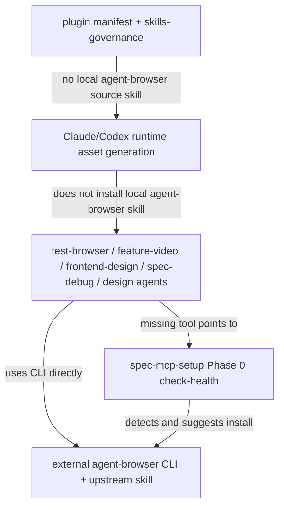

# refactor: Move agent-browser to external helper setup

## Overview

将当前仓库内置的 `skills/agent-browser` source skill 迁移为外部/upstream helper tool：`spec-mcp-setup` 负责检测、安装和指引 `agent-browser` CLI 与 upstream skill，当前项目不再打包本地 `agent-browser` skill 源码和 runtime 治理记录。

这项变更不是删除浏览器自动化能力。`test-browser`、`feature-video`、`frontend-design`、`spec-debug`、`spec-polish-beta` 以及设计类 agent 仍然使用 `agent-browser` CLI。改变的是所有权边界：当前项目只负责声明依赖、安装入口、缺失提示和 downstream contract；`agent-browser` 的使用说明与深层命令参考回到 upstream/global skill。

本计划使用 plan-local `spec_id`。相关需求文档 `docs/brainstorms/2026-04-01-mcp-setup-skill-requirements.md` 没有 `spec_id`，且其主题是 MCP setup 健壮性，本任务只继承其中“`mcp-tools.json` 只管理 MCP baseline，helper tools 由 Phase 0 preflight 处理”的边界，不把该文档作为完整 origin。

---

## Problem Frame

CE 当前已经不在插件资产中交付 `agent-browser` skill，而是通过 setup 安装外部 `agent-browser` CLI 和 upstream skill，并让 browser 相关 workflow 直接调用 CLI。spec-first 目前仍保留本地 `skills/agent-browser`，这让同步关系出现分叉：一方面 `spec-mcp-setup` 已经检测并建议安装 `agent-browser`，另一方面本地 skill 又继续承担权限声明、安装说明和深层参考文档。

本次迁移的目标是收敛单一真相源：`agent-browser` 是外部 browser automation substrate，不是 spec-first 自有 workflow asset。spec-first 应保留对它的依赖契约，但不继续维护一份本地 copy。

---

## Requirements Trace

- R1. `agent-browser` 在 spec-first 中定位为外部/upstream helper tool，而不是本地 source skill 或 `spec-*` workflow。
- R2. `spec-mcp-setup` 成为检测和安装 `agent-browser` 的唯一项目内入口，并保持 Phase 0 helper tool 边界。
- R3. 不把 `agent-browser` 加入 `skills/spec-mcp-setup/mcp-tools.json`，避免污染 MCP baseline registry。
- R4. 所有 downstream browser workflow 继续使用 `agent-browser` CLI，并在缺失时指向 `/spec:mcp-setup` / `$spec-mcp-setup`。
- R5. 删除本地 `skills/agent-browser/**` 后，同步清理 `.claude-plugin/plugin.json` 和 `src/cli/contracts/dual-host-governance/skills-governance.json` 中的本地交付记录。
- R6. 用新的 contract tests 守护外部 helper tool 安装契约、downstream 缺失提示和“不进入 MCP registry / runtime governance”的边界。
- R7. README runtime asset count、相关 validation 文档和 changelog 与删除后的 source asset set 对齐。
- R8. 迁移后不降低浏览器自动化可用性：安装路径仍必须包含 CLI、Chrome/runtime 初始化和 upstream skill 安装。

---

## Scope Boundaries

- 不删除 `test-browser`、`feature-video`、`frontend-design`、`spec-debug`、`spec-polish-beta` 或设计类 agents 中对 `agent-browser` CLI 的使用。
- 不新增 `spec-agent-browser`、`browser-automation` 或其他替代 skill 名称。
- 不把 `agent-browser` 加入 `mcp-tools.json`，也不让 MCP readiness ledger 表示 `agent-browser` 的状态。
- 不手工维护 `.claude/`、`.codex/`、`.agents/` 下生成 runtime 资产；需要验证 runtime 时通过 `spec-first init --claude` / `spec-first init --codex` 生成。
- 不在本次实现中重写 `agent-browser` upstream 文档；如需深层说明，指向 upstream/global skill 或 CLI 自带文档。
- 不解决 host 级 Bash 权限策略的产品问题；本轮只保证 spec-first 自身不再把权限契约伪装成本地 skill。

---

## Context & Research

### Relevant Code and Patterns

- `skills/spec-mcp-setup/SKILL.md` Phase 0 已声明 helper tool detection and install suggestions 包含 `agent-browser`，并明确这些 helper tools 不进入 `mcp-tools.json`。
- `skills/spec-mcp-setup/scripts/check-health` 已包含 `agent-browser` 检测、安装命令和项目 URL，是当前 helper tool 的事实入口。
- `skills/spec-mcp-setup/references/supported-mcp-tools.md` 明确自身是 MCP tools 的人类索引，机器真相源仍是 `mcp-tools.json`；新增 helper tool 说明必须与 MCP Tool Index 分开。
- `skills/agent-browser/SKILL.md` 当前承载 `allowed-tools`、安装说明、CDP 技术基础、open/snapshot/interact 工作流和 reference/template 文件。
- `tests/unit/agent-browser-contracts.test.js` 当前守护本地 skill 的存在、权限、安装路径和 reference 文件；删除本地 skill 时必须替换为新的 helper tool contract tests。
- `.claude-plugin/plugin.json` 和 `src/cli/contracts/dual-host-governance/skills-governance.json` 当前仍把 `agent-browser` 作为 internal skill 交付。
- `src/cli/plugin.js` 的 `listBundledSkills()` 从 `skills/` 目录读取 source skill，`buildFilteredAssetSet()` 再按 governance 过滤 runtime 交付；删除目录和 governance 记录会影响 bundled skill count 与 README runtime count。
- `tests/unit/dual-host-governance-contracts.test.js` 会根据 `buildFilteredAssetSet()` 校验 README / README.zh-CN runtime count。
- `tests/unit/mcp-setup.sh` 已覆盖 `spec-mcp-setup` skill/reference/script 的基础 contract，可扩展为 helper tool 安装边界守卫。

### Institutional Learnings

- `docs/solutions/architecture-patterns/upstream-ce-sync-upgrade-methodology-2026-04-26.md`：CE 同步不能机械复制；必须按 spec-first 当前产品边界判断是否同步、保留、删除或语义适配。该方法论支持本次按 CE 当前外部依赖模型收口。
- `docs/solutions/developer-experience/standalone-skill-name-convention-2026-04-20.md`：对外 standalone skill 有命名约束，但本次不新增 standalone skill；反而要减少本地 skill surface。
- `docs/brainstorms/2026-04-01-mcp-setup-skill-requirements.md`：`mcp-tools.json` 是 MCP baseline 唯一机器真相源；helper tools 不应混入 MCP registry 或 readiness ledger。

### External References

- 未做外部 research。当前决策基于本仓库代码、CE 当前集成方式和已有项目方法论；不涉及安全、支付、第三方 API 合约或新框架接入。

---

## Key Technical Decisions

- **将 `agent-browser` 迁为 external helper tool，而不是 spec-first source skill。** 这样与 CE 当前模型一致，也减少 spec-first 维护 upstream browser automation 文档的责任。
- **安装契约落在 `spec-mcp-setup` Phase 0 preflight，而不是 `mcp-tools.json`。** `agent-browser` 是 CLI/browser substrate，不是 MCP server；进入 MCP registry 会制造错误 readiness 语义。
- **删除本地 skill 必须同时删除 runtime governance 记录。** 否则 `buildFilteredAssetSet()` 会引用不存在的 source skill 或 README count 漂移。
- **用新的测试守护替代旧 `agent-browser-contracts`。** 旧测试守护的是“本地 skill 必须存在”，迁移后应守护“本地 skill 不存在，但 setup 安装契约和 downstream 提示仍存在”。
- **下游 workflow 继续直接写 `agent-browser` CLI 命令。** 这不是 CE 命名残留，也不是需要 `spec-` 前缀的能力；它是外部命令名。

---

## High-Level Technical Design

> *This illustrates the intended approach and is directional guidance for review, not implementation specification. The implementing agent should treat it as context, not code to reproduce.*

---

## Open Questions

### Resolved During Planning

- **Should `agent-browser` enter `mcp-tools.json`?** No. It is not an MCP server, and `spec-mcp-setup` already separates Phase 0 helper tools from MCP baseline registry.
- **Should spec-first rename it to `spec-agent-browser`?** No. The CLI and upstream skill are named `agent-browser`; renaming would make downstream commands and upstream docs harder to reconcile.
- **Can local `skills/agent-browser` be deleted directly?** Only after the install contract, runtime governance cleanup, downstream prompts and replacement tests are in place.

### Deferred to Implementation

- **Exact final wording for downstream prompts:** implementation should keep edits minimal and preserve existing `agent-browser` command examples unless the prompt implies a local skill must be loaded.
- **Whether upstream `npx skills add` works in every supported host environment:** keep current command contract and verify command text in tests; runtime network/install behavior is execution-time.
- **Whether generated runtime directories need tracked changes:** verify with `git ls-files`; if generated runtime assets are untracked, do not commit them.

---

## Implementation Units

- U1. **Promote agent-browser helper contract in spec-mcp-setup**

**Goal:** Make `spec-mcp-setup` explicitly own `agent-browser` detection and installation as a Phase 0 helper tool without moving it into MCP baseline metadata.

**Requirements:** R1, R2, R3, R8

**Dependencies:** None

**Files:**
- Modify: `skills/spec-mcp-setup/SKILL.md`
- Modify: `skills/spec-mcp-setup/scripts/check-health`
- Modify: `skills/spec-mcp-setup/references/supported-mcp-tools.md`
- Test: `tests/unit/mcp-setup.sh`

**Approach:**
- Add a short helper-tool subsection to `spec-mcp-setup` explaining that `agent-browser` is browser automation substrate, not an MCP tool.
- Keep `check-health` as the deterministic source for helper tool detection and install suggestions.
- Ensure the install suggestion still covers CLI installation, browser/runtime initialization via `agent-browser install`, and upstream/global skill installation.
- In `supported-mcp-tools.md`, avoid adding `agent-browser` to the MCP Tool Index; if mentioned, place it under a separate helper-tool boundary note.

**Patterns to follow:**
- `skills/spec-mcp-setup/SKILL.md` Phase 0.2 currently says helper tools are not written into readiness ledger and not added to `mcp-tools.json`.
- `docs/brainstorms/2026-04-01-mcp-setup-skill-requirements.md` R1/R5/R15 keep MCP registry ownership narrow.

**Test scenarios:**
- Happy path: `tests/unit/mcp-setup.sh` confirms `check-health` lists `agent-browser` as a helper tool and includes installation text for CLI installation, `agent-browser install`, and upstream skill installation.
- Edge case: `tests/unit/mcp-setup.sh` confirms `skills/spec-mcp-setup/mcp-tools.json` does not contain `agent-browser`.
- Integration: `tests/unit/mcp-setup.sh` confirms `spec-mcp-setup` prose points missing browser automation dependencies to the setup workflow without claiming they affect `baseline_ready`.

**Verification:**
- `spec-mcp-setup` cleanly distinguishes helper tool health from MCP baseline readiness.
- Missing `agent-browser` remains actionable through setup output.

---

- U2. **Remove local agent-browser source and runtime delivery**

**Goal:** Stop shipping a local `agent-browser` skill and remove it from host-filtered runtime governance.

**Requirements:** R1, R5, R7

**Dependencies:** U1

**Files:**
- Delete: `skills/agent-browser/SKILL.md`
- Delete: `skills/agent-browser/references/authentication.md`
- Delete: `skills/agent-browser/references/commands.md`
- Delete: `skills/agent-browser/references/profiling.md`
- Delete: `skills/agent-browser/references/proxy-support.md`
- Delete: `skills/agent-browser/references/session-management.md`
- Delete: `skills/agent-browser/references/snapshot-refs.md`
- Delete: `skills/agent-browser/references/video-recording.md`
- Delete: `skills/agent-browser/templates/authenticated-session.sh`
- Delete: `skills/agent-browser/templates/capture-workflow.sh`
- Delete: `skills/agent-browser/templates/form-automation.sh`
- Modify: `.claude-plugin/plugin.json`
- Modify: `src/cli/contracts/dual-host-governance/skills-governance.json`
- Test: `tests/unit/dual-host-governance-contracts.test.js`

**Approach:**
- Remove the source directory and all bundled reference/template files.
- Remove `agent-browser` from `.claude-plugin/plugin.json` skills list.
- Remove the `agent-browser` record from `skills-governance.json`.
- Do not replace it with another skill or alias.
- Add or adjust governance tests so missing governance records remain intentional: every remaining source skill still has a governance record, and `agent-browser` is no longer expected.

**Patterns to follow:**
- `src/cli/plugin.js` reads source skills from the `skills/` directory and then applies governance records.
- Previous CE sync deletion decisions removed workflow assets only after reference and governance audit.

**Test scenarios:**
- Happy path: governance tests confirm `.claude-plugin/plugin.json` no longer lists `agent-browser`.
- Happy path: governance tests confirm `skills-governance.json` no longer lists `agent-browser`.
- Integration: runtime filtered asset set builds without trying to copy `skills/agent-browser`.
- Edge case: there is no replacement `spec-agent-browser` or `browser-automation` source skill.

**Verification:**
- Bundled skill inventory no longer includes `agent-browser`.
- Runtime generation no longer installs a local `agent-browser` skill for Claude or Codex.

---

- U3. **Update downstream browser workflow prompts**

**Goal:** Keep all browser workflows working against the external CLI while removing any implication that a local `agent-browser` skill exists in spec-first.

**Requirements:** R4, R8

**Dependencies:** U1, U2

**Files:**
- Modify: `skills/test-browser/SKILL.md`
- Modify: `skills/feature-video/references/tier-browser-reel.md`
- Modify: `skills/feature-video/references/tier-static-screenshots.md`
- Modify: `skills/frontend-design/SKILL.md`
- Modify: `skills/spec-debug/SKILL.md`
- Modify: `skills/spec-debug/references/investigation-techniques.md`
- Modify: `skills/spec-polish-beta/SKILL.md`
- Modify: `agents/spec-design-implementation-reviewer.agent.md`
- Modify: `agents/spec-design-iterator.agent.md`
- Modify: `agents/spec-figma-design-sync.agent.md`
- Test: `tests/unit/browser-helper-tool-contracts.test.js`
- Test: `tests/unit/feature-video-contracts.test.js`
- Test: `tests/unit/spec-debug-contracts.test.js`

**Approach:**
- Preserve existing `agent-browser` CLI snippets where they describe actual usage.
- Keep missing-tool guidance pointed to `/spec:mcp-setup` / `$spec-mcp-setup`, not to a local `agent-browser` skill.
- If any prompt says “load/use the `agent-browser` skill,” revise it to “use the `agent-browser` CLI” or “install via `spec-mcp-setup`.”
- Do not introduce alternative browser automation in `test-browser`; it should still require `agent-browser` exclusively.
- Do not over-edit agent prompts that merely show CLI commands.

**Patterns to follow:**
- `skills/test-browser/SKILL.md` already states “Use `agent-browser` Only For Browser Automation.”
- `skills/feature-video/references/tier-browser-reel.md` already treats `agent-browser` as a required tool and uses `/spec:mcp-setup` as missing-tool guidance.

**Test scenarios:**
- Happy path: new browser helper contract test confirms downstream prompts still contain `agent-browser open`, `agent-browser snapshot -i`, and missing-tool guidance to `spec-mcp-setup`.
- Edge case: test confirms no downstream prompt tells users to open or load local `skills/agent-browser`.
- Integration: `feature-video` tests still guard `agent-browser wait --load networkidle` and related screenshot readiness guidance.
- Integration: `spec-debug` tests continue to guard browser-bug reproduction preference without implying local skill ownership.

**Verification:**
- All browser consumers still know how to call the CLI.
- Missing-tool guidance routes to setup, not to deleted source files.

---

- U4. **Replace local agent-browser tests with external-helper contract tests**

**Goal:** Update the test suite so it enforces the new ownership boundary instead of failing because the deleted local skill is gone.

**Requirements:** R2, R3, R5, R6, R8

**Dependencies:** U1, U2, U3

**Files:**
- Delete: `tests/unit/agent-browser-contracts.test.js`
- Create: `tests/unit/browser-helper-tool-contracts.test.js`
- Modify: `tests/unit/mcp-setup.sh`
- Modify: `tests/unit/dual-host-governance-contracts.test.js`

**Approach:**
- Delete tests that assert `skills/agent-browser/SKILL.md` and its references exist.
- Add a narrower test suite that asserts:
  - `skills/agent-browser` does not exist.
  - `.claude-plugin/plugin.json` and `skills-governance.json` do not list `agent-browser`.
  - `check-health` includes `agent-browser` detection and install suggestion.
  - `mcp-tools.json` does not include `agent-browser`.
  - downstream prompts point missing `agent-browser` to `spec-mcp-setup`.
- Keep test names focused on boundary semantics, not on CE parity.

**Patterns to follow:**
- `tests/unit/feature-video-contracts.test.js` tests behavior snippets without requiring browser execution.
- `tests/unit/runtime-contract-boundary.test.js` guards ownership boundaries with static assertions.

**Test scenarios:**
- Happy path: new contract test passes when local source skill is absent and helper setup contract exists.
- Edge case: test fails if someone re-adds `agent-browser` to `mcp-tools.json`.
- Edge case: test fails if someone re-adds `agent-browser` to plugin manifest or dual-host governance.
- Integration: test fails if downstream missing-tool prompts regress to a deleted local skill path.

**Verification:**
- The old local-skill test is gone.
- New tests encode the intended external-helper model.

---

- U5. **Refresh docs, counts, and CE reconciliation notes**

**Goal:** Align user-facing docs and historical validation notes with the new external-helper decision.

**Requirements:** R1, R5, R7

**Dependencies:** U2, U4

**Files:**
- Modify: `README.md`
- Modify: `README.zh-CN.md`
- Modify: `docs/validation/2026-04-26-current-vs-ce-skills-reconciliation.md`
- Modify: `docs/solutions/architecture-patterns/upstream-ce-sync-upgrade-methodology-2026-04-26.md`
- Test: `tests/unit/dual-host-governance-contracts.test.js`

**Approach:**
- Update README runtime asset counts after bundled skill count changes.
- In current-vs-CE reconciliation docs, change `agent-browser` from “spec-first 独有保留项” to “外部/upstream helper tool，由 `spec-mcp-setup` 安装，不作为本地 source skill 交付.”
- In the CE sync methodology doc, add a short note that upstream-excluded tools such as `agent-browser` should be evaluated as external helper tools, not automatically retained as local unique skills.
- Avoid rewriting old changelog/history sections that are clearly historical.

**Patterns to follow:**
- `tests/unit/dual-host-governance-contracts.test.js` dynamically checks README asset counts from `buildFilteredAssetSet()`.
- CE sync methodology already differentiates direct sync, semantic adaptation, skip, and deferred spike.

**Test scenarios:**
- Happy path: README count tests pass with one fewer bundled source skill.
- Edge case: validation doc no longer says current project must retain a local `agent-browser` source skill.
- Integration: CE sync methodology still distinguishes upstream helper tools from spec-first-owned workflow assets.

**Verification:**
- Documentation matches the actual source asset set and CE alignment decision.

---

- U6. **Regenerate runtime locally and run targeted validation**

**Goal:** Prove the source/governance/doc migration works through the same paths users rely on.

**Requirements:** R5, R6, R7, R8

**Dependencies:** U1, U2, U3, U4, U5

**Files:**
- Modify: `CHANGELOG.md`
- Runtime check only: `.claude/**`
- Runtime check only: `.agents/**`
- Runtime check only: `.codex/**`
- Test: `tests/unit/mcp-setup.sh`
- Test: `tests/unit/browser-helper-tool-contracts.test.js`
- Test: `tests/unit/dual-host-governance-contracts.test.js`
- Test: `tests/unit/feature-video-contracts.test.js`
- Test: `tests/unit/spec-debug-contracts.test.js`
- Test: `tests/smoke/cli.sh`

**Approach:**
- Add a changelog entry for the implemented source/docs change.
- Regenerate Claude and Codex runtime in a working tree or temp project using the normal init path.
- Verify generated runtime no longer contains a local `agent-browser` skill.
- Keep generated runtime changes out of source commits unless files are intentionally tracked by this repo.
- Run targeted tests for setup, browser helper boundary, governance counts and browser workflow contracts; expand to smoke if runtime counts or manifest behavior changed.

**Patterns to follow:**
- Repository guidance says source of truth is `skills/`, `agents/`, `src/cli/`, `.claude-plugin/`; generated `.claude/`, `.codex/`, `.agents/` assets should be regenerated rather than manually edited.
- Changelog format is enforced at repository level.

**Test scenarios:**
- Happy path: targeted unit tests pass after deleting local source skill.
- Integration: CLI smoke init produces no local `agent-browser` runtime skill and reports expected skill counts.
- Edge case: tests fail if runtime governance tries to copy a deleted source directory.

**Verification:**
- Source tree, docs, tests and generated runtime behavior agree on the external-helper boundary.

---

## System-Wide Impact

- **Interaction graph:** Browser-oriented workflows continue to call `agent-browser` CLI directly; only installation ownership and source asset delivery change.
- **Error propagation:** Missing CLI remains a user-actionable setup issue, reported through `spec-mcp-setup` Phase 0 output and downstream missing-tool guidance.
- **State lifecycle risks:** Generated runtime may retain old local `agent-browser` copies on developer machines until `spec-first init --claude` / `spec-first init --codex` refreshes assets. This should be documented as an update/setup expectation.
- **API surface parity:** Claude and Codex should both receive the same downstream browser workflow prompts, but neither should receive a local `agent-browser` source skill from this package.
- **Integration coverage:** Runtime generation and README count tests are necessary because deleting a source skill changes bundled asset counts and host-filtered asset sets.
- **Unchanged invariants:** `agent-browser` command names, CLI snippets, screenshot flows and `test-browser` exclusive browser automation rule remain unchanged.

---

## Risks & Dependencies

| Risk | Mitigation |
|------|------------|
| Removing `allowed-tools` from local `agent-browser` changes host permission behavior | Keep upstream/global skill installation in `spec-mcp-setup` install suggestion; verify current host behavior during implementation and document any residual host permission requirement |
| `agent-browser` accidentally enters `mcp-tools.json` | Add contract test that forbids it in MCP registry |
| Downstream prompt still references deleted local skill | Add browser helper contract scan across browser consumers |
| README count drift after deleting one bundled skill | Use existing dynamic README count test in `dual-host-governance-contracts.test.js` |
| Old runtime copies remain on user machines | Route users through `spec-first init --claude` / `spec-first init --codex` or `$spec-update` when runtime refresh is needed |
| CE reconciliation docs become contradictory | Update current validation/methodology docs to classify `agent-browser` as external/upstream helper tool |

---

## Documentation / Operational Notes

- This change is user-visible because `agent-browser` will no longer be bundled as a local spec-first skill.
- The user-facing path for missing browser automation becomes: run `/spec:mcp-setup` in Claude or `$spec-mcp-setup` in Codex, then refresh/restart host as normal for setup changes.
- Release notes should phrase this as an ownership migration, not a capability removal.
- If implementation reveals that upstream/global skill installation is unreliable in Codex or Claude, pause before deleting local source skill and record that as a blocker rather than shipping a half-migration.

---

## Sources & References

- Related requirements context: `docs/brainstorms/2026-04-01-mcp-setup-skill-requirements.md`
- CE sync methodology: `docs/solutions/architecture-patterns/upstream-ce-sync-upgrade-methodology-2026-04-26.md`
- Current setup workflow: `skills/spec-mcp-setup/SKILL.md`
- Helper detection script: `skills/spec-mcp-setup/scripts/check-health`
- MCP tool index: `skills/spec-mcp-setup/references/supported-mcp-tools.md`
- Current local browser skill: `skills/agent-browser/SKILL.md`
- Runtime governance: `src/cli/contracts/dual-host-governance/skills-governance.json`
- Plugin manifest: `.claude-plugin/plugin.json`
- Runtime builder: `src/cli/plugin.js`
- Existing local-skill contract test: `tests/unit/agent-browser-contracts.test.js`
