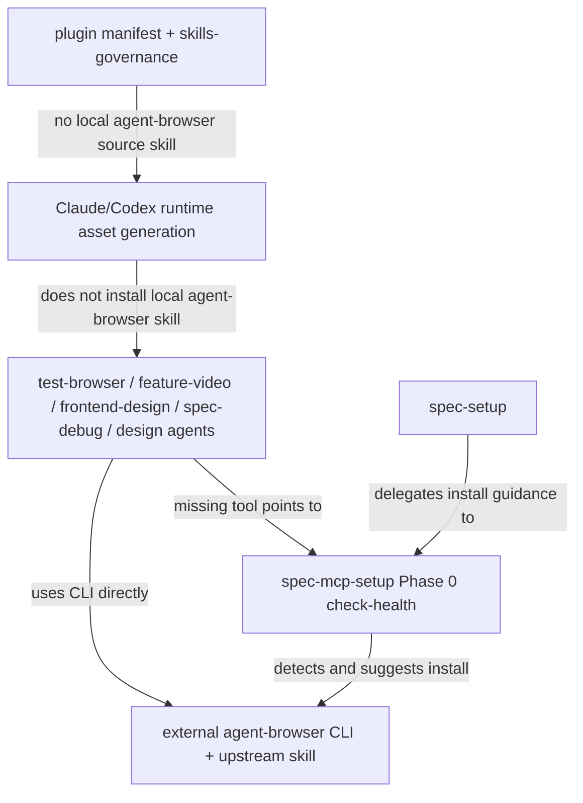

# refactor: Move agent-browser to external helper setup

## Overview

将当前仓库内置的 `skills/agent-browser` source skill 迁移为外部/upstream helper tool：`spec-mcp-setup` 负责检测、安装和指引 `agent-browser` CLI 与 upstream skill，当前项目不再打包本地 `agent-browser` skill 源码和 runtime 治理记录。

这项变更不是删除浏览器自动化能力。`test-browser`、`feature-video`、`frontend-design`、`spec-debug`、`spec-polish-beta` 以及设计类 agent 仍然使用 `agent-browser` CLI。改变的是所有权边界：当前项目只负责声明依赖、安装入口、缺失提示和 downstream contract；`agent-browser` 的使用说明与深层命令参考回到 upstream/global skill。

本计划使用 plan-local `spec_id`。相关需求文档 `docs/brainstorms/2026-04-01-mcp-setup-skill-requirements.md` 没有 `spec_id`，且其主题是 MCP setup 健壮性，本任务只继承其中“`mcp-tools.json` 只管理 MCP baseline，helper tools 由 Phase 0 preflight 处理”的边界，不把该文档作为完整 origin。

---

## Problem Frame

spec-first 目前同时存在两种 `agent-browser` 所有权表达：`spec-mcp-setup` 已经检测并建议安装 `agent-browser`，本地 `skills/agent-browser` 又继续承担权限声明、安装说明和深层参考文档。CE 当前外部 helper tool 模型是参考信号，但本次迁移的主判断来自 spec-first 自身边界：`agent-browser` 是外部 browser automation substrate，不应作为 spec-first 自有 workflow asset 继续维护一份本地 copy。

本次迁移的目标是收敛单一真相源：`agent-browser` 是外部 browser automation substrate，不是 spec-first 自有 workflow asset。spec-first 应保留对它的依赖契约，但不继续维护一份本地 copy。

---

## Requirements Trace

- R1. `agent-browser` 在 spec-first 中定位为外部/upstream helper tool，而不是本地 source skill 或 `spec-*` workflow。
- R2. `spec-mcp-setup` 成为检测和安装 `agent-browser` 的唯一项目内入口，并保持 Phase 0 helper tool 边界；`spec-setup` 不再保留第二套安装入口，只能指向 `spec-mcp-setup` 或明确不交付该能力。
- R3. 不把 `agent-browser` 加入 `skills/spec-mcp-setup/mcp-tools.json`，避免污染 MCP baseline registry。
- R4. 所有 downstream browser workflow 继续使用 `agent-browser` CLI，并在缺失时指向 `/spec:mcp-setup` / `$spec-mcp-setup`。
- R5. 删除本地 `skills/agent-browser/**` 后，同步清理 `.claude-plugin/plugin.json` 和 `src/cli/contracts/dual-host-governance/skills-governance.json` 中的本地交付记录。
- R6. 用新的 contract tests 守护外部 helper tool 安装契约、downstream 缺失提示和“不进入 MCP registry / runtime governance”的边界。
- R7. README runtime asset count、相关 validation 文档和 changelog 与删除后的 source asset set 对齐。
- R8. 迁移后不降低浏览器自动化可用性：安装路径仍必须包含 CLI、Chrome/runtime 初始化和 upstream skill 安装。
- R9. 删除本地 `skills/agent-browser/**` 前，必须完成 upstream/global install、Claude/Codex host 权限边界、旧 runtime 清理路径和上游信任边界验证；验证失败则阻塞删除。
- R10. 删除本地 reference/template 文件后，用户仍能发现 upstream/global 使用说明和安全 guidance，不把能力迁移误解为能力删除。

---

## Scope Boundaries

- 不删除 `test-browser`、`feature-video`、`frontend-design`、`spec-debug`、`spec-polish-beta` 或设计类 agents 中对 `agent-browser` CLI 的使用。
- 不新增 `spec-agent-browser`、`browser-automation` 或其他替代 skill 名称。
- 不把 `agent-browser` 加入 `mcp-tools.json`，也不让 MCP readiness ledger 表示 `agent-browser` 的状态。
- 不手工维护 `.claude/`、`.codex/`、`.agents/` 下生成 runtime 资产；需要验证 runtime 时通过 `spec-first init --claude` / `spec-first init --codex` 生成。
- 不在本次实现中重写 `agent-browser` upstream 文档；如需深层说明，指向 upstream/global skill 或 CLI 自带文档。
- 不解决 host 级 Bash 权限策略的产品问题；本轮只保证 spec-first 自身不再把权限契约伪装成本地 skill。

---

## Context & Research

### Relevant Code and Patterns

- `skills/spec-mcp-setup/SKILL.md` Phase 0 已声明 helper tool detection and install suggestions 包含 `agent-browser`，并明确这些 helper tools 不进入 `mcp-tools.json`。
- `skills/spec-mcp-setup/scripts/check-health` 已包含 `agent-browser` 检测、安装命令和项目 URL，是当前 helper tool 的事实入口。
- `skills/spec-mcp-setup/references/supported-mcp-tools.md` 明确自身是 MCP tools 的人类索引，机器真相源仍是 `mcp-tools.json`；新增 helper tool 说明必须与 MCP Tool Index 分开。
- `skills/spec-setup/SKILL.md` 和 `skills/spec-setup/scripts/check-health` 当前仍包含 `agent-browser` 安装提示；若 R2 要求 `spec-mcp-setup` 成为唯一入口，本轮必须处理这条重复入口。
- `skills/agent-browser/SKILL.md` 当前承载 `allowed-tools`、安装说明、CDP 技术基础、open/snapshot/interact 工作流和 reference/template 文件。
- `tests/unit/agent-browser-contracts.test.js` 当前守护本地 skill 的存在、权限、安装路径和 reference 文件；删除本地 skill 时必须替换为新的 helper tool contract tests。
- `.claude-plugin/plugin.json` 和 `src/cli/contracts/dual-host-governance/skills-governance.json` 当前仍把 `agent-browser` 作为 internal skill 交付。
- `src/cli/plugin.js` 的 `listBundledSkills()` 从 `skills/` 目录读取 source skill，`buildFilteredAssetSet()` 再按 governance 过滤 runtime 交付；删除目录和 governance 记录会影响 bundled skill count 与 README runtime count。
- `tests/unit/dual-host-governance-contracts.test.js` 会根据 `buildFilteredAssetSet()` 校验 README / README.zh-CN runtime count。
- `tests/unit/mcp-setup.sh` 已覆盖 `spec-mcp-setup` skill/reference/script 的基础 contract，可扩展为 helper tool 安装边界守卫。

### Institutional Learnings

- `docs/solutions/architecture-patterns/upstream-ce-sync-upgrade-methodology-2026-04-26.md`：CE 同步不能机械复制；必须按 spec-first 当前产品边界判断是否同步、保留、删除或语义适配。本次只把 CE 当前外部依赖模型作为参考信号，不把 CE 状态作为删除本地 skill 的唯一理由。
- `docs/solutions/architecture-patterns/workflow-entrypoint-exposure-contract-2026-04-26.md`：standalone skill 与 workflow command 有明确治理边界；本次不新增 standalone skill，反而要减少本地 skill surface。
- `docs/brainstorms/2026-04-01-mcp-setup-skill-requirements.md`：`mcp-tools.json` 是 MCP baseline 唯一机器真相源；helper tools 不应混入 MCP registry 或 readiness ledger。

### External References

- 未做外部 research。当前决策基于本仓库代码、spec-first ownership boundary 和已有项目方法论；上游安装来源、版本策略、host 权限边界和失败回滚必须在删除本地 skill 前验证并记录。

---

## Key Technical Decisions

- **将 `agent-browser` 迁为 external helper tool，而不是 spec-first source skill。** 这符合 spec-first 对外部 browser automation substrate 的 ownership boundary，也减少 spec-first 维护 upstream browser automation 文档的责任。
- **安装契约落在 `spec-mcp-setup` Phase 0 preflight，而不是 `mcp-tools.json`。** `agent-browser` 是 CLI/browser substrate，不是 MCP server；进入 MCP registry 会制造错误 readiness 语义。
- **删除本地 skill 必须同时删除 runtime governance 记录。** 否则 `buildFilteredAssetSet()` 会引用不存在的 source skill 或 README count 漂移。
- **用新的测试守护替代旧 `agent-browser-contracts`。** 旧测试守护的是“本地 skill 必须存在”，迁移后应守护“本地 skill 不存在，但 setup 安装契约和 downstream 提示仍存在”。
- **下游 workflow 继续直接写 `agent-browser` CLI 命令。** 这不是 CE 命名残留，也不是需要 `spec-` 前缀的能力；它是外部命令名。
- **删除本地 skill 必须是门禁后的原子迁移。** 不能先删除再补权限、安装、prompt 和测试；如果 upstream/global skill、CLI 初始化、host 权限或旧 runtime 清理验证失败，本地 skill 删除必须阻塞。

---

## High-Level Technical Design

> *This illustrates the intended approach and is directional guidance for review, not implementation specification. The implementing agent should treat it as context, not code to reproduce.*

---

## Open Questions

### Resolved During Planning

- **Should `agent-browser` enter `mcp-tools.json`?** No. It is not an MCP server, and `spec-mcp-setup` already separates Phase 0 helper tools from MCP baseline registry.
- **Should spec-first rename it to `spec-agent-browser`?** No. The CLI and upstream skill are named `agent-browser`; renaming would make downstream commands and upstream docs harder to reconcile.
- **Can local `skills/agent-browser` be deleted directly?** No. It can only be deleted after `spec-mcp-setup` / `spec-setup` entry ownership, upstream trust boundary, live install path, host permission boundary, downstream prompts, replacement tests and runtime cleanup path are all verified.

### Deferred to Implementation

- **Exact final wording for downstream prompts:** implementation should keep edits minimal and preserve existing `agent-browser` command examples unless the prompt implies a local skill must be loaded.
- **Exact upstream install/version policy:** implementation must decide whether the `agent-browser` npm package and upstream skill source float or pin, then document the trust assumption and rollback path before deleting local source.
- **Whether upstream/global install works in supported host paths:** this is a deletion gate, not a post-delete residual risk. At least one fresh setup path must validate CLI install, `agent-browser install`, upstream/global skill installation and host permission behavior.
- **Whether generated runtime directories need tracked changes:** verify with `git ls-files`; if generated runtime assets are untracked, do not commit them.

---

## Implementation Units

- U1. **收敛 setup 入口和 helper contract**

**Goal:** 让 `spec-mcp-setup` 成为 `agent-browser` 的唯一项目内检测/安装入口，并消除 `spec-setup` 中的第二套安装入口。

**Requirements:** R1, R2, R3, R8

**Dependencies:** None

**Files:**
- Modify: `skills/spec-mcp-setup/SKILL.md`
- Modify: `skills/spec-mcp-setup/scripts/check-health`
- Modify: `skills/spec-mcp-setup/references/supported-mcp-tools.md`
- Modify: `skills/spec-setup/SKILL.md`
- Modify: `skills/spec-setup/scripts/check-health`
- Test: `tests/unit/mcp-setup.sh`

**Approach:**
- Add a short helper-tool subsection to `spec-mcp-setup` explaining that `agent-browser` is browser automation substrate, not an MCP tool.
- Keep `spec-mcp-setup/scripts/check-health` as the deterministic source for helper tool detection and install suggestions.
- Ensure the install suggestion still covers CLI installation, browser/runtime initialization via `agent-browser install`, and upstream/global skill installation.
- In `supported-mcp-tools.md`, do not add `agent-browser` to the MCP Tool Index; if mentioned, keep it under a separate helper-tool boundary note.
- Remove or rewrite `spec-setup` `agent-browser` install guidance so it delegates users to `/spec:mcp-setup` in Claude or `$spec-mcp-setup` in Codex. `spec-setup` must not remain a second command source for installing `agent-browser`.

**Patterns to follow:**
- `skills/spec-mcp-setup/SKILL.md` Phase 0.2 currently says helper tools are not written into readiness ledger and not added to `mcp-tools.json`.
- `docs/brainstorms/2026-04-01-mcp-setup-skill-requirements.md` R1/R5/R15 keep MCP registry ownership narrow.

**Test scenarios:**
- Happy path: `tests/unit/mcp-setup.sh` confirms `spec-mcp-setup` lists `agent-browser` as a helper tool and includes installation text for CLI installation, `agent-browser install`, and upstream skill installation.
- Edge case: `tests/unit/mcp-setup.sh` confirms `skills/spec-mcp-setup/mcp-tools.json` does not contain `agent-browser`.
- Edge case: contract coverage confirms `spec-setup` no longer contains an independent `agent-browser` install command; it either points to `spec-mcp-setup` or does not mention installing `agent-browser`.
- Integration: `spec-mcp-setup` prose points missing browser automation dependencies to setup without claiming they affect `baseline_ready`.

**Verification:**
- `spec-mcp-setup` cleanly distinguishes helper tool health from MCP baseline readiness.
- Missing `agent-browser` remains actionable through one setup entry, not two divergent setup paths.

---

- U2. **Run pre-delete trust, install, permission and runtime-cleanup gate**

**Goal:** 在删除本地 `skills/agent-browser/**` 前证明外部 helper model 可用、可解释、可回滚。

**Requirements:** R8, R9, R10

**Dependencies:** U1

**Files:**
- Review/modify if needed: `skills/spec-mcp-setup/scripts/check-health`
- Review/modify if needed: `src/cli/plugin.js`
- Review/modify if needed: `src/cli/commands/init.js`
- Review/modify if needed: `src/cli/commands/clean.js`
- Review/modify if needed: `src/cli/adapters/claude.js`
- Review/modify if needed: `src/cli/adapters/codex.js`
- Test/update if needed: `tests/unit/init-dry-run.test.js`
- Test/update if needed: `tests/unit/clean-dry-run.test.js`
- Test/update if needed: `tests/smoke/cli.sh`

**Approach:**
- Record the canonical install sources used by setup output: `agent-browser` CLI package/source, `agent-browser install`, and upstream/global skill source.
- Decide and document whether the install command intentionally floats latest or pins a version/source. If it floats, record the trust assumption and rollback path; if pinning is feasible, encode the pinned form in setup output and tests.
- In a fresh supported setup path, validate the end-to-end replacement path before deletion: CLI install command shape, `agent-browser install`, upstream/global skill installation, and host recognition of the installed upstream/global skill.
- Define Claude/Codex permission acceptance criteria before deletion:
  - spec-first must not grant broad host permissions as a hidden replacement for local `allowed-tools`.
  - required execution should stay limited to documented `agent-browser` / install commands or upstream/global skill permissions.
  - if upstream/global skill or host config cannot provide an acceptable permission path, stop and keep local `skills/agent-browser/**` until a separate permission design exists.
- Verify whether `spec-first init --claude` / `spec-first init --codex` remove obsolete generated skills from an existing runtime. If not, require either a runtime cleanup code change or explicit `$spec-update` / release-note / setup-output guidance before deletion proceeds.

**Patterns to follow:**
- Repository guidance treats generated `.claude/`, `.codex/`, `.agents/` assets as runtime outputs, not source of truth.
- Existing `init` and `clean` tests already cover managed reset and cleanup behavior; extend those rather than adding a separate cleanup system if the current lifecycle can express the obsolete-skill cleanup.

**Test scenarios:**
- Happy path: a fresh setup path can install or at least concretely validate the external `agent-browser` path before local deletion.
- Edge case: implementation blocks deletion if upstream/global skill installation fails, if host permission behavior is unacceptable, or if obsolete runtime copies cannot be cleaned or communicated.
- Edge case: setup output uses the chosen trust policy consistently; tests fail if package/source text drifts unintentionally.

**Verification:**
- A human implementer can answer: "what upstream is trusted, what version/source policy is used, what permissions remain, and how does a user remove stale local runtime copies?"
- U4 must not start until this gate is green.

---

- U3. **Update downstream browser workflow prompts and run repo-wide reference audit**

**Goal:** Keep all browser workflows working against the external CLI while removing any implication that a local `agent-browser` skill exists in spec-first.

**Requirements:** R4, R8, R10

**Dependencies:** U1, U2

**Files:**
- Modify: `skills/test-browser/SKILL.md`
- Modify: `skills/feature-video/references/tier-browser-reel.md`
- Modify: `skills/feature-video/references/tier-static-screenshots.md`
- Modify: `skills/frontend-design/SKILL.md`
- Modify: `skills/spec-debug/SKILL.md`
- Modify: `skills/spec-debug/references/investigation-techniques.md`
- Modify: `skills/spec-polish-beta/SKILL.md`
- Modify: `agents/spec-design-implementation-reviewer.agent.md`
- Modify: `agents/spec-design-iterator.agent.md`
- Modify: `agents/spec-figma-design-sync.agent.md`
- Test coverage owned by U4: `tests/unit/browser-helper-tool-contracts.test.js`
- Test: `tests/unit/feature-video-contracts.test.js`
- Test: `tests/unit/spec-debug-contracts.test.js`

**Approach:**
- Preserve existing `agent-browser` CLI snippets where they describe actual usage.
- Keep missing-tool guidance host-specific:
  - Claude-facing surfaces should mention `/spec:mcp-setup`.
  - Codex-facing surfaces should mention `$spec-mcp-setup`.
  - Source prose that may render into both hosts should use a dual-host or host-neutral wording, not slash-only guidance.
- If any prompt says “load/use the `agent-browser` skill,” revise it to “use the `agent-browser` CLI” or “install via `spec-mcp-setup`.”
- Do not introduce alternative browser automation in `test-browser`; it should still require `agent-browser` exclusively.
- Add a lightweight discoverability handoff: at least one user-facing location should explain where the upstream/global `agent-browser` docs live or how to confirm the upstream/global skill is installed.
- Preserve or hand off security guidance for authenticated/session browser use: credential state files, page-sourced output, and browser action boundaries must either point to upstream docs or keep a minimal local warning.
- Run repo-wide reference audit, not only browser-consumer audit:
  - `rg "skills/agent-browser|agent-browser skill|load/use the \`agent-browser\` skill|allowed-tools"`
  - classify each hit as historical allowed, CLI usage allowed, upstream/global skill reference allowed, or local-source reference to fix.

**Patterns to follow:**
- `skills/test-browser/SKILL.md` already states “Use `agent-browser` Only For Browser Automation.”
- `skills/feature-video/references/tier-browser-reel.md` already treats `agent-browser` as a required CLI tool and uses setup guidance for missing dependencies.

**Test scenarios:**
- Happy path: browser workflow prompts still contain `agent-browser open`, `agent-browser snapshot -i`, and relevant wait/screenshot readiness guidance.
- Edge case: no current source prompt tells users to open, load, or rely on local `skills/agent-browser`.
- Edge case: host-specific guidance does not regress to only `/spec:mcp-setup` in Codex-facing output or only `$spec-mcp-setup` in Claude-facing output.
- Integration: `feature-video` and `spec-debug` tests continue to guard browser-bug reproduction behavior without implying local skill ownership.

**Verification:**
- All browser consumers still know how to call the CLI.
- Missing-tool guidance routes to setup, not to deleted source files.
- Security and discoverability handoff exists without copying the full upstream docs into this repo.

---

- U4. **Atomically remove local source, governance delivery and old tests**

**Goal:** Replace the local-skill contract with an external-helper contract in one coherent migration after U1-U3 gates pass.

**Requirements:** R1, R3, R5, R6, R7, R8, R9

**Dependencies:** U1, U2, U3

**Files:**
- Delete: `skills/agent-browser/SKILL.md`
- Delete: `skills/agent-browser/references/authentication.md`
- Delete: `skills/agent-browser/references/commands.md`
- Delete: `skills/agent-browser/references/profiling.md`
- Delete: `skills/agent-browser/references/proxy-support.md`
- Delete: `skills/agent-browser/references/session-management.md`
- Delete: `skills/agent-browser/references/snapshot-refs.md`
- Delete: `skills/agent-browser/references/video-recording.md`
- Delete: `skills/agent-browser/templates/authenticated-session.sh`
- Delete: `skills/agent-browser/templates/capture-workflow.sh`
- Delete: `skills/agent-browser/templates/form-automation.sh`
- Delete: `tests/unit/agent-browser-contracts.test.js`
- Create: `tests/unit/browser-helper-tool-contracts.test.js`
- Modify: `.claude-plugin/plugin.json`
- Modify: `src/cli/contracts/dual-host-governance/skills-governance.json`
- Modify: `tests/unit/dual-host-governance-contracts.test.js`
- Modify: `tests/unit/mcp-setup.sh`

**Approach:**
- Replace `tests/unit/agent-browser-contracts.test.js` with `tests/unit/browser-helper-tool-contracts.test.js`; U4 owns this new test file.
- The new test suite should assert:
  - `skills/agent-browser` does not exist.
  - `.claude-plugin/plugin.json` and `skills-governance.json` do not list `agent-browser`.
  - `spec-mcp-setup` includes `agent-browser` detection and install suggestion.
  - `spec-setup` does not keep an independent `agent-browser` install command.
  - `mcp-tools.json` does not include `agent-browser`.
  - downstream prompts route missing `agent-browser` to host-appropriate `spec-mcp-setup` guidance.
  - repo-wide stale local-skill references are absent outside explicitly historical contexts.
  - the security/discoverability handoff remains present after deleting local reference files.
- Remove the source directory and all bundled reference/template files only after U2 gate results are known.
- Remove `agent-browser` from `.claude-plugin/plugin.json` skills list.
- Remove the `agent-browser` record from `skills-governance.json`.
- Do not replace it with another skill or alias.
- Add or adjust governance tests so missing governance records remain intentional: every remaining source skill still has a governance record, and `agent-browser` is no longer expected.

**Patterns to follow:**
- `src/cli/plugin.js` reads source skills from the `skills/` directory and then applies governance records.
- `tests/unit/runtime-contract-boundary.test.js` guards ownership boundaries with static assertions.

**Test scenarios:**
- Happy path: new contract test passes when local source skill is absent and helper setup contract exists.
- Edge case: test fails if someone re-adds `agent-browser` to `mcp-tools.json`.
- Edge case: test fails if someone re-adds `agent-browser` to plugin manifest or dual-host governance.
- Edge case: test fails if any current source prompt regresses to local `skills/agent-browser` guidance.
- Integration: runtime filtered asset set builds without trying to copy `skills/agent-browser`.

**Verification:**
- Bundled skill inventory no longer includes `agent-browser`.
- Runtime generation no longer installs a local `agent-browser` skill for Claude or Codex.
- New tests encode the external-helper model instead of the deleted local-skill model.

---

- U5. **Refresh docs, counts and user migration messaging**

**Goal:** Align user-facing docs, current reconciliation notes and runtime counts with the new external-helper decision without expanding this task into a broad CE methodology rewrite.

**Requirements:** R1, R5, R7, R10

**Dependencies:** U4

**Files:**
- Modify: `README.md`
- Modify: `README.zh-CN.md`
- Modify: `docs/validation/2026-04-26-current-vs-ce-skills-reconciliation.md`
- Modify only if stale current facts exist: `docs/solutions/architecture-patterns/upstream-ce-sync-upgrade-methodology-2026-04-26.md`
- Test: `tests/unit/dual-host-governance-contracts.test.js`

**Approach:**
- Update README runtime asset counts after bundled skill count changes.
- Add user-facing migration wording with four facts:
  - `agent-browser` browser automation remains supported.
  - It is now installed as an external/upstream helper via `/spec:mcp-setup` in Claude or `$spec-mcp-setup` in Codex.
  - Existing `agent-browser` CLI commands remain unchanged.
  - Users with old runtime copies should refresh through init/update guidance and remove stale local runtime copies if prompted.
- In current-vs-CE reconciliation docs, change `agent-browser` from “spec-first 独有保留项” to “外部/upstream helper tool，由 `spec-mcp-setup` 安装，不作为本地 source skill 交付.”
- Do not add broad new CE sync methodology rules for all upstream-excluded tools. Only touch the methodology doc if it currently contains stale `agent-browser` local-retention language, and then make the smallest factual correction.
- Avoid rewriting old changelog/history sections that are clearly historical.

**Patterns to follow:**
- `tests/unit/dual-host-governance-contracts.test.js` dynamically checks README asset counts from `buildFilteredAssetSet()`.
- Project governance keeps changelog/history as historical records unless the doc is presenting current facts.

**Test scenarios:**
- Happy path: README count tests pass with one fewer bundled source skill.
- Edge case: validation doc no longer says current project must retain a local `agent-browser` source skill.
- Edge case: methodology doc is unchanged unless it contains current stale facts about `agent-browser`.

**Verification:**
- Documentation matches the actual source asset set.
- Users can understand this as an ownership migration, not a capability removal.

---

- U6. **Regenerate runtime, verify stale cleanup and validate package payload**

**Goal:** Prove the source/governance/doc migration works through the same paths users rely on and through the publishable package.

**Requirements:** R5, R6, R7, R8, R9, R10

**Dependencies:** U1, U2, U3, U4, U5

**Files:**
- Modify: `CHANGELOG.md`
- Runtime check only: `.claude/**`
- Runtime check only: `.agents/**`
- Runtime check only: `.codex/**`
- Test: `tests/unit/mcp-setup.sh`
- Test: `tests/unit/browser-helper-tool-contracts.test.js`
- Test: `tests/unit/dual-host-governance-contracts.test.js`
- Test: `tests/unit/feature-video-contracts.test.js`
- Test: `tests/unit/spec-debug-contracts.test.js`
- Test: `tests/unit/init-dry-run.test.js` or `tests/unit/clean-dry-run.test.js` if cleanup behavior changes
- Test: `tests/smoke/cli.sh`
- Test: `npm run build`

**Approach:**
- Add a changelog entry for the implemented source/docs change using the current host developer profile.
- Regenerate Claude and Codex runtime in a working tree or temp project using the normal init path.
- Verify generated runtime no longer contains a local `agent-browser` skill.
- Verify upgrade from a pre-existing runtime with local `agent-browser` either removes the obsolete copy or gives an explicit user action path.
- Keep generated runtime changes out of source commits unless files are intentionally tracked by this repo.
- Run targeted tests for setup, browser helper boundary, governance counts and browser workflow contracts; expand to smoke because runtime counts and manifest behavior changed.
- Run `npm run build` to confirm the publishable package no longer contains the deleted bundled skill and still includes the intended governance/runtime assets.

**Patterns to follow:**
- Repository guidance says source of truth is `skills/`, `agents/`, `src/cli/`, `.claude-plugin/`; generated `.claude/`, `.codex/`, `.agents/` assets should be regenerated rather than manually edited.
- Changelog format is enforced at repository level.
- Package payload changes must be validated with `npm pack --dry-run` through `npm run build`.

**Test scenarios:**
- Happy path: targeted unit tests pass after deleting local source skill.
- Integration: CLI smoke init produces no local `agent-browser` runtime skill and reports expected skill counts.
- Edge case: tests fail if runtime governance tries to copy a deleted source directory.
- Edge case: package dry-run fails if deleted source skill still appears in the tarball payload or expected runtime governance assets disappear.

**Verification:**
- Source tree, docs, tests, generated runtime behavior and package payload agree on the external-helper boundary.

---

## System-Wide Impact

- **Interaction graph:** Browser-oriented workflows continue to call `agent-browser` CLI directly; only installation ownership and source asset delivery change.
- **Error propagation:** Missing CLI remains a user-actionable setup issue, reported through `spec-mcp-setup` Phase 0 output and downstream missing-tool guidance.
- **Setup ownership:** `spec-setup` must not remain a second installer for `agent-browser`; it either delegates to `spec-mcp-setup` or stays silent on that install path.
- **State lifecycle risks:** Generated runtime may retain old local `agent-browser` copies on developer machines until `spec-first init --claude` / `spec-first init --codex` refreshes assets or a cleanup path removes obsolete assets. This must be verified before deletion.
- **API surface parity:** Claude and Codex should both receive the same downstream browser workflow prompts, but neither should receive a local `agent-browser` source skill from this package.
- **Integration coverage:** Runtime generation and README count tests are necessary because deleting a source skill changes bundled asset counts and host-filtered asset sets.
- **Unchanged invariants:** `agent-browser` command names, CLI snippets, screenshot flows and `test-browser` exclusive browser automation rule remain unchanged.

---

## Risks & Dependencies

| Risk | Mitigation |
|------|------------|
| Removing `allowed-tools` from local `agent-browser` changes host permission behavior | Treat permission equivalence as a pre-delete gate; document Claude/Codex acceptance criteria and block deletion if no acceptable path exists |
| Upstream npm/GitHub install source changes or becomes unavailable | Record trusted package/source, pin/floating policy, rollback path and failure mode before deletion |
| `spec-setup` keeps a second install command | Remove or delegate its `agent-browser` install guidance to `spec-mcp-setup` and add contract coverage |
| `agent-browser` accidentally enters `mcp-tools.json` | Add contract test that forbids it in MCP registry |
| Downstream prompt still references deleted local skill | Add repo-wide reference audit plus browser helper contract scan across browser consumers |
| Host-specific guidance drifts to the wrong command style | Test Claude-facing `/spec:mcp-setup` and Codex-facing `$spec-mcp-setup` separately instead of checking only the `spec-mcp-setup` substring |
| README count drift after deleting one bundled skill | Use existing dynamic README count test in `dual-host-governance-contracts.test.js` |
| Old runtime copies remain on user machines | Verify init/update/clean behavior; if obsolete copies are not auto-removed, document an explicit user action path |
| Security guidance disappears with deleted references | Preserve a minimal local warning or point authenticated/session browser workflows to upstream security guidance |
| CE reconciliation docs become contradictory | Update current validation docs to classify `agent-browser` as external/upstream helper tool; only touch methodology docs when they contain current stale facts |

---

## Documentation / Operational Notes

- This change is user-visible because `agent-browser` will no longer be bundled as a local spec-first skill.
- The user-facing path for missing browser automation becomes: run `/spec:mcp-setup` in Claude or `$spec-mcp-setup` in Codex, then refresh/restart host as normal for setup changes.
- Release notes should phrase this as an ownership migration, not a capability removal, and should explicitly state that existing `agent-browser` CLI commands remain unchanged.
- User-facing docs should include where to find or confirm the upstream/global `agent-browser` skill documentation after setup installs it.
- If old generated runtime copies are detected, docs or setup output must tell users whether init/update/clean removes them or whether manual cleanup is required.
- If implementation reveals that upstream/global skill installation is unreliable in Codex or Claude, pause before deleting local source skill and record that as a blocker rather than shipping a half-migration.

---

## Sources & References

- Related requirements context: `docs/brainstorms/2026-04-01-mcp-setup-skill-requirements.md`
- CE sync methodology: `docs/solutions/architecture-patterns/upstream-ce-sync-upgrade-methodology-2026-04-26.md`
- Current setup workflow: `skills/spec-mcp-setup/SKILL.md`
- Helper detection script: `skills/spec-mcp-setup/scripts/check-health`
- Legacy setup workflow requiring delegation/removal: `skills/spec-setup/SKILL.md`
- Legacy setup health script requiring delegation/removal: `skills/spec-setup/scripts/check-health`
- MCP tool index: `skills/spec-mcp-setup/references/supported-mcp-tools.md`
- Current local browser skill: `skills/agent-browser/SKILL.md`
- Runtime governance: `src/cli/contracts/dual-host-governance/skills-governance.json`
- Plugin manifest: `.claude-plugin/plugin.json`
- Runtime builder: `src/cli/plugin.js`
- Runtime init command: `src/cli/commands/init.js`
- Runtime clean command: `src/cli/commands/clean.js`
- Existing local-skill contract test: `tests/unit/agent-browser-contracts.test.js`
