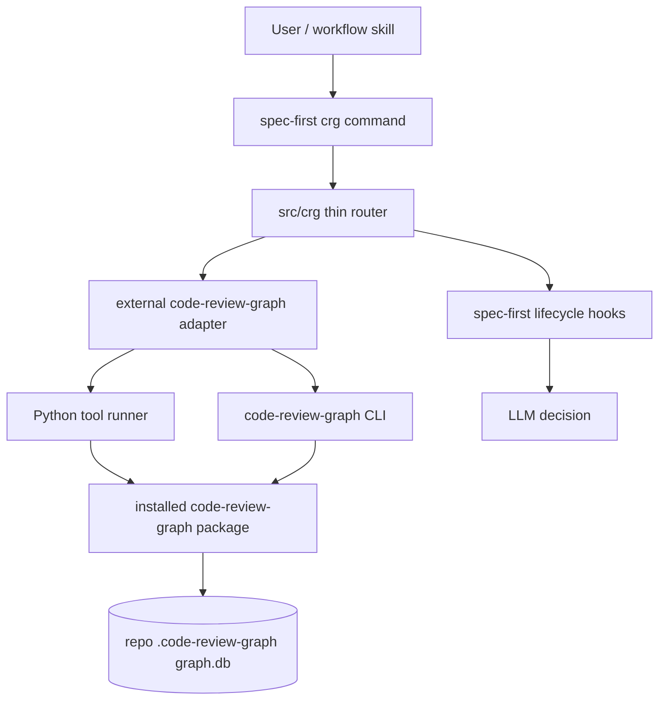

# refactor: Replace internal CRG engine with external code-review-graph

## Overview

将当前 `spec-first` 内置的 Node.js CRG 实现彻底替换为外部安装的 `code-review-graph` 能力。`spec-first` 继续保留 `spec-first crg <subcommand>` 作为 workflow 稳定入口，但内部不再维护 parser、SQLite schema、graph build、retrieval、flows、communities、review-context 等图引擎逻辑。

目标边界是：

```text
spec-first = workflow adapter
code-review-graph = graph engine
LLM = decision maker
```

本计划是硬切换方案，不保留当前 `src/crg/` 自研实现的向下兼容。旧命令、旧 JSON control-plane、旧 SQLite schema、旧 Node native dependency 只要不是 `spec-first` workflow 必要边界，都应删除或改成 external adapter。

本计划使用 plan-local `spec_id`。当前没有独立需求文档作为 origin；用户直接提出的目标是“用 `code-review-graph` 整个彻底替换当前项目 CRG 脚本，重构整个逻辑，直接使用 code-review-graph 的能力，通过安装方式集成，不考虑当前项目向下兼容”。

---

## Problem Frame

`spec-first` 当前把 CRG 图引擎和 workflow 适配层混在一个仓库里维护。`src/crg/` 同时承担两类职责：

- 确定性工具职责：源码解析、图构建、SQLite schema、graph query、review-context 计算、社区和 flow 算法。
- workflow 决策输入职责：plan/work/review hooks、workspace preflight、direct repo reads fallback、LLM advisory envelope。

这导致维护成本集中在 `spec-first` 自己身上：Node native packages、tree-sitter grammar、SQLite schema evolution、retrieval 算法、quality artifacts、generation promotion、workspace topology 和 workflow prompts 互相耦合。外部 `code-review-graph` 已经提供专业 graph engine 能力，继续在 `spec-first` 里维护第二套 graph engine 会制造多真相源。

本次重构的核心问题不是“如何迁移每个旧字段”，而是重新划分所有权：

- `code-review-graph` 拥有 graph facts。
- `spec-first` 拥有 workflow adaptation。
- LLM 拥有语义选择。

---

## Requirements Trace

- R1. `spec-first` 不再维护自研 CRG graph engine，包括 parser、graph schema、migrations、retrieval、flows、communities、quality generation 和 SQLite audit。
- R2. `spec-first crg <subcommand>` 仍作为用户和 workflow skill 的入口，但内部调用外部安装的 `code-review-graph` CLI 或 Python tool functions。
- R3. 外部 graph engine 通过安装方式集成，不 vendoring 到 npm 包，不在 `npm postinstall` 自动安装 Python 包。
- R4. `spec-first` 只保留 workflow hooks、workspace advisory、JSON envelope、readiness detection 和 direct repo reads fallback。
- R5. `doctor`、`spec-mcp-setup` readiness 和安装提示从 Node native module 检查切换为 `code-review-graph` / Python package 检查。
- R6. 删除 `package.json` 中服务旧 CRG 的 Node native optional dependencies 和 `tree-sitter` override。
- R7. 不保留旧 CRG 命令的向下兼容。没有上游等价能力且不属于 workflow 必需输入的命令应删除。
- R8. Workflow hooks 输出必须是 advisory input，不输出 final selected repo、final selected surface、pass/fail gate 或 reviewer finding。
- R9. Workspace 层仍只做 parent workspace preflight，不创建 parent graph，不自动选择 child repo，不执行 hidden combined multi-repo workflow。
- R10. 文档、skill、tests、contracts 必须统一到 external `code-review-graph` 口径，避免 `.spec-first/graph/graph.db` 和 `.code-review-graph/graph.db` 双真相源。

---

## Scope Boundaries

- 不把 `code-review-graph` 源码复制到 `spec-first`。
- 不将 `code-review-graph` Python 包 vendoring 到 npm package。
- 不自动 `pip install`、`pipx install` 或 `uv tool install`，除非用户明确调用未来可能新增的安装命令。
- 不迁移旧 `.spec-first/graph/graph.db` 数据。
- 不保留旧 Node CRG SQLite schema。
- 不保留旧 graph generation promotion、last-known-good、graph-quality、code-navigation control-plane 作为必需运行态。
- 不恢复 Stage-0、`stage0-context`、`minimal-context`、`docs/contexts` fallback。
- 不构建 cross-repo symbol graph。
- 不让 workspace 自动选择 child repo。
- 不把 review risk score 变成 gate。
- 不为旧 `surprising-connections`、`god-nodes`、`path`、`explain` 命令重造算法。

### Deferred

- 基于上游能力重新设计 `explain` 或 `path` 体验。
- 将 external `code-review-graph` 安装做成 `spec-first crg install` 的交互式 helper。
- 为 `code-review-graph` MCP server 增加 spec-first 管理入口。
- 将 `code-review-graph` daemon/watch 纳入 `spec-first` doctor 深度状态。
- 对 external graph evidence 做质量评分或 benchmark gate。

---

## Context & Research

### Current spec-first Code Surface

- `bin/spec-first.js`：当前在 `argv[0] === 'crg'` 时加载 `src/crg/cli/router.js`。
- `src/crg/cli/router.js`：当前维护旧 CRG 子命令列表和 handler map。
- `src/crg/workflow-context/stage.js`：当前聚合 `graph_status`、`code_navigation`、`repo_topology`、`graph_quality` 和 fallback。
- `src/crg/hooks/*`：当前提供 plan/work/review lifecycle advisory hooks。
- `src/crg/workspace/*`：当前提供 parent workspace scan/status/context/build。
- `src/cli/commands/doctor.js`：当前检查 `spec-first crg --help`、`better-sqlite3` 和 `tree-sitter`。
- `skills/spec-mcp-setup/scripts/detect-tools.sh`：当前把 CRG readiness 拆成 `cli_status` 和 `native_modules_status`。
- `package.json`：当前把 `better-sqlite3`、`tree-sitter` 和多语言 grammar 包作为 optional dependencies。
- `bin/postinstall.js`：当前包含 CRG native module repair 逻辑。

### External code-review-graph Capability Surface

外部 `code-review-graph` 当前是 Python package，提供：

- CLI entrypoint：`code-review-graph`
- daemon entrypoint：`crg-daemon`
- build/update/postprocess/status/watch/visualize/wiki/register/repos/detect-changes/serve/daemon CLI
- Python tool functions：`list_graph_stats`、`query_graph`、`semantic_search_nodes`、`get_impact_radius`、`find_large_functions`、`get_review_context`、`detect_changes_func`、`get_affected_flows_func`、`list_flows`、`get_flow`、`list_communities_func`、`get_community_func`、`get_architecture_overview_func`
- 默认 graph data dir：`.code-review-graph/`
- 可通过 `CRG_DATA_DIR` 覆盖 data dir

### Institutional Learnings

- `docs/10-prompt/项目角色.md`：确定性流程归脚本，语义决策归 LLM。该原则要求 `spec-first` 不把 graph engine 认知算法内化成 workflow 状态机。
- `docs/solutions/workflow-issues/modify-source-not-artifacts-2026-04-13.md`：必须修改 source-of-truth，不手改 runtime artifacts。本次应修改 `skills/`、`src/`、`docs/`、`tests/`，不手改 `.claude/`、`.codex/`、`.agents/skills/` 运行时副本。
- `docs/solutions/architecture-patterns/upstream-ce-sync-upgrade-methodology-2026-04-26.md`：外部能力同步要先判定 ownership boundary，不能机械复制路径或实现。
- `docs/plans/2026-04-27-002-refactor-agent-browser-external-tool-plan.md`：可作为 external helper/tool ownership 迁移的近期模式参考，但 CRG 是核心 workflow evidence substrate，不能完全照搬 agent-browser 的轻量 helper 处理。

---

## Key Technical Decisions

- **保留 `spec-first crg` 入口，删除内部 graph engine。** 入口是 workflow contract，engine 是实现细节。保留入口可以减少 skill 文案和用户路径冲击；删除 engine 才能真正消除维护负担。
- **优先调用 Python tool functions 返回 JSON，不解析 CLI 人类文本。** `code-review-graph status` 等 CLI 输出可能是人类文本；adapter 应通过 Python allowlist bootstrap 调用 functions，确保机器 contract 稳定。
- **build/update/install/watch/daemon 使用外部 CLI。** 这些是 state-changing 或长进程命令，直接交给 `code-review-graph` CLI 更符合工具边界。
- **采用上游默认 `.code-review-graph/` 作为 graph DB 路径。** 不使用 `CRG_DATA_DIR` 强行写入 `.spec-first/graph/`，避免用户直接运行 `code-review-graph` 时产生双 DB。
- **`spec-first` 不直接读 external SQLite schema 做业务解释。** 只通过 external tool functions 读取事实，避免 schema coupling。
- **Hook 只输出 advisory facts。** graph evidence 可以排序、提示、解释限制，但不能自动选择 repo、surface、verification 或 review findings。
- **删除无上游等价且非 workflow 必需的旧命令。** 不为了向下兼容重造 `surprising-connections`、`god-nodes`、旧 `context` 和旧 `postprocess`。
- **MCP setup readiness 改成 external CRG readiness。** 旧 `native_modules_status` 应退役，改为 `external_cli_status`、`python_package_status`、`graph_status`。

---

## High-Level Technical Design



### Runtime Flow

```text
spec-first crg stats --repo=<repo>
  -> parse args
  -> check external code-review-graph readiness
  -> run Python allowlist function list_graph_stats(repo_root)
  -> wrap result in crg-cli/v2 envelope
  -> print JSON
```

```text
spec-first crg hook before-plan --repo=<repo> --task="<task>"
  -> list_graph_stats
  -> semantic_search_nodes(task)
  -> optionally get_architecture_overview
  -> build advisory workflow_context
  -> if unavailable, return direct_repo_reads fallback
```

---

## Target Directory Shape

### Keep and Rewrite

```text
src/crg/
  cli/
    router.js
    envelope.js
    args.js
  external/
    python-runner.js
    command-map.js
    readiness.js
    errors.js
  commands/
    build.js
    stats.js
    query.js
    search.js
    impact.js
    review-context.js
    detect-changes.js
    flows.js
    communities.js
    architecture.js
  workflow-context/
    stage.js
    status.js
    navigation.js
    fallback.js
  hooks/
    shared.js
    before-plan.js
    before-work.js
    after-work.js
    before-review.js
  workspace/
    discovery.js
    status.js
    context.js
    command.js
```

### Delete or Retire

```text
src/crg/analyze.js
src/crg/changes.js
src/crg/chunking.js
src/crg/communities.js
src/crg/flows.js
src/crg/graph.js
src/crg/incremental.js
src/crg/input-convergence.js
src/crg/lang-config.js
src/crg/migrations.js
src/crg/parser.js
src/crg/retrieval/
src/crg/resolvers/
src/crg/generations/
src/crg/quality/
src/crg/eval/
```

---

## Command Mapping

| `spec-first crg` command | New implementation | Status |
|---|---|---|
| `build --repo=<repo>` | external CLI `code-review-graph build --repo=<repo>` | keep |
| `update --repo=<repo>` | external CLI `code-review-graph update --repo=<repo>` | add |
| `stats --repo=<repo>` | Python function `list_graph_stats` | keep |
| `query --pattern=<p> --target=<t>` | Python function `query_graph` | keep, adjust args |
| `search --query=<q>` | Python function `semantic_search_nodes` | keep |
| `locate --query=<q>` | Python function `semantic_search_nodes` with minimal detail | keep |
| `impact --since=<base>` | Python function `get_impact_radius` | keep |
| `large-functions` | Python function `find_large_functions` | keep |
| `review-context --since=<base>` | Python function `get_review_context` | keep |
| `detect-changes --since=<base>` | Python function `detect_changes_func` | keep |
| `flows` | Python function `list_flows` | keep |
| `flow` | Python function `get_flow` | keep |
| `affected-flows` | Python function `get_affected_flows_func` | keep |
| `communities` | Python function `list_communities_func` | keep |
| `community` | Python function `get_community_func` | keep |
| `architecture` | Python function `get_architecture_overview_func` | keep |
| `workflow-context` | spec-first aggregation over external facts | keep |
| `hook` | spec-first lifecycle advisory | keep |
| `workspace` | spec-first parent workspace advisory, child build calls external CLI | keep |
| `install` | optional helper around external install guidance | defer |
| `context` | old internal context surface | delete |
| `postprocess` | old internal postprocess surface | delete or proxy only if explicitly needed |
| `surprising-connections` | no stable upstream equivalent | delete |
| `god-nodes` | no stable upstream equivalent | delete |
| `path` | no stable upstream equivalent in current plan | delete or defer |
| `explain` | no stable upstream equivalent in current plan | delete or defer |

---

## Python Runner Contract

### Allowlist

`src/crg/external/python-runner.js` should call only a fixed allowlist:

```text
list_graph_stats
query_graph
semantic_search_nodes
get_impact_radius
find_large_functions
get_review_context
detect_changes_func
get_affected_flows_func
list_flows
get_flow
list_communities_func
get_community_func
get_architecture_overview_func
```

### Data Flow

```text
Node adapter
  -> spawn python executable
  -> stdin JSON: { "function": "...", "args": { ... } }
  -> Python bootstrap validates function name
  -> import code_review_graph tool function
  -> call with args
  -> stdout JSON
  -> Node parses JSON and wraps envelope
```

### Python Executable Resolution

Resolution order:

1. `SPEC_FIRST_CRG_PYTHON`
2. `python3`
3. `python`

### Error Handling

- Python import failure: degraded envelope with `external_crg_python_import_failed`.
- `code-review-graph` CLI missing: degraded envelope with `external_crg_cli_missing`.
- Tool function exception: non-zero exit and structured error in envelope.
- JSON parse failure: adapter error with stderr/stdout excerpt capped.
- Timeout: `external_crg_timeout`.

### Security Rules

- Do not interpolate user strings into Python source.
- Do not accept arbitrary Python module or function names.
- Do not run with shell unless platform lookup requires it.
- Cap stdout/stderr captured in error messages.
- Pass repo paths as JSON strings.

---

## Envelope Contract

Use a new envelope version because the implementation and many fields are breaking:

```json
{
  "schema_version": "crg-cli/v2",
  "generated_at": "2026-04-27T00:00:00.000Z",
  "repo_root": "/abs/repo",
  "engine": {
    "name": "code-review-graph",
    "version": "2.3.2",
    "adapter": "spec-first-external-crg"
  },
  "degraded": false,
  "warnings": [],
  "data": {}
}
```

For unavailable external CRG:

```json
{
  "schema_version": "crg-cli/v2",
  "generated_at": "2026-04-27T00:00:00.000Z",
  "repo_root": "/abs/repo",
  "engine": {
    "name": "code-review-graph",
    "version": null,
    "adapter": "spec-first-external-crg"
  },
  "degraded": true,
  "warnings": [
    {
      "type": "external_crg_unavailable",
      "message": "code-review-graph is not installed or not importable"
    }
  ],
  "data": {
    "status": "unavailable",
    "fallback": {
      "mode": "direct_repo_reads"
    }
  }
}
```

---

## Workflow Hook Design

### `before-plan`

Inputs:

```text
--repo=<repo>
--task=<task>
--detail=minimal|standard
```

Process:

1. Check external graph readiness.
2. Call `list_graph_stats`.
3. Call `semantic_search_nodes` with task text.
4. Optionally call `get_architecture_overview_func` for high-level context.
5. Return candidate files/symbols, recommended queries, limitations and fallback.

Output must include:

- `hook_id: before_plan`
- `stage: plan`
- `workflow_context`
- `candidate_surface_policy`

Output must not include:

- `selected_surface`
- `selected_repo`
- final implementation decision

### `before-work`

Inputs:

```text
--repo=<repo>
--plan=<plan.md>
--task-pack=<tasks.md>
```

Process:

1. Read plan or task-pack.
2. Extract planned files, units and context refs.
3. Call `semantic_search_nodes` for planned surface hints.
4. Record `work_start_ref`.
5. Write lightweight work-run handoff artifact if still needed.

Output must include:

- planned surface hints
- graph matches
- impact query suggestions
- `work_run_id` if a handoff artifact is written
- limitations

Output must not:

- change the plan
- block work on graph mismatch
- auto-expand task scope

### `after-work`

Inputs:

```text
--repo=<repo>
--work-run=<id>
--since=<base>
```

Process:

1. Resolve diff base from work-run or `--since`.
2. Call `detect_changes_func`.
3. Call `get_review_context`.
4. Compare planned surface and actual changed files.
5. Return mismatch hints, test gaps and review priorities.

Output must not:

- output pass/fail
- replace final verification
- create review findings

### `before-review`

Inputs:

```text
--repo=<repo>
--since=<base>
--work-run=<id>
```

Process:

1. Call `detect_changes_func`.
2. Call `get_review_context`.
3. Call `get_affected_flows_func`.
4. Return risk score, affected flows, test gaps and review priorities.

Output must not:

- replace reviewer judgment
- turn risk score into a gate
- auto-resolve findings

---

## Workspace Design

Workspace remains a `spec-first` responsibility because it is workflow boundary management, not graph engine logic.

### `workspace scan`

- Discover child git repos.
- Write `.spec-first/workspace/workspace-index.json`.
- Do not create parent graph.

### `workspace status`

- For each child repo, check external graph readiness.
- Use external `list_graph_stats` when available.
- Return readiness summary and limitations.

### `workspace context`

- Rank child repo candidates using task text, path/name signals and optional graph status.
- Return candidates and recommended repo-local commands.
- Do not output final selected repo.

### `workspace build`

- Require explicit `--repo=<child>`.
- Reject `--all`.
- Call `code-review-graph build --repo=<child>`.
- Do not create combined parent graph.

---

## Package and Install Design

### `package.json`

Remove old internal CRG native optional dependencies:

```text
better-sqlite3
tree-sitter
tree-sitter-c
tree-sitter-c-sharp
tree-sitter-cpp
tree-sitter-go
tree-sitter-java
tree-sitter-javascript
tree-sitter-kotlin
tree-sitter-objc
tree-sitter-php
tree-sitter-python
tree-sitter-ruby
tree-sitter-rust
tree-sitter-scala
tree-sitter-swift
tree-sitter-typescript
```

Remove `overrides.tree-sitter`.

If `vendor/` only serves old tree-sitter grammar packages, remove it from published files and delete obsolete fixtures.

### `bin/postinstall.js`

Remove:

- `repairCrgNativeModule`
- `probeBetterSqlite`
- `findBetterSqliteDir`
- `findPrebuildInstallBin`
- `showCrgHint`
- better-sqlite3 / tree-sitter rebuild instructions

Add lightweight note only:

```text
Graph-backed workflows require external code-review-graph.
Install with pipx or uv tool, then run code-review-graph build --repo=<repo>.
```

Do not install Python packages during npm postinstall.

---

## Doctor and MCP Setup Design

### `doctor`

Replace `checkCrgNativeModules` with `checkExternalCrg`.

New checks:

- `code-review-graph --version`
- Python import `code_review_graph`
- External graph stats if graph exists

Example output:

```text
PASS    CRG external engine: code-review-graph 2.3.2
WARNING CRG graph: missing; graph-backed workflow hooks will use direct repo reads
        Fix: Run `code-review-graph build --repo=<repo>` or `spec-first crg build --repo=<repo>`
```

### `spec-mcp-setup` readiness

Replace:

```json
{
  "crg": {
    "cli_status": "ready",
    "native_modules_status": "ready"
  }
}
```

With:

```json
{
  "crg": {
    "adapter_status": "ready",
    "external_cli_status": "ready",
    "python_package_status": "ready",
    "graph_status": "ready",
    "engine": "code-review-graph",
    "engine_version": "2.3.2"
  }
}
```

The readiness script should not inspect `better-sqlite3` or `tree-sitter`.

---

## Documentation and Skill Updates

Update these source files:

```text
skills/spec-graph-bootstrap/SKILL.md
skills/spec-plan/SKILL.md
skills/spec-work/SKILL.md
skills/spec-work-beta/SKILL.md
skills/spec-code-review/SKILL.md
skills/spec-mcp-setup/SKILL.md
skills/spec-mcp-setup/references/supported-mcp-tools.md
docs/05-用户手册/02-核心概念.md
docs/05-用户手册/04-workflows-artifacts-map.md
docs/05-用户手册/04-常见问题.md
docs/05-用户手册/05-最佳实践.md
README.md
README.zh-CN.md
```

New wording rules:

- `spec-first` integrates with external `code-review-graph`.
- `code-review-graph` owns parser, schema, DB and graph algorithms.
- `spec-first` owns workflow hooks and advisory envelopes.
- Graph-backed evidence is optional; direct repo reads remain fallback.
- `.code-review-graph/` is the default external graph data dir.
- `.spec-first/workspace/` remains the workspace advisory artifact location.
- Do not describe `.spec-first/graph/graph.db` as the current graph DB.
- Do not describe `graph-index-status.json`, `code-navigation.json` or `graph-quality.json` as required control-plane artifacts after cutover.

---

## Test Strategy

### Keep and Rewrite

```text
tests/unit/crg-router.test.js
tests/unit/crg-workflow-context-hooks.test.js
tests/unit/crg-workspace-artifacts.test.js
tests/unit/crg-workspace-command.test.js
tests/unit/crg-workspace-discovery.test.js
tests/unit/spec-plan-contracts.test.js
tests/unit/spec-work-contracts.test.js
tests/unit/spec-work-beta-contracts.test.js
tests/unit/spec-code-review-contracts.test.js
tests/unit/spec-graph-bootstrap-contracts.test.js
tests/unit/mcp-setup.sh
tests/smoke/cli.sh
```

### Add

```text
tests/unit/crg-external-runner.test.js
tests/unit/crg-external-command-map.test.js
tests/unit/crg-external-readiness.test.js
tests/unit/crg-external-envelope.test.js
tests/unit/crg-external-hooks.test.js
tests/smoke/crg-external-adapter.sh
```

### Delete or Retire

```text
tests/unit/crg-parser.test.js
tests/unit/crg-graph.test.js
tests/unit/crg-migrations.test.js
tests/unit/crg-input-convergence.test.js
tests/unit/crg-incremental.test.js
tests/unit/crg-communities.test.js
tests/unit/crg-communities-graph.test.js
tests/unit/crg-flows-scoring.test.js
tests/unit/crg-analyze.test.js
tests/unit/crg-retrieval.test.js
tests/unit/crg-retrieval-fusion.test.js
tests/unit/crg-retrieval-tokenize.test.js
tests/unit/crg-semantic-rerank.test.js
tests/unit/crg-chunking.test.js
tests/unit/crg-tsconfig-resolver.test.js
tests/unit/crg-resolve-edges-cache.test.js
tests/unit/crg-edge-provenance.test.js
tests/unit/crg-open-db.test.js
tests/unit/crg-generation-build.test.js
tests/unit/crg-quality-report.test.js
tests/e2e/crg-sqlite-audit.sh
```

### Verification Commands

```bash
npm run typecheck
npm run test:unit
npm run test:smoke
npm run build
```

External adapter smoke:

```bash
code-review-graph --version
code-review-graph build --repo=<fixture>
node bin/spec-first.js crg stats --repo=<fixture>
node bin/spec-first.js crg hook before-plan --repo=<fixture> --task="change greeting"
```

---

## Implementation Units

### U1. External Adapter Foundation

**Goal:** 建立 `code-review-graph` 调用层和新 envelope，不改变 workflow semantics。

**Files:**

```text
src/crg/cli/router.js
src/crg/cli/envelope.js
src/crg/external/python-runner.js
src/crg/external/command-map.js
src/crg/external/readiness.js
tests/unit/crg-external-runner.test.js
tests/unit/crg-external-command-map.test.js
tests/unit/crg-external-readiness.test.js
tests/unit/crg-external-envelope.test.js
```

**Test Scenarios:**

- Happy path: Python runner calls an allowlisted function and parses JSON.
- Error path: missing Python package returns degraded envelope.
- Error path: non-allowlisted function is rejected before spawning Python.
- Error path: invalid JSON stdout is reported as adapter error.
- Compatibility boundary: router help lists only supported new command surface.

### U2. Repo-Local Commands

**Goal:** 把 repo-local CRG commands 接到 external engine。

**Files:**

```text
src/crg/commands/build.js
src/crg/commands/stats.js
src/crg/commands/query.js
src/crg/commands/search.js
src/crg/commands/impact.js
src/crg/commands/review-context.js
src/crg/commands/detect-changes.js
src/crg/commands/flows.js
src/crg/commands/communities.js
src/crg/commands/architecture.js
tests/unit/crg-router.test.js
tests/smoke/crg-external-adapter.sh
```

**Test Scenarios:**

- `stats` wraps `list_graph_stats`.
- `search` and `locate` call `semantic_search_nodes`.
- `query` rejects unsupported patterns before external call when possible.
- `review-context` maps `--since` to external `base`.
- `build` calls external CLI and preserves exit failure details.

### U3. Workflow Context and Hooks

**Goal:** 改造 lifecycle hooks，让它们消费 external facts 并保留 advisory boundary。

**Files:**

```text
src/crg/workflow-context/stage.js
src/crg/workflow-context/status.js
src/crg/workflow-context/navigation.js
src/crg/workflow-context/fallback.js
src/crg/hooks/shared.js
src/crg/hooks/before-plan.js
src/crg/hooks/before-work.js
src/crg/hooks/after-work.js
src/crg/hooks/before-review.js
tests/unit/crg-workflow-context-hooks.test.js
tests/unit/crg-external-hooks.test.js
```

**Test Scenarios:**

- `before-plan` returns candidates and limitations but no selected surface.
- `before-work` returns work-run handoff and impact suggestions but no gate.
- `after-work` compares planned and actual surfaces using external detect changes.
- `before-review` returns review priorities but no final findings.
- External CRG unavailable triggers direct repo reads fallback.

### U4. Workspace Externalization

**Goal:** 保留 workspace advisory，child build/status 改用 external CRG。

**Files:**

```text
src/crg/workspace/discovery.js
src/crg/workspace/status.js
src/crg/workspace/context.js
src/crg/commands/workspace.js
tests/unit/crg-workspace-artifacts.test.js
tests/unit/crg-workspace-command.test.js
tests/unit/crg-workspace-discovery.test.js
```

**Test Scenarios:**

- Parent workspace scan writes only `.spec-first/workspace/*`.
- Parent workspace commands do not create parent graph DB.
- `workspace build --repo=<child>` invokes external build for one child.
- `workspace build --all` is rejected.
- `workspace context` returns candidates, not selected repo.

### U5. Remove Internal Graph Engine

**Goal:** 删除旧 Node CRG implementation、native dependencies 和 obsolete tests。

**Files:**

```text
package.json
package-lock.json
bin/postinstall.js
src/crg/
tests/unit/
tests/e2e/
```

**Test Scenarios:**

- `package.json` no longer declares old CRG native packages.
- `bin/postinstall.js` no longer attempts native module repair.
- `npm run build` package contents no longer include obsolete graph engine assets.
- Deleted implementation tests are not referenced by scripts or quality gates.

### U6. Doctor, MCP Setup and Docs

**Goal:** 把 readiness、skills 和 docs 全部收口到 external `code-review-graph` 口径。

**Files:**

```text
src/cli/commands/doctor.js
skills/spec-mcp-setup/SKILL.md
skills/spec-mcp-setup/scripts/detect-tools.sh
skills/spec-mcp-setup/scripts/detect-tools.ps1
skills/spec-mcp-setup/references/supported-mcp-tools.md
skills/spec-graph-bootstrap/SKILL.md
skills/spec-plan/SKILL.md
skills/spec-work/SKILL.md
skills/spec-work-beta/SKILL.md
skills/spec-code-review/SKILL.md
README.md
README.zh-CN.md
docs/05-用户手册/02-核心概念.md
docs/05-用户手册/04-workflows-artifacts-map.md
docs/05-用户手册/04-常见问题.md
docs/05-用户手册/05-最佳实践.md
tests/unit/mcp-setup.sh
tests/unit/spec-graph-bootstrap-contracts.test.js
tests/unit/spec-plan-contracts.test.js
tests/unit/spec-work-contracts.test.js
tests/unit/spec-work-beta-contracts.test.js
tests/unit/spec-code-review-contracts.test.js
```

**Test Scenarios:**

- `doctor` checks `code-review-graph`, not `better-sqlite3`.
- MCP setup readiness includes external CRG status, not native modules.
- Skills still mention advisory hooks and direct repo reads fallback.
- Skills do not mention retired Stage-0 surfaces.
- Docs do not describe `.spec-first/graph/graph.db` as current graph DB.

---

## Sequencing

1. Land U1 and U2 behind the existing `spec-first crg` entry.
2. Convert hooks in U3 after repo-local commands are available.
3. Convert workspace in U4 once external build/status are stable.
4. Remove old implementation in U5 only after command and hook tests pass.
5. Update doctor/setup/docs/skills in U6.
6. Run full validation and package build.
7. Rebuild runtime assets only if needed for manual host verification; do not commit generated runtime directories unless they are intentionally tracked.

---

## Risks and Mitigations

| Risk | Impact | Mitigation |
|---|---|---|
| External `code-review-graph` not installed | Graph-backed workflow unavailable | `doctor` and hooks produce clear install/fallback guidance |
| Python import path differs from CLI install path | Adapter fails despite CLI present | Support `SPEC_FIRST_CRG_PYTHON`; report CLI/package separately |
| CLI human text changes | Parsing breaks | Use Python tool functions for structured data |
| `.code-review-graph` and `.spec-first/graph` both exist | User confusion and stale evidence | Adopt upstream default `.code-review-graph`; document old `.spec-first/graph` as retired |
| Deleted old commands surprise existing users | Breaking change | Explicit changelog and README migration note; no compatibility layer by design |
| Hook becomes hidden state machine | LLM decision boundary erosion | Tests assert no selected repo/surface/pass-fail fields |
| External tool function schema changes | Adapter output drift | Keep adapter mapping shallow; avoid depending on deep internal schema |
| Old CRG tests/scripts linger | CI failures and false contracts | Remove obsolete tests and update package scripts in same migration |

---

## Rollout and Verification

### Local Verification

```bash
npm run typecheck
npm run test:unit
npm run test:smoke
npm run build
```

### External Tool Verification

```bash
code-review-graph --version
code-review-graph build --repo=<fixture>
node bin/spec-first.js crg stats --repo=<fixture>
node bin/spec-first.js crg search --repo=<fixture> --query="greeting"
node bin/spec-first.js crg hook before-plan --repo=<fixture> --task="change greeting"
```

### Repo Hygiene Verification

```bash
rg "better-sqlite3|tree-sitter" package.json bin src skills tests README.md docs
rg ".spec-first/graph/graph.db|graph-index-status.json|code-navigation.json|graph-quality.json" README.md skills docs tests src
```

Residual matches must be either deleted, marked historical, or explicitly justified.

---

## Done Signals

- `src/crg/` contains only external adapter, workflow hooks and workspace advisory code.
- `spec-first crg build --repo=<repo>` calls external `code-review-graph build`.
- `spec-first crg stats --repo=<repo>` returns external graph stats in `crg-cli/v2` envelope.
- `spec-first crg hook before-plan --repo=<repo> --task=<task>` returns advisory context and direct-read fallback when external graph is unavailable.
- `spec-first doctor` reports external `code-review-graph` readiness.
- `skills/spec-mcp-setup/scripts/detect-tools.sh` no longer checks `better-sqlite3` or `tree-sitter`.
- `package.json` no longer ships CRG Node native optional dependencies.
- Old parser/graph/migrations/retrieval/generation tests are removed or replaced with adapter tests.
- Workspace commands do not create parent graph DB.
- Skill and docs source-of-truth no longer describe `.spec-first/graph/graph.db` as current graph DB.
- `npm run typecheck` passes.
- `npm run test:unit` passes.
- `npm run test:smoke` passes.
- `npm run build` passes.

---

## Final Recommendation

Proceed with a hard cut. Keeping any old Node CRG core logic after this migration would preserve the exact multi-truth-source problem this refactor is meant to solve.

The stable product boundary should be:

```text
code-review-graph prepares code graph facts.
spec-first routes facts into workflow context.
LLM decides what those facts mean for the task.
```
