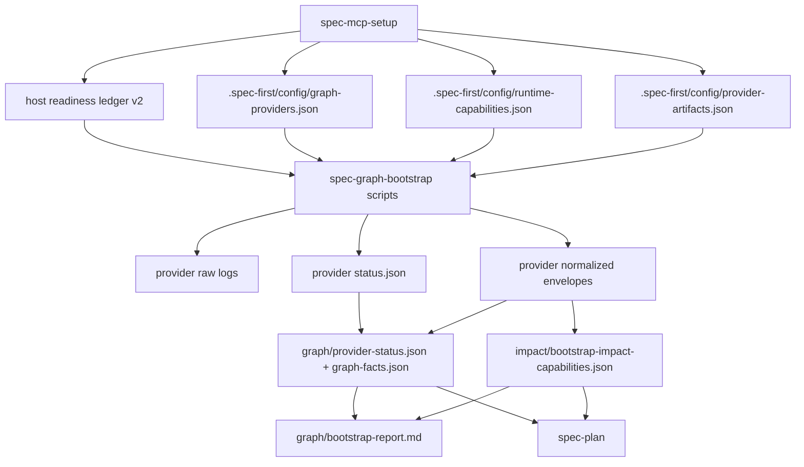

# feat: Add Graph Readiness Compiler

## Overview

把 `spec-graph-bootstrap` 从“provider build runner”升级为项目级 Graph Readiness Compiler：`spec-mcp-setup` 继续只写 setup-owned projection 和 runtime capability facts，`spec-graph-bootstrap` 读取这些 facts、运行 external graph providers、捕获 evidence、生成 provider status、canonical graph readiness facts、impact capability envelope 和用户报告。

第一版 downstream adoption 只接入 `spec-plan`：计划工作流在存在 canonical graph artifacts 时读取 `.spec-first/graph/graph-facts.json` 与 `.spec-first/impact/bootstrap-impact-capabilities.json`，判断 primary / degraded / stale / blocked graph facts，并在计划输出里显式说明证据状态。后续 `spec-write-tasks`、context selection、impact check 和 code review 消费同一 canonical artifacts，但不在本阶段实现。

---

## Problem Frame

`spec-mcp-setup` 已经负责 Required Harness Runtime Setup：安装和配置 MCP / helper / graph-provider 前置环境，写 host readiness ledger v2 与 `.spec-first/config/graph-providers.json`，并保持 graph build 不进入 setup workflow。

当前缺口是项目级 graph readiness 编译层仍过薄：`skills/spec-graph-bootstrap/scripts/bootstrap-providers.sh` 与 `.ps1` 只在 provider build command 退出 0 时把 `query_ready=true` 写回 `graph-providers.json`。它没有 raw log / provider status / normalized artifact / canonical graph facts / impact capability 的分层，也没有把 `query_ready` 建立在 provider command 和可验证 probe 的组合上。结果是下游 workflow 只能看到 setup projection 是否被翻转，不能稳定判断 provider 是否 query-ready、是否 stale、是否部分可用、是否应使用 fallback。

本计划按 origin document 的边界推进：脚本执行确定性 provider bootstrap、日志捕获、状态聚合和标准产物写入；LLM 后续只消费这些 facts 并做语义判断（see origin: `docs/brainstorms/2026-04-28-001-spec-graph-bootstrap-readiness-compiler-requirements.md`）。

---

## Requirements Trace

- R1. `spec-graph-bootstrap` 只负责项目级 graph bootstrap readiness 编译，读取 setup 产物、运行 configured graph providers、沉淀 provider status、canonical graph facts、impact capabilities 和 bootstrap report。
- R2. `spec-graph-bootstrap` 必须读取并校验 `.spec-first`、host readiness ledger v2、`graph-providers.json`、`runtime-capabilities.json` 和 `provider-artifacts.json`；后两个文件由 `spec-mcp-setup` 生成。
- R3. `baseline_ready=false`、repo 不可读、`.spec-first` 缺失或 required config 缺失时必须 fail closed，不执行 provider bootstrap，不伪造 `query_ready`。
- R4. `spec-graph-bootstrap` 不得安装工具、修改 MCP host config、生成 glue/context/review task artifacts，或恢复旧 internal CRG runtime。
- R5. GitNexus configured / enabled / setup ready 时，bootstrap 在 repo root transient 执行 provider analyze，并捕获 raw/status logs。
- R6. external `code-review-graph` configured / enabled / setup ready 时，bootstrap 在 repo root transient 执行 provider build，并捕获 raw/status logs。
- R7. `query_ready` 必须由 provider command 与 status/query probe 共同决定；command 成功但无法验证 query readiness 时保持 `query_ready=false`。
- R8. 每个 provider 必须写独立 `status.json`，包含 readiness、command、exit code、status、query readiness、confidence、limitations、repo snapshot 和 artifact paths。
- R9. provider-specific artifacts 统一落在 `.spec-first/providers/<provider>/raw|normalized` 和 provider-level `status.json`。
- R10. normalized provider artifacts 第一版是 conservative capability envelope，不编造 architecture / reuse / impact 语义结论。
- R11. 生成 `.spec-first/graph/provider-status.json`，聚合 provider readiness、artifact pointers、partial primary、ready/failed provider lists、confidence 和 limitations。
- R12. 生成 `.spec-first/graph/graph-facts.json`，作为 downstream graph facts 入口，包含 repo identity、snapshot、workflow mode、provider summary、capabilities、staleness hints、confidence 和 limitations。
- R13. 生成 `.spec-first/impact/bootstrap-impact-capabilities.json`，表达 impact/context/review support、fallback envelope、confidence、limitations 和 downstream guidance。
- R14. 生成 `.spec-first/graph/bootstrap-report.md`，面向用户说明结果、workflow mode、next actions、limitations 和 artifact paths。
- R15. 更新 `.spec-first/config/graph-providers.json` 的 provider derived summary，但不得让它成为 canonical readiness 第二真相源。
- R16. 更新 `.spec-first/config/runtime-capabilities.json` 的 project graph readiness derived summary，不覆盖 `baseline_ready` 来源语义；`spec-mcp-setup` 重跑时只能初始化缺失的 `project_graph_readiness`，不得把已存在 canonical artifacts 对应的 readiness summary 重置为 not-bootstrapped。
- R17. `workflow_mode` 判定必须区分 `primary`、`degraded-fallback`、`blocked`、`setup-not-ready`，并从 machine-readable fallback facts 判断 fallback readiness。
- R18. `skills/spec-graph-bootstrap/SKILL.md`、`bootstrap-providers.sh` 和 `.ps1` 必须对齐 Graph Readiness Compiler 职责，保持 shell / PowerShell 语义契约等价；本阶段 PowerShell 自动化验证以 source contract parity 为主。
- R19. 补充 graph-bootstrap unit tests，并更新 README / 当前用户文档 / `CHANGELOG.md`；测试入口必须接入 package/CI test script。
- R20. 第一版 downstream adoption 以 `spec-plan` 为首个消费方，读取 canonical graph artifacts 并报告 primary / degraded-fallback / stale / blocked graph facts。

**Origin actors:** A1 Developer, A2 `spec-mcp-setup`, A3 `spec-graph-bootstrap`, A4 GitNexus provider, A5 `code-review-graph` provider, A6 downstream spec workflows.

**Origin flows:** F1 setup-not-ready / blocked preflight, F2 primary graph bootstrap, F3 degraded fallback, F4 downstream consumption.

**Origin acceptance examples:** AE1 blocked/setup-not-ready, AE2 primary success, AE3 degraded fallback, AE4 provider path unification, AE5 config update, AE6 boundary preservation, AE7 test reachability, AE8 query-unverified, AE9 setup config artifacts, AE10 `spec-plan` adoption, AE11 stale detection.

### Review Refinements Accepted

- DR1. `runtime-capabilities.json` writer ownership must be explicit: setup owns baseline/host/fallback facts and may only initialize missing `project_graph_readiness`; graph-bootstrap owns canonical readiness compilation and derived project graph summary updates.
- DR2. Graph-bootstrap baseline gate source order is fixed: read `runtime-capabilities.json`, follow its `host_ledger_pointer`, validate the pointed host ledger v2, and fail closed with `reason_code=readiness-conflict` if runtime capabilities and host ledger disagree. Graph-bootstrap must not guess host ledger paths independently.
- DR3. Provider command argv definitions must come from `.spec-first/config/graph-providers.json`; shell and PowerShell bootstrap may own a safety allowlist for provider id, executable, package name, and subcommand shape, but must execute the validated arrays from config rather than a second hardcoded command table.
- DR4. Provider readiness probes are three-level evidence: build/analyze command success, status command success, and provider-specific query-surface proof. `query_ready=true` requires all three; build + status without query proof is `query-unverified`.
- DR5. `spec-plan` must emit a machine-testable Graph Readiness block when it consumes or checks canonical graph artifacts; absence of artifacts is reported as `unavailable` and planning continues with bounded direct repo reads.

---

## Scope Boundaries

- 不恢复 `src/crg/`、`spec-first crg`、旧 graph.db 生命周期或旧 internal CRG native dependency。
- 不让 `spec-mcp-setup` 运行 `gitnexus analyze` 或 `code-review-graph build`；它只写 setup-owned facts。
- 不修改 Claude/Codex MCP host config，也不安装 GitNexus、`code-review-graph`、Serena、`ast-grep`、`uvx`、`npx` 或任何 helper tool。
- 不直接解析 provider raw logs 生成架构语义结论；normalized artifacts 第一版只表达 capability envelope、artifact pointers、available query surfaces、confidence 和 limitations。
- 不生成 `glue-contract.json`、context-pack、task-level impact-facts、review-evidence 或 full review evidence pipeline。
- 不要求所有 downstream workflows 同步接入；本阶段只让 `spec-plan` 成为首个显式 consumer。
- 不把 `workflow_mode` 做成中心 gate 或强状态机；它只是给 LLM 消费的 compiled readiness fact。

### Deferred to Follow-Up Work

- `spec-write-tasks`、`spec-work`、impact-check、context-select 和 `spec-code-review` 对 canonical graph facts 的消费：后续独立计划接入同一 artifact contract。
- 更深的 provider semantic extraction、architecture summary、reuse recommendation 或 graph quality scoring：等 upstream provider 输出和下游需求稳定后再设计。
- External provider machine-readable JSON 输出的深度适配：若 GitNexus 或 `code-review-graph` 后续提供稳定 JSON status/query output，再替换当前 conservative probe 解析策略。

---

## Context & Research

### Relevant Code and Patterns

- `skills/spec-graph-bootstrap/scripts/bootstrap-providers.sh` 与 `.ps1`：当前 bootstrap runner，只读取 host ledger 与 `graph-providers.json`，执行两个 provider build command，并在 build exit 0 后翻转 `query_ready`。
- `skills/spec-graph-bootstrap/SKILL.md`：当前说明仍是 Graph Provider Bootstrap，需要升级为 Graph Readiness Compiler 的职责边界和 artifact contract。
- `skills/spec-mcp-setup/scripts/write-provider-config.sh` 与 `.ps1`：已有 semantically idempotent writer，可作为新增 `runtime-capabilities.json` / `provider-artifacts.json` writer 的模式来源。
- `skills/spec-mcp-setup/scripts/verify-tools.sh` 与 `.ps1`：当前合并 `detect-tools.*` 与 `install-helpers.* --verify-only`，写 host ledger v2，并调用 `write-provider-config.*`；新增 setup-owned config writer 应挂在同一收口点。
- `skills/spec-mcp-setup/scripts/detect-tools.sh` 与 `.ps1`：已有 machine-readable `tools`、`graph_providers` facts；fallback readiness 不能从自然语言推断，应从这些 facts 和 helper facts 派生到 `runtime-capabilities.json`。
- `tests/unit/mcp-setup.sh`：已有 fake repo、fake PATH、fake provider command pattern，可以扩展或拆出 `tests/unit/spec-graph-bootstrap.sh` 来验证 bootstrap compiler 行为。
- `tests/unit/mcp-setup-powershell-contracts.test.js`：现有 PowerShell contract tests 可扩展为 parity guard，避免 `.sh` 与 `.ps1` 行为漂移。
- `src/cli/runtime-tools-index.js` 与 `tests/unit/runtime-tools-index.test.js`：已有 root instruction managed block 和 graph-bootstrap entrypoint 文案；`spec-plan` downstream adoption 需要同步 contract tests，避免旧文案继续暗示只靠 direct repo reads。
- `README.md`、`README.zh-CN.md`：当前只说 `$spec-graph-bootstrap` “build indexes and flip query_ready”，需要更新为 canonical artifacts / graph facts / impact capability readiness。

### Institutional Learnings

- `docs/10-prompt/项目角色.md`：确定性执行归脚本，语义判断归 LLM；本计划让脚本写 bounded machine facts，避免脚本替 LLM 选择 graph evidence。
- `docs/solutions/workflow-issues/modify-source-not-artifacts-2026-04-13.md`：修改 source-of-truth，不手改 `.claude/`、`.codex/`、`.agents/skills/` 或 `.spec-first/` runtime/generated artifacts。
- `docs/solutions/developer-experience/bash-portability-pitfalls-2026-04-01.md`：shell 需按 macOS Bash 3.2 和 `set -euo pipefail` 约束设计，避免 `mapfile`、不安全数组展开和 jq hyphen key 坑。
- `docs/solutions/workflow-issues/database-routing-and-dual-view-refresh-boundaries-2026-04-20.md`：新 artifact 要分清静态事实、runtime readiness 和 compatibility summary；对本计划同样适用，canonical graph facts 与 config summary 不能混成第二真相源。
- `docs/solutions/architecture-patterns/upstream-ce-sync-upgrade-methodology-2026-04-26.md`：跨 workflow 资产演进要先判定 ownership boundary，不能机械复制旧 CRG 或外部 provider 设计。

### External References

- 本计划未依赖外部文档。Provider command surface 通过本地 `gitnexus --help` 与 `code-review-graph --help` 验证：GitNexus 提供 `analyze`、`status`、`query`；`code-review-graph` 提供 `build`、`status`、`detect-changes`、`serve`。计划只把这些作为 command/probe surface，不从 help 文本推断语义 facts。

---

## Key Technical Decisions

- **`runtime-capabilities.json` 与 `provider-artifacts.json` 由 `spec-mcp-setup` 写，`spec-graph-bootstrap` 只消费。** 这样 setup facts 与 project graph readiness facts 边界清晰；缺失或 schema 不支持时 bootstrap fail closed，而不是现场补造 setup config。
- **`runtime-capabilities.json` 不能让 setup 重跑造成 readiness 倒退。** `spec-mcp-setup` 只拥有 baseline / host runtime / fallback runtime facts；对 `project_graph_readiness` 只初始化缺失字段。若 canonical graph artifacts 已存在，setup writer 必须保留或重新引用 canonical summary，不得无条件覆盖为 `not-bootstrapped`。
- **Graph-bootstrap 不猜 host ledger path。** Preflight 先读取 `.spec-first/config/runtime-capabilities.json` 中的 baseline summary 与 `host_ledger_pointer`，再校验 pointer 指向的 host readiness ledger v2；若 runtime capabilities 与 host ledger 冲突，fail closed 并输出 `reason_code=readiness-conflict`。
- **Provider commands 由 `graph-providers.json` 统一定义。** `graph-providers.json` v1 承担 provider command definition source，至少包含 `bootstrap`、`status` 和 `query_probe` / provider-specific query proof command；`provider-artifacts.json` 只描述 artifact path contract。Shell、PowerShell、测试和文档都读取或断言这一单一来源，避免命令散落硬编码。
- **Canonical graph artifacts 是 readiness 真相源，config files 只保留派生摘要。** `.spec-first/graph/provider-status.json` 与 `.spec-first/graph/graph-facts.json` 承担 authoritative compiled readiness；`graph-providers.json` 和 `runtime-capabilities.json` 更新只用于 next action、staleness summary 和 host/runtime UI。
- **`query_ready=true` 需要 build command、status probe、query proof 三层证据。** GitNexus v1 probe 使用 `status` 加一个轻量 `query` surface proof；`code-review-graph` v1 probe 可使用 `status --repo` 作为 provider-specific query proof，但只有 command definition 明确该 probe 能证明 query surface 时才算 Level 3。任一 probe exit 非 0、无法执行、或输出不足以证明 provider 可查询时，状态为 `query-unverified` 且 `query_ready=false`。
- **Normalized artifacts 先做 capability envelope，不做 semantic extraction。** `architecture-facts.json`、`reuse-candidates.json`、`impact-capabilities.json` 第一版只写 provider status、available query surfaces、artifact pointers、confidence 和 limitations，避免脚本编造架构结论。
- **Confidence 和 fallback support 使用固定枚举。** `confidence` 只允许 `high` / `medium` / `low` / `unknown`；能力支持用 `support_level: full | partial | none` 表达，避免把 `partial`、`degraded`、`unverified` 混入 confidence 或 boolean `supported`。
- **Degraded fallback 保留 partial primary provider，而不是 all-or-nothing。** `workflow_mode=degraded-fallback` 可同时包含 `ready_primary_providers=["gitnexus"]` 与 `failed_primary_providers=["code-review-graph"]`；per-capability envelope 再说明 `context_selection`、`impact_radius`、`review_support` 支持程度。
- **Staleness 由 repo snapshot facts 判断。** Provider status 和 graph facts 记录 `source_revision` 与 `worktree_dirty`；downstream 读取时与当前 repo snapshot 比较，若不一致则把 graph facts 降为 `stale`，不把 stale facts 当作 current primary evidence。
- **Shell 先落地，PowerShell 做 contract-level parity。** `.sh` 与 `.ps1` 都要覆盖 preflight、provider execution、raw log、status、canonical artifact、config update 和 workflow mode；本阶段自动化验证以 shell fake-provider behavior tests 为主，PowerShell 用 source contract tests 守住 schema、路径、mode 和 command-definition parity。完整 Windows behavioral parity 可在有 Windows runner 时补测。

---

## Open Questions

### Resolved During Planning

- `.spec-first/config/runtime-capabilities.json` v1 schema：由 `spec-mcp-setup` 写入，包含 repo identity、host ledger pointer、fallback tools readiness、project graph readiness summary placeholder / derived summary、generated metadata；fallback tools 至少包含 Serena 和 `ast-grep` 的 machine-readable `support_level`、`readiness_status`、`confidence`、`capabilities`、`limitations`。Setup writer 只初始化缺失的 `project_graph_readiness`；若 `.spec-first/graph/graph-facts.json` 已存在，则保留或重新引用 canonical summary。
- `.spec-first/config/graph-providers.json` v1 command definitions：provider entries 必须包含单一 command-definition source，例如 `commands.bootstrap`、`commands.status`、`commands.query_probe` / provider-specific query proof。`spec-graph-bootstrap` 执行这些数组命令；测试和 PowerShell contract 断言同一字段，而不是复制另一份命令表。
- `.spec-first/config/provider-artifacts.json` v1 schema：由 `spec-mcp-setup` 写入 provider artifact path contract，声明每个 provider 的 `raw_dir`、`normalized_dir`、`status_path`、allowed raw log names、normalized artifact names，以及 canonical graph/impact/report paths。
- Provider probe baseline：GitNexus build 后必须通过 Level 2 `status` 和 Level 3 lightweight `query` probe；`code-review-graph` build 后必须通过 configured status/proof probe，且只有 command-definition 明确能证明 query surface 时才算 Level 3。Level 1 build/analyze 成功 + Level 2 status 成功但 Level 3 缺失或失败时，必须写 `status=query-unverified`、`query_ready=false`、`confidence=medium|low`。
- Conservative normalized artifact schema：每个 normalized artifact 都是 envelope，字段聚焦 `schema_version`、`provider`、`generated_at`、`source_status_path`、`source_raw_logs`、`available_query_surfaces`、`capabilities`、`confidence`、`limitations`，并使用固定 `confidence` 枚举与 `support_level` 枚举；不包含脚本推断出的 architecture / reuse / impact semantic claims。
- Test strategy：使用 temp git repo、fake HOME、fake PATH、fake `npx` / `uvx` commands 和 fixture config，断言 output tree、JSON fields、raw logs、query-unverified、fallback mode 与 config update；real provider execution 不作为 unit path 的前提。
- `spec-plan` minimum adoption：读取 canonical artifacts、判断 stale/block/degraded，并输出固定 `## Graph Readiness` block；不扩展成 context-select 或 review-evidence pipeline。

### Deferred to Implementation

- Provider raw `status` 输出是否有 stable machine-readable JSON：实现时先按 conservative exit-code + bounded text capture 处理；如 upstream 输出稳定 JSON，可在不改变 artifact contract 的前提下增强解析。
- GitNexus repo alias resolution：若 lightweight query probe 需要 repo alias，先从 `status/list` 可验证输出中取；取不到时不得猜测，保持 `query-unverified`。
- Exact diagnostic truncation length：需实现时按现有脚本风格和测试可读性确定，但 summary 必须包含 `diagnostics_truncated` 和 `raw_log` pointer，避免无限 raw text 进入 config summary 且保留追溯路径。
- PowerShell JSON serialization ordering：实现时可采用 stable ordered hashtable 或 contract tests 校准；计划只要求语义等价，不要求 byte-for-byte 等价。

---

## Output Structure

```text
.spec-first/
  config/
    graph-providers.json
    runtime-capabilities.json
    provider-artifacts.json
  providers/
    gitnexus/
      raw/
        analyze.log
        status.log
        query.log
      normalized/
        architecture-facts.json
        reuse-candidates.json
      status.json
    code-review-graph/
      raw/
        build.log
        status.log
      normalized/
        impact-capabilities.json
      status.json
  graph/
    provider-status.json
    graph-facts.json
    bootstrap-report.md
  impact/
    bootstrap-impact-capabilities.json
```

This tree is a scope declaration for runtime artifacts. Source changes remain under `skills/`, `tests/`, `src/cli/`, `README*`, and `CHANGELOG.md`; generated runtime copies under `.claude/`, `.codex/`, and `.agents/skills/` are not hand-edited.

---

## High-Level Technical Design

> *This illustrates the intended approach and is directional guidance for review, not implementation specification. The implementing agent should treat it as context, not code to reproduce.*



### Workflow Mode Matrix

| Condition | `workflow_mode` | Provider commands run? | Downstream meaning |
|---|---|---:|---|
| `baseline_ready=false` | `setup-not-ready` | No | Rerun/fix `spec-mcp-setup` before relying on graph facts |
| required config/schema missing or unreadable | `blocked` | No | Setup-owned facts are missing or unsupported |
| both providers build + status + query proof success | `primary` | Yes | Canonical graph facts can be treated as current if snapshot is fresh |
| one provider failed/skipped/query-unverified and fallback ready | `degraded-fallback` | Yes for eligible providers | Continue with explicit limitations and partial primary availability |
| providers not ready and fallback not ready | `blocked` with `reason_code=graph-not-ready` | Yes for eligible providers | Do not claim graph-supported context/impact evidence |
| recorded snapshot differs from current repo | downstream status `stale` | No | Facts are readable but must be rerun before current primary use |

---

## Implementation Units

- U1. **Add setup-owned runtime capability and provider artifact contracts**

**Goal:** Make `spec-mcp-setup` generate the two required config inputs that `spec-graph-bootstrap` must consume fail-closed.

**Requirements:** origin R2, R16, R17, R19; supports F1, F3; covers AE1, AE9.

**Dependencies:** None.

**Files:**
- Modify: `skills/spec-mcp-setup/scripts/write-provider-config.sh`
- Modify: `skills/spec-mcp-setup/scripts/write-provider-config.ps1`
- Modify: `skills/spec-mcp-setup/scripts/verify-tools.sh`
- Modify: `skills/spec-mcp-setup/scripts/verify-tools.ps1`
- Modify: `skills/spec-mcp-setup/SKILL.md`
- Modify: `skills/spec-mcp-setup/references/supported-mcp-tools.md`
- Test: `tests/unit/mcp-setup.sh`
- Test: `tests/unit/mcp-setup-powershell-contracts.test.js`

**Approach:**
- Extend final setup verification to write `.spec-first/config/runtime-capabilities.json` and `.spec-first/config/provider-artifacts.json` only inside a readable git repo with `.spec-first/config/`.
- Derive `runtime-capabilities.json` from existing `detect-tools.*` and `install-helpers.* --verify-only` facts. Keep `baseline_ready` ownership in the host ledger; runtime capabilities may reference ledger facts but must not redefine them.
- In `runtime-capabilities.json`, setup owns only baseline / host runtime / fallback runtime fields. It may initialize missing `project_graph_readiness`, but if canonical graph artifacts already exist it must preserve or relink their derived summary rather than resetting readiness to `not-bootstrapped`.
- Extend `graph-providers.json` provider entries with command definitions for `bootstrap`, `status`, and `query_probe` / provider-specific query proof. These command arrays are the only provider command source consumed by bootstrap scripts.
- Derive `provider-artifacts.json` from `graph-providers.json` provider keys and the fixed artifact path policy under `.spec-first/providers/<provider>/`.
- Preserve `write-provider-config.*` idempotency pattern: repeated setup should not churn timestamps when semantic payload is unchanged.
- Keep helper tools out of `mcp-tools.json`; `ast-grep` fallback readiness comes from helper facts and global skill readiness.

**Patterns to follow:**
- `skills/spec-mcp-setup/scripts/write-provider-config.sh` for same-directory tempfiles, chmod-before-mv, existing-payload preservation, and jq bracket notation.
- `tests/unit/mcp-setup.sh` fake repo / fake PATH pattern for setup-owned artifact assertions.

**Test scenarios:**
- Covers AE9. Happy path: given fake repo setup completes with Serena ready and `ast-grep` helper ready, `runtime-capabilities.json` exists with `schema_version="runtime-capabilities.v1"` and machine-readable fallback entries for Serena and `ast-grep`.
- Covers AE9. Happy path: given setup writes `graph-providers.json`, `provider-artifacts.json` exists with `schema_version="provider-artifacts.v1"` and provider paths under `.spec-first/providers/gitnexus/` and `.spec-first/providers/code-review-graph/`.
- Edge case: given not-git-repo setup verification, setup does not write project config artifacts and reports project config status as skipped/not applicable without changing host ledger `baseline_ready` semantics.
- Error path: given unsupported existing provider-artifacts schema, setup replaces it only when it owns the file shape and can derive the new v1 contract; otherwise the bootstrap unit treats unsupported schema as blocked.
- Integration: repeated setup after query-ready provider projection preserves graph readiness summary as derived facts without forcing graph bootstrap again or resetting `project_graph_readiness` to `not-bootstrapped`.
- Contract: `graph-providers.json` contains command argv definitions for each configured provider, while shell/PowerShell keep only the safety allowlist needed to reject unsupported executable/package shapes.

**Verification:**
- Setup can produce all bootstrap-required config inputs in a fake repo without running provider build commands.
- Host ledger remains the only source for `baseline_ready`; runtime-capabilities records fallback support and derived graph readiness only.

---

- U2. **Build shared graph readiness preflight and snapshot model**

**Goal:** Give `spec-graph-bootstrap` a deterministic preflight that resolves repo state, validates setup-owned inputs, and writes blocked/setup-not-ready output without executing provider commands.

**Requirements:** origin R1, R2, R3, R4, R17, R18; supports F1; covers AE1, AE6.

**Dependencies:** U1.

**Files:**
- Modify: `skills/spec-graph-bootstrap/scripts/bootstrap-providers.sh`
- Modify: `skills/spec-graph-bootstrap/scripts/bootstrap-providers.ps1`
- Modify: `skills/spec-graph-bootstrap/SKILL.md`
- Test: `tests/unit/spec-graph-bootstrap.sh`
- Test: `tests/unit/mcp-setup-powershell-contracts.test.js`

**Approach:**
- Add a shared preflight phase to validate git repo, `.spec-first` writability, host ledger v2, `graph-providers.json`, `runtime-capabilities.json`, and `provider-artifacts.json`.
- Resolve host readiness through `runtime-capabilities.json`: read its `host_ledger_pointer`, validate the pointed ledger schema/version, and compare any duplicated baseline summary against the ledger. If the pointer is missing, unreadable, unsupported, or conflicts with runtime capabilities, emit `workflow_mode=blocked`, `reason_code=readiness-conflict` or `schema-unsupported`, and do not run providers.
- Do not call host detection as an alternate ledger path resolver inside graph-bootstrap. If setup has not written a valid pointer, the correct next action is rerun/fix `spec-mcp-setup`.
- Record a repo snapshot with `repo_root`, current `source_revision`, and `worktree_dirty`. If git information is unavailable after repo resolution, block rather than inventing freshness facts.
- For `baseline_ready=false`, emit `workflow_mode=setup-not-ready` and do not execute provider commands.
- For missing/unreadable required inputs, emit `workflow_mode=blocked`, `reason_code`, `missing_inputs`, `writable_artifact_root`, and `next_action`. Unsupported schema must use a stable reason such as `schema-unsupported` and point users to rerun `spec-mcp-setup` to regenerate v1 config artifacts.
- When `.spec-first` is writable, write a minimal `.spec-first/graph/bootstrap-report.md`; when it is not writable, stdout JSON is authoritative.

**Patterns to follow:**
- Current `bootstrap-providers.sh` ledger/config validation flow.
- `docs/solutions/developer-experience/bash-portability-pitfalls-2026-04-01.md` for Bash 3.2-safe loops, jq `--arg`, and temp file safety.

**Test scenarios:**
- Covers AE1. Error path: given host ledger exists with `baseline_ready=false`, neither fake `npx` nor fake `uvx` build command is invoked, stdout JSON has `workflow_mode=setup-not-ready`, and any writable report states setup is not ready.
- Covers AE1. Error path: given missing `runtime-capabilities.json`, no provider command runs, `workflow_mode=blocked`, `reason_code` names missing config, and `missing_inputs` includes the repo-relative path.
- Covers AE1/DR2. Error path: given `runtime-capabilities.json` points at a host ledger whose `baseline_ready` conflicts with the runtime summary, no provider command runs and the output uses `reason_code=readiness-conflict`.
- Covers AE1/P2. Error path: given unsupported config schema, no provider command runs and `next_action` says to rerun `spec-mcp-setup` to regenerate v1 config artifacts.
- Covers AE1. Error path: given `.spec-first` cannot be written, stdout JSON includes `writable_artifact_root=false` and is parseable without relying on Markdown report.
- Covers AE6. Boundary: preflight never writes MCP host config, never creates `src/crg/`, and never creates task-level artifacts.

**Verification:**
- All blocked/setup-not-ready flows are machine-readable and do not mutate provider readiness.
- Provider execution can only start after required setup-owned config and schemas are validated.

---

- U3. **Implement provider execution, probes, and provider-level artifacts**

**Goal:** Run configured external providers, capture raw evidence, verify query readiness with probes, and write provider-specific status plus normalized envelopes.

**Requirements:** origin R5, R6, R7, R8, R9, R10, R18; supports F2, F3; covers AE2, AE3, AE4, AE8.

**Dependencies:** U1, U2.

**Files:**
- Modify: `skills/spec-graph-bootstrap/scripts/bootstrap-providers.sh`
- Modify: `skills/spec-graph-bootstrap/scripts/bootstrap-providers.ps1`
- Modify: `skills/spec-graph-bootstrap/SKILL.md`
- Test: `tests/unit/spec-graph-bootstrap.sh`
- Test: `tests/unit/mcp-setup-powershell-contracts.test.js`

**Approach:**
- Load provider command arrays from `.spec-first/config/graph-providers.json` and record both command display and command source path in provider status. Bootstrap scripts must not keep a separate execution command table; any hardcoded provider data is limited to the safety allowlist.
- For GitNexus, write raw `analyze.log`, `status.log`, and `query.log` under `.spec-first/providers/gitnexus/raw/`.
- For `code-review-graph`, write raw `build.log` and `status.log` under `.spec-first/providers/code-review-graph/raw/`.
- Provider `status.json` must include configured/enabled/setup readiness, command display, command source, exit code, status, `query_ready`, confidence, limitations, generated timestamp, repo snapshot, raw log paths, normalized artifact paths, `diagnostics`, `diagnostics_truncated`, and raw log pointers.
- Set `query_ready=true` only when Level 1 build/analyze command, Level 2 status probe, and Level 3 provider-specific query-surface proof all succeed. Set `status=query-unverified` and `query_ready=false` when build succeeds but status/query proof fails, cannot run, or cannot verify a query surface.
- Generate conservative normalized envelopes:
  - `.spec-first/providers/gitnexus/normalized/architecture-facts.json`
  - `.spec-first/providers/gitnexus/normalized/reuse-candidates.json`
  - `.spec-first/providers/code-review-graph/normalized/impact-capabilities.json`
- Normalized envelopes describe available surfaces and limitations; they do not synthesize architecture, reuse, or impact semantics from raw logs.

**Patterns to follow:**
- Current provider loop in `bootstrap-providers.sh`, but with raw log paths persisted rather than temp stdout/stderr deletion.
- `mcp-tools.json` provider capability arrays for initial capability names.

**Test scenarios:**
- Covers AE2. Happy path: fake `npx gitnexus analyze`, fake GitNexus status/query probes, fake `uvx code-review-graph build`, and fake CRG status probe all succeed; provider raw logs, provider `status.json`, and normalized envelopes exist under `.spec-first/providers/**`.
- Covers AE8. Error path: fake GitNexus analyze exits 0 but query probe exits nonzero; GitNexus provider status is `query-unverified`, `query_ready=false`, and diagnostic explains command success did not prove query readiness.
- Covers DR4. Error path: fake provider build and status both succeed but configured query proof is missing or exits nonzero; provider status remains `query-unverified`, not ready.
- Covers DR3. Contract: changing provider command arrays within the supported executable/package shape in fixture `graph-providers.json` changes the command invoked by shell bootstrap, proving bootstrap reads config argv while still enforcing safety.
- Covers AE3. Error path: fake GitNexus succeeds, fake `code-review-graph build` fails; GitNexus remains ready, CRG `query_ready=false`, and failure raw logs/status are retained.
- Covers AE4. Path boundary: no provider raw evidence is written under `.spec-first/graph/raw/<provider>/`.
- Edge case: provider configured=false or enabled=false is recorded as skipped with `query_ready=false`, limitations, and no build command invocation.

**Verification:**
- `query_ready` is never inferred from build exit code alone.
- Every provider has enough evidence for a downstream reader to inspect status, raw logs, normalized envelope, and limitations.

---

- U4. **Compile canonical graph facts, impact capabilities, report, and derived config summaries**

**Goal:** Aggregate provider statuses into authoritative canonical project artifacts, compute workflow mode, and update config summaries without creating a second truth source.

**Requirements:** origin R11, R12, R13, R14, R15, R16, R17, R18; supports F2, F3; covers AE2, AE3, AE5, AE8, AE11.

**Dependencies:** U1, U2, U3.

**Files:**
- Modify: `skills/spec-graph-bootstrap/scripts/bootstrap-providers.sh`
- Modify: `skills/spec-graph-bootstrap/scripts/bootstrap-providers.ps1`
- Modify: `skills/spec-graph-bootstrap/SKILL.md`
- Modify: `skills/spec-mcp-setup/SKILL.md`
- Test: `tests/unit/spec-graph-bootstrap.sh`
- Test: `tests/unit/mcp-setup-powershell-contracts.test.js`

**Approach:**
- Write `.spec-first/graph/provider-status.json` as provider-level aggregate with ready/failed primary provider lists, `partial_primary_available`, artifact pointers, diagnostics, `diagnostics_truncated`, raw log pointers, confidence, and limitations.
- Write `.spec-first/graph/graph-facts.json` as downstream graph facts entrypoint with repo identity, source revision, worktree dirty flag, workflow mode, provider summary, canonical artifact pointers, available graph capabilities, staleness hints, confidence, and limitations.
- Write `.spec-first/impact/bootstrap-impact-capabilities.json` with per-capability support for `context_selection`, `impact_radius`, and `review_support`. In degraded mode, each capability explicitly names primary/fallback support, `support_level`, confidence, and limitations; unsupported remains `support_level=none`.
- Write `.spec-first/graph/bootstrap-report.md` for user-facing next actions and artifact paths.
- Update `graph-providers.json` provider entries with derived `query_ready`, `bootstrap_required`, `last_bootstrap_status`, `last_bootstrapped_at`, diagnostic summary, and artifact pointers.
- Update `runtime-capabilities.json` `project_graph_readiness` summary from canonical artifacts, preserving setup-owned fallback facts and avoiding conflicts with canonical graph facts. If a summary already points to the same canonical artifact and repo snapshot, preserve semantic identity rather than rewriting it as a fresh unbootstrapped placeholder.
- Validate enum use while compiling summaries: `confidence` is `high|medium|low|unknown`; capability support is `support_level: full|partial|none`; provider states such as `query-unverified` remain status values, not confidence values.

**Patterns to follow:**
- `write-provider-config.*` derived summary pattern: graph-providers remains projection/summary, not canonical.
- README readiness wording: distinguish setup readiness from graph query readiness.

**Test scenarios:**
- Covers AE2. Happy path: both provider statuses `query_ready=true`; `workflow_mode=primary`; canonical graph and impact artifacts exist; config summaries point to canonical artifact paths.
- Covers AE3. Degraded path: one provider ready and one failed; `workflow_mode=degraded-fallback`; `partial_primary_available=true`; ready/failed provider lists are correct; unsupported fallback capabilities are marked `support_level=none`.
- Covers AE8. Query-unverified path: build command success but probe failure produces `workflow_mode=degraded-fallback` when fallback ready and `blocked` / `reason_code=graph-not-ready` when fallback not ready.
- Covers AE5. Repeat bootstrap: previous success updates timestamps and status without changing setup-owned facts into host setup facts; derived summaries match canonical artifacts.
- Covers AE11. Staleness: graph-facts records source revision and dirty state; downstream freshness helper can detect mismatch against current repo snapshot.
- Covers P2. Diagnostic truncation: oversized diagnostics are summarized with `diagnostics_truncated=true` and a `raw_log` pointer; config summaries do not embed unbounded provider output.

**Verification:**
- Downstream can decide graph readiness from `.spec-first/graph/*` and `.spec-first/impact/*` without scraping provider raw logs.
- Config summaries are derived, consistent, and traceable back to canonical artifacts.

---

- U5. **Keep shell and PowerShell contract parity**

**Goal:** Ensure Windows/PowerShell users get the same Graph Readiness Compiler semantics at source contract level, while making clear that full Windows behavioral parity requires a Windows runner.

**Requirements:** origin R18, R19; supports F1, F2, F3; covers AE1-AE9.

**Dependencies:** U1, U2, U3, U4.

**Files:**
- Modify: `skills/spec-graph-bootstrap/scripts/bootstrap-providers.ps1`
- Modify: `skills/spec-mcp-setup/scripts/verify-tools.ps1`
- Modify: `tests/unit/mcp-setup-powershell-contracts.test.js`
- Test: `tests/unit/spec-graph-bootstrap.sh`

**Approach:**
- Mirror shell behavior in PowerShell using ordered objects, explicit path construction, captured stdout/stderr, and atomic-ish write patterns available to PowerShell.
- Add source contract tests for PowerShell to assert required schema strings, artifact paths, workflow mode names, query-unverified handling, command-definition consumption, provider raw/normalized paths, and runtime-capabilities/provider-artifacts writer hooks.
- Avoid treating JS source contract tests as full behavioral parity proof; shell behavior tests remain the primary executable verification path, while PowerShell contract tests prevent obvious parity drift. PowerShell parity v1 is contract-level automated parity unless a Windows runner is added.

**Patterns to follow:**
- Existing `tests/unit/mcp-setup-powershell-contracts.test.js` source assertions for TOML and provider projection parity.
- `verify-tools.ps1` ordered hashtable construction and config update pattern.

**Test scenarios:**
- Happy path: PowerShell source contains the same canonical artifact paths and schema versions as shell.
- Error path: PowerShell source contains `setup-not-ready`, `blocked`, `degraded-fallback`, `primary`, and `query-unverified` handling.
- Integration boundary: PowerShell writer updates `runtime-capabilities.json` and `provider-artifacts.json` but does not run graph provider build commands from setup.
- Parity guard: adding a new required shell artifact path without updating PowerShell fails the JS contract test.
- Documentation guard: docs state that PowerShell parity v1 is contract-level parity in automated tests, not full Windows behavioral parity.

**Verification:**
- PowerShell scripts expose the same contract and artifact paths as shell scripts before runtime validation is attempted on Windows.

---

- U6. **Add graph-bootstrap unit tests and package test entry**

**Goal:** Make Graph Readiness Compiler behavior repeatably testable without real provider network/build execution, and ensure normal validation cannot bypass it.

**Requirements:** origin R19; supports all flows; covers AE1-AE9.

**Dependencies:** U1, U2, U3, U4, U5.

**Files:**
- Add: `tests/unit/spec-graph-bootstrap.sh`
- Modify: `tests/unit/mcp-setup.sh`
- Modify: `package.json`
- Modify: `tests/unit/dual-host-governance-contracts.test.js`
- Modify: `tests/unit/no-crg-runtime-contracts.test.js`
- Test: `tests/unit/spec-graph-bootstrap.sh`

**Approach:**
- Split graph-bootstrap-specific fake command coverage into `tests/unit/spec-graph-bootstrap.sh`, leaving `tests/unit/mcp-setup.sh` focused on setup.
- Use temp repos and fake `npx` / `uvx` scripts to simulate primary success, provider failure, query-unverified, skipped provider, missing config, fallback ready, and fallback not ready.
- Add a package script such as `test:graph-bootstrap` and include it in the normal `test:unit` chain.
- Update governance tests that currently assert the old thin bootstrap wording so they expect Graph Readiness Compiler scope and canonical artifacts.
- Keep tests read/write confined to temp repos and fake HOME; do not run real provider builds.

**Patterns to follow:**
- Existing `tests/unit/mcp-setup.sh` helper functions (`make_fake_bin`, `make_repo`, assertion helpers).
- Existing package script naming pattern (`test:mcp-setup`, `test:unit`).

**Test scenarios:**
- Covers AE1. Baseline blocked and missing config flows do not invoke fake provider commands.
- Covers AE2. Primary success writes all provider, canonical graph, canonical impact, config summary, and report artifacts.
- Covers AE3. Provider failure plus fallback ready writes degraded-fallback with partial primary availability.
- Covers AE4. Output tree assertions reject `.spec-first/graph/raw/<provider>/`.
- Covers AE5. Repeat bootstrap updates derived readiness without corrupting setup-owned fields.
- Covers DR1. Rerunning `spec-mcp-setup` after successful graph-bootstrap does not reset `runtime-capabilities.project_graph_readiness` to `not-bootstrapped`.
- Covers DR2. Runtime capabilities / host ledger conflict fails closed with `reason_code=readiness-conflict` and does not invoke fake providers.
- Covers AE7. `package.json` normal unit chain includes the new graph-bootstrap test entry.
- Covers AE8/DR4. Query-unverified path leaves provider `query_ready=false`, including the case where build/status succeed but query proof is absent or unverifiable.
- Covers AE9. Setup-generated config artifacts are prerequisites in fake repo flow.
- Covers DR3. Provider commands are resolved from `graph-providers.json` command definitions; shell and PowerShell tests fail if bootstrap keeps an independent execution command table beyond the safety allowlist.

**Verification:**
- A normal unit-test run exercises graph-bootstrap behavior through fake providers and fails on the old “exit 0 means query_ready” behavior.

---

- U7. **Adopt canonical graph facts in spec-plan**

**Goal:** Make `spec-plan` the first downstream consumer of canonical graph readiness artifacts without turning planning into context-select or review evidence generation.

**Requirements:** origin R12, R13, R20; supports F4; covers AE10, AE11.

**Dependencies:** U4, U6.

**Files:**
- Modify: `skills/spec-plan/SKILL.md`
- Modify: `tests/unit/spec-plan-contracts.test.js`
- Optional Modify: `skills/spec-plan/references/deepening-workflow.md`
- Test: `tests/unit/spec-plan-contracts.test.js`

**Approach:**
- Add a bounded local research step: when `.spec-first/graph/graph-facts.json` and `.spec-first/impact/bootstrap-impact-capabilities.json` exist, read them before deciding how much graph evidence to trust.
- Compare graph facts `source_revision` and `worktree_dirty` to current repo snapshot. If mismatched, report graph facts as `stale` and do not treat them as primary current evidence.
- In generated plans, include a machine-testable Graph Readiness block, preferably before or inside `Context & Research`:

```md
## Graph Readiness

- status: primary | degraded-fallback | stale | blocked | setup-not-ready | unavailable
- source_revision:
- current_revision:
- stale:
- primary_providers:
- degraded_providers:
- fallback_capabilities:
- confidence:
- limitations:
```

- If canonical artifacts are missing, emit `status: unavailable` and continue with bounded direct repo reads. If artifacts are blocked/setup-not-ready/stale, report the status and continue local research when possible rather than treating graph readiness as a hard planning gate.
- Preserve existing Context Orientation Anchor: external tools may prioritize inspection, but the LLM still chooses candidate change surface from repo context and source-plan constraints.
- Do not require graph facts for planning; absent artifacts fall back to bounded direct repo reads and local research.

**Patterns to follow:**
- Existing `skills/spec-plan/SKILL.md` Phase 1 local research structure.
- `tests/unit/spec-plan-contracts.test.js` context-orientation assertions.

**Test scenarios:**
- Covers AE10. Happy path: skill prose requires reading canonical graph-facts and impact capabilities when present, and requires the plan output to state graph facts status.
- Covers AE11. Edge case: skill prose requires stale detection by comparing recorded source revision / dirty state to current repo state.
- Degraded path: skill prose says degraded-fallback is usable with limitations, not a hard failure.
- Blocked path: skill prose says blocked/setup-not-ready graph facts should be reported and planning should proceed with local research when possible.
- Covers DR5. Contract: generated plan examples and tests require a stable Graph Readiness block with `status`, revisions, stale flag, providers, fallback capabilities, confidence, and limitations; prose-only mention is insufficient.
- Missing-artifact path: absence of canonical graph artifacts yields `status: unavailable`, not an error.
- Boundary: tests still reject old `spec-first crg hook`, `stage0-context`, and implicit selected assets wording.

**Verification:**
- A future `spec-plan` run after graph bootstrap visibly states whether graph facts were primary, degraded, stale, or blocked.

---

- U8. **Update runtime-facing docs, governance text, and changelog**

**Goal:** Align user-visible docs and workflow governance with the new Graph Readiness Compiler contract.

**Requirements:** origin R18, R19, R20; supports all flows; covers AE6, AE7, AE10.

**Dependencies:** U1-U7.

**Files:**
- Modify: `README.md`
- Modify: `README.zh-CN.md`
- Modify: `templates/claude/commands/spec/graph-bootstrap.md`
- Modify: `skills/spec-graph-bootstrap/SKILL.md`
- Modify: `skills/spec-mcp-setup/references/supported-mcp-tools.md`
- Modify: `src/cli/instruction-bootstrap.js`
- Modify: `src/cli/runtime-tools-index.js`
- Modify: `tests/unit/init-dry-run.test.js`
- Modify: `tests/unit/runtime-tools-index.test.js`
- Modify: `CHANGELOG.md`
- Optional Modify: `docs/08-版本更新/README.md`

**Approach:**
- Replace “build indexes and flip `query_ready=true`” wording with “compile provider readiness, canonical graph facts, impact capabilities, and report”.
- Keep the source/runtime boundary explicit: change source assets under `skills/`, `templates/`, `agents/`, `src/cli/`; do not hand-edit `.claude/`, `.codex/`, `.agents/skills/`.
- Update graph-bootstrap command metadata and init/bootstrap instruction wording so `/spec:graph-bootstrap` / `$spec-graph-bootstrap` are described as Graph Readiness Compiler entrypoints, not just index builders.
- Update runtime tools index copy so `code-review-graph` is described as usable when canonical graph facts/provider readiness are query-ready, with fallback to bounded direct repo reads when blocked/stale.
- Add `CHANGELOG.md` record for user-visible setup/bootstrap/spec-plan behavior change using the project developer profile.

**Patterns to follow:**
- `src/cli/runtime-tools-index.js` managed block tests that avoid installation commands and dynamic readiness state.
- README runtime counts contract in `tests/unit/dual-host-governance-contracts.test.js`.

**Test scenarios:**
- Happy path: README and runtime-tools index mention canonical graph facts / impact capabilities rather than only flipping `query_ready`.
- Boundary: runtime docs still state `spec-mcp-setup` must not run provider build commands.
- Boundary: docs do not reintroduce `spec-first crg`, `src/crg/`, old graph.db, or task-level context artifacts.
- Changelog: top entry uses the configured developer profile and marks user-visible behavior as `(user-visible)`.

**Verification:**
- Active docs, root instruction generator, and changelog tell the same story about setup-owned facts, graph bootstrap compilation, and first downstream `spec-plan` consumption.

---

## System-Wide Impact

- **Interaction graph:** `spec-mcp-setup` writes setup facts; `spec-graph-bootstrap` consumes them and writes canonical graph/impact artifacts; `spec-plan` reads canonical facts. No MCP host config, generated runtime copies, or business-code files are modified by bootstrap.
- **Error propagation:** Setup/config/schema failures become `setup-not-ready` or `blocked` before provider execution. Provider command/probe failures become provider status plus degraded/blocked workflow mode. Downstream sees confidence and limitations instead of parsing raw logs.
- **State lifecycle risks:** Repeat setup and repeat bootstrap must not create divergent truth between config summaries and canonical artifacts. Config summaries are derived; stale detection uses repo snapshot facts.
- **API surface parity:** Shell and PowerShell scripts expose the same schemas, artifact paths, workflow modes, and provider statuses. README, runtime-tools managed block, and skill prose must use the same readiness semantics.
- **Integration coverage:** Unit tests must cover setup writer -> bootstrap compiler -> canonical artifacts -> `spec-plan` prose contract; unit tests alone do not prove real provider behavior, so provider probes stay conservative.
- **Unchanged invariants:** `baseline_ready` remains host ledger semantics owned by `spec-mcp-setup`; graph `query_ready` remains project provider readiness owned by `spec-graph-bootstrap`; LLM workflows decide which evidence matters.

---

## Risks & Dependencies

| Risk | Mitigation |
|------|------------|
| Provider CLI output is human-oriented and may change | Treat raw output as diagnostic evidence; derive `query_ready` from command/probe exit and only parse stable fields when available. Unknown means `query-unverified`, not ready. |
| `graph-providers.json` becomes a second truth source | Make canonical `.spec-first/graph/*` authoritative; write config summaries as derived pointers and status only. |
| Fallback readiness is inferred from prose | Derive fallback readiness from `runtime-capabilities.json` machine fields written by setup. |
| PowerShell diverges from shell | Add source-level parity tests for required schemas, modes, command definitions, artifact paths, and query-unverified behavior; keep shell behavior tests as executable source of confidence and document that v1 automated parity is contract-level. |
| Tests accidentally run real provider builds | Use fake `npx` / `uvx` in temp PATH and assert command logs; do not call real GitNexus or `code-review-graph` in unit tests. |
| The plan expands into a graph platform | Keep normalized artifacts conservative and defer semantic extraction, context-select, review evidence, and downstream workflows beyond `spec-plan`. |
| Stale graph facts are treated as current | Record repo snapshot in provider status and graph facts; require downstream freshness comparison before claiming primary evidence. |

---

## Documentation / Operational Notes

- `skills/spec-graph-bootstrap/SKILL.md` should explain the new artifact boundaries, not just list commands.
- README files should describe the handoff as setup -> graph readiness compilation -> downstream consumption, not setup -> query_ready flip.
- `CHANGELOG.md` is required when implementation changes source behavior; the entry should call out user-visible setup/bootstrap/spec-plan semantics.
- Runtime assets under `.claude/`, `.codex/`, and `.agents/skills/` should be regenerated through `spec-first init --claude|--codex` after implementation, not edited by hand.

---

## Alternative Approaches Considered

- **Keep the thin build runner and only add logs:** Rejected because it still makes `query_ready` depend on build exit code alone and does not give downstream canonical facts or partial primary visibility.
- **Move all readiness logic into `spec-mcp-setup`:** Rejected because setup owns harness configuration, not project graph build. Running provider builds from setup would blur responsibility and make baseline readiness depend on graph indexing.
- **Let downstream workflows read provider raw logs directly:** Rejected because it couples every workflow to provider-specific output and path structure. Canonical graph/impact artifacts preserve light contracts while keeping raw logs available for diagnostics.
- **Generate full architecture/reuse/impact semantics in bootstrap:** Rejected for v1 because semantic extraction belongs to LLM workflows and provider query tools. The bootstrap compiler should prepare evidence and readiness facts, not make architectural judgments.

---

## Success Metrics

- Blocked/setup-not-ready runs never execute provider build commands and still return parseable machine facts.
- Primary success creates all provider, canonical graph, impact, report, and config summary artifacts with fresh repo snapshot fields.
- Provider build success plus probe failure cannot produce `query_ready=true`.
- Provider status success without configured query-surface proof produces `query-unverified`, not `query_ready=true`.
- Degraded-fallback preserves ready primary provider visibility and marks unsupported fallback capabilities as `support_level=none`.
- Rerunning `spec-mcp-setup` after successful graph-bootstrap does not reset `runtime-capabilities.project_graph_readiness` to `not-bootstrapped`.
- Runtime capabilities / host ledger conflicts fail closed with `reason_code=readiness-conflict`.
- Provider commands are resolved from a single command-definition source in `graph-providers.json`.
- `spec-plan` output contains a machine-testable Graph Readiness block and can state graph facts status without requiring graph readiness to plan.
- Normal unit validation includes graph-bootstrap coverage.

---

## Sources & References

- **Origin document:** [docs/brainstorms/2026-04-28-001-spec-graph-bootstrap-readiness-compiler-requirements.md](docs/brainstorms/2026-04-28-001-spec-graph-bootstrap-readiness-compiler-requirements.md)
- **Role baseline:** [docs/10-prompt/项目角色.md](docs/10-prompt/项目角色.md)
- Related code: `skills/spec-graph-bootstrap/scripts/bootstrap-providers.sh`
- Related code: `skills/spec-graph-bootstrap/scripts/bootstrap-providers.ps1`
- Related code: `skills/spec-mcp-setup/scripts/verify-tools.sh`
- Related code: `skills/spec-mcp-setup/scripts/verify-tools.ps1`
- Related code: `skills/spec-mcp-setup/scripts/write-provider-config.sh`
- Related code: `skills/spec-mcp-setup/scripts/write-provider-config.ps1`
- Related tests: `tests/unit/mcp-setup.sh`
- Related tests: `tests/unit/mcp-setup-powershell-contracts.test.js`
- Institutional learning: `docs/solutions/workflow-issues/modify-source-not-artifacts-2026-04-13.md`
- Institutional learning: `docs/solutions/developer-experience/bash-portability-pitfalls-2026-04-01.md`
- Institutional learning: `docs/solutions/workflow-issues/database-routing-and-dual-view-refresh-boundaries-2026-04-20.md`
