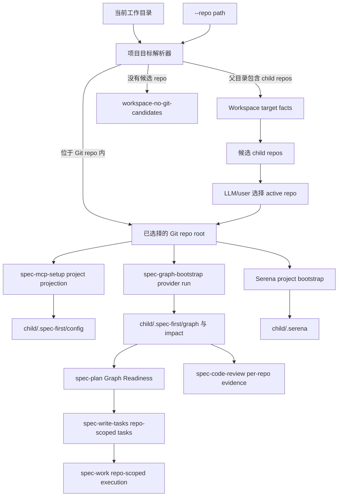

# feat: 支持 workspace repo target 解析用于 MCP setup 和 graph bootstrap

## 概览

支持第三种开发拓扑：父目录下有多个独立 Git 工程，例如 `workspace/project-a`、`workspace/project-b`、`workspace/project-c` 各自拥有 `.git`。当前 `spec-mcp-setup` 在父目录运行时能完成 host runtime setup，但因为父目录不是 Git repo，会跳过 `.spec-first/config/*` 项目投影；后续 `$spec-graph-bootstrap` 又只能在 Git repo 内运行，导致用户看到 `baseline_ready=true` 但无法从父 workspace 顺畅进入某个 child repo 的 graph readiness 编译。

本计划引入一个轻量项目目标解析器（Project Target Resolver），统一所有 setup/bootstrap 脚本对“当前 project 是哪个 Git repo”的判断。父目录仍不是 project，不生成父级 repo-local graph/config 真相源；它只可以生成或输出 workspace-level advisory target facts。每个 child repo 继续拥有自己的 `.spec-first/config/*`、`.spec-first/graph/*`、`.spec-first/impact/*` 和 `.serena/*`。后续 `spec-plan`、`spec-work`、`spec-write-tasks`、`spec-code-review` 消费这些事实时必须显式携带 active repo / target repos，而不是把 workspace 当成单个 repo。

---

## 问题背景

当前实现已经正确避免在非 Git 目录盲写 `.spec-first/config/graph-providers.json`，但缺少 workspace target resolution：

- `skills/spec-mcp-setup/scripts/detect-tools.sh` 在非 Git 目录下把 `repo_root=pwd`、`repo_status=not-git-repo` 写入 facts。
- `skills/spec-mcp-setup/scripts/write-provider-config.sh` 遇到 `repo_status != git-repo` 时返回 `skipped-no-git-repo`，不写三份 project config。
- `skills/spec-graph-bootstrap/scripts/bootstrap-providers.sh` 遇到非 Git 目录直接 `reason_code=not_git_repo`。
- `skills/spec-mcp-setup/scripts/install-mcp.sh` 与 `activate-serena.sh` 目前在非 Git 目录 fallback 到 `pwd`，这会在第三种模式下产生职责不一致：Serena 可能把父 workspace 当 project 初始化，但 provider projection 又被跳过。

问题不只是“如何生成文件”，而是后续使用链路如何稳定知道自己正在操作哪个 repo。Graph readiness、impact radius、review context、plan implementation units、task pack、work run 和 changelog 都是 repo-local 事实；workspace 只能帮助发现候选、展示状态、汇总结果和提醒用户选择目标。

---

## 需求追踪

### 目标解析与写入许可

- R1. 在父目录不是 Git repo、但包含多个 child Git repo 时，setup/bootstrap 必须识别为 `workspace-multi-repo`，而不是只报普通 `not-git-repo`。
- R3. 所有会读写 repo-local 项目事实的脚本必须使用同一个 target resolver，避免 `detect-tools`、`activate-serena`、`write-provider-config`、`bootstrap-providers` 对 repo root 的判断漂移。
- R4. 支持显式 `--repo <path>`，让用户可以从父 workspace 对某个 child repo 运行 `$spec-mcp-setup` 和 `$spec-graph-bootstrap`。
- R5. 当未提供 `--repo` 且存在多个候选 child repos 时，所有 state-changing project actions 必须 fail closed，输出 candidate list 和 `reason_code=workspace-target-required`，不得自动选择。
- R6. 单 Git repo 多 module / monorepo 仍按一个 Git root 处理；module 是 repo-local topology，不拆成多个 project readiness snapshots。
- R13. State-changing commands 必须区分 selected repo 的来源：只有 `selection_source=cwd-git-root` 或 `selection_source=explicit-repo` 才允许 repo-local 写入；`workspace-single-candidate` 只能作为建议，不得静默写入。
- R15. Resolver 必须做路径归一化与安全边界检查，避免 `--repo` 通过不存在路径、非 Git 路径、相对路径逃逸、symlink 歧义或 nested candidate 重复导致错误写入。

### Artifact 边界与批处理

- R2. 父 workspace 不得生成 repo-local `.spec-first/config/*`、`.spec-first/graph/*` 或 `.spec-first/impact/*` 真相源；也不得创建或修改 `.spec-first/config.local.yaml`、`.spec-first/config.local.example.yaml`、`.spec-first/*.local.yaml` gitignore 覆盖或任何 project-local preflight config。这些文件只写入被显式选择的 child repo。
- R7. 可选 workspace advisory artifact 只能放在 `.spec-first/workspace/*`，用于候选、readiness、recommended next commands 和批处理摘要；它不能替代 child repo 的 canonical graph facts。
- R8. `--all-repos` 如支持，必须是显式维护动作，逐个 child repo 执行 repo-local setup/bootstrap，并输出 per-child summary；不得成为默认 workflow 路径。

### 下游消费契约

- R9. 下游 workflows 必须消费 active repo / target repos：`spec-plan` 先确认目标 repo，再读取对应 child repo graph readiness；`spec-work` 只在计划或任务中明确 repo scope 后执行；`spec-code-review` 按 repo 分组 diff 和 evidence。

### 跨平台与运行时交付

- R10. PowerShell 脚本需要 source-contract parity：target resolver、`--repo`、workspace target-required、PowerShell 文案和 JSON reason codes 与 shell 对齐。
- R14. Resolver 在生成后的 host runtime 中必须同时可供 `spec-mcp-setup` 和 `spec-graph-bootstrap` 调用，不能依赖源码仓库路径或当前会话缓存。

### 文档与测试

- R11. 用户文档必须解释三种开发模式的边界、命令入口、产物位置和后续 workflow 使用方式。
- R12. 测试必须覆盖 parent workspace、多 child repos、`--repo` 指向 child、monorepo 不被误判、多 child 不自动执行 provider、Serena 不在父 workspace 初始化、downstream active repo contract。

---

## 范围边界

- 不把父 workspace 伪装成 Git repo。
- 不在父 workspace 生成 repo-local `.spec-first/config/*`、`.spec-first/graph/*`、`.spec-first/impact/*`。
- 不合并多个 child repo 的 graph facts、impact facts 或 review evidence。
- 不让脚本替 LLM 做语义 repo selection；脚本只提供候选和 deterministic readiness facts。
- 不把单 Git repo 多 module 误拆成多个独立 project。
- 不恢复旧 internal CRG workspace runtime、旧 Stage-0 context routing、旧 graph.db 主路径。
- 不默认执行 `--all-repos`；批处理只作为显式维护路径。

### 延后到后续工作

- Cross-repo dependency facts：例如 project-a SDK 被 project-b backend 使用，这需要独立 contract，不属于 target resolution MVP。
- Multi-repo semantic planning：一个需求跨多个 child repos 时，先由 `spec-plan` 显式拆成 per-repo units；自动推断跨 repo change graph 延后。
- Workspace visualization：可在 target facts 稳定后补 `workspace explain/tree` 风格的人类视图。
- Config polish：例如 include/exclude/max_depth 的高级配置冲突解释，可在 MVP 后根据真实 workspace 反馈补强。

---

## Graph Readiness

- status: stale
- source_revision: `5d191758552cc10962e93131254a79391092982f`
- current_revision: `40fe1c0749e624cbe2e57146bd1e295a1ca05c44`
- stale: true
- primary_providers: stale artifacts 中记录了 `code-review-graph`、`gitnexus`
- degraded_providers: stale artifacts 中未记录 degraded providers
- fallback_capabilities: runtime capability envelope 中记录了 Serena 和 `ast-grep` 的 partial fallback
- confidence: stale artifact 的 confidence 是 high；由于记录的 source revision 与当前 revision 不一致，本计划的当前 planning confidence 取 medium
- limitations: graph facts 描述的是旧 repo snapshot；本计划依赖 bounded direct repo reads 和既有 workspace/topology 文档，不把 stale graph facts 当作当前 primary evidence

---

## 上下文与调研

### 相关代码与模式

- `skills/spec-mcp-setup/scripts/detect-tools.sh` 和 `skills/spec-mcp-setup/scripts/detect-tools.ps1` 当前负责判断 `repo_status` 和 `repo_root`；这部分应委托给 shared target resolver。
- `skills/spec-mcp-setup/scripts/verify-tools.sh` 和 `.ps1` 合并 host readiness facts、调用 `write-provider-config.*`，并打印 Required Harness Runtime table；`workspace-target-required` 应该在这里面向用户呈现。
- `skills/spec-mcp-setup/scripts/write-provider-config.sh` 和 `.ps1` 已经对非 Git 目录 fail closed，并负责 setup projection 写入；它们应继续拒绝 parent workspace 的 repo-local 写入。
- `skills/spec-mcp-setup/scripts/install-mcp.sh` / `.ps1` 和 `activate-serena.sh` / `.ps1` 当前会 fallback 到 `pwd`；除非 `--repo` 成功解析到 child repo，否则必须停止把 Serena bootstrap 到非 Git parent workspace。
- `skills/spec-graph-bootstrap/scripts/bootstrap-providers.sh` 和 `.ps1` 已经负责 provider command validation 和 canonical graph readiness 写入；它们需要在 provider execution 前支持 `--repo` 并输出 workspace target-required diagnostics。
- `skills/spec-plan/SKILL.md` 已要求 machine-testable Graph Readiness block；当 cwd 是 workspace parent 时，它还应要求 target repo resolution。
- `skills/spec-work/SKILL.md`、`skills/spec-work-beta/SKILL.md`、`skills/spec-write-tasks/SKILL.md` 和 `skills/spec-code-review/SKILL.md` 是 downstream consumers，不能从 unresolved workspace parent 执行 repo-local work。
- `tests/unit/mcp-setup.sh`、`tests/unit/spec-graph-bootstrap.sh` 和 `tests/unit/mcp-setup-powershell-contracts.test.js` 已提供 fake repo / fake PATH / PowerShell parity patterns。
- `tests/unit/workspace-nested-topology.test.js` 保护旧 Stage-0 workspace routers 的退休状态；新增测试必须保持这个 invariant。

### 项目内经验

- `docs/10-prompt/项目角色.md` 确立了治理规则：deterministic execution belongs to scripts，semantic analysis belongs to LLM。Target discovery 是确定性流程；ambiguous task 的最终 target selection 属于语义/用户决策。
- `docs/plans/2026-04-26-003-feat-crg-workspace-topology-plan.md` 已定义三种 repo 形态，并明确 parent workspace artifacts 是 lightweight control-plane facts，child repos 拥有自己的 graph artifacts。
- `docs/validation/2026-04-26-spec-first-engineering-deep-audit-report.md` 记录了同样的 workspace chain：scan/status/context 可以 rank candidates 并输出 recommended commands，但不自动选择 repo。
- `docs/02-架构设计/2026-04-26-crg-workspace-topology-followup-extensions.md` 明确把 `workspace build --all` 定位为后续 maintenance action，而不是默认 workflow behavior。
- `docs/02-架构设计/全局分析/2026-04-16-spec-first-团队协作规范.md` 说明 workspace aggregation 不能改变 single-repo asset boundaries。
- `docs/02-架构设计/graph改造/mcp-setup重构方案.md` 记录了当前 no-Git 行为：host setup 可以继续，但 provider config 跳过。这个方向仍然正确；本计划只升级 diagnostics 和 targeting。

### 外部参考

- 不需要外部调研。本工作延展的是既有 repo-local setup/bootstrap contracts 和已经记录过的 workspace topology decisions。

---

## 关键技术决策

- **引入单一项目目标解析器（Project Target Resolver），而不是让每个脚本各自做 ad hoc Git 检查。** 这样 setup、graph bootstrap、Serena 和下游 workflows 中的 repo root、workspace mode、candidate list、reason codes 保持一致。
- **使用 `--repo <path>` 作为显式 child selection primitive。** 它可以从 parent workspace、child repo 内部或任意目录运行；resolver 会归一化到 Git root，并拒绝非 Git target。
- **多个 child repos 存在时不自动选择。** Candidate ranking 可以帮助 LLM/user 决策，但 provider execution 和 project file writing 必须有 selected repo。
- **除非当前目录已经在 Git repo 内，或显式传入 `--repo`，state-changing commands 不自动选择。** 单个 child repo 可以作为 high-confidence suggestion 输出，但 setup/bootstrap 在写 repo-local state 前仍必须让 selected target 对用户可见。
- **让 resolver 输出写入许可事实，而不是让调用方猜测。** `selection_source`、`selected_repo_root`、`state_write_allowed` 和 `reason_code` 是确定性事实；LLM/user 仍负责在候选之间做语义选择。
- **区分 workspace advisory facts 和 project readiness facts。** Parent workflow 需要持久化时，workspace facts 可以放在 `.spec-first/workspace/*`；canonical graph facts 仍然是 child repo-local。
- **resolver runtime delivery 也必须是单一契约。** 源码可以集中在 setup workflow 下，但 graph-bootstrap 在生成后的 `.agents/skills/*` 或 `.claude/spec-first/workflows/*` runtime 中必须能用稳定 sibling path 调用它，并用 contract tests 防止路径漂移。
- **让 `active_repo` 在 downstream artifacts 中可见。** Plans、task packs、work-run summaries 和 review reports 应暴露 repo scope，避免后续 agent 从 cwd 推断。
- **把 `--all-repos` 当作显式 maintenance。** 它对大型 workspace 有价值，但必须输出 per-child summaries 和 partial success semantics；不能成为 planning 或 work 的推荐常规路径。
- **保持 monorepo 语义不变。** 如果 `git rev-parse --show-toplevel` 成功，setup/bootstrap 就 targeting 这个 Git root。Packages/modules 后续由 repo-local topology 处理，不由 workspace target resolution 拆分。
- **优先使用结构化 reason codes，而不是散文。** `workspace-target-required`、`workspace-no-git-candidates`、`repo-target-not-git` 和 `repo-target-outside-workspace` 应稳定且 machine-readable。

---

## 开放问题

### 规划中已解决

- 父 workspace 是否应该得到 `.spec-first/config/*`？不应该。它不是 project readiness source；只有 selected child repos 得到 repo-local config。
- `--all-repos` 是否属于 MVP？Resolver 和 per-child result shape 应现在设计，但默认 workflow 应先交付 selected-repo flow。只要保持显式且 maintenance-only，`--all-repos` 可以在后续 unit 落地。
- `spec-plan` 是否可以从 parent workspace 继续？可以，但必须先有 target facts。Single-repo plan 必须选择一个 active repo；cross-repo plan 必须命名所有 target repos，并按 repo 拆分 implementation units。
- setup 是否可以从 parent workspace 安装 host MCP config？可以。Host runtime setup 是 host-level，可以在 parent cwd 完成。Project-local setup facts 仍然要求显式 child repo。

### 延后到实现中确认

- 精确的 child discovery depth 和 default excludes：实现应从 bounded scan 开始，并覆盖 `node_modules`、`.git`、`vendor`、hidden caches、symlink 目录和 nested child repos 的测试。
- Workspace advisory facts 默认是否总是写入，还是只输出 stdout：MVP 推荐只输出 stdout；如果实现选择写入 `.spec-first/workspace/*`，必须显式标记 `advisory: true` 和 `canonical_project_readiness: false`，且测试 parent 下没有 repo-local artifacts。
- `workspace-target-required` 的精确表格文案：测试应锁定 reason codes 和高信号 table cells，不锁死每一句话。
- `--repo` 用 CLI args、env vars，还是两者都用于内部脚本串联：用户可见表面应是 `--repo`；env var 只允许作为私有 plumbing detail。

---

## 输出结构

```text
skills/spec-mcp-setup/scripts/
  resolve-project-target.sh
  resolve-project-target.ps1

.spec-first/workspace/
  project-targets.json        # 父 workspace 的可选 advisory artifact，不是 repo-local readiness 真相源
  setup-summary.json          # 可选聚合 setup 结果，只用于显式 workspace flows
  graph-bootstrap-summary.json # 可选聚合 bootstrap 结果，只用于显式 all-repos maintenance
```

以上 `.spec-first/workspace/*` 文件是 advisory/generated artifacts。除非未来有明确的 workspace 文档策略要求，否则不得把它们当作 repo-local project truth 提交。

---

## 高层技术设计

> *这只是说明预期方案形态，作为 review 的方向性上下文，不是实现规范。执行实现的 agent 应把它当作设计语境，而不是需要照抄的代码。*



解析器只输出事实，不为任务做语义 repo 决策。下游 workflows 使用这些 facts 来询问/选择 active repo，然后消费 child repo-local readiness artifacts。

---

## 下游使用契约

### `spec-mcp-setup`

- 父 workspace 运行可以完成 host runtime setup。
- 如果未提供 `--repo` 且检测到多个 child Git repos，project rows 显示 `workspace-target-required`。
- 最后的 next step 列出 candidate repos，并要求用户用 `--repo <child>` 重新运行。
- 使用 `--repo <child>` 时，setup 只写入 `<child>/.spec-first/config/*` 和 `<child>/.serena/*`。

### `spec-graph-bootstrap`

- 父 workspace 未带 `--repo` 时，在 provider command execution 前 fail closed，并返回 `workflow_mode=blocked`、`reason_code=workspace-target-required`。
- 使用 `--repo <child>` 时，bootstrap 切到 child repo root，只写 child repo 的 provider/canonical artifacts。
- 可选 `--all-repos` 只有在显式请求后才顺序或 bounded concurrency 运行 child bootstrap，然后写 aggregate summary，但不合并 child graphs。

### `spec-plan`

- 如果从 workspace parent 调用，必须先解析 target facts。
- 对 single-repo plan，plan frontmatter 或正文开头应写出 `target_repo: <workspace-relative child path>`，或用等价自然语言明确 active repo。
- Graph Readiness block 必须读取 selected child repo artifacts，而不是 parent workspace artifacts。
- 对 cross-repo plan，每个 implementation unit 必须命名自己的 target repo；任何 unit 都不能拥有隐式 workspace-wide write scope。

### `spec-write-tasks`

- 从 single-repo plan 派生的 task packs 继承 `target_repo`。
- 从 cross-repo plans 派生的 task packs 包含 per-task repo scope 和跨 repo dependency ordering。
- 如果 source plan 在 workspace context 中没有识别 repo scope，task compilation 应返回 `spec-plan`，不能自行发明 targets。

### `spec-work` / `spec-work-beta`

- 从 parent workspace 执行时，必须有带 explicit repo scope 的 plan/task pack。
- Work 应对每个 child repo 独立 `cd` / target，用于 git status、tests、changelog 和 commits。
- 只有 write sets 和 repo scopes 都明确时，parallel workers 才能跨 repos 拆分；否则串行执行。

### `spec-code-review`

- 从 parent workspace review 时，按 Git repo 对 changed files 分组。
- 每个 repo 独立获得 graph readiness check、diff context、impact evidence 和 test suggestions。
- 最终 review 可以聚合 findings，但 file references 和 risk assessment 保持 per repo。

---

## 实施单元

- U1. **共享项目目标解析器（Project Target Resolver）**

**目标：** 新增确定性的 shell/PowerShell resolver，把当前位置或显式 `--repo` 分类为：已选择 Git repo、带 child candidates 的 workspace、没有 Git candidates、或 invalid target。

**需求：** R1, R3, R4, R5, R6, R10, R12, R13, R14, R15

**依赖：** 无

**文件：**
- 新增: `skills/spec-mcp-setup/scripts/resolve-project-target.sh`
- 新增: `skills/spec-mcp-setup/scripts/resolve-project-target.ps1`
- 测试: `tests/unit/mcp-setup.sh`
- 测试: `tests/unit/mcp-setup-powershell-contracts.test.js`
- 测试: `tests/unit/init-dry-run.test.js`

**方案：**
- 接受 `--repo <path>`，并为后续需要预留可选 workspace scan 参数。
- 当存在 `--repo` 时，归一化路径，并要求 `git -C <path> rev-parse --show-toplevel` 成功。
- 当没有 `--repo` 且 cwd 位于 Git repo 内时，返回 `mode=git-repo`、`selection_source=cwd-git-root`、`selected_repo_root` 和 `state_write_allowed=true`。
- 当 cwd 不在 Git repo 内时，执行 bounded child discovery，并返回 `mode=workspace-multi-repo`、`workspace-single-candidate` 或 `workspace-no-git-candidates`；这些模式默认 `state_write_allowed=false`。
- `workspace-single-candidate` 只作为建议输出，不自动提升为 selected repo；state-changing callers 必须要求用户用 `--repo <child>` 重跑，或由 workflow 明确确认后再带 `--repo` 调用脚本。
- `--repo` 解析成功时返回 `selection_source=explicit-repo`、`state_write_allowed=true` 和 workspace-relative `repo_label`；解析失败时不得创建任何 project-local 目录。
- 按已验证的 Git root 对 nested paths 去重，MVP 中最小化分类为 `child_git_repo`；如果实现能清晰验证，再为后续保留更丰富的 `submodule/worktree` relationship fields。
- 输出包含稳定 `schema_version`、`mode`、`repo_status`、`selection_source`、`state_write_allowed`、`invocation_cwd`、`workspace_root`、`selected_repo_root`、`repo_label`、`candidates`、`reason_code` 和 `next_action` 的 JSON。
- `candidates[]` 至少包含 `repo_label`、`git_root`、`workspace_relative_path` 和 `relationship=child_git_repo`；人类输出优先展示 workspace-relative path，machine JSON 可以包含 canonical absolute root。

**遵循模式：**
- 参考 `skills/spec-mcp-setup/scripts/check-health` 的 JSON output 和 reason-code 风格。
- 参考 `skills/spec-mcp-setup/scripts/detect-tools.sh` 的 shell portability patterns。
- 参考 `tests/unit/mcp-setup-powershell-contracts.test.js` 的 PowerShell contract test 风格。

**测试场景：**
- 正常路径：cwd 位于普通 Git repo 内 -> 返回 `mode=git-repo`、`selected_repo_root`，且没有 candidates。
- 正常路径：parent workspace 包含 `project-a/.git` 和 `project-b/.git` -> 返回 `mode=workspace-multi-repo`、`reason_code=workspace-target-required`、两个 candidates，且没有 selected repo。
- 正常路径：parent workspace 使用 `--repo project-a` -> 为 `project-a` 返回 `mode=git-repo`。
- 边界情况：parent workspace 只有一个 child repo 且没有 `--repo` -> 返回 `workspace-single-candidate`、`state_write_allowed=false`，并给出带 `--repo` 的 next action。
- 边界情况：单个 Git repo 内有 nested modules 但只有一个 `.git` root -> 返回 root repo，不返回 workspace。
- 错误路径：`--repo missing-dir` -> 以非零退出并返回 `reason_code=repo-target-not-found`。
- 错误路径：`--repo non-git-dir` -> 以非零退出并返回 `reason_code=repo-target-not-git`。
- 错误路径：`--repo ../outside` 在 workspace invocation 下逃逸当前 workspace -> 以非零退出并返回 `reason_code=repo-target-outside-workspace`，除非实现明确选择支持 absolute external targets 并在 JSON 中标记 `external_target=true`。

**验证：**
- 所有需要 repo targeting 的脚本都能调用 resolver，并获得相同的 machine-readable mode 和 selected repo facts。
- `spec-first init --claude|--codex --dry-run` 产物中，`spec-mcp-setup` 与 `spec-graph-bootstrap` runtime 都能通过稳定 sibling path 访问 resolver。

---

- U2. **把 target resolution 接入 MCP setup**

**目标：** 确保 setup 可以从 parent workspace 运行且不误初始化 repo-local project state，同时允许通过 `--repo` 显式 setup child repo。

**需求：** R1, R2, R3, R4, R5, R7, R10, R11, R12, R13, R15

**依赖：** U1

**文件：**
- 修改: `skills/spec-mcp-setup/scripts/check-health`
- 修改: `skills/spec-mcp-setup/scripts/bootstrap-project-config.sh`
- 修改: `skills/spec-mcp-setup/scripts/bootstrap-project-config.ps1`
- 修改: `skills/spec-mcp-setup/scripts/detect-tools.sh`
- 修改: `skills/spec-mcp-setup/scripts/detect-tools.ps1`
- 修改: `skills/spec-mcp-setup/scripts/install-mcp.sh`
- 修改: `skills/spec-mcp-setup/scripts/install-mcp.ps1`
- 修改: `skills/spec-mcp-setup/scripts/activate-serena.sh`
- 修改: `skills/spec-mcp-setup/scripts/activate-serena.ps1`
- 修改: `skills/spec-mcp-setup/scripts/verify-tools.sh`
- 修改: `skills/spec-mcp-setup/scripts/verify-tools.ps1`
- 修改: `skills/spec-mcp-setup/scripts/write-provider-config.sh`
- 修改: `skills/spec-mcp-setup/scripts/write-provider-config.ps1`
- 修改: `skills/spec-mcp-setup/SKILL.md`
- 测试: `tests/unit/mcp-setup.sh`
- 测试: `tests/unit/mcp-setup-powershell-contracts.test.js`

**方案：**
- 将 `--repo <path>` 贯穿所有会操作 repo-local files 的 setup commands。
- `detect-tools.*` 应在 readiness ledger 中暴露 target facts：`repo_status`、`target_mode`、`workspace_root`、`selected_repo_root`，以及 candidate list 或 candidate count。
- `install-mcp.*` 仍可从 parent workspace 配置 host MCP servers，但除非 resolver 返回 `state_write_allowed=true`，否则必须跳过 Serena activation，并把 Serena project status 表达为 `workspace-target-required` 而不是 `failed`。
- `activate-serena.*` 必须要求 selected Git repo，且不能对非 Git parent workspace fallback 到 `pwd`。
- 当 project projection 因 unresolved workspace target 被跳过时，`verify-tools.*` 应把 project rows 显示为 `workspace-target-required`，并提供包含 `--repo` 的 next action。
- `write-provider-config.*` 继续只在 selected repo roots 内写入。当 target 是 unresolved workspace 时，返回结构化 skipped/target-required facts，而不是只静默报告 `skipped-no-git-repo`。
- 所有 repo-local writer 在写入前都检查同一份 resolver JSON 的 `state_write_allowed=true`，而不是重新用 `git rev-parse` 推断。
- `bootstrap-project-config.*` 同样属于 repo-local writer；在 unresolved parent workspace 下不得创建或修改 `.spec-first/config.local.yaml`、`.spec-first/config.local.example.yaml`、`.spec-first/*.local.yaml` gitignore 覆盖或任何 project-local preflight config。

**遵循模式：**
- 复用现有 `repo_config_status`、`runtime_capabilities_status` 和 `provider_artifacts_status` ledger fields。
- 复用 `write-provider-config.*` 中已有的 non-destructive setup behavior 和 semantic idempotence。

**测试场景：**
- 正常路径：在 child repo 内 setup 会写 child `.spec-first/config/*`。
- 正常路径：从 parent 使用 `--repo project-a` setup，只写 `project-a/.spec-first/config/*` 和 `project-a/.serena/*`。
- 边界情况：从 parent setup，存在多个 candidates 且没有 `--repo`，不创建 parent `.spec-first/config/*` 或 parent `.serena/*`。
- 边界情况：从 parent setup，存在多个 candidates 且没有 `--repo`，不创建 parent `.spec-first/config.local.yaml`、`.spec-first/config.local.example.yaml` 或 `.spec-first/*.local.yaml` gitignore 覆盖。
- 边界情况：从 parent setup，只有一个 candidate 且没有 `--repo`，也不创建 child 或 parent project artifacts，只输出建议命令。
- 边界情况：即使 project projection 是 target-required，host MCP config 仍可从 parent workspace 验证。
- 错误路径：invalid `--repo` 阻止 project bootstrap，并报告稳定 reason code。
- 集成场景：Required Harness Runtime table 的 project rows 包含 `workspace-target-required` 和 candidate next actions。

**验证：**
- Host-level readiness 可以 ready，同时 project-local projection 清晰报告 target-required。
- 非 Git parent workspace 下不写 repo-local project files，除非是 `.spec-first/workspace/*` 下的 workspace advisory files。

---

- U3. **把 target resolution 接入 graph bootstrap**

**目标：** 允许 `$spec-graph-bootstrap` 从 parent workspace 对显式选择的 child repo 运行；没有 target 时带 candidate facts fail closed。

**需求：** R1, R2, R3, R4, R5, R6, R10, R12, R13, R15

**依赖：** U1, U2

**文件：**
- 修改: `skills/spec-graph-bootstrap/scripts/bootstrap-providers.sh`
- 修改: `skills/spec-graph-bootstrap/scripts/bootstrap-providers.ps1`
- 修改: `skills/spec-graph-bootstrap/SKILL.md`
- 测试: `tests/unit/spec-graph-bootstrap.sh`
- 测试: `tests/unit/mcp-setup-powershell-contracts.test.js`

**方案：**
- 增加 `--repo <path>` 支持，并在读取 `.spec-first/config/*` 前完成解析。
- 当 target resolution 返回 workspace candidates 但没有 selected repo 时，输出 `schema_version=graph-bootstrap-result.v1`、`workflow_mode=blocked`、`reason_code=workspace-target-required`、`workspace_root`、`candidates` 和 `next_action`。
- 在 `state_write_allowed=true` 前，不创建 child/parent graph directories，也不运行 provider commands。
- 有 selected repo 时，保持现有 provider command validation 和 artifact layout 不变，但确保所有路径都相对 child repo root 解析。
- Bootstrap report 应包含 `repo_root`；如果从 parent 带 `--repo` 调用，可附带 `invocation_workspace_root` 用于 diagnostics。

**遵循模式：**
- 复用 `bootstrap-providers.sh` 中已有的 fail-closed `emit_blocked` 行为。
- 复用现有 provider command safety allowlist。
- 复用 unsupported provider commands 和 query-unverified paths 的既有 unit tests。

**测试场景：**
- 正常路径：parent workspace 使用 `--repo project-a` 时，从 project-a root 运行 fake providers，并只写 project-a artifacts。
- 错误路径：parent workspace 不带 `--repo` 时返回 `workspace-target-required`，且不执行 fake `npx` / `uvx`。
- 错误路径：parent workspace 只有一个 child repo 但不带 `--repo` 时也返回 target-required，不执行 providers。
- 错误路径：invalid child repo 返回 `repo-target-not-git`。
- 边界情况：带 package directories 的 monorepo root 按 single repo 运行，并保持当前行为。
- 回归：已有 unsafe command array tests 仍在执行前失败。

**验证：**
- Graph bootstrap 仍然是 repo-local；在 selected repo facts 已知前，provider execution 无法开始。

---

- U4. **Workspace advisory artifacts 与用户摘要**

**目标：** 提供足够持久的 parent workspace diagnostics，方便后续使用，同时不创建第二套 project readiness 真相源。

**需求：** R1, R2, R5, R7, R8, R9, R11

**依赖：** U1, U2, U3

**文件：**
- 修改: `skills/spec-mcp-setup/scripts/verify-tools.sh`
- 修改: `skills/spec-mcp-setup/scripts/verify-tools.ps1`
- 修改: `skills/spec-graph-bootstrap/scripts/bootstrap-providers.sh`
- 修改: `skills/spec-graph-bootstrap/scripts/bootstrap-providers.ps1`
- 修改: `skills/spec-mcp-setup/SKILL.md`
- 修改: `skills/spec-graph-bootstrap/SKILL.md`
- 测试: `tests/unit/mcp-setup.sh`
- 测试: `tests/unit/spec-graph-bootstrap.sh`

**方案：**
- MVP 默认让 workspace facts 只输出 stdout；如果后续选择写入 parent `.spec-first/workspace/project-targets.json`，必须显式使用 `advisory: true`、`canonical_project_readiness: false`，并保持 JSON shape 与 stdout 一致。
- 包含 workspace-relative repo labels；absolute repo roots 只在 machine JSON 需要时出现；如果 child `.spec-first/graph/graph-facts.json` 存在，则附带 readiness hints 和 recommended next commands。
- 永远不把 child graph facts 复制进 parent workspace artifacts。
- 如果写 aggregate summaries，标记 `advisory: true`、`canonical_project_readiness: false`，并包含指向 child repo canonical artifact paths 的 pointers。
- 人类可读输出必须表达：Required Harness Runtime 已 ready，但 project target 未解析；graph bootstrap 前需要选择 child repo。

**遵循模式：**
- 复用既有 workspace topology docs 中的 `.spec-first/workspace/*` advisory boundary。
- 可以引用 `.spec-first/graph/provider-status.json` 的 graph readiness summary fields，但用 pointer 引用，不复制内容。

**测试场景：**
- 正常路径：parent workspace summary 列出 child repos 和 recommended `--repo` next actions。
- 边界情况：一个 child 的 graph facts stale/missing，另一个 ready -> summary 保留 per-child status，不阻塞健康 child。
- 错误路径：parent workspace 不可写 -> stdout JSON 仍是权威输出。
- 回归：parent 下不创建 `.spec-first/config/*`、`.spec-first/graph/*` 或 `.spec-first/impact/*`。

**验证：**
- 用户和 downstream workflows 可以查看可用 child repos 与 readiness，同时不会把 parent 当作 project。

---

- U5. **可选的显式 All-Repos Maintenance Path**

**目标：** 定义并在实现范围允许时加入显式 `--all-repos` 行为，用于跨 child repos 的 maintenance setup/bootstrap，同时不改变默认 workflow。

**需求：** R7, R8, R9, R12

**依赖：** U1, U2, U3, U4

**文件：**
- 修改: `skills/spec-mcp-setup/scripts/verify-tools.sh`
- 修改: `skills/spec-mcp-setup/scripts/verify-tools.ps1`
- 修改: `skills/spec-graph-bootstrap/scripts/bootstrap-providers.sh`
- 修改: `skills/spec-graph-bootstrap/scripts/bootstrap-providers.ps1`
- 修改: `skills/spec-mcp-setup/SKILL.md`
- 修改: `skills/spec-graph-bootstrap/SKILL.md`
- 测试: `tests/unit/mcp-setup.sh`
- 测试: `tests/unit/spec-graph-bootstrap.sh`

**方案：**
- 如果 selected-repo flow 已经完成，可把本 unit 作为 MVP 的可选项处理。
- 要求显式 `--all-repos`；除非用户明确要求所有 child repos，否则不要因为自然语言“继续完成”触发。
- 对每个 child repo 执行隔离的 repo-local runs。某个 child 失败不能抹掉其他 child 的成功结果。
- 当部分 children 失败时，输出带 `overall_status=partial` 的 aggregate status。
- `results[]` 中包含 `repo_root`、`repo_label`、`exit_code`、`workflow_mode`、`reason_code` 和 artifact pointers。
- Aggregate files 只保留在 `.spec-first/workspace/*` 下。

**遵循模式：**
- 复用现有 graph bootstrap result envelope。
- 复用先前 workspace follow-up decision：`--all` 是 maintenance-only，不是 workflow default。

**测试场景：**
- 正常路径：`--all-repos` 运行两个 fake child repos，并为两者写 child-local artifacts。
- 错误路径：一个 child provider bootstrap 失败 -> aggregate result 是 partial，成功 child 的 artifacts 保留。
- 回归：不生成 merged parent graph facts。
- 回归：没有 `--all-repos` 时，多个 child candidates 仍然 fail closed。

**验证：**
- Bulk setup/bootstrap 可用于显式 maintenance，但不会意外变成 semantic workspace orchestration。

---

- U6. **下游 workflow 消费规则**

**目标：** 让后续 plan/work/task/review workflows 在生成之后正确使用 target facts，使 workspace 支持真正改善使用链路，而不仅是改善 setup output。

**需求：** R7, R9, R11, R12

**依赖：** U1, U2, U3, U4

**文件：**
- 修改: `skills/spec-plan/SKILL.md`
- 修改: `skills/spec-write-tasks/SKILL.md`
- 修改: `skills/spec-work/SKILL.md`
- 修改: `skills/spec-work-beta/SKILL.md`
- 修改: `skills/spec-code-review/SKILL.md`
- 测试: `tests/unit/spec-write-tasks-contracts.test.js`
- 测试: `tests/unit/spec-work-contracts.test.js`
- 测试: `tests/unit/spec-work-beta-contracts.test.js`
- 测试: `tests/unit/workflow-invocation-boundary.test.js`

**方案：**
- `spec-plan`：当 cwd 是 workspace parent 时增加 target-resolution preflight。如果没有 active repo 且工作不是显式 cross-repo，在写 repo-specific plan 前先询问/选择。Plan 必须在 Graph Readiness 前包含 target repo 信息。
- `spec-plan`：single-repo plan 使用 `target_repo` 表达 workspace-relative child path；cross-repo plan 使用 per-unit `target_repo`，避免一个顶层 `target_repo` 被误读为全局写权限。
- `spec-write-tasks`：要求 workspace contexts 中的 source plans 携带 target repo 或 per-unit repo scope；否则返回 plan。
- `spec-work`：编辑文件前，验证 plan/task target repo 与实际会发生变更的 Git repo 匹配。
- `spec-work-beta`：delegating 时按 explicit repo scope 和 disjoint write sets 切分 workers；不能隐式写 sibling repo。
- `spec-code-review`：按 Git repo 分组 diffs，并独立读取每个 child repo 的 graph readiness。
- 这些先作为 workflow contract text 和 contract tests 落地，不构建 central state machine。

**遵循模式：**
- 复用 `skills/spec-plan/SKILL.md` 中现有 `Graph Readiness` block。
- 复用现有 task pack 的 `spec_id` / `source_plan_hash` traceability rules。
- 复用 work/work-beta 关于 forked workspaces 和 disjoint write sets 的 repo boundary 语言。

**测试场景：**
- 契约：`spec-plan` 提到 workspace target resolution 和 child repo graph readiness consumption。
- 契约：single-repo plan 有顶层 `target_repo`，cross-repo plan 只在 unit/task 级别携带 `target_repo`。
- 契约：`spec-write-tasks` 拒绝为 workspace-sourced plans 发明 repo scope。
- 契约：`spec-work` 要求从 workspace parent 编辑前必须有 explicit repo scope。
- 契约：`spec-code-review` 描述 per-repo grouping，且不合并 graph evidence。
- 回归：internal-only workspace helper surfaces 不暴露为 public workflow commands。

**验证：**
- 用户可以从 parent 运行 setup/bootstrap，选择 child repo，然后 plan/work/review；下一个 workflow 不会忘记 facts 属于哪个 repo。

---

- U7. **文档、运行时指引和用户手册**

**目标：** 让用户和 agents 理解三种开发模式，以及精确的 artifact/usage boundaries。

**需求：** R6, R7, R8, R9, R11

**依赖：** U2, U3, U4, U6

**文件：**
- 修改: `skills/spec-mcp-setup/SKILL.md`
- 修改: `skills/spec-graph-bootstrap/SKILL.md`
- 修改: `skills/spec-mcp-setup/references/supported-mcp-tools.md`
- 修改: `docs/05-用户手册/08-三种开发模式.md`
- 修改: `AGENTS.md`
- 修改: `CLAUDE.md`
- 修改: `README.md`
- 修改: `README.zh-CN.md`
- 修改: `CHANGELOG.md`
- 测试: `tests/unit/repository-guidance-contracts.test.js`
- 测试: `tests/unit/dual-host-governance-contracts.test.js`

**方案：**
- 文档化三种 topology modes：
  - 一个 Git repo，一个 project；
  - 一个 Git repo，多个 modules；
  - parent workspace 下多个 independent Git repos。
- 对每种模式说明 setup command、graph bootstrap command、artifact location、downstream workflow behavior，以及哪些行为被有意排除。
- 只更新 skill prose source-of-truth；不手改 generated `.claude/`、`.codex/` 或 `.agents/skills/` mirrors。
- 更新 `CHANGELOG.md`，因为这是 user-visible workflow behavior。
- 保持 managed instruction blocks 轻量：提及 target resolution 并指回 source skills，不复制完整 decision tree。

**遵循模式：**
- 复用 `AGENTS.md` 中既有 spec-first language policy 和 generated-runtime boundary。
- 复用 `skills/spec-mcp-setup/SKILL.md` 中已有 Required Harness Runtime status table wording。

**测试场景：**
- 契约：docs 提到 parent workspace 不拥有 repo-local graph/config artifacts。
- 契约：docs 提到 selected child repo 拥有 `.spec-first/config/*`、`.spec-first/graph/*` 和 `.spec-first/impact/*`。
- 契约：docs 提到 `--all-repos` 只作为显式 maintenance。
- 契约：generated runtime mirrors 不是 source-of-truth。

**验证：**
- 用户读文档后能理解为什么 parent setup 可能 host-ready 但 project-target-required，以及如何继续而不破坏 workspace boundaries。

---

- U8. **验证、回归覆盖和发布准备**

**目标：** 确保新的 target resolver 和 downstream consumption contracts 被窄而有效的测试覆盖。

**需求：** R10, R12, R13, R14, R15

**依赖：** U1, U2, U3, U4, U6, U7

**文件：**
- 修改: `tests/unit/mcp-setup.sh`
- 修改: `tests/unit/spec-graph-bootstrap.sh`
- 修改: `tests/unit/mcp-setup-powershell-contracts.test.js`
- 修改: `tests/unit/workspace-nested-topology.test.js`
- 修改: `tests/unit/workflow-invocation-boundary.test.js`
- 修改: `tests/unit/init-dry-run.test.js`
- 仅当新增测试文件没有被现有 scripts 覆盖时，修改: `package.json`

**方案：**
- 优先扩展现有 shell tests；只有 resolver tests 变得难以维护时，才创建大型并行 harness。
- 使用带 `workspace/project-a` 和 `workspace/project-b` 的 temp dirs、fake `npx`/`uvx` 和 fake host HOME。
- 像断言 child repos 内文件存在一样，强断言 parent workspace 下文件不存在。
- 除非加入 Windows runner，否则 PowerShell tests 保持 source-contract parity。
- 保持旧 Stage-0 retirement tests 通过。

**测试场景：**
- 从 parent 不带 `--repo` setup，报告 workspace candidates，且不写 parent project projection。
- 从 parent 不带 `--repo` setup，不创建 parent `.spec-first/config.local.yaml`、`.spec-first/config.local.example.yaml` 或 `.spec-first/*.local.yaml` gitignore 覆盖。
- 从 parent 使用 `--repo project-a` setup，只写 project-a projection 和 Serena marker。
- 从 parent 不带 `--repo` graph bootstrap，返回 `workspace-target-required`，且不执行 providers。
- 从 parent 使用 `--repo project-b` graph bootstrap，在 project-b 中运行 providers。
- 只有一个 `.git` root 和多个 packages 的 monorepo fixture 不被当作 multi-repo workspace。
- 下游 skill contract tests 要求 explicit active repo / per-repo scopes。

**验证：**
- 普通 `npm run test:unit` 通过现有 `test:mcp-setup`、`test:graph-bootstrap` 和 Jest unit scripts 覆盖新增场景。

---

## 系统级影响

- **交互链路：** `spec-mcp-setup` 和 `spec-graph-bootstrap` 变成 target-aware；downstream workflows 在 workspace contexts 中消费 graph readiness 前，必须读取 target facts。
- **错误传播：** unresolved workspace target 变成结构化 blocked/project-target-required condition，而不是泛化 failure。Provider errors 仍保持 child repo-local。
- **状态生命周期风险：** parent workspace 不能积累 repo-local state。可选 `.spec-first/workspace/*` summaries 是 advisory，可能 stale；child repo canonical artifacts 仍然 authoritative。
- **API 表面一致性：** shell 和 PowerShell scripts 需要匹配的 `--repo` 和 reason-code 行为。Skill prose 和 README 必须反映同一 command surface。
- **集成覆盖：** tests 需要同时证明 child repos 内文件存在，以及 parent workspace 下文件不存在。
- **不变约束：** 一个 Git repo 仍然是一个 project readiness boundary；monorepo modules 不是独立 graph-provider targets；graph-bootstrap 仍然校验 provider command arrays，且不安装 providers。

---

## 备选方案评估

- **在父目录 `.spec-first/config/*` 中列出所有 child repos。** 拒绝，因为它会创建第二套 project readiness truth source，并迫使 downstream consumers 判断 child config 和 parent config 谁更 authoritative。
- **自动选择第一个或唯一 child repo。** 对 state-changing commands 拒绝，因为这会隐藏 active repo boundary。Resolver 可以建议 candidates，但 setup/bootstrap 应让 selection 显式可见。
- **把 parent workspace 当作 monorepo。** 拒绝，因为 monorepo 意味着一个 Git root；多个 `.git` roots 拥有独立 diffs、commits、graph snapshots、changelogs 和 review contexts。
- **Host setup 后默认构建所有 child repos。** 拒绝，因为 provider bootstrap 可能昂贵且噪声大。Bulk mode 属于 explicit maintenance。

---

## 分阶段交付

### 阶段 1：选定 child repo 流程

- U1 target resolver。
- U2 setup integration。
- U3 graph-bootstrap selected repo 和 fail-closed diagnostics。
- 覆盖 parent no target、parent with `--repo`、child repo 和 monorepo 的核心测试。

### 阶段 2：下游消费

- U4 workspace advisory summaries。
- U6 downstream workflow contracts。
- U7 三种开发模式的用户文档。

### 阶段 3：维护与批处理支持

- 如果 selected-repo flow 后仍有需要，落地 U5 explicit `--all-repos`。
- U8 完整 regression 和 release readiness。

---

## 风险与依赖

| 风险 | 可能性 | 影响 | 缓解 |
|------|------------|--------|------------|
| 父 workspace 意外获得 repo-local artifacts | 中 | 高 | 在 tests 中断言 parent `.spec-first/config/*`、`.spec-first/graph/*`、`.spec-first/impact/*` 不存在。 |
| Serena 初始化父 workspace | 中 | 高 | 让 `activate-serena.*` 要求 selected Git repo；测试 parent workspace 没有 marker/project file。 |
| `--repo` 支持在 shell 和 PowerShell 间漂移 | 中 | 中 | 增加 resolver invocation、reason codes 和 `--repo` parsing 的 source-contract parity tests。 |
| `--all-repos` 变成默认 orchestration | 低 | 高 | 保持显式、文档化为 maintenance-only，并测试没有 explicit selection 时不执行 provider。 |
| 下游 workflows 仍从 cwd 推断 repo | 中 | 高 | 增加 skill contract tests，要求 workspace contexts 中有 active repo / per-unit repo scope。 |
| Workspace advisory artifacts 变成第二真相源 | 中 | 中 | 标记 advisory artifacts 为 non-canonical，并要求使用 child artifact pointers，而不是复制 graph facts。 |
| Resolver 在 generated runtime 中路径不可用 | 中 | 高 | 用 runtime sibling path 解析，并增加 init dry-run / copied asset contract tests，验证两个 hosts 下 `spec-graph-bootstrap` 能找到 resolver。 |
| 单 candidate 被误当成 selected repo | 中 | 高 | 将 `state_write_allowed=false` 写入 resolver contract，并测试 setup/bootstrap 在 single-candidate parent 下仍 fail closed。 |

---

## 文档与运维说明

- 更新用户文档，加入三种 topology modes 的对照表，覆盖 artifact ownership 和 downstream workflow behavior。
- 加入 troubleshooting section，覆盖这个精确日志场景：`baseline_ready=true` 但 project projection 是 `workspace-target-required`。
- 明确用户应先运行 selected child flows；batch all-repo setup/bootstrap 只用于 explicit maintenance。
- 提醒贡献者不要编辑 generated `.claude/`、`.codex/` 或 `.agents/skills/` mirrors；source skills 和 tests 才是真相源。
- 因为行为 user-visible，`CHANGELOG.md` 必须加入一条使用项目 developer profile author 的记录。

---

## Deferred / Open Questions

### From 2026-04-28 review

- **显式 repo 边界规则未决** — 关键技术决策 / U1. 共享项目目标解析器 (P1, adversarial, feasibility, confidence-first 100)

  实现者必须在两个互相冲突的安全模型之间临场选择：`--repo` 是任意目录可用的全局显式 target，还是只能选择当前 workspace 内的 child repo。选错会直接影响用户命令表面和安全边界：一种实现会破坏“任意目录运行”的承诺，另一种实现会让 workspace escape 测试与 reason code 设计失效。这个选择是 load-bearing，不能留给实现阶段隐式决定。

  <!-- dedup-key: section="关键技术决策 u1 共享项目目标解析器" title="显式 repo 边界规则未决" evidence="使用 `--repo <path>` 作为显式 child selection primitive。它可以从 parent workspace、child repo 内部或任意目录运行；resolver" -->

- **候选发现边界被推迟** — 开放问题 / U1. 共享项目目标解析器 (P2, adversarial, confidence-first 75)

  resolver 是所有 repo-local 写入的 gate，但候选发现的深度、排除规则和 symlink/nested repo 处理仍被留到实现中确认。实现者会在 shell、PowerShell、setup、bootstrap 测试间自行补规则，结果可能是同一个 workspace 在不同入口下出现不同 candidate list，进而错误阻塞或错误允许写入。至少需要在计划层定义最小 discovery contract，具体高级配置可以后续 polish。

  <!-- dedup-key: section="开放问题 u1 共享项目目标解析器" title="候选发现边界被推迟" evidence="精确的 child discovery depth 和 default excludes：实现应从 bounded scan 开始，并覆盖 `node_modules`、`.git`、`vendor`、hidden caches" -->

- **单候选确认路径未定义** — U1. 共享项目目标解析器 / U2. 把 target resolution 接入 MCP setup (P2, adversarial, confidence-first 75)

  单 child workspace 是最容易让用户期待自动继续的场景，但计划同时允许“workflow 明确确认后带 `--repo` 调用”和要求 setup/bootstrap 在单候选下不写入。实现者会遇到一个未定义的交互边界：脚本是否只打印 next action，workflow 是否可以追问并重入，还是一律要求用户手动重跑。这个空白会导致 host runtime ready 后的下一步体验在不同入口间漂移。

  <!-- dedup-key: section="u1 共享项目目标解析器 u2 把 target resolution 接入 mcp setup" title="单候选确认路径未定义" evidence="`workspace-single-candidate` 只作为建议输出，不自动提升为 selected repo；state-changing callers 必须要求用户用 `--repo <child>` 重跑" -->

---

## 来源与参考

- 用户请求：parent directory 下有多个 independent Git projects，且 `$spec-mcp-setup` 报告 `skipped-no-git-repo`。
- 相关 plan: `docs/plans/2026-04-26-003-feat-crg-workspace-topology-plan.md`
- 相关 plan: `docs/plans/2026-04-28-003-feat-graph-readiness-compiler-plan.md`
- 相关架构说明: `docs/02-架构设计/2026-04-26-crg-workspace-topology-followup-extensions.md`
- 相关治理文档: `docs/02-架构设计/全局分析/2026-04-16-spec-first-团队协作规范.md`
- 相关 setup 设计: `docs/02-架构设计/graph改造/mcp-setup重构方案.md`
- 角色基线: `docs/10-prompt/项目角色.md`
- 相关源码: `skills/spec-mcp-setup/scripts/detect-tools.sh`
- 相关源码: `skills/spec-mcp-setup/scripts/verify-tools.sh`
- 相关源码: `skills/spec-mcp-setup/scripts/write-provider-config.sh`
- 相关源码: `skills/spec-mcp-setup/scripts/install-mcp.sh`
- 相关源码: `skills/spec-mcp-setup/scripts/activate-serena.sh`
- 相关源码: `skills/spec-graph-bootstrap/scripts/bootstrap-providers.sh`
- 相关测试: `tests/unit/mcp-setup.sh`
- 相关测试: `tests/unit/spec-graph-bootstrap.sh`
- 相关测试: `tests/unit/mcp-setup-powershell-contracts.test.js`
