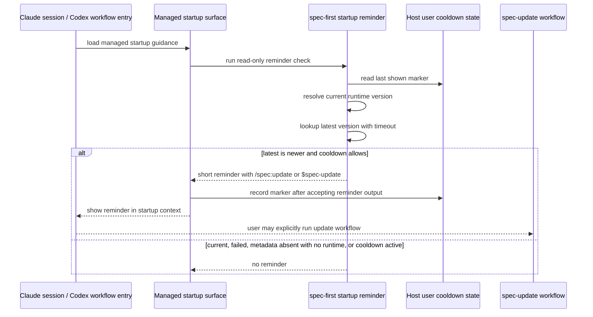

# feat: Add startup version update reminders

## Overview

Add a low-noise reminder path that checks whether the loaded spec-first runtime is behind the latest available version when a Claude Code session starts, and when a top-level Codex agent is about to enter a public spec-first workflow. The reminder must be read-only from an upgrade perspective: it may fetch version facts and update its own cooldown marker, but it must not install packages, update Claude plugins, regenerate runtime assets, or restart hosts.

The implementation should reuse the existing version comparison and update-entrypoint concepts instead of creating a second upgrade workflow. The reminder surfaces a short message and points users to the current host's update workflow; `/spec:update` and `$spec-update` remain the single upgrade decision surface.

---

## Problem Frame

The origin requirements document explains that CLI-level reminders already exist for `spec-first doctor/init/clean`, but users often open Claude Code or Codex and go directly to `/spec:*` or `$spec-*` workflows. In that path, stale runtime assets can continue to be used without the user seeing that a newer spec-first version exists (see origin: docs/brainstorms/2026-04-29-001-startup-version-update-reminder-requirements.md). Claude has a deterministic SessionStart hook surface; Codex currently does not, so the Codex side must be framed as best-effort top-level workflow-entry guidance until a real Codex startup hook exists.

This plan implements the automatic-detect/manual-upgrade decision from the origin document. It preserves spec-first's boundary: scripts gather deterministic version facts and format the reminder; users and the update workflow decide whether to mutate the environment.

---

## Requirements Trace

### Reminder Behavior

- R1. Run a deterministic startup version check when Claude Code loads the managed SessionStart hook, and a best-effort read-only version check when a top-level Codex agent is about to enter a public spec-first workflow. Do not claim deterministic Codex session-start execution until a verified Codex hook exists.
- R2. Keep the check non-blocking and failure-tolerant so startup or workflow routing is not disrupted.
- R3. Do not perform automatic upgrade, installation, runtime refresh, or restart during the reminder check.
- R4. Include current version, latest version, host-specific update workflow, and explicit user-decision wording when a reminder is shown. If local runtime metadata is missing or malformed but managed runtime files exist, state that the current runtime version is unknown rather than suppressing the reminder.
- R5. Hide network, permission, registry, or API failures from normal startup output.
- R6. Limit repeated prompts to at most once every 24 hours per host/current-version/latest-version context, with a shared host-level suppression so users do not see the same stale-version reminder in every repository. The update workflow should clear or refresh the cooldown marker when the user explicitly invokes it.
- R7. Use `/spec:update` for Claude and `$spec-update` for Codex.
- R8. Require explicit user action before upgrade.

### Update Workflow Boundary

- R9. Leave Claude plugin update, Codex npm CLI update, runtime asset refresh, and restart instructions in `spec-update`.
- R10. Do not duplicate the full upgrade workflow in startup reminder code or prose.

### Rendered Runtime Prerequisite

- R11. Before startup reminders route users to the update workflow, ensure rendered `spec-update` runtime content is semantically correct on both hosts: Claude-specific checks and commands must stay Claude-specific, Codex-specific checks and commands must stay Codex-specific, and generated runtime content must not contain double-prefixed paths such as `.agents/.agents` or `.agents/.claude`.

**Origin actors:** A1 使用者, A2 宿主启动面, A3 spec-first update workflow
**Origin flows:** F1 启动时发现新版本, F2 检查失败或网络不可用
**Origin acceptance examples:** AE1 covers the Codex best-effort workflow-entry update prompt, AE2 covers the Claude SessionStart update prompt, AE3 covers offline startup, AE4 covers no automatic upgrade
**Plan-added acceptance example:** AE5 covers generated `spec-update` runtime parity before the startup reminder points users to `/spec:update` or `$spec-update`.

---

## Scope Boundaries

- No automatic `claude plugin update`, `npm install -g`, `spec-first init`, or host restart from startup.
- No duplicate upgrade instructions beyond the host update workflow entrypoint.
- No project working-tree churn for reminder cooldown state.
- No requirement for Claude and Codex to use the same technical trigger surface.
- No claim that Codex has a deterministic session-start hook until a verified hook API exists. Codex support is best-effort top-level workflow-entry guidance in this plan.
- No change to `spec-first --help` or `spec-first --version` behavior.
- No hand edits to generated `.claude/`, `.codex/`, or `.agents/skills/` mirrors. Runtime drift must be fixed in source transforms, skill source, and contract tests, then verified through generated output.

---

## Graph Readiness

- target_repo: `.`
- status: stale
- source_revision: `7db16f134adb2bf6c0596e6598f954434ed257ee`
- current_revision: `bdcee41611f9aa86312b577fa946c7e403f6384d`
- stale: true
- primary_providers: `code-review-graph` facts exist but were compiled for an older revision
- degraded_providers: none used
- fallback_capabilities: bounded direct repo reads and local CLI inspection
- runtime_mcp_evidence: not used; planning questions were answerable from source files and local CLI help
- confidence: medium
- limitations: graph facts were not treated as primary evidence because the current branch and worktree differ from the recorded source revision

---

## Context & Research

### Relevant Code and Patterns

- `src/cli/version-reminder.js` owns semver parsing, latest-version lookup through npm registry, non-throwing reminder output, and formatting for CLI command reminders.
- `src/cli/index.js` wires the existing reminder only for real CLI commands: `doctor`, `init`, and `clean`.
- `templates/claude/hooks/session-start` is the managed Claude SessionStart script. It currently emits `hookSpecificOutput.additionalContext` containing the `CLAUDE.md` bootstrap block or a repair message.
- `src/cli/claude-settings.js` manages `.claude/settings.json` SessionStart matcher installation and drift inspection.
- `src/cli/adapters/claude.js` copies `templates/claude/hooks/session-start` into `.claude/hooks/session-start` with executable mode and validates drift against the bundled template.
- `src/cli/adapters/codex.js` has no hook equivalent. Codex runtime entrypoints are `.agents/skills/`, and the managed instruction surface is `AGENTS.md`.
- `src/cli/instruction-bootstrap.js` builds host-specific bootstrap blocks for both `CLAUDE.md` and `AGENTS.md`.
- `skills/spec-update/SKILL.md` already distinguishes Claude plugin state from Codex npm CLI/runtime asset state and should remain the upgrade truth source.
- `src/cli/contracts/dual-host-governance/skills-governance.json` exposes `spec-update` as `dual_host`, delivered as a Claude command and a Codex skill. README tables also list `/spec:update` and `$spec-update`, so the public entrypoint model is already dual-host.
- `src/cli/adapters/claude.js` renders `/spec:update` by merging `templates/claude/commands/spec/update.md` frontmatter with the body of `skills/spec-update/SKILL.md`. This proves the Claude command is source-backed, but the runtime render currently rewrites the Codex fallback path inside `.agents/skills/spec-update/SKILL.md` into `.agents/.claude/spec-first/workflows/spec-update/SKILL.md`.
- `src/cli/adapters/codex.js` renders `$spec-update` by copying the workflow skill into `.agents/skills/spec-update/SKILL.md`, but its blanket `rewriteSharedPaths()` transform rewrites `.claude/commands/spec/update.md` and every `--claude` token. For this host-comparative workflow, that produces incorrect runtime prose such as `.agents/.agents/skills/spec-update/SKILL.md` and changes the Claude branch's post-update command from `spec-first init --claude` to `spec-first init --codex`.
- Current `doctor --claude|--codex --json` can report runtime drift against the adapter's expected output, but it cannot catch semantic bugs that are already baked into the expected adapter transform. `spec-update` therefore needs rendered-runtime semantic contract tests, not only source-skill assertions.
- `tests/unit/version-reminder.sh`, `tests/unit/claude-settings.test.js`, `tests/unit/runtime-hook-permissions.test.js`, `tests/unit/instruction-bootstrap.test.js`, and `tests/unit/init-dry-run.test.js` are the narrowest tests for this change.

### Institutional Learnings

- `docs/solutions/workflow-issues/host-entrypoint-mapping-source-boundary-2026-04-29.md` says host-specific entrypoint mapping belongs in init/governance layers, not scattered through ordinary workflow prose. Startup reminders are an entry-governance concern, so explicit `/spec:update` vs `$spec-update` mapping is acceptable in the hook/bootstrap surfaces and corresponding contract tests.

### External References

- External research skipped. The repository has direct local patterns for version checking, Claude SessionStart installation, and Codex bootstrap delivery. Local `codex --help` for `codex-cli 0.125.0` did not expose a SessionStart-style hook surface, so this plan does not assume one exists.

---

## Key Technical Decisions

- Add a shared startup reminder command path instead of embedding network/version logic directly in each host surface: this keeps deterministic checks in CLI code and keeps host templates thin.
- Treat `spec-update` rendered-runtime parity as a prerequisite for startup reminders. The reminder can only point users to `/spec:update` or `$spec-update` after the existing update workflow is verified as semantically correct for both hosts.
- Use managed runtime state as the primary "current version" fact, with a local fallback when state is missing or malformed: if managed runtime files exist but `.claude/spec-first/state.json` or `.codex/spec-first/state.json` cannot provide a version, return a cooldown-limited "current runtime version unknown" reminder instead of silently suppressing the warning.
- Align reminder fact sources with the workflow they route to. Claude reminders may be driven by project runtime state only if `spec-update`'s Claude branch also checks project runtime health through `spec-first doctor --claude --json`; otherwise the reminder should compare the same loaded Claude plugin/cache version that `/spec:update` compares.
- Store reminder cooldown outside the project working tree, under host-scoped user state such as `$HOME/.claude/spec-first/startup-version-reminder.json` and `$HOME/.codex/spec-first/startup-version-reminder.json`. The primary cooldown key is host + current runtime version (or unknown-state sentinel) + latest version, not project root, so one stale install does not produce the same reminder in every repository.
- Keep the startup command hidden from public help unless the implementation team decides a documented diagnostic command is useful. The user-facing path remains `/spec:update` or `$spec-update`. Its output contract should be explicit: reminder text on stdout only, no output on no-op/failure, no ordinary CLI reminder stderr, and exit 0 for expected no-op/failure cases so hooks and bootstrap surfaces can consume it safely.
- Implement Codex as managed workflow-entry guidance rather than a shell hook: the current local Codex CLI surface does not show a hook mechanism, while `AGENTS.md` is already the managed session instruction surface. The instruction should apply only to top-level orchestrators before entering public `$spec-*` workflows, not to bounded subagents, leaf reviewers, or worker agents.
- Keep deterministic path/host rewriting narrow. Adapter transforms may rewrite source asset paths for the current host, but they must not rewrite prose that intentionally compares Claude and Codex branches, host-specific commands, or other-host runtime detection paths.

---

## Open Questions

### Resolved During Planning

- Codex trigger: use managed `AGENTS.md` bootstrap instructions as best-effort workflow-entry guidance for top-level `$spec-*` routing; do not plan against an unverified Codex hook API or claim deterministic Codex session-start execution.
- Cooldown storage: use user-level host-specific state, not project runtime directories, so startup reminders do not create Git working-tree noise. Use host/version-level suppression by default to avoid multi-repo over-prompting.
- Claude implementation shape: extend the existing SessionStart template and call shared CLI/helper logic rather than duplicating version lookup logic inside the shell template.
- Existing update workflow support: source-of-truth `skills/spec-update/SKILL.md`, governance metadata, and public README entry tables already support both Claude and Codex. The gap is not conceptual support; it is rendered-runtime correctness caused by overly broad adapter rewrites.

### Deferred to Implementation

- Exact adapter repair shape: prefer a small context-aware transform that exempts host-comparative `spec-update` prose from blanket host/path rewriting. If a broader transform cleanup is chosen instead, it must still preserve the semantic contracts listed in U0.
- Hidden command name: `startup-reminder --claude|--codex` is the intended shape, but the implementer may choose an equivalent internal name if it better fits existing CLI parsing.
- Runtime-state fallback details: the implementer should choose the exact fallback probes, but the fallback must distinguish "no spec-first runtime exists" from "managed runtime files exist but version metadata is missing or malformed."
- Timeout values: reuse the existing 350ms lookup default unless implementation evidence shows startup needs a tighter bound.

---

## High-Level Technical Design

> *This illustrates the intended approach and is directional guidance for review, not implementation specification. The implementing agent should treat it as context, not code to reproduce.*

---

## Implementation Units

- U0. **`spec-update` rendered runtime parity repair**

**Goal:** Fix the existing `/spec:update` and `$spec-update` generated-runtime defects before adding startup reminders that route users to those entries.

**Requirements:** R7, R9, R10, R11; supports AE1, AE2, AE5

**Dependencies:** None

**Files:**
- Modify: `src/cli/adapters/codex.js`
- Modify: `src/cli/adapters/claude.js` if source skill runtime path rewriting is repaired generically rather than only in Codex rendering
- Possibly modify: `skills/spec-update/SKILL.md` only if a small prose adjustment is needed to avoid ambiguous source/runtime path wording; do not change its frontmatter `description`
- Test: `tests/unit/spec-update-contracts.test.js`
- Test: `tests/unit/dual-host-governance-contracts.test.js`
- Test: `tests/unit/init-dry-run.test.js` if generated project output is asserted through `init`

**Approach:**
- Keep `skills/spec-update/SKILL.md` as the semantic source of truth: it must continue to contain both Claude and Codex branches, and it must keep Claude commands such as `spec-first init --claude` in the Claude branch.
- Narrow adapter rewrites so they only rewrite current-host source asset paths where that is actually intended. They must not rewrite host-comparative diagnostic prose, explicit other-host runtime fallback paths, or branch-specific commands inside `spec-update`.
- Prevent double-prefix path corruption. Rendered Claude and Codex runtime content must not contain `.agents/.agents`, `.agents/.claude`, `.claude/.claude`, or equivalent path artifacts.
- Do not repair by editing `.claude/commands/spec/update.md` or `.agents/skills/spec-update/SKILL.md` directly. Those are generated mirrors.
- Add rendered-runtime contract tests that invoke the actual adapters or `planBundledAssetSync` into a temporary project, rather than only checking the source skill file.

**Patterns to follow:**
- `src/cli/adapters/claude.js` command render path for merged frontmatter + skill body.
- `src/cli/adapters/codex.js` workflow skill render path and existing `rewriteSharedPaths()` transform.
- `tests/unit/spec-update-contracts.test.js` for update-workflow-specific semantic assertions.
- `tests/unit/dual-host-governance-contracts.test.js` for public dual-host delivery expectations.

**Test scenarios:**
- Happy path: source `skills/spec-update/SKILL.md` still declares Claude Code and Codex branches and contains both `spec-first init --claude` and `spec-first init --codex` in the correct branch contexts.
- Happy path: rendered Claude `/spec:update` contains `.agents/skills/spec-update/SKILL.md` for Codex runtime fallback and `.claude/commands/spec/update.md` for Claude runtime fallback.
- Happy path: rendered Codex `$spec-update` contains `.agents/skills/spec-update/SKILL.md` for Codex runtime fallback and `.claude/commands/spec/update.md` for Claude runtime fallback.
- Happy path: rendered Codex `$spec-update` keeps the Claude plugin-update follow-up as `spec-first init --claude`, while the Codex branch keeps `spec-first init --codex`.
- Edge case: rendered runtime content for both hosts does not contain `.agents/.agents`, `.agents/.claude`, `.claude/.claude`, or a rewritten Claude command path that points to Codex skill output.
- Integration: `spec-first init --claude` and `spec-first init --codex` generated output satisfies the same semantic assertions without hand-editing generated mirrors.

**Verification:**
- Startup reminders point to update entries whose rendered runtime instructions are host-correct.
- Contract tests fail if future adapter rewrites accidentally corrupt host-comparative workflow prose.

---

- U1. **Shared startup reminder core**

**Goal:** Extend the version reminder layer so reminder checks can resolve current runtime version, latest version, cooldown status, and host-specific reminder text without performing upgrades.

**Requirements:** R1, R2, R3, R4, R5, R6, R7, R8, R10; supports F1, F2 and AE1, AE2, AE3, AE4

**Dependencies:** U0

**Files:**
- Modify: `src/cli/version-reminder.js`
- Modify: `src/cli/index.js`
- Test: `tests/unit/version-reminder.sh`

**Approach:**
- Keep existing CLI reminder behavior for `doctor/init/clean` stable.
- Add startup-specific options or a small adjacent helper that can:
  - read `.claude/spec-first/state.json` or `.codex/spec-first/state.json` as the primary runtime version fact
  - fall back to local managed-runtime probes when state is missing or malformed; if managed runtime files exist but version metadata is unavailable, return an "unknown current runtime version" reminder instead of suppressing the check
  - compare the recorded runtime version to the host-appropriate latest source, matching `spec-update`'s split: Claude checks upstream project version and project runtime health, Codex checks npm package version
  - apply 24-hour cooldown using user-level host state keyed by host + current/unknown runtime version + latest version, with optional project information stored only as diagnostic metadata
  - expose a reset/clear mode that `spec-update` can call when the user explicitly runs the update workflow
  - format a short host-specific reminder that names `/spec:update` or `$spec-update`
- Define a strict output contract for startup surfaces: reminder text on stdout only when a reminder should be shown; no output on no-op/failure; no stderr for expected lookup/state failures; exit 0 for no-op/failure cases. Failure paths should return "no reminder" rather than throwing through startup surfaces.

**Patterns to follow:**
- `src/cli/version-reminder.js` for non-throwing lookup and semver comparison.
- `src/cli/state.js` for managed state shape and runtime `manifestVersion`.
- `tests/unit/version-reminder.sh` for shell-driven unit coverage with environment overrides.

**Test scenarios:**
- Happy path: given current runtime `1.6.1`, latest `1.6.2`, host `codex`, and no cooldown marker, the helper returns a reminder containing `1.6.1`, `1.6.2`, `$spec-update`, and no install command.
- Happy path: given current runtime `1.6.1`, latest `1.6.2`, host `claude`, the helper returns `/spec:update`.
- Happy path: given managed runtime files exist but state metadata is missing or malformed, the helper returns a cooldown-limited reminder that names the current runtime version as unknown and routes to the host update workflow.
- Edge case: given equal versions, the helper returns no reminder.
- Edge case: given a cooldown marker inside 24 hours for the same host/current/latest tuple, the helper returns no reminder even in a different project.
- Edge case: given a cooldown marker for an older latest version and a newer latest version is found, the helper can show a new reminder.
- Edge case: invoking the update-workflow reset mode clears or refreshes the matching cooldown marker so an explicit update check is not hidden by the previous reminder.
- Error path: missing state file, malformed version, lookup timeout, or failed cache write does not throw and does not print a stack trace.
- Integration: existing `doctor/init/clean` reminder tests still pass and still print the npm install hint for CLI command reminders.

**Verification:**
- Startup reminder behavior is independently testable without invoking Claude or Codex.
- Existing CLI reminder behavior remains unchanged except for shared internal implementation.

---

- U2. **Claude SessionStart integration**

**Goal:** Extend the managed Claude SessionStart hook so it includes a startup version reminder in `additionalContext` when the shared startup reminder reports one.

**Requirements:** R1, R2, R3, R4, R5, R6, R7, R8; covers F1, F2, AE2, AE3, AE4

**Dependencies:** U1

**Files:**
- Modify: `templates/claude/hooks/session-start`
- Test: `tests/unit/claude-settings.test.js`
- Test: `tests/unit/runtime-hook-permissions.test.js`
- Test: `tests/unit/runtime-plan-contracts.test.js`

**Approach:**
- Keep the existing hook contract: emit valid JSON with `hookSpecificOutput.hookEventName = SessionStart` and `additionalContext`.
- Call the shared startup reminder through the installed `spec-first` CLI when available. If the command is unavailable, times out, or returns no reminder, preserve existing output.
- Append the reminder near the existing `[spec-first] using-spec-first SessionStart injection` context so the model sees update guidance before workflow routing.
- Preserve executable mode and settings matcher behavior.

**Patterns to follow:**
- Existing `templates/claude/hooks/session-start` inline Node wrapper and failure-degraded output.
- `tests/unit/claude-settings.test.js` for hook execution assertions.
- `tests/unit/runtime-hook-permissions.test.js` for generated hook permissions.

**Test scenarios:**
- Happy path: with an overridden latest version and fake project state, running the hook returns `additionalContext` containing `/spec:update`, current version, and latest version.
- Edge case: with no update available, the hook output matches the existing bootstrap behavior aside from intentionally stable formatting.
- Error path: when `spec-first` is absent from PATH or the startup reminder exits non-zero, the hook still exits 0 and emits the normal bootstrap context.
- Integration: `spec-first init --claude` still writes `.claude/hooks/session-start` with executable bits and installs exactly one managed SessionStart matcher.

**Verification:**
- Claude users see a reminder at session start only when the helper decides one should be shown.
- Existing bootstrap injection remains intact.

---

- U3. **Codex managed workflow-entry guidance**

**Goal:** Add Codex-side best-effort reminder behavior through the managed `AGENTS.md` bootstrap block, since the local Codex CLI surface does not expose a SessionStart hook equivalent.

**Requirements:** R1, R2, R3, R4, R5, R6, R7, R8, R10; covers F1, F2, AE1, AE3, AE4

**Dependencies:** U1

**Files:**
- Modify: `src/cli/instruction-bootstrap.js`
- Modify: `skills/using-spec-first/SKILL.md`
- Test: `tests/unit/instruction-bootstrap.test.js`
- Test: `tests/unit/using-spec-first-contracts.test.js`
- Test: `tests/unit/init-dry-run.test.js`

**Approach:**
- Add a concise Codex bootstrap instruction that a top-level orchestrator should run the read-only reminder check only when it is about to route into a public `$spec-*` workflow and `spec-first` is available.
- State that failure or missing CLI must be ignored and must not block user work.
- Keep this instruction in the managed startup/bootstrap layer, not inside ordinary workflow prose.
- Explicitly state that bounded subagents, leaf reviewer agents, and worker agents should not run the reminder check; they inherit the parent task scope and should not write cooldown state.
- State that this is best-effort managed instruction behavior, not a deterministic Codex startup hook. If a real Codex hook is later verified, a follow-up can move this behavior into that hook.
- Avoid listing full upgrade commands in `AGENTS.md`; point to `$spec-update`.

**Patterns to follow:**
- `src/cli/instruction-bootstrap.js` host-specific bootstrap rendering.
- `skills/using-spec-first/SKILL.md` explanation that `AGENTS.md` and `CLAUDE.md` are thin startup reminders pointing back to the source skill.
- `docs/solutions/workflow-issues/host-entrypoint-mapping-source-boundary-2026-04-29.md` for where host-specific entrypoint mapping is allowed.

**Test scenarios:**
- Happy path: generated Codex `AGENTS.md` bootstrap includes a read-only best-effort workflow-entry reminder instruction and `$spec-update`.
- Edge case: generated Claude `CLAUDE.md` bootstrap does not accidentally include the Codex `$spec-update` reminder instruction when the Claude hook owns that surface.
- Edge case: generated Codex bootstrap states the check is for top-level workflow routing only and must not run inside bounded subagents or leaf reviewers.
- Error path: the instruction explicitly says missing/failed reminder checks do not block routing.
- Integration: `spec-first init --codex` still generates `.agents/skills/` runtime assets and does not reintroduce `.codex/commands/spec` as an active command surface.
- Validation: if feasible in the test harness, add a fresh-source eval or manual fresh-session check that verifies a top-level Codex agent can see the instruction; do not treat static `AGENTS.md` text alone as proof of deterministic execution.

**Verification:**
- Codex workflow-entry reminder guidance is present in the generated source-of-truth bootstrap and remains host-specific.
- Codex still uses `$spec-*` workflow entries and no command-backed compatibility layer returns.

---

- U4. **Update workflow and documentation alignment**

**Goal:** Ensure `spec-update` and public docs explain that startup reminders are prompts, not upgrade execution, while preserving `spec-update` as the only full upgrade path and keeping rendered update entries semantically host-correct.

**Requirements:** R4, R7, R8, R9, R10, R11

**Dependencies:** U0, U1, U2, U3

**Files:**
- Modify: `skills/spec-update/SKILL.md`
- Modify: `README.md`
- Modify: `README.zh-CN.md`
- Test: `tests/unit/spec-update-contracts.test.js`
- Test: `tests/unit/dual-host-governance-contracts.test.js`

**Approach:**
- Add a short note to `spec-update` that startup reminders may route users here and that this workflow remains responsible for host-specific upgrade decisions.
- Preserve the existing host model while closing the fact-source gap:
  - Claude plugin cache facts and `claude plugin update` belong to the Claude branch.
  - Claude project runtime asset health must also be checked with `spec-first doctor --claude --json`, so `/spec:update` can recommend `spec-first init --claude` when runtime assets are stale even if the plugin cache is current.
  - Codex npm CLI facts, npm latest lookup, and `spec-first doctor --codex --json` belong to the Codex branch.
- Have the update workflow call the startup reminder helper's cooldown reset/clear mode, or document an equivalent deterministic reset path, when the user explicitly invokes `/spec:update` or `$spec-update`.
- Keep README changes minimal: if needed, mention that startup reminders point to the existing update workflow; do not duplicate install commands outside the central workflow entry table.
- Assert that docs do not imply automatic upgrades.

**Patterns to follow:**
- Existing `skills/spec-update/SKILL.md` host model and output rules.
- README workflow entrypoint table for explicit host mapping.

**Test scenarios:**
- Happy path: `spec-update` still contains both Claude and Codex update branches and now states that startup reminders are advisory.
- Happy path: Claude `/spec:update` covers both plugin cache freshness and project runtime asset freshness, including a `spec-first init --claude` recommendation when `doctor --claude --json` reports stale runtime assets.
- Happy path: invoking the update workflow path clears or refreshes the startup reminder cooldown marker through the helper reset mode.
- Happy path: rendered update runtime for both hosts still satisfies U0 semantic contracts after any prose changes.
- Edge case: docs do not claim startup performs installation or runtime refresh automatically.
- Integration: dual-host governance tests continue to enforce host-appropriate `/spec:update` and `$spec-update` references only in approved surfaces.

**Verification:**
- Users who follow a startup reminder land in a workflow that explains the correct host-specific next command.

---

- U5. **Runtime generation and release validation**

**Goal:** Add end-to-end confidence around generated runtime assets without changing unrelated release behavior.

**Requirements:** R1, R2, R3, R5, R6, R7, R10, R11

**Dependencies:** U0, U1, U2, U3, U4

**Files:**
- Modify: `tests/smoke/cli.sh`
- Modify: `tests/smoke/release-dual-host-governance.sh`
- Modify: `CHANGELOG.md`

**Approach:**
- Extend smoke coverage only where it verifies generated artifacts or package payload behavior that unit tests cannot cover.
- Ensure release tarball install still generates Claude hook and Codex bootstrap with the correct reminder behavior: deterministic Claude SessionStart hook, best-effort Codex workflow-entry instruction.
- Keep `package-lock.json` changes out of this implementation unless dependency installation actually changes; this plan does not require new dependencies.

**Patterns to follow:**
- Existing smoke checks for `init --claude`, `init --codex`, and generated runtime assets.
- Existing release governance smoke checks for tarball payload and dual-host runtime generation.

**Test scenarios:**
- Integration: after `init --claude`, generated `.claude/hooks/session-start` contains the startup reminder call path.
- Integration: after `init --codex`, generated `AGENTS.md` contains the Codex best-effort workflow-entry reminder instruction and the bounded-subagent exclusion.
- Error path: smoke tests set latest version equal to package version where necessary so existing command output does not become noisy.

**Verification:**
- `npm run test:unit`, relevant smoke tests, and `npm run build` remain clean after implementation.

---

## System-Wide Impact

- **Interaction graph:** `spec-first init` writes source-derived reminder surfaces; Claude receives a shell hook, Codex receives managed top-level workflow-entry instruction prose. `spec-update` remains the workflow users explicitly run after seeing a reminder.
- **Update workflow reliability:** `spec-update` must be repaired and covered at rendered-runtime level before startup reminders ship. Source-level support is already present, but generated Claude/Codex mirrors can be wrong if adapter transforms rewrite host-comparative prose too broadly.
- **Error propagation:** startup reminder failures must collapse to no reminder. They must not surface stack traces, non-zero hook exits, or broken JSON payloads.
- **State lifecycle risks:** cooldown writes must not dirty project repositories. User-level host state should tolerate missing directories, malformed JSON, write failures, and explicit update-workflow reset. The marker should be recorded only after the reminder is accepted by the host-facing output path as far as the implementation can observe.
- **API surface parity:** Claude and Codex should expose equivalent user guidance even though their technical trigger surfaces differ.
- **Integration coverage:** generated runtime assets need smoke coverage because source files alone do not prove `init` output or hook permissions.
- **Unchanged invariants:** `--help` and `--version` stay quiet; `doctor/init/clean` keep their existing CLI reminder behavior; `.claude/`, `.codex/`, and `.agents/skills/` generated mirrors remain disposable outputs, not source of truth.

---

## Risks & Dependencies

| Risk | Mitigation |
|------|------------|
| Startup check slows or breaks host startup | Keep lookup timeout short, catch all helper failures, and preserve current hook output on failure |
| Startup reminder routes users to a flawed update workflow | Complete U0 before U1-U5 and add rendered-runtime semantic contracts for both `/spec:update` and `$spec-update` |
| Codex reminder is less deterministic than Claude hook | Frame Codex as best-effort top-level workflow-entry guidance, not deterministic session-start behavior; add tests for bootstrap wording and a fresh-source/fresh-session verification where feasible |
| Missing runtime state hides stale legacy installs | Probe managed runtime files when state is missing or malformed, and emit a cooldown-limited unknown-version reminder if runtime files exist |
| Reminder logic becomes a second upgrade workflow | Only output current/latest versions and the host update workflow entrypoint; leave install commands in `spec-update` |
| Cooldown over-prompts multi-repo users | Key suppression primarily by host/current/latest tuple instead of project root, and let explicit update workflow invocation clear or refresh the marker |
| Cooldown state dirties user projects | Store cooldown in user-level host state, not `.claude/` or `.codex/` project runtime directories |
| Host-specific entrypoint mapping leaks into ordinary prose | Limit explicit `/spec:update` and `$spec-update` mapping to startup/governance/update surfaces and contract tests |
| Adapter transform fix becomes an over-broad runtime migration | Prefer a narrow, context-aware repair for `spec-update` host-comparative prose first; broaden only with contract coverage for other generated workflow skills |

---

## Documentation / Operational Notes

- Update `CHANGELOG.md` during implementation.
- Do not hand-edit `.claude/`, `.codex/`, or `.agents/skills/` generated mirrors. Verify generated output through `spec-first init --claude|--codex` in tests.
- Regenerating runtime assets alone is not sufficient for the currently observed `spec-update` issue, because the defect is in the adapter transform path. Fix source transform logic or source wording first, then regenerate through `init`.
- If the implementation chooses a visible CLI command instead of a hidden internal one, update `--help`, smoke expectations, and README deliberately.

---

## Sources & References

- **Origin document:** `docs/brainstorms/2026-04-29-001-startup-version-update-reminder-requirements.md`
- Related code: `src/cli/version-reminder.js`
- Related code: `src/cli/index.js`
- Related code: `templates/claude/hooks/session-start`
- Related code: `src/cli/claude-settings.js`
- Related code: `src/cli/instruction-bootstrap.js`
- Related code: `src/cli/adapters/claude.js`
- Related code: `src/cli/adapters/codex.js`
- Related contract: `src/cli/contracts/dual-host-governance/skills-governance.json`
- Related workflow: `skills/spec-update/SKILL.md`
- Related learning: `docs/solutions/workflow-issues/host-entrypoint-mapping-source-boundary-2026-04-29.md`
